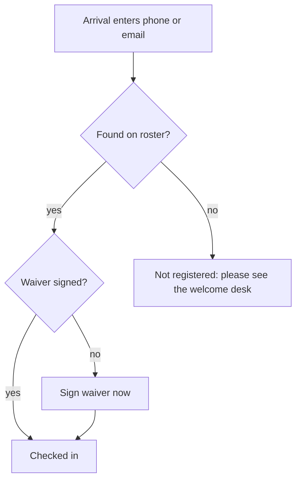

# Event Guest Roster & Phone/Email Check-in — Requirements

## Summary

Replace the email-only door check-in with a named-guest roster used for every event: each attendee (the lead included) is captured before the event with name + email or phone, and signs their own waiver. Guests self-register through a capped link the lead forwards. The door is a strict gate — people are found by phone or email and checked in; anyone not on the roster is not admitted and is sent to the welcome desk (self-rescue is staff-mediated, off the kiosk).

---

## Problem Frame

Today a multi-ticket purchase stores only the purchaser's name + email. Individual guests don't exist as records until they walk up and check themselves in by email. Now that ticket types are live, one lead routinely buys several tickets for guests the system has never seen.

That produces three failures at once: ops has no advance attendee list, guests can't be matched reliably at the door (people carry many emails and don't recall which they used), and there's no way to ensure every individual guest has signed the liability waiver. The current "no match → who invited you? → free-text" fallback papers over the gap but yields unverified, unstructured attendance data, and the per-event `strict_checkin` toggle was unworkable because there was no advance roster to be strict against — legitimate guests were never individually registered. An advance roster for every event plus a strict door fixes both: everyone is captured beforehand, and the door can safely refuse anyone not on it.

---

## Key Decisions

- **Roster of identified attendees, not anonymous tickets.** Each purchased ticket resolves to a named person (name + email or phone). The lead/purchaser is one of those attendees, not separate from the count.
- **Phone or email as identity, no verification.** A guest is matched on whichever contact they provided. Matching pulls up their record and honors a pre-signed waiver; it is also the access gate — only someone found on the roster is admitted. Phone is always captured with an enforced country code (stored E.164), so numbers compare cleanly across registration, self-registration, the door, and bulk import.
- **Strict door for every event, no per-event toggle.** The old `strict_checkin` setting and the "who invited you?" free-text/typeahead step are torn out and replaced by a single behaviour: the door is always strict. Only an attendee already on the roster is admitted; there is no door-time registration.
- **Not-found is a dead end on the kiosk; self-rescue is staff-mediated.** An unmatched arrival sees one screen — "please see the welcome desk" — with no links, QR, or event-type branching. The front desk, at its discretion, directs the person to register off-kiosk (public events page / member login, or the active members-only invite link); they register on their own device and are then found and checked in. The kiosk itself never registers, routes, or takes payment.
- **Registration captures phone alongside email.** Event registration (public and member) asks for a phone number as well as the (required) email, so every registrant/lead is on the roster and matchable at the door by phone or email — not just self-registered guests and imports.
- **Self-registration capped at purchased quantity.** A lead's shared link admits up to N self-registrations, then closes, so the roster can't exceed paid seats. Swapping a guest means freeing a slot.
- **Waiver signable early or at the door.** The self-registration link can capture the waiver ahead of time on the guest's own device; anyone who hasn't signed does so at check-in. The waiver is per attendee and mandatory.

---

## Actors

- A1. Lead / purchaser — buys N tickets, forwards the self-registration link, and is themselves an attendee.
- A2. Guest — a person under a lead's purchase who self-registers (name + email/phone) and signs the waiver.
- A3. Individual registrant — someone who registers for themselves via the members platform or public events page.
- A4. Door check-in surface — the ops-facing check-in kiosk/form at the event.
- A5. Admin / ops — bulk-loads rosters, manages events, and reads the attendee list.

---

## Key Flows

F1. Lead buys and distributes
- **Trigger:** Lead completes a purchase of N tickets.
- **Actors:** A1
- **Steps:** Purchase confirmed → confirmation email includes the guest self-registration link + a prompt to share it → lead forwards it to guests.
- **Outcome:** A shareable, capped roster link is in the lead's hands.

F2. Guest self-registration
- **Trigger:** Guest opens the shared link.
- **Actors:** A2
- **Steps:** Link checks remaining slots (< N used) → guest enters name + email or phone → optionally signs the waiver now → slot consumed.
- **Outcome:** A named roster entry exists; the waiver may already be signed.
- **Covered by:** R5, R6, R7

F3. Door check-in — recognized
- **Trigger:** Attendee arrives and enters phone or email at the door.
- **Actors:** A1/A2/A3, A4
- **Steps:** Match against this event's roster by phone/email → found → if the waiver is unsigned, sign now → confirm.
- **Outcome:** Checked in; ops attendee list updated.
- **Covered by:** R13, R14

F4. Door check-in — not found (strict)
- **Trigger:** An arrival's phone/email matches no roster entry.
- **Actors:** A4 (then, off-kiosk, A2/A3)
- **Steps:** Door shows one screen — "not registered, please see the welcome desk" — and admits no one. At the desk's discretion, staff direct the person to register off-kiosk (public events page / member login, or the active invite link); they register on their own device → re-enter their contact at the door → now found → checked in.
- **Outcome:** Not admitted until registered. The kiosk shows no registration links or options.
- **Covered by:** R15, R19

F5. June 6 bulk load
- **Trigger:** Admin has collected names/phones out-of-band.
- **Actors:** A5
- **Steps:** Admin imports the roster rows for the event → entries become matchable at the door.
- **Outcome:** Door check-in works without self-registration links being live.
- **Covered by:** R17

---

## Requirements

**Roster & identity**
- R1. Each purchased ticket corresponds to one roster entry identified by name plus at least one of email or phone.
- R2. The lead/purchaser counts as one of the N attendees, not an additional seat.
- R3. A roster entry records which registration/party it belongs to, so ops can see who came under whom.
- R4. Phone numbers are captured and stored in full international (E.164) form, with a country-code selector that enforces a valid code at every entry point — registration, self-registration, door check-in, and admin bulk import. The selector lists FR, CH, UK, DE, IT, ES first and supports type-to-filter for any other country. Email matching is case-insensitive; no verification step is required.
- R20. Event registration (public and member) captures a phone number alongside the required email, so every registrant/lead is on the roster and matchable by phone or email.

**Self-registration link**
- R5. A purchase produces a shareable self-registration link scoped to that registration.
- R6. The link admits at most N self-registrations (N = quantity purchased), then reports full.
- R7. A guest self-registers by providing name + email or phone; the waiver may be signed at this step.
- R8. Freeing a slot (removing a guest) makes one self-registration slot available again.
- R9. The purchaser's confirmation email includes the self-registration link and explicitly prompts the lead to share it with their guests.

**Waiver**
- R10. Every attendee signs the waiver individually; signing is mandatory before check-in is complete.
- R11. The waiver can be signed during self-registration or at the door; a guest who signed early is not asked again.
- R12. Waiver acceptance is recorded per attendee with its version and language (preserving the existing audit shape).

**Door check-in**
- R13. Check-in matches an arrival to a roster entry by phone or email — whichever is provided — tolerant of case and contact format.
- R14. A matched attendee with a signed waiver checks in immediately; a matched attendee without one signs, then checks in.
- R15. An unmatched arrival is not admitted; the kiosk shows only "not registered — please see the welcome desk" (no links, QR, options, or event-type branching). Self-rescue is staff-mediated and off-kiosk: staff may direct the person to register via the public events page / member login or share the active invite link; they register on their own device and are then found and checked in.
- R16. The per-event strict toggle (`strict_checkin`) and the "who invited you?" inviter step are removed.
- R19. Check-in is strict for every event by default — only an attendee already on the roster is admitted. Every event requires registration before arrival; there is no per-event strictness setting and no registration on the kiosk.

**Admin / ops**
- R17. Admin can bulk-load roster entries (name + phone/email) for an event whose roster was collected out-of-band.
- R18. Ops can view the full attendee list per event — name, phone/email, party/lead, waiver status, checked-in status — and export it.

---

## Acceptance Examples

- AE1. **Covers R13, R14.** Given a guest pre-registered with a phone number who signed the waiver early; When they enter that phone at the door; Then they are matched and checked in immediately without re-signing.
- AE2. **Covers R13, R14.** Given a guest pre-registered with email only and unsigned; When they enter that email at the door; Then they are matched, prompted to sign the waiver, and checked in.
- AE3. **Covers R15, R19.** Given any arrival not on the roster (public or members-only); When they attempt check-in; Then the kiosk shows only "please see the welcome desk" with no registration link or option.
- AE4. **Covers R6, R8.** Given a 4-ticket registration with 4 guests already self-registered; When a 5th person opens the link; Then the link reports full and admits no further self-registration until a slot is freed.
- AE5. **Covers R15.** Given a not-found arrival whom staff direct to register off-kiosk (public page / member login / active invite link); When they register on their own device and re-enter their contact; Then they are now found and checked in.

---

## Scope Boundaries

**Deferred for later**
- WhatsApp/SMS at the door — a "we didn't find you, here's a link" routing/notification channel, plus optional own-device waiver delivery. Useful later; not needed now.
- The self-registration link does not block June 6 — that event runs on a bulk-loaded roster, and the link can ship immediately after.

**Outside this scope**
- Phone/email verification (OTP, tap-to-verify) — explicitly not doing it.
- Any registration or payment on the check-in kiosk — the door is a strict gate; not-found is "see the welcome desk" and self-rescue happens off-kiosk at staff discretion.
- Per-guest individual confirmation/ticket emails — the lead receives one email, consistent with the existing registration design.

---

## Dependencies & Assumptions

- The existing registration surfaces (member platform registration + public events page) handle any off-kiosk self-rescue registration and payment; the door does not link to them — staff direct people verbally. Assumes those flows work in a phone browser.
- Phone numbers are collected free-form, so matching depends on consistent normalization. The manually collected June 6 data must be normalized on import or matching will miss.
- Removing the `strict_checkin` toggle and the inviter step (and making the door strict by default) touches existing check-in code and the admin check-in settings UI; existing check-in records that used those fields remain for history.
- The event on 2026-06-06 is imminent: the roster model + bulk import + phone/email door matching + per-attendee waiver are the critical path; the self-registration link is a fast-follow.
- Members-only events retain their existing invite link (`invite_code`) as ops's manual admit fallback.

---

## Outstanding Questions

**Deferred to planning**
- Mechanism for "freeing a slot" (lead-managed vs admin-only) and whether guests can edit their own entry.
- Exact welcome-desk copy and how front-desk staff are guided to direct off-kiosk self-rescue (printed card / staff note).
- Whether the attendee list groups by party/lead or stays flat with a party column.

---

## Sources / Research

- Check-in flow & matching: `components/public/EventCheckInForm.tsx`, `app/api/events/[id]/check-in/route.ts`, `app/api/events/[id]/check-in/match/route.ts`, `lib/events/checkin.ts`
- Inviter step (to be removed): `app/api/events/[id]/check-in/inviters/route.ts`, `supabase/migrations/20260520130000_event_checkins_invited_by.sql`
- Strict mode (to be removed): `supabase/migrations/20260520120000_event_checkins_and_strict_toggle.sql`, `components/admin/EventCheckInSettings.tsx`
- Waiver content & versioning: `lib/events/waiver.ts`, `event_checkins.waiver_*` columns
- Ticket types & registration: `supabase/migrations/20260526130000_event_ticket_types.sql`, `app/api/events/[id]/register/route.ts`, `lib/events/registration.ts`, `lib/events/ticket-types.ts`
- Phone storage today: `members.phone` only — no phone column on `event_registrations` or `event_checkins`
- Attendee list: `app/(admin)/admin/events/[id]/attendees/page.tsx`
- Prior brainstorm: `docs/brainstorms/2026-04-27-event-registration-requirements.md`
