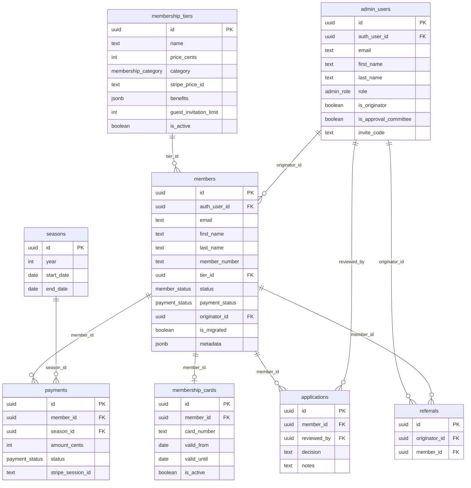

# GPC Social Members MVP

## Overview

Build the MVP of the Geneva Polo Club Social Member Club membership management system. Three interfaces: invitation-only signup flow, admin panel (approvals, member management, originator tracking), and member portal (dashboard, digital card, profile). Integrates Supabase Auth (magic link), Stripe (one-time payments), Postmark (transactional emails), and PWA (card home screen save).

**Database is fully deployed** — 8 tables, RLS policies, triggers, 39 migrated members seeded.

## Problem Statement / Motivation

The Geneva Polo Club needs a digital membership system before the 2026 season. Currently managing 39 members manually. The club needs:
- Invitation-only onboarding with originator (parrain) attribution
- Approval workflow for new applications
- Digital membership cards for fieldside check-in
- Payment collection via Stripe
- Admin visibility into members, tiers, and originators

## Tech Stack

| Layer | Technology | Notes |
|---|---|---|
| Framework | Next.js (App Router) | TypeScript, `output: 'standalone'` |
| Database | Supabase Postgres 17 | Schema deployed, RLS active |
| Auth | Supabase Auth (magic link) | `@supabase/ssr` for Next.js |
| Payments | Stripe | One-time checkout, EUR |
| Email | Postmark | Template-based transactional |
| Styling | Tailwind CSS + shadcn/ui | Brand fonts via Google Fonts |
| QR Codes | `qrcode.react` | SVG, brand-colored |
| PWA | Built-in Next.js manifest + service worker | No third-party packages |
| Hosting | Railway | Railpack auto-build, standalone output |

## Technical Approach

### Architecture

```
app/
├── (public)/                    # No auth required
│   ├── layout.tsx               # Public layout (minimal nav, footer)
│   ├── apply/[invite_code]/
│   │   └── page.tsx             # Signup flow
│   ├── login/
│   │   └── page.tsx             # Member login (magic link)
│   └── auth/
│       ├── confirm/route.ts     # Magic link PKCE callback
│       └── callback/route.ts    # Auth redirect handler
├── (admin)/                     # Admin auth required
│   ├── layout.tsx               # Admin layout (sidebar, admin nav)
│   ├── admin/
│   │   ├── login/page.tsx       # Separate admin login
│   │   ├── dashboard/page.tsx   # Admin overview
│   │   ├── applications/page.tsx # Application queue
│   │   ├── members/
│   │   │   ├── page.tsx         # Member list
│   │   │   └── [id]/page.tsx    # Member detail
│   │   ├── originators/page.tsx # Originator management
│   │   └── tiers/page.tsx       # Tier config
├── (member)/                    # Member auth required
│   ├── layout.tsx               # Member layout (nav, card shortcut)
│   ├── dashboard/page.tsx       # Member dashboard
│   ├── card/page.tsx            # Digital membership card
│   └── profile/page.tsx         # Profile management
├── api/
│   ├── webhooks/
│   │   └── stripe/route.ts      # Stripe webhook handler
│   ├── email/
│   │   ├── welcome/route.ts     # Send welcome + payment link
│   │   ├── approved/route.ts    # Approval notification
│   │   ├── declined/route.ts    # Decline notification
│   │   └── payment-confirmed/route.ts
│   ├── stripe/
│   │   └── checkout/route.ts    # Create checkout session
│   └── health/route.ts          # Railway health check
├── manifest.ts                  # PWA manifest
├── layout.tsx                   # Root layout (fonts, providers)
└── globals.css                  # Tailwind + brand tokens
components/
├── ui/                          # shadcn/ui components
├── public/                      # Signup form, public pages
├── member/                      # Member portal components
├── admin/                       # Admin panel components
└── card/                        # Digital card + QR components
lib/
├── supabase/
│   ├── client.ts                # Browser client (createBrowserClient)
│   ├── server.ts                # Server client (createServerClient)
│   ├── admin.ts                 # Service role client (for webhooks)
│   └── types.ts                 # Generated database types
├── stripe.ts                    # Stripe client + helpers
├── postmark.ts                  # Postmark client + send helpers
└── utils/
    ├── card.ts                  # Card number generation
    └── qr.ts                    # QR code helpers
middleware.ts                    # Supabase session refresh + route protection
types/
└── database.ts                  # Supabase generated types
public/
├── sw.js                        # Service worker
└── icons/                       # PWA icons (192x192, 512x512)
```

### Auth Architecture

**Two separate login pages, one auth system:**

```
Member: /login → magic link → /auth/confirm → check members table → /dashboard
Admin:  /admin/login → magic link → /auth/confirm → check admin_users table → /admin/dashboard
```

- `middleware.ts` refreshes Supabase session on every request using `getUser()` (never `getSession()`)
- `(member)/layout.tsx` verifies user exists in `members` table, redirects to `/login` if not
- `(admin)/layout.tsx` verifies user exists in `admin_users` table, redirects to `/admin/login` if not
- Supabase `auth.users` linked to `members.auth_user_id` and `admin_users.auth_user_id`
- On first magic link sign-in, a database trigger or auth callback links `auth.users.id` to the matching email in `members` or `admin_users`

**Critical:** Use `@supabase/ssr` with cookie-based sessions. The middleware pattern is mandatory for token refresh. Always call `getUser()` server-side, never trust `getSession()`.

### Stripe Flow

```
Admin approves application
  → status = 'approved'
  → API route creates Stripe Checkout Session (mode: 'payment', EUR)
  → Postmark sends welcome email with checkout URL
  → Member clicks link → Stripe hosted checkout
  → Payment succeeds → Stripe webhook fires checkout.session.completed
  → Webhook handler: update payments table, set member status = 'active'
  → Generate digital card (card_number + QR)
  → Postmark sends payment confirmation email
```

- One Stripe Product per tier, one Price each (one-time, EUR, amounts in cents)
- Store `stripe_price_id` on `membership_tiers` table
- Webhook uses `request.text()` (not `.json()`) for signature verification
- Free members: admin sets `status = 'active'` directly, payment record with `status: 'free'`, `amount: 0`

### Email Architecture

All emails sent from Next.js API routes via Postmark SDK (`postmark` package).

| Email | Trigger | Template Alias | Key Data |
|---|---|---|---|
| Application received | Member submits application | `application-received` | Member name, tier |
| Welcome + payment link | Admin approves | `member-approved` | Name, checkout URL |
| Application declined | Admin declines | `application-declined` | Name, notes |
| Payment confirmed | Stripe webhook | `payment-confirmed` | Name, tier, card number |

- Send from: `juliette@genevapolo.com`
- Use Postmark template aliases (not numeric IDs) — editable without redeployment
- Templates managed in Postmark dashboard

### Digital Card + PWA

**Card generation** on activation (`status = 'active'`):
- Generate `card_number`: `GPC-XXXX-XXXX` (random alphanumeric)
- Insert into `membership_cards` table
- QR code encodes URL: `{APP_URL}/verify/{card_number}`

**Card display** (`/card` page):
- Marine Blue `#052938` background
- Club crest, member name in Playfair Display
- Tier badge, member number `GPC-2026-XXXX`, validity dates
- QR code (SVG via `qrcode.react`, fgColor: `#052938`)

**PWA:**
- `app/manifest.ts` — name, icons, `display: 'standalone'`, theme color
- `public/sw.js` — cache card page for offline viewing
- Service worker registration in root layout client component
- Enables "Add to Home Screen" on mobile browsers

### Error Handling

| Scenario | Handling |
|---|---|
| Duplicate application (same email) | Check `members` table for existing email. Show "You already have an application" with status |
| Invalid invite code | Query `admin_users` for code. If not found, show branded error: "This invitation is no longer valid" |
| Expired magic link | Supabase returns error. Show "Link expired" with resend button |
| Payment failure | Stripe handles retry on their checkout page. Member status stays `approved` until webhook confirms |
| Mid-flow abandonment | `status = 'pending'` persists. Admin can see in application queue. No auto-cleanup needed for MVP |
| Webhook delivery failure | Stripe retries automatically. Idempotent handler (check if already processed before updating) |

---

## Implementation Phases

### Phase 1: Project Setup & Auth (Day 1)

**Foundation — get the app running with auth working end-to-end.**

- [ ] `npx create-next-app@latest` with TypeScript, Tailwind, App Router, src dir: no
- [ ] Install dependencies: `@supabase/supabase-js`, `@supabase/ssr`, `stripe`, `postmark`, `qrcode.react`
- [ ] `npx shadcn@latest init` — configure with brand colors
- [ ] Configure `next.config.ts` with `output: 'standalone'`
- [ ] Set up Google Fonts: Playfair Display, Poppins, Teko
- [ ] Create `globals.css` with brand CSS variables and Tailwind config
- [ ] **`lib/supabase/client.ts`** — browser client using `createBrowserClient`
- [ ] **`lib/supabase/server.ts`** — server client using `createServerClient` with cookie handlers
- [ ] **`lib/supabase/admin.ts`** — service role client for webhooks/admin operations
- [ ] **`middleware.ts`** — Supabase session refresh, route protection for `/dashboard`, `/card`, `/profile`, `/admin`
- [ ] **`app/(public)/login/page.tsx`** — member magic link login
- [ ] **`app/(admin)/admin/login/page.tsx`** — admin magic link login (separate page)
- [ ] **`app/auth/confirm/route.ts`** — PKCE token exchange callback
- [ ] **`app/auth/callback/route.ts`** — post-auth redirect logic (check admin_users vs members, redirect accordingly)
- [ ] **`types/database.ts`** — generate Supabase types with `npx supabase gen types typescript`
- [ ] **Route group layouts** — `(public)/layout.tsx`, `(member)/layout.tsx` (with auth check), `(admin)/layout.tsx` (with admin check)
- [ ] **`app/api/health/route.ts`** — simple health check for Railway
- [ ] `.env.local` with Supabase + app URL variables

**Acceptance:** Can login as member → see member layout. Login as admin → see admin layout. Unauthenticated users redirected to login.

### Phase 2: Signup Flow (Day 1-2)

**The invitation-only application page.**

- [ ] **`app/(public)/apply/[invite_code]/page.tsx`** — Server Component that validates invite code
- [ ] Query `admin_users` where `invite_code` matches and `is_originator = true`
- [ ] If invalid: show branded error page ("This invitation is no longer valid")
- [ ] If valid: render application form with originator name visible
- [ ] **`components/public/ApplicationForm.tsx`** — Client Component
  - Fields: title (Mr/Mrs select), first name, last name, email, phone, company (optional), role (optional), connection note (textarea), tier selection (radio/cards)
  - Tier options fetched from `membership_tiers` (individual tiers only, `category = 'individual'`)
  - Client-side validation (required fields, email format, phone format)
  - On submit: insert into `members` table with `status = 'pending'`, `originator_id`, `tier_id`
  - Duplicate email check before insert
  - Success: show confirmation page ("Your application has been received")
- [ ] **Error states:** duplicate email, network failure, invalid data
- [ ] **Brand styling:** Marine Blue dominant, Sky Blue accents, Playfair headings, Poppins body, fieldside photography placeholder

**Acceptance:** Originator shares link → prospect fills form → application appears in `members` table with `status = 'pending'` and correct `originator_id`.

### Phase 3: Admin Panel (Day 2-3)

**Core admin functionality — the control center.**

#### 3a. Admin Layout & Dashboard

- [ ] **`app/(admin)/layout.tsx`** — sidebar navigation, admin name/role display, logout
- [ ] **`app/(admin)/admin/dashboard/page.tsx`** — overview stats:
  - Pending applications count
  - Active members count
  - Members by tier breakdown
  - Recent activity feed

#### 3b. Application Queue

- [ ] **`app/(admin)/admin/applications/page.tsx`** — list pending applications
  - Show: name, email, tier, originator, date applied
  - Filter: pending only (default), all statuses
  - Sort: newest first
- [ ] **Approve action:** sets `status = 'approved'`, creates `applications` audit entry, triggers email + Stripe checkout creation
- [ ] **Decline action:** sets `status = 'declined'`, creates `applications` audit entry with decline notes, triggers decline email
- [ ] Only visible to admins with `is_approval_committee = true` or `role = 'super_admin'`

#### 3c. Member Database

- [ ] **`app/(admin)/admin/members/page.tsx`** — full member list
  - Columns: name, email, tier, status, originator, joined date, renewal date
  - Search: by name, email, member number
  - Filter: by tier, status, originator, join date range
  - Sort: by any column
  - CSV export button
- [ ] **`app/(admin)/admin/members/[id]/page.tsx`** — member detail
  - Profile info, membership dates, tier, status
  - Payment history (from `payments` table)
  - Originator attribution
  - Edit member details, change tier, update status
  - Manual status transitions with confirmation

#### 3d. Originator Management

- [ ] **`app/(admin)/admin/originators/page.tsx`**
  - List all `admin_users` where `is_originator = true`
  - Show: name, invite code, invite link, referral count, referred members list
  - Super admin sees all originators
  - Team admin with `is_originator` sees only own data (enforced by RLS)
  - Copy invite link button

#### 3e. Tier Management

- [ ] **`app/(admin)/admin/tiers/page.tsx`**
  - List all tiers with: name, price, category, benefits, guest limit, active status
  - Edit tier details (name, price, benefits, guest invitations)
  - Toggle tier active/inactive
  - Link/update Stripe price ID
  - Super admin only

#### 3f. Member CRUD

- [ ] **Create member manually** — form in admin panel for walk-ins/special cases
  - Same fields as application form + ability to set status directly
  - Option to mark as free (no payment required)
- [ ] **Bulk operations** — select multiple members for:
  - Send renewal reminders
  - Status changes (e.g., expire all from previous season)

**Acceptance:** Admin can log in, see pending applications, approve/decline, manage members, view originators, edit tiers.

### Phase 4: Stripe Integration (Day 3)

**Payments — connect approval to checkout to activation.**

- [ ] **`lib/stripe.ts`** — Stripe client initialization
- [ ] **Stripe Dashboard setup:**
  - Create 5 Products (Classic, Elite, Corporate S/M/L)
  - Create 5 Prices (EUR: 50000, 100000, 300000, 600000, 1200000 cents)
  - Store `stripe_price_id` in `membership_tiers` table
  - Set up webhook endpoint pointing to `{APP_URL}/api/webhooks/stripe`
- [ ] **`app/api/stripe/checkout/route.ts`** — create Checkout Session
  - Input: `member_id`
  - Lookup member + tier + stripe_price_id
  - Create session with `mode: 'payment'`, `customer_email`, `metadata: { member_id }`
  - Return checkout URL
- [ ] **`app/api/webhooks/stripe/route.ts`** — webhook handler
  - Verify signature with `request.text()` + `constructEvent()`
  - On `checkout.session.completed`:
    - Extract `member_id` from metadata
    - Insert payment record in `payments` table
    - Update member `status = 'active'`, set `payment_status = 'paid'`
    - Generate digital card (card_number, insert into `membership_cards`)
    - Trigger payment confirmation email
  - Idempotent: check if payment already recorded before processing
- [ ] **Free member handling** — admin action that:
  - Sets `status = 'active'` directly
  - Inserts payment with `status: 'free'`, `amount: 0`
  - Generates digital card
  - Sends welcome email (no payment link)

**Acceptance:** Approve member → checkout link generated → pay on Stripe → webhook fires → member activated → card generated.

### Phase 5: Member Portal (Day 3-4)

**The member-facing experience after login.**

#### 5a. Dashboard

- [ ] **`app/(member)/dashboard/page.tsx`**
  - Welcome message: "Welcome, {first_name}" in Playfair Display
  - Membership card preview (compact, links to full card)
  - Status badge (active, approved pending payment, etc.)
  - Tier name and benefits summary
  - Season calendar (static for MVP — 2026 season dates from `seasons` table)

#### 5b. Digital Card

- [ ] **`app/(member)/card/page.tsx`**
  - Full-screen card view optimized for mobile
- [ ] **`components/card/MembershipCard.tsx`**
  - Marine Blue `#052938` background
  - Club crest/logo (top)
  - Member name in Playfair Display Bold
  - Tier badge (Sky Blue `#95CEE1`)
  - Member number: `GPC-2026-XXXX`
  - Valid from / Valid until dates
  - QR code (SVG, `qrcode.react`, fgColor brand blue, encodes `/verify/{card_number}`)
  - Season year
- [ ] Responsive: looks good on all phone sizes
- [ ] Card page cached by service worker for offline viewing

#### 5c. Profile

- [ ] **`app/(member)/profile/page.tsx`**
  - View/edit: name, email, phone, company, role
  - Communication preferences (email/SMS toggles — stored in `members.metadata`)
  - Change email triggers Supabase `updateUser` + re-verification

#### 5d. Referral Link (conditional)

- [ ] If member's email matches an `admin_users` record with `is_originator = true`:
  - Show invite link and invite code
  - Count of referred members with their status

**Acceptance:** Member logs in → sees dashboard → views digital card with QR → can edit profile.

### Phase 6: Postmark Emails (Day 4)

**Transactional emails — connect all the triggers.**

- [ ] **`lib/postmark.ts`** — Postmark `ServerClient` initialization
- [ ] **Create 4 Postmark templates** in dashboard:
  - `application-received` — confirmation to applicant
  - `member-approved` — welcome + Stripe checkout URL
  - `application-declined` — gentle decline with notes
  - `payment-confirmed` — receipt + "your card is ready" with portal link
- [ ] **`app/api/email/welcome/route.ts`** — called after approval, sends approved template with checkout URL
- [ ] **`app/api/email/declined/route.ts`** — called after decline
- [ ] **`app/api/email/payment-confirmed/route.ts`** — called from Stripe webhook handler
- [ ] All emails sent from `juliette@genevapolo.com`
- [ ] Use `sendEmailWithTemplate()` with template aliases
- [ ] Error handling: log failures, don't block approval/payment flow if email fails

**Acceptance:** Approve → welcome email arrives. Decline → decline email arrives. Pay → confirmation email arrives.

### Phase 7: PWA + Polish (Day 4-5)

**Make the card saveable and polish the experience.**

- [ ] **`app/manifest.ts`** — PWA manifest
  - name: "Geneva Polo Club"
  - short_name: "Geneva Polo Club"
  - start_url: "/card"
  - display: "standalone"
  - theme_color: "#052938"
  - background_color: "#052938"
  - Icons: 192x192 and 512x512 (club crest)
- [ ] **`public/sw.js`** — service worker
  - Cache card page and assets for offline viewing
  - Network-first strategy for API calls
  - Cache-first for static assets
- [ ] **`components/ServiceWorkerRegistration.tsx`** — client component in root layout
- [ ] **"Add to Home Screen" prompt** on card page — subtle banner for mobile users
- [ ] **Responsive polish** — test all pages on mobile viewports
- [ ] **Loading states** — skeleton loaders for data-fetching pages
- [ ] **Error boundaries** — `error.tsx` and `not-found.tsx` for each route group
- [ ] **Brand consistency pass** — verify all pages follow brand identity guidelines

**Acceptance:** Can add card to phone home screen. Opens standalone. Card visible offline.

### Phase 8: Railway Deployment (Day 5)

**Ship it.**

- [ ] **`next.config.ts`** — `output: 'standalone'`
- [ ] **`package.json`** — start script: `node .next/standalone/server.js`
- [ ] Optional: **`Dockerfile`** for optimized builds (multi-stage, ~77MB image)
- [ ] **Railway project setup:**
  - Create project + service
  - Connect GitHub repo
  - Set environment variables (Supabase URL, keys, Stripe keys, Postmark token, APP_URL)
  - Set `HOSTNAME=0.0.0.0` (critical for Railway health checks)
  - Set `PORT=3000`
- [ ] **Stripe webhook:** update endpoint URL to production Railway URL
- [ ] **Postmark:** verify sending domain
- [ ] **Supabase:** add Railway URL to auth redirect allowlist
- [ ] **Custom domain** (if ready): configure in Railway + DNS
- [ ] **Smoke test:** full flow — apply → approve → pay → card visible

**Acceptance:** App live on Railway. Full signup → approval → payment → card flow works end-to-end.

---

## ERD — Database Schema (Already Deployed)



---

## Dependencies & Prerequisites

| Dependency | Status | Action Needed |
|---|---|---|
| Supabase project | Done | Schema deployed, 39 members seeded |
| Stripe account | Exists | Create products/prices, set up webhook |
| Postmark account | Exists | Create 4 templates, verify sending domain |
| Railway account | Exists | Create project, connect repo |
| Brand assets | Partial | Need club crest/logo files (PNG/SVG) |
| Placeholder photos | Needed | Fieldside, club, candid photography |

## Risk Analysis

| Risk | Impact | Mitigation |
|---|---|---|
| Supabase magic link email delivery | High — users can't log in | Monitor Supabase auth logs. Have backup: admin can manually activate |
| Stripe webhook reliability | High — payments not recorded | Idempotent handler + manual reconciliation option in admin panel |
| Tight timeline (7 days) | Medium — might not ship all features | Phase priorities: auth → signup → admin → stripe → portal. PWA/polish can slip |
| 39 migrated members need auth_user_id | Medium — existing members can't log in | On first magic link login, callback links auth.users.id to members.email |
| Brand assets not ready | Low — placeholders work | Use placeholder images, real logo if available |

## Key Packages

```json
{
  "dependencies": {
    "@supabase/supabase-js": "^2",
    "@supabase/ssr": "^0.5",
    "stripe": "^20",
    "postmark": "^4",
    "qrcode.react": "^4",
    "next": "^15",
    "react": "^19",
    "react-dom": "^19",
    "tailwindcss": "^4"
  },
  "devDependencies": {
    "typescript": "^5",
    "supabase": "^1"
  }
}
```

Note: shadcn/ui components are copied into the project via CLI, not installed as a dependency.

## References

- [Supabase: Next.js Server-Side Auth](https://supabase.com/docs/guides/auth/server-side/nextjs)
- [Supabase: Magic Link Auth](https://supabase.com/docs/guides/auth/auth-email-passwordless)
- [Stripe: Checkout Sessions API](https://docs.stripe.com/api/checkout/sessions/create)
- [Stripe: Webhook Signing (Next.js App Router)](https://github.com/stripe/stripe-node/blob/master/examples/webhook-signing/nextjs/app/api/webhooks/route.ts)
- [Postmark: Send with Templates](https://postmarkapp.com/developer/user-guide/send-email-with-api)
- [Next.js: PWA Guide](https://nextjs.org/docs/app/guides/progressive-web-apps)
- [Railway: Next.js Deployment](https://docs.railway.com/guides/nextjs)
- [qrcode.react](https://github.com/zpao/qrcode.react)
- Brainstorm: `docs/brainstorms/2026-03-24-gpc-social-members-mvp-brainstorm.md`
- Handoff: `GPC_SOCIAL_MEMBERS_HANDOFF.md`
