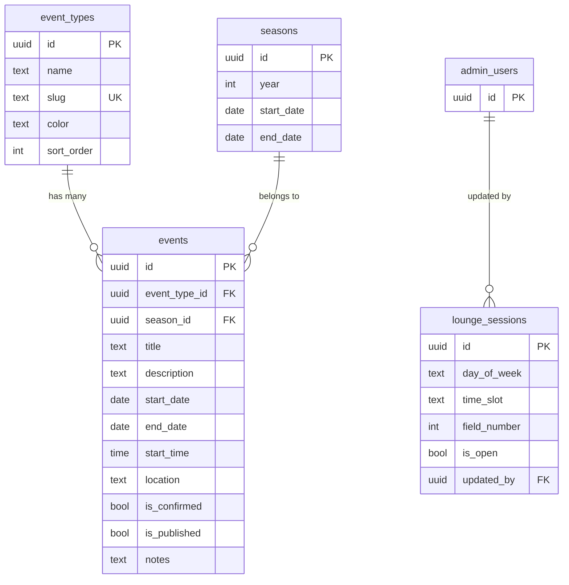

# Events Calendar & Lounge Status Notifications

## Overview

Two related features for the GPC Social Members platform:

1. **Events Calendar** — A manageable schedule of club events (tournaments, social gatherings, dinners, tastings, etc.) displayed to members. Admins create/edit/delete events with type categorization. Members see upcoming events on their dashboard and a dedicated calendar page.

2. **Lounge Status Notifications** — A dashboard notification card telling members when the fieldside lounge will next be open (Wed PM, Sat AM, Sun AM), on which field (1 or 2). Admins toggle availability per session.

## Problem Statement / Motivation

Members currently have no way to see upcoming events or know when the lounge is open without checking WhatsApp. The tournament schedule exists only as a PDF. Admins have no tool to manage events or communicate lounge availability through the platform.

## Proposed Solution

### Data Model

#### `event_types` table

Categorizes events. Seeded with initial types, admin can add more later.

```sql
CREATE TABLE event_types (
  id uuid PRIMARY KEY DEFAULT gen_random_uuid(),
  name text NOT NULL,              -- e.g. "Tournament", "Social", "Dinner", "Tasting"
  slug text NOT NULL UNIQUE,       -- e.g. "tournament", "social"
  color text NOT NULL DEFAULT '#5BA4C9', -- hex color for calendar badges
  sort_order integer NOT NULL DEFAULT 0,
  created_at timestamptz NOT NULL DEFAULT now()
);
```

**Seed data:**
| name | slug | color |
|---|---|---|
| Tournament | tournament | #052938 (marine) |
| Social | social | #5BA4C9 (sky) |
| Dinner | dinner | #8B6914 (gold) |
| Tasting | tasting | #7B2D3B (wine) |
| Wellness | wellness | #4A7C59 (green) |

#### `events` table

Individual events managed by admins, displayed to members.

```sql
CREATE TABLE events (
  id uuid PRIMARY KEY DEFAULT gen_random_uuid(),
  event_type_id uuid NOT NULL REFERENCES event_types(id),
  season_id uuid REFERENCES seasons(id) ON DELETE SET NULL,
  title text NOT NULL,                -- e.g. "Daisy Cup"
  description text,                   -- optional longer description
  start_date date NOT NULL,
  end_date date,                      -- null for single-day events
  start_time time,                    -- optional, e.g. 14:00
  location text,                      -- e.g. "Field 1", "Clubhouse"
  is_confirmed boolean NOT NULL DEFAULT true,
  is_published boolean NOT NULL DEFAULT true,
  notes text,                         -- admin-only notes
  created_at timestamptz NOT NULL DEFAULT now(),
  updated_at timestamptz NOT NULL DEFAULT now()
);

-- Index for member-facing queries (upcoming published events)
CREATE INDEX idx_events_published_date ON events (start_date) WHERE is_published = true;
```

**Seed data from tournament PDF:**
| title | start_date | end_date | is_confirmed | type |
|---|---|---|---|---|
| Daisy Cup | 2026-05-16 | 2026-05-17 | false | tournament |
| Season Open | 2026-06-05 | 2026-06-07 | true | tournament |
| Solstice Cup | 2026-06-20 | 2026-06-21 | false | tournament |
| Sun Cup | 2026-07-11 | 2026-07-12 | false | tournament |
| Fire & Ice Cup | 2026-08-29 | 2026-08-30 | false | tournament |
| Season Finale | 2026-09-11 | 2026-09-13 | true | tournament |

#### `lounge_sessions` table

Three fixed rows representing the recurring lounge slots. Admin toggles them on/off and sets the field.

```sql
CREATE TABLE lounge_sessions (
  id uuid PRIMARY KEY DEFAULT gen_random_uuid(),
  day_of_week text NOT NULL CHECK (day_of_week IN ('wednesday', 'saturday', 'sunday')),
  time_slot text NOT NULL CHECK (time_slot IN ('am', 'pm')),
  field_number integer NOT NULL DEFAULT 1 CHECK (field_number IN (1, 2)),
  is_open boolean NOT NULL DEFAULT false,
  updated_by uuid REFERENCES admin_users(id),
  updated_at timestamptz NOT NULL DEFAULT now()
);

-- Seed the three fixed sessions
INSERT INTO lounge_sessions (day_of_week, time_slot, field_number, is_open) VALUES
  ('wednesday', 'pm', 1, false),
  ('saturday', 'am', 1, false),
  ('sunday', 'am', 1, false);
```

### ERD



### Admin Pages

#### Events Management — `app/(admin)/admin/events/page.tsx`

**Pattern:** Server component fetches events + event_types → passes to `EventManager` client component (following the `TierManager` / `MemberList` pattern).

**Component:** `components/admin/EventManager.tsx`

**Features:**
- List view of all events, grouped by season or sorted by date
- Filter by event type, confirmed/unconfirmed, published/unpublished
- Create new event: title, type (dropdown), start/end dates, time, location, confirmed toggle, published toggle, notes
- Edit existing event inline or in a modal
- Delete event with confirmation
- Badge showing event type with color dot

**API routes:**
- `POST /api/admin/events/create` — create event
- `POST /api/admin/events/update` — update event
- `POST /api/admin/events/delete` — delete event

**Nav entry:** Add "Events" to `AdminSidebar.tsx` navLinks, visible to `team_admin` and `super_admin`.

#### Lounge Status — `app/(admin)/admin/lounge/page.tsx`

**Pattern:** Same server component → client component pattern.

**Component:** `components/admin/LoungeManager.tsx`

**Features:**
- Three cards, one per session (Wed PM, Sat AM, Sun AM)
- Each card has: toggle switch for open/closed, field selector (1 or 2)
- Shows "Last updated by [name] at [time]"
- Changes save immediately on toggle (no save button needed)

**API route:**
- `POST /api/admin/lounge/update` — update session (is_open, field_number)

**Nav entry:** Add "Lounge" to `AdminSidebar.tsx` navLinks, visible to `team_admin` and `super_admin`.

### Member-Facing Pages

#### Events Schedule — `app/(member)/events/page.tsx`

**Active members only** (same gating pattern as `/card` and `/regulations`).

**Design:**
- Section header: "SEASON CALENDAR" with ornament styling
- List of upcoming published events, grouped by month
- Each event shows: colored type badge, title, date range, location, and "dates TBC" if not confirmed
- Past events greyed out or hidden

#### Dashboard Integration

**Upcoming Events card** — new card in the dashboard grid (active members only):
- Shows next 2-3 upcoming published events
- Each with type badge, title, date
- "View full calendar →" link to `/events`

**Lounge Status card** — new card in the dashboard grid (active members only):
- Header: "Fieldside Lounge"
- Shows which sessions are open this week: e.g. "Wed PM — Field 1", "Sat AM — Field 2"
- If no sessions open: "No lounge sessions scheduled this week"
- Styled as a notification/info card

## Technical Considerations

- **FK constraints:** Use `ON DELETE CASCADE` where appropriate (events → event_types). Use `ON DELETE SET NULL` for season_id (events survive season deletion).
- **Types:** Add `events`, `event_types`, and `lounge_sessions` to `types/database.ts` following the Row/Insert/Update triple pattern.
- **Admin client:** Untyped (`createAdminClient()` with no generic), so queries work immediately. Types are for editor support only.
- **SDK lazy init:** Not applicable here (no Stripe/Postmark for this feature).
- **Migrations:** Use Supabase MCP `apply_migration` for all DDL + seed data.

## Acceptance Criteria

### Events Calendar
- [ ] `event_types` and `events` tables created with seed data (6 tournaments from PDF)
- [ ] Admin can create, edit, and delete events with type categorization
- [ ] Admin can toggle confirmed/published status
- [ ] Admin "Events" nav item added to sidebar
- [ ] Member events page shows upcoming published events grouped by month
- [ ] Dashboard shows next 2-3 upcoming events card
- [ ] Non-active members cannot access events page

### Lounge Status
- [ ] `lounge_sessions` table created with 3 seed rows
- [ ] Admin can toggle open/closed and select field per session
- [ ] Admin "Lounge" nav item added to sidebar
- [ ] Dashboard shows lounge status card for active members
- [ ] Card displays open sessions with field numbers

## Implementation Phases

### Phase 1: Database & Types
1. Create migrations: `event_types`, `events`, `lounge_sessions` tables
2. Seed event types and tournament schedule
3. Seed lounge sessions (3 rows)
4. Update `types/database.ts`

### Phase 2: Admin — Events
1. API routes: create, update, delete events
2. `EventManager` client component
3. Admin events page
4. Sidebar nav entry

### Phase 3: Admin — Lounge
1. API route: update lounge session
2. `LoungeManager` client component
3. Admin lounge page
4. Sidebar nav entry

### Phase 4: Member — Events
1. Events schedule page (`/events`) with active-only gating
2. Dashboard "Upcoming Events" card
3. Dashboard "Lounge Status" card

## References

### Codebase Patterns
- Admin CRUD pattern: `app/(admin)/admin/tiers/page.tsx` + `components/admin/TierManager.tsx`
- API route pattern: `app/api/admin/tiers/` directory
- Dashboard card pattern: `app/(member)/dashboard/page.tsx:84-183`
- Active-only gating: `app/(member)/card/page.tsx:23-25`
- Admin sidebar nav: `components/admin/AdminSidebar.tsx:26-53`
- Seasons table query: `app/(member)/dashboard/page.tsx:48-54`

### Institutional Learnings
- FK cascade requirement: `docs/solutions/database-issues/supabase-member-deletion-missing-cascade-fk-constraints.md`
- SDK lazy init: `docs/solutions/build-errors/third-party-sdk-env-vars-at-module-load.md`
