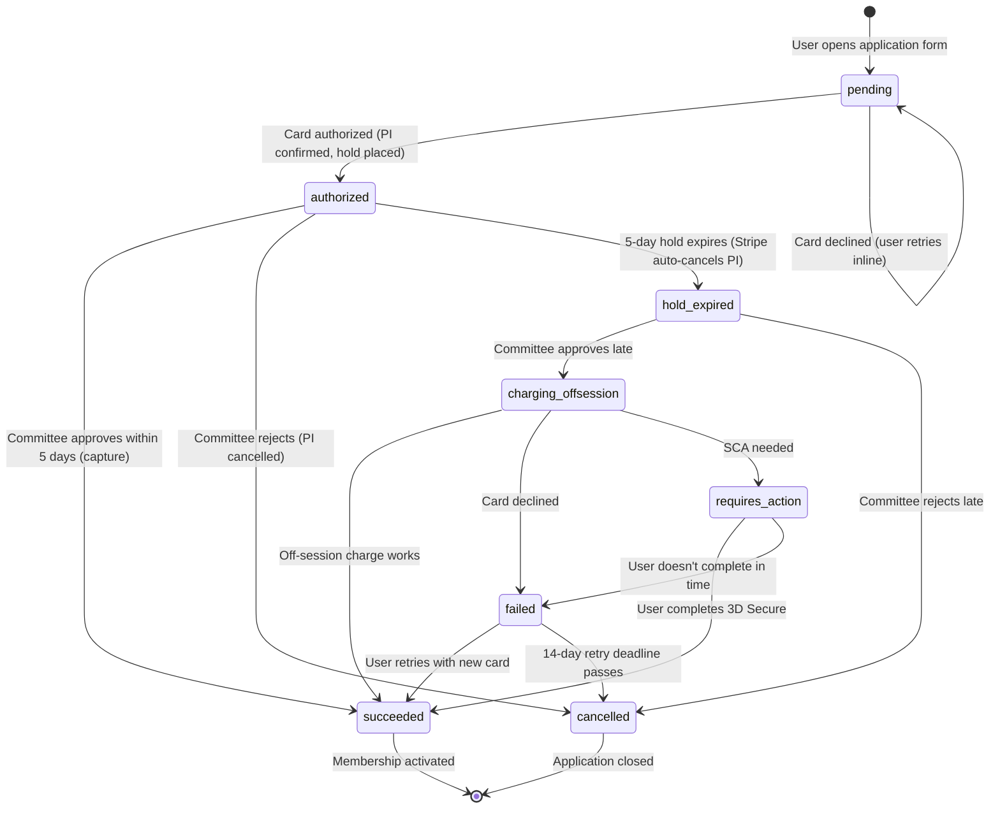

# feat: Stripe PaymentIntent manual capture for membership applications

## Overview

Replace the current two-step onboarding payment flow (apply → approve → user returns to pay via Checkout Session) with a single-step flow where card details are captured at application time using Stripe PaymentIntent with manual capture. The committee has a 5-day window to approve (guaranteed capture) or reject (release hold). If the window expires, the saved PaymentMethod enables an off-session charge as a fallback.

## Problem Frame

Today, after committee approval, applicants receive an email with a Checkout Session link and must return to pay. This creates drop-off: approved members who never complete payment. The new flow eliminates this friction — payment is authorized upfront and captured automatically upon approval.

The 5-day authorization hold is a Stripe/Visa constraint (not arbitrary). The hybrid approach (manual capture within window, off-session fallback after) handles this gracefully.

(see origin: `docs/GPC_STRIPE_PAYMENT_PLAN.md`)

## Requirements Trace

- R1. Card details collected at application time; no charge until committee approval
- R2. PaymentIntent with `capture_method: "manual"` + `setup_future_usage: "off_session"` for dual-purpose authorization
- R3. Committee approves within 5 days → instant capture (guaranteed funds)
- R4. Committee rejects → hold released, card never charged
- R5. Hold expires without action → status transitions to `hold_expired`; off-session charge on saved PaymentMethod if later approved
- R6. Off-session charge failure → applicant emailed with retry link (14-day deadline)
- R7. SCA re-authentication handling for off-session charges requiring `requires_action`
- R8. Committee reminder emails at day 1, 3, 4 based on `capture_before` from Stripe
- R9. Explicit consent checkbox with exact fee amount before card authorization
- R10. Idempotency on all Stripe operations (creation, capture, off-session)
- R11. Webhook-driven state transitions for `payment_intent.succeeded`, `.payment_failed`, `.canceled`, `.requires_action`, `.amount_capturable_updated`
- R12. Existing Checkout Session flow preserved for renewals and in-flight approved-but-unpaid members
- R13. Currency: CHF (Swiss Francs) — the `_eur` column names are a misnomer; the actual currency is CHF (confirmed by `formatPrice` in `ApplicationForm.tsx` which formats as CHF). Column rename is deferred — cosmetic, not functional

## Scope Boundaries

- Renewals stay on Checkout Sessions — no changes to renewal flow
- No TWINT support (TWINT does not support manual capture)
- No subscription/recurring billing — one-time membership payments only
- Corporate membership sub-member payment handled in a future phase
- No Stripe Customer deduplication for re-applicants (create new Customer each time; dedup is a future concern)
- PaymentMethod health check before off-session charge is a future enhancement
- Column rename (`price_eur` → `price`, `amount_eur` → `amount`) is deferred to a separate migration — cosmetic change with high blast radius (~17 files) and no functional benefit for this feature

## Context & Research

### Relevant Code and Patterns

- `lib/stripe.ts` — lazy singleton `getStripe()` (must follow this pattern for any new Stripe usage)
- `lib/postmark.ts` — `sendEmail({ to, templateAlias, templateModel })` with Mustachio templates
- `app/api/webhooks/stripe/route.ts` — existing webhook handler (currently `checkout.session.completed` only)
- `app/api/admin/applications/approve/route.ts` — current approve endpoint (no Stripe awareness)
- `app/api/admin/applications/decline/route.ts` — current decline endpoint (no Stripe awareness)
- `components/admin/ApplicationQueue.tsx` — admin approve/decline UI with fire-and-forget email calls
- `components/public/ApplicationForm.tsx` — current form (no payment fields)
- `app/(public)/apply/[invite_code]/actions.ts` — `submitApplication()` server action
- `lib/cron/scheduler.ts` — `node-cron` scheduler pattern via `instrumentation.ts`
- `lib/cron/payment-reminders.ts` / `renewal-reminders.ts` — existing cron patterns with `email_settings` config
- `types/database.ts` — TypeScript types (already out of sync with DB — needs regeneration)

### Institutional Learnings

- **Stripe webhook metadata**: Never use boolean string flags as control-flow signals across the Stripe async boundary. Use data-driven conditions — check for presence of actual IDs, not separate flags. Always add structured logging at top of webhook handlers. (from `docs/solutions/logic-errors/stripe-webhook-metadata-missing-skips-cleanup.md`)
- **SDK lazy init**: All Stripe/Postmark clients must use lazy getter functions, never module-scope instantiation. (from `docs/solutions/build-errors/third-party-sdk-env-vars-at-module-load.md`)
- **Postmark Mustachio**: No `{{#if}}` — use `{{#key}}...{{/key}}`. Pass `null` not `""` for absent values. Use `{{.}}` inside section blocks for the scoped value. (from `docs/solutions/integration-issues/postmark-mustachio-conditional-syntax.md`)
- **Email buttons**: Always use `color: #FFFFFF !important` and inline styles. Copy button HTML from existing templates. (from `docs/solutions/ui-bugs/email-button-text-color-email-client-rendering.md`)
- **Admin notifications**: Use `Promise.all` for parallel sends. Log failures but never block user-facing flow. (from `docs/solutions/integration-issues/postmark-admin-notification-on-membership-application.md`)
- **FK cascades**: New tables referencing `members.id` must explicitly declare cascade intent. (from `docs/solutions/database-issues/supabase-member-deletion-missing-cascade-fk-constraints.md`)

### External References

- [Stripe: Place a hold on a payment method](https://docs.stripe.com/payments/place-a-hold-on-a-payment-method) — manual capture lifecycle
- [Stripe: Save during payment](https://docs.stripe.com/payments/save-during-payment) — `setup_future_usage` behavior
- [Stripe: Payment Element](https://docs.stripe.com/payments/payment-element) — recommended over legacy Card Element
- [Stripe: Idempotent Requests](https://docs.stripe.com/api/idempotent_requests) — key format and 24h TTL
- Stripe `payment_intent.amount_capturable_updated` is the definitive signal that authorization hold is in place
- CHF 1,500+ will always trigger SCA (3D Secure) for Swiss/EU cards — Payment Element handles this automatically
- Off-session charges at this amount will NOT qualify for TRA exemption — expect some `requires_action` responses
- Off-session `confirm: true` throws `StripeCardError` with `code: "authentication_required"` synchronously — must catch at call site in addition to webhook

## Key Technical Decisions

- **Payment state on `payments` table** (not `members`): The `payments` table is extended with authorization lifecycle columns. This supports future originator commission attribution and accounting features. The `members` table gets only `stripe_customer_id` and consent fields. (User decision — future accounting/commission system planned)
- **Payment Element over Card Element**: Card Element is legacy. Payment Element with raw PaymentIntents (not Checkout Sessions) gives full lifecycle control needed for manual capture.
- **Deferred intent pattern**: `<Elements>` initialized with `mode`/`amount`/`currency` — PaymentIntent created server-side only when user submits. Avoids abandoned-intent clutter and faster initial render.
- **Webhook-primary for hold expiry** (not hourly cron): Stripe sends `payment_intent.canceled` when holds expire. Use this as the primary trigger with a lightweight daily safety cron to catch missed webhooks. Avoids in-memory cron state issues on Railway restarts.
- **Renewals stay on Checkout Sessions**: No committee approval step for renewals — Checkout Sessions work fine. No changes to renewal flow.
- **CHF currency**: The `_eur` column names are a misnomer (code already formats as CHF). Column rename deferred to a separate migration — high blast radius (~17 files) for cosmetic change. New payment records use CHF amounts in the existing `amount_eur` column.
- **Optimistic locking on approve/decline**: Use `.eq("status", "pending")` conditional update to prevent race conditions between concurrent committee members.
- **Backward compatibility for in-flight members**: Members with `status: "approved"` and no `stripe_payment_intent_id` in their payment record continue through the existing Checkout Session flow. Old endpoints remain functional for these cases.

## Open Questions

### Resolved During Planning

- **Where does payment state live?** → On `payments` table (extended), not `members`. Future accounting/commission system needs this separation.
- **Currency?** → CHF. Column rename deferred (cosmetic, ~17 files affected). New code uses CHF amounts in existing `_eur` columns.
- **Hold expiry detection?** → Webhook primary + daily safety cron.
- **Renewals?** → Stay on Checkout Sessions.
- **Payment Element or Card Element?** → Payment Element (Card Element is legacy, per Stripe guidance).
- **Client secret vs deferred intent?** → Deferred intent pattern — avoids abandoned PaymentIntents.
- **`payment_intent.amount_capturable_updated` role?** → This is the definitive webhook signal that authorization is in place. Used to store `capture_before` and confirm `authorized` status.
- **What about `captured` vs `succeeded` states?** → Collapse to one: manual capture fires `payment_intent.succeeded` immediately on capture. No observable `captured` intermediate state. Simplify the state machine.

### Deferred to Implementation

- Exact Postmark template alias names for new emails (committee reminders, hold expiry, retry link, SCA completion)
- Whether `@stripe/react-stripe-js` Elements remount issue (GitHub #313) affects this Next.js version — test during implementation
- Exact consent checkbox copy — the spec provides a template but legal review may adjust wording
- How to extract `capture_before` — it's on `latest_charge.payment_method_details.card.capture_before`; may need to expand the charge in the webhook payload or re-fetch

## High-Level Technical Design

> *This illustrates the intended approach and is directional guidance for review, not implementation specification. The implementing agent should treat it as context, not code to reproduce.*



**Key flows through the system:**

```
APPLICATION SUBMIT:
  Browser → POST /api/stripe/create-payment-intent → Stripe PI (manual capture)
  Browser → stripe.confirmPayment() → 3D Secure if needed → PI status: requires_capture
  Webhook: payment_intent.amount_capturable_updated → store capture_before, set authorized

APPROVE (within 5 days):
  Admin UI → POST /api/admin/applications/approve → stripe.paymentIntents.capture()
  Webhook: payment_intent.succeeded → activate membership, issue card, welcome email

APPROVE (after hold expiry):
  Admin UI → POST /api/admin/applications/approve → stripe.paymentIntents.create(off_session)
  → Success: webhook activates membership
  → StripeCardError (auth_required): store PI, email user with SCA link
  → Decline: set failed, email user with retry link

HOLD EXPIRY:
  Webhook: payment_intent.canceled (cancellation_reason: "automatic") → set hold_expired
  Daily safety cron: catch any missed webhook transitions
```

## Implementation Units

- [ ] **Unit 1: Database migration and types**

  **Goal:** Extend the `payments` table with authorization lifecycle columns, add `stripe_customer_id` and consent fields to `members`, create `payment_retry_tokens` table, and regenerate TypeScript types.

  **Requirements:** R1, R2, R6, R9

  **Dependencies:** None

  **Files:**
  - Modify: `types/database.ts`

  **Approach:**
  - **Note:** This project has no `supabase/migrations/` directory or local Supabase CLI config. Schema changes are applied via the Supabase dashboard SQL editor. Document the SQL in the plan for review, then execute directly. Consider establishing a `supabase/migrations/` convention in a future housekeeping pass.
  - Add to `payments`: `payment_capture_status` (new enum: `pending`, `authorized`, `hold_expired`, `charging_offsession`, `succeeded`, `failed`, `requires_action`, `cancelled`), `stripe_payment_method_id` (TEXT), `authorized_at` (TIMESTAMPTZ), `capture_before` (TIMESTAMPTZ), `payment_failed_at` (TIMESTAMPTZ), `payment_retry_deadline` (TIMESTAMPTZ), `reminder_day1_sent` (BOOLEAN DEFAULT FALSE), `reminder_day3_sent` (BOOLEAN DEFAULT FALSE), `reminder_day4_sent` (BOOLEAN DEFAULT FALSE)
  - The `payments` table already has `stripe_payment_intent_id` (TEXT) — no need to add it
  - Name the new column `payment_capture_status` to avoid collision with existing `payment_status` (`free/pending/paid/overdue/refunded`). The existing `payment_status` column continues to serve Checkout Session payments and renewals. **Long-term note:** once all legacy in-flight members have paid via Checkout Sessions, consolidate to a single status column
  - Add to `members`: `stripe_customer_id` (TEXT), `consent_given_at` (TIMESTAMPTZ), `consent_ip` (TEXT)
  - Create `payment_retry_tokens` table: `id` (UUID PK), `member_id` (UUID FK → members.id ON DELETE CASCADE), `payment_id` (UUID FK → payments.id), `token` (TEXT UNIQUE), `used` (BOOLEAN DEFAULT FALSE), `expires_at` (TIMESTAMPTZ), `created_at` (TIMESTAMPTZ DEFAULT now())
  - No column renames — `price_eur` and `amount_eur` stay as-is (cosmetic rename deferred)
  - Regenerate `types/database.ts` from Supabase schema using `npx supabase gen types` (fixes existing drift like missing `linkedin_url`)
  - Declare explicit FK cascade intent on new FKs (`payment_retry_tokens.member_id` → CASCADE)

  **Patterns to follow:**
  - `types/database.ts` generated types structure
  - `renewal_tokens` table structure (similar pattern for `payment_retry_tokens`)

  **Test scenarios:**
  - Happy path: SQL applies cleanly to existing production schema without data loss
  - Edge case: Existing `payments` rows with `payment_status = "paid"` are unaffected (new `payment_capture_status` defaults to NULL)
  - Edge case: `payment_retry_tokens` FK cascade — deleting a member cascades to their retry tokens
  - Integration: TypeScript types compile after regeneration; no type errors in existing code (`npm run build`)

  **Verification:**
  - SQL executes without errors in Supabase dashboard
  - New columns visible in table definitions
  - `types/database.ts` regenerated and `npm run build` succeeds

---

- [ ] **Unit 2: Stripe client-side setup and PaymentIntent creation API**

  **Goal:** Install `@stripe/stripe-js` and `@stripe/react-stripe-js`, create a client-side Stripe loader, and build the API route that creates a PaymentIntent with manual capture + `setup_future_usage`.

  **Requirements:** R1, R2, R10

  **Dependencies:** Unit 1 (needs new `payments` columns and `stripe_customer_id` on `members`)

  **Files:**
  - Create: `lib/stripe-client.ts` (client-side `loadStripe` singleton)
  - Create: `app/api/stripe/create-payment-intent/route.ts`
  - Modify: `package.json` (new dependencies)

  **Approach:**
  - `lib/stripe-client.ts`: Export `stripePromise = loadStripe(NEXT_PUBLIC_STRIPE_PUBLISHABLE_KEY)` at module scope. This is the client-side counterpart to the server-side `getStripe()` lazy singleton
  - API route receives `{ member_id }`, looks up the member's tier and price, creates a Stripe Customer (storing `stripe_customer_id` on `members`), creates a PaymentIntent with `capture_method: "manual"`, `setup_future_usage: "off_session"`, `currency: "chf"`, and metadata `{ member_id, tier_slug }`. Returns `{ clientSecret }` to the frontend
  - Use idempotency key: `pi_create_${member_id}` to prevent duplicate authorization if the user's browser retries
  - No auth required on this route — it's called during the public application flow. Validate that the `member_id` exists and has `status: "pending"`. **Security note:** This is a new public API surface. The idempotency key (`pi_create_${member_id}`) prevents duplicate PIs, and the `status: "pending"` check prevents abuse against non-pending members. The risk of enumeration is low (UUIDs are not guessable) and acceptable for this use case
  - Insert a `payments` row with `payment_capture_status: "pending"` to track the payment lifecycle from creation

  **Deployment note:** `NEXT_PUBLIC_STRIPE_PUBLISHABLE_KEY` must be set in Railway's environment variables before building. This is a `NEXT_PUBLIC_` var — baked at build time (per institutional learning). Verify it is present before deploying.

  **Patterns to follow:**
  - `lib/stripe.ts` lazy singleton pattern (server-side)
  - `app/api/stripe/checkout/route.ts` for API route structure
  - Metadata convention: always include `member_id`

  **Test scenarios:**
  - Happy path: API creates Stripe Customer, PaymentIntent, inserts payments row, returns clientSecret
  - Error path: Invalid or non-existent `member_id` → 400 error
  - Error path: Member not in `pending` status → 400 error (prevents re-authorization of already-authorized members)
  - Edge case: Idempotent retry — same `member_id` called twice → same PaymentIntent returned (Stripe idempotency key)
  - Edge case: Stripe API failure (network error) → 500 with meaningful error message, no orphaned payments row

  **Verification:**
  - `npm install` adds both Stripe client packages
  - API route returns a valid `clientSecret` that starts with `pi_` prefix
  - `payments` row exists with correct `stripe_payment_intent_id` and `payment_capture_status: "pending"`
  - `members` row has `stripe_customer_id` populated

---

- [ ] **Unit 3: Application form with Payment Element and consent**

  **Goal:** Embed Stripe Payment Element in the application form with a consent checkbox, wiring it to the PaymentIntent creation API. On successful authorization, the application is submitted and the 5-day clock starts.

  **Requirements:** R1, R2, R9

  **Dependencies:** Unit 2 (needs PaymentIntent creation API and client-side Stripe loader)

  **Files:**
  - Create: `components/public/PaymentSection.tsx` (Payment Element wrapper)
  - Modify: `components/public/ApplicationForm.tsx` (add payment step)
  - Modify: `app/(public)/apply/[invite_code]/actions.ts` (adjust `submitApplication` to work with the new flow)

  **Approach:**
  - Use deferred intent pattern: `<Elements>` initialized with `mode: "payment"`, `amount`, `currency: "chf"`. PaymentIntent created only on form submit
  - Flow: user fills form → checks consent box → submits → `elements.submit()` validates card → `fetch` to create-payment-intent API → `stripe.confirmPayment({ elements, clientSecret })` → 3D Secure if needed → on success, finalize application via server action
  - Consent checkbox: unchecked by default, required. Text includes exact CHF amount from selected tier. Store `consent_given_at` (ISO timestamp) and `consent_ip` (from request headers) on the `members` row
  - UX copy near card input: "Your card will not be charged now. A hold of CHF [amount] will be placed on your card and only captured if your application is approved."
  - Use `redirect: "if_required"` on `confirmPayment` to stay on page when possible (most card payments), while still supporting 3D Secure redirects
  - **`submitApplication` server action refactoring:** The current action creates the member row, then sends committee notification and applicant confirmation emails — all in one call. Refactor to:
    1. Modify `submitApplication` to return `{ error: null, member_id: string }` (currently returns `{ error: null }` with no ID)
    2. Remove committee notification email (`new-application-pending`) from the server action — it must not fire until card authorization succeeds
    3. Keep applicant confirmation email (`application-received`) in the server action — the applicant should know their form was received even before card auth
    4. The frontend uses the returned `member_id` to call the PaymentIntent creation API, then `stripe.confirmPayment()`
  - On authorization failure, the member row exists with `status: "pending"` but no payment — the user can retry inline
  - Committee notification email (`new-application-pending`) moves to the `payment_intent.amount_capturable_updated` webhook handler — this ensures the committee only sees applications with confirmed payment holds

  **Patterns to follow:**
  - `components/public/ApplicationForm.tsx` — existing form structure, styling, tier selector
  - Brand colors in `app/globals.css` — use `--marine`, `--sky` for Payment Element appearance theme

  **Test scenarios:**
  - Happy path: Fill form, select tier, enter card (4242...), check consent → authorization succeeds → application submitted → committee notified
  - Happy path: 3D Secure required card (4000 0027 6000 3184) → redirect to 3DS → returns successfully → application submitted
  - Error path: Card declined (4000 0000 0000 9995) → inline error shown, user can retry with different card
  - Error path: Consent checkbox unchecked → form cannot submit, validation message shown
  - Edge case: User changes tier after card validation but before submit → amount in Payment Element updates correctly
  - Edge case: User closes browser after 3DS redirect but before returning → member row exists with `status: "pending"`, no payment row — can retry by revisiting the form
  - Integration: consent_given_at and consent_ip are stored on the members row after successful authorization

  **Verification:**
  - Application form renders with tier selector, form fields, consent checkbox, and Stripe Payment Element
  - Successful authorization shows confirmation page and triggers committee email
  - Failed card shows inline error without page navigation
  - `payments` row has `payment_capture_status: "authorized"` after successful auth

---

- [ ] **Unit 4: Approve and decline endpoints with Stripe integration**

  **Goal:** Rewrite the approve and decline API routes to integrate with Stripe (capture on approve within hold window, off-session charge on approve after expiry, cancel on decline). Add optimistic locking to prevent race conditions.

  **Requirements:** R3, R4, R5, R6, R7, R10

  **Dependencies:** Unit 1 (schema), Unit 3 (applications now have payment records)

  **Files:**
  - Modify: `app/api/admin/applications/approve/route.ts`
  - Modify: `app/api/admin/applications/decline/route.ts`

  **Approach:**

  **Approve endpoint logic:**
  1. Auth check (existing pattern)
  2. Look up the `payments` row for this member with `payment_capture_status` in (`authorized`, `hold_expired`)
  3. **Mutation ordering:** Perform the Stripe operation FIRST, then update member status. This ensures we never mark a member `approved` without a successful payment action. If Stripe fails, the member stays `pending` and the admin sees an error.
  4. **If `authorized`** (within hold window): call `stripe.paymentIntents.capture(pi_id)` with idempotency key `pi_capture_${pi_id}`. On success, optimistic-lock update `members` status from `pending` → `approved` with `.eq("status", "pending")`. If 0 rows updated, return 409 Conflict. Membership activation + card generation + welcome email happen in the webhook handler (Unit 5) — return success to the admin immediately.
  5. **If `hold_expired`** (past window): set `payment_capture_status: "charging_offsession"` (intermediate state), then create a new PaymentIntent with `off_session: true`, `confirm: true` on the saved PaymentMethod. Wrap in try/catch:
     - Success → update status to `approved`, `payment_capture_status: "succeeded"`, membership activated by webhook
     - `StripeCardError` with `code: "authentication_required"` → update status to `approved`, store new PI id, set `payment_capture_status: "requires_action"`, email applicant with SCA completion link
     - Other decline → update status to `approved`, set `payment_capture_status: "failed"`, `payment_failed_at`, `payment_retry_deadline` (approved_at + 14 days), email applicant with retry link
  6. **If no payment record** (in-flight legacy member): set status to `approved` (existing behavior), then call the welcome email logic directly (inline the Checkout Session creation + email send from `/api/email/welcome/route.ts` — do not rely on the client-side fire-and-forget call which is removed in Unit 8)
  7. Create `applications` audit row (existing behavior preserved)
  8. Create referral record if originator exists (existing behavior preserved)

  **Decline endpoint logic:**
  1. Auth check (existing)
  2. Optimistic lock: update from `pending` → `declined` with `.eq("status", "pending")`
  3. If payment record exists with `payment_capture_status` in (`authorized`, `hold_expired`): cancel the PaymentIntent via `stripe.paymentIntents.cancel(pi_id)` and set `payment_capture_status: "cancelled"`
  4. Send decline email server-side (currently fire-and-forget from client — moved here)
  5. Create audit row

  **Patterns to follow:**
  - Existing admin API auth pattern (cookie auth → admin_users check → committee permission)
  - `lib/stripe.ts` `getStripe()` for server-side Stripe calls
  - `lib/postmark.ts` `sendEmail()` for email sending

  **Test scenarios:**
  - Happy path: Approve authorized application → capture succeeds → 200 returned → webhook activates membership
  - Happy path: Decline authorized application → PI cancelled → hold released → decline email sent
  - Happy path: Approve hold_expired application → off-session charge succeeds → 200 returned
  - Error path: Approve hold_expired → card declined → `payment_capture_status: "failed"` → applicant emailed with retry link → admin sees "payment failed" status
  - Error path: Approve hold_expired → SCA required → `payment_capture_status: "requires_action"` → applicant emailed with auth link
  - Edge case: Double-click approve → idempotency key prevents double capture; second request returns success without side effects
  - Edge case: Committee member A approves while B declines simultaneously → optimistic lock ensures only one succeeds, other gets 409
  - Edge case: Approve legacy in-flight member (no payment record) → falls through to existing Checkout Session welcome email flow
  - Integration: Approve triggers capture → webhook fires → membership activated + card generated + email sent (end-to-end through webhook handler)

  **Verification:**
  - Approving an `authorized` application results in `payment_capture_status: "succeeded"` and member `status: "active"` (via webhook)
  - Declining cancels the Stripe PI and releases the hold
  - Concurrent approve/decline returns 409 for the second request
  - Legacy members without payment records still get the Checkout Session email

---

- [ ] **Unit 5: Webhook handler expansion**

  **Goal:** Extend the existing Stripe webhook handler to process PaymentIntent lifecycle events alongside the existing `checkout.session.completed` handling.

  **Requirements:** R3, R5, R6, R7, R11

  **Dependencies:** Unit 1 (schema), Unit 4 (approve endpoint creates the events this handler processes)

  **Files:**
  - Modify: `app/api/webhooks/stripe/route.ts`

  **Approach:**
  - Keep existing `checkout.session.completed` handler intact (renewals and legacy payments still use it)
  - Add handlers for new event types in the same `POST` function using a switch/case structure:

  **`payment_intent.amount_capturable_updated`:**
  - Confirms authorization hold is in place
  - Extract `capture_before` from the PaymentIntent's latest charge (may need to expand via `getStripe().paymentIntents.retrieve(pi_id, { expand: ["latest_charge"] })`)
  - Update `payments` row: `payment_capture_status: "authorized"`, `authorized_at: now`, `capture_before`
  - Idempotency: skip if already `authorized`

  **`payment_intent.succeeded`:**
  - Read `member_id` from `pi.metadata`
  - Idempotency: check if `payments` row already has `payment_capture_status: "succeeded"` for this PI
  - Activate membership: update `members.status = "active"`
  - Generate digital card (reuse existing card generation logic from the `checkout.session.completed` handler)
  - Trigger payment-confirmed email
  - Update `payments`: `payment_capture_status: "succeeded"`, `payment_status: "paid"`

  **`payment_intent.canceled`:**
  - Check `cancellation_reason`: if `"automatic"` → hold expired (set `payment_capture_status: "hold_expired"`). If manual → committee rejection (set `"cancelled"`)
  - For hold expiry: no email to applicant (their portal shows "Under review")

  **`payment_intent.payment_failed`:**
  - Set `payment_capture_status: "failed"`, `payment_failed_at`
  - Email applicant with retry link
  - Surface in admin dashboard

  **`payment_intent.requires_action`:**
  - This webhook fires during the initial on-session authorization flow if the user drops off during 3D Secure (e.g., closes browser mid-3DS). It does NOT fire for off-session charges — those are handled synchronously by the `StripeCardError` catch in the approve endpoint (Unit 4)
  - Set `payment_capture_status: "requires_action"`
  - Email applicant with link to complete 3D Secure authentication (retry page from Unit 7)

  **Important:** Always read the actual PaymentIntent status from the event payload, not just the event type. This protects against out-of-order webhook delivery. Return 200 for all events, even unhandled ones.

  **Patterns to follow:**
  - Existing webhook handler structure: raw body → `constructEvent` → event type switch → idempotency check → business logic → return 200
  - Data-driven conditions: check `metadata.member_id` presence, not boolean flags
  - Add structured logging at top of handler: `console.log("[webhook]", event.type, event.id, pi.metadata)`
  - Reuse card generation logic (extract into a shared helper if not already)

  **Test scenarios:**
  - Happy path: `payment_intent.succeeded` after manual capture → membership activated, card generated, email sent
  - Happy path: `payment_intent.succeeded` after off-session charge → same activation flow
  - Happy path: `payment_intent.canceled` with `cancellation_reason: "automatic"` → `payment_capture_status` set to `hold_expired`
  - Happy path: `payment_intent.amount_capturable_updated` → `authorized_at` and `capture_before` stored
  - Error path: `payment_intent.payment_failed` → status set to `failed`, applicant emailed
  - Error path: `payment_intent.requires_action` → status set, applicant emailed with auth link
  - Edge case: Duplicate webhook delivery → idempotency check prevents double activation / double card generation
  - Edge case: Out-of-order delivery (`succeeded` arrives before `amount_capturable_updated`) → handler checks actual PI status, not event sequence
  - Edge case: Webhook with no `member_id` in metadata → logged and skipped, return 200
  - Integration: Existing `checkout.session.completed` handler still works for renewals (regression check)

  **Verification:**
  - All five PaymentIntent event types handled correctly with appropriate state transitions
  - Existing Checkout Session webhook behavior unchanged
  - `stripe trigger payment_intent.succeeded` processes correctly in local dev
  - No 500 errors returned to Stripe (always 200, even for unexpected events)

---

- [ ] **Unit 6: Committee reminder cron and hold expiry safety net**

  **Goal:** Add an hourly cron job that sends committee reminder emails at day 1, 3, and 4 of the authorization window, plus a daily safety cron that catches any missed hold-expiry webhook transitions.

  **Requirements:** R5, R8

  **Dependencies:** Unit 1 (schema — needs `capture_before`, reminder flags), Unit 5 (webhook sets `authorized` status that cron queries)

  **Files:**
  - Create: `lib/cron/committee-reminders.ts`
  - Create: `app/api/cron/committee-reminders/route.ts`
  - Modify: `lib/cron/scheduler.ts` (add new cron schedules)

  **Approach:**

  **Committee reminders (hourly):**
  - Query `payments` where `payment_capture_status = "authorized"`
  - For each, calculate time elapsed since `authorized_at` against `capture_before`
  - Send reminders based on thresholds (use `capture_before` from Stripe, not hardcoded 5 days):
    - ~24h elapsed + `reminder_day1_sent = false` → send day 1 reminder, set flag
    - ~72h elapsed + `reminder_day3_sent = false` → send day 3 reminder, set flag
    - ~96h elapsed + `reminder_day4_sent = false` → send day 4 urgent reminder, set flag
  - Each email includes direct link to admin application page for that member
  - Recipients: query `admin_users` where `is_approval_committee = true` OR `role = "super_admin"`
  - Skip if `payment_capture_status` is no longer `authorized` (approved/declined since last check)
  - Follow existing cron pattern: config in `email_settings`, result tracking, `enabled` guard

  **Hold expiry safety net (daily):**
  - Query `payments` where `payment_capture_status = "authorized"` and `capture_before < now()`
  - These are holds that expired but the `payment_intent.canceled` webhook was missed
  - Set `payment_capture_status: "hold_expired"` for any found
  - Log warnings for manual review

  **scheduler.ts:**
  - Add committee reminders: hourly (`0 * * * *`)
  - Add hold expiry safety: daily at 02:00 UTC (`0 2 * * *`)

  **Patterns to follow:**
  - `lib/cron/payment-reminders.ts` — query pattern, `email_settings` config, result type `{ sent, skipped, reason }`
  - `lib/cron/renewal-reminders.ts` — reminder scheduling pattern
  - `sendEmail()` from `lib/postmark.ts` — Mustachio templates, `null` for absent values

  **Test scenarios:**
  - Happy path: Application authorized 25 hours ago → day 1 reminder sent to committee, `reminder_day1_sent` flag set
  - Happy path: Application authorized 73 hours ago, day 1 already sent → day 3 reminder sent, day 1 not re-sent
  - Happy path: Safety cron finds authorized payment past `capture_before` → sets `hold_expired`
  - Edge case: Application approved on day 2 → day 3 and day 4 reminders never fire (status check)
  - Edge case: `capture_before` is 7 days for a Mastercard (not 5) → reminders correctly space relative to actual `capture_before`, not hardcoded 5 days
  - Edge case: Multiple pending applications → each gets independent reminder tracking
  - Error path: Postmark email send fails → logged but does not prevent other reminders from sending
  - Integration: Cron runs via `instrumentation.ts` on Railway and via API route with `CRON_SECRET` for manual trigger

  **Verification:**
  - Cron job runs without errors on the hourly schedule
  - Committee members receive correctly timed reminder emails with direct links
  - Safety cron correctly transitions stale `authorized` records to `hold_expired`
  - No duplicate reminders sent (flag-based deduplication)

---

- [ ] **Unit 7: Payment retry page for failed off-session charges**

  **Goal:** Build a secure token-based page where applicants whose off-session payment failed can enter new card details and retry payment.

  **Requirements:** R6, R7

  **Dependencies:** Unit 1 (schema), Unit 2 (Stripe client-side), Unit 5 (webhook sets `failed`/`requires_action` status)

  **Files:**
  - Create: `app/(public)/pay/retry/[token]/page.tsx` (server component — validates token, renders form)
  - Create: `components/public/PaymentRetryForm.tsx` (client component — Payment Element for retry)
  - Create: `app/api/stripe/retry-payment/route.ts` (creates new immediate-charge PaymentIntent)

  **Approach:**
  - Reuse the `renewal_tokens` pattern: generate a single-use token when emailing the retry link, store it in a new `payment_retry_tokens` table (or reuse `renewal_tokens` with a `type` column)
  - Token validation: check exists, not used, not expired (14 days from `payment_retry_deadline`)
  - The retry page shows: applicant name, tier, amount, and a fresh Payment Element
  - API route creates a new PaymentIntent with `capture_method: "automatic"` (immediate charge, no manual capture — committee already approved)
  - On success, the existing `payment_intent.succeeded` webhook handler activates the membership
  - For `requires_action` (SCA completion): this page also handles the case where the user was emailed to complete 3D Secure. Load the existing PaymentIntent's `clientSecret` and call `stripe.confirmPayment()` to resume the authentication flow
  - Mark token as used after successful payment
  - After 14-day deadline: token expires, application auto-cancels (handled by safety cron in Unit 6 or a dedicated check)

  **Patterns to follow:**
  - `app/(public)/renew/[token]/page.tsx` — token-based page pattern
  - `components/public/PaymentSection.tsx` (from Unit 3) — Payment Element wrapper

  **Test scenarios:**
  - Happy path: User clicks retry link → enters new card → payment succeeds → membership activates → token marked used
  - Happy path: User clicks SCA completion link → 3D Secure challenge → completes → membership activates
  - Error path: Invalid or expired token → error page shown
  - Error path: Token already used → "Payment already completed" message
  - Error path: New card also declines → inline error, user can try again (token not consumed on failure)
  - Edge case: User visits retry page after 14-day deadline → token expired, page shows "application expired" message
  - Integration: Successful retry payment triggers the same `payment_intent.succeeded` webhook flow as normal payments

  **Verification:**
  - Retry page renders with correct applicant info and Payment Element
  - Successful payment activates membership through the standard webhook flow
  - Token is single-use and time-limited
  - SCA completion flow works for `requires_action` state

---

- [ ] **Unit 8: Admin UI updates and backward compatibility**

  **Goal:** Update the admin application queue and dashboard to display payment capture status, hold expiry warnings, and maintain backward compatibility for in-flight legacy applications.

  **Requirements:** R5, R12

  **Dependencies:** Unit 4 (approve/decline with Stripe), Unit 5 (webhook state transitions)

  **Files:**
  - Modify: `components/admin/ApplicationQueue.tsx` (payment status display, hold_expired banner, remove fire-and-forget email calls, handle 409 Conflict)
  - Modify: `app/(admin)/admin/applications/page.tsx` (pass payment data to component)
  - Modify: `app/api/email/welcome/route.ts` (keep working for legacy members)
  - Modify: `lib/cron/payment-reminders.ts` (keep working for legacy members, skip new-flow members)

  **Approach:**
  - **ApplicationQueue.tsx** (all UI changes consolidated here):
    - Remove fire-and-forget email calls from `handleApprove` and `handleDecline` — emails now sent server-side in the approve/decline endpoints (Unit 4)
    - Add a payment status badge next to application status (`authorized`, `hold_expired`, `failed`, `requires_action`)
    - For `hold_expired` applications, show a warning banner: "Payment hold expired — charge may fail if approved now." Show confirmation dialog on approve click
    - For `failed` and `requires_action`, show status with appropriate messaging
    - Handle 409 Conflict response from approve/decline (another committee member already actioned)
    - Add filter tabs or status indicators for the new payment states
  - **Applications page**: Join `payments` data when fetching applications so the queue component has access to `payment_capture_status`, `capture_before`, `authorized_at`
  - **Backward compatibility**: The existing `welcome` email route (creates Checkout Session URL) must continue working for members who were approved before this feature ships and haven't paid yet. Gate: if the member has a `payments` row with `payment_capture_status` set, they're on the new flow — skip the Checkout Session path. If no payment row exists, they're legacy — proceed as before (the approve endpoint in Unit 4 handles this by calling the welcome email logic directly for legacy members)
  - **Payment reminders cron**: Same gate — skip members with `payment_capture_status` (they're handled by the committee reminder cron instead). Legacy approved-but-unpaid members still get Checkout Session reminder emails

  **Patterns to follow:**
  - `components/admin/ApplicationQueue.tsx` — existing filter tabs, status badges, button patterns
  - Existing admin page data fetching pattern (server component fetches, passes to client component)

  **Test scenarios:**
  - Happy path: Admin views application queue → sees payment status badge (`authorized`, `hold_expired`, `failed`) next to each application
  - Happy path: `hold_expired` application shows warning banner with clear messaging
  - Happy path: Legacy approved member (no payment_capture_status) → still receives Checkout Session email via existing welcome route
  - Edge case: Mixed queue with both new-flow and legacy applications → each displays correctly with appropriate actions
  - Error path: Payment status data missing → gracefully falls back to showing no payment badge
  - Integration: Payment reminders cron skips new-flow members and continues sending Checkout reminders to legacy members

  **Verification:**
  - Admin queue shows accurate payment status for new-flow applications
  - Legacy flow continues working end-to-end for in-flight members
  - No regression in existing email or cron behavior

## System-Wide Impact

- **Interaction graph:** Application form submit → PaymentIntent creation API → Stripe → webhook handler → membership activation + card generation + email. Approve/decline endpoints now call Stripe API. Cron job queries payments table and sends committee emails via Postmark.
- **Error propagation:** Stripe API errors in approve endpoint → returned to admin UI as actionable messages. Webhook processing errors → logged, return 200 to Stripe (retry on next delivery). Cron email failures → logged, do not block other reminders.
- **State lifecycle risks:** The `payments.payment_capture_status` and `members.status` must stay in sync. The webhook handler is the single source of truth for payment-driven member activation — avoid activating membership anywhere else. Partial-write risk: if the approve endpoint captures the PI but crashes before updating the payment row, the webhook handler's idempotency check will complete the activation.
- **API surface parity:** The approve/decline endpoints change behavior but keep the same request/response contract. The ApplicationQueue client component must be updated to match.
- **Integration coverage:** The end-to-end flow (form submit → authorization → committee approve → capture → webhook → activation) crosses four API routes, a Stripe round-trip, and a webhook callback. Unit tests alone will not prove this — e2e tests are essential.
- **Unchanged invariants:** Renewal flow (Checkout Sessions), member dashboard, digital card generation logic, referral tracking, admin auth patterns — all unchanged. The `checkout.session.completed` webhook handler continues to operate for renewals.

## Risks & Dependencies

| Risk | Mitigation |
|------|------------|
| Stripe authorization hold window shorter than expected on some networks | Use `capture_before` from Stripe per-transaction, not hardcoded. Reminder schedule is relative to actual expiry. |
| Off-session charges frequently declined (card expired, insufficient funds) | Retry page with 14-day window. Clear admin visibility into failed payments. Recovery email includes direct payment link. |
| SCA re-authentication required on off-session charges for CHF 1,500+ amounts | Payment Element handles initial SCA. Recovery page handles re-auth. Email flow for `requires_action` state. |
| Railway restart loses in-memory cron state | `initialized` flag resets but cron re-registers on next boot. No persistent state lost — all data is in Supabase. Daily safety cron catches missed hold-expiry transitions. |
| Race condition on approve/decline | Optimistic locking via conditional `.eq("status", "pending")` update. Admin UI handles 409 Conflict gracefully. |
| Two parallel payment status columns (`payment_status` + `payment_capture_status`) | Temporary: consolidate after all legacy in-flight members have paid. Document which column to check in which flow. |
| `submitApplication` refactoring changes a public-facing form's behavior | Test the full submit→authorize→committee-notify flow end-to-end. The member row is created before card auth, so a card failure doesn't lose form data. |
| Webhook delivery delay or failure | Idempotency checks in all handlers. Daily safety cron catches missed hold-expiry. Stripe retries for up to 3 days. |
| In-flight legacy members (approved, not yet paid) | Backward compatibility: old Checkout Session flow preserved for members without `payment_capture_status`. Explicit gate in approve endpoint, welcome email route, and payment reminders cron. |

## Postmark Email Templates (New)

The following new Postmark templates will be needed. Exact template aliases and content are deferred to implementation, but the set is:

| Template | Trigger | Recipient | Purpose |
|----------|---------|-----------|---------|
| `committee-reminder-day1` | Cron (24h after auth) | Committee | Reminder: application pending, 4 days remaining |
| `committee-reminder-day3` | Cron (72h after auth) | Committee | Reminder: application pending, 2 days remaining |
| `committee-reminder-urgent` | Cron (96h after auth) | Committee | URGENT: application expires tomorrow |
| `payment-retry-required` | Webhook (payment_failed) | Applicant | Approved but payment failed — retry link |
| `payment-sca-required` | Webhook (requires_action) | Applicant | Complete 3D Secure to activate membership |

Existing templates that change behavior:
- `new-application-pending` — now sent after successful card authorization (not on form submit)
- `member-approved` / welcome email — no longer includes Checkout Session URL for new-flow members (payment already captured)

## Sources & References

- **Origin document:** [docs/GPC_STRIPE_PAYMENT_PLAN.md](docs/GPC_STRIPE_PAYMENT_PLAN.md)
- **Existing Stripe webhook:** `app/api/webhooks/stripe/route.ts`
- **Existing approve endpoint:** `app/api/admin/applications/approve/route.ts`
- **Existing decline endpoint:** `app/api/admin/applications/decline/route.ts`
- **Existing application form:** `components/public/ApplicationForm.tsx`
- **Existing cron scheduler:** `lib/cron/scheduler.ts`
- **Stripe manual capture docs:** https://docs.stripe.com/payments/place-a-hold-on-a-payment-method
- **Stripe Payment Element docs:** https://docs.stripe.com/payments/payment-element
- **Stripe save during payment:** https://docs.stripe.com/payments/save-during-payment
- **Stripe idempotency:** https://docs.stripe.com/api/idempotent_requests
- Related institutional learnings: `docs/solutions/logic-errors/stripe-webhook-metadata-missing-skips-cleanup.md`, `docs/solutions/build-errors/third-party-sdk-env-vars-at-module-load.md`, `docs/solutions/integration-issues/postmark-mustachio-conditional-syntax.md`
