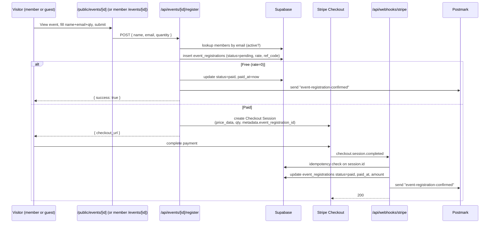

# feat: Event registration with Stripe checkout and public pages

## Overview

Enable paid and free registration on the existing events module. Each event can be members-only or public; public events are reachable via a shareable URL with no login. Members and non-members can register, pay via Stripe Checkout (or skip Stripe for free events), and receive a confirmation email that serves as the ticket. Organizers see an attendee list with check-in toggle and CSV export.

This builds on the existing events table, the lazy-getter Stripe integration, the Postmark email pipeline, and the existing Stripe webhook handler.

---

## Problem Frame

The events module today is info-only. There is no RSVP, no payment, no attendee list. Owning registration in-house gives branded checkout, automatic member pricing, unified attendee data, and removes the need for a third-party ticketing tool. Greenfield work — no failing system to replace, so the risk is overbuilding. Origin explicitly scopes v1 to: pricing + visibility flag + Stripe checkout + confirmation email + admin attendee list. No capacity caps, no QR check-in, no per-tier pricing, no self-service refunds. (see origin: [docs/brainstorms/2026-04-27-event-registration-requirements.md](docs/brainstorms/2026-04-27-event-registration-requirements.md))

---

## Requirements Trace

- R1. Events can carry a member price and a non-member price; either may be 0 (free).
- R2. Events have visibility `members_only` or `public`; public events are reachable via shareable URL with no login.
- R3. Members and non-members can register; non-members do not need an account.
- R4. Member rate is applied automatically when the registrant's email matches an `active` member, regardless of login state.
- R5. A registration may include 1–N tickets; the registrant's rate applies to all tickets in that registration.
- R6. Free events skip Stripe and capture name/email + send confirmation immediately.
- R7. Paid events go through Stripe Checkout; confirmation email is sent on `checkout.session.completed`, not on session creation.
- R8. Confirmation email serves as the ticket and includes title, date/time, location, registrant name, ticket count, amount paid (or "Free"), and a unique reference.
- R9. Admins can edit price (member, non-member) and visibility per event from the existing event editor.
- R10. Admins see an attendee list per event with name, email, member/non-member, ticket count, amount paid, registered_at, and a check-in toggle, with CSV export.
- R11. No capacity caps, no waitlists in v1.

---

## Scope Boundaries

- No capacity caps, sold-out states, or waitlists.
- No multiple ticket types per event (early-bird / VIP / dinner add-on).
- No tier-specific member pricing — single member price per event.
- No self-service cancellation or refund — refunds handled manually in Stripe.
- No registrant-facing "my tickets" portal.
- No QR-code check-in app — a list with toggle is enough.
- No promo / discount codes.
- No per-guest names on multi-ticket registrations.
- No marketing-consent checkbox at v1.

---

## Context & Research

### Relevant Code and Patterns

- **Stripe Checkout pattern to mirror:** [app/api/renew/checkout/route.ts](app/api/renew/checkout/route.ts) — creates a Checkout Session, branches on free vs paid, passes metadata for webhook reconciliation.
- **Lazy Stripe init:** [lib/stripe.ts](lib/stripe.ts) — `getStripe()`, never module-scope (see `feedback_sdk_lazy_init`).
- **Stripe webhook handler to extend:** [app/api/webhooks/stripe/route.ts](app/api/webhooks/stripe/route.ts) — already handles `checkout.session.completed` for memberships; idempotency is keyed on `stripe_checkout_session_id`. Add a sibling branch for event registrations rather than overloading the membership branch.
- **Postmark sendEmail:** [lib/postmark.ts](lib/postmark.ts) — Mustachio templates, `{{#key}}…{{/key}}` not `{{#if}}` (see `feedback_postmark_mustachio`); pass `null`, never `""`, for absent optional values.
- **Existing events admin:** [app/(admin)/admin/events/page.tsx](app/(admin)/admin/events/page.tsx) and `EventManager` component; create/update/delete API at [app/api/admin/events/](app/api/admin/events).
- **Existing member events page:** [app/(member)/events/page.tsx](app/(member)/events/page.tsx) and detail at `app/(member)/events/[id]/page.tsx`.
- **Existing public route group:** [app/(public)/](app/(public)) — existing `apply`, `pay`, `verify`, `terms` routes are already unauthenticated; `/public/events` will join them.
- **Database types regeneration:** [types/database.ts](types/database.ts) is auto-generated; regenerate after the migration via the Supabase MCP `generate_typescript_types` tool.

### Institutional Learnings

- [docs/solutions/integration-issues/stripe-supabase-payment-flow-integration-issues.md](docs/solutions/integration-issues/stripe-supabase-payment-flow-integration-issues.md) — silent insert failures and template variable mismatches; verify Postmark template variable names match exactly.
- [docs/solutions/integration-issues/postmark-mustachio-conditional-syntax.md](docs/solutions/integration-issues/postmark-mustachio-conditional-syntax.md) — Mustachio block syntax for optional fields.
- [docs/solutions/best-practices/honorary-free-tier-onboarding-pattern.md](docs/solutions/best-practices/honorary-free-tier-onboarding-pattern.md) — free-path bypass pattern for Stripe (mirrored here for free events).

### External References

- None gathered — local patterns sufficient.

---

## Key Technical Decisions

- **`registration_enabled` boolean resolves the `null` vs `0` ambiguity from origin.** When `registration_enabled = false`, the event is info-only regardless of price columns. When `true`, both `price_member` and `price_non_member` must be non-null (use `0` for free). This keeps price interpretation unambiguous and avoids three-state nullable price logic.
- **Single Stripe account, ad-hoc `price_data` per session.** Do not pre-create Stripe Product/Price objects per event. Pass `currency`, `unit_amount`, and `product_data.name` inline in `checkout.sessions.create` line items. Quantity = ticket count. This avoids Stripe Price object proliferation and keeps event editing local to Supabase.
- **Member detection by email lookup, not login state.** The registration API looks up `members` where `email = ? AND status = 'active'` and applies the member rate when matched. This works whether the registrant is signed in or not, and keeps the public page logic identical to the member page logic.
- **Registration row created `pending` before Stripe redirect; promoted to `paid` only by webhook.** Abandoned sessions stay `pending` and are filtered out of the attendee list. Free registrations are inserted directly as `paid` (with `paid_amount = 0`).
- **Separate `event_registrations` table, not extending `payments`.** The existing `payments` table is membership-specific (carries `tier_id`, `season`, capture lifecycle, `member_id`). Mixing event registrations into it would couple unrelated lifecycles and complicate reporting.
- **Webhook routing by metadata shape.** In `checkout.session.completed`, route by metadata: presence of `event_registration_id` → events branch; presence of `member_id` (without `event_registration_id`) → existing membership branch. Keep idempotency key on `stripe_checkout_session_id` per branch.
- **Short reference code on registrations.** Generate an 8-char base32 reference (e.g., `EV-AB12CD34`) on row insert for use in confirmation emails and door lookups. Stored as a column with a unique index.
- **Currency: CHF only in v1.** Hard-coded; no per-event currency selector.
- **Confirmation email is fire-once at the moment a registration becomes paid (or is created free).** No retry on send failure beyond Postmark's own delivery retries; failures are logged. The webhook still returns 200 to Stripe to avoid retry storms over an email failure.

---

## Open Questions

### Resolved During Planning

- **Null vs 0 price semantics:** Resolved by `registration_enabled` boolean. See Key Technical Decisions.
- **Whether the public events list should be linked from marketing site:** Out of scope for v1. The dedicated detail URL is the primary surface; an index page exists at `/public/events` for completeness but is not promoted in nav.
- **Currency:** CHF only.
- **Member-page Register CTA placement:** On the detail page only (not on the calendar list), to keep the list scannable.

### Deferred to Implementation

- **Postmark template variable names:** Will be finalized when authoring the template — match exactly between code `templateModel` and the template body to avoid silent empty-render failures (see `stripe-supabase-payment-flow-integration-issues`).
- **Exact CSV column order and filename pattern** for the attendee export — pick at implementation time based on what reads cleanly in Excel/Numbers.
- **Whether to soft-delete or hard-delete `pending` registrations during cleanup** — defer; v1 simply filters them out of the attendee list, no cleanup job needed.

---

## High-Level Technical Design

> *This illustrates the intended approach and is directional guidance for review, not implementation specification. The implementing agent should treat it as context, not code to reproduce.*

Decision matrix for member-rate vs non-member-rate:

| Registrant signed in? | Email matches active member? | Rate applied |
|---|---|---|
| Yes | (their own member row, active) | `price_member` |
| Yes | (their own member row, inactive/expired) | `price_non_member` |
| No | Yes | `price_member` |
| No | No | `price_non_member` |

---

## Implementation Units

- U1. **Schema: events columns and event_registrations table**

**Goal:** Add registration columns to `events`, create `event_registrations` table, regenerate database types.

**Requirements:** R1, R2, R11

**Dependencies:** None

**Files:**
- Apply migration via Supabase MCP `apply_migration` (no local migrations dir in this repo)
- Modify: [types/database.ts](types/database.ts) (regenerate via `generate_typescript_types`)

**Approach:**
- Add to `events`: `price_member numeric(10,2) NULL`, `price_non_member numeric(10,2) NULL`, `visibility text NOT NULL DEFAULT 'members_only' CHECK (visibility IN ('members_only','public'))`, `registration_enabled boolean NOT NULL DEFAULT false`.
- Add CHECK constraint: when `registration_enabled = true`, both prices must be non-null (use a partial CHECK or trigger; simplest is `CHECK (registration_enabled = false OR (price_member IS NOT NULL AND price_non_member IS NOT NULL))`).
- New table `event_registrations`: `id uuid pk default gen_random_uuid()`, `event_id uuid fk → events(id) on delete cascade`, `name text not null`, `email text not null`, `quantity int not null check (quantity between 1 and 20)`, `is_member boolean not null`, `member_id uuid null fk → members(id)`, `unit_amount_chf numeric(10,2) not null`, `total_amount_chf numeric(10,2) not null`, `status text not null check (status in ('pending','paid','free','refunded')) default 'pending'`, `reference_code text not null unique`, `stripe_checkout_session_id text null unique`, `stripe_payment_intent_id text null`, `paid_at timestamptz null`, `checked_in_at timestamptz null`, `created_at timestamptz default now()`.
- Indexes: `event_registrations(event_id, status)`, `event_registrations(email)`.
- RLS: enable RLS on `event_registrations`. Admin-only read/write via service-role; no anon policy needed (registration goes through API routes using service-role).

**Patterns to follow:**
- Mirror constraint and index style used in existing migrations referenced by `types/database.ts`.

**Test scenarios:**
- Test expectation: none — schema-only change, exercised end-to-end by U2/U3/U5.
- Manual verification: applying the migration on a fresh DB succeeds; inserting an `event_registrations` row with `quantity = 0` is rejected; updating an event with `registration_enabled = true` and `price_member = NULL` is rejected.

**Verification:**
- New columns appear on `events`; new `event_registrations` table exists with constraints; `types/database.ts` regenerated and TypeScript build still passes.

---

- U2. **Registration API: POST /api/events/[id]/register**

**Goal:** Validate input, look up member by email, compute rate × quantity, branch free vs paid, create the registration row, return either `{ success: true, reference_code }` or `{ checkout_url }`.

**Requirements:** R3, R4, R5, R6, R7

**Dependencies:** U1

**Files:**
- Create: `app/api/events/[id]/register/route.ts`
- Test: `e2e/public/event-registration.spec.ts` (covers public flow)

**Approach:**
- Validate body: `name` (required), `email` (required, basic format check), `quantity` (int 1–20).
- Load event by id; reject if not found, not published, or `registration_enabled = false`.
- Member lookup: `members` where `email = ? AND status = 'active'`. If found → `is_member = true`, `member_id = found.id`, rate = `price_member`. Else → non-member rate.
- Compute `total_amount_chf = unit_amount × quantity`. Generate `reference_code`.
- Insert `event_registrations` row with `status = 'pending'` (paid path) or `status = 'free'` (when total = 0).
- Free path: send confirmation email immediately, return `{ success: true, reference_code }`.
- Paid path: call `getStripe().checkout.sessions.create` with `mode: 'payment'`, line item `price_data: { currency: 'chf', unit_amount: rate * 100, product_data: { name: <event title> } }`, `quantity`, metadata `{ event_registration_id, event_id }`, `success_url = ${appUrl}/public/events/${id}?registered=1`, `cancel_url = ${appUrl}/public/events/${id}?cancelled=1`. Persist `stripe_checkout_session_id` on the row. Return `{ checkout_url: session.url }`.
- For members signed in via the member page, the same endpoint is used; member detection still happens via email lookup (no special path for signed-in members in v1).

**Patterns to follow:**
- [app/api/renew/checkout/route.ts](app/api/renew/checkout/route.ts) for free vs paid branching.
- Lazy `getStripe()` from [lib/stripe.ts](lib/stripe.ts).

**Test scenarios:**
- Covers F1 (public registration). Happy path: non-member with valid input on a paid event → row inserted `pending`, response includes `checkout_url` with the right total.
- Happy path: email matches active member on the same event → `is_member = true` recorded, member rate × quantity used in `unit_amount`.
- Happy path (free event): paid prices both 0 → row inserted `status = 'free'`, no Stripe call, confirmation email sent, response has `success: true`.
- Happy path: free for members only (price_member = 0, price_non_member = 50) — member registers free, non-member redirected to Stripe with 50 × qty.
- Edge case: quantity = 1 and quantity = 20 both succeed; quantity = 0 or 21 rejected with 400.
- Edge case: email matches a member with `status = 'expired'` → treated as non-member rate.
- Error path: event not found → 404; `registration_enabled = false` → 400; not published → 400.
- Error path: invalid email format → 400; missing name → 400.
- Integration scenario: Stripe Checkout session creation includes `event_registration_id` in metadata and the row's `stripe_checkout_session_id` matches the session id Stripe returned.

**Verification:**
- For a paid event, hitting the endpoint creates one row in `event_registrations` and returns a `checkout_url` whose session metadata contains the registration id.
- For a free event, hitting the endpoint creates a `status = 'free'` row and triggers one Postmark send.

---

- U3. **Stripe webhook: event registration branch**

**Goal:** On `checkout.session.completed`, when `metadata.event_registration_id` is present, mark the registration paid and trigger the confirmation email. Idempotent.

**Requirements:** R7, R8

**Dependencies:** U1, U2, U4

**Files:**
- Modify: [app/api/webhooks/stripe/route.ts](app/api/webhooks/stripe/route.ts)
- Test: `e2e/admin/event-webhook.spec.ts` *(or extend an existing webhook test if one exists)*

**Approach:**
- In the `checkout.session.completed` case, branch by metadata:
  - If `metadata.event_registration_id` present → events branch (new).
  - Else if `metadata.member_id` present → existing membership branch (unchanged).
- Events branch:
  - Idempotency: query `event_registrations` by `stripe_checkout_session_id = session.id`. If `status = 'paid'` already, return `{ received: true, already_processed: true }`.
  - Update the row: `status = 'paid'`, `paid_at = now()`, `stripe_payment_intent_id = session.payment_intent`. Optionally store the actual `amount_total` in case of currency rounding differences (assert against pre-computed total).
  - Trigger confirmation email (U4).
- Webhook still returns 200 even if the email send fails — log the failure; do not let an email outage block payment confirmation.

**Patterns to follow:**
- Idempotency style from existing membership branch: SELECT-then-skip.
- Error logging style: `console.error("[webhook] …", err)` and return 200 unless Stripe must retry.

**Test scenarios:**
- Happy path: webhook receives `checkout.session.completed` with `metadata.event_registration_id`; row goes `pending → paid`; Postmark `sendEmail` called once.
- Idempotency: same event delivered twice → second call returns `already_processed`, no second email send.
- Edge case: `metadata` carries both `event_registration_id` and `member_id` (shouldn't happen, but) → events branch wins.
- Error path: `event_registration_id` references a non-existent row → log error, return 200 (do not 500 and trigger Stripe retry storm).
- Error path: Postmark send fails → registration still marked `paid`, webhook returns 200, error logged.
- Existing membership flow regression: a `checkout.session.completed` with `metadata.member_id` and `metadata.renewal = true` continues to activate the member exactly as before.

**Verification:**
- Trigger a real Stripe test-mode checkout end-to-end: registration row transitions to `paid` and one confirmation email is delivered. Sending the same Stripe event twice does not produce a second email.

---

- U4. **Confirmation email template + send helper**

**Goal:** Add a Postmark template (`event-registration-confirmed`) and a small server helper that sends it. Used by U2 (free path) and U3 (paid path).

**Requirements:** R8

**Dependencies:** U1

**Files:**
- Create: `lib/email/event-registration.ts` (server helper that builds the Mustachio model and calls `sendEmail`)
- Postmark template `event-registration-confirmed` (created in Postmark; tracked via existing email-template admin page if applicable — see [app/(admin)/admin/email-templates/page.tsx](app/(admin)/admin/email-templates/page.tsx))

**Approach:**
- Helper signature: `sendEventRegistrationConfirmation(registrationId: string)` — loads the registration + event in one go, builds the model, calls `sendEmail`.
- Template model fields (all explicit; never undefined — pass `null` for absent values per Mustachio rules):
  - `first_name` (parsed from `name`, fallback to whole name)
  - `event_title`, `event_date_label` (formatted "Saturday, 15 June 2026"), `event_time` (or `null`), `event_location` (or `null`)
  - `quantity`
  - `amount_label` ("CHF 75.00" or `"Free"`)
  - `reference_code`
  - `is_free` (boolean for Mustachio block)
  - `preheader`
- Subject line: `"You're registered: {event_title}"`.
- Helper returns `{ success, error? }` and never throws — callers log on failure.

**Patterns to follow:**
- `sendEmail` shape from [lib/postmark.ts](lib/postmark.ts).
- Mustachio block conventions: see `feedback_postmark_mustachio` and `postmark-mustachio-conditional-syntax` learning.

**Test scenarios:**
- Happy path: helper called with a paid registration → `sendEmail` invoked once with the correct `templateAlias`, `to`, and a model containing `amount_label = "CHF 75.00"` and `is_free = false`.
- Happy path: helper called with a free registration → model contains `amount_label = "Free"` and `is_free = true`.
- Edge case: event has no `start_time` → model `event_time = null` (not `""`).
- Error path: Postmark returns an error → helper resolves `{ success: false }`, never throws.

**Verification:**
- A test-mode registration produces a delivered email in the Postmark Activity tab with all merge fields populated.

---

- U5. **Public event pages: /public/events and /public/events/[id]**

**Goal:** Unauthenticated list of public events and a detail page with the registration form.

**Requirements:** R2, R3

**Dependencies:** U1, U2

**Files:**
- Create: `app/(public)/public/events/page.tsx`
- Create: `app/(public)/public/events/[id]/page.tsx`
- Create: `components/public/EventRegistrationForm.tsx` (client component)
- Test: `e2e/public/event-registration.spec.ts` (shared with U2)

**Approach:**
- List page: server component, fetches events where `is_published = true AND visibility = 'public' AND start_date >= today`, ordered by date. Reuse the visual style of [app/(member)/events/page.tsx](app/(member)/events/page.tsx) but without the dashboard back-link and without past events.
- Detail page: server component, fetches a single event by id where `visibility = 'public' AND is_published = true` (404 otherwise). Renders title, date/time, location, description, image, and an `EventRegistrationForm` if `registration_enabled = true`, else an "Information only — registration not open" notice.
- Registration form (client): fields name + email + quantity (1–20). On submit, POST to `/api/events/[id]/register`. On `{ checkout_url }` → `window.location = checkout_url`. On `{ success: true }` → show success state with reference code. On error → show inline error.
- Success/cancel return: detail page reads `?registered=1` and `?cancelled=1` query params and shows a banner accordingly.
- No auth check; route is in the `(public)` group which is already unauthenticated.

**Patterns to follow:**
- Public route group conventions in [app/(public)/](app/(public)).
- Form/CTA visual style from [components/public/PaymentSection.tsx](components/public/PaymentSection.tsx).

**Test scenarios:**
- Covers F1, AE1. Happy path: incognito browser opens `/public/events/<id>` for a public event → renders title, register form, no login redirect.
- Happy path: submit form for paid event → redirected to Stripe Checkout (mock or test mode).
- Happy path: submit form for free event → success banner with reference code.
- Edge case: `members_only` event id loaded directly via URL → 404.
- Edge case: unpublished event id → 404.
- Edge case: `registration_enabled = false` → page renders, form replaced by info-only notice.
- Edge case: returning from successful Stripe checkout with `?registered=1` → confirmation banner appears even if webhook hasn't fired yet (banner is informational, not a guarantee).

**Verification:**
- A signed-out browser can complete the full registration flow end-to-end on a public event.

---

- U6. **Member event detail: Register CTA**

**Goal:** Surface registration on the existing member-facing event detail page when `registration_enabled = true`.

**Requirements:** R3, R4

**Dependencies:** U2, U5

**Files:**
- Modify: `app/(member)/events/[id]/page.tsx`
- Reuse: `components/public/EventRegistrationForm.tsx` from U5

**Approach:**
- If event has `registration_enabled = true`, render the same `EventRegistrationForm` as the public page, but pre-filled with the signed-in member's name and email.
- Note: member rate still resolves server-side via email lookup in U2 — no additional `is_member` flag passed from the form.

**Patterns to follow:**
- Existing detail page composition.

**Test scenarios:**
- Happy path: signed-in active member opens an event with `registration_enabled` → form pre-fills name+email; submit → member rate applied.
- Edge case: member with `status = 'expired'` → form pre-fills, but submit applies non-member rate.
- Edge case: event has `registration_enabled = false` → no form, info-only.

**Verification:**
- Manually completing the flow as a logged-in member registers them at the member rate.

---

- U7. **Admin event editor: pricing + visibility + registration_enabled**

**Goal:** Extend the existing admin event create/update UI to manage the new fields.

**Requirements:** R9

**Dependencies:** U1

**Files:**
- Modify: `components/admin/EventManager.tsx`
- Modify: `app/api/admin/events/create/route.ts`
- Modify: `app/api/admin/events/update/route.ts`
- Test: `e2e/admin/events.spec.ts` *(create if it does not exist)*

**Approach:**
- Add to the event form: `visibility` (radio: Members only / Public), `registration_enabled` (checkbox), `price_member` (numeric, CHF), `price_non_member` (numeric, CHF).
- Validation: when `registration_enabled` is checked, both prices required and ≥ 0. Form-level error if not.
- Pass new fields through to the create/update API routes; persist as-is (DB CHECK constraint enforces consistency on the backend).

**Patterns to follow:**
- Existing `EventManager` form layout and the create/update payload shape.

**Test scenarios:**
- Happy path: admin creates an event with `registration_enabled = true`, `price_member = 50`, `price_non_member = 75`, `visibility = 'public'` → row inserted with all fields.
- Happy path: admin edits an existing info-only event to enable registration → fields persist, public page now shows the form.
- Edge case: admin checks `registration_enabled` but leaves `price_member` blank → form-level error blocks submission.
- Edge case: admin sets both prices to 0 → free event, registration enabled, public.

**Verification:**
- A new event with the new fields can be saved and round-trips correctly through the admin form.

---

- U8. **Admin attendee list with check-in toggle and CSV export**

**Goal:** Per-event admin page showing all paid (and free) registrations with check-in toggle and CSV download.

**Requirements:** R10

**Dependencies:** U1, U2

**Files:**
- Create: `app/(admin)/admin/events/[id]/attendees/page.tsx`
- Create: `app/api/admin/events/[id]/attendees/route.ts` (GET CSV; PATCH check-in toggle)
- Create: `components/admin/AttendeeList.tsx` (client; toggle interaction)
- Test: `e2e/admin/event-attendees.spec.ts`

**Approach:**
- Server page loads event metadata + attendees where `status IN ('paid', 'free')` (filter out `pending`), ordered by `registered_at DESC`.
- Columns rendered: name, email, member badge (Yes / No), tickets, amount paid (CHF or "Free"), registered_at, checked-in toggle.
- Toggle: client-side optimistic update → PATCH `/api/admin/events/[id]/attendees?registration_id=...&checked_in=true|false` → updates `checked_in_at` (timestamp on true, null on false).
- CSV export: GET `/api/admin/events/[id]/attendees?format=csv` returns text/csv attachment; columns identical to UI; filename `attendees-<event-slug-or-id>-<YYYYMMDD>.csv`.
- Admin auth: existing `(admin)` route group already enforces admin auth — verify in the API route as well to avoid IDOR via direct API hits.

**Patterns to follow:**
- Admin auth checks in existing `app/api/admin/**/route.ts` files.
- Admin layout/styling in `components/admin/`.

**Test scenarios:**
- Happy path: admin opens an event's attendee page → table lists paid + free registrations; pending registrations are not shown.
- Happy path: admin toggles a row → `checked_in_at` is set; UI reflects the change; refreshing the page preserves the state.
- Happy path: admin clicks "Export CSV" → file downloads with the same rows in the same order; columns include name, email, is_member, quantity, amount_chf, registered_at, checked_in_at.
- Edge case: event with zero registrations → empty state message renders.
- Error path: non-admin hits the API directly → 401/403, no data leaked.
- Integration scenario: registering on the public page (U5) and completing Stripe (U3) makes the row appear on this page within seconds (i.e., no extra cache layer hides the new row).

**Verification:**
- After a real test registration, the attendee row appears in the list with correct data, the toggle persists, and the CSV download contains the row.

---

## System-Wide Impact

- **Interaction graph:** The Stripe webhook ([app/api/webhooks/stripe/route.ts](app/api/webhooks/stripe/route.ts)) is now multiplexed across two flows (membership + events). Any future addition (e.g., partner benefit purchases) should follow the metadata-routing pattern established here.
- **Error propagation:** Email send failures in the events branch must NOT cause the webhook to return non-200. They are logged and tolerated. This is consistent with the existing membership branch's behavior.
- **State lifecycle risks:** Registrations created `pending` and never paid will accumulate. v1 leaves them; if visible volume becomes a problem, a cleanup job can be added. The attendee list filters them out, so they are invisible to organizers.
- **API surface parity:** The same `/api/events/[id]/register` endpoint serves both the member-facing detail page and the public detail page. Member detection is via email lookup, not request origin or auth state. This avoids drift between two near-identical code paths.
- **Integration coverage:** The webhook ↔ DB ↔ Postmark chain must be exercised end-to-end at least once with Stripe test mode before shipping; unit/component tests will not prove this.
- **Unchanged invariants:** The existing membership renewal flow ([app/api/renew/checkout/route.ts](app/api/renew/checkout/route.ts) and the existing `checkout.session.completed` membership branch) is not modified. Test scenarios in U3 explicitly include a membership-flow regression check.

---

## Risks & Dependencies

| Risk | Mitigation |
|------|------------|
| Webhook routing collision: a future product might also write `metadata.event_registration_id` for an unrelated reason. | Use a `metadata.kind = 'event_registration'` discriminator alongside the id, OR keep `event_registration_id` namespaced — current plan uses the id as the discriminator, which is sufficient for v1 since no other producer uses that key. |
| Member email collision: a non-member registers with an email that *will* later become a member's email. | Member detection is at the moment of registration only. The `is_member` flag on the row is a snapshot; that is the desired semantics. |
| Free event flooding (no auth, no captcha) for paid promotion. | Out of scope for v1. Visibility is admin-controlled; if abuse appears, add rate limiting or hCaptcha to the public form. |
| Postmark template variable name drift causing silent empty fields. | U4 helper passes a fixed model object; reviewer must compare model keys against the live template (see `stripe-supabase-payment-flow-integration-issues`). |
| Attendee CSV export leaks PII if the route is reachable without auth. | API route asserts admin auth even though the `(admin)` route group also enforces it — defense in depth. |
| Currency assumption: all events priced in CHF. | Hard-coded in U2 and U4. Adding currencies later requires a column on `events`. |

---

## Documentation / Operational Notes

- Add the Postmark template `event-registration-confirmed` and verify it through the existing email-template admin page.
- Operational: Stripe test-mode end-to-end run before enabling registration on the first real event.
- No new env vars required; reuses `STRIPE_SECRET_KEY`, `STRIPE_WEBHOOK_SECRET`, `POSTMARK_SERVER_TOKEN`, `NEXT_PUBLIC_APP_URL`.
- Update Railway production once the Postmark template is live; no rebuild needed since no new `NEXT_PUBLIC_*` vars are introduced.

---

## Sources & References

- **Origin document:** [docs/brainstorms/2026-04-27-event-registration-requirements.md](docs/brainstorms/2026-04-27-event-registration-requirements.md)
- Stripe checkout pattern: [app/api/renew/checkout/route.ts](app/api/renew/checkout/route.ts)
- Stripe webhook: [app/api/webhooks/stripe/route.ts](app/api/webhooks/stripe/route.ts)
- Postmark helper: [lib/postmark.ts](lib/postmark.ts)
- Existing events admin: [app/(admin)/admin/events/page.tsx](app/(admin)/admin/events/page.tsx)
- Public route group: [app/(public)/](app/(public))
- Stripe + Supabase payment learnings: [docs/solutions/integration-issues/stripe-supabase-payment-flow-integration-issues.md](docs/solutions/integration-issues/stripe-supabase-payment-flow-integration-issues.md)
- Mustachio conditionals: [docs/solutions/integration-issues/postmark-mustachio-conditional-syntax.md](docs/solutions/integration-issues/postmark-mustachio-conditional-syntax.md)
- Free-path bypass pattern: [docs/solutions/best-practices/honorary-free-tier-onboarding-pattern.md](docs/solutions/best-practices/honorary-free-tier-onboarding-pattern.md)
