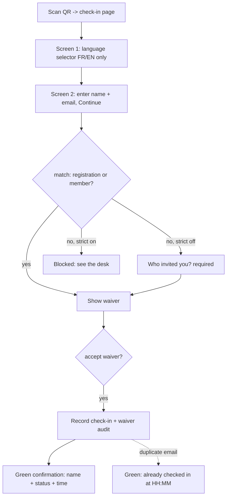

# feat: Event door check-in

## Summary

Build a self-service, per-event door check-in: a public bilingual (FR/EN) page reached by scanning a per-event QR, where a guest enters their name and email, is matched by email against the event's registrations and the member directory, accepts a liability waiver, and sees a green confirmation screen. Door arrivals (including walk-up members and invited guests, who have no registration row) and their per-person waiver acceptance are stored in a new `event_checkins` table. The admin event "Attendees" page becomes "Manage Event" with Registrations and Settings tabs, the latter exposing the check-in URL, a downloadable QR, and a per-event strict check-in toggle.

---

## Problem Frame

The club's first big event needs a way to process three populations at the door — online registrants, walk-up members, and invited guests — while capturing a defensible per-person liability-waiver record. Check-in was explicitly deferred from registration v1 (only a manual admin toggle exists today), and the waiver currently lives entirely outside the product. See origin: docs/brainstorms/2026-05-20-event-checkin-requirements.md.

---

## Requirements

**Guest check-in flow**
- R1. Public, unauthenticated per-event check-in page at a per-event URL, distinct from the registration page.
- R2. Whole flow bilingual via an FR/EN toggle (labels, fields, buttons, waiver text, confirmation message).
- R3. Guest enters their own name and email to begin.
- R4. On submit, email is matched (case-insensitive, trimmed) first against this event's registrations, then against the member directory.
- R5. Matched → proceed to waiver. Unmatched and strict off → reveal a required "who invited you?" free-text field (inviter name only) before the waiver.
- R6. Liability waiver shown inline in the selected language; acceptance required to complete check-in.
- R7. On acceptance, record the check-in and show a full-screen green confirmation with a personalized message (name + status: registered / member / guest), to be shown to the clerk.

**Matching and records**
- R8. A walk-up member (email matches an active member, no registration) is recorded as a member check-in.
- R9. An invited guest (no match) is recorded as a guest check-in carrying the inviter name.
- R10. Each check-in is an individual per-person record; companions check in individually.
- R11. Repeat check-in for the same person is idempotent: show the green screen again noting the original check-in time, no second record.

**Waiver audit**
- R12. For each check-in store: accepted=true, timestamp, name and email entered, language chosen, waiver version identifier.

**Admin — Manage Event**
- R13. Rename the admin event "Attendees" page to "Manage Event" with Registrations and Settings tabs.
- R14. Registrations tab keeps the existing list, waitlist, and CSV export; adds check-in status; shows walk-in guests and walk-up members alongside online registrations.
- R15. Settings tab shows the copyable check-in URL, a downloadable QR poster encoding it, and the strict check-in toggle.
- R16. Strict check-in toggle per-event, default off. On: only matched registrations/members can check in; unmatched blocked with a localized message. Off: unmatched check in as invited guests and are not blocked by the seat cap.

**Origin actors:** A1 (registered attendee), A2 (walk-up member), A3 (invited guest), A4 (check-in clerk), A5 (admin/organizer)
**Origin flows:** F1 (matched attendee check-in), F2 (invited guest check-in), F3 (strict-mode rejection), F4 (admin setup)
**Origin acceptance examples:** AE1 (matched → waiver, covers R4/R5), AE2 (unmatched + inviter, covers R5/R9), AE3 (member recognized, covers R8), AE4 (idempotent repeat, covers R11), AE5 (strict rejection, covers R16), AE6 (fully-booked door allows guest, covers R16)

---

## Scope Boundaries

- Live arrivals dashboard (running count, auto-refresh) — not built; the Registrations tab shows check-in status but is not a live event-day view.
- Clerk-operated check-in device — not built; model is self-service on the guest's own phone.
- Whole-party / single-tap group check-in — not supported; each adult checks in individually.
- Cryptographic / anti-fraud proof on the green screen — not built; the green screen is a soft visual signal (low fraud risk accepted).
- Payment or new paid registration at the door — out of scope; the door handles check-in only.
- Minor / guardian waiver handling — out of scope; this event is adults-only.
- App-wide internationalization (next-intl or i18n routing) — not introduced; bilingual support is local to the check-in screens (see Key Technical Decisions).

### Deferred to Follow-Up Work

- Live arrivals dashboard (count + auto-refresh): future iteration; the data model from this plan already supports it.
- Clerk-operated manual check-in in admin (add/remove an `event_checkins` row by hand, for strict / guest-list events and edge cases like shared emails): future iteration; v1 is self-service only.
- Rate limiting / abuse protection on the public check-in endpoint: no rate-limiting infrastructure exists in the repo today; flagged as a cross-cutting follow-up if needed (see Risks).

---

## Context & Research

### Relevant Code and Patterns

- Public route + registration: `app/(public)/public/events/[id]/page.tsx` (server component, `createAdminClient()`, `.eq("is_published", true)`, `notFound()`). Registration is a **route handler** at `app/api/events/[id]/register/route.ts` (`POST`), not a server action; the cleanest public-unauthenticated POST precedent is `app/api/events/[id]/waitlist/route.ts`.
- Input validation is **manual** (no zod): `EMAIL_RE` regex, `email.trim().toLowerCase()`, local `bad(message, status)` helper. Mirror this.
- Admin page to restructure: `app/(admin)/admin/events/[id]/attendees/page.tsx` + `components/admin/AttendeeList.tsx` (already has an optimistic check-in toggle PATCHing `app/api/admin/events/[id]/attendees/route.ts`). Linked from `components/admin/EventManager.tsx`.
- Admin auth: reuse the `assertAdmin()` shape in `app/api/admin/events/[id]/attendees/route.ts` (roles `super_admin`, `team_admin`, `events_admin`).
- Local-tab pattern (no shared Tabs component): `components/admin/EmailTemplateEditor.tsx` (`useState<Tab>` + button styling with `border-b-2 border-marine`).
- Timestamps: `lib/format.ts` (`formatDateTime`, `nowInZurich`, etc.) — Safari-safe via `formatToParts` in `Europe/Zurich`. Use for all rendered times.
- Supabase clients: `lib/supabase/admin.ts` `createAdminClient()` (service-role, used by public reads/writes), `lib/supabase/server.ts` `createClient()` (session, `getUser()` only).
- QR: `qrcode.react` (already a dependency). `components/card/MembershipCard.tsx` uses `QRCodeSVG` (styling reference only); the downloadable poster needs `QRCodeCanvas` + `toDataURL("image/png")`, which has no in-repo precedent.
- Success styling: `emerald-*` tokens (e.g. `EventRegistrationForm` success panel).

### Institutional Learnings

- Idempotent side-effect via composite UNIQUE + treat `23505` as benign "already done": `docs/solutions/design-patterns/slot-based-reminder-scheduling-2026-05-18.md`. Apply to repeat check-in (R11/AE4).
- Status-transition (claim-and-transition) for the registered-attendee path: `docs/solutions/design-patterns/draft-row-claim-and-transition-2026-05-06.md`. Guard the `checked_in_at` stamp with a `WHERE` predicate.
- Safari React #418 hydration from `toLocale*`: `docs/solutions/runtime-errors/safari-hydration-mismatch-tolocale-formattoparts-2026-05-18.md`. Route timestamps through `lib/format.ts`; the post-mount "checked in at" value is client-only and safe.
- Aggregate counts in Postgres, not TS `.length` over fetched rows (1000-row default): `docs/solutions/database-issues/supabase-row-fetch-undercount-when-aggregating-2026-05-19.md`.
- Route files may only export HTTP handlers; shared helpers go in `lib/`: `docs/solutions/build-errors/nextjs-app-router-route-file-export-restriction-2026-04-29.md`.
- Choose FK `ON DELETE` deliberately for the new audit table: `docs/solutions/database-issues/supabase-member-deletion-missing-cascade-fk-constraints.md`.
- After any Supabase type regen, re-append the hand-written `MemberStatus`/`PaymentCaptureStatus` aliases to `types/database.ts` (auto-memory footgun).

### External References

- None — codebase patterns are sufficient; novel pieces (local FR/EN strings, QR download) are simple.

---

## Key Technical Decisions

- **New `event_checkins` table as the source of truth for door arrivals + waiver audit.** Walk-up members and invited guests have no `event_registrations` row to toggle, so a dedicated table is required; it also gives one query for "who's in the room." Mirrors the `event_waitlist` / `event_reminder_sends` child-table convention.
- **`event_checkins` is the single source of truth for arrival; the legacy `event_registrations.checked_in_at` column is dropped.** A registrant has arrived iff an `event_checkins` row exists with their `registration_id`; members/guests are rows where `registration_id` is null. All v1 check-ins are self-service (guest's own phone); the legacy manual check-in toggle (which used `checked_in_at`) is removed, and the admin Registrations tab shows arrival status read-only. A clerk-operated manual check-in (for strict / guest-list events) is deferred to follow-up.
- **Idempotency key `(event_id, email)` on `event_checkins`, with `email` always stored lowercased** (enforced by a `CHECK (email = lower(email))` so the plain unique constraint is robust). A repeat submit returns "already checked in at HH:MM" (handle `23505` as success). Edge: two people sharing one email cannot both self-check-in (acceptable; flagged — the deferred manual check-in would cover it).
- **Authoritative matching happens server-side on final submit**, never trusting the client. A separate lightweight match endpoint drives progressive disclosure (whether to reveal the inviter field) but the submit re-derives status.
- **Email→membership match is a new pattern**, distinct from the auth-session-only detection in registration. Normalize the submitted email once (`trim().toLowerCase()`) and compare it identically on both legs — against `lower(event_registrations.email)` and `lower(members.email)` (members filtered to active status) — so a mixed-case stored email cannot misroute. From an unauthenticated endpoint, the match endpoint returns only a binary `matched` (plus `strict`), never which table matched, so the enumeration surface stays known/unknown rather than member/non-member.
- **Registration precedence over membership** when an email matches both (status `registered`).
- **Bilingual is local to these screens.** A local FR/EN string map + `useState` toggle; no app-wide i18n framework introduced for one flow.
- **Waiver content lives in a versioned in-app module**, extracted from the FR/EN PDFs, identified by a `waiver_version` string stored on each acceptance. The legal text is populated at execution time (content task), not invented in this plan.
- **FK `ON DELETE`:** `event_id` CASCADE (arrivals belong to the event); `registration_id` and `member_id` SET NULL (a deleted registration/member must not erase the waiver audit record).
- **No seat-cap enforcement at the door** (AE6) — the cap governs online registration only.
- **Testing: add `vitest` for pure domain logic.** The repo has no unit-test runner today (only Playwright E2E), so this plan introduces `vitest` to cover the high-value pure functions — email matching, registration precedence, idempotency/`23505` classification, and the waiver-version hash. Browser/page flows are covered by Playwright E2E or manual QA. The vitest dev-dependency + config land with U2 (the first unit that needs it).

---

## Open Questions

### Resolved During Planning

- Member-directory source: the `members` table, matched by lowercased `email` filtered to active status (origin "Deferred to Planning").
- Storage of walk-in/guest check-ins: new `event_checkins` table (origin "Deferred to Planning").
- Arrival source of truth: `event_checkins` only. The legacy `event_registrations.checked_in_at` column is superseded and abandoned (left untouched in the DB); the manual admin toggle is reworked to write `event_checkins`.
- QR generation: `qrcode.react` (already a dependency); render client-side and download as PNG.
- `registration_id` correction: `event_registrations` has no such column; the per-person link is an FK on the new table to `event_registrations.id`, following the `event_reminder_sends` pattern.

### Deferred to Implementation

- Exact FR/EN waiver wording extracted from `docs/WAVER GPC privat EVENT en.pdf` / `... fr.pdf`, and the precise `waiver_version` string value.
- QR poster layout/styling beyond a scannable code + caption + download button.

---

## High-Level Technical Design

> *This illustrates the intended approach and is directional guidance for review, not implementation specification. The implementing agent should treat it as context, not code to reproduce.*

Match outcome → action (server-authoritative on submit):

| Email matches | strict off | strict on |
|---|---|---|
| A paid/free registration | proceed to waiver → record (kind=registered, `registration_id` set) | same |
| An active member (no registration) | proceed to waiver → record (kind=member) | same |
| Neither | reveal required inviter field → waiver → record (kind=guest) | blocked with localized "see the desk" message |

Guest-facing flow:



`event_checkins` shape (directional):

```
event_checkins
  id              uuid pk
  event_id        uuid  -> events.id            ON DELETE CASCADE
  registration_id uuid? -> event_registrations  ON DELETE SET NULL
  member_id       uuid? -> members.id           ON DELETE SET NULL
  name            text
  email           text   (lowercased)
  kind            text   ('registered'|'member'|'guest')
  inviter_name    text?
  language        text   ('fr'|'en')
  waiver_version  text
  waiver_accepted_at timestamptz default now()
  created_at      timestamptz default now()
  UNIQUE (event_id, email)
```

---

## Implementation Units

### U1. Schema: check-in table, strict toggle, type regen

**Goal:** Add the `event_checkins` table and `events.strict_checkin` column; regenerate types.

**Requirements:** R8, R9, R12, R16

**Dependencies:** None

**Files:**
- Create: `supabase/migrations/20260520HHMMSS_event_checkins_and_strict_toggle.sql`
- Modify: `types/database.ts`

**Approach:**
- Follow migration conventions: commented header citing this plan, idempotent (`CREATE TABLE IF NOT EXISTS`, `ADD COLUMN IF NOT EXISTS`), `gen_random_uuid()` PKs, `timestamptz NOT NULL DEFAULT now()`, explicit `CREATE INDEX IF NOT EXISTS`.
- `event_checkins` per the design sketch; FK `ON DELETE` per Key Technical Decisions; `UNIQUE (event_id, email)`; index on `(event_id, created_at)`.
- DB-level invariants on `event_checkins`: `CHECK (kind IN ('registered','member','guest'))`, `CHECK (language IN ('fr','en'))`, `CHECK (char_length(name) <= 200)`, `CHECK (inviter_name IS NULL OR char_length(inviter_name) <= 200)`, and `CHECK (email = lower(email))` — enforce the enums, bound free-text, and guarantee the lowercased-email invariant the unique key relies on, regardless of which code path inserts.
- `events.strict_checkin boolean NOT NULL DEFAULT false`.
- `ALTER TABLE event_registrations DROP COLUMN IF EXISTS checked_in_at` — the column is superseded by `event_checkins`. **Sequencing:** this drop must land after (or in the same release as) U7's removal of all code references to `checked_in_at`, so deployed code never reads a missing column. See Operational Notes.
- Regenerate Supabase types, then re-append the hand-written `MemberStatus`/`PaymentCaptureStatus` aliases.

**Patterns to follow:**
- `supabase/migrations/20260519122050_event_seat_cap_and_waitlist.sql`, `supabase/migrations/20260518093339_event_reminders.sql`.

**Test scenarios:**
- Test expectation: none (schema/types). Verification via advisors + types compile.

**Verification:**
- Migration applies cleanly; `get_advisors` shows no new security/perf issues; `types/database.ts` includes `event_checkins` and `events.strict_checkin`, and the hand-written aliases are still present; `tsc` passes.

---

### U2. Check-in domain logic (matching + idempotent record)

**Goal:** Shared, route-importable logic for email matching and idempotent check-in recording.

**Requirements:** R4, R8, R9, R10, R11, R12, R16

**Dependencies:** U1

**Files:**
- Create: `lib/events/checkin.ts`
- Create: `lib/events/checkin.test.ts` (vitest)
- Modify: `package.json` (add `vitest` dev dependency + a `test:unit` script)
- Create: `vitest.config.ts`

**Execution note:** This unit introduces the vitest runner (no unit-test infra exists yet); set up `vitest.config.ts` + the `test:unit` script first, then implement the matching and idempotency logic test-first.

**Approach:**
- `matchEmail(eventId, email)` → `{ kind: 'registered'|'member'|'guest', registrationId?, memberId? }`. Normalize the email once (`trim().toLowerCase()`) and use that single value for both legs: query `event_registrations` for the event matching `lower(email)` in `('paid','free')` first; else `members` matching `lower(email)` with active status; else guest. Registration precedence. This is the one normalization point shared by the match and submit endpoints so they cannot diverge.
- `recordCheckin({ eventId, name, email, language, match, inviterName? })` → inserts a single `event_checkins` row (sourcing `waiver_version` from `WAIVER_VERSION` server-side, not the client). No `checked_in_at` write. Catch `23505` → fetch existing row, return `{ already: true, checkedInAt }` (where `checkedInAt` = the existing row's `waiver_accepted_at`/`created_at`).
- Use `createAdminClient()` (service-role) for all queries. Keep all helpers here (not exported from any `route.ts`).

**Patterns to follow:**
- `app/api/events/[id]/register/route.ts` (email normalization, `members` query shape); idempotency from the slot-based-reminder learning.

**Test scenarios:**
- Happy: email matching a paid registration → `registered`. Covers AE1.
- Happy: email matching an active member, no registration → `member`. Covers AE3.
- Happy: email matching neither → `guest`.
- Edge: mixed-case / whitespace email matches the same record on BOTH legs — a registration stored as `Jean@X.ch` and a member stored mixed-case both match a lowercased submission (regression guard for the eq-vs-ilike inconsistency).
- Edge: email matches a non-active member → not `member` (falls through to guest unless also registered).
- Edge: email matches both a registration and a member → `registered` wins.
- Idempotency: second `recordCheckin` for same `(event_id, email)` returns `already: true` with the original timestamp, no duplicate row. Covers AE4.
- Integration: matched-registration check-in creates one `event_checkins` row with `registration_id` set (no `checked_in_at` write).

**Verification:**
- Matching returns correct kinds for all three populations; repeat record is benign and returns the original time.

---

### U3. Waiver content module (FR/EN, versioned)

**Goal:** A versioned in-app home for the bilingual waiver text.

**Requirements:** R2, R6, R12

**Dependencies:** None

**Files:**
- Create: `lib/events/waiver.ts`
- Create: `lib/events/waiver.test.ts` (vitest)

**Approach:**
- Export `getWaiver(lang: 'fr'|'en')` returning the title + body text for that language, and `WAIVER_VERSION` **derived from a content hash of the FR+EN bodies** (e.g. a short hash of the concatenated text) rather than a hand-maintained string — so the version cannot silently desync from the text if someone edits the body without bumping a constant.
- Populate FR/EN bodies by extracting `docs/WAVER GPC privat EVENT fr.pdf` / `... en.pdf` (content task at execution time).

**Test scenarios:**
- Edge: `getWaiver('fr')` and `getWaiver('en')` both return non-empty title + body; `WAIVER_VERSION` is a non-empty string.
- Integration: editing a waiver body changes `WAIVER_VERSION` (the version is a function of the content, so a text change cannot reuse a prior version identifier).

**Verification:**
- Both languages resolve to real waiver text; `WAIVER_VERSION` changes whenever the FR or EN body changes, and the stored `waiver_version` matches it at acceptance time.

---

### U4. Public check-in API (match + submit)

**Goal:** Public endpoints to drive progressive disclosure and to record a check-in.

**Requirements:** R1, R4, R5, R6, R7, R9, R11, R12, R16

**Dependencies:** U1, U2, U3

**Files:**
- Create: `app/api/events/[id]/check-in/route.ts` (POST: final submit)
- Create: `app/api/events/[id]/check-in/match/route.ts` (POST: lookup by email)
- Test: `app/api/events/[id]/check-in/route.test.ts` (vitest, handler-level with the Supabase admin client mocked) for validation/branching; end-to-end page→API→DB covered by U5's Playwright/manual QA

**Approach:**
- Match endpoint: body `{ email }` → `{ matched: boolean, strict }` using `matchEmail` + the event's `strict_checkin`. Returns only whether the email is known (not which table), used purely for UX disclosure (whether to reveal the inviter field / show the blocked state). The authoritative `kind` is derived again on submit.
- Submit endpoint: body `{ name, email, language, inviterName?, waiverAccepted }`. Validate (manual, `EMAIL_RE`, `bad()` helper): `language` must be in `('fr','en')`; `name` non-empty and `<= 200` chars; `inviterName` (when required) trimmed-non-empty and `<= 200` chars. Re-derive match server-side. The submit's re-derived `kind` and the event's current `strict_checkin` are authoritative (the earlier match call is advisory only); if the re-derived kind is not `guest`, any supplied `inviterName` is ignored. Enforce: waiver must be accepted; if unmatched and strict on → 403 localized (covers the case where strict flipped between match and submit — the client renders the blocked message, not a generic error); if unmatched and not strict → require `inviterName`. Call `recordCheckin`. Return `{ ok, kind, name, checkedInAt, already }`. No seat-cap check.
- Both public/unauthenticated, `createAdminClient()` for DB; verify event is published.

**Patterns to follow:**
- `app/api/events/[id]/waitlist/route.ts` (public POST), `app/api/events/[id]/register/route.ts` (validation, `bad()`).

**Test scenarios:**
- Happy: submit, matched registration, waiver accepted → creates an `event_checkins` row linked to the registration, returns `kind: registered`. Covers AE1.
- Happy: match endpoint returns `{ matched: true }` for a member email and for a registration email, and `{ matched: false }` for an unknown email — never disclosing which table matched. Covers AE3.
- Edge/required: unmatched + not strict + missing `inviterName` → 400; with `inviterName` → records `guest`. Covers AE2.
- Error: `waiverAccepted` false/absent → 400, no record.
- Strict: unmatched + strict on → 403 with localized message, no record. Covers AE5.
- Capacity: fully-booked event, not strict, guest submit → success. Covers AE6.
- Idempotency: repeat submit same email → `already: true` + original `checkedInAt`. Covers AE4.
- Error: invalid email format → 400; unpublished/unknown event → 404.

**Verification:**
- All three populations can record (strict off); strict on blocks guests; repeat is idempotent; no auth required.

---

### U5. Public check-in page + bilingual UI + green confirmation

**Goal:** The guest-facing self-service screen.

**Requirements:** R1, R2, R3, R5, R6, R7, R10, R11, R16

**Dependencies:** U3, U4

**Files:**
- Create: `app/(public)/public/events/[id]/check-in/page.tsx` (server component: fetch published event, `notFound()` otherwise)
- Create: `components/public/EventCheckInForm.tsx` (`"use client"`)
- Test: Playwright E2E spec for the browser flow (repo Playwright location), plus manual QA on iOS Safari before the event

- **Screen flow (two screens):**
  - **Screen 1 — language selector only.** First render shows just an FR / EN choice (no other content, no locale-guessing default). Selecting one sets `useState<'fr'|'en'>` and advances to the form. All subsequent copy is in that language via a local FR/EN string map.
  - **Screen 2 — the form.** name + email → "Continue" runs the match call → if `matched: false` & not strict, reveal the required inviter field; if `matched: false` & strict, show the localized blocked message → show waiver text (`getWaiver`) + acceptance checkbox → submit (submit re-derives the authoritative kind).
- **Interaction states:** the "Continue" and "Submit" actions show a disabled in-flight state ("Checking…" / "Checking in…") in the active language; a network/server failure shows an inline localized error with the action re-enabled (distinct from field-validation errors).
- On success render a full-screen `emerald-*` confirmation: localized message, the guest's name, the status badge (in the chosen language), the event title, and the "checked in at" time. The time is a client-only post-mount value; if any server-rendered time is shown, use `lib/format.ts`.
- **Repeats are not specially handled:** a returning guest goes language → form like anyone else. When submit returns `already: true`, the same confirmation screen renders, noting they were already checked in (with that time) — no distinct repeat screen.
- Mobile-first; follow the iOS-Safari handling used in `EventRegistrationDrawer` if a drawer/sheet is used.

**Patterns to follow:**
- `components/public/EventRegistrationForm.tsx` (fetch POST, inline error panel, success styling), `components/admin/EmailTemplateEditor.tsx` (local toggle state).

**Test scenarios:**
- Happy: first screen shows only the FR/EN selector; choosing one advances to the form with all copy in that language.
- Happy: matched email → waiver shown directly, no inviter field; accept → green confirmation with name + status + event title. Covers AE1, AE3.
- Edge: unmatched (not strict) → inviter field appears after Continue and is required before waiver. Covers AE2.
- Strict: unmatched → blocked localized message, no waiver/submit. Covers AE5.
- Edge: repeat → the same confirmation renders, noting prior check-in time (no separate repeat screen). Covers AE4.
- Edge: Continue/Submit show an in-flight disabled state; a simulated network failure shows a localized inline error with the action re-enabled.
- Edge: no `toLocale*`/`new Intl.*` in SSR-rendered paths (Safari hydration guard).

**Verification:**
- A guest can complete check-in end-to-end in either language and see the green screen; clerk-facing confirmation shows name + status.

---

### U6. Manage Event admin page: tabs, Settings (URL/QR/strict), arrivals in Registrations

**Goal:** Restructure the admin event page into Manage Event with Registrations and Settings tabs.

**Requirements:** R13, R14, R15

**Dependencies:** U1

**Files:**
- Modify: `app/(admin)/admin/events/[id]/attendees/page.tsx` (load registrations + `event_checkins`; pass to tabbed client)
- Create: `components/admin/ManageEventTabs.tsx` (`"use client"`, local tab state)
- Create: `components/admin/EventCheckInSettings.tsx` (URL copy, QR download, strict toggle)
- Modify: `components/admin/AttendeeList.tsx` (show read-only arrival status; remove the existing `checked_in_at` toggle; render member/guest arrivals)
- Modify: `components/admin/EventManager.tsx` (link label "Manage Event")

**Approach:**
- Local button-tab pattern (`EmailTemplateEditor`). Registrations tab = existing list + waitlist + CSV. A registration's arrival status is derived (read-only) from whether an `event_checkins` row exists with its `registration_id`. Remove the existing manual check-in toggle (it wrote `checked_in_at`, now dropped) — v1 arrivals are all self-service. Append member/guest arrivals (rows where `registration_id` is null), labelled by kind, with inviter for guests.
- Settings tab: copyable absolute check-in URL (origin + `/public/events/{id}/check-in`), a QR generated with `qrcode.react`'s **`QRCodeCanvas`** (not `QRCodeSVG`) exported via `canvasRef.toDataURL("image/png")` into a download link, and the strict toggle wired to U7.

**Patterns to follow:**
- `components/admin/EmailTemplateEditor.tsx` (tabs), `components/admin/AttendeeList.tsx` (`lib/format`). Note: `components/card/MembershipCard.tsx` uses `QRCodeSVG` — it is a styling reference only, not a PNG-export precedent; PNG export requires `QRCodeCanvas` + `toDataURL` (no in-repo precedent).

**Test scenarios:**
- Happy: tabs switch between Registrations and Settings.
- Happy: Registrations shows checked-in status for registrants and lists member/guest arrivals with kind + inviter. Covers R14.
- Happy: Settings shows the correct absolute URL, renders a QR, and downloads a PNG; strict toggle reflects persisted value.
- Edge: event with no check-ins renders cleanly (empty arrivals).

**Verification:**
- Organizer can copy the URL, download the QR, flip strict, and see who has arrived (registrants + guests/members) without a separate live view.

---

### U7. Admin settings API + CSV/legacy-toggle cleanup

**Goal:** Persist the strict toggle and migrate the admin attendees route off the dropped `checked_in_at` column.

**Requirements:** R14, R15, R16

**Dependencies:** U1, U6

**Files:**
- Create: `app/api/admin/events/[id]/settings/route.ts` (PATCH: `strict_checkin`) — or extend the existing event update route
- Modify: `app/api/admin/events/[id]/attendees/route.ts` (CSV derives check-in status from `event_checkins`; remove the legacy `checked_in_at` PATCH toggle handler)

**Approach:**
- Reuse `assertAdmin()` (roles `super_admin`, `team_admin`, `events_admin`). PATCH validates a boolean and updates `events.strict_checkin`.
- Remove the existing manual check-in PATCH handler that wrote `event_registrations.checked_in_at` — v1 has no manual toggle (all check-ins self-service), and the column is being dropped in U1. This route change must deploy before/with the U1 column drop.
- CSV derives each registration's check-in status from the presence of its `event_checkins` row, and appends member/guest arrivals (rows without a `registration_id`) with kind + inviter columns.

**Patterns to follow:**
- `app/api/admin/events/[id]/attendees/route.ts` (`assertAdmin`, `csvEscape`), event update route for the settings PATCH shape.

**Test scenarios:**
- Happy: PATCH strict toggle persists `events.strict_checkin`.
- Auth: non-admin / wrong-role → 401/403 (assertAdmin).
- Error: non-boolean payload → 400.
- Integration: CSV export derives registrant check-in status from `event_checkins` and includes guest/member arrivals with kind + inviter; no reference to `checked_in_at` remains.

**Verification:**
- Strict toggle round-trips through admin; CSV reflects everyone in the room sourced from `event_checkins`; a codebase grep confirms no remaining `checked_in_at` references before the column is dropped.

---

## System-Wide Impact

- **Interaction graph:** New public endpoints (`check-in`, `check-in/match`) and an admin settings PATCH; the existing attendees CSV GET is migrated off `checked_in_at` and the legacy check-in PATCH toggle is removed. The public event page may gain a link/affordance, but the QR/URL is the primary entry.
- **Error propagation:** Public endpoints return `{ error }` + status via `bad()`; the client form renders inline error panels. Strict rejection is a localized 403 message, not a generic error.
- **State lifecycle risks:** Arrival is tracked only in `event_checkins` (single source of truth); the legacy `checked_in_at` column is unused, so there is no dual-signal reconciliation. Both self-service and the reworked manual toggle write the same table. Idempotency is enforced by `UNIQUE (event_id, email)` with `23505` treated as success.
- **API surface parity:** No other interface performs check-in in v1; all arrivals are self-service. A clerk-operated manual check-in is deferred follow-up.
- **Integration coverage:** Registration arrival derived from `event_checkins` (self-service insert and manual-toggle insert/delete); CSV unioning registrations + check-ins; `23505`-as-success on repeat submit — all need integration-level tests, not just unit mocks.
- **Unchanged invariants:** Registration flow, Stripe webhook, seat-cap/waitlist behavior, and the auth-session-only membership detection in registration are unchanged. The new email→membership match is additive and lives only in the check-in path.

---

## Risks & Dependencies

| Risk | Mitigation |
|------|------------|
| Public email→membership lookup enables email enumeration | Accepted (low value to attacker; response only routes to waiver vs. inviter field). Revisit if abuse appears; rate limiting is a noted follow-up. |
| No rate limiting on a public write endpoint | Flagged as cross-cutting follow-up; idempotency limits duplicate rows; service-role insert is constrained to `event_checkins`. |
| Two people sharing one email can't both self-check-in | Accepted edge for v1 (rare among adults; `UNIQUE (event_id, email)` blocks the second). The deferred clerk-operated manual check-in is the intended path to admit/record the second person. |
| Safari hydration mismatch on rendered timestamps | Route times through `lib/format.ts`; keep "checked in at" a client-only post-mount value. |
| Type regen drops hand-written aliases | Re-append `MemberStatus`/`PaymentCaptureStatus` after regen (U1 verification). |
| Waiver legal text accuracy (FR/EN) | Extracted verbatim from the provided PDFs at execution; `waiver_version` recorded per acceptance for auditability. |
| Counting arrivals over >1000 rows undercounts | Scope queries per-event; if a count is displayed, compute in Postgres (noted in U6). |
| Lapsed/pending member walking up is treated as a guest (and blocked under strict) | Accepted: member matching is active-only by design. A recently-lapsed member checks in as a guest when strict is off; under strict they're sent to the desk (the deferred manual check-in covers this). |

---

## Documentation / Operational Notes

- After shipping, capture the novel patterns with `/ce-compound`: anon-role membership lookup posture, the QR download approach, and the local bilingual-strings approach (no prior team precedent).
- Operationally: produce and print the QR poster from the Settings tab before the event; decide the strict toggle per event (default off allows invited walk-ins).
- `NEXT_PUBLIC_` base-URL handling: the absolute check-in URL in Settings must resolve correctly in production (Railway) — derive from the configured site URL or `window.location.origin` in the client component.
- Deploy sequencing for the `checked_in_at` drop: ship U7 (removes all code references to `checked_in_at`) before or in the same release as the U1 migration that drops the column, so deployed code never queries a missing column. The rest of U1 (new table + `strict_checkin`) is additive and forward-safe, but the code that reads `event_checkins`/`strict_checkin` must not deploy ahead of the migration.

---

## Sources & References

- **Origin document:** [docs/brainstorms/2026-05-20-event-checkin-requirements.md](docs/brainstorms/2026-05-20-event-checkin-requirements.md)
- Related code: `app/api/events/[id]/register/route.ts`, `app/api/events/[id]/waitlist/route.ts`, `app/(admin)/admin/events/[id]/attendees/page.tsx`, `components/admin/AttendeeList.tsx`, `components/admin/EmailTemplateEditor.tsx`, `components/card/MembershipCard.tsx`, `lib/format.ts`, `lib/supabase/admin.ts`
- Related PRs: #16 (reminders), #17 (seat cap + waitlist)
- Waiver source: `docs/WAVER GPC privat EVENT en.pdf`, `docs/WAVER GPC privat EVENT fr.pdf`
