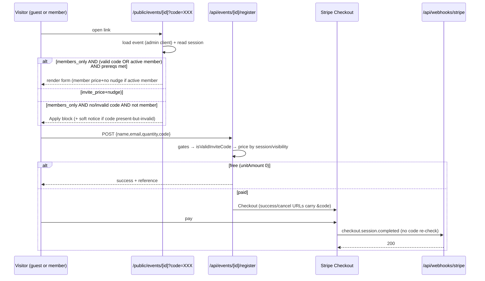

# feat: Private invite link for members-only events

## Overview

Members-only events require login to register, and members are bouncing off the login wall. This adds a per-event secret **invite code** appended to the public event URL (`/public/events/[id]?code=XXX`). A valid code lets anyone holding the link register for a members-only event without logging in — serving both members who dislike the login step and non-member partners who can't register at all today. The code reuses the existing registration path (Stripe checkout, confirmation email, duplicate guard, seat cap); the genuinely new behaviour is a code that unlocks the form on a members-only event and relaxes the registration API's members-only block. Admins set a guest price and generate/copy/regenerate the code in Manage Event → Settings; regenerating revokes the old link.

Pricing: a logged-out link-holder pays a new per-event `invite_price` (the flat invited/guest price, `0` = free); a logged-in active member pays `price_member`, linked to their account. Member-vs-guest is decided by the authenticated session, never by the form email — preserving the existing security property.

> **Why a dedicated `invite_price` column rather than reusing `price_non_member`?** Members-only events deliberately cannot carry a `price_non_member`: the CHECK constraint `events_prices_required_when_registration_enabled` requires only `price_member` for them, and `create`/`update`/agent routes plus `EventManager` all force `price_non_member` to null for members-only events. Reusing it (the brainstorm's original assumption) would make the register API compute `Number(null) = 0` and register every invited guest for free. A separate `invite_price` is self-contained, leaves the members-only "no public price" invariant intact, and is cleanly single-writer.

(see origin: [docs/brainstorms/2026-05-26-private-invite-link-requirements.md](docs/brainstorms/2026-05-26-private-invite-link-requirements.md))

---

## Problem Frame

The member event detail page sits in the auth-gated `(member)` route group (its layout redirects unauthenticated visitors to `/login`), and the registration API (`app/api/events/[id]/register/route.ts`) hard-blocks members-only events for anyone without an authenticated active-member session (`if (event.visibility === "members_only" && !isMember) → 403`). The observed effect: people open a members-only event, hit the login wall, and don't register. We want a shareable secret link — distributed only to a trusted group — that bypasses both the login redirect and the members-only block, while still nudging members to log in for their member rate.

This extends the existing event-registration system rather than building new infrastructure. The public registration path (`/public/events/[id]` + `app/api/events/[id]/register/route.ts` + the Stripe webhook + the confirmation email) already exists for *public* events; this brings a code-gated version of that capability to *members-only* events.

---

## Requirements Trace

- **R1.** A per-event secret invite code, appended to the public event URL, lets anyone holding the link register for a members-only event without logging in.
- **R2.** The code is validated **server-side in the register API** (the page gate is not a security boundary). It relaxes **only** the members-only visibility block — never the `is_published`, `registration_enabled`, not-found, seat-cap, or duplicate-email checks.
- **R3.** Pricing is session-based: logged-out link-holder → `invite_price`; logged-in active member → `price_member`, with `member_id` linked. Never priced from the form email or the URL.
- **R4.** The public event page renders the registration form (instead of the "Apply for membership" block) for a members-only event when a valid code is present, with an **informational** "log in for your member rate" nudge. A logged-in active member sees their member price and no nudge.
- **R5.** Admins set the guest `invite_price`, generate, copy, and regenerate the code in Manage Event → Settings. Regenerate = revoke. The section appears only for members-only events and shows a clear reason when prerequisites (`registration_enabled` + an `invite_price`) are unmet.
- **R6.** The `invite_code` and `invite_price` columns are **single-writer**: only the invite endpoint writes them. The bulk `POST /api/admin/events/update` and the settings PATCH route must not touch them.
- **R7.** Guest invite registrations flow through the existing register API and Stripe webhook, inheriting the duplicate-email guard, seat-cap recount, `23505 → 409` mapping, and free/paid branching. The webhook does **not** re-validate the code (in-flight checkouts complete through a regenerate).
- **R8.** Abuse backstop for v1 is the existing seat cap + duplicate-email guard only; a leaked link filling seats at the guest price is an accepted risk, mitigated by regenerating.

---

## Scope Boundaries

In scope: the `invite_code` + `invite_price` columns, server-side code validation in the register API, the session-aware public invite page + nudge, the admin set-price/generate/copy/regenerate UI, and the single-writer guard.

### Deferred to Follow-Up Work

- **Login return-trip ("next"/returnTo) for the nudge.** Honoring "log in → return to the invite page with the code intact" requires modifying the shared OTP login flow (`app/actions/auth.ts` `verifyOtpCode` + `app/(public)/login/LoginForm.tsx`), which has a hardcoded `/dashboard` redirect and no return-URL plumbing, plus open-redirect sanitization. v1's nudge is informational text only. (see origin Open Questions: "Post-login return UX")
- **Invite-conversion analytics** — a PostHog `invite_link_register` capture (with member-vs-guest flag) to measure whether invited guests convert and later become members.

### Outside this feature (carried from origin Non-Goals)

- Per-recipient / personalised invite links and attribution of who registered via the link.
- Link expiry dates and a separate enable/disable toggle (regenerate is the only revocation).
- Rate limiting / captcha on the invite registration form.
- Any change to how public events or the normal member registration flow work.

> Note: the origin deferred a dedicated invite-price column. Planning research showed members-only events cannot hold a `price_non_member`, so `invite_price` is now **in scope** (see Overview).

---

## Context & Research

### Relevant Code and Patterns

- **Register API to modify:** [app/api/events/[id]/register/route.ts](app/api/events/[id]/register/route.ts) — body parse (~21-26), event row `select` (~44-52), session-only member detection (~68-84), the members-only **403 at ~87-89**, pricing branch (~91-93), the misconfig guard (~95-97), Stripe `success_url`/`cancel_url` (~205-206). The duplicate guard, seat-cap recount, and `23505 → 409` mapping already live here.
- **Public event page to make session-aware:** [app/(public)/public/events/[id]/page.tsx](app/(public)/public/events/[id]/page.tsx) — uses `createAdminClient()` only and **never reads the session**; `isMembersOnly` at ~103; the `<aside>` cascade where the **members-only "Apply" branch is the first arm of the ternary** (~221-235) and the "Information only — registration is not open" state is reachable **only on the non-members-only path** (~236-239); `searchParams` destructured at ~90.
- **Price-null invariant (the P0 source):** the CHECK constraint in `supabase/migrations/20260508120000_events_price_constraint_visibility.sql` requires only `price_member` for members-only events; `app/api/admin/events/create/route.ts` (~66-67, 114) and `app/api/admin/events/update/route.ts` (~60-61, 111) set `effectivePriceNonMember = isMembersOnly ? null`; `app/api/agent/events/[id]/route.ts` force-nulls it; `components/admin/EventManager.tsx` hides/clears the field for members-only (~210-215, 737). **None of these are modified** — `invite_price` sidesteps them.
- **Registration form/drawer to thread the code through:** [components/public/EventRegistrationDrawer.tsx](components/public/EventRegistrationDrawer.tsx) (Props ~7-19) and [components/public/EventRegistrationForm.tsx](components/public/EventRegistrationForm.tsx) (POST body ~72-76; free/paid label driven by the price prop ~192). Neither carries a `code` prop today.
- **Code generation precedent:** [lib/events/registration.ts](lib/events/registration.ts) — `generateReferenceCode()` (`REF_ALPHABET`, 8 chars, `EV-` prefix) uses `Math.random()`. The invite secret must use a CSPRNG instead (see Key Technical Decisions).
- **Admin Settings panel to mirror:** [components/admin/EventCheckInSettings.tsx](components/admin/EventCheckInSettings.tsx) — read-only `<input>` + Copy button (clipboard + 2s "Copied", failure fallback at ~93), `saving`/`error` states (~41-43, 117-135), mutation via `fetch` + `router.refresh()`, `baseUrl` prop with `window.location.origin` fallback. Mounted from the `settings` tab of [components/admin/ManageEventTabs.tsx](components/admin/ManageEventTabs.tsx) (~430-439); `window.confirm` already used at ~185.
- **Manage page data loader:** [app/(admin)/admin/events/[id]/attendees/page.tsx](app/(admin)/admin/events/[id]/attendees/page.tsx) — the event `select` (~16-20) currently fetches only `id, title, start_date, seat_cap, strict_checkin, reminder_schedule`. It must be widened (U4).
- **Admin auth + clients:** `assertAdmin()` in [app/api/admin/events/[id]/settings/route.ts](app/api/admin/events/[id]/settings/route.ts) (~13-31); `createClient()` (session) establishes identity, `createAdminClient()` (service role) does writes. The settings PATCH uses a `"field" in body` whitelist (~56-101).
- **Routes that must NOT write invite fields:** [app/api/admin/events/update/route.ts](app/api/admin/events/update/route.ts) and [app/api/admin/events/[id]/settings/route.ts](app/api/admin/events/[id]/settings/route.ts).
- **Stripe webhook (no change):** [app/api/webhooks/stripe/route.ts](app/api/webhooks/stripe/route.ts) — looks up the row solely by `metadata.event_registration_id`; no code involvement.
- **Migrations:** local `supabase/migrations/*.sql` (timestamp-prefixed, explanatory header). Apply the file AND regenerate [types/database.ts](types/database.ts) via the Supabase MCP `generate_typescript_types`, then **re-append the manual `MemberStatus` / `PaymentCaptureStatus` aliases** at the file end (dropped on every regen).

### Institutional Learnings

- [docs/solutions/best-practices/honorary-free-tier-onboarding-pattern.md](docs/solutions/best-practices/honorary-free-tier-onboarding-pattern.md) — near-identical prior art: a rotatable secret code in a public URL unlocks an otherwise-gated path. Store it in an admin-managed field; validate server-side (a direct POST bypasses any client filter); the code unlocks the gate but never confers pricing/status — the session does.
- [docs/solutions/architecture-patterns/single-writer-field-ownership-across-routes.md](docs/solutions/architecture-patterns/single-writer-field-ownership-across-routes.md) — a per-event field edited in a Settings tab must have exactly one writer. A bulk "rebuild the whole record" route silently wipes such a field when an unrelated field is edited. Applies to both `invite_code` and `invite_price`.
- [docs/solutions/database-issues/partial-unique-index-stripe-webhook-23505-deadlock-2026-05-21.md](docs/solutions/database-issues/partial-unique-index-stripe-webhook-23505-deadlock-2026-05-21.md) — the live `event_registrations` flow: partial unique index `(event_id, lower(email)) WHERE status IN ('paid','free')`; register route maps insert-time `23505 → 409`; webhook acks `pending→paid` `23505` with HTTP 200. Routing invite registrations through the existing route inherits all of this — no parallel insert.
- [docs/solutions/logic-errors/stripe-webhook-metadata-missing-skips-cleanup.md](docs/solutions/logic-errors/stripe-webhook-metadata-missing-skips-cleanup.md) — never branch the webhook on a `"true"` string metadata flag. (Relevant only if new metadata is added — this plan adds none.)

### External References

- None — local secret-token and registration patterns are sufficient.

---

## Key Technical Decisions

- **Two new columns: `events.invite_code text NULL` and `events.invite_price numeric(10,2) NULL`.** The code is per-event, multi-use, revoked by regeneration (overwrite = revoke). The price is the flat guest rate for logged-out invitees (`0` = free). Both are managed only through the invite endpoint, keeping them single-writer and untouched by the members-only price-null logic.
- **Generate the code server-side with a CSPRNG; never accept a client-supplied code.** `generateInviteCode()` reuses `REF_ALPHABET` but draws bytes from `crypto.getRandomValues()` (Web Crypto, available in the Node runtime), not `Math.random()` — this code is a security credential, so the predictability of `Math.random()` (as used by `generateReferenceCode`) is not acceptable. Target ~16 chars (~80 bits), no `EV-` prefix.
- **One shared validation predicate, used by both the API and the page.** `isValidInviteCode(storedCode: string | null, supplied: string): boolean` lives in `lib/events/registration.ts` with the strict guard: `typeof storedCode === "string" && storedCode.length > 0 && supplied.trim() === storedCode`. Comparison is **case-sensitive and trimmed but not lowercased** (generated codes are uppercase `REF_ALPHABET`). Both the register route (U2) and the public page (U5) call it, so a blank `?code=` can never match a null/empty `invite_code` and the two surfaces cannot drift.
- **Validate in the register API after the existing gates.** The code is read from the POST body and checked with `isValidInviteCode`. It substitutes only for the `isMember` requirement at the 403; it is checked *after* not-found / `is_published` / `registration_enabled`, so a leaked code cannot register against an unpublished or info-only event.
- **Pricing branch gains the invite case.** `unitAmount = isMember ? price_member : (visibility === "members_only" ? invite_price : price_non_member)`. On the invite path, if `invite_price` is null/non-finite, reject with the existing "Event pricing is misconfigured" guard rather than charging `0`.
- **`invite_code` is never sent to the client.** The page reads it server-side only to compute `hasValidInvite`; it is dropped before any event data is passed to client components. The `code` threaded to the form is the visitor-supplied URL value, not the stored secret.
- **Single-writer ownership of both invite fields.** Only the invite endpoint writes `invite_code`/`invite_price`. The bulk update route and the settings PATCH route are explicitly kept away (comment + no key + regression tests).
- **Public page becomes minimally session-aware.** It adds one `auth.getUser()` + active-member lookup (mirroring the register route's `auth_user_id` + `status = 'active'` lookup, not the email-based `findActiveMemberByEmail`) so a logged-in active member sees their member price and no nudge; logged-out/non-active visitors see the guest price + nudge. Self-contained — no shared-auth changes. The session read must degrade to guest rendering on failure (never error a public route).
- **The webhook does not re-validate the code.** Validity is checked only at registration creation; once a `pending` row + Stripe session exist, the locked price is honored through a regenerate.
- **Carry the code into Stripe return URLs.** `success_url`/`cancel_url` append `&code=XXX` so a cancelled checkout returns to a still-valid invite page. (If the code was regenerated mid-checkout, the returned old code no longer validates — see Risks.)
- **Informational nudge only (v1).** No `next`/returnTo plumbing into OTP login.

---

## High-Level Technical Design

> *This illustrates the intended approach and is directional guidance for review, not implementation specification. The implementing agent should treat it as context, not code to reproduce.*

Render decision for the public event page `<aside>` (members-only event), evaluated in order:

| Visitor state | Code in URL | Prereqs met (reg-enabled + invite_price) | Seats | Page renders | Price label |
|---|---|---|---|---|---|
| Logged-in active member | any / none | reg-enabled | available | Registration form, **no nudge** | `price_member` |
| Logged out / non-active | valid | yes | available | Registration form + nudge | `invite_price` |
| Logged out / non-active | valid | yes | **full** | "Sold out" / fully-booked block | — |
| Logged out / non-active | valid | **no** (reg disabled) | — | "Information only — registration is not open" | — |
| Logged out / non-active | missing | — | — | "Apply for membership" block (unchanged) | — |
| Logged out / non-active | present but wrong/revoked | — | — | "Apply for membership" block + soft "this link is no longer valid" notice | — |

Nudge copy branches on session: truly logged out → "Log in for your member rate"; logged-in non-active (e.g. expired) member → "Renew your membership for the member rate" (they are already logged in, so "log in" is wrong).

Register API gate (replacing the 403 at ~87-89), evaluated **after** not-found / `is_published` / `registration_enabled`:

```text
isMember        = active member from session (unchanged)
hasValidInvite  = isValidInviteCode(event.invite_code, body.code)
if visibility == 'members_only' AND NOT isMember AND NOT hasValidInvite:
    return 403 "This event is for members only"
unitAmount = isMember ? price_member
           : (visibility == 'members_only' ? invite_price : price_non_member)
if unitAmount is null or not finite: return 500 "Event pricing is misconfigured"
```



---

## Implementation Units

### U1. Schema + lib helpers (foundations)

**Goal:** Add `invite_code` and `invite_price` columns to `events`, regenerate types, and add the two shared helpers (`generateInviteCode`, `isValidInviteCode`).

**Requirements:** R1, R3, R6

**Dependencies:** None

**Files:**
- Create: `supabase/migrations/20260526120000_events_invite_link.sql`
- Modify: `types/database.ts` (regenerate, then re-append manual aliases)
- Modify: `lib/events/registration.ts` (add `generateInviteCode`, `isValidInviteCode`)
- Test: `lib/events/registration.test.ts` (create if absent, else extend)

**Approach:**
- Migration: `ALTER TABLE public.events ADD COLUMN invite_code text; ALTER TABLE public.events ADD COLUMN invite_price numeric(10,2);` — both nullable; explanatory header comment in house style. No change to the existing price CHECK constraint (members-only events still need only `price_member`).
- Apply via Supabase MCP `apply_migration` (or CLI), regenerate types, re-append `MemberStatus` / `PaymentCaptureStatus`.
- `generateInviteCode()`: ~16 chars from `REF_ALPHABET`, bytes from `crypto.getRandomValues(new Uint8Array(...))`, no `EV-` prefix. Reject-sample or modulo-reduce to the 32-char alphabet.
- `isValidInviteCode(storedCode: string | null, supplied: string)`: `typeof storedCode === "string" && storedCode.length > 0 && supplied.trim() === storedCode`.

**Patterns to follow:** `supabase/migrations/20260508120000_events_price_constraint_visibility.sql` (header/ALTER style); existing `generateReferenceCode` in the same lib file (but swap `Math.random` for `crypto.getRandomValues`).

**Test scenarios:**
- `generateInviteCode` returns a ~16-char string drawn only from `REF_ALPHABET`; two successive calls differ; no `EV-` prefix.
- `isValidInviteCode(null, "ABC")` → false; `isValidInviteCode("", "")` → false (blank code never validates a null/empty stored code).
- `isValidInviteCode("ABCD1234", "ABCD1234")` → true; with surrounding whitespace on `supplied` → true (trimmed); lowercase `supplied` → false (case-sensitive).

**Verification:** Both columns exist and are nullable; `types/database.ts` shows them on the `events` Row with aliases intact and TypeScript compiles; helper tests pass.

---

### U2. Register API: validate the code, relax the members-only block, price by invite_price

**Goal:** Accept an invite `code`, validate it with `isValidInviteCode`, allow a members-only registration when valid, and price a logged-out invitee at `invite_price` (members-only) without altering member detection or any other gate. Carry the code into the Stripe return URLs.

**Requirements:** R1, R2, R3, R7

**Dependencies:** U1

**Files:**
- Modify: `app/api/events/[id]/register/route.ts`
- Test: `app/api/events/[id]/register/route.test.ts` (create)

**Approach:**
- Add `code?: unknown` to the body type; `const code = typeof body.code === "string" ? body.code.trim() : ""`.
- Add `invite_code, invite_price` to the event `select`.
- `hasValidInvite = isValidInviteCode(event.invite_code, code)`.
- Replace the 403 (~87-89): `if (event.visibility === "members_only" && !isMember && !hasValidInvite) return bad("This event is for members only", 403);` — keep it **after** not-found / `is_published` / `registration_enabled`.
- Pricing: `unitAmount = isMember ? Number(event.price_member) : (event.visibility === "members_only" ? Number(event.invite_price) : Number(event.price_non_member))`. The existing misconfig guard then catches a null/NaN `invite_price` on the invite path (treat as misconfigured, not free).
- Append `&code=${encodeURIComponent(code)}` to `success_url`/`cancel_url` when a code was supplied.

**Patterns to follow:** existing `bad()` shape; existing free/paid branching and `23505 → 409` mapping in the same file.

**Test scenarios:**
- Covers R2. Members-only, logged out, **valid code**, `invite_price = 50` → not 403; checkout at 50 × qty.
- Members-only, logged out, **missing code** → 403.
- Members-only, logged out, **wrong/stale code** → 403.
- Covers R3. Members-only, **logged-in active member**, no code → `price_member` applied, `member_id` set (existing behaviour preserved).
- Covers R3. Members-only, logged out, valid code, `invite_price = 0` → inserts `status = 'free'`, confirmation email, no Stripe call.
- Members-only, logged out, valid code, `invite_price` **null** → 500 "Event pricing is misconfigured" (not a free registration).
- Valid code but `registration_enabled = false` → rejected (registration-not-open), not bypassed.
- Valid code but `is_published = false` → 404/rejected, not bypassed.
- Public event with a stray `code` → behaves as today (priced at `price_non_member`, code ignored).
- Paid path: `success_url`/`cancel_url` contain `&code=`.
- Inherited guard: second registration with an email already `paid`/`free` for the event → 409.

**Verification:** A logged-out request with a valid code to a members-only paid event returns a `checkout_url` at `invite_price`; without the code → 403; a null `invite_price` on the invite path → 500, never a silent free registration.

---

### U3. Invite endpoint (set price + generate/regenerate) + single-writer guards

**Goal:** An admin-only endpoint that sets `invite_price` and generates/overwrites `invite_code`, plus explicit guarantees that neither the bulk update route nor the settings PATCH writes the invite fields.

**Requirements:** R5, R6

**Dependencies:** U1

**Files:**
- Create: `app/api/admin/events/[id]/invite-code/route.ts`
- Create: `app/api/admin/events/[id]/invite-code/route.test.ts`
- Modify: `app/api/admin/events/update/route.ts` (comment; confirm no invite-field key)
- Modify: `app/api/admin/events/[id]/settings/route.ts` (comment; confirm whitelist excludes invite fields)
- Modify/Create: `app/api/admin/events/update/route.test.ts` (single-writer regression)

**Approach:**
- New route reusing `assertAdmin()` verbatim:
  - `POST` (regenerate): generate with `generateInviteCode()`, `update({ invite_code }).eq("id", eventId)`, return `{ invite_code }`. Same action serves first-generation and regeneration.
  - `PATCH` (set price): validate `invite_price` is a number ≥ 0 (or null to clear), `update({ invite_price })`, return `{ invite_price }`.
  - Both write **only** invite columns via the service-role client.
- Bulk update route + settings route: confirm their update payloads never include `invite_code`/`invite_price`; add a comment in each: `// invite_code / invite_price are owned by POST|PATCH /api/admin/events/[id]/invite-code — do not write here (single-writer; see single-writer-field-ownership learning).`

**Patterns to follow:** `assertAdmin()` and caller pattern in `app/api/admin/events/[id]/settings/route.ts`; service-role write via `createAdminClient()`.

**Test scenarios:**
- Covers R5. Admin POST → a new non-empty `invite_code` written and returned.
- Regenerate: second POST → a **different** code overwrites the first.
- Admin PATCH `invite_price = 40` → persisted; PATCH `invite_price = -1` → 400; PATCH `invite_price = null` → cleared.
- Covers R6. Non-admin (no session / wrong role) → 401/403, no write.
- Covers R6. Bulk update route called with an unrelated change (title) on a members-only event → existing `invite_code` AND `invite_price` unchanged.
- Covers R6. Settings PATCH with `seat_cap` → `invite_code`/`invite_price` unchanged.

**Verification:** Two POSTs yield two different codes; PATCH sets the price; editing title via the bulk route or seat_cap via settings preserves both invite fields.

---

### U4. Admin invite panel: set price, generate/copy/regenerate

**Goal:** Surface the invite link + guest price in Manage Event → Settings for members-only events, with set-price, generate/regenerate (confirm-gated), and Copy, plus a clear prerequisite/disabled state — all states specified so two implementers build the same UI.

**Requirements:** R5

**Dependencies:** U1, U3

**Files:**
- Create: `components/admin/EventInviteLink.tsx`
- Modify: `components/admin/ManageEventTabs.tsx` (mount in `settings` tab; thread props)
- Modify: `app/(admin)/admin/events/[id]/attendees/page.tsx` (widen the event `select`)
- Create: `e2e/admin/event-invite-link.spec.ts`

**Approach:**
- Widen the manage-page `select` to include `visibility, registration_enabled, invite_code, invite_price`; thread all four (plus `baseUrl`) through `ManageEventTabs` → `EventInviteLink`.
- Render the panel **only when `visibility === 'members_only'`**.
- **Prerequisite-unmet state** (`registration_enabled = false` or `invite_price` null): hide the URL input and Copy button entirely; show the inline reason ("Set a guest price and enable registration to activate this link") and a disabled "Generate invite link" button.
- **No-code-yet state** (prereqs met, `invite_code` null): URL input shows disabled placeholder "No invite link yet"; Copy button hidden; primary action is "Generate invite link".
- **Active state** (`invite_code` set): read-only `<input>` with `${baseUrl}/public/events/${eventId}?code=${inviteCode}` (window.location.origin fallback); Copy button (clipboard + 2s "Copied"; on failure show "Could not copy — select the link and copy manually"); Regenerate button.
- A guest-price input (CHF, ≥ 0, 0 = free) PATCHes `invite_price`; mirror the `saving`/`error`/saved states from `EventCheckInSettings`.
- Regenerate: `window.confirm("Regenerating revokes the current link immediately. Anyone holding it will lose access. Continue?")` → POST → on success `router.refresh()` + a "New link generated — the old one no longer works" confirmation. While the POST is in flight, disable the button and show "Regenerating…"; on error show an inline message and re-enable.
- Accessibility: feedback messages render inside an `aria-live="polite"` region; Copy/Regenerate buttons carry explicit `aria-label`s.

**Patterns to follow:** `components/admin/EventCheckInSettings.tsx` (copy + saving/error states + `router.refresh()`); `window.confirm` usage in `ManageEventTabs.tsx`.

**Test scenarios:**
- Covers R5. Members-only, prereqs met, code set → full link shown; Copy writes the URL and flips to "Copied".
- Set guest price → PATCH persists; negative price → inline error, no save.
- Regenerate → confirm dialog; on confirm the link changes and "Regenerating…" shows during the POST; on cancel nothing changes; on POST error an inline message shows and the button re-enables.
- No-code-yet (prereqs met) → placeholder input, Copy hidden, "Generate invite link" enabled.
- Prereqs unmet → input + Copy hidden, inline reason shown, Generate disabled.
- Public event → panel not rendered.
- Clipboard rejection → fallback message shown.

**Verification:** On a members-only event with a guest price and registration enabled, an admin sets the price, copies a working link, and regenerates it; the copied link opens the registration form (U5).

---

### U5. Public invite page: session-aware rendering, code gating, nudge

**Goal:** Render the registration form for a members-only event when the visitor holds a valid code or is a logged-in active member, restructure the `<aside>` cascade so prerequisite/seat states are honored on the invite path, show the right nudge variant, and thread the code through the form POST — without leaking the stored code to the client.

**Requirements:** R1, R3, R4

**Dependencies:** U1, U2

**Files:**
- Modify: `app/(public)/public/events/[id]/page.tsx`
- Modify: `components/public/EventRegistrationDrawer.tsx` (add `code?: string` prop, pass through)
- Modify: `components/public/EventRegistrationForm.tsx` (include `code` in POST body)
- Create: `e2e/public/event-invite-link.spec.ts`

**Approach:**
- Add `code?: string` to `searchParams`; add `invite_code, invite_price` to the event `select`.
- Add session awareness: `auth.getUser()` (session client) + active-member lookup by `auth_user_id` + `status = 'active'` (mirror the register route, not the email-based helper). Derive `isActiveMember`. Wrap in try/catch so a session-read failure degrades to guest rendering.
- `hasValidInvite = isMembersOnly && isValidInviteCode(event.invite_code, code ?? "")` (shared helper from U1).
- **Restructure the members-only `<aside>` arm**: currently it short-circuits to the Apply block. Change so that when `isActiveMember || hasValidInvite`, it evaluates `registration_enabled` → seat state → renders the price + `EventRegistrationDrawer` (passing the URL `code`), mirroring the public-event arm. The "Information only — registration is not open" copy is **new for the members-only path** (it is not currently reachable there). Reuse `EventFullyBookedBlock` for the seats-full case.
- Price label: `price_member` for an active member, else `invite_price`.
- Nudge: show only when not an active member and a valid code is held. Logged-out → "Log in for your member rate"; logged-in non-active → "Renew your membership for the member rate". Muted secondary text in the price area, not a blocking banner.
- No/invalid code and not a member → Apply block; if a code was **present but invalid**, add a soft "This invite link is no longer valid" notice above it.
- On `?cancelled=1` return, show a brief dismissible "Your registration was not completed — you can try again" notice (reuse the public-event cancelled treatment if one exists).
- **Do not pass `event.invite_code` to any client component.** Drop it after computing `hasValidInvite`; only `hasValidInvite` (and the URL `code`) cross to the client.
- Thread `code` into `EventRegistrationDrawer` → `EventRegistrationForm`; include it in the POST body.

**Patterns to follow:** existing `<aside>` cascade and muted-text styling (~221-264); active-member lookup in `app/api/events/[id]/register/route.ts` (~71-84); `EventRegistrationForm` fetch body (~72-76).

**Test scenarios:**
- Covers R1, R4. Incognito, members-only, **valid code**, prereqs met → form + "Log in for your member rate" nudge; no login redirect.
- Covers R4. Logged-in active member, same link → form with **member price**, no nudge.
- Logged-in **expired** member, valid code → form at `invite_price` + "Renew your membership" nudge.
- Logged out, **no code** → Apply block (unchanged).
- Logged out, **present-but-invalid/revoked code** → Apply block + soft "no longer valid" notice.
- Valid code but `registration_enabled = false` → "Information only — registration is not open", not a broken form.
- Valid code, prereqs met, **seats full** → fully-booked block, not a form that 409s on submit.
- Covers R3. Form forwards `code` in the POST body; (integration with U2) valid code → not 403, priced at `invite_price`.
- `?cancelled=1&code=XXX` return → form still shows (code preserved) + cancellation notice.
- Security: `event.invite_code` does not appear in the rendered HTML / client props.

**Verification:** A signed-out browser with a valid link completes registration end-to-end on a members-only event; removing the code shows the Apply block; a logged-in active member sees the member price; the stored code never reaches the client.

---

## System-Wide Impact

- **Register API surface:** `/api/events/[id]/register` now accepts an optional `code` and conditionally relaxes the members-only block, pricing the invite path at `invite_price`. All other gates (publish, registration_enabled, seat cap, duplicate email, free/paid, `23505 → 409`) are unchanged and now also protect the invite path.
- **Public page gains session-awareness:** `app/(public)/public/events/[id]/page.tsx` reads the auth session for the first time. Additive; must degrade to guest rendering on failure and must not introduce an auth redirect on a public route.
- **Pricing model:** members-only events gain a guest price via the new `invite_price` column only. The `price_non_member` null invariant and the existing create/update/agent/EventManager logic are untouched.
- **Single-writer invariant:** `invite_code`/`invite_price` are written only by the invite endpoint. The bulk update route and settings PATCH route exclude them (comments + regression tests).
- **Stripe webhook unchanged:** no new metadata, no code re-check; in-flight checkouts complete through a regenerate.
- **No new env vars, no new email template, no new Stripe product.**

---

## Risks & Dependencies

| Risk | Mitigation |
|------|------------|
| Reusing `price_non_member` would register every invited guest free (members-only events can't hold it). | Resolved: dedicated `invite_price` column; register route guards a null `invite_price` on the invite path as misconfigured (500), never free. |
| Bulk update / settings route silently wipes an invite field. | U3 excludes both columns (comment + regression tests on both routes). |
| Page gate trusted as security, allowing a direct API POST to bypass members-only. | U2 re-validates via the shared `isValidInviteCode` after all other gates; the page render is cosmetic. |
| Stored `invite_code` leaked to the browser via the public page. | U5 reads it server-side only and drops it before client props; e2e asserts it is absent from the HTML. |
| Predictable codes from `Math.random()`. | `generateInviteCode` uses `crypto.getRandomValues` (~80 bits). |
| Admin regenerates while a guest is mid-checkout. | Webhook does not re-check the code; the `pending` row + locked price complete. **But** a guest who *cancels* after a mid-flight regenerate returns with the old code, which no longer validates → they see the "no longer valid" notice and need a fresh link. Accepted (consistent with the leaked-link acceptance). |
| Invite code visible in Stripe-logged `success_url`/`cancel_url` (dashboard + API logs). | Accepted secondary exposure: treat Stripe dashboard access as the same trust level as holding the link; regenerate to revoke. Noted so it is accepted consciously. |
| Leaked link fills seats at the guest price. | Accepted v1 risk (seat cap + duplicate-email guard); regenerate to revoke. |
| Manual `types/database.ts` aliases dropped on regen. | U1 re-appends `MemberStatus` / `PaymentCaptureStatus`. |

---

## Open Questions

### Resolved During Planning

- **Guest price storage:** dedicated `invite_price` column (members-only events cannot hold `price_non_member`).
- **Code storage:** `events.invite_code` column (multi-use, regenerate = overwrite).
- **Code generation:** CSPRNG (`crypto.getRandomValues`), ~16 chars, case-sensitive trimmed match via a shared `isValidInviteCode` helper used by both API and page.
- **Server-side validation:** code re-validated in the register API after the existing gates, substituting only for the members-only block.
- **Login nudge:** informational text only for v1 (return-trip deferred); copy varies for logged-out vs expired-member.
- **Logged-in member experience:** page made session-aware (member price + no nudge).
- **Invalid/revoked code UX:** soft "no longer valid" notice + Apply block.
- **Single-writer:** both invite fields excluded from the bulk update and settings routes.

### Deferred to Implementation

- Exact `generateInviteCode()` length within the ~16-char target.
- Whether the invite endpoint splits POST (code) / PATCH (price) as planned, or folds both into one verb — both match house style; keep them separate for clarity.
- Exact copy for the nudge variants and the "no longer valid" / cancellation notices.
- Whether to also show an "Apply for membership" secondary CTA alongside the form for valid-code visitors (origin open question) — implementation-time UX call.

---

## Sources & References

- **Origin document:** [docs/brainstorms/2026-05-26-private-invite-link-requirements.md](docs/brainstorms/2026-05-26-private-invite-link-requirements.md)
- Register API: [app/api/events/[id]/register/route.ts](app/api/events/[id]/register/route.ts)
- Public event page: [app/(public)/public/events/[id]/page.tsx](app/(public)/public/events/[id]/page.tsx)
- Price-null invariant: `supabase/migrations/20260508120000_events_price_constraint_visibility.sql`, [app/api/admin/events/update/route.ts](app/api/admin/events/update/route.ts), [components/admin/EventManager.tsx](components/admin/EventManager.tsx)
- Settings panel pattern: [components/admin/EventCheckInSettings.tsx](components/admin/EventCheckInSettings.tsx), [components/admin/ManageEventTabs.tsx](components/admin/ManageEventTabs.tsx)
- Manage page loader: [app/(admin)/admin/events/[id]/attendees/page.tsx](app/(admin)/admin/events/[id]/attendees/page.tsx)
- Admin auth pattern: [app/api/admin/events/[id]/settings/route.ts](app/api/admin/events/[id]/settings/route.ts)
- Code helpers: [lib/events/registration.ts](lib/events/registration.ts)
- Honorary secret-code prior art: [docs/solutions/best-practices/honorary-free-tier-onboarding-pattern.md](docs/solutions/best-practices/honorary-free-tier-onboarding-pattern.md)
- Single-writer ownership: [docs/solutions/architecture-patterns/single-writer-field-ownership-across-routes.md](docs/solutions/architecture-patterns/single-writer-field-ownership-across-routes.md)
- Registration `23505`/webhook: [docs/solutions/database-issues/partial-unique-index-stripe-webhook-23505-deadlock-2026-05-21.md](docs/solutions/database-issues/partial-unique-index-stripe-webhook-23505-deadlock-2026-05-21.md)
