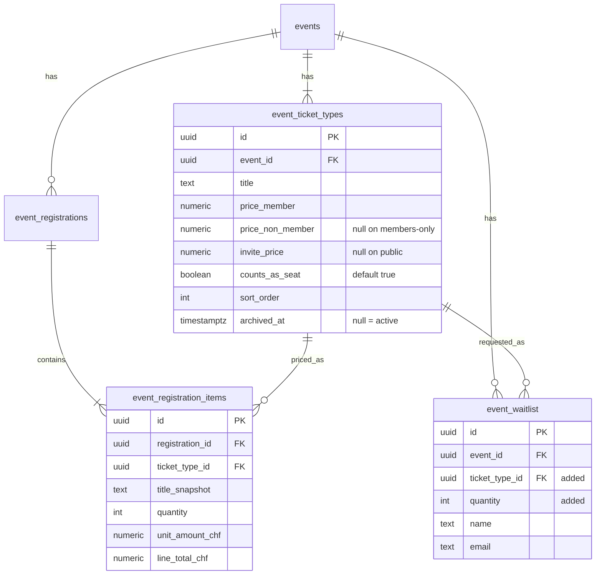
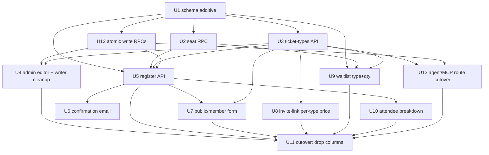

# feat: Multiple ticket types per event

## Overview

Today an event has exactly one ticket type, priced by three columns on the `events` row (`price_member`, `price_non_member`, `invite_price`). This plan replaces that with a `event_ticket_types` table — each event holds one or more named types, each carrying its own member / non-member / invited-guest price and a "counts as a seat" flag. A buyer picks a quantity per type and pays in one Stripe checkout; a registration becomes a parent `event_registrations` row plus one `event_registration_items` line per chosen type.

The existing single-price experience is preserved: every event migrates to a seeded "Standard" type, and every existing registration becomes a single "Standard" line item, with no behaviour change for them. The work reconciles with the invite-link feature shipped in #32 — `invite_price` becomes a per-type column, and the invite-link Settings UI moves from one guest-price field to one per type.

This builds on the existing events module, the lazy-getter Stripe integration, the Postmark pipeline, the seat-capacity RPCs, the waitlist, and the admin event tooling. (see origin: [docs/brainstorms/2026-05-26-event-ticket-types-requirements.md](docs/brainstorms/2026-05-26-event-ticket-types-requirements.md))

---

## Problem Frame

The single-price-per-event model can't express a polo brunch with Standard / Standard + Asado / Kids / Kids + Asado at distinct member and non-member prices, nor let a family buy 2 standard + 2 kids in one transaction. Organizers currently work around it by splitting events or collecting money off-platform.

The product shape is inherited (in-house registration with member pricing, Stripe checkout, free path, seat caps, invite links, waitlist, confirmation email, attendee list). This is a data-model and UI change within that shape, not a new product. The chief risk is the migration: three price columns and a single-quantity registration model are load-bearing across the register API, both detail pages, the seat-capacity SQL RPCs, the waitlist conversion, the agent/MCP event route, the confirmation email, and the attendee list. The plan sequences additive schema first and drops the old columns only after every reader/writer has cut over.

---

## Requirements Trace

- **R1.** Each event has one or more ticket types; each carries `title`, `price_member`, `price_non_member` (public only), `invite_price` (members-only only), `counts_as_seat`, and display order.
- **R2.** A buyer selects a quantity per type and pays once; total tickets across types are capped 1–10, minimum one.
- **R3.** Existing events migrate to a seeded "Standard" type; existing registrations become one "Standard" line item; their behaviour is unchanged.
- **R4.** Per-line price resolves from the registration's single rate class (member via session / invited-guest via valid code on members-only / non-member on public), applied to every line; an unset price fails loud, never charges zero.
- **R5.** Seat capacity stays event-level and counts only `counts_as_seat` types; the oversell-by-one trade-off is unchanged.
- **R6.** Free lines are omitted from Stripe `line_items`; an all-free basket skips Stripe entirely (existing free path).
- **R7.** Confirmation email and attendee list show a per-type breakdown; the attendee list's inline per-registration quantity edit is removed (read-only).
- **R8.** The invite-link Settings UI sets a guest price per ticket type; the link activates only when registration is enabled and every type has an `invite_price`.
- **R9.** The waitlist captures a desired ticket type + quantity at signup; conversion creates the comped registration from those stored values with no admin quantity input.
- **R10.** Ticket-type price fields have a single writer; the three `events` price columns are dropped after all surfaces cut over.

---

## Scope Boundaries

### In scope
- New `event_ticket_types` and `event_registration_items` tables; migration seeding "Standard" and backfilling line items.
- Per-type quantity selection, multi-line Stripe checkout, per-type pricing resolution.
- Seat-capacity RPC rewrite onto line items with a `counts_as_seat` filter.
- Admin ticket-types editor at event creation/edit; per-type guest pricing in Settings.
- Per-type confirmation-email breakdown and read-only attendee breakdown + CSV.
- Waitlist type + quantity capture and simplified conversion.
- Migrating the agent/MCP event route off the old price columns.

### Deferred to Follow-Up Work
- A per-type quantity editor on the attendee list (replacing the removed inline edit).
- Multi-type baskets on the waitlist (one type per waitlist entry in v1).
- A `flat_price` flag that opts a ticket type out of rate-class pricing (pending the product question in Open Questions).
- Per-type breakdown in the reminder and waitlist-confirmation emails (they keep the aggregate count in v1).
- Removing the `assertAdmin()` duplication across admin routes (pre-existing; tracked from #32).

### Out of scope (from origin)
- Per-type capacity limits; a separate non-seat "add-on" concept distinct from ticket types.
- Per-ticket attendee names; per-person check-in.
- Early-bird / time-windowed pricing; promo codes; per-type waitlist queues.
- Mixed rate classes within one registration.
- Currencies other than CHF.

---

## Context & Research

### Relevant code and patterns
- **Migrations:** `supabase/migrations/`, naming `YYYYMMDDHHMMSS_snake_case.sql`; idempotent (`IF NOT EXISTS`, `DROP CONSTRAINT IF EXISTS` then `ADD`), explanatory header comment, no down-migrations. RLS pattern: `ENABLE ROW LEVEL SECURITY` with **no policies** (service-role only). Constraint to rework: `events_prices_required_when_registration_enabled` in `supabase/migrations/20260508120000_events_price_constraint_visibility.sql`. **Dev and prod share one Supabase DB — an applied migration mutates production immediately.**
- **Types regen:** `types/database.ts` regenerated via Supabase MCP; the hand-written `MemberStatus` / `PaymentCaptureStatus` aliases at the file end are dropped by regen and **must be re-appended** (see `feedback_db_types_aliases`).
- **Register API:** `app/api/events/[id]/register/route.ts` — pricing resolution (member/invite/non-member), seat check via `getSeatsUsed`, duplicate guard, partial unique index `event_registrations_event_email_paidfree_uniq`, free-vs-paid branch, single-line Stripe `price_data` + `metadata.event_registration_id`.
- **Stripe webhook:** `app/api/webhooks/stripe/route.ts` — looks up the registration by `metadata.event_registration_id` (not by line items), idempotent on `status === 'paid'`. Likely **no change** needed.
- **Seat RPCs:** `supabase/migrations/20260519145000_event_seats_used_rpc.sql` defines `seats_used(eid)` and `seats_used_by_events(ids)` as `SUM(quantity) WHERE status IN ('paid','free')` over `event_registrations`. Consumed by `lib/events/seat-usage.ts` (`getSeatsUsed`, `getSeatStateByEvent`), the register route, both detail pages, the waitlist signup + convert routes.
- **Price writers (all four must stop writing the dropped columns):** `app/api/admin/events/create/route.ts`, `app/api/admin/events/update/route.ts`, `app/api/agent/events/[id]/route.ts` (+ `app/api/agent/events/route.ts`, `app/api/agent/events/draft/route.ts`), and the invite-code route's `invite_price` PATCH at `app/api/admin/events/[id]/invite-code/route.ts`.
- **Admin editor:** `components/admin/EventManager.tsx` (slide-over form; `emptyForm` keys = payload keys; create returns `{ success: true }` with no id). **Settings/Manage tabs:** `components/admin/ManageEventTabs.tsx`; data loaded in `app/(admin)/admin/events/[id]/attendees/page.tsx`. **Invite link:** `components/admin/EventInviteLink.tsx`.
- **Registration UI:** `components/public/EventRegistrationForm.tsx` (single quantity `<select>`, `MAX_QUANTITY_HARD_CAP = 10`), `components/public/EventRegistrationDrawer.tsx`, `app/(public)/public/events/[id]/page.tsx` (session-aware price/render from #32), `app/(member)/events/[id]/page.tsx`.
- **Email:** `lib/email/event-registration.ts` (template `event-registration-confirmed`; model has scalar `quantity` + `amount_label`).
- **Attendee list:** `app/(admin)/admin/events/[id]/attendees/page.tsx` + `components/admin/AttendeeList.tsx` (columns: Name, Email, Member, Tickets, Amount, Reference, Registered, Arrived; **inline Tickets quantity edit → `PATCH .../registrations/[registrationId]`** — to be removed). CSV at `app/api/admin/events/[id]/attendees/route.ts`.
- **Waitlist:** `event_waitlist` (name/email only), `components/public/WaitlistForm.tsx`, `app/api/events/[id]/waitlist/route.ts` (signup; full-event gated), `app/api/admin/events/[id]/waitlist/convert/route.ts` (admin enters `quantity`; creates comped free registration overriding seat cap; deletes entry; emails).
- **Helpers:** `lib/events/registration.ts` (`generateReferenceCode`, `findActiveMemberByEmail`, `hasExistingRegistration`, `isValidInviteCode`, `REGISTERED_STATUSES`), `lib/events/seat-usage.ts`, `lib/format.ts` (`formatCurrency` — required for all SSR price rendering).
- **Tech:** Next.js 15 (App Router, Turbopack), React 19, TS 5, Supabase JS v2 + SSR, Stripe SDK v20 (`getStripe()` lazy), Postmark v4 (Mustachio), Vitest 4 (co-located `*.test.ts`), Playwright 1.58 (`e2e/`, projects admin/member/public).

### Institutional learnings
- [docs/solutions/architecture-patterns/reusing-nullable-column-as-value-source-trap.md](docs/solutions/architecture-patterns/reusing-nullable-column-as-value-source-trap.md) — `Number(null) === 0` silently makes a missing price free. Every per-type price read must guard null and fail loud (500); the display path must show "not open yet", never a free-looking Register button.
- [docs/solutions/architecture-patterns/single-writer-field-ownership-across-routes.md](docs/solutions/architecture-patterns/single-writer-field-ownership-across-routes.md) — a relocated field's dedicated route must be its only editor; delete it entirely from bulk "rebuild the record" routes (destructure *and* the write object), not conditionally.
- [docs/solutions/design-patterns/draft-row-claim-and-transition-2026-05-06.md](docs/solutions/design-patterns/draft-row-claim-and-transition-2026-05-06.md) — share one validation function across draft-save and final-submit; status-guard mutations; don't insert a divergent shape at commit.
- [docs/solutions/integration-issues/stripe-supabase-payment-flow-integration-issues.md](docs/solutions/integration-issues/stripe-supabase-payment-flow-integration-issues.md) — Supabase JS never throws on write failure; destructure `{ error }` on every insert/update (incl. each line-item write). Postmark renders unmatched placeholders as empty strings — model keys must match the template exactly.
- [docs/solutions/integration-issues/postmark-mustachio-conditional-syntax.md](docs/solutions/integration-issues/postmark-mustachio-conditional-syntax.md) and [docs/solutions/integration-issues/postmark-mustachio-dot-notation-in-block-scope.md](docs/solutions/integration-issues/postmark-mustachio-dot-notation-in-block-scope.md) — the breakdown is a Mustachio array section `{{#ticket_lines}}…{{/ticket_lines}}`; reach parent vars with `{{../var}}`; no `{{#if}}`; gate optional fields on presence; pass `null` not `""`; never use a boolean `false` as a visibility guard.
- [docs/solutions/database-issues/supabase-row-fetch-undercount-when-aggregating-2026-05-19.md](docs/solutions/database-issues/supabase-row-fetch-undercount-when-aggregating-2026-05-19.md) — never compute an enforcement sum by fetching rows in JS (Supabase caps `select()` at 1000). Per-type seat aggregation must be a Postgres RPC. Line items multiply row volume, so this risk grows.
- [docs/solutions/runtime-errors/safari-hydration-mismatch-tolocale-formattoparts-2026-05-18.md](docs/solutions/runtime-errors/safari-hydration-mismatch-tolocale-formattoparts-2026-05-18.md) — no direct `toLocaleString` / `Intl.NumberFormat` in SSR components; use `formatCurrency` from `lib/format.ts` for every per-type price/total.
- [docs/solutions/database-issues/partial-unique-index-stripe-webhook-23505-deadlock-2026-05-21.md](docs/solutions/database-issues/partial-unique-index-stripe-webhook-23505-deadlock-2026-05-21.md) — re-examine the `event_registrations` dedupe index and the webhook's `pending→paid` promotion; a permanent constraint violation must be non-retryable (not a blanket 500).

### External research
- None gathered — local patterns are strong for every layer (Stripe, Postmark, migrations, admin routes). Stripe Checkout in `payment` mode rejecting zero-amount line items is the one external constraint, already accounted for by the free-line-omission decision.

---

## Key Technical Decisions

- **Unified `event_ticket_types` table; "Standard" is a seeded peer, not privileged.** The three `events` price columns migrate into a seeded "Standard" row per event. (see origin Data Model)
- **Registration = parent row + line items.** `event_registrations` stays the order header (name, email, is_member, member_id, status, reference_code, stripe_*, paid_at, total). New `event_registration_items` carry `ticket_type_id`, `title_snapshot`, `quantity`, `unit_amount_chf`, `line_total_chf`. `title_snapshot` and `unit_amount_chf` are recorded at registration time so historical rows are immutable audit records even if a type is renamed/repriced/archived.
- **Seat math moves to line items, with a transition-safe fallback.** `seats_used` / `seats_used_by_events` sum `event_registration_items.quantity` for items whose ticket type has `counts_as_seat = true`, **COALESCE-falling back to `event_registrations.quantity` for any registration that has no line items** (legacy rows, and rows created/promoted by old code during the deploy window). The RPC return shape is unchanged, so `lib/events/seat-usage.ts` callers are untouched. **The fallback is a transition crutch, not a steady state:** after U1's backfill, a paid/free registration with zero items is by definition a bug (a partial insert), so the fallback must not become a way to silently tolerate corrupt rows — see the atomic-insert decision below and U12.
- **Writes that must be consistent go through a single Postgres function (atomicity), not sequential Supabase JS inserts.** Supabase JS never throws on a failed write, so an "insert parent, then insert items" sequence can leave a chargeable parent row with no items — masked by the seat fallback, blank in the email/attendee breakdown, a silent data-integrity failure. Both multi-row writes are made atomic via dedicated RPCs (U12): the registration parent + its line items in one transaction, and an event + its seeded ticket types in one transaction. This retires reliance on the seat fallback for anything but true legacy rows and removes the orphan-parent class of bugs.
- **`event_registrations.quantity` is retained as a denormalized "total tickets" column, set by the atomic insert RPC.** Four readers depend on it — the reminder email (`lib/email/event-reminder.ts`), the waitlist email (`lib/email/event-waitlist.ts`), the attendee CSV, and the attendee page. Retaining it (sum of all item quantities) leaves those readers untouched and reduces this change to *adding* a breakdown where wanted, rather than rewriting four surfaces. It also backs the seat-RPC legacy fallback.
- **Per-type pricing uses the whole-registration rate class; flat-priced types are achieved by setting equal prices.** An active member buying a "Kids" type pays `Kids.price_member`. To make a type flat across classes (Kids/add-ons priced the same for everyone), the admin sets `price_member == price_non_member == invite_price`. Whether a type should be able to *opt out* of rate-class pricing via a `flat_price` flag is an open product question (see Open Questions) — v1 default is equal-prices-by-convention, flagged for the user at handoff.
- **Rate class stays whole-registration; pricing resolves per type from that class.** Session → member; valid code on members-only → invited guest; else non-member. The class selects which per-type column applies to every line. Unset price for the resolved class → fail loud (500 "pricing misconfigured"), never charge zero.
- **One Stripe line item per *paid* type; free lines omitted.** Zero-amount lines are recorded as items at unit 0 but excluded from Stripe's `line_items`. All-free basket skips Stripe (existing free path). Webhook is unchanged — it reconciles by `metadata.event_registration_id`, never by line items.
- **Single writer for ticket-type fields = the ticket-types route.** It owns `title`, all three prices, `counts_as_seat`, `sort_order`. The event create route may *seed* initial types through a shared validated insert helper (initial insert, not a competing edit — mirrors how `create` seeds `reminder_schedule`). The bulk `update` route, the agent route, and the invite-code route must not write any per-type field.
- **Per-type guest price is owned by the ticket-types route too;** the invite-code route is reduced to owning `events.invite_code` only. The Settings UI writes guest prices through the ticket-types route.
- **Visibility-dependent null rule enforced in the shared validation helper (app-level), plus a DB CHECK for non-negativity.** A cross-table CHECK (type price vs parent event visibility) isn't expressible as a column CHECK; the shared writer enforces "members-only ⇒ non_member null; public ⇒ invite null; price_member required when registration enabled", matching how the existing routes force-null today.
- **Ticket-type deletion:** hard-delete only when no `event_registration_items` reference it; otherwise archive (`archived_at` set → hidden from the editor and the buyer form, retained for history and existing line items).
- **Waitlist carries one `ticket_type_id` + `quantity`.** Conversion reads them and creates the comped registration + one line item; the convert route drops its `quantity` body param.
- **Additive-first migration, drop columns last.** New tables, backfill, and the RPC rewrite are additive and safe to apply ahead of deploy; the three `events` price columns and the old constraint are dropped only after every reader/writer has cut over.

---

## High-Level Technical Design

> *This illustrates the intended approach and is directional guidance for review, not implementation specification. The implementing agent should treat it as context, not code to reproduce.*

### Data model (after migration)



### Registration flow (multi-type basket)

```mermaid
sequenceDiagram
    participant U as Buyer
    participant P as Detail page (member/public/invite)
    participant API as POST /api/events/[id]/register
    participant DB as Supabase
    participant S as Stripe
    participant W as Stripe webhook

    U->>P: pick qty per type, submit { items: [{ticket_type_id, qty}], name, email, code? }
    API->>DB: load ticket types; resolve rate class (session/code)
    API->>API: per line: price = type[classColumn]; fail-loud if null
    API->>DB: insert parent event_registrations + N event_registration_items
    alt all lines free (total 0)
        API->>DB: status=free, paid_at=now
        API-->>U: { success, reference_code }
    else has paid lines
        API->>S: checkout.sessions.create(line_items = one per PAID type, metadata.event_registration_id)
        API-->>U: { checkout_url }
        U->>S: pay
        S->>W: checkout.session.completed
        W->>DB: lookup by metadata; pending→paid (idempotent); send email
    end
```

### Per-line price resolution

| Rate class (whole registration) | Column used per line | Unset → |
|---|---|---|
| Member (active session) | `price_member` | 500 misconfigured |
| Invited guest (valid code, members-only) | `invite_price` | 500 misconfigured |
| Non-member (public) | `price_non_member` | 500 misconfigured |
| 0 (any class) | line recorded at 0, omitted from Stripe | — (free) |

### Unit dependency graph



---

## Implementation Units

### U1. Additive schema: ticket types, registration items, waitlist columns, seed + backfill

**Goal:** Create the new tables and columns, seed a "Standard" type per event, backfill one line item per existing registration, backfill waitlist entries — all additive, leaving the three `events` price columns in place.

**Requirements:** R1, R3, R9

**Dependencies:** None

**Files:**
- Create: `supabase/migrations/<ts>_event_ticket_types.sql`
- Modify: `types/database.ts` (regenerate via Supabase MCP; re-append manual aliases)

**Approach:**
- `event_ticket_types`: `id`, `event_id` fk → events ON DELETE CASCADE, `title text not null`, `price_member numeric(10,2)`, `price_non_member numeric(10,2)`, `invite_price numeric(10,2)`, `counts_as_seat boolean not null default true`, `sort_order int not null default 0`, `archived_at timestamptz`, `created_at`. CHECK: each price `>= 0` when not null.
- `event_registration_items`: `id`, `registration_id` fk → event_registrations ON DELETE CASCADE, `ticket_type_id` fk → event_ticket_types ON DELETE RESTRICT, `title_snapshot text not null`, `quantity int not null check (quantity >= 1)`, `unit_amount_chf numeric(10,2) not null`, `line_total_chf numeric(10,2) not null`, `created_at`. Index on `registration_id`; index on `(ticket_type_id)`.
- Add to `event_waitlist`: `ticket_type_id uuid` fk → event_ticket_types ON DELETE SET NULL, `quantity int` (nullable for backfilled legacy rows; new signups require it at app level).
- Seed: insert one "Standard" `event_ticket_types` row per event from its `price_member`/`price_non_member`/`invite_price`, `counts_as_seat = true`, `sort_order = 0`. **Idempotent:** guard with `WHERE NOT EXISTS (SELECT 1 FROM event_ticket_types t WHERE t.event_id = e.id)` so a re-run (botched deploy, `db push` retry) never double-seeds — double-seeding would halve effective capacity via the U2 RPC. Info-only events (all prices null) are seeded too — the all-null type is gated at every read (register fails loud, form shows "not open yet"), so it is not a charge-zero bug; do not skip them or a later "enable registration" has no type to price.
- Backfill items: for each `event_registrations` row, insert one `event_registration_items` referencing that event's seeded "Standard" type, `title_snapshot = 'Standard'`, `quantity = event_registrations.quantity`, `unit_amount_chf = COALESCE(unit_amount_chf, 0)`, `line_total_chf = COALESCE(total_amount_chf, 0)`. **Idempotent:** guard with `WHERE NOT EXISTS (SELECT 1 FROM event_registration_items i WHERE i.registration_id = r.id)`. The `COALESCE` is required because the item amount columns are `NOT NULL` while legacy `event_registrations` amount columns may hold NULLs (early comped rows) — without it a single NULL aborts the whole transaction with `23502` on the shared prod DB.
- Backfill waitlist: set `ticket_type_id` to the event's "Standard" type; leave `quantity` null (legacy entries predate the field).
- RLS: `ENABLE ROW LEVEL SECURITY` on both new tables, no policies (service-role only).
- **Volume/locking:** backfill is plain `INSERT … SELECT` (no table rewrite, no long lock); event/registration volume is club-scale (low thousands), so a single transaction is acceptable. Rollout step 1 runs a pre-flight `count(*)` and a NULL check on the two amount columns before applying.
- **Do not** touch the three `events` price columns or the `events_prices_required_when_registration_enabled` constraint yet.

**Patterns to follow:** idempotent migration style + explanatory header (`supabase/migrations/20260526120000_events_invite_link.sql`); RLS-no-policies (`20260520120000_event_checkins_and_strict_toggle.sql`); alias re-append workflow (`feedback_db_types_aliases`).

**Test scenarios:**
- Test expectation: none — schema/data migration. Verified by U2/U5 end-to-end and the manual checks below.
- Manual verification: after apply, every event has exactly one "Standard" type; row counts of `event_registration_items` equal `event_registrations`; per-event `SUM(item.quantity)` equals the old `SUM(event_registrations.quantity)`; inserting a type with a negative price is rejected; `types/database.ts` compiles and the two manual aliases are present.

**Verification:** Migration applies cleanly on the shared DB; `tsc --noEmit` passes after regen; spot-check three events of differing visibility show a correctly-seeded "Standard" type.

---

### U2. Seat-capacity RPC rewrite onto line items

**Goal:** Recompute seats from `event_registration_items` filtered by `counts_as_seat`, with a fallback to `event_registrations.quantity` for itemless rows, preserving the RPC return contract.

**Requirements:** R5

**Dependencies:** U1

**Files:**
- Create: `supabase/migrations/<ts>_seats_used_line_items.sql`
- Modify (if any signature drift): `lib/events/seat-usage.ts` + `lib/events/seat-usage.test.ts`

**Approach:**
- Replace `seats_used(eid)` and `seats_used_by_events(ids)` bodies. The fallback is **not** a literal column `COALESCE` — it is a per-registration decision: for each `paid`/`free` registration, if it **has any line items** (`EXISTS` items for that registration), count the sum of its *seat-counting* item quantities (which may be 0 for an all-non-seat registration); **only if it has zero items at all** fall back to the parent `quantity`. Then sum those per-registration values. `SECURITY DEFINER STABLE`, same arguments and return columns as today.
- The itemless predicate must be `NOT EXISTS(any event_registration_items for the registration)`, **not** "no rows survive the `counts_as_seat` join" — otherwise a legitimate registration that bought only non-seat types would wrongly fall back to its parent `quantity` and over-count seats.
- The COALESCE fallback exists for legacy/deploy-window rows only. Once U12's atomic insert lands, every new paid/free registration has items, so a post-cutover itemless paid/free row is a bug, not a legitimate fallback case — pair the rollout with a monitoring query (count of paid/free registrations with zero items) so the fallback can't silently mask partial-insert corruption.
- Keep `getSeatsUsed` / `getSeatStateByEvent` call sites unchanged.

**Patterns to follow:** existing RPC definitions in `supabase/migrations/20260519145000_event_seats_used_rpc.sql`.

**Test scenarios:**
- Happy path: event with 2× Standard (seat) + 1× "extra, non-seat" item → `seats_used` returns 2, not 3.
- Edge case (predicate guard): a registration whose items are **all** non-seat types → contributes 0 seats, **not** the parent `quantity` (the itemless fallback must not fire for a registration that has items).
- Happy path: registration with items → counted from items; legacy registration with no items → counted from `event_registrations.quantity` (fallback).
- Edge case: event with no registrations → 0; event with only `pending` registrations → 0.
- Edge case: archived ticket type with `counts_as_seat = true` still counts its existing items (archival doesn't free seats).
- Integration: `seats_used_by_events([...])` batch matches the sum of per-event `seats_used` for the same set.
- Regression: `deriveSeatState` (`lib/events/seat-usage.test.ts`) still returns correct `isFullyBooked` / availability given the new counts.

**Verification:** A members-only event seeded with mixed seat/non-seat items reports the seat-only count; the public page's remaining-seats display and the register route's cap check both reflect it.

---

### U12. Atomic write RPCs: registration+items and event+types

**Goal:** Two Postgres functions that commit multi-row writes all-or-nothing, so neither a registration nor an event can ever exist in a half-written state (parent without items, event without types).

**Requirements:** R2, R3

**Dependencies:** U1

**Files:**
- Create: `supabase/migrations/<ts>_event_write_rpcs.sql`
- Modify: `types/database.ts` (regenerate; re-append aliases)

**Approach:**
- `create_event_registration(p_event_id, p_name, p_email, p_is_member, p_member_id, p_status, p_reference_code, p_items jsonb)`: insert the parent `event_registrations` row (denormalized `quantity` = sum of item quantities, `total_amount_chf` = sum of line totals) and all `event_registration_items` rows in one transaction; return the new registration id. The partial unique index on `event_registrations` still applies — surface a `23505` as the existing "already registered" path.
- `create_event_with_ticket_types(p_event jsonb, p_types jsonb)`: insert the event and its seeded ticket types in one transaction; return the new event id. Guarantees the "every event has ≥1 active type" invariant at creation.
- `SECURITY DEFINER` with an explicit `SET search_path = public` and **`REVOKE EXECUTE … FROM PUBLIC, anon, authenticated; GRANT EXECUTE … TO service_role`** — these functions bypass RLS, so they must be callable only by the service-role key the app uses, never directly from an anon/authenticated client. Both are the sole atomic-write entry points used by U4 and U5.
- The route layer (U5) is authoritative for the 1–10 basket cap; the RPC enforces the per-item `CHECK (quantity >= 1)` and computes the denormalized `quantity`/`total` from `p_items` so the two layers can't drift.

**Execution note:** Implement test-first against the failure case — assert that a bad item aborts the whole insert and leaves no parent/event row.

**Patterns to follow:** existing RPC definition style in `supabase/migrations/20260519145000_event_seats_used_rpc.sql`.

**Test scenarios:**
- Happy path: `create_event_registration` with 2 items → one parent (quantity = sum) + 2 items; returns id.
- Edge case: one item with an invalid `ticket_type_id` → entire call aborts, no parent row persists.
- Edge case: duplicate (partial unique index) → `23505` surfaced for the caller to map to 409.
- Happy path: `create_event_with_ticket_types` with 3 types → event + 3 types committed together.
- Error path: a type insert fails → no event row persists.

**Verification:** Forcing an item/type failure in each RPC leaves zero rows from that call; a successful call returns the new id and a consistent parent+children set.

---

### U13. Agent/MCP route cutover (external API contract)

**Goal:** Migrate the agent/MCP event routes off the dropped price columns, update their typed response contract, and enforce the enable-registration invariant on the agent path.

**Requirements:** R10

**Dependencies:** U3, U12

**Files:**
- Modify: `app/api/agent/events/[id]/route.ts` (stop reading/writing the three price columns; read ticket types; call `assertEventRegistrationPriceable` before enabling registration)
- Modify: `app/api/agent/events/route.ts` (the LIST/GET select string that pulls `price_member`/`price_non_member`)
- Modify: `app/api/agent/events/draft/route.ts`
- Modify: `lib/agent/responses.ts` (`AgentEventListItem` — drop or reshape `price_member`/`price_non_member` into a per-type structure)
- Modify tests: agent route tests

**Approach:**
- This is a **breaking change to an external (MCP-consumed) API contract**, not just a write cleanup. Decide and document: either the agent API stops returning per-event prices (note the break for MCP consumers) or it returns a nested per-type price shape. Reshape `lib/agent/responses.ts` accordingly so `tsc` reflects reality rather than leaving `undefined` behind a non-optional type.
- The "price required when `registration_enabled`" invariant previously enforced inline in the agent route now lives in `assertEventRegistrationPriceable` (U3); call it on the agent's enable path.
- **Agent event creation must seed types too.** The agent create and draft routes (`app/api/agent/events/route.ts`, `app/api/agent/events/draft/route.ts`) also create events; they must go through U12's `create_event_with_ticket_types` (or otherwise seed ≥1 active "Standard" type) so an agent-created event can never be typeless, violating the same invariant U4 protects on the admin path.

**Patterns to follow:** existing agent route auth/response shape; single-writer cleanup mirroring U4.

**Test scenarios:**
- Regression: agent route editing an event no longer writes price columns and still succeeds.
- Happy path: agent LIST/GET returns the new price shape (or omits prices) without selecting dropped columns.
- Error path: agent attempts to enable registration on an event with an unpriced active type → rejected by `assertEventRegistrationPriceable`.
- Regression: `AgentEventListItem` type matches the actual response (no `undefined`-behind-non-optional drift).

**Verification:** Agent event list/detail/draft operations succeed against the post-cutover schema; no agent code path selects a dropped column.

---

### U3. Ticket-types admin API (single writer) + shared validation helper

**Goal:** A dedicated route owning all ticket-type rows and price fields, plus a shared validation/insert helper used by both this route and the event create flow.

**Requirements:** R1, R4, R8, R10

**Dependencies:** U1

**Files:**
- Create: `app/api/admin/events/[id]/ticket-types/route.ts` (GET list, POST create, PATCH reorder/bulk)
- Create: `app/api/admin/events/[id]/ticket-types/[ticketTypeId]/route.ts` (PATCH update one, DELETE archive-or-delete)
- Create: `lib/events/ticket-types.ts` (shared `validateTicketTypeInput({ visibility, registrationEnabled, ... })` + insert/update helpers)
- Create tests: `app/api/admin/events/[id]/ticket-types/route.test.ts`, `.../[ticketTypeId]/route.test.ts`, `lib/events/ticket-types.test.ts`

**Approach:**
- `assertAdmin()` in the existing `{ adminClient }` shape (mirror `invite-code/route.ts`).
- **Event-scoping (IDOR guard):** every PATCH/DELETE on `[ticketTypeId]` loads the row with `.eq('id', ticketTypeId).eq('event_id', eventId)` before mutating; a mismatch returns 404 (revealing nothing about other events). An admin with access to event A must not modify event B's types by supplying B's `ticketTypeId` under A's path.
- Validation (shared helper): `title` required; `price_member` required and `>= 0` when registration enabled; for members-only events `price_non_member` forced null and `invite_price` optional (`>= 0` or null); for public events `invite_price` forced null and `price_non_member` required `>= 0`; `counts_as_seat` boolean. Fail loud on violations (400).
- The shared helper also exposes an **enable-time guard** — `assertEventRegistrationPriceable(eventId)` — that verifies every active ticket type has the prices its visibility requires. Because the event-level `events_prices_required_when_registration_enabled` constraint is dropped in U11, this guard is the new home of that invariant and must be called by **every** path that flips `registration_enabled` true. Those paths are the admin create + update routes (U4) and the agent/MCP route (U13) — `registration_enabled` is owned by the event editor, not the Manage Event → Settings tab (Settings owns check-in, seat cap, and the invite link only). If a future route gains the ability to toggle `registration_enabled`, it must call this guard.
- DELETE: if no `event_registration_items` **and no `event_waitlist` rows** reference the type → hard delete; else set `archived_at = now()`. (A waitlist entry's `ticket_type_id` is `ON DELETE SET NULL`, so a hard delete would silently orphan it — archive instead.) Forbid deleting/archiving the event's last active type (must keep ≥1).
- PATCH reorder updates `sort_order`.

**Execution note:** Implement the shared validation helper test-first — it is the single guard the create flow and the editor both depend on.

**Patterns to follow:** `assertAdmin` + single-writer header comment from `app/api/admin/events/[id]/invite-code/route.ts`; shared-validation principle from the draft-row-claim learning.

**Test scenarios:**
- Happy path: POST creates a type with member + non-member price on a public event; persisted with `sort_order` appended.
- Happy path: PATCH updates a type's prices; reorder PATCH swaps two types' `sort_order`.
- Edge case (members-only): POST with a `price_non_member` → stored null; POST with `invite_price` → retained.
- Edge case (public): POST with `invite_price` → stored null.
- Error path: missing `title` → 400; negative price → 400; `price_member` null while registration enabled → 400.
- Error path: DELETE a type that has registration items → archived (not deleted), `archived_at` set, returns 200; archived type no longer listed as active.
- Error path: DELETE a type referenced only by an `event_waitlist` row → archived, not hard-deleted (no orphaned waitlist `ticket_type_id`).
- Error path: DELETE the last active type → 400.
- Edge case: `assertEventRegistrationPriceable` rejects enabling registration when an active type lacks its required price for the event's visibility.
- Error path: non-admin → 401/403, no write.
- Error path (IDOR): admin PATCHes/DELETEs `…/events/[eventA]/ticket-types/[typeFromEventB]` → 404, no mutation.
- Integration: a type created here appears in the buyer form (U7) and the Settings guest-price list (U8).

**Verification:** Full CRUD round-trips for an event; archived types disappear from active listings but their historical items remain intact.

---

### U4. Admin event editor: ticket-types UI; create seeds types; writer cleanup

**Goal:** Replace the two price inputs in `EventManager` with a ticket-types editor (add/rename/reorder/delete, member + non-member price, counts-as-seat); create the event + its seeded types atomically; remove per-type price ownership from the bulk update route. (The agent/MCP route cutover is U13.)

**Requirements:** R1, R3, R10

**Dependencies:** U1, U3, U12

**Files:**
- Modify: `components/admin/EventManager.tsx`
- Modify: `app/api/admin/events/create/route.ts` (call U12's `create_event_with_ticket_types` RPC with the posted `ticket_types` array; stop writing `price_member`/`price_non_member` to `events`)
- Modify: `app/api/admin/events/update/route.ts` (remove price fields from destructure *and* write object; add single-writer exclusion comment; call `assertEventRegistrationPriceable` before flipping `registration_enabled` true)
- Modify tests: `app/api/admin/events/create/route.test.ts`, `update/route.test.ts`; add `components` coverage as the repo does
- Create: `e2e/admin/event-ticket-types.spec.ts`

**Approach:**
- Editor: a repeatable row list (title, member price, non-member price shown only when `visibility !== 'members_only'`, counts-as-seat checkbox, remove). Pre-populate one "Standard" row on a new event so every event ends with ≥1 type. Interaction spec:
  - **Reorder** via up/down arrow buttons on each row (not drag-and-drop — avoids a new DnD dependency in the slide-over); arrows are keyboard-focusable and update `sort_order`.
  - **Remove → archive vs delete is invisible to the admin by design**, so the UI must explain the outcome: removing a type that has registrations archives it (it stays in the DB for history). Surface archived types in a collapsed "Archived" sub-section of the editor (muted, read-only) so the admin understands why the active count didn't drop and the row didn't vanish entirely.
  - The Remove control on the **last active row** is disabled (`aria-disabled`) with a tooltip "At least one ticket type is required" — no API call; the API 400 is the backstop, not the primary guard.
- Create flow: POST event → the create route calls U12's atomic `create_event_with_ticket_types(event, types[])` RPC so the event and its seeded types commit all-or-nothing. No typeless-event orphan is possible (the previous "leave registration_enabled=false on partial failure" posture is replaced by true atomicity — the implicit invariant "every event has ≥1 active type" is now guaranteed at creation).
- Update flow: per the single-writer learning, delete price fields entirely (destructure and write object), not conditionally. Any path setting `registration_enabled = true` first calls `assertEventRegistrationPriceable` (U3), since the event-level price constraint is gone.

**Patterns to follow:** existing `EventManager` form + payload shape; single-writer exclusion comments already present for `seat_cap`/`invite_price` in `update/route.ts`.

**Test scenarios:**
- Happy path: create a public event with 3 types (Standard, Standard+Asado, Kids) → event row + 3 `event_ticket_types` rows; no price columns written to `events` (until dropped in U11, they remain null/untouched).
- Happy path: edit an existing event's title through the update route → ticket-type prices are unchanged (single-writer regression — the key check from the learning).
- Edge case: create a members-only event → non-member inputs hidden; types stored with `price_non_member` null.
- Error path: submit a type with a blank member price while registration enabled → form-level error blocks submit.
- Error path (atomicity): the atomic create RPC fails on one type → no event row and no type rows persist (all-or-nothing; no typeless orphan).
- Error path: update route flips `registration_enabled` true while an active type is unpriced → `assertEventRegistrationPriceable` rejects with 400.

**Verification:** A newly created multi-type event round-trips through the editor; editing unrelated event fields anywhere never disturbs ticket-type prices.

---

### U5. Registration API: per-type basket, pricing, line items, multi-line Stripe

**Goal:** Accept a per-type quantity basket, resolve the rate class once, price each line (fail-loud on null), insert parent + items, and build one Stripe line item per paid type.

**Requirements:** R2, R4, R6

**Dependencies:** U1, U2, U3, U12

**Files:**
- Modify: `app/api/events/[id]/register/route.ts`
- Modify: `app/api/webhooks/stripe/route.ts` (verify-only; add regression test, no behaviour change expected)
- Modify tests: `app/api/events/[id]/register/route.test.ts`; `e2e/public/event-registration.spec.ts`

**Approach:**
- Body: `{ name, email, code?, items: [{ ticket_type_id, quantity }] }`. Validate: reject any submitted item with `quantity < 1` (an integer ≥ 1 — do **not** accept 0-quantity lines, which would mismatch the `event_registration_items` `CHECK (quantity >= 1)` and surface as a confusing 500; the UI may hold 0 pre-submit but the server rejects it); **sum across items 1–10**; at least one item.
- **Event-scoped type load (IDOR guard):** load the submitted types with `event_ticket_types … .eq('event_id', eventId).in('id', submittedIds)`. If the returned set is smaller than the submitted ids, or any returned row has `archived_at` set, reject 400 — never resolve a price for a foreign or archived type. This closes the cross-event/foreign-type price-manipulation vector.
- Rate class: unchanged resolution — active member via session → member; else members-only + valid `code` → invited guest; else public → non-member; members-only + neither → 403.
- Per line: `unit = type[classColumn]`; **check `type[classColumn] === null` with strict equality *before* any `Number()` coercion** — `Number(null) === 0` would silently make the line free (the exact trap the current route only guards for `invite_price`). A null for the resolved class → 500 "pricing misconfigured". Then compute `line_total`; sum to `total_amount_chf`.
- Duplicate guard + partial unique index on `event_registrations` unchanged (one registration per email per event).
- Seat check: `getSeatsUsed` (now line-item based) + sum of *seat-counting* requested quantities ≤ remaining.
- Insert parent + items **atomically via U12's `create_event_registration` RPC** (parent `event_registrations` with denormalized `quantity = sum of all item quantities` and authoritative `total_amount_chf`, plus all `event_registration_items` in one transaction). This avoids the orphan-parent failure mode that the seat fallback would otherwise mask — never a sequential "insert parent, then items" in Supabase JS.
- Webhook note: a `pending` row created by old code in the deploy window and promoted to `paid` by the webhook stays itemless (the webhook only flips status, it does not create items). Such rows are counted by the seat fallback and must render via the U6/U10 itemless fallback — treat this as a permanent edge for those specific rows, not transitional.
- Free branch: total 0 → status free, send confirmation, return `{ success, reference_code }`.
- Paid branch: `checkout.sessions.create` with `line_items` = one `price_data` per **paid** type (`product_data.name = title_snapshot`, `unit_amount = round(unit*100)`, `quantity`); free lines omitted; `metadata.event_registration_id`; persist session id best-effort. Return `{ checkout_url }`.

**Execution note:** Start with a failing test for the per-type pricing matrix (member/invite/non-member/free/unpriced-misconfigured) before reshaping the handler.

**Patterns to follow:** current single-line `price_data` shape and metadata; free-vs-paid branch; `lib/events/registration.ts` helpers.

**Test scenarios:**
- Covers AE (origin success criteria). Happy path: non-member on public event buys 2 Standard + 2 Kids → parent + 2 items; Stripe gets 2 line items; total correct.
- Happy path: active member session → every line priced at `price_member`.
- Happy path: members-only + valid code → every line priced at `invite_price`.
- Happy path (mixed free/paid): Kids priced 0 + Standard paid → Kids item recorded at 0, Stripe gets only the Standard line; total = Standard only.
- Happy path (all free): every chosen line 0 → status free, no Stripe call, confirmation sent.
- Edge case: sum quantity = 1 and = 10 succeed; 0 (none chosen) and 11 rejected 400.
- Edge case: item with `quantity < 1` (including a negative paired with a larger positive so the sum looks valid, e.g. `[{A:11},{B:-1}]`) → 400, no row created (no arithmetic-abuse path to a reduced charge).
- Edge case: `ticket_type_id` from another event → 400, no registration; archived type → 400.
- Error path: member buying a type whose `price_member IS NULL` → 500 misconfigured, no Stripe session, no row (strict null check, not `Number.isFinite`). Same for non-member/`price_non_member` and invited-guest/`invite_price`.
- Error path: members-only, no member session, no/invalid code → 403.
- Error path: line-item insert fails after parent insert → registration not left in a chargeable half-state.
- Integration: Stripe session metadata carries `event_registration_id`; `event_registration_items` count matches the basket (incl. free lines) while Stripe `line_items` count matches paid lines only.
- Webhook regression: a `checkout.session.completed` with `event_registration_id` still promotes pending→paid idempotently and sends one email; a redelivery sends none.

**Verification:** End-to-end Stripe test-mode purchase of a mixed basket produces correct items, one charge for the paid total, and one confirmation; membership renewal flow (other webhook branch) is untouched.

---

### U6. Confirmation email: per-type breakdown

**Goal:** Itemize the confirmation email with a per-type breakdown and combined total.

**Requirements:** R7

**Dependencies:** U1, U5

**Files:**
- Modify: `lib/email/event-registration.ts` + `lib/email/event-registration.test.ts`
- Postmark template `event-registration-confirmed` (add the `{{#ticket_lines}}` section)

**Approach:**
- Load `event_registration_items` for the registration; build `ticket_lines` as an array of `{ title, quantity, line_label }` (each `line_label` via `formatCurrency`, or "Free" for 0 lines). Keep scalar `amount_label` as the combined total (or "Free").
- **Itemless fallback:** if a registration has zero items (a legacy row or a deploy-window pending→paid row promoted by the webhook), synthesize one line from the parent's `quantity` + `total_amount_chf` so the breakdown is never blank. This email is fired from the webhook's fire-and-forget path, so a blank breakdown would go unnoticed — the fallback is mandatory, not optional.
- Mustachio: `{{#ticket_lines}} {{title}} × {{quantity}} — {{line_label}} {{/ticket_lines}}`; reach parent vars with `{{../event_title}}` etc.; pass `null` not `""`; do not pass boolean flags as visibility guards.
- All currency strings via `lib/format.ts` (no `toLocaleString` in any SSR/email-building path).

**Patterns to follow:** existing `sendEventRegistrationConfirmation` model; Mustachio array/scope learnings.

**Test scenarios:**
- Happy path: multi-type paid registration → model `ticket_lines` has one entry per item with correct `title`/`quantity`/`line_label`; `amount_label` = combined "CHF X.XX".
- Happy path: single "Standard" (migrated-style) registration → one line, matches today's output.
- Edge case: mixed free + paid → free line shows "Free"; total reflects paid only.
- Edge case: all-free registration → `amount_label = "Free"`, every line "Free".
- Edge case: itemless registration (legacy / window-promoted) → one synthesized line from `quantity` + `total_amount_chf`; breakdown is never empty.
- Error path: Postmark returns an error → helper resolves `{ success: false }`, never throws.

**Verification:** A Postmark preview/test send for multi-type, single-type, and free-line cases renders every line with no empty placeholders.

---

### U7. Public + member detail pages and registration form: per-type quantity grid

**Goal:** Render a quantity stepper per active ticket type with the viewer's resolved price, a running total, and "not open yet" for unpriced types; submit the basket.

**Requirements:** R2, R4

**Dependencies:** U3, U5

**Files:**
- Modify: `components/public/EventRegistrationForm.tsx`, `components/public/EventRegistrationDrawer.tsx`
- Modify: `app/(public)/public/events/[id]/page.tsx`, `app/(member)/events/[id]/page.tsx`
- Modify/Create tests: `e2e/public/event-registration.spec.ts`, `e2e/member/*` as applicable

**Approach:**
- Pages load active (`archived_at IS NULL`) ticket types ordered by `sort_order`, resolve each type's display price for the viewer's class (reuse the #32 session/invite logic, now per type), and pass an array into the drawer/form. `event.invite_code` stays server-only.
- Form: replace the single `<select>` with a per-type quantity grid. Interaction spec:
  - Each type row is a **+/− stepper** (not a bare number input) starting at **0**; the − button is `aria-disabled` at 0; the + button is `aria-disabled` when incrementing would push the running total past 10. Steppers are keyboard-focusable with `aria-label` naming the type and current quantity.
  - **Running total** (via `formatCurrency`) is pinned to the drawer/form footer, **always visible** (shows "CHF 0.00" / "Free" before any selection), and updates synchronously on each change so it stays in frame on a scrollable list.
  - **Cap-hit:** at a sum of 10, increment controls disable and a persistent inline notice ("Maximum 10 tickets per order") appears near the total, clearing when the total drops below 10. The submit button does not carry the cap message; submit is disabled at sum 0.
  - A type whose resolved price is **null** renders with a muted treatment, shows "Not open yet" in place of the price, and renders **no stepper** (not just a disabled one) — never a free-looking row (null-trap display rule). If **all** types are null for the viewer's class, the section shows "Registration details coming soon" and the Register CTA is not rendered.
  - Server is authoritative for the 1–10 sum and all pricing; client checks are UX-only.
- Submit `{ name, email, code?, items: [...] }`; on `{ checkout_url }` redirect; on `{ success }` show reference; preserve the sold-out (409) handling.

**Patterns to follow:** #32 session-aware render in `public/events/[id]/page.tsx`; existing drawer/form composition; `lib/format.ts` for all prices.

**Test scenarios:**
- Happy path (public, signed-out): grid shows non-member prices; selecting 2 Standard + 1 Kids shows the right total; submit redirects to Stripe.
- Happy path (member): grid shows member prices; submit applies member rate (server-verified).
- Happy path (invite): members-only + valid code shows invite prices and an informational nudge; no code → form gated as today.
- Edge case: a type with no price for the viewer's class renders "not open yet" and can't be added.
- Edge case: total quantity 0 disables submit; >10 blocked with a message.
- Edge case: free basket → success state with reference, no redirect.
- Regression: a single-"Standard"-type event renders and behaves like today's single-quantity flow.

**Verification:** Signed-out, member, and invited-guest sessions each see correct per-type prices and complete a basket end-to-end.

---

### U8. Invite-link Settings: per-type guest price

**Goal:** Replace the single guest-price field with one per ticket type; gate link activation on every type having an `invite_price`.

**Requirements:** R8

**Dependencies:** U3

**Files:**
- Modify: `components/admin/EventInviteLink.tsx`
- Modify: `app/(admin)/admin/events/[id]/attendees/page.tsx` (load event ticket types; pass to `EventInviteLink`)
- Modify: `app/api/admin/events/[id]/invite-code/route.ts` (remove `invite_price` PATCH — now owned by the ticket-types route; keep code regenerate)
- Modify tests: `app/api/admin/events/[id]/invite-code/route.test.ts`; `components` coverage as repo does

**Approach:**
- Render a per-type list (title + guest-price input) with a single **"Save guest prices"** button that writes all types together via the ticket-types route (single writer) — not auto-save on blur, which would intermittently toggle the activation prereq. An empty field for any type keeps the prereq unmet and shows the existing "Set a guest price for each ticket type to activate the link" notice. `prereqsMet = registrationEnabled && every type has invite_price !== null`.
- The list reflects the event's current active types on load; a type added after the panel was opened won't show until refresh — note this so an admin isn't silently blocked from activating the link by a type they can't see.
- The invite-code route keeps owning only `events.invite_code`; its `invite_price` PATCH is removed.

**Patterns to follow:** existing `EventInviteLink` states (prereq-unmet / no-code / active); single-writer ownership.

**Test scenarios:**
- Happy path: set guest price for each of 3 types → link activates; missing one → activation blocked with the "set a guest price" notice.
- Happy path: regenerate code still works and revokes the old link.
- Edge case: public event → `EventInviteLink` not rendered (members-only only), unchanged.
- Error path: invite-code route no longer accepts `invite_price` (returns 400/404 for that field); ticket-types route is the writer.
- Regression: editing guest prices doesn't disturb member/non-member prices on the same type.

**Verification:** On a members-only multi-type event, per-type guest prices activate the link and an invited guest is charged the correct per-type `invite_price` (with U5/U7).

---

### U9. Waitlist: capture ticket type + quantity; simplify conversion

**Goal:** Collect ticket type + quantity at waitlist signup; convert using stored values with no admin quantity input.

**Requirements:** R9

**Dependencies:** U1, U2, U3

**Files:**
- Modify: `components/public/WaitlistForm.tsx`
- Modify: `app/api/events/[id]/waitlist/route.ts` (accept + validate `ticket_type_id` + `quantity`)
- Modify: `app/api/admin/events/[id]/waitlist/convert/route.ts` (drop `quantity` body param; read from entry; insert parent + one line item)
- Modify tests: `app/api/admin/events/[id]/waitlist/convert/route.test.ts`; add `app/api/events/[id]/waitlist/route.test.ts` if absent

**Approach:**
- Signup: form gains a ticket-type `<select>` (active types) + quantity; route validates the type belongs to the event and `quantity` 1–10; insert `event_waitlist` with `ticket_type_id` + `quantity`. Keep the full-event gate.
- Convert: remove `quantity` from the body; load the entry's `ticket_type_id` + `quantity`; create the comped registration (unit 0, total 0, status free, `converted_by`) **plus one `event_registration_item`** (`title_snapshot` from the type, `quantity`, `unit_amount_chf = 0`, `line_total_chf = 0`); delete the entry; send confirmation. Keep the seat-cap override and 23505 race handling.

**Patterns to follow:** existing convert route structure; `findActiveMemberByEmail` / `hasExistingRegistration`.

**Test scenarios:**
- Happy path: signup with a valid type + quantity → entry stored with both; full-event gate still enforced.
- Happy path: convert → comped registration + one line item created from the entry's type/quantity; entry deleted; confirmation sent.
- Edge case: convert an entry whose type was since archived → uses `title_snapshot` from the type; still converts (RESTRICT fk allows referencing an archived but extant type).
- Edge case: legacy waitlist entry with null `ticket_type_id`/`quantity` (pre-migration) → convert falls back to the event's "Standard" type, quantity 1 (documented legacy path).
- Error path: signup with a type from another event → 400; quantity out of range → 400.
- Error path: convert when email already registered → 409 (unchanged).
- Regression: convert no longer accepts/uses a `quantity` body param.

**Verification:** A waitlister picks Kids ×2, an admin converts with one click, and the resulting comped registration shows 2× Kids on the attendee breakdown.

---

### U10. Attendee list: per-type breakdown, read-only

**Goal:** Show each registration's per-type breakdown, remove the inline quantity edit, and reflect the breakdown in CSV.

**Requirements:** R7

**Dependencies:** U1, U5

**Files:**
- Modify: `app/(admin)/admin/events/[id]/attendees/page.tsx` (load items per registration)
- Modify: `components/admin/AttendeeList.tsx` (render breakdown; remove inline Tickets edit)
- Modify: `app/api/admin/events/[id]/attendees/route.ts` (CSV breakdown column)
- Remove/retire: the registrations quantity PATCH at `app/api/admin/events/[id]/registrations/[registrationId]/route.ts` (or strip its `quantity` handling) since the edit is gone
- Modify tests: attendee CSV/route tests; `e2e/admin/event-attendees.spec.ts`

**Approach:**
- Load items grouped by registration; render the Tickets cell as a read-only breakdown (e.g. "2× Standard, 2× Kids") with the total; Amount via `formatCurrency`.
- **Itemless fallback:** an itemless registration (legacy / window-promoted) renders a synthesized "{quantity}× —" breakdown from the parent `quantity`, never a blank cell. Same fallback in the CSV column.
- CSV: keep existing columns; render the breakdown as a single summary column (`ticket_types`, e.g. "2× Standard; 2× Kids") alongside the aggregate `quantity` and `amount_chf`. Keep the formula-injection guard.
- Remove the inline-edit control and its PATCH path (deferred replacement noted in Scope Boundaries).

**Patterns to follow:** existing `AttendeeList` columns and CSV escaping.

**Test scenarios:**
- Happy path: a multi-type registration renders "2× Standard, 2× Kids" with the correct total; no edit control present.
- Happy path: CSV export includes the breakdown summary column matching the UI.
- Edge case: a single-"Standard" registration shows "Standard ×N" / matches prior output.
- Edge case: itemless registration → "{quantity}× —" fallback, never a blank cell (page and CSV).
- Edge case: event with zero registrations → empty state unchanged.
- Error path: non-admin hits the CSV route → 401/403.
- Regression: removing the quantity PATCH doesn't break the page load or check-in display.

**Verification:** After a real mixed-basket registration, the attendee row shows the correct breakdown and the CSV matches; no quantity-edit affordance remains.

---

### U11. Cutover: drop old price columns, rework constraint, finalize ownership

**Goal:** Remove the three `events` price columns and the old constraint once all readers/writers use ticket types; regenerate types.

**Requirements:** R10

**Dependencies:** U4, U5, U7, U8, U9, U10, U13

**Files:**
- Create: `supabase/migrations/<ts>_drop_event_price_columns.sql`
- Modify: `types/database.ts` (regenerate; re-append manual aliases)
- Grep-sweep: any remaining reads of `events.price_member` / `price_non_member` / `invite_price`

**Approach:**
- Drop `events_prices_required_when_registration_enabled` (its rule now lives per-type in `assertEventRegistrationPriceable`, called by all enable paths).
- Drop `price_member`, `price_non_member`, `invite_price` from `events`.
- Confirm no code path still selects those columns. The grep-sweep must **explicitly** include `app/api/agent/events/route.ts` (the LIST select string) and `lib/agent/responses.ts`, in addition to the register route, both detail pages, the agent detail/draft routes, the invite-code route, the email helper, and the attendee page — a `42703 column does not exist` from a missed agent reader is a 500 on every agent listing.
- Before dropping, run the post-cutover monitoring query (count of paid/free registrations with zero items); back-backfill any window-straddling pending→paid rows so the relaxed invariant holds.
- Regenerate types; re-append aliases.

**Execution note:** Run only after U4–U10 are merged and verified; this is the irreversible step (additive migrations preceded it).

**Test scenarios:**
- Test expectation: none — column drop. Verified by full suite + manual checks.
- Manual verification: `tsc --noEmit` passes (no references to the dropped columns); register/waitlist/invite/attendee **and agent list/detail** flows still work end-to-end; a grep for the three column names returns only the migration history; the zero-items monitoring count is 0 (or remaining rows back-backfilled). The "every registration has ≥1 item" invariant holds except for documented itemless rows, which must be reconciled before this drop.

**Verification:** The three columns are gone; the whole event registration suite (Vitest + Playwright) passes; a fresh end-to-end purchase, waitlist conversion, and invite-guest registration all succeed.

---

## System-Wide Impact

- **Seat-capacity contract (highest-risk shared surface).** `seats_used` / `seats_used_by_events` change meaning (line items + `counts_as_seat`, with itemless fallback). Consumers — register route, both detail pages, waitlist signup + convert — must be verified against the new counts. The return shape is preserved so `lib/events/seat-usage.ts` callers don't change.
- **Four price writers converge on the ticket-types route.** create/update/agent/invite-code all stop writing price columns; the ticket-types route is the sole editor. The single-writer regression test (edit an unrelated field, confirm prices survive) is the canary.
- **Stripe line-item count diverges from internal item count** by design (free lines omitted). Keep both reconciled; the webhook reconciles by `metadata.event_registration_id` and is unchanged — its 23505 promotion path must remain non-retryable on a permanent violation (per learning).
- **Email + attendee rendering** gain array/breakdown shapes; all currency via `lib/format.ts` to avoid Safari hydration mismatch.
- **`event_registrations.quantity` has more readers than the registration flow.** It is read by the reminder email (`lib/email/event-reminder.ts`, plus `lib/cron/event-reminders.ts` / `lib/broadcast/event-audience.ts`), the waitlist confirmation email (`lib/email/event-waitlist.ts`), the attendee CSV (`app/api/admin/events/[id]/attendees/route.ts`), and the attendee page. Retaining `quantity` as a denormalized total (Key Technical Decisions) leaves all four working with an aggregate count; only the confirmation email and attendee list gain a per-type breakdown in v1. **Reminder and waitlist emails keep the aggregate count (no breakdown) in v1** — a deliberate consistency call, not an oversight.
- **PostHog:** no server-side registration analytics read the changed fields (the only event-register capture is a client network-error event), so there is no analytics surface to migrate.
- **Migration ordering is load-bearing:** additive (U1, U2) → code cutover (U3–U10) → drop columns (U11). Because dev and prod share one DB, additive migrations are safe to apply ahead of deploy; U11 runs only after the cutover code ships.
- **Unchanged invariants:** membership renewal (other webhook branch), the per-registration duplicate guard, the reference-code scheme, check-in via `event_checkins`.

---

## Risks & Mitigation

| Risk | Mitigation |
|---|---|
| Missing per-type price silently charges 0 (`Number(null) === 0`). | Fail-loud 500 on null in the resolved class (U5); display "not open yet", never a free Register (U7). Both enforced and tested. |
| Seat RPC undercounts during the deploy window (new old-code registrations have no items). | COALESCE fallback to `event_registrations.quantity` for itemless rows (U2); apply U1/U2 immediately before the cutover deploy. |
| A bulk route silently wipes ticket-type prices (single-writer trap). | Remove price fields entirely from update/agent routes; regression test edits an unrelated field and asserts prices survive (U4). |
| Supabase JS undercounts aggregates past 1000 rows. | All seat/quantity aggregation in SQL RPCs, never JS reduce (U2). |
| Backfill mis-maps existing registrations. | Per-event `SUM(item.quantity)` must equal the old `SUM(registrations.quantity)`; verified before U11 drops columns (U1). |
| Stripe rejects a zero-amount line item. | Free lines omitted from `line_items`; all-free baskets skip Stripe (U5). |
| Webhook 23505 retry storm on promotion. | Keep the existing non-retryable handling; webhook regression test (U5). |
| Dropping columns breaks the agent/MCP route. | Migrate the agent routes in U4, before U11 drops the columns. |
| Type regen drops manual aliases. | Re-append after every regen (U1, U11), per `feedback_db_types_aliases`. |
| Seed/backfill not idempotent → re-run double-seeds, halving capacity and breaking the count invariant. | `WHERE NOT EXISTS` guards on seed and backfill (U1); explicitly re-runnable. |
| Legacy NULL `unit_amount_chf`/`total_amount_chf` aborts the whole backfill transaction (23502) on prod. | `COALESCE(...,0)` in the backfill + a pre-flight NULL check in rollout step 1 (U1). |
| Sequential parent-then-items insert leaves a chargeable orphan parent (Supabase JS never throws), masked by the seat fallback. | Atomic single-RPC insert for parent+items and event+types (U12); fallback scoped to legacy rows + monitored. |
| Display readers (email breakdown, attendee breakdown) render blank for itemless window/promoted rows. | Itemless fallback synthesizes a line from `quantity`/`total` in U6 and U10. |
| Enabling registration after the column drop validates against nothing (event constraint gone). | `assertEventRegistrationPriceable` called by every enable path — admin create/update (U4) and agent (U13); `registration_enabled` lives in the event editor, not the Settings tab. |
| Agent LIST route + `lib/agent/responses.ts` still reference dropped columns → 500 / silent contract drift. | Migrated in U13; U11 grep-sweep names them explicitly. Treated as a breaking MCP-API change to communicate. |
| Hard-deleting a ticket type orphans a waitlist `ticket_type_id` (SET NULL). | U3 delete guard archives instead when an `event_waitlist` row references the type. |

---

## Migration / Rollout Notes

0. **Pre-flight (before any migration):** on the shared DB run `SELECT count(*) FROM event_registrations;` (confirm club-scale volume), a NULL check on `event_registrations.unit_amount_chf` / `total_amount_chf` (the backfill COALESCEs these, but confirm the blast radius), and a check for any pre-existing duplicate ticket types.
1. **Apply U1 + U2 + U12 migrations** to the shared Supabase DB (additive; old columns intact; RPCs gain the line-item path with fallback; atomic write RPCs created). All are idempotent / re-runnable. Regenerate types, re-append aliases.
2. **Ship the cutover code** (U3–U10, U13) in the same release window so new registrations write line items atomically and all surfaces — including the agent API — read ticket types. **Keep the window tight for `invite_price`:** between the U1 seed (which snapshots `events.invite_price` into the seeded type) and U8 shipping (which moves guest-price ownership to the ticket-types route), the still-deployed invite-code PATCH remains the sole writer of `events.invite_price` and any edit in that gap will *not* reach the seeded type. Either deploy U8 in the same release as the migration, or re-sync any `events.invite_price` changed during the window into the seeded type before relying on it.
3. **Verify** end-to-end on a real test event (multi-type purchase, invite guest, waitlist convert, attendee CSV) and confirm the backfill sum invariant.
4. **Before U11, drain in-flight checkouts, not just reconcile a count.** A `pending` row created by old code whose buyer pays *after* the zero-items count is taken would become a paid itemless row the count never saw. So before the drop: expire/cancel `pending` registrations older than the Stripe session lifetime (or back-backfill `pending` too), then run the zero-items monitoring query and reconcile any remainder. **Note:** U11 drops only the three *price* columns — `event_registrations.quantity` and `total_amount_chf` are retained (Key Technical Decisions), so the itemless display/seat fallbacks keep their source data after the drop and any straddler still renders. **Take a snapshot/export of `events.price_member`/`price_non_member`/`invite_price` immediately before the drop** (there are no down-migrations) so values can be restored to a re-added column if a forward-fix needs them. **Apply U11** only after step 3 passes, the pending window has drained, and the count is reconciled — define and observe a short production soak between step 3 and this drop. This is the irreversible step.
5. **Standing monitor (post-cutover):** schedule the zero-items query as a recurring check/alert, not just a one-time U11 gate — the itemless fallbacks are permanent, so a future partial-insert orphan would otherwise render as a plausible synthesized line and be masked. The atomic RPC (U12) prevents this in the known paths; the standing check catches unknown ones.
6. No new env vars; reuses Stripe/Postmark/`NEXT_PUBLIC_APP_URL`. After it lands, consider `/ce-compound` to capture the registration→line-item migration and the multi-line-item Stripe pattern (net-new institutional knowledge).

---

## Open Questions

### Resolved with the user
- **Per-type flat pricing vs. rate-class pricing — RESOLVED (user, 2026-05-26): the member discount applies to every ticket type.** Rate-class pricing as planned; **no `flat_price` flag**. Each type carries `price_member`/`price_non_member`/`invite_price`, and the buyer's rate class selects the column for every line. A type that should be flat is expressed by setting its prices equal — there is no enforcement of that, by design.
  - *Interaction to be aware of:* on a members-only event, `invite_price` is set later (in Settings) and is independent of `price_member`, so a member can register before guest prices exist. This does **not** produce a member-buyable / guest-"not open yet" split *through the invite link*, because U8 only activates the link once **every** type has an `invite_price` — guests can't reach the form until prices are complete. The asymmetry (members can register before invite prices are set) is intended.

### Resolved during planning
- **`event_registrations.quantity` retention:** retained as a denormalized total (Key Technical Decisions) — four readers depend on it; not derived.
- **Parent `unit_amount_chf`:** `total_amount_chf` stays authoritative; the parent's `unit_amount_chf` is a non-load-bearing denormalization (the atomic RPC may set it to 0 or a blended value).

### Deferred to implementation
- Exact Postmark `ticket_lines` field names — finalize against the live template to avoid empty-placeholder renders (match model keys exactly).
- CSV: single summary column vs. expanded per-type columns — pick the one that reads cleanly in Excel/Numbers at implementation time.
- The agent-API price-contract shape (omit prices vs. nested per-type) — decide in U13 and communicate to MCP consumers.

---

## Sources & References

- **Origin:** [docs/brainstorms/2026-05-26-event-ticket-types-requirements.md](docs/brainstorms/2026-05-26-event-ticket-types-requirements.md)
- Invite-link feature (#32): [docs/plans/2026-05-26-001-feat-event-invite-link-plan.md](docs/plans/2026-05-26-001-feat-event-invite-link-plan.md)
- Register API: `app/api/events/[id]/register/route.ts`; Webhook: `app/api/webhooks/stripe/route.ts`
- Seat RPCs: `supabase/migrations/20260519145000_event_seats_used_rpc.sql`; `lib/events/seat-usage.ts`
- Learnings: reusing-nullable-column-as-value-source-trap, single-writer-field-ownership-across-routes, draft-row-claim-and-transition, stripe-supabase-payment-flow-integration-issues, postmark-mustachio-conditional-syntax, supabase-row-fetch-undercount-when-aggregating, safari-hydration-mismatch-tolocale-formattoparts, partial-unique-index-stripe-webhook-23505-deadlock (all under `docs/solutions/`)
