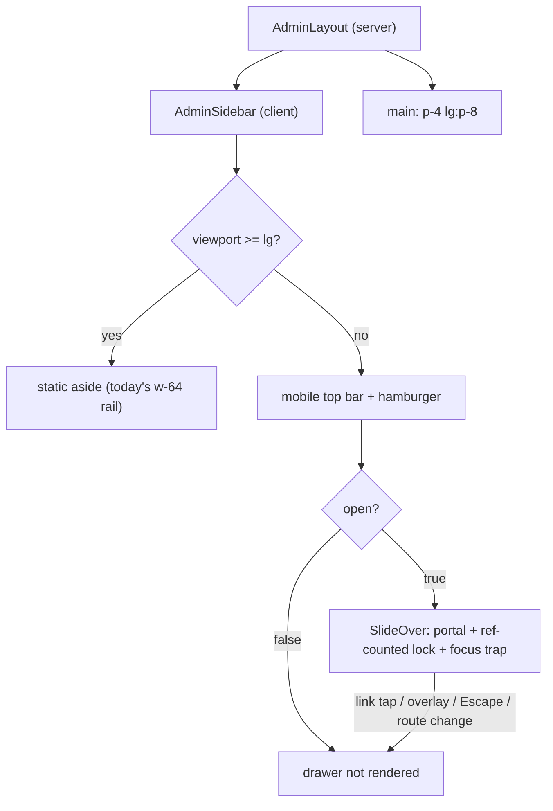

# feat: Make the admin mobile responsive (shell + high-value subset)

## Summary

The admin area (`app/(admin)/`) is desktop-only: a fixed `flex` shell with an always-on 256px sidebar that no phone can dismiss, data lists that fall back to horizontal scroll, and detail/tab views that never reflow. This plan makes the **shell plus the three high-value, away-from-desk admin tasks** usable on a phone — member lookup, application triage, and event attendee/roster management — while leaving desktop unchanged.

Scope was deliberately narrowed from full-surface parity. The config long tail (email templates, scheduled jobs, user/tier admin, broadcast authoring, originators) is genuinely desktop work and is **deferred to a backlog ticket**, not built here. The cut is justified by use case: the only realistic on-phone admin jobs are quick lookups and event-day roster work.

**The anchor use case is the event Registrations tab as a front-desk lookup tool:** door staff on a phone type a name into the (already-existing) search and confirm whether someone is actually registered. That makes the Registrations roster + its search/filter toolbar the highest-priority mobile surface. The admin **Check-ins tab** (a read-only, grouped view of who has already arrived) is also in scope for on-phone readability — distinct from the *live check-in action flow*, which runs through the public route (`/public/events/[id]/check-in`), not the admin. The event **Waitlist tab** is explicitly **out of scope** on mobile: it carries per-row interactive controls that can't be dual-rendered through `ResponsiveTable`, and front-desk/roster work doesn't need it — it stays a horizontal-scroll table on phones.

The work rests on two new shared primitives — a `SlideOver` drawer (extracted from the existing `EventRegistrationDrawer` recipe, **with focus management added**) and a `ResponsiveTable` (table at `md+`, stacked cards below `md`) — plus reflow passes for the subset's detail/tab surfaces, and a mobile-viewport Playwright project.

**Breakpoints (two switch points, both Tailwind-utility-driven):**
- **Content reflow at `md` (768px):** tables→cards, multi-column grids→single column.
- **Shell switch at `lg` (1024px):** sidebar→drawer. This keeps the 768–1024px tablet band on the drawer (reclaiming full content width) instead of re-imposing the 256px rail on a cramped viewport.

---

## Problem Frame

Today's admin shell (`app/(admin)/layout.tsx:46-51`):

```tsx
<div className="min-h-screen bg-cream flex">
  <AdminSidebar admin={adminUser} />          {/* always-on w-64 aside */}
  <main className="flex-1 p-8 overflow-auto">{children}</main>
</div>
```

`AdminSidebar` (`components/admin/AdminSidebar.tsx:80`) is a permanently rendered `<aside className="w-64 ... min-h-screen">` with no open/close state and zero responsive prefixes. On a ~390px phone the sidebar plus `p-8` gutters leave almost no usable width, and it cannot be dismissed. Within the in-scope subset:

- **Members:** `MemberList` is a 7-column `overflow-x-auto` table (unusable by thumb); `MemberDetail` has inner `grid grid-cols-2` blocks (`:233,:262`) that never reflow, plus centered modals (`:401,:452`).
- **Applications:** `ApplicationQueue` summary blocks are `grid-cols-4`/`grid-cols-2` with no single-column fallback.
- **Events / attendees:** `ManageEventTabs` strip is `flex border-b` with no scroll wrapper (`:240`) — 5 tabs overflow; `AttendeeList` is an `overflow-x-auto` roster table.

Desktop is good and must not regress. This is additive responsive layering, not a redesign.

---

## Requirements

- R1. Below `lg` (1024px) the sidebar is replaced by a hamburger-triggered slide-over drawer; at/above `lg` the static rail renders exactly as today.
- R2. The drawer opens from a hamburger control; closes via overlay tap, close button, `Escape`, and route change (including same-route taps); locks body scroll while open; traps and restores keyboard focus.
- R3. The in-scope data tables (`MemberList`, `AttendeeList`) render as stacked, readable cards below `md` and as today's `<table>` at/above `md`.
- R3a. On the event **Registrations** tab (front-desk anchor use case), the existing search + member/non-member filter remain fully usable below `md` (toolbar fits without horizontal overflow; search stays reachable), and filtered results render as readable cards. A front-desk user can type a name on a phone and confirm registration status without horizontal scrolling.
- R3b. The event **Check-ins** tab renders its grouped host→guest→walk-up arrival list as a readable single-column layout below `md` (hand-written reflow, not `ResponsiveTable`, because the list is grouped rather than flat); view-only, no new controls. Desktop layout unchanged.
- R4. In-scope multi-column detail/summary grids (`MemberDetail`, `ApplicationQueue`) collapse to a single column below `md`.
- R5. The event management tab strip remains fully usable below `md` (no clipped/wrapped tabs; off-screen tabs discoverable).
- R6. In-scope toolbars, filter bars, and modal/dialog surfaces fit narrow viewports without horizontal overflow.
- R7. All overlays (drawer, reflowed modals) follow the codebase portal pattern with a shared, reference-counted scroll lock; no new hydration mismatches.
- R8. Desktop layouts are visually unchanged across every admin page (in-scope and deferred alike).
- R9. Mobile-viewport regression coverage exists for the shell, a representative table, and a representative detail view.

---

## Key Technical Decisions

- **Two breakpoints, both Tailwind utilities.** Content reflow at `md` (768px); shell/sidebar switch at `lg` (1024px). The split is deliberate: a single `md` switch would re-impose the 256px rail across the 768–1024px tablet band and reproduce the cramped-content problem the plan exists to fix. **Prefer Tailwind `md:`/`lg:` prefixes over JS `matchMedia`** to avoid SSR/CSR divergence; any unavoidable viewport read sits behind a `mounted` gate in `useEffect`.
- **Introduce two shared primitives in a new `components/ui/` layer.** `components/ui/` is for cross-domain presentational primitives with no business-logic dependencies. `SlideOver` and `ResponsiveTable` are the first two. (`SlideOver` ships with one consumer here — the sidebar — since the existing `EventRegistrationDrawer`/`EventManager` drawer migrations are deferred; this is an accepted forward bet, not a claim of eliminating current duplication.)
- **`SlideOver` extends, not just extracts, the overlay recipe.** Base recipe from `EventRegistrationDrawer.tsx:31-113` (`createPortal` to `document.body`, `mounted` gate, `h-[100dvh]`, safe-area padding, `role="dialog"`/`aria-modal`, `pointer-events-none` icon SVGs). **Added because the recipe lacks them:** (a) focus trap while open, (b) initial focus to the close button on open, (c) focus return to the trigger on close, (d) `Escape` closes the topmost overlay only.
- **One shared, reference-counted scroll lock.** Extract `useBodyScrollLock` as a module-level counter (increment on open, decrement on close; set `overflow:hidden` on first lock, restore the originally-captured value on last unlock). The naive per-instance save/restore corrupts `body.style.overflow` when overlays close out of LIFO order (drawer + a modal opened from inside it) — exactly the iOS-Safari symptom the lock exists to prevent.
- **`ResponsiveTable` keeps per-table cell renderers; presentational cells only.** The primitive owns the table↔card switching and card scaffolding; each table supplies `columns` with `cell(row)` renderers plus a card title/subtitle mapping. Cell renderers must be **presentational** (no `id`/`name`/`htmlFor`, no local state, no focusable form controls beyond links) because both branches are mounted and CSS-gated — a focusable control in a cell would exist twice. Tables with per-row interactive controls render a single branch per viewport (mounted-gated) or stay hand-written.
- **Card visual idiom follows the app's canonical card:** `bg-white rounded-sm border border-border/60`, status pills `px-2 py-0.5 rounded-full text-xs font-body font-medium`, brand tokens from `app/globals.css`.
- **Route every date/currency through `lib/format.ts`.** Reintroducing inline `toLocale*` is the documented cause of the Safari React #418 hydration bug on these exact components (fixed 2026-05-18). Note: the safeguard is "no `toLocale*`/`Intl.*.format` in any cell renderer" — it is independent of the primitive; keep a `grep -rn "toLocale\|new Intl\." components/admin` verification step.

### Relevant learnings carried in

- `docs/solutions/design-patterns/slide-over-portal-escape-stacking-context.md` — portal overlays to `document.body`; `z-[100]` backdrop / `z-[110]` panel; `pointer-events-none` on icon SVGs; `mounted` gate.
- `docs/solutions/runtime-errors/safari-hydration-mismatch-tolocale-formattoparts-2026-05-18.md` — `toLocale*` whitespace divergence trips React #418 on Safari; use `lib/format.ts`.
- `docs/solutions/ui-bugs/admin-lounge-cards-reordering-on-toggle.md` — verify card layouts under `router.refresh()`; unstable sort keys shuffle on re-fetch.

---

## High-Level Technical Design



| Surface | `< md` | `md`–`lg` (tablet) | `>= lg` (desktop) | Unit |
| --- | --- | --- | --- | --- |
| Sidebar | Hamburger → drawer | Hamburger → drawer | Static `w-64` rail | U2 |
| Main padding | `p-4`, full width | `p-4`/`p-6`, full width | `p-8` | U2 |
| In-scope tables | Stacked cards | `<table>` | `<table>` | U3, U4 |
| Detail/summary grids | Single column | Multi-column | Multi-column | U5 |
| Event tab strip | Scroll strip | Inline | Inline | U6 |

`ResponsiveTable` directional API (guidance, not specification):

```tsx
type Column<T> = {
  header: string;
  cell: (row: T) => ReactNode;   // reused in table cell AND card body; presentational only
  cardLabel?: string;            // label shown beside value in card mode
  primary?: boolean;             // card title (no label)
  cardFullWidth?: boolean;       // pill clusters / composite cells span a full card row
  hideInCard?: boolean;
};
```

---

## Implementation Units

### U1. `SlideOver` drawer primitive (with focus management + shared scroll lock)

- **Goal:** A reusable, accessible controlled slide-over that bakes in the codebase's overlay recipe plus focus trapping and a reference-counted body-scroll lock.
- **Requirements:** R2, R7
- **Dependencies:** none
- **Files:**
  - `components/ui/SlideOver.tsx` (new)
  - `components/ui/useBodyScrollLock.ts` (new — module-level reference-counted lock)
- **Approach:** Extract the recipe from `components/public/EventRegistrationDrawer.tsx:31-113`. Controlled props: `open`, `onClose`, `side?: "left" | "right"` (sidebar uses `left`), `ariaLabel`, optional `header`, `children`, and a `triggerRef` (or internal capture of `document.activeElement` on open) for focus return. Internals: `mounted` gate; `useBodyScrollLock(open)`; `createPortal` to `document.body`; backdrop `fixed inset-0 bg-marine/40 z-[100]`; panel `fixed top-0 {side}-0 h-[100dvh] w-full sm:w-[320px] max-w-full bg-white shadow-xl z-[110] flex flex-col`; content `flex-1 overflow-y-auto pb-[max(1.5rem,env(safe-area-inset-bottom))]`; close button `aria-label="Close"` with `pointer-events-none` SVG. **Focus:** on open, focus the close button; trap Tab/Shift-Tab within the panel; on close, return focus to the trigger. **Escape:** close the topmost overlay only (coordinate via the lock's stack/counter).
- **Patterns to follow:** `components/public/EventRegistrationDrawer.tsx` (base recipe); `cn()` from `lib/utils` for `side`-conditional classes.
- **Test scenarios:**
  - Renders no portal node when `open` is false; portals backdrop + panel to `document.body` when true.
  - Body scroll locks while open and restores on close; with two stacked `SlideOver`s, closing the inner one keeps scroll locked, and scroll restores only after both close (reference count). Closing them out of order does not unlock early.
  - `onClose` fires on backdrop click, close-button click, and `Escape`; a nested-overlay `Escape` closes only the topmost.
  - On open, focus moves to the close button; Tab/Shift-Tab stays within the panel; on close, focus returns to the trigger.
  - `side="left"` anchors left; default anchors right.
  - Covers R7. SSR-safe: no portal before `mounted`; panel carries `role="dialog"`, `aria-modal="true"`, `aria-label`.
- **Verification:** U7 drawer e2e at 390px; the `useBodyScrollLock` counter logic has a Vitest unit test (pure module state, runs under the node env — see Risks).

### U2. Responsive admin shell (layout + sidebar)

- **Goal:** Static rail at `lg+`; hamburger + `SlideOver` drawer below `lg`; phone-fit content padding; specified mobile top bar.
- **Requirements:** R1, R2, R8
- **Dependencies:** U1
- **Files:**
  - `app/(admin)/layout.tsx` (modify — `main` padding `p-4 lg:p-8`)
  - `components/admin/AdminSidebar.tsx` (modify — drawer state, hamburger, `lg`-conditional rendering)
- **Approach:** The static `<aside className="w-64 ...">` becomes `hidden lg:flex`. Add a **mobile top bar** (`flex lg:hidden`): `sticky top-0 z-50 h-14`, brand text `GPC Admin` (font-heading) on the left, hamburger button on the right. The drawer panel intentionally covers the top bar (`top-0`). Add an `open` state; render the nav inside `SlideOver` (`side="left"`) below `lg`. **Own the close on link tap** (`onClick={onClose}` on each drawer `<Link>`) so even a same-route tap closes the drawer; keep a `usePathname()` effect as a backstop. Extract the nav list (links + active-state `cn()` + footer identity + sign-out) into a local sub-component shared by rail and drawer so role-scoped links never diverge.
- **Patterns to follow:** active-link `cn()` at `AdminSidebar.tsx:90-95`; brand header markup at `AdminSidebar.tsx:81-84`; member "hide on mobile" precedent `components/member/MemberNav.tsx:47`.
- **Test scenarios:**
  - Covers R8. At `>= lg`, the static rail is visible and the top bar/hamburger is not — DOM matches today.
  - Covers R1. At `< lg` (incl. 768–1023px tablet), rail hidden, top bar + hamburger visible.
  - Covers R2. Hamburger opens drawer; tapping a nav link navigates and closes the drawer; **tapping the already-active link also closes the drawer** (no dead-end); overlay tap and `Escape` close; body scroll locked while open.
  - The `events_admin` redirect path (`layout.tsx:36-44`) does not leave the drawer open.
  - Role-scoped nav (super_admin / events_admin / originator) renders the same link set in rail and drawer.
- **Verification:** U7 shell e2e at 390px, 800px (tablet), 1280px; desktop visually unchanged.

### U3. `ResponsiveTable` primitive

- **Goal:** One component rendering a `<table>` at `md+` and a stacked card list below `md`, for the in-scope tables.
- **Requirements:** R3
- **Dependencies:** none (parallel with U1–U2)
- **Files:**
  - `components/ui/ResponsiveTable.tsx` (new)
  - `components/ui/responsive-table-columns.ts` + `.test.ts` (new — `columns → card fields` mapping helper; pure logic, node-env Vitest)
- **Approach:** Generic over row type `T`. Props: `columns: Column<T>[]`, `rows`, `rowKey`, optional `rowHref`/`onRowClick`, optional `empty`. Desktop branch `<table className="hidden md:table w-full text-sm">` (wrapped in `overflow-x-auto` as a safety net) reproducing today's `thead/tbody`. Mobile branch `<div className="md:hidden space-y-3">`, one card per row (`bg-white rounded-sm border border-border/60 p-4`, `min-h-[60px]`); `primary` column → card title; other non-`hideInCard` columns render as `cardLabel: cell(row)` rows, with `cardFullWidth` cells (pill clusters, composite cells) spanning a full row. When `rowHref` is set the card is a full-bleed `<a>` (block) meeting the 44px tap target; inner interactive elements `stopPropagation`. Both branches call the same `cell(row)` — no duplicated formatting. **Cells are presentational only** (see KTD); interactive-control tables do not use this primitive.
- **Patterns to follow:** table markup `components/admin/MemberList.tsx:172-235`; card shell `components/member/MemberEventsGrid.tsx:184-244`; status-pill idiom `MemberList.tsx:29-36`.
- **Test scenarios:**
  - Covers R3. At `>= md`, renders a `<table>` (one row per entry, with headers); card container not displayed. At `< md`, one card per row; `<table>` not displayed; `primary` is the heading; `hideInCard` columns absent.
  - Custom `cell` renderers (`<Link>`, status pill) render identically in both branches; a `cardFullWidth` pill cluster spans a full card row.
  - The combined DOM contains no duplicate `id`/`name` attributes (guards the presentational-cells rule).
  - Empty `rows` renders `empty` in both branches; `rowHref` makes the whole card tappable.
- **Verification:** U7 table e2e asserts table-vs-card at the two viewports; Vitest covers the mapping helper.

### U4. Migrate in-scope lists (`MemberList`, `AttendeeList`)

- **Goal:** Convert the two away-from-desk list views to cards on mobile.
- **Requirements:** R3, R3a, R6, R7
- **Dependencies:** U3
- **Files (modify):**
  - `components/admin/MemberList.tsx`
  - `components/admin/AttendeeList.tsx`
- **Approach:** Define `columns` with existing cell renderers moved into `cell(row)`. **Card field hierarchy (specified, not "sensible"):**
  - `MemberList` — primary: name (+ member number sub-line); card body: email, tier, status pill (`cardFullWidth`), membership period, originator, joined. Keep bulk-reactivation/CSV controls above the list (they already `flex-wrap`).
  - `AttendeeList` — primary: attendee name; card body: ticket type, payment status pill, check-in status (`cardFullWidth`), registration date. (Implementer confirms exact columns against the component before finalizing.) **Front-desk priority:** the existing search box + member/non-member filter (`AttendeeList.tsx:34-72`) is already `flex`-with-`flex-1 min-w-[12rem]` — verify it wraps cleanly at 390px and the `type="search"` input stays full-width and reachable above the card list. Do not rebuild search; it exists.
  - All dates/currency via `lib/format.ts`; run the `toLocale*` grep guard.
- **Patterns to follow:** U3's `ResponsiveTable`; `lib/format.ts`.
- **Test scenarios:**
  - Covers R3. `MemberList` renders the 7-column table at `md+` and member cards below `md`; filtered count and CSV export still work.
  - A member card shows name (title), member number, email, tier, status pill, period, originator, joined — all `lib/format.ts`-formatted.
  - Covers R7. No Safari #418 warning on either list; combined DOM has no duplicate `id`/`name`.
  - Card list order stable under `router.refresh()`.
- **Verification:** Both pages identical at `md+`; cards below `md`; `npm run test:admin` green.

### U5. Reflow in-scope detail/summary grids; adapt `MemberDetail` modals

- **Goal:** Single-column reflow for member detail and application triage; modals fit narrow viewports.
- **Requirements:** R4, R6, R7
- **Dependencies:** U1 (for any modal moved onto `SlideOver`)
- **Files (modify):**
  - `components/admin/MemberDetail.tsx` (inner `grid grid-cols-2` at `:233,:262` → `grid-cols-1 md:grid-cols-2`; centered modals at `:401,:452` → full-width + gutters + `max-h-[90dvh] overflow-y-auto`, or onto `SlideOver`/portal; align overlay tokens to `z-[100]`/`bg-marine/40`)
  - `components/admin/ApplicationQueue.tsx` (`grid-cols-4`/`grid-cols-2` summaries → `grid-cols-1 sm:grid-cols-2 lg:grid-cols-4`; detail panels single-column on mobile)
- **Approach:** Mobile-first `grid-cols-1` with `md:`/`lg:` restoration so desktop is unchanged. Because U2's mobile top bar adds a `sticky`/`z` ancestor, route `MemberDetail`'s modals through the portal (`SlideOver` or a portaled dialog) rather than leaving them as in-tree `z-50` overlays — decide this up front, not "if they misbehave." The `sm:`/`lg:` steps in `ApplicationQueue` summaries are a deliberate exception to the `md`-content rule (multi-stat grids benefit from intermediate columns).
- **Patterns to follow:** existing `grid grid-cols-1 md:grid-cols-2`; portal pattern from the slide-over learning.
- **Test scenarios:**
  - Covers R4, R8. `MemberDetail` inner grids single-column below `md`, two-column at `md+` (desktop unchanged).
  - `ApplicationQueue` summary stacks to one column on mobile, 4-up at `lg`.
  - Covers R6. A `MemberDetail` modal opens at 390px with no horizontal overflow and scrolls when taller than the screen.
  - Covers R7. A portaled modal appears above the sticky top bar (no stacking-context regression).
- **Verification:** Visual pass on `MemberDetail`, `ApplicationQueue` at 390px; desktop unchanged; admin e2e green.

### U6. Event tab strip + in-scope toolbars

- **Goal:** Make the event management tab strip and the in-scope toolbars usable on a phone.
- **Requirements:** R5, R6, R8
- **Dependencies:** none
- **Files (modify):**
  - `components/admin/ManageEventTabs.tsx` (tab strip `:240`)
  - In-scope toolbar/filter-bar audit (add `flex-wrap` where missing; `MemberList`'s toolbar is already `flex flex-wrap` — skip it)
- **Approach:** Wrap the tab strip in `overflow-x-auto whitespace-nowrap` with `-mx-4 px-4` edge bleed; add a right-edge fade affordance (gradient/`after:` mask) so off-screen tabs are discoverable. If `ManageEventTabs` uses `role="tablist"` + arrow keys, call `scrollIntoView({ block: 'nearest', inline: 'nearest' })` on tab activation so the active tab is always visible; otherwise keep the current button semantics. Keep `md+` inline as today. Ensure in-scope toolbars use `flex flex-wrap gap-*`.
- **Patterns to follow:** `flex flex-wrap gap-3` toolbar at `MemberList.tsx:113`; `flex ... flex-wrap` at `ManageEventTabs.tsx:263`.
- **Test scenarios:**
  - Covers R5. With 5 event tabs at 390px, the strip scrolls horizontally with no clipped/wrapped labels; a tab activated off-screen scrolls into view; the active underline tracks selection; `md+` renders inline.
  - Covers R6. In-scope toolbars wrap rather than overflow at 390px.
  - Covers R8. Switching tabs preserves pane content; desktop layout unchanged.
- **Verification:** `ManageEventTabs` and an event-detail page usable at 390px; admin e2e green.

### U7. Mobile-viewport Playwright project and regression tests

- **Goal:** Lock in mobile behavior; there is no mobile/device emulation in `e2e/` today.
- **Requirements:** R9
- **Dependencies:** U2, U3, U4
- **Files:**
  - `playwright.config.ts` (modify — add an `admin-mobile` project, `use: { ...devices['iPhone 13'] }` or `viewport: { width: 390, height: 844 }`, `storageState` reusing `e2e/.auth/admin.json`, `dependencies: ["setup"]`. **Partition `testMatch` by filename** so the two admin projects don't overlap: new project matches `/admin\/mobile-.*\.spec\.ts/`; constrain the existing `admin` project to exclude mobile specs, e.g. `/admin\/(?!mobile-).*\.spec\.ts/`)
  - `e2e/admin/mobile-shell.spec.ts` (new)
  - `e2e/admin/mobile-members.spec.ts` (new)
  - `package.json` (modify — add `test:admin-mobile` script)
- **Approach:** Reuse the existing `admin` project's auth wiring at `playwright.config.ts:18-36` with a non-overlapping `testMatch`. Shell spec: rail hidden + hamburger visible at mobile width; drawer opens on hamburger tap; a nav link navigates and closes the drawer. Members spec: member cards visible and `<table>` hidden at mobile width; inverse at desktop width (guards R8). Keep specs thin (matching existing smoke-test style).
- **Patterns to follow:** `e2e/admin/members.spec.ts` smoke style; `e2e/global-setup.ts` auth; project config `playwright.config.ts:18-36`.
- **Test scenarios:**
  - Covers R1, R2. Mobile shell: hamburger visible, rail hidden; drawer opens/closes; nav link closes drawer + navigates.
  - Covers R3. Mobile members: cards visible, `<table>` hidden; desktop viewport shows the inverse.
  - Covers R9. `npm run test:admin-mobile` green; existing `test:admin` still green.
- **Verification:** Both new specs pass; `test:admin` and `test:admin-mobile` green.

### U8. Check-ins tab mobile reflow (read-only grouped list)

- **Goal:** Make the event Check-ins arrival view readable on a phone without rebuilding it.
- **Requirements:** R3b, R8
- **Dependencies:** none (parallel with U1–U6)
- **Files (modify):**
  - `components/admin/ManageEventTabs.tsx` (check-ins tab body, ~`:283-362`)
- **Approach:** The check-ins tab renders grouped arrival rows — host rows (`flex items-center justify-between gap-3 px-4 py-3`) with nested indented guest `<li>`s (`pl-8`) and an unlinked walk-up section. It is **view-only** (no buttons/inputs in the region — verified). Reflow each row so the right-aligned metadata wraps below the name on narrow screens instead of being squeezed against it: the inner content divs already use `flex-wrap`, so the main change is letting the `justify-between` row stack (`flex-col sm:flex-row` / `items-start`) below `sm`/`md` and preserving the host→guest indentation as a readable nested block. Keep the `md+` layout exactly as today. This is a hand-written reflow — **not** `ResponsiveTable` (the list is grouped, not a flat table).
- **Patterns to follow:** existing `flex flex-wrap` usage in the same region; card idiom from U3 if a card wrapper reads better than indented `<li>`s on mobile (implementer's call).
- **Test scenarios:**
  - Covers R3b. At 390px the grouped arrival list reads cleanly: host name, then guest sub-rows indented/nested, then walk-ups — no horizontal overflow, no metadata crushed against names.
  - Covers R8. At `md+` the check-ins layout is visually unchanged.
  - No new interactive controls introduced; the tab remains view-only.
- **Verification:** Check-ins tab usable at 390px; desktop unchanged; admin e2e green.

---

## Scope Boundaries

**In scope:** The shared shell (layout + sidebar drawer); two `components/ui/` primitives; the three high-value tasks — member lookup (`MemberList`, `MemberDetail`), application triage (`ApplicationQueue`), and **event front-desk/roster work**: the Registrations tab as the anchor (`AttendeeList` + its existing search/filter, U4), the read-only Check-ins arrival view (U8), and the tab strip (`ManageEventTabs`, U6); mobile-viewport tests. Desktop parity preserved everywhere, including deferred pages.

**Explicitly out (event tabs):** The **Waitlist** tab stays a horizontal-scroll table on mobile — per-row interactive controls (`<select>`/convert button) can't be dual-rendered through `ResponsiveTable`, and front-desk/roster work doesn't require it. The **Messaging** tab is deferred (see backlog). **Settings** inherits only the generic grid reflow (U5 patterns), not bespoke mobile work.

### Deferred to Backlog (tracked in Notion → 🛠 Product Features)

Full mobile parity for the config long tail — genuinely desktop tasks, not optimized for phone in this plan:
- `EmailTemplateList` / `EmailTemplateEditor`, `ScheduledJobsList` (incl. its nested run-history `<table>`), `UserManagement` (per-row interactive `<select>`/toggle — needs single-branch handling), `TierManager`, `OriginatorList`, `BroadcastList`/`BroadcastDraftsList`/`BroadcastDetail`, `BroadcastComposer` + `RichTextEditor` (TipTap toolbar), `EventMessaging` (expandable `colSpan` preview rows — needs a hand-written card layout, not `ResponsiveTable`).
- Migrating the existing `EventManager` / `EventRegistrationDrawer` drawers onto `SlideOver` (cleanup, not a blocker).
- Extracting a shared status-pill component from the duplicated color maps.
- Capturing the responsive-table + breakpoint conventions as a `docs/solutions/` learning via `/ce-compound` once this lands.

Deferred surfaces still render and scroll on mobile ("renders, not optimized") and stay visually unchanged on desktop.

### Out of Scope

- Visual redesign, new admin features, or IA changes.
- Touch gestures (swipe-to-dismiss); standard tap/scroll only.
- Changing the root `viewport` meta (`maximumScale: 1` stays).

---

## Risks & Dependencies

- **Risk — Safari hydration #418 reintroduction.** Duplicating cells into cards triggers the documented bug. *Mitigation:* one `cell()` renderer per column; all dates/currency via `lib/format.ts`; `toLocale*` grep guard in U4. The safeguard is "no `toLocale*`/`Intl.*.format` in any cell renderer," independent of the primitive.
- **Risk — dual-render of interactive cells.** Both branches stay mounted; a focusable control in a cell exists twice (duplicate handlers / `id` / `name`). *Mitigation:* presentational-cells rule; the one in-scope interactive table is none (`UserManagement` is deferred); U3 test asserts no duplicate `id`/`name`. Document the row-count ceiling under which 2× markup of read-only lists is accepted.
- **Risk — overlay stacking + nested scroll lock.** The sticky mobile top bar creates a stacking context; non-portaled `z-50` modals can render beneath it, and naive scroll-lock save/restore corrupts on out-of-order close. *Mitigation:* `SlideOver` portals with `z-[100]`/`z-[110]`; `MemberDetail` modals move to the portal in U5; `useBodyScrollLock` is reference-counted (U1).
- **Risk — drawer close-on-navigate edge cases.** Same-route taps and the `events_admin` redirect could strand the drawer open. *Mitigation:* close is owned by the link `onClick`; pathname effect is a backstop; both cases tested (U2).
- **Risk — Vitest is node-env (no DOM).** The DOM-heavy `SlideOver` behavior is covered by U7 e2e, not Vitest. Only **pure** logic gets Vitest unit tests — the `useBodyScrollLock` counter (module state) and the `responsive-table-columns` mapping helper. No jsdom dependency or CI change is introduced.
- **Risk — desktop/tablet regression.** *Mitigation:* every reflow uses `grid-cols-1 md:grid-cols-N`; U2/U3/U7 carry desktop-unchanged assertions; U2 adds a tablet (800px) assertion.
- **Dependencies:** U1 → U2 and U5(modals); U3 → U4; U7 needs U2–U4. U3/U6/U8 parallel with U1/U2 (U8 is fully independent — read-only reflow in one file).

---

## Documentation / Operational Notes

- No env vars, API contracts, CI config, or DB changes — purely client-side layout. No migration or deploy gating.
- Execute in a git worktree rather than directly on the active branch.
- After landing, a strong `/ce-compound` candidate (responsive-table + two-breakpoint convention is net-new in `docs/solutions/`).

---

## Sources & Research

- Shell & sidebar: `app/(admin)/layout.tsx:46-51`, `components/admin/AdminSidebar.tsx:79-116`
- Drawer recipe: `components/public/EventRegistrationDrawer.tsx:31-113`
- Reflow/card conventions: `components/member/MemberEventsGrid.tsx:119,184-244`; `app/(member)/dashboard/page.tsx:121,226`; `components/member/MemberNav.tsx:47,65`
- Tokens/breakpoints/fonts: `app/globals.css:3-59` (no custom breakpoints); `cn()` `lib/utils.ts:4`
- In-scope components: `components/admin/MemberList.tsx:172-235`, `components/admin/MemberDetail.tsx:233,262,401,452`, `components/admin/ApplicationQueue.tsx`, `components/admin/ManageEventTabs.tsx:240`, `components/admin/AttendeeList.tsx`
- Tests: `playwright.config.ts:18-36`, `e2e/admin/*.spec.ts`, `e2e/global-setup.ts` (no mobile viewport coverage today)
- Learnings: `docs/solutions/design-patterns/slide-over-portal-escape-stacking-context.md`; `docs/solutions/runtime-errors/safari-hydration-mismatch-tolocale-formattoparts-2026-05-18.md`; `docs/solutions/ui-bugs/admin-lounge-cards-reordering-on-toggle.md`
