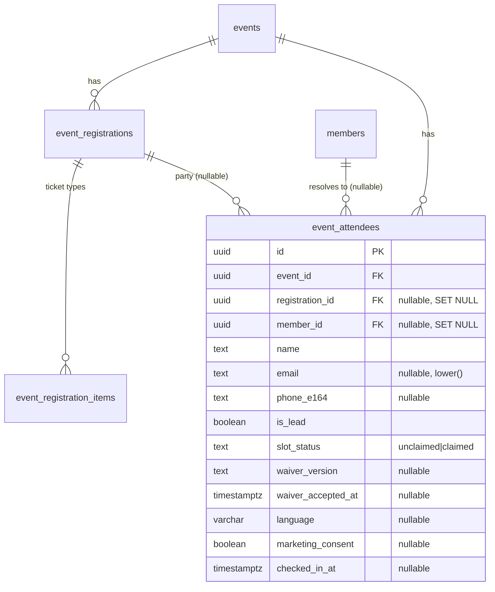
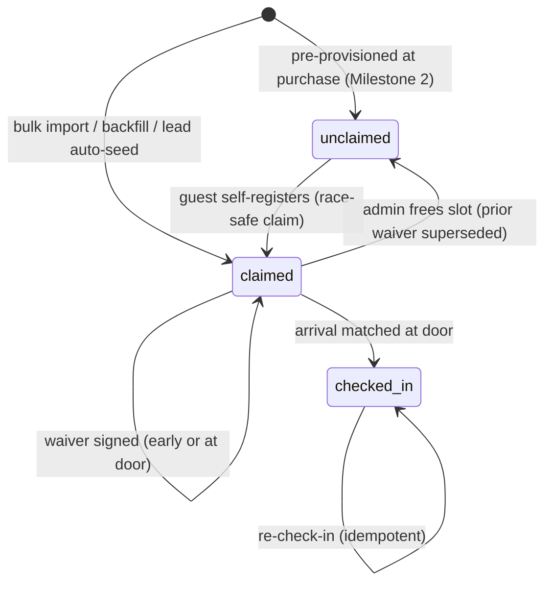
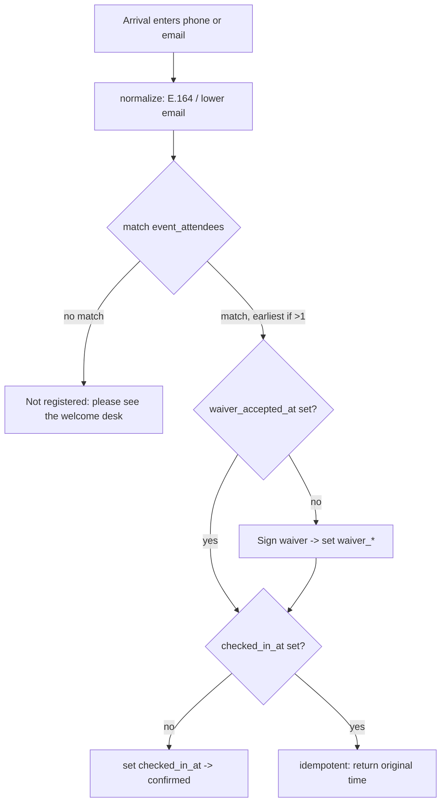

# feat: Event guest roster and phone/email check-in

## Summary

Introduce a first-class **attendee roster** for every event: each attendee is captured before the event (by registration, a guest self-registration link, admin bulk-import, or ops) as an identified person (name + email or phone) who signs their own waiver. The door check-in matches arrivals by **phone or email** against the roster and is a **strict gate for every event**: found → in, not found → "please see the welcome desk." The kiosk shows no registration path — self-rescue is staff-mediated and off-app. The per-event strict toggle and the "who invited you?" inviter step are removed; strict is now the universal default. Delivered in two milestones — a June 6 critical path (roster table, registration phone capture, admin bulk-import, phone/email matching, per-attendee waiver, strict gate) and a self-registration-link era that follows.

---

## Problem Frame

Today a multi-ticket purchase stores only the purchaser (`event_registrations`: one name + email + quantity). Individual guests don't exist as records until they walk up and check themselves in by email (`event_checkins`, keyed `UNIQUE(event_id, email)`). With ticket types live, one lead routinely buys several tickets for people the system has never seen, so ops has no advance attendee list, guests can't be matched reliably (multiple emails, none remembered), and there's no guarantee each guest signed the liability waiver. The current "no match → who invited you? → free-text" fallback yields unverified, unstructured data, and the per-event `strict_checkin` toggle was unworkable precisely because there was no advance roster to be strict against — legitimate guests were never individually registered, so strict mode could only turn them away. An advance roster for every event plus a strict door resolves both at once: everyone is captured before the event, and the door can safely refuse anyone not on it.

The keystone constraint: `event_checkins.email` is `NOT NULL` and load-bearing as the idempotency key, so it physically cannot hold a phone-only attendee. A phone-or-email identity model requires a new per-person record. See origin: `docs/brainstorms/2026-06-03-event-guest-roster-checkin-requirements.md`.

---

## Requirements

Carried from the origin requirements doc (R1–R18) and extended with plan-introduced requirements (R19–R24) surfaced by research and flow analysis.

**Roster & identity**
- R1. Each purchased ticket corresponds to one attendee record identified by name plus at least one of email or phone.
- R2. The lead/purchaser counts as one of the N attendees, not an additional seat.
- R3. An attendee record references which registration/party it belongs to when one exists; admin/bulk-added attendees may have no registration.
- R4. Phone numbers are captured with an enforced country code and stored in E.164; a country selector lists FR, CH, UK, DE, IT, ES first with type-to-filter. Email matching is case-insensitive. No verification step.
- R19. The attendee record is the per-person source of truth for identity, waiver acceptance, and arrival. `event_checkins` is retired for new writes and retained for history (see origin: removal of strict/inviter).
- R20. Phone normalization is centralized so the same number entered at any surface compares equal, including correct per-country trunk-zero handling.
- R25. Event registration (public and member-initiated) captures a phone number via the shared phone input alongside email — email stays required (the confirmation email needs a destination); phone is added so every registrant/lead is matchable at the door by phone or email. Stored as `phone_e164` on `event_registrations` and carried onto the lead attendee row.

**Self-registration link** *(Milestone 2)*
- R5. A purchase produces a shareable self-registration link scoped to that registration.
- R6. The link admits at most N self-registrations (N = total purchased quantity, independent of `counts_as_seat`), then reports full.
- R7. A guest self-registers by providing name + email or phone; the waiver may be signed at this step.
- R8. Freeing a slot makes one self-registration slot available again.
- R9. The purchaser's confirmation email includes the self-registration link and explicitly prompts the lead to share it.
- R21. Slot-claim is race-safe at the database level — concurrent or repeated claims can never exceed N.

**Waiver**
- R10. Every attendee signs the waiver individually; signing is mandatory before check-in completes.
- R11. The waiver can be signed during self-registration or at the door; an attendee who signed early is not re-asked.
- R12. Waiver acceptance is recorded per attendee with its content-hash version and language.
- R22. The signed waiver version is honored as-is on event day even if the waiver text changed after signing; the audit records exactly which version was accepted.

**Door check-in**
- R13. Check-in matches an arrival to an attendee by phone or email — whichever is provided — tolerant of case and contact format. If a contact resolves to more than one attendee, matching is deterministic (earliest-created); there is no name-based disambiguation.
- R14. A matched attendee with a signed waiver checks in immediately; a matched attendee without one signs, then checks in.
- R15. An unmatched arrival is not admitted. The kiosk shows only a "not registered — please see the welcome desk" message — no registration links, options, routing, or event-visibility branching. Self-rescue is staff-mediated and off-app: front-desk staff may, at their discretion, direct the person to register via the public events page / member login or share the active members-only invite link; the person registers on their own device and is then found and checked in.
- R16. The per-event strict toggle (`strict_checkin`) and the "who invited you?" inviter step are removed from the check-in flow.
- R26. Check-in is strict for every event by default — only an attendee already on the roster can be checked in. There is no per-event strictness setting and no on-kiosk registration; the door is a pure gate.
- R24. Re-check-in of an already-arrived attendee is idempotent and returns the original arrival time.

**Admin / ops**
- R17. Admin can bulk-load attendee records (name + phone/email) for an event whose roster was collected out-of-band, deduplicated against existing records.
- R18. Ops can view the full attendee list per event — name, phone/email, party/lead, waiver status, checked-in status — and export it.

---

## Key Technical Decisions

- KTD1. **A new `event_attendees` table is the per-person source of truth**, replacing `event_checkins` for new writes (kept for history). Phone-only attendees cannot live in the email-unique check-in table, and a single row carried across its lifecycle (rostered → claimed → waiver-signed → checked-in) matches the established claim-and-transition pattern (`docs/solutions/design-patterns/draft-row-claim-and-transition-2026-05-06.md`). Waiver acceptance and `checked_in_at` live on this row; check-in is a guarded timestamp flip, not a separate insert.

- KTD2. **No uniqueness constraint on contact; shared phone/email is allowed.** A contact can in principle resolve to more than one attendee (a shared family number); matching resolves deterministically to the earliest-created row — there is no name-picker (R13, KTD10). Idempotency is keyed on the attendee row itself (`checked_in_at`), not on contact. This deliberately avoids adding a partial-unique index whose writers (register route, Stripe `pending→paid` webhook, bulk import) would have to handle `23505` (`docs/solutions/database-issues/partial-unique-index-stripe-webhook-23505-deadlock-2026-05-21.md`).

- KTD3. **Phone normalization via `libphonenumber-js` in a shared `lib/phone.ts`**, adopted across every phone input (door, self-reg, member profile, application form). The repo's existing hand-rolled `localPhone.replace(/^0/, "")` strips trunk zeros unconditionally, which corrupts Italian numbers and would cause door mismatches. A real library gives correct per-country E.164 and a single normalizer both writers and the matcher share. Alternative considered: extend the hand-rolled concat in `lib/dial-codes.ts` — rejected for the IT/edge-country correctness risk on the matching path.

- KTD4. **The door matches the roster only** (`event_attendees` for the event); the direct active-member match tier is dropped. Every event requires registration, so a member who didn't register is simply "not found" like anyone else. Simpler matcher, one surface.

- KTD5. **Bulk import dedupes by normalized phone OR `lower(email)` within the event** (no name lookup), may create registration-less rows (`registration_id` nullable, `ON DELETE SET NULL`), and reports per-row failures rather than rejecting the whole batch — friendlier for a hand-collected June 6 list. Existing paid/free registrations are backfilled as `is_lead` attendees first (U1) so purchasers stay matchable. June-6 caveat: those existing registrations predate phone capture (U12) and are email-only, so the collected import list should carry each lead's email where known so they merge by email; a lead that can't merge simply coexists with its import row (both matchable) and ops reconciles via U11.

- KTD6. **Slot cap is structural, not counted in app code.** At purchase, N attendee rows are pre-provisioned (1 `is_lead` claimed from the purchaser, N−1 `unclaimed`); self-registration claims an unclaimed row via a race-safe guarded UPDATE in an RPC. An app-side "count rows; if < N insert" would silently over-admit because `@supabase/supabase-js` truncates reads at 1000 rows (`docs/solutions/database-issues/supabase-row-fetch-undercount-when-aggregating-2026-05-19.md`). Milestone 2.

- KTD7. **Waiver currency is honor-on-sign** (R22): any signed version is accepted on the day; the content-hash `WAIVER_VERSION` audit already proves which text was agreed. Freeing a slot voids the prior occupant's waiver for that slot (kept as a superseded audit row); the new occupant signs fresh.

- KTD8. **Two-milestone sequencing.** Milestone 1 (U1–U7, U12) is everything June 6 needs and ships first. Milestone 2 (U8–U11) adds the self-registration link, its email, the pre-provisioned-slot cap, and admin slot management. The link is not on the June 6 critical path because the roster is bulk-loaded.

- KTD9. **Public links are built from `NEXT_PUBLIC_APP_URL`, never `request.url`** (Railway proxy yields `0.0.0.0:8080` — `docs/solutions/integration-issues/railway-nextjs-supabase-env-and-url-config.md`). The self-registration token is a CSPRNG secret scoped to the registration and carried in the URL path, mirroring `events.invite_code`.

- KTD10. **Registration captures phone going forward; no name lookup anywhere.** The public and member registration flows add a phone field (R25, U12), so new registrations/leads carry `phone_e164` and are door-matchable by phone or email without any name logic. This removes the email-only-lead matching gap at the source, so both the door name-picker and the bulk-import name fallback are dropped — matching and dedupe key on contact only, and a multi-attendee contact collision resolves deterministically (earliest-created).

- KTD11. **Strict-by-default; the app mediates nothing.** The check-in app is a pure gate for all events: found → in, not-found → "please see the welcome desk." It never registers, routes, shows links, or branches on event visibility. Self-rescue (register via the public page / member login, or the active members-only invite link) is staff-directed and happens on the attendee's own device, off the kiosk. This makes strictness universal — replacing both the earlier per-event `strict_checkin` toggle and the on-kiosk routing screens — and is a deliberate reversal of the brainstorm's "permissive door" framing, now safe because an advance roster exists for every event (R26, KTD8).

---

## High-Level Technical Design

### Data model

`event_checkins` remains in the schema unchanged but is no longer written. Constraint on `event_attendees`: `CHECK (email IS NOT NULL OR phone_e164 IS NOT NULL)` and `CHECK (email = lower(email))`. Lookup indexes (non-unique) on `(event_id, lower(email))` and `(event_id, phone_e164)`.

### Attendee slot lifecycle

### Door check-in resolution

---

## Implementation Units

Milestone 1 (U1–U7, U12) is the June 6 critical path. Milestone 2 (U8–U11) is the self-registration-link era. (U12 is numbered by creation order but belongs in Milestone 1, sequenced right after U2.)

### Milestone 1 — June 6 critical path

### U1. `event_attendees` schema and backfill

- **Goal:** Create the attendee roster table and seed it from existing paid/free registrations so purchasers are matchable on June 6.
- **Requirements:** R1, R2, R3, R19; advances R12 (waiver columns).
- **Dependencies:** none.
- **Files:** `supabase/migrations/<ts>_event_attendees.sql` (new), `types/database.ts` (regen + re-append manual aliases at tail).
- **Approach:** Additive migration following house conventions (header block with `DEPLOY ORDERING` + shared-db warning, `CREATE TABLE IF NOT EXISTS`, `id uuid PK DEFAULT gen_random_uuid()`, `created_at`, FKs with explicit `ON DELETE` intent — `event_id` CASCADE, `registration_id`/`member_id` SET NULL, the two CHECKs, lookup indexes, `ENABLE ROW LEVEL SECURITY` with no policies). Backfill in the same migration: `INSERT ... SELECT` one `is_lead=true`, `slot_status='claimed'` attendee per qualifying `event_registrations` row in status `('paid','free')`, guarded `WHERE NOT EXISTS` for idempotency. **Project `lower(trim(email))` (not raw email) so a single legacy non-normalized address can't trip the `email = lower(email)` CHECK and abort the migration mid-apply on the shared prod DB; skip any row whose trimmed email is empty (it would violate the contact CHECK).** Scope the backfill to **published/upcoming events** (avoid a long lock on `event_registrations` from an all-history sweep); historical events can be backfilled separately if analytics need them. After regen, re-append `MemberStatus`/`PaymentCaptureStatus` aliases (`feedback_db_types_aliases`).
- **Patterns to follow:** `supabase/migrations/20260526130000_event_ticket_types.sql` (table + seed shape), `supabase/migrations/20260521120000_event_checkins_marketing_consent.sql` (additive column comment style).
- **Test scenarios:**
  - Migration applies cleanly and is idempotent on re-apply (re-run inserts no duplicate backfill rows).
  - Insert with neither email nor phone is rejected by the contact CHECK.
  - Insert with an uppercase email is rejected by the `email = lower(email)` CHECK.
  - Backfill creates exactly one attendee per published/upcoming paid/free registration; pending/cancelled registrations seed none.
  - A legacy registration with an uppercased or whitespace-padded email backfills successfully (normalized), not aborting the migration.
  - `Covers R2.` Backfilled purchaser rows carry `is_lead = true`.
- **Verification:** Table exists with constraints and indexes; a `select count(*)` over backfilled attendees equals the count of paid/free registrations.

### U2. Shared phone capture: `lib/phone.ts` + `PhoneInput`, adopted across all phone inputs

- **Goal:** One E.164 normalizer and one country-selector input used everywhere phones are captured.
- **Requirements:** R4, R20.
- **Dependencies:** none.
- **Files:** `package.json` (+`libphonenumber-js`), `lib/phone.ts` (new), `components/common/PhoneInput.tsx` (new), `components/member/ProfileForm.tsx` (adopt), `components/public/ApplicationForm.tsx` (adopt), `lib/dial-codes.ts` (pin order reference).
- **Approach:** `lib/phone.ts` exposes `toE164(input, country)` / `parseE164(stored)` / `isValidPhone(...)` wrapping `libphonenumber-js`. `PhoneInput` is a country combobox (calling codes from the library, FR/CH/UK/DE/IT/ES pinned first, type-to-filter) plus a national-number field, emitting an E.164 string. Retrofit the two existing forms to use it; on read, parse existing stored member phone values (already `+code+local`) back into the control. Default country CH. Keep all date/currency rendering via `lib/format.ts` if any appears in these forms (Safari hydration trap, `docs/solutions/runtime-errors/safari-hydration-mismatch-tolocale-formattoparts-2026-05-18.md`).
- **Patterns to follow:** existing `<select>`+`<input>` concat in `components/member/ProfileForm.tsx`; `lib/dial-codes.ts` pin ordering.
- **Test scenarios:**
  - `Covers R4.` CH `078 123 45 67` + CH → `+41781234567` (trunk zero stripped).
  - `Covers R20.` IT `06 1234 5678` + IT keeps the internal leading zero where the library requires it; round-trips equal.
  - FR/UK/DE/ES representative numbers normalize to correct E.164.
  - Invalid/too-short number for the selected country is rejected (not silently stored).
  - `parseE164` of an existing stored member phone re-selects the right country and national part.
  - Selector lists FR/CH/UK/DE/IT/ES first; type-to-filter narrows to a country and selects it.
- **Verification:** Same human number entered via any adopting form produces an identical E.164 string; existing member profiles still edit/save correctly.

### U12. Capture phone at event registration and seed the lead's roster row

- **Goal:** Add phone capture to the event registration flows and seed the purchaser as an `is_lead` attendee, so every registrant carries a phone and lands on the roster — not just imported or self-registered guests.
- **Requirements:** R25; supports R1, R2, R13.
- **Dependencies:** U1, U2.
- **Files:** `supabase/migrations/<ts>_event_registrations_phone.sql` (add nullable `phone_e164`), `app/api/events/[id]/register/route.ts`, `lib/events/registration.ts`, the public registration form component (the `PhoneInput`-adopting surface), `app/api/webhooks/stripe/route.ts` (lead seed on paid confirmation).
- **Approach:** Add nullable `phone_e164` to `event_registrations`. The registration form adds `PhoneInput` (U2) beside the still-required email; submit normalizes and stores `phone_e164` (email stays required — the confirmation email needs a destination; phone is optional but encouraged). Member-rate detection is unchanged (auth/email). When a registration is **confirmed** (free → at creation; paid → on webhook promotion, mirroring where the confirmation email fires), seed one `is_lead=true, slot_status='claimed'` attendee row (name + `lower(email)` + `phone_e164`), guarded `WHERE NOT EXISTS` so it can't double-seed against the U1 backfill. This single-lead seed is the Milestone 1 precursor to U8's in-RPC N-slot pre-provisioning, which supersedes it.
- **Patterns to follow:** existing register-route validation in `app/api/events/[id]/register/route.ts`; `PhoneInput`/`toE164` from U2; attendee insert shape from U1.
- **Test scenarios:**
  - `Covers R25.` A registration submitted with a phone stores `phone_e164`; email remains required; a registration without a phone still succeeds.
  - A confirmed free registration seeds exactly one `is_lead` attendee carrying name + email + phone.
  - A paid registration seeds the lead attendee on webhook confirmation, not while `pending`.
  - The lead seed does not duplicate a row the U1 backfill already created (`WHERE NOT EXISTS`).
  - The member-rate path is unaffected by the added phone field.
- **Verification:** New registrations carry a phone and a matchable `is_lead` roster row by phone or email, without the bulk import.

### U3. Admin bulk-import roster

- **Goal:** Let an admin load a collected roster (name + phone/email) for an event, deduplicated.
- **Requirements:** R17, R3; advances R1, R4.
- **Dependencies:** U1, U2.
- **Files:** `supabase/migrations/<ts>_import_event_attendees_rpc.sql` (new RPC), `lib/events/roster.ts` (new wrapper — in `lib/`, not `route.ts`), `app/api/admin/events/[id]/attendees/import/route.ts` (new), `components/admin/RosterImport.tsx` (new), wired into `components/admin/ManageEventTabs.tsx`.
- **Approach:** Admin pastes rows (or uploads a simple CSV — hand-parsed, no new parse dep) of `name, country, phone, email?`. The route `assertAdmin()`s, normalizes each phone via `lib/phone.ts`, and calls a `SECURITY DEFINER` RPC (which validates the `event_id` exists and is importable) that inserts attendee rows for the event and returns a per-row result (`inserted` / `merged` / `error`). Partial success allowed; the response surfaces bad rows. Rows may be registration-less.
  - **Dedupe key:** match an existing attendee by normalized phone OR `lower(email)` within the event (no name lookup — KTD10). On a match, **enrich** (fill a missing phone or email) but never overwrite an existing `waiver_*`, `checked_in_at`, or a non-null contact value (single-writer carry-through, `docs/solutions/architecture-patterns/single-writer-field-ownership-across-routes.md`). June-6 note: backfilled leads are email-only, so include each lead's email in the collected list where known so they merge by email; a lead that can't merge coexists as a second matchable row and is reconciled via U11.
- **Patterns to follow:** `create_event_registration` RPC shape (`supabase/migrations/20260526131000_event_write_rpcs.sql`) — `jsonb` array arg, `INSERT ... SELECT jsonb_array_elements`, `REVOKE ALL ... FROM PUBLIC` + `GRANT EXECUTE ... TO service_role`; `assertAdmin()` from `app/api/admin/events/[id]/attendees/route.ts`.
- **Test scenarios:**
  - `Covers R17.` A clean batch of new rows inserts all as attendees.
  - An import row whose email matches a backfilled (email-only) lead merges and enriches that row with the collected phone, instead of duplicating.
  - A merge never overwrites an already-signed waiver or a recorded arrival.
  - A row duplicated within the same batch collapses to one attendee.
  - A row with no email and no phone is reported as an error and does not abort the batch.
  - A phone supplied with the wrong/missing country is rejected with a row-level message.
  - Non-admin session is rejected (403).
- **Verification:** Importing the June 6 list yields one attendee per real person, no duplicates against purchasers, and a clear report of any unusable rows.

### U4. Phone-or-email door matching

- **Goal:** Replace email-only matching with phone-or-email matching over the roster.
- **Requirements:** R13.
- **Dependencies:** U1, U2.
- **Files:** `lib/events/checkin.ts`, `app/api/events/[id]/check-in/match/route.ts`.
- **Approach:** Replace `matchEmail` with `matchContact({ email?, phone? })` querying `event_attendees` for the event by normalized email (`lower`, `escapeLike`) and/or `phone_e164`. It resolves to `none` / `one(attendee)`; if more than one attendee shares the contact, it resolves deterministically to the earliest-created row (no name lookup — KTD10). **Privacy boundary (preserves the current "advisory, never discloses" guarantee):** the *advisory* match route returns only `{ matched: boolean }` — never attendee names or echoed contact — so an unauthenticated caller can't enumerate who is on a roster by probing phones/emails. Drop the active-member match tier (KTD4); the route no longer returns `strict`. Add per-IP rate limiting to the public match and submit routes.
- **Patterns to follow:** existing `normalizeEmail`/`escapeLike`/`resolveMatch` in `lib/events/checkin.ts`.
- **Test scenarios:**
  - `Covers R13.` Arrival email matches a roster attendee → one match.
  - `Covers R13.` Arrival phone (any valid format for its country) normalizes and matches → one match.
  - Two attendees share a phone → matching resolves to the earliest-created row (deterministic, no picker).
  - Email present but only the phone is on the roster (or vice versa) → matches on the channel that exists.
  - No roster match → none (no member fallback).
- **Verification:** Unit tests over `matchContact` cover none/one for both channels and deterministic resolution on a shared contact; the advisory match route returns only `{ matched }` and omits `strict`.

### U5. Door check-in flow rewrite

- **Goal:** Record check-in on the attendee row with a per-attendee waiver, route unmatched arrivals, and remove the inviter step.
- **Requirements:** R10, R11, R14, R15, R16, R22, R24, R26; honors F3, F4, A2, A4.
- **Dependencies:** U1, U2, U4.
- **Files:** `app/api/events/[id]/check-in/route.ts`, `components/public/EventCheckInForm.tsx`, delete `app/api/events/[id]/check-in/inviters/route.ts`, `app/(checkin)/public/events/[id]/check-in/page.tsx` (page context — event visibility no longer drives door behavior).
- **Approach:** Submit route resolves the attendee (the single deterministic match), requires the waiver when `waiver_accepted_at` is null (set `waiver_version` server-side from `WAIVER_VERSION`, plus `language`, `marketing_consent`), then sets `checked_in_at` if unset (idempotent: already-set returns the original time, R24). Honor any previously signed version (R22 — never re-prompt a signed attendee). Remove the strict 403 branch entirely. Form phases become: details (name + `PhoneInput`/email) → optional waiver (unsigned) → confirm; the `blocked` and `inviter` phases, the inviter typeahead `useEffect`, and related state are deleted. **Not-found renders ONE uniform screen — "Not registered — please see the welcome desk" — for all events, with no registration links, QR, options, or event-visibility branching** (the door is a pure gate; self-rescue is staff-mediated off-app, R15/R26/KTD11). Render any date/time via `lib/format.ts`. **UI states to specify:** during any API call the submit is disabled with a spinner and network errors offer retry without re-typing; the already-checked-in (idempotent) screen states the original arrival time.
- **Execution note:** Start with a failing integration test for the recognized-attendee check-in contract before rewiring the route.
- **Patterns to follow:** existing phased-form structure in `components/public/EventCheckInForm.tsx`; `recordCheckin` server-side waiver-version sourcing in `lib/events/checkin.ts`.
- **Test scenarios:**
  - `Covers AE1 / R14.` Matched attendee with a signed waiver checks in immediately, no re-sign.
  - `Covers AE2 / R14.` Matched attendee without a waiver signs once, then checks in.
  - `Covers AE3 / R15, R26.` Any unmatched arrival — public or members-only event — sees the same "please see the welcome desk" screen with no registration link or option.
  - `Covers R24.` Re-submitting an already-checked-in attendee returns the original arrival time (idempotent).
  - `Covers R22.` An attendee who signed an older waiver version on self-reg is admitted without re-signing; the stored version is unchanged.
  - The inviter step is unreachable and the inviters route returns 404/removed.
- **Verification:** Door flow handles recognized/unsigned/not-found/duplicate/idempotent cases; no code path returns the old 403-blocked or inviter responses.

### U6. Remove strict mode, retire `event_checkins` writes, and repoint its readers

- **Goal:** Delete the strict-mode admin control and gate, stop writing the legacy check-in table, and repoint every surface that reads arrival data off `event_checkins` to `event_attendees` so freezing the table doesn't silently zero them out.
- **Requirements:** R16, R19.
- **Dependencies:** U5.
- **Files:** `components/admin/EventCheckInSettings.tsx`, `app/api/admin/events/[id]/settings/route.ts`, `app/api/events/[id]/check-in/route.ts` (confirm no `event_checkins` writes remain), `lib/broadcast/event-audience.ts` (`fetchCheckins`), `components/admin/ManageEventTabs.tsx` (legacy "Check-ins" tab), `app/(admin)/admin/events/[id]/attendees/page.tsx` (`checkedInRegIds` derivation), tests under `app/api/events/[id]/check-in/` and `lib/broadcast/event-audience.test.ts`.
- **Approach:** Remove the strict toggle `<section>` and its PATCH field; the settings endpoint ignores `strict_checkin`. The `events.strict_checkin` and `event_checkins.inviter_*` columns are retained for history (no migration drop — house style defers destructive drops). **Repoint readers:** `fetchCheckins` (the post-event broadcast audience + its marketing-consent filter) and the admin "checked-in" derivation/tab must source from `event_attendees WHERE checked_in_at IS NOT NULL` (carrying name, email, member_id, marketing_consent) instead of `event_checkins` — otherwise post-June-6 "thank you" broadcasts resolve to zero recipients and the admin check-ins tab shows 0 during a live event. Update existing check-in route tests to assert the strict and inviter paths are gone, not merely unused.
- **Patterns to follow:** split-drop deferral convention in `supabase/migrations/`; existing `fetchCheckins`/`fetchRegistrations` audience shape in `lib/broadcast/event-audience.ts`.
- **Test scenarios:**
  - Settings PATCH with `strict_checkin` is a no-op (field ignored).
  - The admin settings UI no longer renders the strict toggle.
  - No check-in path writes `event_checkins`.
  - `Covers R16.` Rewritten route tests assert the 403-blocked and inviter responses no longer exist.
  - A post-event broadcast audience built after the freeze includes checked-in attendees from `event_attendees` (with marketing-consent honored), not zero recipients.
  - The admin "checked-in" count reflects `event_attendees.checked_in_at`, matching the roster list in U7.
- **Verification:** Strict toggle gone; `event_checkins` receives no new rows; post-event broadcast and the admin arrival count both read the new table and agree with the roster.

### U7. Admin roster list and CSV export

- **Goal:** Show the full attendee roster per event and export it.
- **Requirements:** R18.
- **Dependencies:** U1, U5.
- **Files:** `app/(admin)/admin/events/[id]/attendees/page.tsx`, `components/admin/AttendeeList.tsx`, `app/api/admin/events/[id]/attendees/route.ts` (CSV).
- **Approach:** Source the list from `event_attendees` (flat, with a party/lead column) instead of registrations-plus-checkins. Columns: name, contact (email and/or phone), member?, party/lead, waiver status, arrived (`checked_in_at`). Update the CSV route to the same columns, reusing the existing `csvEscape()` formula-injection guard. Render dates via `lib/format.ts`.
- **Patterns to follow:** hand-rolled table + `useMemo` filter in `components/admin/AttendeeList.tsx`; `csvEscape()` + `Content-Disposition` in the existing CSV route.
- **Test scenarios:**
  - `Covers R18.` List shows every attendee with waiver and arrived status correct.
  - A phone-only attendee renders without an email and is not dropped.
  - CSV includes the new columns and escapes a leading-`=` name (injection guard).
  - Party/lead column attributes guests to their purchaser when a registration exists.
- **Verification:** Ops can read and export the complete roster the morning of the event.

### Milestone 2 — Self-registration-link era

> **UPDATE 2026-06-04 — approach B (approved deviation from KTD6).** U9 is implemented WITHOUT pre-provisioning. The cap is enforced in the new `claim_self_registration` RPC by locking the registration row (`SELECT … FOR UPDATE`) and counting the party's claimed attendees under that lock — race-safe without placeholder rows. KTD6's stated reason for pre-provisioning (a supabase-js 1000-row read truncation) does not apply to `count()` inside an RPC. Consequences: **U8 is effectively folded into U9** (no `create_event_registration` change, no confirmation/webhook seed change — the money path is untouched, which also de-risks deploying near the June 6 event); no orphan `unclaimed` rows from abandoned checkouts; `seed_lead_attendee` stays as-is for the lead. The `self_reg_token` is generated in app (`generateSelfRegToken`) and stored best-effort on both registration on-ramps (register route + waitlist-convert). Migration `20260604120000_self_registration_token_and_claim.sql` is ADDITIVE and, as of this note, **not yet applied to prod** (gated pending a coordinated apply, ideally post-June-6 or via a Supabase branch). U10/U11 still pending.

### U8. Pre-provision attendee slots on purchase

- **Goal:** Create N attendee slots atomically with a registration so the cap is structural.
- **Requirements:** R2, R6, R21.
- **Dependencies:** U1.
- **Files:** `supabase/migrations/<ts>_create_registration_with_attendees.sql` (extend/replace `create_event_registration`), `app/api/events/[id]/register/route.ts`, `lib/events/registration.ts`, `app/api/admin/events/[id]/waitlist/convert/route.ts` + its test (second RPC caller).
- **Approach:** Extend the registration RPC to insert N attendee rows in the same transaction: one `is_lead=true, slot_status='claimed'` from the purchaser (name + lower email + `phone_e164` from the registration, per U12), and N−1 `slot_status='unclaimed'`. N = summed item quantity (re-derived in-RPC, consistent with current quantity derivation). This **supersedes U12's single-lead seed** — move the lead seed into the RPC so confirmation no longer also seeds it (avoid a double lead row). Re-`REVOKE`/`GRANT` the new full signature. **`create_event_registration` has a second caller — the admin waitlist-convert route — which `CREATE OR REPLACE` will silently change:** comped conversions should also pre-provision slots (lead = the converted attendee); name this path and update its test so the behavior change isn't shipped untested. Keep the existing signature callable until the new one is deployed and the Stripe webhook is verified.
- **Patterns to follow:** `create_event_registration` derivation + grant pattern (`supabase/migrations/20260526131000_event_write_rpcs.sql`).
- **Test scenarios:**
  - `Covers R6.` A purchase of N creates exactly N attendee rows (1 lead + N−1 unclaimed).
  - Free and paid registration paths both pre-provision.
  - A Stripe webhook payment confirmation yields N attendee rows without `23505` or grant errors (production-only path).
  - A comped waitlist conversion pre-provisions slots with the converted attendee as `is_lead`.
  - `Covers R2.` The lead row is `is_lead` and pre-filled from the purchaser.
  - Quantity counts total purchased tickets, including non-seat ticket types.
- **Verification:** Every new registration yields N slots; the lead occupies one.

### U9. Guest self-registration page and race-safe slot claim

- **Goal:** A public, capped, unauthenticated page where a guest fills an unclaimed slot.
- **Requirements:** R5, R6, R7, R21; honors F2, A2.
- **Dependencies:** U1, U2, U8.
- **Files:** `supabase/migrations/<ts>_registration_self_reg_token_and_claim.sql` (token column on `event_registrations` + claim RPC), `app/(public)/public/registrations/[token]/page.tsx` (new), `app/api/public/registrations/[token]/claim/route.ts` (new), `lib/events/roster.ts` (claim wrapper).
- **Approach:** Add a CSPRNG `self_reg_token` (≥128-bit, URL-safe encoding) to `event_registrations` (unique partial index, mirroring `events.invite_code`). The page validates the token, rejects registrations not in `('paid','free')`, shows remaining unclaimed slots, and renders a name + `PhoneInput`/email form plus the optional waiver; it sets `Referrer-Policy: no-referrer` so the token doesn't leak via outbound referrers. Claim is a `SECURITY DEFINER` RPC: **first look up an existing claimed row matching the normalized contact (`lower(email)` or `phone_e164`) within this registration and return it if found (double-submit idempotency); otherwise** do a guarded `UPDATE ... WHERE slot_status='unclaimed' ... RETURNING` (race-safe, no app-side count — KTD6). Build any emitted URL from `NEXT_PUBLIC_APP_URL`. **UI states:** when slots remain, show "N spot(s) remaining for this party" above the form; when full, replace the form with a "all spots taken — contact the lead if this is a mistake" message (not a disabled form); on success, replace the form with a confirmation naming the guest + event and whether the waiver still needs signing at the door.
- **Patterns to follow:** `events.invite_code` secret-link pattern and `isValidInviteCode` (`lib/events/registration.ts`, `app/(public)/public/events/[id]/page.tsx`); claim-and-transition guard (`docs/solutions/design-patterns/draft-row-claim-and-transition-2026-05-06.md`).
- **Test scenarios:**
  - `Covers AE4 / R6.` With all N slots claimed, a further open reports full.
  - `Covers R21.` Two concurrent claims with one slot left result in exactly one success.
  - Double-submit of the same contact fills one slot, not two.
  - A `pending` (unpaid) registration's link is inactive.
  - `Covers R7.` A guest provides phone-only and optionally signs the waiver; the row reflects both.
- **Verification:** The link never admits more than N; concurrent claims are safe; unpaid parties can't self-register.

### U10. Confirmation email: self-registration link and share prompt

- **Goal:** Deliver the self-registration link to the lead with copy to share it.
- **Requirements:** R9.
- **Dependencies:** U8, U9.
- **Files:** `lib/email/event-registration.ts`; the Postmark template (edited in Postmark, not in-repo — note for ops).
- **Approach:** Add `self_registration_url` (`string | null`, never `""`) to the `templateModel`, built from `NEXT_PUBLIC_APP_URL` + the registration token. Use a Mustachio scope block `{{#self_registration_url}}…{{/self_registration_url}}` (no `{{#if}}`), reference the value as `{{.}}` and siblings as `{{../var}}` (`docs/solutions/integration-issues/postmark-mustachio-*`). Reuse the canonical email button HTML (`docs/solutions/ui-bugs/email-button-text-color-email-client-rendering.md`). Add share-prompt copy. **Treat the Postmark template edit as a deploy dependency, not a follow-up:** before releasing U9 to production, confirm the template carries the `{{#self_registration_url}}…{{/self_registration_url}}` block and verify it with a test send — the edit has no code hook and is otherwise easy to forget mid-rollout.
- **Patterns to follow:** existing `sendEventRegistrationConfirmation` model build in `lib/email/event-registration.ts`; `sendEmail` wrapper in `lib/postmark.ts`.
- **Test scenarios:**
  - The model includes `self_registration_url` when unclaimed slots remain.
  - The field is `null` (not `""`) when no slots remain or the feature is off.
  - Free and paid (webhook) send paths both include the link.
  - `Test expectation: template HTML edit is performed in Postmark and verified manually (out of code).`
- **Verification:** A test purchase email carries a working, correctly-scoped self-registration link and share prompt.

### U11. Admin slot management and roster edit guards

- **Goal:** Let admins free a claimed slot and protect checked-in rows.
- **Requirements:** R8; supports R22 (waiver supersede on reuse).
- **Dependencies:** U7, U9.
- **Files:** `components/admin/AttendeeList.tsx` (+ row actions), `app/api/admin/events/[id]/attendees/[attendeeId]/route.ts` (new), `lib/events/roster.ts`.
- **Approach:** Admin-only "free a slot" **marks the prior occupant's row superseded and retains it intact** (name + contact + signed `waiver_*` stay bound together — the waiver is a legal record, so identity must never be nulled off the signed row), then creates a fresh `unclaimed` row for the slot. The new occupant signs their own waiver; nothing is inherited. Deleting/removing an attendee with `checked_in_at` set is blocked (or detaches while retaining the arrival record). Single-writer discipline: partial edits presence-gate fields they don't own (`docs/solutions/architecture-patterns/single-writer-field-ownership-across-routes.md`).
- **Patterns to follow:** `assertAdmin()` gate; existing admin PATCH endpoints under `app/api/admin/events/[id]/`.
- **Test scenarios:**
  - `Covers R8.` Freeing a claimed slot returns it to `unclaimed` and opens one self-reg slot.
  - The freed slot's new occupant signs a fresh waiver; the prior occupant's signed version is not reused.
  - Removing a checked-in attendee is blocked (or detaches, retaining the arrival).
  - Non-admin is rejected.
- **Verification:** Slots can be recycled safely; waivers never transfer between people; arrivals are never silently erased.

---

## Acceptance Examples

- AE1. **Covers R13, R14.** Given an attendee pre-registered with a phone who signed the waiver early; When they enter that phone at the door; Then they are matched and checked in immediately without re-signing.
- AE2. **Covers R13, R14.** Given an attendee with email only and unsigned; When they enter that email at the door; Then they are matched, prompted to sign once, and checked in.
- AE3. **Covers R15, R26.** Given any arrival not on the roster (public or members-only event); When they attempt check-in; Then the kiosk shows only "not registered — please see the welcome desk" with no registration link, option, or visibility-based branching.
- AE4. **Covers R6, R8.** Given a 4-ticket party with 4 claimed slots; When a 5th person opens the link; Then it reports full until a slot is freed.
- AE5. **Covers R15.** Given a not-found arrival whom staff direct to register off-kiosk (public page / member login / active invite link); When they register on their own device and re-enter their contact at the door; Then they are now found and checked in.
- AE6. **Covers R13.** Given two attendees sharing one phone; When that phone is entered at the door; Then matching resolves deterministically to the earliest-created attendee (no picker) and the operator confirms the name verbally.
- AE7. **Covers R20.** Given the same Italian number entered at registration and at the door in different local formats; When matched; Then both normalize to the same E.164 and match.

---

## Scope Boundaries

### Deferred to Follow-Up Work

- Cancellation/refund flow and its cascade onto attendee rows, check-ins, and waiver audit — no cancellation/refund path exists in the codebase today; out for v1 (KTD8, confirmed in dialogue).
- Lead self-service slot management beyond admin "free a slot" (e.g., a lead-facing roster editor).
- Return-to-door deep-link threading for paid public walk-ups (Stripe `success_url` → back to check-in); June 6 uses manual re-entry at the kiosk.
- No-show handling / roster cleanup for guests who self-register but never attend.
- A polished CSV uploader with encoding detection; Milestone 1 uses a simple paste/hand-parsed import.

### Outside this scope

- Phone/email verification (OTP, tap-to-verify) — explicitly excluded in the brainstorm.
- Any registration or payment on the check-in kiosk — the door is a strict gate; not-found is "see the welcome desk" and self-rescue is off-kiosk at staff discretion (R15, KTD11).
- WhatsApp/SMS routing or notifications at the door — forward enhancement only.
- Per-guest individual confirmation/ticket emails — the lead receives one email.

---

## Risks & Dependencies

- **Phone matching is the single highest June 6 risk.** Correct E.164 normalization (esp. IT trunk-zero) must land in U2 and be shared by the bulk import (U3) and the matcher (U4), or door matches will silently miss. Mitigation: explicit per-country normalization tests; libphonenumber-js over hand-rolled stripping.
- **Shared production database.** Every migration mutates prod immediately; keep U1/U3/U8/U9 migrations additive and idempotent. The destructive drop of `strict_checkin`/`inviter_*` columns is deferred, not done in this plan.
- **New `route.ts` files must not export helpers** — the atomic-create/claim/import wrappers live in `lib/events/roster.ts` (`docs/solutions/build-errors/nextjs-app-router-route-file-export-restriction-2026-04-29.md`); run `npm run build` locally before pushing (Railway build is stricter than `tsc`).
- **Bulk import dedupe correctness** gates data quality for June 6 — a missed dedupe rule double-counts purchasers who are also in the collected list (U1 backfill + U3 merge key together mitigate).
- **Dependency added:** `libphonenumber-js` in an otherwise dep-light repo (approved in dialogue). Pick the smaller metadata variant where the country set allows.
- **`NEXT_PUBLIC_APP_URL`** must be set at build time for the self-reg link (Milestone 2) — `NEXT_PUBLIC_*` is baked at build (`feedback_railway_nextjs_env`).
- **Public-endpoint abuse.** The match, check-in submit, and self-reg claim routes are unauthenticated and (by design) unverified. Without per-IP rate limiting, a single actor can exhaust a party's unclaimed slots or probe the door as an attendee oracle. Rate limiting is folded into U4/U5/U9; treat it as in-scope, not optional.
- **PII / GDPR.** `event_attendees` holds phone (E.164), email, and a waiver acceptance (a legal record) for non-account guests. There is no deletion-on-request path today; a retention/erasure policy is a known gap to address (deferred, but flagged so it isn't forgotten).
- **`self_reg_token` is null on existing/backfilled registrations** until a row is touched. If ops wants Milestone-2 self-reg links for parties that registered before U9 ships, the token must be backfilled for existing paid/free registrations — not auto-present.
- **Phone retrofit is forward-only.** U2 corrects E.164 capture going forward; historical `members.phone` values written with the old unconditional trunk-zero strip can't be retroactively recovered, only re-normalized on next edit.

---

## System-Wide Impact

- **Identity surface shifts** from email-keyed `event_checkins` to `event_attendees`. Any future feature reading attendance/waiver data must read the new table; `event_checkins` is frozen.
- **Phone capture is standardized app-wide** (member profile, application, event registration, door, self-reg) on one component + normalizer — improves member-data consistency beyond events.
- **Stripe webhook and register route** are touched twice: U12 (Milestone 1) adds phone capture + the `is_lead` roster seed on confirmation; U8 (Milestone 2) moves the seed into the extended registration RPC and the confirmation-email model changes (U10). Webhook idempotency is unchanged (no new unique index per KTD2).

---

## Open Questions (deferred to implementation)

- `libphonenumber-js` import variant (`min` vs `max` metadata) — decide against the actual country set during U2.
- Whether to backfill attendee rows for all historical events or only published/upcoming ones (U1) — default to paid/free registrations regardless of event date unless volume argues otherwise.
- Bulk-import input shape (textarea paste vs minimal file upload) — settle during U3 against what ops finds easiest for the June 6 list.
- Exact members-only "non-member → welcome desk" copy and whether to surface the existing invite link there (ops discretion).

---

## Sources & Research

- Origin requirements: `docs/brainstorms/2026-06-03-event-guest-roster-checkin-requirements.md`
- Atomic-RPC + grant pattern: `supabase/migrations/20260526131000_event_write_rpcs.sql`; registration flow `app/api/events/[id]/register/route.ts`, `lib/events/registration.ts`, `lib/events/ticket-types.ts`
- Check-in to rewrite/remove: `lib/events/checkin.ts`, `app/api/events/[id]/check-in/route.ts`, `.../match/route.ts`, `.../inviters/route.ts`, `components/public/EventCheckInForm.tsx`, `components/admin/EventCheckInSettings.tsx`
- Waiver: `lib/events/waiver.ts`; email: `lib/email/event-registration.ts`, `lib/postmark.ts`, webhook `app/api/webhooks/stripe/route.ts`
- Admin list/export: `app/(admin)/admin/events/[id]/attendees/page.tsx`, `components/admin/AttendeeList.tsx`, `app/api/admin/events/[id]/attendees/route.ts`
- Secret-link pattern: `events.invite_code`, `app/(public)/public/events/[id]/page.tsx`
- Phone today: `lib/dial-codes.ts`, `components/member/ProfileForm.tsx`, `components/public/ApplicationForm.tsx`, `members.phone`
- Learnings: claim-and-transition `docs/solutions/design-patterns/draft-row-claim-and-transition-2026-05-06.md`; row-count undercount `docs/solutions/database-issues/supabase-row-fetch-undercount-when-aggregating-2026-05-19.md`; partial-unique webhook deadlock `docs/solutions/database-issues/partial-unique-index-stripe-webhook-23505-deadlock-2026-05-21.md`; Mustachio `docs/solutions/integration-issues/postmark-mustachio-conditional-syntax.md` + `…dot-notation-in-block-scope.md`; Safari hydration `docs/solutions/runtime-errors/safari-hydration-mismatch-tolocale-formattoparts-2026-05-18.md`; route export restriction `docs/solutions/build-errors/nextjs-app-router-route-file-export-restriction-2026-04-29.md`; Railway URL config `docs/solutions/integration-issues/railway-nextjs-supabase-env-and-url-config.md`; single-writer ownership `docs/solutions/architecture-patterns/single-writer-field-ownership-across-routes.md`
