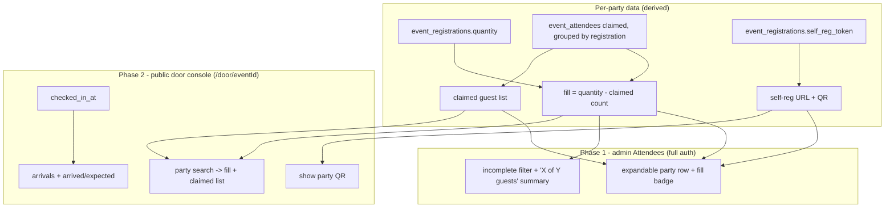

# feat: Event Check-in & Self-Registration Management

## Summary

Give organizers a per-party view of guest self-registration and equip event-day door staff. Phase 1 adds expandable party rows, fill status, an incomplete-party filter, and a roster-wide "X of Y guests registered" summary to the admin Attendees list. Phase 2 adds a public, per-event door console (reached at `/door/<eventId>`, no login) — search a party, see its fill and claimed list, show its self-reg QR, watch arrivals. Neither phase needs a migration or new auth.

---

## Problem Frame

M2 gave each paid party a self-registration link and the door is a strict gate, but nothing shows whether a party has filled its slots before the event, and nothing equips the volunteers who run the desk on the day. A lead may buy six tickets and never forward the link; today that party is one roster row with no "5 of 6 unregistered" signal. At the door, a guest who never self-registered just hits "see the welcome desk" with no next step — the volunteer can't look up the guest's party, confirm they're missing, and get them registered on the spot. The capability exists (the self-reg link); it isn't surfaced where the organizer (pre-event) or the volunteer (at the door) can act. See origin: `docs/brainstorms/2026-06-04-event-checkin-self-reg-management-requirements.md`.

---

## Requirements

**Pre-event self-registration management (admin)**

- R1. A lead row in the admin Attendees list expands to show that party's claimed guests (name, contact, waiver status, arrived status) and the party's self-reg link + QR (origin R1).
- R2. Each party shows fill status — claimed of purchased, e.g. 3 / 6 — derived as ticket quantity minus claimed-attendee count (origin R2).
- R3. The roster view can filter to parties with unfilled slots and shows a roster-wide "X of Y guests registered" summary, where Y is total tickets (origin R3).
- R4. The party's self-reg link is copyable and its QR viewable from the expanded view; the QR encodes the existing per-registration self-reg URL (origin R4).

**Door console access**

- R5. Each event's door console is reachable at a public per-event link keyed on the event id (`/door/<eventId>`), with no login, and opens only the scoped console — no other admin surface and no other event (origin R5, simplified — see KTD1).
- R6. The organizer can view and copy the door-console link from the Check-in tab to hand to door staff (origin R6, simplified — no regenerate, since the link is the public event id).

**Door console & workflow**

- R7. The console lets staff search for a party by the lead's name or contact and see its fill status and claimed list (origin R8).
- R8. For a guest not on a party's claimed list, the console shows that party's self-reg QR for the guest to scan and self-register on their own phone (origin R9).
- R9. The console shows live arrivals and the arrived-against-expected count, where expected is total tickets (origin R10).
- R10. The console performs no roster writes — no adding attendees, no marking check-ins, no editing; the only guest-facing action is showing the self-reg QR (origin R11).

---

## Key Technical Decisions

- KTD1. **The door console is a public per-event link keyed on the event id (`/door/<eventId>`), not a secret token.** Chosen for simplicity over a separate revocable token (this **revises origin KD1**, which proposed a secret link). Consequence, accepted by the product owner: anyone holding the public event URL can open the console and view that event's roster (names + contacts). Benefit: no migration, no token column, no generate/regenerate UI. There is no login in either design — this is purely about what string keys the link.
- KTD2. **The console is read-only.** It surfaces data and shows QRs; the guest still self-checks-in and self-registers on the existing public kiosk (`app/(checkin)/public/events/[id]/check-in`) and self-reg page (`app/(checkin)/public/registrations/[token]`). No roster writes from the console keeps the volunteer surface tiny and preserves the strict-gate and self-signed-waiver invariants (origin KD2, R10).
- KTD3. **Fill is derived, not stored** — `event_registrations.quantity` minus the count of claimed `event_attendees` for that registration. Approach B pre-provisions no placeholder rows, so unfilled slots are a number, not rows (origin KD3).
- KTD4. **Two phases, independently shippable, both low-risk.** Phase 1 (U1–U3) is admin UI + the existing attendees query. Phase 2 (U4–U5) is a public read-only route + a link display in the Check-in tab. With the event-id link (KTD1) neither phase needs a migration or new auth, so the ordering is about reviewability, not risk isolation (origin: sequencing request).
- KTD5. **Console search is scoped to the one event from the URL; the public strict matcher is untouched.** The anonymous public door matcher (`lib/events/checkin.ts`) deliberately returns only `{ matched }` to prevent roster enumeration. The console is a deliberately fuller read surface for a single event (the organizer accepts roster visibility per KTD1); its server-side name/contact search is scoped to that event id and never touches the public matcher's code path.
- KTD6. **QR via `qrcode.react`**, reusing the pattern in `components/admin/EventCheckInPanel.tsx`. Each per-party QR encodes that registration's existing self-reg URL (`${NEXT_PUBLIC_APP_URL}/public/registrations/<self_reg_token>`); URLs are always built from `NEXT_PUBLIC_APP_URL`, never `request.url`.

---

## High-Level Technical Design

Two surfaces consume one shared per-party shape (claimed list + fill + self-reg link/QR), assembled once per registration:

The door console is a public route resolved by event id; it renders its own focused, volunteer-grade UI rather than exposing the authenticated Manage Event tabs.

---

## Implementation Units

### Phase 1 — Pre-event visibility (ships independently)

### U1. Assemble per-party data in the attendees page

- **Goal:** Compute, per registration, the claimed-guest list (non-lead claimed attendees grouped under their lead), fill status, and the self-reg token, and thread it to the roster UI.
- **Requirements:** R1, R2, R4
- **Dependencies:** none
- **Files:** `app/(admin)/admin/events/[id]/attendees/page.tsx`, `components/admin/ManageEventTabs.tsx`, `lib/events/roster-fill.ts` (new helper), `lib/events/roster-fill.test.ts` (new)
- **Approach:** The page already loads `registrations` (with `quantity`) and the flat `event_attendees` roster. Extend the registrations select to include `self_reg_token`. Build a per-registration map: claimed guests = claimed attendees with `is_lead = false` grouped by `registration_id`; fill = `quantity − claimedCount` (claimed count includes the lead). Put the fill arithmetic and grouping in a pure `lib/events/roster-fill.ts` helper so it's unit-testable and reused by the console (U4). Attach to each lead's row object: `partyGuests[]`, `claimedCount`, `quantity`, `selfRegToken`. Extend the `Attendee` interfaces in `ManageEventTabs.tsx` and `AttendeeList.tsx` accordingly. Self-reg URL is built from `NEXT_PUBLIC_APP_URL`/origin (as the existing link components do).
- **Patterns to follow:** the existing per-lead `leadNameByReg` map and the `ticketQtyByReg` / `rollupTicketItems` assembly already in `attendees/page.tsx`; `lib/events/tickets.ts` as the shape for a small pure roster helper + test.
- **Test scenarios:**
  - `roster-fill`: a party of 6 with lead + 2 claimed guests → fill `3/6`, 3 remaining, guest list length 2.
  - `roster-fill`: lead only → `1/6`, guest list empty.
  - `roster-fill`: claimed count equals quantity → 0 remaining (complete).
  - `roster-fill`: a registration-less / imported attendee (no `registration_id`) is excluded from any party grouping.
  - `Covers AE1.` Party bought 6, only lead claimed → fill renders 1 / 6.
- **Verification:** Each lead row object carries its guests, fill counts, and self-reg token; the helper's tests pass; no change to non-lead/guest rows' existing columns.

### U2. Expandable party row in AttendeeList

- **Goal:** Let a lead row expand to a drawer showing the party's claimed guests, fill badge, and the self-reg link (copy) + QR.
- **Requirements:** R1, R2, R4
- **Dependencies:** U1
- **Files:** `components/admin/AttendeeList.tsx`, `components/admin/PartyDrawer.tsx` (new, optional extraction)
- **Approach:** Make a lead row expandable (disclosure control on lead rows only). The expanded drawer lists each claimed guest (name, contact, waiver status, arrived status), shows a fill badge (e.g. "3 / 6 registered"), and renders the party's self-reg link with a Copy button plus a QR (`qrcode.react`). Reuse the QR + copy interaction from `EventCheckInPanel.tsx`. Guests in the flat table remain as-is; the drawer is an additive per-lead affordance. Keep keyboard/aria-expanded semantics on the toggle.
- **Patterns to follow:** `components/admin/EventCheckInPanel.tsx` (QR via `QRCodeCanvas`, copy-to-clipboard, marine/cream styling); existing badge styling in `AttendeeList.tsx` (Member/Waiver/Arrived pills).
- **Test scenarios:**
  - Test expectation: none — presentational; data correctness is covered by U1's helper tests. (If a `PartyDrawer` pure formatter emerges, unit-test its label output.)
- **Verification:** Expanding a lead shows its guests + fill + working Copy and a scannable QR; collapsing restores the row; non-lead rows have no toggle.

### U3. Incomplete-party filter + roster guest-registration summary

- **Goal:** Surface which parties still have empty slots and an overall registered-vs-tickets count.
- **Requirements:** R3
- **Dependencies:** U1
- **Files:** `components/admin/AttendeeList.tsx`, `components/admin/ManageEventTabs.tsx`
- **Approach:** Add a roster-wide summary line — "X of Y guests registered" where Y = total tickets (the `total` already computed in the page) and X = total claimed attendees. Add a filter control (alongside the existing Member filter) to show only parties with unfilled slots (fill < quantity). Reuse the existing `useMemo` filter pattern in `AttendeeList.tsx`.
- **Patterns to follow:** the existing search + `memberFilter` `useMemo` in `AttendeeList.tsx`; the summary line in `ManageEventTabs.tsx` ("N attendees · N arrived · N tickets").
- **Test scenarios:**
  - `Covers AE2.` Given one full party and one under-filled; filtering to incomplete lists only the under-filled lead; the summary counts all claimed guests against total tickets.
  - Filter off → all parties shown; summary unchanged.
  - Test expectation: the filter predicate and summary counts are pure functions of U1's data — cover them in the `roster-fill` helper tests; the control wiring is presentational.
- **Verification:** The summary reads correctly for a known roster; the filter narrows to incomplete parties and clears cleanly.

### Phase 2 — Public door console

### U4. Door console route + organizer link display

- **Goal:** A public, event-id-keyed, volunteer-grade console to find a party, see its fill + claimed list, and show its self-reg QR — plus a copyable link to it in the Check-in tab.
- **Requirements:** R5, R6, R7, R8, R10
- **Dependencies:** U1 (roster-fill helper)
- **Files:** `app/(checkin)/door/[id]/page.tsx` (new, server), `components/door/DoorConsole.tsx` (new, client), `app/api/public/door/[id]/search/route.ts` (new) + test, `lib/events/door-access.ts` (new: published-event resolution), `components/admin/EventCheckInPanel.tsx` (show + copy the `/door/<id>` link)
- **Approach:** New route under the focused `(checkin)` group (no site chrome). The page resolves the event by id and requires `is_published` (unknown/unpublished → a neutral "not available" card); a server helper `resolveDoorEvent(id)` is the single resolution point, reused by the search route. The console shows a party search (lead name/contact); results render each party's fill ("3/6"), claimed guest list (name + contact + waiver/arrived), and a "Show QR" action rendering that party's self-reg QR for an unregistered guest to scan. Search is server-side, scoped to the resolved event, via `POST /api/public/door/[id]/search` (event re-resolved server-side every call — never trust the path alone for scoping). No write actions anywhere (R10). Large touch targets / minimal surface for volunteers (R7), reusing the door-kiosk visual language. In the Check-in tab, add a read-only display of the `/door/<eventId>` link with a Copy button so the organizer can share it (no generate/regenerate — the link is the stable public event id).
- **Patterns to follow:** `app/(checkin)/public/registrations/[token]/page.tsx` (focused server page + neutral invalid state); the redesigned kiosk UI in `components/public/EventCheckInForm.tsx` (large targets, marine/cream); `lib/events/roster-fill.ts` from U1 for fill/grouping; `qrcode.react` + the link/copy UI in `components/admin/EventCheckInPanel.tsx`.
- **Test scenarios:**
  - `Covers R5.` Search route with an unknown event id, or an unpublished event, → 404/neutral, returns no roster data.
  - `Covers R7.` Search by lead name returns that party with correct fill and claimed list; search by a guest's contact resolves to the right party.
  - `Covers R8.` A party with unfilled slots exposes its self-reg URL/QR payload; a guest absent from the claimed list is visibly missing.
  - `Covers R10.` The search route and console expose no write/mutation endpoint (read-only surface).
  - Event A's id never returns event B's parties (scoping).
- **Verification:** Opening `/door/<eventId>` shows the console; searching finds parties with accurate fill + claimed lists and a scannable per-party QR; an unknown/unpublished id shows the neutral card; the Check-in tab shows a copyable door link; no write path exists.

### U5. Arrivals in the door console

- **Goal:** Show live arrivals and the arrived-vs-expected count in the console.
- **Requirements:** R9
- **Dependencies:** U4
- **Files:** `components/door/DoorConsole.tsx`, `app/(checkin)/door/[id]/page.tsx`
- **Approach:** Reuse the arrivals shape from `EventCheckInPanel.tsx`: arrived = claimed attendees with `checked_in_at`, expected = total tickets (already the corrected denominator), plus a recent-arrivals list. Soft auto-refresh while the console is open (the panel's existing `router.refresh` interval pattern). Read-only.
- **Patterns to follow:** `components/admin/EventCheckInPanel.tsx` (arrived/expected stat, progress, recent-arrivals feed, 20s soft refresh).
- **Test scenarios:**
  - Test expectation: none beyond U4 — arrivals derive from the same event-scoped fetch and reuse the established tickets-denominator logic. Add a small assertion if a pure "arrived / expected" formatter is extracted.
- **Verification:** The console shows arrived/expected against total tickets and a recent-arrivals list that updates without a manual reload.

---

## Scope Boundaries

### Deferred to Follow-Up Work

- Resending/nudging the self-reg link from the party view — use the Messaging tab (origin: deferred).
- Staff manually adding a guest to a party, or marking arrivals, from the door console (origin: deferred).
- Lead-facing slot management beyond the link itself (deferred in the roster plan).

### Outside this scope

- Over-capacity walk-ups (a party's slots are full but an extra person arrives) — welcome-desk judgment, not in-app (origin: confirmed out).
- A secret or revocable door link, and restricted volunteer admin accounts — the public event-id link was chosen instead (KTD1).

---

## System-Wide Impact

- **New public read surface:** the door console exposes one event's roster (names, contacts) and per-party self-reg QRs to anyone holding the public event link. This is an accepted product decision (KTD1) — the club's event rosters are treated as low-sensitivity. No login, no migration, no new column.
- **Strict-matcher invariant preserved:** the anonymous public door matcher remains enumeration-proof; the console is a separate, event-scoped read surface and does not touch `lib/events/checkin.ts`.
- **No schema change, no data backfill.**

---

## Risks & Dependencies

- R-risk1. **Roster visibility via the public event link** is intentional (KTD1). If the club later wants it private, the fallback is the secret-token variant (the deferred "secret or revocable door link") — a contained, additive change (a column + a validator + swapping the route key), not a rework of the console.
- R-risk2. **Console search must stay event-scoped.** A scoping bug would leak another event's roster. Covered by an explicit cross-event scoping test in U4.
- Dependency: builds on shipped M2 (`self_reg_token`, the self-reg page); the door QR points at that existing self-reg URL.

---

## Sources & Research

- Roster + fill data: `app/(admin)/admin/events/[id]/attendees/page.tsx`, `components/admin/AttendeeList.tsx`, `lib/events/tickets.ts`.
- QR + arrivals + link/copy UI: `components/admin/EventCheckInPanel.tsx`.
- Focused token-resolved public page (neutral invalid state) to mirror for the console: `app/(checkin)/public/registrations/[token]/page.tsx`.
- Public strict matcher to leave untouched: `lib/events/checkin.ts`.
- Secret-link pattern (the deferred private-link fallback, if ever needed): `supabase/migrations/20260526120000_events_invite_link.sql`, `components/admin/EventInviteLink.tsx`.
</content>
