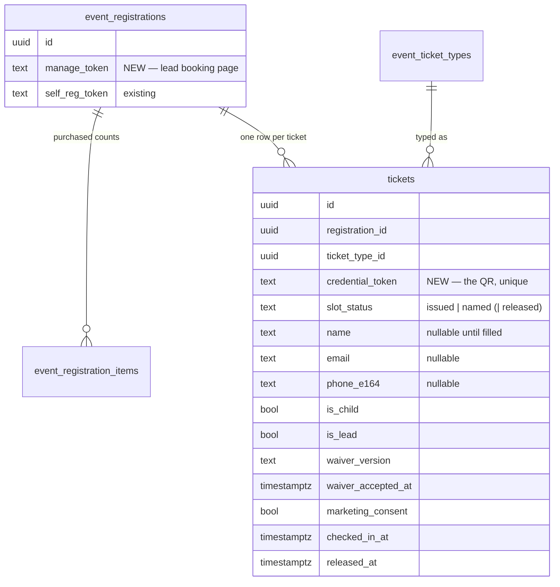
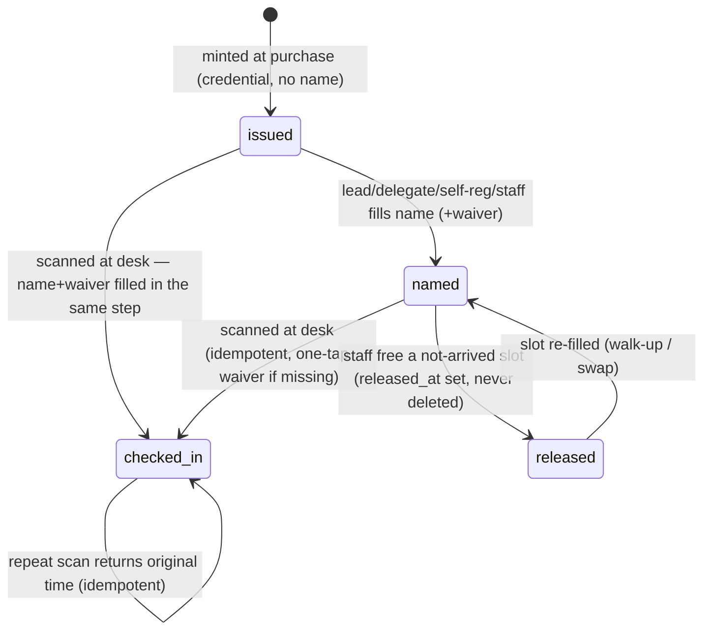
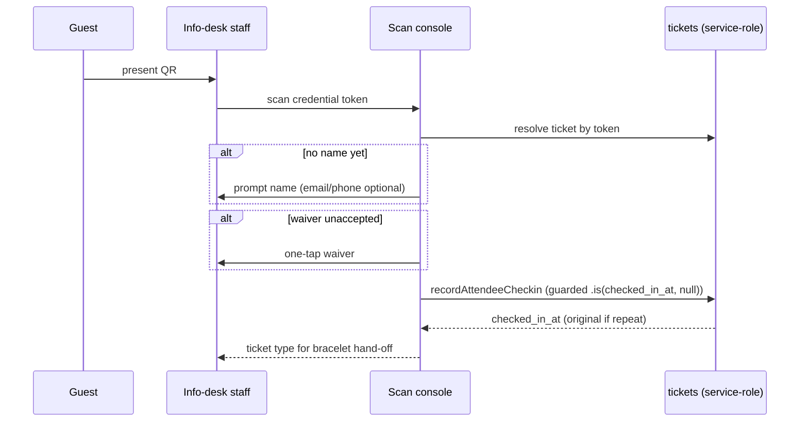

# feat: Event ticket QR credentials, distribution & info-desk scan check-in

## Summary

Make each purchased event ticket a first-class row carrying its own bearer QR credential, created at purchase and valid before a name is attached. Collapse the per-person roster (`event_attendees`) into this single `tickets` table — one row per ticket holds the credential, the (nullable) name/contact/waiver/marketing-consent, and check-in state. The lead distributes tickets from a booking page by naming them and/or forwarding batches by email, and can buy more tickets there. On the day, staff scan each ticket's QR at a staffed info desk to fill any missing name/waiver and check the guest in, replacing the public self-service poster check-in. NFC is designed-for (the credential is the future pairing key) but not built.

---

## Problem Frame

Today there is no per-ticket entity. `event_registrations` is the order, `event_registration_items` holds per-type *counts*, and `event_attendees` holds one row **per named person** — created only when someone claims a slot, with open slots computed in memory (`purchased − claimed`) and a hard DB requirement that a row has a name and contact. Nothing represents "ticket #3 of 10" as a thing that exists before a name, so there is no token a guest can hold, codes can't be single-use, and a buyer of many tickets has no clean way to hand a subset to someone who'll manage their own sub-group.

The origin brainstorm (see origin: `docs/brainstorms/2026-06-22-event-qr-access-flow-requirements.md`) resolves this by making the ticket itself the credential: a QR per ticket, mintable at purchase, fillable online or at the desk, distributable by forwarding. This plan implements that, reusing the shipped race-safe claim RPC, `recordAttendeeCheckin` idempotency, the metadata-routed Stripe webhook, and `qrcode.react` (already a dependency).

---

## Requirements

Carried from origin; grouped by concern. R-IDs align with the origin doc.

### Credential & data model
- R1. Each purchased ticket gets a unique, unguessable bearer credential rendered as a QR, minted at purchase.
- R2. A ticket's QR is a valid entry token even with no name and no waiver attached; identity and waiver are not prerequisites for the QR to exist or work.

### Distribution & booking page
- R3. The lead can forward a selected batch of their tickets to another person by email; that person receives an email containing only those tickets and their QRs.
- R4. The lead can fill in names/contact for their tickets before forwarding; a recipient of a forwarded batch can also fill in (or leave blank and hand on) the tickets in their batch.
- R9. The booking page leads with the distribution call to action and states clearly that every attendee needs their own QR to enter; each ticket's QR is visible/shareable from this page.
- R16. From the booking page the lead can purchase additional tickets and then distribute them the same way as their original tickets.
- R17. Marketing consent is captured per ticket when a name is filled, carried forward from the prior roster model.

### Info-desk check-in
- R5. Info-desk staff can scan a ticket QR and have the matching ticket resolved and displayed (ticket type, name if present) for the bracelet hand-off.
- R6. Scanning marks the ticket checked in; a repeat scan is idempotent — shows the original check-in time, no second bracelet.
- R7. If the scanned ticket has no name, staff fill it on the spot; email/phone encouraged but not mandatory; a name alone completes check-in.
- R8. If the scanned ticket's waiver is unaccepted, staff capture it in one tap before completing check-in; if already accepted, check-in is a pure scan.
- R10. Staff can find a ticket by name or contact lookup for guests without a usable QR (works only for tickets that already carry a name/contact).

### Walk-ups & quantity
- R11. Staff accommodate a walk-up only by redeeming an unredeemed ticket in the inviter's party — filling it with the walk-up's name + optional contact and checking them in.
- R12. Purchased quantity is the hard limit per party; if the inviter's party has no unredeemed ticket, the walk-up cannot be admitted on those tickets. The race-safe per-type cap enforces this — no override past purchased quantity.

### Kids
- R13. Children are ordinary tickets (a child ticket type exists for pricing); a kid's QR is held and presented like any other ticket, name and waiver filled by the accompanying adult online or at the desk. No guardian-link or special routing.

### Retiring self-service
- R14. The public self-service door check-in (scan poster → type email → green confirmation) is removed; all check-in flows through the staffed info-desk console.

### NFC readiness (design-for, not build)
- R15. The credential and the info-desk step are designed so a future NFC bracelet can be paired at the desk against the same credential and checkpoints validate by tap, without reworking issuance or check-in. No NFC behaviour is implemented.

---

## Key Technical Decisions

- KTD1. **One `tickets` table, evolved and renamed from `event_attendees`.** A ticket, an attendee, and a credential are one real-world thing; splitting them across tables is redundant. Rename `event_attendees` → `tickets`, add the credential column, make `name`/contact nullable, and create one row per purchased ticket at purchase. This replaces the in-memory open-slot synthesis in `buildDoorRoster` with stored rows, and revives the row-per-slot shape the codebase previously shelved — the credential is the reason that shape now earns its place (see origin Key Decisions; `docs/solutions/design-patterns/race-safe-claim-rpc-capacity-cap.md` notes the prior `unclaimed` value was vestigial).
  - **`slot_status` values: keep `claimed` (a filled/named ticket) unchanged, add `issued` (minted, credential, no name yet).** Do NOT rename the `claimed` literal — every existing `.eq('slot_status','claimed')` read (door roster, matcher, check-in, children, import) must keep working untouched. `issued` is the only new value; filled rows stay `claimed`.
  - **Migration safety on the shared dev/prod DB is committed, not optional.** The rename migration must, in one transaction: rename the table, `CREATE OR REPLACE` every dependent `SECURITY DEFINER` RPC that references `public.event_attendees` (claim, seed-lead, import, children, release-slot, etc.), create a transitional `event_attendees` view aliasing `tickets` so prod code surviving the apply→redeploy gap still resolves, and **backfill** one `issued` row per `purchased − claimed` slot for every existing paid/free registration so in-flight events keep working. Drop the view in a follow-up migration after the code repoint is live.
- KTD2. **Bearer credential token per ticket.** CSPRNG base64url, mirroring `generateSelfRegToken()` (`lib/events/registration.ts:52-61`), stored under a partial unique index on non-null tokens. **In-app** (booking page, console) the QR is a `qrcode.react` client component encoding `${NEXT_PUBLIC_APP_URL}/<scan-path>/<token>` (existing pattern, `components/door/DoorConsole.tsx:224`). **In email**, `qrcode.react` cannot run — emails need a server-side QR image: render each credential to a PNG with the `qrcode` npm package (new dependency) and embed it (hosted image URL or inline data URI). Do not attempt to use `qrcode.react` in the email path.
- KTD3. **Fill/claim becomes update-the-issued-row under a registration lock.** A `SECURITY DEFINER` RPC `SELECT ... FOR UPDATE`s the registration row, computes `purchased` from `event_registration_items`, counts `filled` as `tickets WHERE slot_status='claimed' AND released_at IS NULL`, enforces the per-type cap on `filled < purchased`, then **flips an `issued` row to `claimed`** (filled) rather than inserting. Critically, the cap denominator is the count of *filled* rows, not all rows — `issued` rows ARE the purchased capacity, so counting them as redeemed would make every party read as full the instant tickets are minted. Idempotent on contact match; release-not-delete preserves audit. Mirrors `claim_self_registration` (`supabase/migrations/20260604170000_claim_per_type_cap.sql`).
- KTD4. **Buy-more is a top-up under the existing registration.** The one-registration-per-email partial unique index blocks a second paid registration for the same email/event, so additional tickets are added as new `event_registration_items` under the existing registration via a new RPC, paid through the existing metadata-routed Stripe checkout. **The top-up checkout session must carry a distinct metadata discriminator (e.g. `topup: true` + a top-up id), because the existing webhook short-circuits on `existing.status === 'paid'` — a top-up against an already-paid registration would otherwise be acknowledged and mint nothing, charging the customer for tickets that never appear.** The webhook branches on the discriminator *before* the paid-short-circuit, mints the new tickets idempotently keyed on the top-up id, and the top-up RPC increments `event_registrations.quantity` by the added units so the per-party cap and door roster reflect the new total.
- KTD5. **Scan check-in: fill-then-check-in; self-service is retired.** The console resolves a scanned credential to its ticket row, **scoped to the active event** (event id comes from the console session, not the QR payload — reject a token belonging to another event). If the ticket is still `issued`, the scan-fill path calls the claim RPC first (flip `issued → claimed` with the typed name) and only then calls `recordAttendeeCheckin` (`lib/events/checkin.ts:152-215`) for the idempotent flip and one-tap waiver — `recordAttendeeCheckin` is not reused unchanged, because it never writes a name or transitions slot_status. The console lives in `app/(checkin)` (event-id gated, `referrer: no-referrer`); the public self-service poster route and components are removed.
- KTD6. **Three path-secret distribution tokens.** `manage_token` (lead booking page, new column on `event_registrations`), a per-batch forward token, and the per-ticket credential token. All are URL-path secrets on open routes (like `/public/registrations/[token]`), validated server-side through the service-role admin client — event tables are RLS-enabled with no anon/authenticated policies.
- KTD7. **Single writer per ticket-state field.** The credential token, `checked_in_at`, and `released_at` each have exactly one owning endpoint. The bulk event-update and ticket-type routes must not touch them (`docs/solutions/architecture-patterns/single-writer-field-ownership-across-routes.md`).
- KTD8. **NFC is design-only.** The credential is the stable per-ticket pairing key; the desk scan step is shaped so a future NFC pairing/coding action slots in without changing issuance or check-in. No NFC code, tables, or hardware integration in this plan.

---

## High-Level Technical Design

### Data model (after KTD1)

### Ticket lifecycle

### Scan check-in (R5–R8)

---

## Implementation Units

### U1. Rename `event_attendees` → `tickets`; add credential + issued state

- Goal: Establish the single tickets table: rename the shipped table, add `credential_token` (with partial unique index on non-null), add an `issued` `slot_status`, make `name`/`email`/`phone_e164` nullable for `issued` rows, keep `is_child`/`is_lead`/waiver fields/`marketing_consent`/`checked_in_at`/`released_at`. Repoint all code references.
- Requirements: R1, R2, R17 (foundation).
- Dependencies: none (lands first, alone).
- Files:
  - `supabase/migrations/2026MMDDHHMMSS_rename_attendees_to_tickets.sql` (new)
  - `types/database.ts` (regen + **re-append `MemberStatus`/`PaymentCaptureStatus` aliases**)
  - `lib/events/door-access.ts`, `lib/events/checkin.ts`, `lib/events/roster.ts`, `lib/events/registration.ts` (table/identifier references)
  - `components/door/DoorConsole.tsx`, `components/admin/AttendeeList.tsx`, `components/admin/EventCheckInPanel.tsx` (references)
  - All `app/api/**` routes referencing the old table
- Approach: Single-transaction migration that: (1) renames `event_attendees` → `tickets`; (2) adds `credential_token` with a partial unique index on non-null; (3) adds `issued` to the `slot_status` CHECK while keeping `claimed` as the filled/named value (do not rename the literal — existing `.eq('slot_status','claimed')` reads must keep working); (4) relaxes `claimed_named` / `contact_present` so an `issued` row may carry a credential with no name/contact, keeping the invariants for `claimed`; (5) `CREATE OR REPLACE`s every `SECURITY DEFINER` RPC that references `public.event_attendees` (claim, seed-lead, import, children, release-slot, lead-ticket-type, kids) with the new table name; (6) creates a transitional `event_attendees` view aliasing `tickets` to survive the apply→redeploy gap on the shared DB; (7) **backfills** one `issued` row per `purchased − claimed` slot for every existing paid/free registration. A follow-up migration drops the view after the code repoint deploys. Document deploy ordering in the header.
- Note: the in-memory open-slot synthesis is removed in U3, which depends on this backfill existing.
- Patterns to follow: migration header conventions (purpose, ADDITIVE vs irreversible, shared-prod-DB warning, deploy order, TYPES note) and partial-unique-index shape from `supabase/migrations/20260604120000_self_registration_token_and_claim.sql:38-40`.
- Test scenarios:
  - Migration applies cleanly and existing `claimed` rows satisfy their invariants unchanged.
  - An `issued` row with a credential and null name/contact is accepted; a `claimed` row with null name is rejected.
  - `credential_token` uniqueness: two non-null equal tokens rejected; multiple null tokens allowed.
  - Backfill: a pre-existing registration that bought 6 and had 2 claimed ends with 4 `issued` rows + 2 `claimed`; the door console shows 4 open slots.
  - Every dependent RPC resolves post-rename (call claim, seed-lead, children against `tickets`).
  - Transitional view: a read of `event_attendees` returns `tickets` rows (proves prod code survives the gap).
- Verification: type-check passes with aliases re-appended; existing event flows (registration confirm, door console load, check-in) work against the renamed table and the backfilled rows.

### U2. Mint tickets at purchase

- Goal: Create one `issued` ticket row per purchased ticket, with a credential, on both the free and paid purchase paths; seed the lead's own ticket as `named`.
- Requirements: R1, R2.
- Dependencies: U1.
- Files:
  - `lib/events/registration.ts` (`generateCredentialToken`, mint helper)
  - `app/api/events/[id]/register/route.ts` (free path mint)
  - `app/api/webhooks/stripe/route.ts` (paid path mint)
  - `lib/events/checkin.ts` or roster helper (adapt `seedLeadAttendee`)
- Approach: On registration create, mint one `issued` row per unit across `event_registration_items`; the lead's first ticket becomes `named` (existing `seedLeadAttendee` behaviour). Webhook mint is **idempotent** — keyed on the presence of `event_registration_id` in metadata, never a boolean flag, and a replay must not mint duplicate tickets (`docs/solutions/logic-errors/stripe-webhook-metadata-missing-skips-cleanup.md`).
- Patterns to follow: `register/route.ts:247-306`, `stripe/route.ts:177-281`; CSPRNG token from `registration.ts:52-61`.
- Test scenarios:
  - Covers AE1. Free basket of 10 → 10 issued ticket rows, 10 distinct credentials, none named except the lead.
  - Paid basket → tickets minted only after `checkout.session.completed`; counts match purchased quantity per type.
  - Webhook replay (same event id twice) → no duplicate tickets minted.
  - Lead ticket is `named` and carries the lead's contact; remaining tickets are `issued`.
- Verification: after a paid purchase, ticket count equals basket quantity and each has a unique credential.

### U3. Race-safe fill/claim RPC + repoint existing fill surfaces

- Goal: Replace insert-on-claim with update-the-issued-row under the registration lock; route self-registration and the door console fill through it.
- Requirements: R4, R11, R12, R13.
- Dependencies: U1, U2.
- Files:
  - `supabase/migrations/2026MMDDHHMMSS_claim_ticket_update.sql` (new RPC)
  - `lib/events/roster.ts`, `lib/events/door-access.ts` (`buildDoorRoster` reads stored issued rows instead of synthesizing open slots)
  - `app/api/public/door/[id]/save-attendee/route.ts`, `app/api/public/registrations/[token]/route.ts` (call the RPC)
- Approach: `SECURITY DEFINER` RPC, `SELECT ... FOR UPDATE` on the registration; `purchased` from items, `filled` = count of `slot_status='claimed' AND released_at IS NULL` (NOT all non-released — `issued` rows are capacity, not redemptions); per-type cap on `filled < purchased`; flip the chosen `issued` row to `claimed`; idempotent on contact match; release-not-delete. **Lock down grants**: `REVOKE ALL ... FROM PUBLIC, anon, authenticated; GRANT EXECUTE ... TO service_role` (`docs/solutions/security/supabase-securitydefiner-anon-execute-grant-2026-06-04.md`). **Rewrite `buildDoorRoster` (`door-access.ts:80-221`), not repoint**: delete the `purchased − claimed` synthesis loop (`:164-192`), widen the attendee query to fetch both `issued` and `claimed` rows, and map `issued` rows directly to open slots. Lost-QR/name lookup (U7) filters `slot_status='claimed' AND name IS NOT NULL` so an unfilled `issued` row is never returned by a name search.
- Patterns to follow: `claim_self_registration` lock+cap (`20260604170000_claim_per_type_cap.sql:49-143`); children RPC (`lib/events/roster.ts:122-136`).
- Test scenarios:
  - Covers AE6. Party of 4 with 1 issued ticket left → fill succeeds; all 4 redeemed → fill returns `full`/`type_full`, no new row.
  - Concurrent double-fill of the last issued slot → exactly one succeeds (race-safe under lock).
  - Idempotent: same contact filling twice → returns the existing ticket, no duplicate.
  - Child fill: name-only, contactless accepted; counts against the child type allotment.
  - Released slot is re-fillable; released row is never deleted (audit retained).
  - Cap denominator: a freshly-minted party (all `issued`, zero `claimed`) accepts the first fill — the cap does not read the party as full at mint time.
  - Anon lockdown: calling the RPC via PostgREST `/rest/v1/rpc` with only the anon key returns 403 (`has_function_privilege('anon', fn, 'EXECUTE') = false`).
- Verification: cap holds under concurrency; door console shows issued slots as fillable and rejects over-cap fills.

### U4. Lead "My Booking" page (manage_token): view, name, QRs

- Goal: A lead-authed page showing the booking summary, every ticket with its QR, per-ticket name editing, and the share/QR affordances.
- Requirements: R4, R9, R17.
- Dependencies: U1, U2, U3.
- Files:
  - `supabase/migrations/2026MMDDHHMMSS_registration_manage_token.sql` (`manage_token` column + partial unique index)
  - `app/(checkin)/public/bookings/[token]/page.tsx` (or sibling token-route group), plus its API route
  - `components/events/*` (booking summary + per-ticket slot UI reusing the door slot model)
  - `lib/format.ts` usage for dates/currency
- Approach: New `manage_token` (CSPRNG, mirrors `self_reg_token`), path-secret route validated server-side. The page exposes the whole party's contacts + payment status, so treat the token as a secret: set `referrer: no-referrer` on the page (mirror the self-reg page) and never log the token value in server-action error context. Reuse the door slot model scoped to one registration. Render dates/prices via `lib/format.ts` to avoid Safari SSR hydration mismatch (`docs/solutions/runtime-errors/safari-hydration-mismatch-tolocale-formattoparts-2026-05-18.md`). Marketing-consent capture per ticket. Page-state and IA decisions (pending-payment, QR density, share mechanic) per Open Questions.
- Patterns to follow: token-route shape `/public/registrations/[token]`; `manage_token` design in `docs/brainstorms/2026-06-05-my-booking-page-requirements.md`; QR via `qrcode.react`.
- Test scenarios:
  - Lead opens valid `manage_token` → sees all tickets + QRs + summary; invalid/unknown token → neutral not-available.
  - Lead names a ticket → row transitions `issued → named`, QR unchanged.
  - Marketing consent toggles persist per ticket.
  - Dates/prices render identically on server and client (no hydration warning).
- Verification: lead can view and name their whole party from the page; QRs resolve to the right tickets.

### U5. Forwarding a batch (per-ticket QRs, one level)

- Goal: Lead selects N tickets + a recipient email; recipient gets a batch email with those N per-ticket QRs and a link to fill names for the batch.
- Requirements: R3, R4.
- Dependencies: U4.
- Files:
  - `supabase/migrations/2026MMDDHHMMSS_ticket_batch_token.sql` (per-batch token)
  - `app/(checkin)/public/bookings/[token]/forward/route.ts` (create batch + send)
  - delegate batch page + API route
  - `lib/email/*` (forwarding template)
- Approach: A forward creates a batch token scoping the selected tickets, sends a Postmark email to the delegate with per-ticket QRs (each its own code, so guests arrive separately). The delegate page fills names via the U3 RPC; **the fill endpoint resolves the batch token first and rejects any ticket id not in that batch's scoped set** — a delegate cannot fill tickets still held by the lead or another delegate. **One level** — the delegate page exposes name-fill and QR display only, with no forward/share action (re-forwarding deferred; its absence is intentional, not an oversight). Lead may name tickets before forwarding (R4).
- Patterns to follow: `sendEmail` + Mustachio sections; URLs from `NEXT_PUBLIC_APP_URL`; `null` not `""`.
- Test scenarios:
  - Lead forwards 4 of 10 → delegate email contains exactly those 4 tickets and 4 distinct QRs.
  - Delegate fills a name on a batch ticket → transitions to `named`; lead's remaining 6 unaffected.
  - Batch token resolves only the forwarded tickets, not the whole order.
  - Lead names tickets before forwarding → delegate receives them pre-named.
- Verification: a forwarded batch is fillable by the delegate and the 4 QRs check in independently.

### U6. Buy-more top-up from the booking page

- Goal: Let the lead purchase additional tickets under the existing registration and distribute them like the rest.
- Requirements: R16.
- Dependencies: U2, U4.
- Files:
  - `supabase/migrations/2026MMDDHHMMSS_topup_registration_items.sql` (top-up RPC adding items under existing reg)
  - `app/api/events/[id]/register/route.ts` or a new top-up route; `app/api/webhooks/stripe/route.ts` (mint top-up tickets)
  - booking page buy-more UI
- Approach: Add new `event_registration_items` under the **existing** registration rather than creating a second registration (the one-reg-per-email index blocks that), and **increment `event_registrations.quantity` by the added units in the same transaction** — the per-party cap (`claim` RPC) and `buildDoorRoster` both derive remaining capacity from `quantity`, so without the bump the bought tickets are unfillable. The top-up checkout session carries a **distinct metadata discriminator** (e.g. `topup: 'true'` + a top-up id); the webhook branches on it **before** the `existing.status === 'paid'` short-circuit (`stripe/route.ts:206-211`) — otherwise an already-paid registration's top-up is acknowledged and mints nothing — and mints the new `issued` tickets idempotently keyed on the top-up id. Handle `23505` on any new unique index with a 200 + durable side-record, never a 500 retry loop (`docs/solutions/database-issues/partial-unique-index-stripe-webhook-23505-deadlock-2026-05-21.md`).
- Patterns to follow: `register/route.ts:247-340`, `stripe/route.ts:206-281` (idempotency + `23505` reconciliation branch).
- Test scenarios:
  - Lead buys 3 more on an existing (already-paid) booking → after payment, 3 new issued tickets under the same registration, and `event_registrations.quantity` rose by 3.
  - Cap reflects the bump: after the top-up, the party accepts 3 more fills past the original quantity; the door console shows 3 more open slots.
  - Webhook branches on the top-up discriminator before the paid short-circuit (a top-up on a paid registration is NOT swallowed as `already_processed`).
  - Webhook replay of the top-up → no duplicate tickets.
  - Top-up checkout abandoned (no payment) → no tickets minted, no quantity change, original booking intact.
  - A `23505` collision on a new unique index → acknowledged (200), PaymentIntent tagged, no retry storm.
- Verification: top-up tickets appear on the booking page with QRs and are forwardable/fillable.

### U7. Info-desk scan console + walk-up + lost-QR lookup

- Goal: Staffed console that scans a ticket QR, fills missing name/waiver, checks the guest in, hands off the bracelet; supports name/contact lookup and walk-up fill of an unredeemed ticket.
- Requirements: R5, R6, R7, R8, R10, R11, R12.
- Dependencies: U1, U2, U3.
- Files:
  - `app/(checkin)/door/[id]/*` (extend door console with scan + check-in), or a new scan route in the same group
  - `app/api/public/door/[id]/check-in/route.ts` (resolve credential → `recordAttendeeCheckin`)
  - `components/door/DoorConsole.tsx` (scan affordance, fill prompt, waiver tap)
  - `lib/events/checkin.ts` (credential resolution)
- Approach: A scan (input method per Open Question Q-S) resolves the credential to its ticket, **scoped to the active event** — the event id comes from the console session, not the QR payload; a token for another event yields a distinct "not for this event" state, and an unresolvable token yields a distinct "ticket not recognised" state (not a generic toast) with a one-tap pivot to name lookup. If the ticket is `issued`/unnamed, prompt a name (email/phone optional, contactless arrival allowed per the existing widened constraint) and **flip `issued → claimed` via the U3 claim RPC first**, then call `recordAttendeeCheckin` (idempotent, guarded `.is("checked_in_at", null)`) — `recordAttendeeCheckin` does not write a name or transition slot_status, so it cannot be the sole writer for an unnamed scan. If waiver unaccepted, one-tap capture before completion. Walk-up: staff search the **inviter** (by their named ticket or reference), the console surfaces that party's `issued` rows, and staff fill one via the U3 RPC (cap enforced). Lost-QR: name/contact lookup over `claimed` (named) tickets only. **If multiple scanners operate concurrently, route the check-in flip through the locked path.**
- Patterns to follow: `recordAttendeeCheckin` (`checkin.ts:152-215`); door console (`door/[id]/page.tsx`, `referrer: no-referrer`); `lib/format.ts` for any rendered date/time.
- Test scenarios:
  - Covers AE3. Scan an unnamed ticket → name prompt (contact optional) → check-in completes with a name alone.
  - Covers AE4. Repeat scan of a checked-in ticket → original time shown, no second bracelet.
  - Covers AE5. Scan a ticket with no waiver → one-tap waiver required before completion; pre-signed waiver → pure scan.
  - Covers AE6. Walk-up filled against an unredeemed ticket in the inviter's party; party full → rejected.
  - Lost-QR: lookup by phone finds the named ticket and checks it in; an unfilled `issued` row is never returned by name lookup.
  - Unresolvable token → distinct "not recognised" state with name-lookup pivot; token from another event → distinct "not for this event" state.
  - Walk-up: searching the inviter surfaces their `issued` rows; filling one checks the walk-up in; inviter party full → no `issued` rows to fill.
  - Concurrent double-scan of one ticket → single check-in stamp.
- Verification: a full arrival (scan → fill → waiver → bracelet) works; walk-up and lost-QR paths work; double-scan is safe.

### U8. Retire the public self-service poster check-in

- Goal: Remove the self-service check-in surface now superseded by staff scan.
- Requirements: R14.
- Dependencies: U7.
- Files:
  - `app/(checkin)/public/events/[id]/check-in/*` (remove)
  - `components/admin/EventCheckInPanel.tsx` (remove/repoint the poster QR)
  - any links to the self-service URL
- Approach: Delete the public self-service route and its poster QR; ensure admin surfaces point to the staffed console instead. Confirm no remaining inbound links.
- Patterns to follow: existing route-group removal; keep the door/admin arrivals views intact.
- Test scenarios:
  - Navigating the old self-service URL returns not-found / neutral, not a check-in form.
  - Admin event page no longer offers the self-service poster; arrivals feed still works.
  - Test expectation: mostly removal — assert the route is gone and no admin link references it.
- Verification: no self-service check-in path remains; staffed console is the only check-in entry.

### U9. Postmark templates: per-ticket QR delivery, forwarding, confirmation update

- Goal: Email delivery of per-ticket QRs and the forwarding batch; confirmation email carries the booking-management link.
- Requirements: R3, R9.
- Dependencies: U2, U4, U5, U6.
- Files:
  - `lib/email/event-registration.ts` (add `manage_url`; per-ticket QR block)
  - `lib/email/*` (new forwarding template sender)
  - Postmark template aliases (new: forwarding; updated: confirmation)
- Approach: New template aliases following the `sendEmail({to, templateAlias, templateModel})` shape. Mustachio rules: sections `{{#tickets}}…{{/tickets}}`, `{{.}}` for the per-ticket value and `{{../}}` for shared event fields, no `{{#if}}`, pass `null` not `""` for absent optionals, gate on the data variable itself (boolean `false` is truthy). Forwarding email goes to the delegate address (not the buyer). **QR images are generated server-side as PNGs via the `qrcode` npm package (KTD2) — not `qrcode.react`, which is browser-only — and embedded as a hosted image URL or inline data URI.** The buy-more (U6) confirmation/receipt email also carries `manage_url` so the lead can reach the updated booking page.
- Patterns to follow: `lib/email/event-registration.ts:79-143`; `lib/postmark.ts`; Mustachio rules (`docs/solutions/integration-issues/postmark-mustachio-*.md`).
- Test scenarios:
  - Confirmation email includes `manage_url`; absent optionals render as nothing (not literal empty blocks).
  - Forwarding email lists exactly the forwarded tickets with their QRs and goes to the delegate.
  - Per-ticket section iterates correctly with `{{.}}` / `{{../}}` scoping.
  - Single-ticket booking → no spurious share block (gated on data presence).
- Verification: rendered emails show correct per-ticket QRs and links; no Mustachio scoping artifacts.

---

## Scope Boundaries

### In scope
The full origin brainstorm scope: per-ticket credentials, the booking page (name + forward + buy-more), staffed scan check-in, walk-up fill within purchased quantity, kids as ordinary tickets, retiring self-service.

### Deferred for later
- NFC bracelets, checkpoint readers, the coding device, offline allowlists — the credential is designed as the pairing key (R15) but no NFC is built.
- Bar/asado-side validation stations and Wallet passes.
- Re-forwarding a forwarded batch onward through the platform (one forward level only).

### Outside this product's identity / admin-only
- Reducing quantity, refunds, and editing already-purchased tickets remain admin-only.
- A desk purchase path for a walk-up with no available ticket (payment at the desk overlaps FEAT-34).

### Deferred to Follow-Up Work
- Anti-sharing hardening of unnamed QRs — explicitly not a concern at this stage; single-use is plain check-in idempotency, not a control being hardened.

---

## System-Wide Impact

- **Shared dev/prod database.** Every migration mutates production on apply. The U1 rename is the highest-risk change: rename + code repoint must deploy together; document deploy ordering and consider a transitional aliasing view.
- **`types/database.ts` regen.** Every schema migration requires a regen; **re-append the hand-written `MemberStatus` / `PaymentCaptureStatus` aliases** afterward (they are dropped on regen).
- **RLS posture.** Event tables are RLS-enabled with no anon/authenticated policies; all reads/writes go through the service-role admin client. Every new `SECURITY DEFINER` RPC must `REVOKE ALL ... FROM PUBLIC, anon, authenticated` and grant only `service_role`.
- **Single-writer fields.** Credential token, `checked_in_at`, `released_at` each get one owning endpoint; the bulk event-update and ticket-type routes must not write them.
- **SSR hydration.** New SSR surfaces (booking page, scan console) must render dates/prices via `lib/format.ts`, never `toLocale*` / `Intl.*.format`.

---

## Risks & Dependencies

- **Table rename on a live shared DB (U1).** Mitigate with a single atomic deploy of migration + code, a documented deploy order, and an optional transitional view; verify existing event flows post-rename.
- **Stripe unique-index collisions (U2, U6).** New unique indexes on a `pending→paid` lifecycle can deadlock the webhook; every promotion path must handle `23505` with a 200 + durable side-record.
- **Concurrency at the desk (U7).** Multiple scanners introduce concurrency the unlocked add-guest path did not assume; route check-in/fill through the locked RPC.
- **Untested defaulting branches (U3).** A compiling RPC is not a running one — exercise the cap, idempotency, and child branches explicitly (`race-safe-claim-rpc-capacity-cap.md` shipped a silently-broken default branch once).

---

## Open Questions

These are genuine decisions surfaced by review that need an answer before or during the relevant unit — they are not yet pinned.

**Resolve before implementation**
- Q-S (U7). Scan input method: a hardware keyboard-wedge scanner (focused input field, no new dependency — fits a fixed desk tablet) vs. in-browser camera scan (needs a QR-decode library + camera-permission flow). Default lean: hardware scanner. Pick before building U7 — the two are different implementations.
- Q-Auth (U7). Should the scan + fill + check-in endpoint require a per-event staff secret (PIN/session)? The door console is currently public/event-id-only; without a gate, anyone holding any forwarded QR could fill or check in another party's `issued` tickets. Decision: staff-gate the write endpoint, or accept the open posture for now.

**Resolve during implementation**
- Q-Booking (U4). Pending-payment state (registration exists, webhook not yet fired → zero tickets): show "payment processing" rather than an empty list. QR display density for 10+ tickets (collapsed thumbnails + expand/download) and the share mechanic (copy-link/download vs. native share). Booking-page IA so the forward CTA is reachable without scrolling past every ticket.
- Q-Return (U6). Buy-more checkout `success_url` = the booking page (manage_token), returning to a "new tickets processing" banner until the webhook mints.
- Q-Scanner-UI (U7). A second scanner landing on a ticket checked in between resolve and submit shows a full-screen "Already checked in at <time>" state, distinct from success.
- Q-BatchToken (U5). Keep the per-batch token only if the delegate page must be a stable, returnable URL; otherwise a signed list of per-ticket credentials in the email URL avoids the extra token/migration.
- Q-Tokens. Expiry/rotation policy for `manage_token` and the batch token (permanent vs. expire after the event date); Postmark message retention given credential URLs live in sent-email bodies.

---

## Acceptance Examples

Carried from origin; each is enforced by the cited unit's test scenarios.

- AE1. Buy 10 → 10 distinct valid QRs, none named yet. (U2)
- AE2. Forward 4 to a delegate → delegate email has exactly those 4 tickets + QRs; fillable or hand-on. (U5)
- AE3. Scan a nameless QR → name prompt (contact optional), check-in completes with a name alone. (U7)
- AE4. Repeat scan → original check-in time, no second bracelet. (U7)
- AE5. Unsigned waiver → one-tap capture before bracelet. (U7)
- AE6. Walk-up fills an unredeemed ticket in the inviter's party; full party → rejected. (U3, U7)

---

## Sources & Research

- Origin brainstorm: `docs/brainstorms/2026-06-22-event-qr-access-flow-requirements.md`.
- Grounding dossier: `/tmp/compound-engineering/ce-brainstorm/feat41/grounding.md`.
- Purchase/webhook: `app/api/events/[id]/register/route.ts:247-340`, `app/api/webhooks/stripe/route.ts:174-282`.
- Claim/cap RPC: `supabase/migrations/20260604170000_claim_per_type_cap.sql`; token gen `lib/events/registration.ts:52-61`.
- Roster/door/check-in: `lib/events/door-access.ts:80-221`, `app/api/public/door/[id]/save-attendee/route.ts`, `lib/events/checkin.ts:152-215`.
- QR rendering: `components/door/DoorConsole.tsx:224`.
- Learnings: `docs/solutions/design-patterns/race-safe-claim-rpc-capacity-cap.md`, `docs/solutions/security/supabase-securitydefiner-anon-execute-grant-2026-06-04.md`, `docs/solutions/database-issues/partial-unique-index-stripe-webhook-23505-deadlock-2026-05-21.md`, `docs/solutions/logic-errors/stripe-webhook-metadata-missing-skips-cleanup.md`, `docs/solutions/integration-issues/postmark-mustachio-*.md`, `docs/solutions/runtime-errors/safari-hydration-mismatch-tolocale-formattoparts-2026-05-18.md`, `docs/solutions/architecture-patterns/single-writer-field-ownership-across-routes.md`.
- Lead-page design: `docs/brainstorms/2026-06-05-my-booking-page-requirements.md`.
</content>
