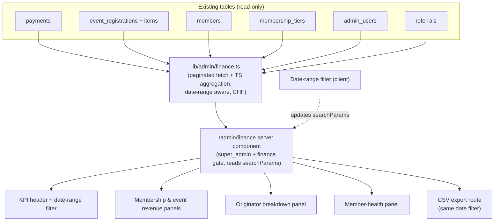

# feat: Admin finance & performance dashboard

## Overview

A read-only admin dashboard at `/admin/finance` that turns the two existing revenue streams — membership dues (`payments`) and event ticket sales (`event_registrations`) — into a single platform performance view: headline KPIs, revenue breakdowns, an originator revenue breakdown, and member-health metrics, filterable by date range and exportable to CSV.

Access is granted to **super_admin** and to a **new `finance` role**. The finance role can also reach Tiers, Events, Members, Originators, and Lounge — with the same functional access those sections already provide — mirroring how the existing `events_admin` role is scoped.

The dashboard itself is **pure aggregation over existing tables** — no writes, no Stripe calls. The only schema change in the whole plan is adding one value (`finance`) to the `admin_role` enum; there are no table or column changes. All figures are CHF.

## Problem Frame

Revenue and membership data already exist in Supabase but there is no place that totals it. The dashboard, members list, and event attendees pages each show slices; none answer "how is the club doing?" Whoever keeps the books has to pull rows by hand. This page consolidates that into one screen for the board / manager.

The `payments` table was deliberately built as the source of truth for financial records precisely so a reporting layer could sit on top of it later (see origin: `docs/plans/2026-04-09-001-feat-stripe-payment-capture-plan.md`). This is that layer — the reporting half. Commission economics are explicitly **out** of this plan.

## Requirements Trace

- R1. A page at `/admin/finance` reachable by **super_admin** and the new **`finance`** role; team_admin, events_admin, and originator cannot see or reach it.
- R13. A new `finance` admin role that can access the finance dashboard plus the Tiers, Events, Members, Originators, and Lounge sections (same functional access those sections already provide). It must not reach super_admin-only surfaces (Users, Scheduled Jobs, Email Templates, Messages) or the Applications queue.
- R2. Headline KPIs: total revenue (membership + events), total members by status, new members in period.
- R3. Membership revenue broken out as **gross / refunds / net**, and by tier and by month.
- R4. New-member vs renewal revenue split for membership dues.
- R5. Event sales revenue by event and by ticket type (gross; top-ups included).
- R6. Originator breakdown: membership revenue attributed to each originator plus their converted-referral count. Attribution only — no commission rate or payout.
- R7. Member-health metrics: active / expired / pending counts, new members over the period, a renewal-rate metric.
- R8. ARPU and tier-mix (revenue concentration by tier).
- R9. Date-range filter driving every panel; comp/free records counted in *counts* but excluded from *revenue*.
- R10. CSV export of the period's underlying financial rows.
- R11. On-page caveats: figures are **gross of Stripe fees**; **event revenue is gross of refunds**; comp/free excluded from revenue.
- R12. All monetary display is CHF; no EUR anywhere in the UI despite the legacy `amount_eur` column name.

## Scope Boundaries

**In scope**
- Read-only aggregation over `payments`, `event_registrations` (+ `event_registration_items`), `members`, `membership_tiers`, `admin_users`, `referrals`.
- One new page, one server-side data module, client display components, a date-range filter, and a CSV export route.
- A new `finance` admin role: one additive enum migration plus access-control wiring in the admin layout, sidebar, and finance route (access to Tiers/Events/Members/Originators/Lounge with existing functional access).

**Migration policy:** the dashboard is otherwise migration-free. The single exception is `ALTER TYPE admin_role ADD VALUE 'finance'` (additive, no data change). No table or column changes.

### Deferred to Follow-Up Work
- **Originator commissions** — commission rate model (per-originator / flat / per-tier), commission ledger, payout status. This plan surfaces attribution only.
- **Stripe fee / net-of-fees reconciliation** — requires Stripe balance-transaction data; dashboard shows gross.
- **Event refund tracking** — event refunds are not in the DB (only Stripe metadata). Netting them requires a real refund flow + schema and is out of scope; v1 shows event revenue gross with a caveat.
- **`amount_eur` → `amount` column rename** — cosmetic, high blast radius, already deferred by the payment-capture plan. This plan works with the existing column name.
- **Season-based grouping** — intentionally dropped; the time axis is calendar date range + month only.

### Outside this plan's identity
- No changes to how payments or event registrations are captured, no write paths, no cron, no email.
- Not a bookkeeping/ledger system or Stripe payout reconciliation tool.

## Context & Research

### Relevant code and patterns

- `app/(admin)/admin/members/page.tsx` — the canonical pattern to follow: server component fetches all rows with **1000-row paginated queries**, builds aggregation maps in TypeScript, passes them to a client component. The finance data layer mirrors this.
- `components/admin/MemberList.tsx` — client component with filters; uses `formatCurrency` and `formatMonth`.
- `app/(admin)/admin/dashboard/page.tsx` — parallel `Promise.all` stat-count pattern for KPI cards.
- `app/(admin)/admin/originators/page.tsx` + `components/admin/OriginatorList.tsx` — how originators (admin_users with `is_originator`) and their referral counts are fetched and displayed.
- `app/(admin)/layout.tsx` — admin auth + role gating (events_admin is already restricted here); finance gating slots in alongside.
- `components/admin/AdminSidebar.tsx` — role-based nav; super_admin-only links (Tiers, Users, Scheduled Jobs, Email Templates) are the pattern for the Finance link.
- `lib/format.ts` — `formatCurrency(amount)` renders `CHF {n}`; reuse everywhere.
- `types/database.ts` — source of truth for column names/types.

### Data model (verified against `types/database.ts`)

- **Membership revenue** — `payments`: `amount_eur` (holds CHF), `payment_status` (`free|pending|paid|overdue|refunded`), `paid_at`, `tier_id`, `member_id`, `season` (text, unused here). Refunds are represented as `payment_status = 'refunded'` — so membership revenue **can** be shown net.
- **Event revenue** — `event_registrations`: `total_amount_chf`, `status` (`pending|paid|free`), `paid_at`, `event_id`. Top-ups fold into the parent `total_amount_chf`, so summing the parent captures them. Per-ticket-type detail is in `event_registration_items.line_total_chf` + `title_snapshot`. Event refunds are **not** in the DB (Stripe metadata only) — hence the gross caveat.
- **Originator attribution** — `members.originator_id` → `admin_users.id`; `referrals` (`originator_id`, `member_id`, `converted_at`) auto-created on approval. Membership revenue attributes to an originator by joining a payment's member to `members.originator_id`.
- **Member health** — `members.status`, `members.created_at`, `members.start_date` / `end_date`, `tier_id`.

### Institutional learnings

- **Supabase 1000-row default limit** — any full-table aggregation must paginate (per the `members/page.tsx` paid-payments loop and the `supabase_skill`). Volume is small for a 50–500-member club, so TS-side aggregation is appropriate and avoids the migrations that a SQL view/RPC would require.
- **CHF, not EUR** — `amount_eur` is a misnomer; values are CHF and the app formats them as CHF (confirmed in the payment-capture plan). Read the column, label CHF.

## Key Technical Decisions

- **Read-only aggregation, one additive migration.** Aggregation happens in a server-side TypeScript module over existing tables (a SQL view or RPC would be a schema change; the club's data volume makes TS aggregation fine and zero-risk to write paths). The only schema change is adding `finance` to the `admin_role` enum — required to introduce the new role. (User decision.)
- **`finance` role scoped like `events_admin`.** The existing pattern gates `events_admin` to a path allowlist in `app/(admin)/layout.tsx` plus a dedicated nav branch in `AdminSidebar.tsx`. The `finance` role reuses that exact mechanism with allowlist `/admin/finance`, `/admin/tiers`, `/admin/events`, `/admin/members`, `/admin/originators`. Enforcement is server-side in the layout (authoritative); the sidebar only controls visibility.
- **Enum-add is additive and safe.** `ALTER TYPE admin_role ADD VALUE 'finance'` is non-destructive. Note the Postgres constraint that a newly added enum value cannot be *used* in the same transaction that adds it — the migration only adds the value; assigning it to a user is a separate step.
- **Server-side, searchParams-driven filtering.** The page is a server component that reads the date range from `searchParams`, runs the data layer, and renders. The filter control is a small client component that updates the URL. This keeps the row payload off the client and re-uses the aggregation on every range change — cleaner than shipping all rows for client-side filtering.
- **Membership net, events gross.** Membership revenue nets refunds (`payment_status = 'refunded'` exists); event revenue is gross with an on-page caveat (no DB refund state). Both surfaces state "gross of Stripe fees."
- **Comp/free counted, not revenued.** `payments.payment_status = 'free'` and `event_registrations.status = 'free'` contribute to counts (members, attendees) but never to revenue sums.
- **New-vs-renewal heuristic.** For each member, order their `paid` payments by `paid_at`; the earliest is a *new* membership, the rest are *renewals*. Simple, derivable from existing data, no schema. Exact tie/edge handling deferred to implementation.
- **No season axis.** Time grouping is date range + calendar month only. (User decision — dropped season logic entirely.)
- **CHF everywhere via `formatCurrency`.** No EUR strings in the UI.

## Open Questions

### Resolved during planning
- Scope? → Platform-wide performance dashboard (membership + events + originator breakdown + member health). Commissions deferred.
- Currency? → All CHF; read `amount_eur` (holds CHF), no EUR display.
- Time axis? → Date range + month; **no** season grouping.
- Event refunds? → Gross with caveat; no schema.
- Migrations? → None except one additive enum value (`finance`) for the new role.
- Comp/free? → Counted, not revenued.
- Finance role access set? → Finance dashboard + Tiers, Events, Members, Originators, **Lounge** (user decision).
- Finance role read-only or full access? → **Full functional access** to those sections (user decision — not building read-only variants). Same access those pages already provide.

### Deferred to implementation
- Exact renewal-rate definition edge cases (members with gaps, suspended, honorary). Ship a pragmatic definition, refine against real data.
- Whether CSV export is one flat "transactions" file or one file per panel — decide when building U6; default is a single transactions export honoring the date filter.
- Default date range on first load (proposed: current calendar year to date).

## High-Level Technical Design

> Directional guidance for review, not implementation specification.

**Metric definitions (v1):**
- *Total revenue* = membership net (paid − refunded) + event gross (paid, excl. free).
- *Membership gross / refunds / net* from `payments.amount_eur` by `payment_status`.
- *New vs renewal* per the ordering heuristic above.
- *ARPU* = membership net ÷ active member count in period.
- *Renewal rate* = of members whose `end_date` fell in the period, the share with a subsequent `paid` payment (pragmatic; refine in impl).

## Implementation Units

### U1. Finance data-aggregation layer

**Goal:** A server-side module that fetches and aggregates all finance/performance figures for a given date range, returning typed summary objects. This is the feature-bearing core.

**Requirements:** R2, R3, R4, R5, R6, R7, R8, R9, R12

**Dependencies:** None

**Files:**
- Create: `lib/admin/finance.ts`
- Create: `lib/admin/finance.test.ts`

**Approach:**
- Export a `getFinanceSummary({ from, to })` returning: `{ totals, membership, events, originators, memberHealth }`.
- **Membership** (`payments`): paginate (1000-row) `paid`/`refunded`/`free` rows in range by `paid_at`; compute gross (paid), refunds (refunded), net, by-tier, by-month, and new-vs-renewal via the per-member ordering heuristic. Read amounts from `amount_eur`, treat as CHF.
- **Events** (`event_registrations`): paginate `paid`/`free` rows in range by `paid_at`; sum `total_amount_chf` for `paid` (free = 0), group by `event_id`; pull per-ticket-type totals from `event_registration_items` (`line_total_chf`, `title_snapshot`).
- **Originators**: join membership `paid` payments → member → `members.originator_id`; sum net revenue per originator; count converted referrals from `referrals.converted_at` in range. Map originator ids to `admin_users` names.
- **Member health**: status counts, new members (`created_at` in range), renewal-rate metric.
- Comp/free excluded from all revenue sums but included in relevant counts.
- Pure functions where possible; accept an injected Supabase admin client for testability.

**Patterns to follow:** `app/(admin)/admin/members/page.tsx` paginated paid-payments loop; `lib/format.ts` for any formatting done here (prefer returning raw numbers, format in UI).

**Test scenarios:**
- Happy path: mixed `paid`/`refunded`/`free` payments in range → gross, refunds, net computed correctly; `free` excluded from revenue.
- Happy path: event registrations with `paid` + `free` + a top-up → event revenue sums parent `total_amount_chf`, free contributes 0.
- New-vs-renewal: member with two paid payments → earliest counted new, second counted renewal; member with one → new only.
- Originator attribution: payments from members with and without `originator_id` → only attributed ones roll up; unattributed grouped as "Direct/none".
- Edge: date-range boundary — payment `paid_at` exactly on `from`/`to` handled consistently (inclusive lower, exclusive upper — pick and test).
- Edge: >1000 matching rows → pagination returns the full set (no silent truncation).
- Edge: refunded payment → subtracted from net, not double-counted.
- Edge: comp/free member counted in member-health counts but CHF 0 in revenue.
- Currency: amounts read from `amount_eur` surfaced as CHF numbers (no conversion).

**Verification:** `finance.test.ts` passes; summary numbers reconcile against hand-summed fixture rows.

---

### U2. `finance` admin role and access control

**Goal:** Introduce the `finance` role and wire its access: it reaches the finance dashboard plus Tiers, Events, Members, and Originators, and nothing super_admin-only.

**Requirements:** R13

**Dependencies:** None (can land before U3; the enum value must exist before U3's gate references it)

**Files:**
- Create: migration `supabase/migrations/<timestamp>_add_finance_admin_role.sql`
- Modify: `types/database.ts` (regenerate — adds `finance` to the `admin_role` union; re-append hand-written aliases per the standing types-regen caveat)
- Modify: `app/(admin)/layout.tsx`
- Modify: `components/admin/AdminSidebar.tsx`

**Approach:**
- Migration: `ALTER TYPE admin_role ADD VALUE IF NOT EXISTS 'finance';` — additive only. Assigning the role to a user is a separate manual/admin step (and cannot happen in the same transaction).
- `layout.tsx`: add a `finance` branch parallel to the `events_admin` allowlist. Define `FINANCE_ALLOWED_PREFIXES = ["/admin/finance", "/admin/tiers", "/admin/events", "/admin/members", "/admin/originators", "/admin/lounge"]`; redirect finance users hitting anything else to `/admin/finance`. This layout check is the authoritative gate.
- `AdminSidebar.tsx`: add a `finance` nav branch listing Finance, Tiers, Events, Members, Originators, Lounge. Add the `isFinance` role flag alongside the existing ones.
- Confirm the individual section pages and their mutation endpoints (Tiers, Members, Originators, Events, Lounge) don't carry their own super_admin-only guards that would block the finance role; if they do, widen those guards to include `finance` so finance gets the same functional access as an equivalent existing role. (Originators page already varies visibility by role — verify finance sees the full list, like super_admin.)

**Patterns to follow:** the `events_admin` allowlist in `layout.tsx:7,36-44`; role-flag pattern in `AdminSidebar.tsx:20-23`; `feedback_db_types_aliases` (re-append aliases after regen).

**Test scenarios:**
- finance role → can reach `/admin/finance`, `/admin/tiers`, `/admin/events`, `/admin/members`, `/admin/originators`, `/admin/lounge`.
- finance role → hitting `/admin/users`, `/admin/scheduled-jobs`, `/admin/email-templates`, `/admin/messages`, `/admin/applications` is redirected (not rendered).
- finance role → sidebar shows exactly the allowed links, no super_admin-only links.
- Regression: existing roles (super_admin, team_admin, events_admin, originator) unchanged.
- Migration: enum value present after apply; existing rows unaffected.

**Verification:** A user with `role = 'finance'` sees and can reach only the allowed sections; the enum migration applies cleanly.

---

### U3. Finance route, access gate, and nav

**Goal:** Add the `/admin/finance` server-component page, restrict it to super_admin + finance, and add the sidebar link. Renders the shell wired to U1 (panels arrive in later units).

**Requirements:** R1

**Dependencies:** U1, U2

**Files:**
- Create: `app/(admin)/admin/finance/page.tsx`
- Modify: `components/admin/AdminSidebar.tsx` (Finance link — may already be added in U2's finance branch; ensure it also appears for super_admin)

**Approach:**
- Page reads `searchParams` (`from`, `to`; default current-year-to-date), verifies the admin's role is `super_admin` or `finance` (redirect/404 otherwise), calls `getFinanceSummary`, passes to a client shell.
- Add the "Finance" nav item for both super_admin and finance (the finance branch from U2 already includes it; add it to the super_admin link group too).

**Patterns to follow:** role-gated pages/links in `AdminSidebar.tsx`; server-component data-fetch → client-component pattern.

**Test scenarios:**
- super_admin and finance → page loads with data; Finance link visible.
- team_admin / events_admin / originator → cannot see the nav link and cannot reach the route (redirect or 404).
- Integration: default date range applied when no searchParams present.

**Verification:** Route reachable only as super_admin or finance; link visible only to those roles.

---

### U4. KPI header and date-range filter

**Goal:** Headline KPI cards and the date-range filter control that drives every panel via the URL.

**Requirements:** R2, R9

**Dependencies:** U3

**Files:**
- Create: `components/admin/finance/FinanceHeader.tsx`
- Create: `components/admin/finance/DateRangeFilter.tsx`

**Approach:**
- KPI cards: total revenue, membership net, event revenue, active members, new members in period — from the U1 summary.
- Filter: client component with from/to inputs (and quick presets: this year, last 30/90 days) that pushes to `searchParams`, triggering server re-fetch.
- All money via `formatCurrency`.

**Patterns to follow:** `dashboard/page.tsx` stat cards; existing client filter controls in `MemberList.tsx`.

**Test scenarios:**
- Changing the range updates the URL and re-renders KPIs.
- Preset buttons set the expected from/to.
- Edge: invalid/empty range falls back to default without crashing.

**Verification:** KPIs reflect the selected range; filter state lives in the URL (shareable/bookmarkable).

---

### U5. Membership and event revenue panels

**Goal:** The core revenue breakdowns with required caveats.

**Requirements:** R3, R4, R5, R8, R11, R12

**Dependencies:** U4

**Files:**
- Create: `components/admin/finance/MembershipRevenuePanel.tsx`
- Create: `components/admin/finance/EventRevenuePanel.tsx`

**Approach:**
- Membership panel: gross / refunds / net summary; by-tier table; by-month table or simple bar; new-vs-renewal split; ARPU and tier-mix.
- Event panel: revenue by event and by ticket type (from U1's item rollup).
- Render caveats prominently: "Gross of Stripe fees. Event revenue is gross of refunds. Comp/free excluded from revenue."

**Patterns to follow:** `MemberList.tsx` table styling; `formatCurrency`, `formatMonth`.

**Test scenarios:**
- Membership net = gross − refunds displayed correctly.
- New-vs-renewal totals sum to membership gross.
- Event revenue by ticket type sums to the event total.
- Comp/free rows show in counts but contribute 0 to revenue.
- Caveat text present on both panels.

**Verification:** Panel figures match U1 output for a known fixture; caveats visible.

---

### U6. Originator breakdown and member-health panels

**Goal:** Per-originator revenue attribution + referral counts, and member-health metrics.

**Requirements:** R6, R7

**Dependencies:** U4

**Files:**
- Create: `components/admin/finance/OriginatorBreakdownPanel.tsx`
- Create: `components/admin/finance/MemberHealthPanel.tsx`

**Approach:**
- Originator panel: table of originator name, attributed membership net revenue, converted-referral count; unattributed grouped as "Direct". No commission columns.
- Health panel: active/expired/pending counts, new members over the period, renewal-rate metric with a tooltip stating the definition.

**Patterns to follow:** `OriginatorList.tsx` for originator display; `dashboard/page.tsx` for status counts.

**Test scenarios:**
- Originator attributed revenue matches U1; members with no originator roll into "Direct".
- Referral counts reflect `converted_at` within range.
- Health counts reconcile with member status totals.
- Renewal-rate metric renders with its definition surfaced.

**Verification:** Attribution and health numbers match U1 fixtures; no commission fields present.

---

### U7. CSV export

**Goal:** Export the period's underlying financial rows to CSV, honoring the active date filter.

**Requirements:** R10

**Dependencies:** U1, U3

**Files:**
- Create: `app/(admin)/admin/finance/export/route.ts`
- Modify: `components/admin/finance/FinanceHeader.tsx` (export button)

**Approach:**
- Route handler (gated to super_admin + finance, matching the page) reads the same `from`/`to`, produces a transactions CSV: unified membership + event rows with type, date, member/registrant, tier/event, status, amount (CHF). Streams as `text/csv` with a filename including the range.
- Default to a single transactions file (per Open Questions); split later if needed.

**Patterns to follow:** existing admin route-handler auth; `formatCurrency` not applied in CSV (raw numeric amounts, CHF implied by a header/column).

**Test scenarios:**
- super_admin and finance export returns CSV with correct rows for the range.
- Disallowed role (team_admin / events_admin / originator) → 403/redirect.
- Comp/free rows appear with amount 0.
- Refunded membership rows flagged so totals reconcile with the on-screen net.
- Edge: empty range → CSV with headers only.

**Verification:** Downloaded CSV opens cleanly; totals reconcile with dashboard net.

## System-Wide Impact

- **Near read-only:** no writes to financial data, no Stripe calls, no cron, no email. The only schema change is the additive `admin_role` enum value. Zero risk to capture/registration flows.
- **New surfaces:** one admin page, one export route, one data module, several client components, and a new admin role — all additive.
- **Access control (cross-cutting):** introduces the `finance` role and changes the shared `layout.tsx` gate and `AdminSidebar.tsx` nav. Gating is enforced in the layout + page/route (authoritative) and reflected in the nav (visibility). Verify all existing roles are unaffected and that finance reaches exactly its allowed sections. Confirm Tiers/Members/Originators pages don't have their own guards that would exclude finance.
- **Role rollout:** the migration only adds the enum value; assigning `finance` to an actual admin user is a separate manual step (e.g. via the Users admin page or SQL).
- **Performance:** full-table aggregation is paginated; fine at club scale (hundreds–low thousands of rows). If volume grows, revisit with a SQL view/RPC (a future migration).
- **Unchanged invariants:** members, events, dashboard, originators pages and all write paths are untouched.

## Risks & Dependencies

| Risk | Mitigation |
|------|------------|
| Event revenue overstated (no refund netting) | Explicit on-page + CSV caveat; documented follow-up to add event refund tracking. |
| Gross ≠ bank deposits (Stripe fees excluded) | "Gross of Stripe fees" caveat on every revenue surface; net-of-fees deferred. |
| New-vs-renewal / renewal-rate heuristics misclassify edge members | Ship pragmatic definitions with tests; surface the definition in-UI; refine against real data. |
| 1000-row Supabase limit silently truncates | Paginate all full-table reads (U1); explicit test for >1000 rows. |
| Sensitive financial data exposed to wrong role | super_admin + finance gate enforced server-side on the layout, page, and export route, plus nav visibility tests per role. |
| `amount_eur` misread as EUR | Documented decision; read column, label CHF; currency test in U1. |
| `finance` role blocked by a section page's own guard, or reaching a disallowed section | Layout allowlist is the single authoritative gate; U2 verifies each allowed/denied section per role and widens any per-page super_admin guard to include `finance`. |
| Enum value used before commit | Migration only adds the value; role assignment is a separate step. Documented in U2. |

## Sources & Research

- Origin/context: `docs/plans/2026-04-09-001-feat-stripe-payment-capture-plan.md` (payments as source of truth; CHF-not-EUR; future accounting rationale).
- SaaS brief (context for deferred commissions): `docs/brainstorms/2026-05-08-membership-saas-platform-requirements.md` (R23 originator attribution; reporting dashboard deferred there).
- Patterns: `app/(admin)/admin/members/page.tsx`, `app/(admin)/admin/dashboard/page.tsx`, `app/(admin)/admin/originators/page.tsx`, `components/admin/AdminSidebar.tsx`, `app/(admin)/layout.tsx`, `lib/format.ts`.
- Schema: `types/database.ts` (`payments`, `event_registrations`, `event_registration_items`, `event_ticket_types`, `members`, `membership_tiers`, `admin_users`, `referrals`).
