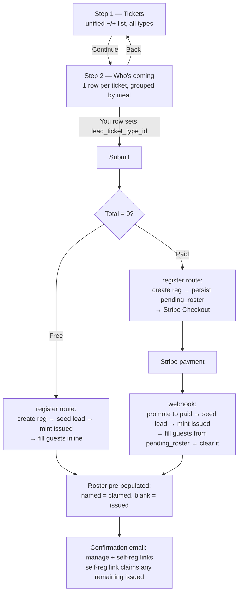
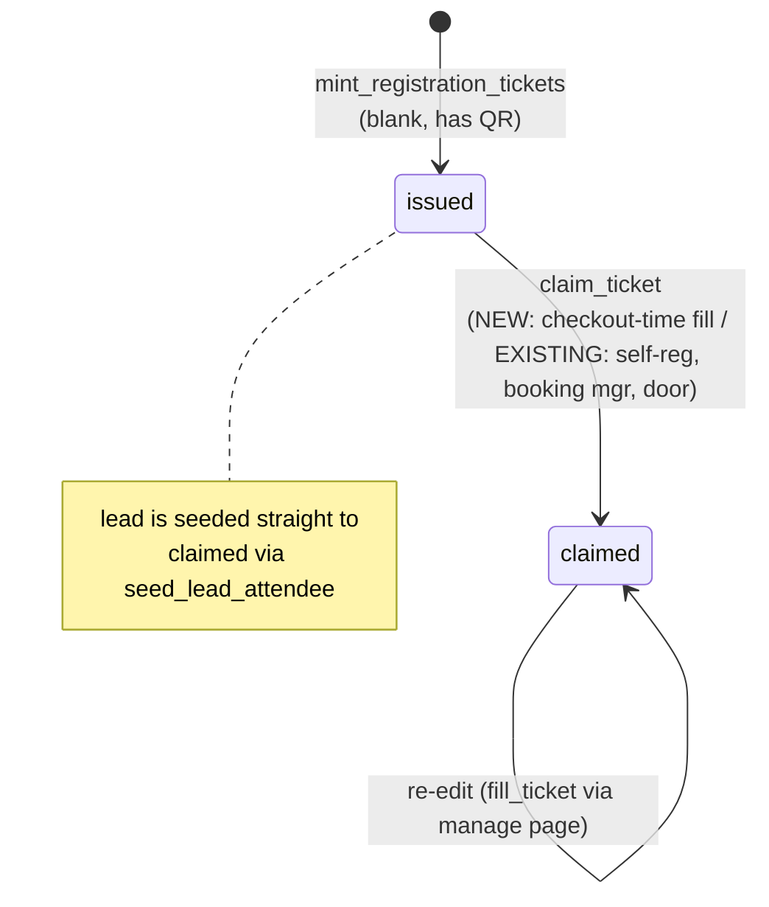

# feat: Unified ticket selection + nominative attendee step at checkout

## Summary

Public event checkout currently makes the buyer pick their **own** ticket in a "Your ticket" dropdown and then add everyone else through a separate "Additional guest tickets" stepper list. On events where the ticket *is* the meal (e.g. the asado: Entrance / Asado Buffet / Vegetarian), the buyer sees the same options twice — the reported friction.

This plan collapses selection into **one unified stepper list** for the whole party (the dropdown is removed), then adds an **extra step** where the booker can put a **name + email** against each ticket — including their own — making tickets nominative at purchase instead of only later via the self-registration link. Naming is **optional**; the self-reg link stays as the fallback for any un-named ticket. The booker's own row determines which meal is theirs (`lead_ticket_type_id`), which also dissolves the old "which meal is mine?" ambiguity for mixed-meal orders.

The backend to hold named tickets already exists (`tickets` rows in `issued`/`claimed` states; `claim_ticket(registration_id, …)` flips one `issued`→`claimed` idempotently). This work surfaces that at checkout and carries the entered names through the free path (inline) and the paid path (persisted, applied post-payment in the Stripe webhook).

**Product Contract preservation:** No upstream brainstorm; this is a `ce-plan-bootstrap` plan. Scope was confirmed conversationally: unified list; optional per-guest naming; adults name+email, children name-only; self-reg link retained.

---

## Problem Frame

- **Who:** Public event bookers (members, invited guests, non-members) registering a party via the checkout drawer.
- **Now:** Two mental models — a "Your ticket" `<select>` for the buyer's own ticket (`components/public/EventRegistrationForm.tsx:207-225`) plus `−/+` steppers for "Additional guest tickets" (`:227-274`). Redundant when adult meal types are the selectable set. Attendees are named **later** via the self-reg magic link or the "My Booking" page — never at checkout.
- **Want:** One list to choose quantities for the whole party, then an optional step to name each ticket up front (booker included). Fewer decisions, and a roster that can arrive pre-populated.
- **Boundary:** This is a checkout UX + registration-write change. It does **not** touch pricing, capacity, invite gating, or the door/check-in flow beyond consuming the roster those already produce.

---

## Requirements

- **R1** — Replace the "Your ticket" dropdown + "Additional guest tickets" split with a **single unified ticket-quantity list** covering every selectable type (adult and child), each with a `−/+` stepper. (Origin: user request.)
- **R2** — After quantities are chosen, present an **attendee-naming step** with one row per selected ticket, grouped/labelled by meal type.
- **R3** — Naming is **optional** per ticket. The booker may name some, all, or none and still complete checkout. Un-named tickets remain `issued` and are covered by the existing self-reg link.
- **R4** — Per named ticket: **adults require name + email**; **children require name only** (no email/phone), matching the existing `is_child` model and the `tickets_contact_present` DB constraint.
- **R5** — The booker's **own ticket** is one of the rows ("You", pre-filled from the top contact fields). The meal type on that row becomes `lead_ticket_type_id`. When only one adult type exists, it is auto-assigned with no extra choice.
- **R6** — Entered names must be applied to the correct minted `issued` tickets on **both** the free path (synchronously) and the **paid** path (after Stripe payment confirms).
- **R7** — Applying names must be **idempotent / replay-safe** (the Stripe webhook can fire more than once), **including for children** (who carry no contact and are therefore not deduped by `claim_ticket`).
- **R8** — Existing behaviours preserved: per-order cap, rate-class pricing, invite gating, seat-cap check, duplicate-email guard, confirmation email with manage + self-reg links.
- **R9** — Attendee emails within one party must be **distinct** (including vs. the booker's own lead email). `claim_ticket` dedupes claimed rows by contact, so a repeated email silently collapses two attendees into one and leaves a slot unfilled — this must be rejected with a clear message, not dropped.
- **R10** — The register API is **unauthenticated**; `attendees` input must be bounded: per-field max lengths (name ≤ 120, email ≤ 254) and array length ≤ the per-order cap, rejecting over-size payloads before persistence.

---

## Key Technical Decisions

- **KTD1 — Reuse `claim_ticket` for the fill; no new claim logic.** `claim_ticket(p_registration_id, p_name, p_email, p_phone_e164, p_language, p_waiver_version, p_waiver_accepted, p_marketing_consent, p_ticket_type_id)` (`supabase/migrations/20260622190000_claim_ticket_flip_issued.sql:16`) flips one `issued` row of a type to `claimed` and enforces party/per-type caps. **It has no `is_child` parameter** — `is_child` is derived server-side from the ticket-type row (migration lines 66-80), so the fill passes only `p_ticket_type_id` (null contact for children). Its idempotency is **by contact only** and runs solely when an email/phone is present (migration line 88): adult re-claims with the same email are no-ops, but **children (no contact) are NOT deduped** — replay safety for children rests on KTD3's presence-gated fill + clear, not on `claim_ticket` (see R7, U5). *Alternative considered:* a dedicated batch RPC `fill_registration_roster`; rejected as duplicative of a battle-tested primitive. If per-attendee round-trips prove costly at large party sizes, a batch RPC becomes a clean follow-up.
- **KTD2 — Lead stays seeded via `lead_ticket_type_id`; only guests go through the fill.** The lead is already seeded named by `seed_lead_attendee` from `lead_ticket_type_id` (`supabase/migrations/20260622170000_rename_attendees_to_tickets.sql:62`). The naming step sets `lead_ticket_type_id` from the "You" row; guest rows (non-lead) are the only ones passed to the fill. This avoids double-writing the lead row.
- **KTD3 — Persist guest names across the Stripe round-trip on the registration.** Add a nullable `pending_roster jsonb` column to `event_registrations`. The register route writes it **fail-loud** (block checkout with a 500 if the write fails when `attendees` is non-empty — the buyer must never pay for a roster that was never stored) before creating the Stripe session. The webhook **gates the fill on `pending_roster` presence, not on `status`**: on any delivery where `pending_roster` is non-null it runs seed→mint→fill and clears it — so a redelivery after a mid-crash (where `status` was already flipped to `paid`) still completes the fill. The free path skips the column and fills inline. *Alternative considered:* Stripe session metadata — rejected (500-char/key limits, and the roster can exceed it for a 20-ticket party).
- **KTD7 — `pending_roster` is transient PII with a retention obligation.** It holds third-party guest names + emails supplied by an unauthenticated booker. It is cleared on successful fill, but an **abandoned** paid checkout leaves it at rest indefinitely. A cleanup path (clear on the existing pending-registration expiry/cancel path) is required, not optional — see System-Wide Impact.
- **KTD4 — Two-step UI inside the existing form component, not a new route.** `EventRegistrationForm.tsx` gains a `step` state (`"tickets" | "attendees"`); the drawer already scrolls. Keeps the change to one component and preserves the drawer, PostHog capture, sold-out/success panels, and invite-code plumbing.
- **KTD5 — Keep the top contact block as the lead identity + registration contact.** `Full name / Email / Phone` continue to identify the booker (Stripe `customer_email`, duplicate guard, lead seed). The "You" row in step 2 reflects those values rather than re-collecting them; step 2 only *adds* the meal designation (when ambiguous) and guest details.
- **KTD6 — Client-side attendee validation mirrors the server.** Adult-needs-email and per-type-count-not-exceeding-purchased are enforced in the form for UX, and re-validated in the register route (never trust the client). Blank rows are dropped, not rejected.

---

## High-Level Technical Design

### Checkout flow (two steps, one drawer)



### Ticket lifecycle (unchanged states, new fill entry point)



The naming step is a **new caller** of the existing `issued`→`claimed` transition, not a new state or table.

---

## Implementation Units

### U1. Unified ticket-quantity list + two-step scaffold

**Goal:** Remove the "Your ticket" dropdown; make one `−/+` list for all selectable types; introduce `step` state so the form can advance to a naming step.

**Requirements:** R1, R5 (single-adult-type auto-assign), R8.

**Dependencies:** none.

**Files:**
- `components/public/EventRegistrationForm.tsx` (modify)
- `components/public/EventRegistrationForm.test.tsx` (create — component test; first component test in repo, co-located per `lib/*.test.ts` convention, run by `vitest`)

**Execution note:** this is the repo's first React component test — wiring `vitest` + jsdom + testing-library is bounded net-new setup. Do it as the first sub-task of U1 (not "flag at implementation") so it can't silently expand the unit; if a harness already exists, reuse it.

**Approach:**
- Delete the `leadTicketTypeId` `<select>` block (`:207-225`) and the "Additional guest tickets" heading; render **one** list over selectable types with steppers (child types included, name-only semantics surface in U2).
- `quantities: Record<string,number>` now represents the **whole party** (no implicit +1 for the lead). `totalQuantity = sum(quantities)`; cap logic (`atCap`, `MAX_QUANTITY_HARD_CAP`, `maxQuantity`) applies to that sum. Running total recomputed over `quantities` only.
- Derive `leadTicketTypeId`: if exactly one adult (`!is_child`, priced) type has qty ≥ 1 → auto. If two or more distinct adult types are selected → left unset here, resolved by the "You" row in U2.
- Add `step` state (`"tickets" | "attendees"`). Step 1 shows the list + a **Continue** button (disabled until `totalQuantity ≥ 1` and at least one **adult** ticket is selected — the booker attends). "Reserve/Confirm" submit moves to U2's step.
- Keep `notOpen` (null-price) rows rendering without a stepper.

**Patterns to follow:** existing stepper markup and `inputClass` in the same file; cap/`atCap` logic (`:71`).

**Test scenarios** (`EventRegistrationForm.test.tsx`):
- Renders one stepper per selectable type; no "Your ticket" `<select>` in the DOM.
- Child (`is_child`) and null-price (`notOpen`) types render per existing rules (null-price shows no stepper).
- Continue disabled when total is 0; disabled when only child tickets are selected; enabled once an adult ticket qty ≥ 1.
- Total reflects `quantities` only (no phantom +1): selecting 1×CHF 80 shows CHF 80.00, not CHF 160.00.
- `atCap`: `+` buttons disable when `totalQuantity` hits the clamped cap; cap banner shows.
- Single adult type selected → advancing carries that type as the lead type with no meal picker in step 2.

---

### U2. Attendee-naming step ("Who's coming")

**Goal:** After quantities are chosen, render one row per ticket, grouped by meal type, capturing optional name (+ email for adults). The "You" row sets the lead meal; guest rows build the `attendees` payload.

**Requirements:** R2, R3, R4, R5, R6 (client half), R8.

**Dependencies:** U1.

**Files:**
- `components/public/EventRegistrationForm.tsx` (modify)
- `components/public/EventRegistrationForm.test.tsx` (extend)

**Approach:**
- Step 2 expands `quantities` into rows: for each type, `quantity` rows; group under the type title + price.
- **You row:** the first adult-type row is labelled **"You"** and pre-filled read-only from the top `name`/`email`. When 2+ adult types were selected, the booker picks *which* meal is theirs via a compact control (radio/select limited to the selected adult types); that choice sets `leadTicketTypeId`. When one adult type, the "You" row is fixed and informational.
- **Guest rows:** `name` + `email` inputs for adult types; `name` only for child types (no email/phone field). All optional. A partially filled adult row (name but no email) is a client validation error surfaced inline; a fully blank row is allowed and simply omitted.
- **Back** returns to step 1 preserving `quantities` and any entered names.
- On submit, build:
  - `items`: `{ ticket_type_id, quantity }[]` from `quantities` (unchanged server contract for pricing/capacity).
  - `leadTicketTypeId`: from the You row.
  - `attendees`: `{ ticket_type_id, name, email?, is_child }[]` for **non-lead** rows that have at least a name. Omit blank rows. (Booker/lead identity still travels via top-level `name`/`email`.)
- POST body extends the existing shape (`:98`) with `attendees`. Keep `phone`, `code`, PostHog capture, sold-out/success handling.

**UX / interaction details (must be specified, not improvised):**
- **Step affordance:** the drawer header shows progress ("Step 1 of 2 · Tickets" / "Step 2 of 2 · Who's coming") so Continue doesn't jump to an unexpected screen.
- **"You"-row re-render contract (2+ adult types):** when the booker changes their meal, the "You" row detaches from its old group and occupies exactly one slot in the chosen group; a guest row appears in the vacated group so per-type counts stay balanced. State where "You" renders within its group and how remaining guest rows renumber.
- **Optional-naming microcopy:** a header line states naming is optional and un-named guests get a link to register themselves later; fields are NOT visually marked required.
- **Child-only hint (step 1):** when only child tickets are selected, show "Add at least one adult ticket — the booker attends" so the disabled Continue is explained.
- **Accessibility:** each row input carries a unique accessible name tying it to meal + index (e.g. `aria-label="Guest 2 name — Asado Buffet"`), mirroring the existing stepper `aria-label` pattern. On Continue, focus moves to the step-2 heading with an aria-live announcement; Back restores focus to the Continue trigger.
- **Error model:** per-row error state keyed by row with inline message via `aria-describedby`; on blocked submit, focus/scroll to the first invalid row. Decide whether the top-level `error` banner is also used.
- **Mobile:** a sticky footer within the drawer holds Back + submit + the running total, so primary actions and price stay reachable across a 20-row list. Step-2 submit retains the existing "Reserve your spot" / "Confirm registration" label logic; the running total stays visible on step 2.

**Patterns to follow:** `handleSubmit` structure and error surfacing (`:78-147`); existing stepper `aria-label`s (`:252-264`); `SelfRegistrationForm.tsx` for the name/email/child field treatment and bilingual-free labels.

**Test scenarios:**
- One row per purchased ticket, grouped by type with correct price label.
- Single adult type: "You" row fixed, no meal picker; `leadTicketTypeId` = that type on submit.
- Two adult types: meal picker appears; selecting one sets `leadTicketTypeId`; submit blocked until the booker's meal is chosen.
- Adult guest row with name but no email → inline error, submit blocked.
- Child guest row accepts name only; no email field rendered.
- All guest rows blank → submit succeeds; `attendees` is empty (or omitted).
- Mixed: 1 named adult guest + 1 blank → `attendees` has exactly the named one, tagged with the right `ticket_type_id`.
- Back preserves quantities and typed names.

---

### U3. Migration — `pending_roster` column + roster-fill helper

**Goal:** Add durable storage for booker-entered guest names across the Stripe round-trip, and a server helper that applies them via `claim_ticket`.

**Requirements:** R6, R7.

**Dependencies:** none (DB + lib only).

**Files:**
- `supabase/migrations/2026XXXXXXXXXX_pending_roster.sql` (create — additive nullable column; **NB dev and prod share one Supabase DB, so this mutates production immediately** — mirror the additive-only caution used in `20260604180000_lead_ticket_type.sql`)
- `lib/events/roster.ts` (modify — add `fillRegistrationRoster`)
- `lib/events/roster-fill.test.ts` (extend — existing file)
- `types/database.ts` (regenerate; re-append hand-written aliases per project convention)

**Approach:**
- Migration: `ALTER TABLE public.event_registrations ADD COLUMN IF NOT EXISTS pending_roster jsonb;` with a `COMMENT` documenting it as transient (guest names captured at checkout, applied + cleared after confirmation). No new RPC — reuse `claim_ticket`.
- **Abandoned-checkout cleanup (KTD7):** the column must be cleared on registrations that never complete payment. Hook the existing pending-registration expiry/cancel path if one exists; otherwise add a scheduled clear of `pending_roster` for registrations still `pending` past Stripe checkout expiry. Confirm which mechanism exists during implementation; do not leave guest PII at rest indefinitely.
- `fillRegistrationRoster(registrationId, attendees)`: for each `{ ticket_type_id, name, email }`, call `supabase.rpc("claim_ticket", …)` with `p_registration_id = registrationId`, `p_email` = email (null for children — `is_child` is derived from the ticket type inside the RPC, **not passed**). Pass the full non-default param set exactly as `claimSelfRegistration` does (`p_phone_e164` null, `p_language` null, waiver params null/false, `p_marketing_consent = false` — booker can't opt a guest in, matching `BookingManager`'s fill). **Do NOT pass `p_is_child`** — it is not a parameter and an unknown named arg makes PostgREST fail to resolve the overload (PGRST202).
- Best-effort per row: log and continue on error (a failed guest fill must never fail an already-created/paid registration — mirror `seedLeadAttendee`/`mintRegistrationTickets`).
- **Replay note:** `claim_ticket` dedupes only when a contact is present, so adult re-claims are no-ops but **children are not deduped**. The helper is safe to repeat only because U5 gates it on `pending_roster` presence and clears after a pass; the helper itself makes no idempotency guarantee for children.

**Approach — Technical design (directional):**
```
fillRegistrationRoster(regId, attendees[]):        # attendees already normalized/validated in U4
  for a in attendees:
    contact = a.email ?? null                       # null for children (type-derived, validated upstream)
    try: rpc claim_ticket(p_registration_id=regId, p_name=a.name, p_email=contact,
                          p_phone_e164=null, p_language=null, p_waiver_version=null,
                          p_waiver_accepted=false, p_marketing_consent=false,
                          p_ticket_type_id=a.ticket_type_id)   # NO p_is_child
    catch err: log [roster] fill row failed {regId, err}; continue
```

**Patterns to follow:** `claimSelfRegistration` param wiring in `lib/events/roster.ts:169-189`; best-effort log-not-throw in `seedLeadAttendee`/`mintRegistrationTickets` (`:18-62`); `claim_ticket` signature at `20260622190000_...:16`.

**Test scenarios** (`lib/events/roster-fill.test.ts`):
- Calls `claim_ticket` once per attendee with the right registration id + type.
- Child attendee (child ticket type) → `p_email` passed as null; no `p_is_child` argument in the RPC call (assert the call payload has no `p_is_child` key).
- One row's RPC error is logged and does not abort remaining rows or throw.
- Empty attendee list → no RPC calls, no throw.
- Re-invoking with the same attendees issues the same calls (idempotency delegated to `claim_ticket`; assert the helper itself is safely repeatable).

---

### U4. Register route — accept, validate, and apply `attendees`

**Goal:** Parse and validate the `attendees` array; on the free path fill inline after mint; on the paid path persist `pending_roster` for the webhook.

**Requirements:** R3, R4, R6, R7, R8.

**Dependencies:** U3.

**Files:**
- `app/api/events/[id]/register/route.ts` (modify)
- `app/api/events/[id]/register/route.test.ts` (extend — existing)

**Approach:**
- Extend the request type + parse `attendees` as `{ ticket_type_id, name, email? }[]` (default `[]`). **Never trust a client `is_child`** — derive it from `typeById.get(ticket_type_id).is_child`. Validate each row:
  - `ticket_type_id` ∈ basket ids (IDOR guard already loads `typeById`);
  - `name` non-empty and **≤ 120 chars**; `email` **≤ 254 chars** (R10);
  - adults (type `is_child = false`) require a valid email; children ignore/forbid email;
  - **array length ≤ per-order cap** (R10); reject over-size payloads before any persistence.
- **Distinct-contact check (R9):** reject when any attendee email duplicates another attendee's or the registration's own (lead) email — otherwise `claim_ticket` silently collapses them. Return a clear 400 naming the duplicate.
- Enforce per-type named count ≤ purchased quantity for that type **minus the lead's** if the lead shares that type. Reject bad rows with a 400 (client pre-validates; this is defence-in-depth for the unauthenticated endpoint).
- **Server-side lead-type guard:** mirror the client gate — when the basket has 2+ selectable **adult** types and `leadTicketTypeId` is absent, return 400 rather than seeding an untyped lead (which skews per-type cap math). Keep the rest of the existing `leadTicketTypeId` handling (`:164-177`: lead ∈ basket, non-child, single-type inference).
- **Free path** (`:301-312`): after `seedLeadAttendee` + `mintRegistrationTickets`, call `fillRegistrationRoster(registrationId, normalizedAttendees)`.
- **Paid path** (before Stripe session, near the `regPatch` at `:276-288`): persist `pending_roster = normalizedAttendees`. **Fail-loud when `attendees` is non-empty** — if the write fails, return 500 and do NOT create the Stripe session (the buyer must not pay for a roster that was never stored). The `phone`/token patch stays best-effort as today.
- Do not change pricing, seat-cap, duplicate-guard, or Stripe line-item logic.

**Patterns to follow:** existing `parsed`/`typeById` validation loop (`:63-177`); best-effort `regPatch` update (`:276-298`); `bad()` responses.

**Test scenarios** (`route.test.ts`):
- Free basket with 1 named adult guest → registration created; `fillRegistrationRoster` invoked with that attendee; response unchanged (`success` + `reference_code`).
- Paid basket with named guests → `pending_roster` persisted on the registration; Stripe path returns `checkout_url`; fill **not** run inline.
- Paid basket, `pending_roster` write fails → 500 returned, **no** Stripe session created (fail-loud).
- Attendee `ticket_type_id` not in basket → 400 (IDOR/consistency).
- Adult attendee missing email → 400; child attendee missing email → accepted; child attendee WITH email → email dropped (type-derived is_child, not client flag).
- Client sends `is_child:true` on an adult type → ignored; adult still requires email.
- Two attendees share an email, or a guest reuses the lead email → 400 (R9 distinct-contact).
- Over-length name (>120) / email (>254), or attendees array longer than the cap → 400 (R10).
- Named count for a type exceeding purchased quantity (accounting for the lead) → 400.
- Basket with 2+ adult types and no `leadTicketTypeId` → 400 (server lead-type guard).
- No `attendees` field → behaves exactly as today (back-compat; existing tests still pass, incl. `leadTicketTypeId: "tX"` case at `:240`).
- `leadTicketTypeId` still validated non-child and in-basket.

---

### U5. Stripe webhook — apply `pending_roster` after mint

**Goal:** After a paid registration is promoted and its tickets minted, apply the stored guest names and clear the column.

**Requirements:** R6, R7.

**Dependencies:** U3, U4.

**Files:**
- `app/api/webhooks/stripe/route.ts` (modify)
- `app/api/webhooks/stripe/route.test.ts` (create — no webhook test exists today; add unit coverage for the fill+clear step, mocking the admin client / RPCs)

**Approach:**
- Where the webhook already calls `seedLeadAttendee(existing.id)` + `mintRegistrationTickets` (`:335` and mint at `:227/:336`), read `pending_roster` off the registration; if non-null, call `fillRegistrationRoster(existing.id, pending_roster)`, then null the column. Order matters: **seed → mint → fill** (the lead and issued rows must exist before guest fills claim them).
- **Gate the fill on `pending_roster` presence, not on `status`.** The webhook currently early-returns `already_processed` when `existing.status === "paid"` **before** reaching seed/mint. That short-circuit is the replay bug: if the first delivery flips `status` to `paid` then crashes (serverless timeout) before the fill, every redelivery hits the short-circuit and the roster is stranded forever. Restructure so a delivery with a non-null `pending_roster` still runs seed→mint→fill→clear even when `status` is already `paid`. Seed and mint are already idempotent (`NOT EXISTS` / `greatest(...,0)`); the clear makes the fill effectively run-once.
- **Replay note:** `claim_ticket` dedupes adults by contact, but children carry no contact and are NOT deduped — so children rely entirely on the presence-gate + clear above, not on `claim_ticket`. Do not describe the fill as "harmlessly re-runnable"; it is run-once via the cleared column.

**Patterns to follow:** the existing seed/mint call site and best-effort logging in `app/api/webhooks/stripe/route.ts`.

**Test scenarios** (`route.test.ts`):
- Paid event with a `pending_roster` → after seed+mint, `fillRegistrationRoster` called with the stored attendees; column cleared.
- Empty/absent `pending_roster` → no fill call; seed+mint unchanged.
- Re-delivered webhook, `status` already `paid` but `pending_roster` still non-null (mid-crash on first delivery) → fill DOES run and completes; column cleared (proves the presence-gate, not the status short-circuit).
- Re-delivered webhook, `pending_roster` already null → no fill call, no duplicate child claims, no throw.
- Fill runs strictly after seed + mint (assert call order).

---

## Scope Boundaries

**In scope:** unified selection list; two-step form; optional per-ticket naming (adults name+email, children name-only); lead meal via the "You" row; free + paid application of names; idempotent webhook fill; `pending_roster` column; reuse of `claim_ticket`.

### Deferred to Follow-Up Work
- **Emailing guests their own QR at purchase.** Confirmation email still sends only the lead's QR + manage/self-reg links (`lib/email/event-registration.ts`); named guests are reachable via forward/manage as today. Per-guest ticket emails are a separate feature.
- **Batch fill RPC.** If per-attendee `claim_ticket` round-trips become a latency concern for large parties, replace the loop with a single `fill_registration_roster` RPC (KTD1).
- **Editing guest names from the confirmation/step after payment.** Post-purchase edits remain on the "My Booking" page (`BookingManager` → `fill_ticket`).

### Out of scope (non-goals)
- Pricing, rate-class, invite gating, seat-cap, duplicate-email logic.
- Door check-in / credential rendering.
- Admin roster UI and bulk import.

---

## System-Wide Impact

- **Shared DB caution:** dev and prod share one Supabase project (per project memory). The `pending_roster` migration is additive and nullable — safe — but applies to production on run.
- **`types/database.ts`** regenerates after the migration; re-append the hand-written `MemberStatus`/`PaymentCaptureStatus` aliases (project convention — MCP regen drops them).
- **Confirmation email self-reg link** is gated on `quantity > 1` (`lib/email/event-registration.ts:122`); unchanged. When the booker names everyone, the self-reg link simply finds no open slots — harmless.
- **Back-compat:** the register API remains valid without `attendees`; existing tests and any cached clients keep working.
- **Guest-PII retention (Swiss nFADP / GDPR):** the register API now accepts and stores third-party names + emails from an **unauthenticated** booker, with no consent from the named guest at capture time (marketing consent is hard-coded `false`, which is correct). Two retention surfaces: `pending_roster` on abandoned paid checkouts (cleared on the pending-registration expiry/cancel path — required, see KTD7) and the named `claimed` tickets themselves (same lifecycle as today's self-reg-named tickets). Confirm a lawful-basis/retention note with the owner before shipping; treat abandoned-`pending_roster` cleanup as in-scope, not deferred.

---

## Risks & Mitigations

- **Names lost between Stripe and webhook** → `pending_roster` write is **fail-loud** when `attendees` is present (500, no Stripe session) so the buyer never pays for an unstored roster; the webhook applies it gated on presence.
- **Roster stranded by a mid-crash webhook** → fill is gated on `pending_roster` presence (not `status`), so a redelivery after a first-delivery crash still completes and clears (U5).
- **Double-claiming on webhook replay** → run-once via the cleared `pending_roster` column. Note `claim_ticket` dedupes adults by contact but NOT children (no contact), so children rely on the presence-gate + clear, not on the RPC.
- **Within-party duplicate email drops a guest** → `claim_ticket` collapses same-contact claims; R9 distinct-contact validation (incl. vs. the lead email) rejects this up front rather than silently losing a ticket.
- **Untyped lead on multi-adult basket** → server-side lead-type guard (400) mirrors the client gate, so a client bug or direct API call can't seed an untyped lead and skew per-type cap math.
- **Booker over-names a type (more names than tickets)** → per-type count validated client- and server-side; `claim_ticket`'s per-type cap is the final backstop (returns `type_full`, logged, non-fatal).
- **Unauthenticated PII/storage abuse** → length bounds (name ≤120, email ≤254) + array cap (R10) reject oversized payloads before persistence.
- **Partial fill is silent** → a `type_full`/duplicate return drops a guest with no buyer-facing signal (confirmation email carries only the lead QR). Acceptable for launch because the self-reg/manage links still cover un-filled slots; revisit if reconciliation signalling is wanted (see Open Question below).
- **First component test in the repo** → treated as a bounded first sub-task of U1 (see U1 Execution note), not an implementation-time surprise.

## Open Questions

- Should a partially-failed fill (a guest dropped as `type_full`/duplicate) surface any reconciliation signal to the booker, or is silent fallback-to-self-reg acceptable for launch? *(Current plan: silent fallback.)*
- Owner sign-off on the guest-PII lawful-basis/retention note (System-Wide Impact) before ship.

---

## Verification

- **Unit/integration (`npm run test:unit`):** all U1–U5 scenarios green; existing `route.test.ts` unchanged behaviour when `attendees` absent.
- **Manual free-event walkthrough:** select a mixed party, name some/all/none, confirm → roster shows named tickets as `claimed`, blanks as `issued`; self-reg link still claims a blank.
- **Manual paid-event walkthrough:** name guests → pay via Stripe test card → webhook applies names; roster pre-populated; `pending_roster` cleared.
- **Single-adult-type event:** no meal picker appears; lead auto-typed.
- **Regression:** cap, sold-out, duplicate-email, invite-code paths behave as before.

## Definition of Done

- "Your ticket" dropdown removed; one unified quantity list ships.
- Optional naming step captures adults (name+email) and children (name-only); booker's own row sets the lead meal.
- Names applied correctly on free and paid paths; webhook fill is presence-gated (survives a mid-crash redelivery) and clears `pending_roster`.
- R9 distinct-email and R10 input bounds enforced server-side; server rejects an untyped lead on multi-adult baskets; `pending_roster` write is fail-loud.
- Abandoned-checkout `pending_roster` cleanup in place (KTD7); guest-PII retention note signed off by the owner.
- All new/updated tests pass; existing register tests pass unchanged.
- Additive migration applied; `types/database.ts` regenerated with aliases re-appended.
