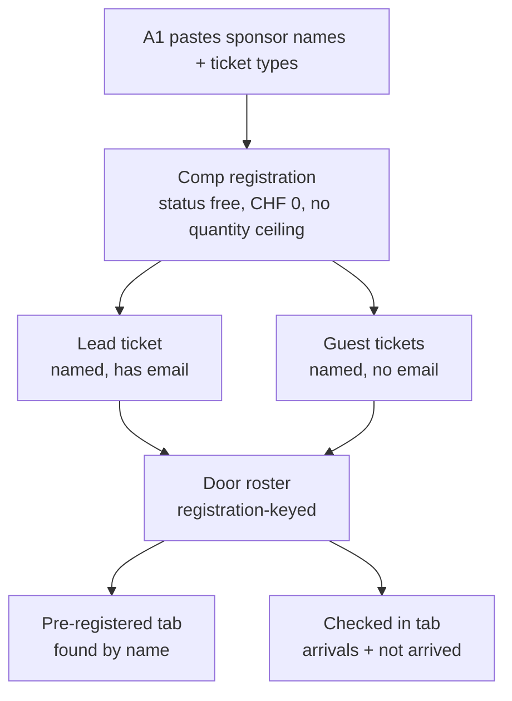
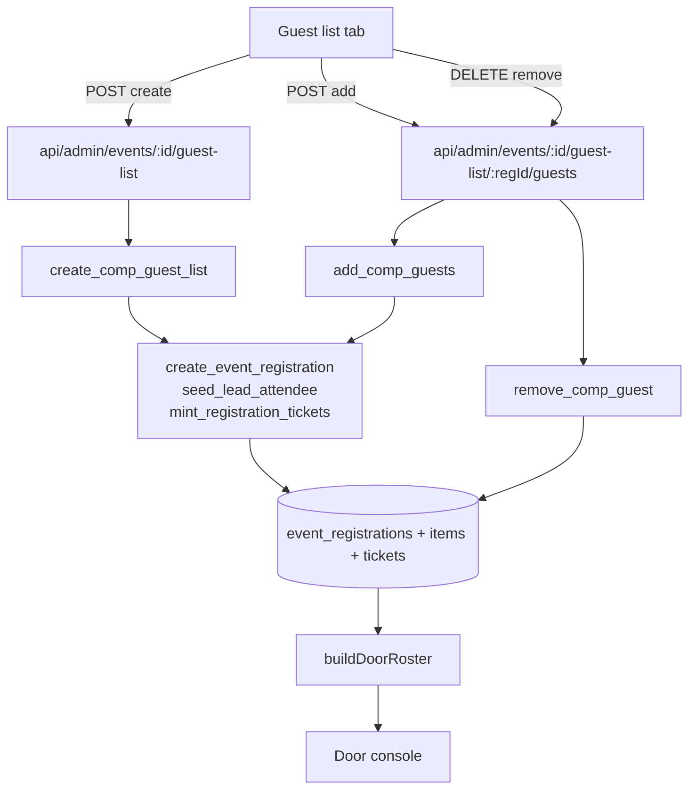

# Admin Guest List and Door Console Arrivals - Plan

## Goal Capsule

- **Objective:** Let admins build a sponsor's comp guest list in the admin UI as a real, zero-price registration the door console already understands, and make the door's Checked in tab a complete, searchable arrivals view.
- **Product authority:** Frank Sykes (project owner). Product decisions in this contract are confirmed.
- **Product Contract preservation:** unchanged. Planning added no product scope and altered no R-IDs.
- **Open blockers:** None.
- **Execution profile:** Deep. Six units spanning a database migration, two admin API routes, one admin component, the door console, and a docs/solutions entry, shipped as two independent pull requests. The migration lands on a database shared by dev and production, so every change in it is backward-compatible.

---

## Product Contract

### Summary

Replace the admin Import tab with a Guest list tab that creates a comp registration — a lead plus named guests, a ticket type each, at zero price, with no quantity ceiling. The door console picks the list up automatically as a normal party. Separately, the door's Checked in tab becomes a complete searchable arrivals list showing party and ticket type per row, with a view that flips to show who has not arrived.

### Problem Frame

Sponsors hand the club a list of names to comp — no emails, no phones, just names and (sometimes) which ticket type each person gets. The club has no way to put those people on the door.

The nearest tool is the admin Import tab, and it is a trap. Import writes attendee rows with `registration_id` left null, while the door console builds its entire roster from `event_registrations`. Anyone imported is therefore invisible at the door: staff paste the sponsor's list, the admin UI shows it, and on the night the guests do not exist. The failure is silent and only discovered at the gate.

Meanwhile the Checked in tab cannot support the door it is meant to run. It renders a progress bar and an arrivals feed hard-capped at eight names showing only name and time — no search, no party, no ticket type. A volunteer asked "did the Rossi party get in?" or "has Anna arrived?" has no way to answer once nine people are through, and no way to tell a child ticket from an adult one.

### Key Decisions

- **A comp guest list is a registration, not a new kind of attendee.** The list is created as a zero-price registration with line items at CHF 0, exactly as `waitlist/convert` already does. Because the door console is registration-keyed, comp guests appear at the door, get credentials, and are searchable and checkable-in with no changes to the door's data model.
- **The Import tab is replaced, not supplemented.** Import's job — paste a hand-collected list — is the guest list's job done correctly. Keeping both would leave two similar-looking tools that produce different results, one of which silently fails at the door.
- **The lead is one of the guests.** The sponsor contact holds a ticket, carries the registration's email, and counts toward the expected headcount, exactly like any other registration lead.
- **Guests are name-only.** A guest needs a name and a ticket type and nothing else. Contact details and waiver acceptance are collected at the door on check-in, which the console already does.
- **Comp lists have no quantity ceiling.** Admins add and remove guests at any time and each addition mints a ticket. Paid registrations keep their fixed purchased quantity; the two behave differently because a comp list is not a purchase.
- **Nothing is emailed on creation.** The existing resend-tickets action is the delivery path, used at the admin's discretion.

### Actors

- A1. **Events admin** — builds and maintains the comp guest list for an event.
- A2. **Sponsor lead** — the sponsor's contact person; holds a comp ticket, receives the party's tickets only if an admin resends them, and can forward QRs onward.
- A3. **Comp guest** — a named person on the sponsor's list. Arrives with no ticket email and no QR; is found at the door by name.
- A4. **Door volunteer** — runs the door console: finds arrivals, checks them in, and tracks who is still outstanding.

### How a comp list reaches the door

Today's Import tab stops before the registration box — which is why nothing downstream of it exists.

### Requirements

**Building a guest list**

- R1. An events admin can create a comp guest list for an event from the admin UI, entering a lead (name and email) and any number of named guests.
- R2. Each person on the list — lead and guests alike — is assigned a ticket type from the event's active ticket types.
- R3. A guest requires only a name and a ticket type. Email and phone are optional and may be absent.
- R4. The lead requires a name and an email, and is one of the ticketed attendees.
- R5. Creating a guest list produces a confirmed zero-price registration holding one ticket per person, each with its own credential.
- R6. An admin can add guests to, and remove guests from, an existing comp list at any time. There is no maximum list size.
- R7. Removing a guest who has already checked in is not permitted.
- R8. Creating or amending a guest list sends no email. Tickets reach the lead only when an admin uses the existing resend-tickets action.
- R9. The Guest list tab replaces the Import tab in the admin event UI. Attendee rows created by the retired import path are left as-is and are not backfilled.

**Seats and capacity**

- R10. Comp guests consume event seats, counting toward seats used like any other ticket.
- R11. A comp guest list may take an event past its capacity cap at the admin's discretion, following the existing waitlist-conversion behaviour.

**At the door**

- R12. Comp parties appear in the door console's Pre-registered tab like any other party, searchable by guest name, lead name, and reference code.
- R13. A comp guest is checked in at the door by name, with contact details and waiver collected at check-in.

**Checked in tab**

- R14. The Checked in tab lists every arrival with no cap.
- R15. The Checked in tab has a search box matching the same fields as the Pre-registered tab's search: guest name, party or lead name, and booking reference.
- R16. Each arrival row shows the guest's name, their party, their ticket type, and their arrival time.
- R17. The tab can switch to show attendees who have not arrived, using the same row shape and search.
- R18. The tab shows a live arrived count, an expected count, and an outstanding count.

### Key Flows

- F1. Admin builds a sponsor's comp list
  - **Trigger:** A sponsor sends a list of names to comp for an upcoming event.
  - **Actors:** A1
  - **Steps:** Admin opens the event's Guest list tab; enters the sponsor contact as lead with an email and a ticket type; adds each guest name with a ticket type; saves.
  - **Outcome:** A zero-price registration exists holding one credentialed ticket per person. No email is sent. The party is immediately visible on the door console.
  - **Covered by:** R1, R2, R3, R4, R5, R8, R10, R11

- F2. A sponsor adds two more names the week of the event
  - **Trigger:** The sponsor sends additions after the list was created.
  - **Actors:** A1
  - **Steps:** Admin reopens the guest list and adds the two names with their ticket types.
  - **Outcome:** Two more tickets are minted on the same registration; the party's size and the event's seats used both grow. No cap blocks the addition.
  - **Covered by:** R6, R10, R11

- F3. A comp guest arrives at the door
  - **Trigger:** A named comp guest arrives with no ticket email and no QR.
  - **Actors:** A3, A4
  - **Steps:** Volunteer searches the guest's name in the Pre-registered tab; finds their ticket under the sponsor's party; captures contact details and waiver; checks them in.
  - **Outcome:** The guest is admitted and appears in the Checked in tab, showing their name, the sponsor's party, and their ticket type.
  - **Covered by:** R12, R13, R14, R16

- F4. Volunteer answers "who is still missing?"
  - **Trigger:** Late in the evening, staff need to know which expected attendees never showed.
  - **Actors:** A4
  - **Steps:** Volunteer switches the Checked in tab to the not-arrived view and scans or searches it.
  - **Outcome:** Every outstanding attendee is listed with their party and ticket type; the outstanding count matches.
  - **Covered by:** R17, R18

### Acceptance Examples

- AE1. Guest with no contact details
  - **Covers R3, R13.**
  - **Given** a comp list holding a guest with a name and a ticket type but no email or phone,
  - **When** the admin saves the list,
  - **Then** the guest's ticket is created and named, and the door console can find and check that guest in, collecting contact details and waiver at check-in.

- AE2. Comp list pushes the event past its cap
  - **Covers R10, R11.**
  - **Given** an event at its capacity cap,
  - **When** an admin adds a comp guest list of ten,
  - **Then** the list is created, seats used exceeds the cap, and the admin is not blocked.

- AE3. Removing a checked-in guest
  - **Covers R7.**
  - **Given** a comp guest who has already been checked in at the door,
  - **When** an admin tries to remove them from the guest list,
  - **Then** the removal is refused.

- AE4. Arrivals beyond the old cap
  - **Covers R14, R15.**
  - **Given** thirty attendees have been checked in,
  - **When** a volunteer opens the Checked in tab and searches a guest's name,
  - **Then** all thirty arrivals are listed and the search finds the guest, rather than the list stopping at eight.

### Scope Boundaries

- Undo check-in. A mistaken check-in stays uncorrectable and permanently inflates the arrived count. Named here because it is the door's only uncorrectable error and the most likely follow-up.
- Adding attendees from the door console. Growth is an admin action; the door remains a gate, and its rule that a party cannot exceed its tickets is unchanged.
- Backfilling attendees created by the retired Import path into comp registrations. They remain as legacy history.
- Emailing comp guests directly. Guests have no email addresses by definition; delivery goes to the lead via the existing resend action, if at all.
- Charging for a comp list, or partial comps. A guest list is zero-price throughout.

### Dependencies / Assumptions

- The comp registration is created through the existing `create_event_registration` path with `status = 'free'` and zero-amount line items — the same path `waitlist/convert` uses today. Planning should confirm it accepts multiple line items so a single list can span several ticket types.
- Registration leads are seeded a ticket automatically from the registration's name and email, which is why R4 requires a lead email.
- Registrations are unique per email per event. A sponsor contact who is already registered for the event cannot also be the lead of a comp list under the same email; the collision surfaces to the admin as a 409.
- The door console is registration-keyed, so no door-side data change is needed for comp parties to appear.

### Outstanding Questions

All three questions the Product Contract deferred to planning are now answered: the not-arrived view is a segmented control inside the renamed Arrivals tab (U5); a lead-email collision surfaces as a 409 carrying the server's message (U2, U3); and the Guest list tab keeps a paste input, because retyping a forty-name sponsor list would be a regression against the Import tab it replaces (U3).

### Sources / Research

- `components/door/DoorConsole.tsx` — two tabs today; the Checked in feed is capped by `arrivals.slice(0, 8)` and renders name plus time only.
- `lib/events/door-access.ts` — `buildDoorRoster` builds the entire door roster from `event_registrations` joined to `tickets`; `expected` is the sum of registration quantities. This is why registration-less attendees are invisible at the door.
- `app/api/admin/events/[id]/waitlist/convert/route.ts` — the existing precedent for an admin-created "comped (free) registration that overrides the seat cap", via the `create_event_registration` RPC with zero-amount line items.
- `supabase/migrations/20260603121000_event_registrations_phone_and_lead_seed.sql` — `seed_lead_attendee` mints a named, credentialed `is_lead` ticket from the registration's name and email.
- `supabase/migrations/20260603122000_import_event_attendees_rpc.sql` — the current import path, which inserts attendee rows with no `registration_id`.
- `docs/brainstorms/2026-06-22-event-qr-access-flow-requirements.md` — establishes that purchased quantity is the hard limit for paid parties and that walk-ups cannot exceed it. Comp lists reach the door by having tickets minted, not by overriding that rule.
- `docs/solutions/database-issues/pending-roster-non-atomic-fill-clear-replays-duplicate-guests.md` — `claim_ticket` only dedupes on email or phone, so name-only guests replay into duplicates. This is why KTD1 replaces it.
- `supabase/migrations/20260622170000_rename_attendees_to_tickets.sql` — the `tickets_contact_present` constraint, which forbids a name-only claimed adult ticket today and so forbids this feature's central case until KTD3 widens it.
- `supabase/migrations/20260604150000_allow_contactless_arrival.sql` — the precedent for widening that same constraint compatibly.
- `supabase/migrations/20260622190000_claim_ticket_flip_issued.sql` — `release_ticket` mints a fresh `issued` replacement and never decrements quantity, which is why KTD5 does not reuse it.
- `supabase/migrations/20260622220000_registration_topups.sql` — `apply_registration_topup` is idempotent because of its durable ledger row, not because of its lock. KTD2 carries the ledger, not just the lock.
- `docs/solutions/security/supabase-securitydefiner-anon-execute-grant-2026-06-04.md` — `REVOKE ... FROM PUBLIC` alone leaves a `SECURITY DEFINER` function callable by `anon` and `authenticated` through the public key.
- `docs/solutions/build-errors/nextjs-app-router-route-file-export-restriction-2026-04-29.md` — `route.ts` may export only handlers; shared helpers and types must live under `lib/`.
- `docs/solutions/architecture-patterns/reusing-nullable-column-as-value-source-trap.md` — why KTD4 adds an explicit flag instead of inferring "comp list" from `converted_by` or a zero total.

---

## Planning Contract

### Key Technical Decisions

- KTD1. **The comp write RPCs orchestrate the existing registration RPCs; they do not re-implement them.** `create_event_registration`, `seed_lead_attendee`, and `mint_registration_tickets` are already atomic or idempotent and run inside the caller's transaction, so `create_comp_guest_list` calls them in sequence under one transaction and one registration lock. Only `claim_ticket` is replaced: it rejects a contactless adult outright and dedupes on email or phone, neither of which a name-only comp guest has. Naming a guest therefore writes directly to the freshly minted `issued` row. Re-deriving the registration insert or the mint shortfall inside a new RPC would create a second definition of how a registration is built.

- KTD2. **Atomicity and idempotency are separate problems, and both need solving.** A `FOR UPDATE` lock serializes two identical submits — it does not dedupe them. Creation is protected by the existing partial unique index on `(event_id, lower(email))`, which raises `23505` on a replay. Adding guests has no such backstop, so `add_comp_guests` takes an idempotency key, persists it, and returns the prior result unchanged when the key repeats. A client-side submitting flag is not a retry guard: it does not survive a network retry, a proxy retry, or a back-and-resubmit.

- KTD3. **A name-only comp ticket needs a new `tickets.is_comp` flag, because the contact-present constraint forbids it today.** `tickets_contact_present` allows a `claimed` ticket only when it has an email, a phone, an arrival, or `is_child = true`. A name-only adult comp guest satisfies none of these and raises `23514` — the feature's central case cannot be written without widening the constraint. The widening must be column-local, because Postgres forbids subqueries in a CHECK constraint, so a flag on `tickets` is required and a lookup back to `event_registrations.is_guest_list` is not an option. Every existing row still satisfies the wider constraint.

- KTD4. **`event_registrations.is_guest_list` marks a comp list.** Nothing today separates a guest list from a waitlist comp — both are `status = 'free'` with `converted_by` set. An explicit flag lets the Guest list tab find its own lists without overloading a column whose meaning would then depend on how the row was created.

- KTD5. **Removing a comp guest shrinks the party; it does not reuse `release_ticket`.** `release_ticket` tombstones the claimed row and then mints a fresh `issued` replacement, and it never touches `quantity` or the line items — correct for the door, where reopening a freed slot is the point, and wrong here. Reused unchanged it would leave the seat consumed, keep the guest counted in `expected` forever, and hand the sponsor's party a self-registerable open slot on the public door page. A new `remove_comp_guest` keeps `release_ticket`'s refusals (never the lead, never a checked-in ticket), mints no replacement, and decrements both `event_registrations.quantity` and the matching line item so the seat is genuinely returned.

- KTD6. **No server-side seat-cap check on the comp path.** The cap is enforced only in the public register route; `waitlist/convert` deliberately omits it so admins can comp past a full event, and R11 asks for the same. The admin UI warns with a client-side confirm. That confirm is a prompt, not a control, and is not expected to be one.

- KTD7. **The door reads richer arrivals from data it already loads.** `buildDoorRoster` already queries tickets and ticket types and already projects open slots; it simply discards party, ticket type, and contact fields when projecting `arrivals`. Widening the projection adds no query. Comp parties appear at the door with no door-side change at all — that falls out of the registration-keyed roster.

- KTD8. **The not-arrived view renders open slots, so the counts reconcile exactly.** `expected` sums registration quantities and therefore counts unnamed `issued` slots. Those slots are renderable — `buildDoorRoster` already projects them and the Pre-registered tab already draws them — so the not-arrived list includes them as "Open slot" rows carrying their party and ticket type. The list length then equals `outstanding`, and no explanatory note is needed. Both door projections skip tickets with a null `registration_id`, which is what keeps legacy imported rows (R9) out of the door entirely.

### High-Level Technical Design

All three comp RPCs run `SECURITY DEFINER` under a `FOR UPDATE` lock on the registration row. They orchestrate the existing registration RPCs rather than restating them (KTD1).

### Sequencing

Two independent tracks, shipped as two pull requests. The dependency graph already separates them — U4 depends on nothing in the guest-list track.

- **PR 1 — door console (U4, U5).** No migration, no schema risk. Ships and rolls back independently.
- **PR 2 — guest list (U1, U2, U3, U6).** Opens with the additive migration.

### Assumptions

- A comp list's lead carries a real email. The partial unique index on `(event_id, lower(email))` for `paid`/`free` registrations means a sponsor contact already registered for the event cannot also lead a comp list; the route surfaces that as a 409.
- Every person on a comp list is priced at CHF 0. There is no partial-comp or mixed-price list.
- Removing a comp guest returns their seat to the event. R10 says comp guests consume seats; nothing says a removal keeps consuming one.
- Comp guests keep the credentials minted for them even though no email is sent, so a later resend delivers working QRs.
- Existing attendee rows written by the retired import path stay untouched and stay invisible at the door, per R9.

---

## Implementation Units

### U1. Comp guest-list write RPCs and schema

- **Goal:** Add the database primitives a comp list is built from: the two flags a comp ticket and a comp registration need, the constraint widening that makes a name-only guest legal, and three atomic RPCs.
- **Requirements:** R1, R2, R3, R4, R5, R6, R7, R10, R11
- **Dependencies:** none
- **Files:**
  - `supabase/migrations/20260711120000_comp_guest_list.sql` (new)
  - `types/database.ts` (regenerate, then re-append the hand-written `MemberStatus` / `PaymentCaptureStatus` aliases)
- **Approach:** Add `event_registrations.is_guest_list boolean NOT NULL DEFAULT false` and `tickets.is_comp boolean NOT NULL DEFAULT false`. Drop and re-add `tickets_contact_present` with one further disjunct, `or is_comp = true`, so a contactless named comp ticket is legal (KTD3). Add a `comp_guest_batches` table keyed on `(registration_id, idempotency_key)` for the replay guard (KTD2).

  Add three RPCs. `create_comp_guest_list(p_event_id, p_lead jsonb, p_guests jsonb, p_reference_code, p_converted_by)` calls `create_event_registration` with one line item per distinct ticket type, sets `is_guest_list`, `lead_ticket_type_id`, and `manage_token`, calls `seed_lead_attendee`, calls `mint_registration_tickets`, then names each guest by updating the minted `issued` rows to `claimed` with `is_comp = true` and `is_child` copied from the ticket type. It does **not** set `self_reg_token` — a comp party must not expose a public self-registration link. `add_comp_guests(p_registration_id, p_idempotency_key, p_guests jsonb)` locks the registration, returns early if the key is already recorded, refuses a registration that is not `is_guest_list`, inserts line items, bumps `quantity`, calls `mint_registration_tickets`, and names the new guests the same way. `remove_comp_guest(p_registration_id, p_ticket_id)` locks the registration, refuses the lead and any checked-in ticket, tombstones the ticket with `released_at`, mints no replacement, and decrements both `quantity` and the matching line item (KTD5).

  Every RPC resolves each supplied `ticket_type_id` against `event_ticket_types` scoped to the registration's event with `archived_at IS NULL`, and raises when one does not resolve. Nothing else validates this: a ticket's type is a bare foreign key with no event scoping, so an unscoped id would render as a blank ticket-type pill at the door and silently drop the child flag.
- **Patterns to follow:** call `create_event_registration` (`supabase/migrations/20260526131000_event_write_rpcs.sql`), `seed_lead_attendee` (`supabase/migrations/20260603121000_event_registrations_phone_and_lead_seed.sql`), and `mint_registration_tickets` (`supabase/migrations/20260622180000_mint_registration_tickets.sql`) rather than restating them. `apply_registration_topup` (`supabase/migrations/20260622220000_registration_topups.sql`) shows the locked bump-quantity-and-insert-items shape and the durable ledger row that makes it idempotent. `20260604150000_allow_contactless_arrival.sql` is the precedent for widening this exact constraint compatibly.
- **Execution note:** This migration lands on a database shared by dev and production. Every change is backward-compatible — two defaulted columns, one new table, a constraint widening every existing row already satisfies, and three new functions — so the migration landing before the app deploys breaks nothing. Verify all three RPCs with a rolled-back `DO` block before wiring any route, per `docs/solutions/best-practices/verify-security-definer-rpc-do-block-rollback.md`.
- **Test scenarios:**
  - Covers R3, AE1. A guest with a name and no email or phone is created as a `claimed`, `is_comp` ticket and does not violate `tickets_contact_present` — the case that fails without the constraint widening.
  - Covers R5. A list with a lead and three guests across two ticket types produces one registration with `quantity = 4`, two line items, and four `claimed` tickets each holding a distinct credential.
  - Covers R4. The lead's ticket is `is_lead = true` and carries the lead's ticket type, not the event's first type.
  - A guest on a child ticket type is written with `is_child = true` copied from the type, not from client input.
  - Covers R2. A `ticket_type_id` belonging to another event, or an archived one, is refused.
  - Creating a list on an event with no active ticket types is refused.
  - Calling `create_comp_guest_list` twice with the same lead email raises `23505` and leaves no partial registration.
  - Covers R6. `add_comp_guests` with two guests raises `quantity` by exactly two, adds line items, and mints two more tickets.
  - Covers R6, KTD2. Replaying `add_comp_guests` with the same idempotency key adds zero guests and returns the prior result.
  - `add_comp_guests` against a registration where `is_guest_list = false` is refused.
  - Covers R7. `remove_comp_guest` on a checked-in ticket is refused; on the lead is refused.
  - Covers R7, R10. Removing a guest decrements `quantity` and the line item, mints no replacement, and leaves the party with no open slot.
  - The comp registration has a null `self_reg_token`, so the door renders no self-registration QR for it.
  - All three functions are revoked from `PUBLIC`, `anon`, and `authenticated`, and granted only to `service_role`.
- **Verification:** All three RPCs execute correctly inside a rolled-back `DO` block against the real schema, and `types/database.ts` regenerates with the new signatures and the hand-written aliases restored.

### U2. Guest-list admin API routes

- **Goal:** Expose create, add-guests, and remove-guest over admin-authenticated routes.
- **Requirements:** R1, R2, R3, R4, R5, R6, R7, R8, R10, R11
- **Dependencies:** U1
- **Files:**
  - `app/api/admin/events/[id]/guest-list/route.ts` (new — POST create)
  - `app/api/admin/events/[id]/guest-list/route.test.ts` (new)
  - `app/api/admin/events/[id]/guest-list/[regId]/guests/route.ts` (new — POST add, DELETE remove)
  - `app/api/admin/events/[id]/guest-list/[regId]/guests/route.test.ts` (new)
  - `lib/events/guest-list.ts` (new — payload types, the paste parser, and validation)
  - `lib/events/guest-list.test.ts` (new)
- **Approach:** Copy the `assertAdmin` + `ALLOWED_ROLES` pattern that returns `adminId`, since the RPCs record it as `converted_by`. The create route validates a lead (name, email, ticket type) and a guest array (name, ticket type; email and phone optional), generates a reference code, and calls `create_comp_guest_list`. Map `23505` to a 409 naming the duplicate lead email, and an unresolvable ticket type to a 400 naming it.

  The guests route adds guests via `add_comp_guests`, passing an idempotency key the client generates once per submit (KTD2). Its DELETE handler first loads the ticket scoped to `id`, `registration_id = regId`, and `event_id`, and confirms that registration is `is_guest_list`, returning 404 otherwise — `remove_comp_guest` alone cannot be trusted to scope this, and an unscoped ticket id would tombstone a paying attendee's ticket. It then calls `remove_comp_guest`, mapping the lead refusal to 400 and the checked-in refusal to 409.

  No route sends email (R8). No route checks the seat cap (KTD6); each returns `seats_used` after the write for display only. All types and helpers live in `lib/events/guest-list.ts` — `route.ts` exports handlers only, or the production build fails.
- **Patterns to follow:** `app/api/admin/events/[id]/waitlist/convert/route.ts` end to end — auth, RPC call, `23505` mapping, ticket-type resolution scoped to the event, best-effort post-write seat count.
- **Test scenarios:**
  - 401 for an unauthenticated caller and 403 for a non-admin role, on every handler.
  - 400 when the lead has no email, when a guest has no name, or when a ticket type is missing.
  - Covers R2. 400 when a ticket type belongs to another event or is archived.
  - Covers R5. A valid create call invokes `create_comp_guest_list` with the expected lead, guest array, and `p_converted_by`, and returns the reference code.
  - Covers R11. A create call that would exceed the event's seat cap still succeeds — assert no seat-cap rejection path exists.
  - 409 when the lead email already has a paid or free registration for the event.
  - Covers R6. Adding two guests calls `add_comp_guests` with the client's idempotency key and returns the new count.
  - Covers R7. Removing a checked-in guest returns 409; removing the lead returns 400.
  - Removing a ticket that belongs to a different registration in the same event returns 404 and calls no RPC.
  - Removing a ticket on a registration that is not a guest list returns 404.
  - A failure computing `seats_used` after a successful write still returns 200.
- **Verification:** `npm run test:unit` passes the new route tests, and a manual create against a scratch event produces a party that appears on `/door/<eventId>` with no door-side change.

### U3. Guest list admin tab

- **Goal:** Replace the Import tab with a Guest list tab that builds and maintains comp lists.
- **Requirements:** R1, R2, R3, R4, R6, R7, R8, R9, R11
- **Dependencies:** U2
- **Files:**
  - `components/admin/GuestList.tsx` (new)
  - `components/admin/GuestList.test.tsx` (new)
  - `components/admin/ManageEventTabs.tsx` (modify)
  - `app/(admin)/admin/events/[id]/attendees/page.tsx` (modify — query the event's guest lists)
  - `components/admin/RosterImport.tsx` (delete)
  - `lib/events/roster-import.ts` (delete)
  - `lib/events/roster-import.test.ts` (delete)
  - `lib/events/roster.ts` (modify — drop the now-uncalled `importEventAttendees` wrapper)
  - `app/api/admin/events/[id]/attendees/import/route.ts` (delete)
  - `app/api/admin/events/[id]/attendees/import/route.test.ts` (delete)
- **Approach:** Swap `"import"` for `"guestlist"` in the `Tab` union, rename the nav button, and render `<GuestList />` in its place. The attendees page gains a query for the event's `event_registrations` where `is_guest_list = true`, with their tickets, threaded down as a new `guestLists` prop.

  `<GuestList />` takes `eventId`, the existing `ticketTypes` prop, the new `guestLists` prop, and the `hasSeatCap` / `seatCap` / `total` props `ManageEventTabs` already receives for the waitlist cap confirm.

  **The tab keeps a paste input.** A sponsor sends a block of names; retyping forty rows would be a regression against the Import tab this replaces. The admin picks a default ticket type, pastes one name per line, and the block parses into editable guest rows they can correct — per-row ticket type included — before a single submit. An "Add row" control covers one-offs. Parsing lives in `lib/events/guest-list.ts`, mirroring how `roster-import.ts` served the tab being retired.

  Below the form, each existing comp list renders with its guests, an add-guest row, a remove control per guest, and the existing resend-tickets action on the lead so an admin can deliver QRs on demand (R8). The remove control is absent on the lead and on any checked-in guest, and confirms before firing. Generate one idempotency key per submit and reuse it across retries. Warn with `window.confirm` when a create or an add would push the event past its cap.
- **Patterns to follow:** `components/admin/RosterImport.tsx` for the paste-and-report shape and the fetch / error / `router.refresh()` idiom; `ManageEventTabs.convertEntry` for per-row submitting state and the cap `window.confirm`; `components/admin/AttendeeList.tsx` `resendTickets` for the resend action and `removeGuest` for the destructive-action confirm. Match `tabClass` in `ManageEventTabs.tsx`.
- **Execution note:** Component test — open the file with a `// @vitest-environment jsdom` docblock, mock `next/navigation`'s `useRouter`, and register `afterEach(cleanup)`; Vitest runs without `globals`, so cleanup is not automatic.
- **Test scenarios:**
  - Covers R9. The Import tab is gone from the tab bar and the Guest list tab renders in its place.
  - Covers R1, R2. Submitting a lead and two guests posts one create call carrying every person's ticket type.
  - Pasting a thirty-line block produces thirty editable guest rows and one create call.
  - A pasted row whose ticket type does not resolve is flagged inline and blocks submit, rather than failing the whole paste silently.
  - Covers R3. A guest row with a name and no email submits successfully.
  - Covers R6. Adding a guest to an existing list posts to the add-guests route with an idempotency key and refreshes.
  - Covers R7. The remove control is absent on a checked-in guest and on the lead, and a dismissed confirm fires no request.
  - Double-clicking submit fires one create request, and a retried submit reuses the same idempotency key.
  - A 409 from a duplicate lead email renders the server's message rather than a generic failure.
- **Verification:** `npm run test:unit`, `npm run lint`, and `npx tsc --noEmit` are clean; the Attendees tab shows the comp party after creation; and no reference to `RosterImport`, `roster-import`, or the import route survives a grep.

### U4. Widen the door's roster projections

- **Goal:** Carry party, ticket type, contact, and child status onto arrivals; add a not-arrived projection; expose reconciled counts.
- **Requirements:** R14, R15, R16, R17, R18
- **Dependencies:** none
- **Files:**
  - `lib/events/door-access.ts` (modify)
  - `lib/events/door-access.test.ts` (new)
  - `app/(checkin)/door/[id]/page.tsx` (modify — pass the widened roster through)
- **Approach:** Widen the arrivals type on `DoorRoster` to carry `partyName`, `referenceCode`, `ticketTypeTitle`, `isChild`, `email`, and `phone` alongside `id`, `name`, and `arrivedAt`. Every field is already in scope where `arrivals` is projected — the ticket query selects contact fields, `ticketTitleById` is built two blocks above, and party name comes from the already-fetched registrations — so no new query is needed. Email and phone are carried because the Pre-registered tab's search matches on them; without them the two tabs' searches would silently differ (R15).

  Add a `notArrived` projection covering named, not-yet-arrived, non-released tickets **and** unnamed `issued` open slots, each carrying its party and ticket type, so the list length equals `outstanding` (KTD8). Both projections skip tickets with a null `registration_id`, matching how `parties` is already built — this is what keeps legacy imported rows out of the door. Return `arrived`, `expected`, and `outstanding` counts. The door page destructures the widened result and passes it through; U4 and U5 land in one commit, since `DoorConsole`'s prop shape changes in U5.
- **Patterns to follow:** the existing `toSlot` projection and `openSlots` construction in `lib/events/door-access.ts`, which already resolve ticket-type title, child status, and open slots the same way.
- **Test scenarios:**
  - Covers R16. An arrival carries its party's lead name, reference code, and ticket-type title.
  - Covers R14. Thirty checked-in tickets produce thirty arrivals — no truncation in the data layer.
  - Arrivals are ordered most-recent first.
  - Covers R17. A named, not-arrived ticket appears in `notArrived`; an unnamed `issued` open slot appears with a null name; a released ticket does not.
  - Covers R18, KTD8. `outstanding` equals `expected − arrived` and equals the length of `notArrived`.
  - A legacy imported ticket with a null `registration_id` appears in neither projection.
  - Covers R12. A comp party created by U1 appears in `parties` with its guests, confirming the registration-keyed roster needs no comp-specific handling.
- **Verification:** `npm run test:unit` passes the new `door-access` tests, and `/door/<eventId>` renders arrivals carrying party and ticket type.

### U5. Rebuild the door's arrivals tab

- **Goal:** Turn the arrivals feed into a complete, searchable list with a not-arrived view and reconciled counts.
- **Requirements:** R12, R13, R14, R15, R16, R17, R18
- **Dependencies:** U4
- **Files:**
  - `components/door/DoorConsole.tsx` (modify)
  - `components/door/DoorConsole.test.tsx` (new)
  - `components/door/ScanCheckIn.tsx` (modify — refresh on a successful scan)
- **Approach:** Rename the tab from "Checked in" to **Arrivals**, keeping the arrived count in the label: it now holds both views, and a volunteer asked "who is still missing?" should not have to look under a tab named for the opposite. Replace the `arrivals.slice(0, 8)` block with a full list, and add a segmented control switching between Arrived and Not arrived.

  Add a search input reusing `searchInputClass`. Lift `partyMatches` into one shared matcher over guest name, party name, reference code, email, and phone, used by both tabs and both views so they cannot drift. The two tabs share the single existing `query` state, so a search carries across a tab switch.

  Each row is two lines: the guest's name with the arrival time right-aligned and muted; below it the party name (truncated on a `min-w-0` container) followed by a ticket-type pill and, where applicable, a child pill. Open slots render as "Open slot" rows carrying their party and ticket type. Rows never exceed two lines — the page shell caps at `max-w-2xl` and volunteers read this on a phone.

  Show arrived, expected, and outstanding above the list. Because the not-arrived view renders open slots (KTD8), outstanding equals that list's length and no reconciliation note is needed.

  Specify four states: no arrivals yet; everyone in; a search with no match in the current view but a match in the other, rendered as a tappable control that switches views and keeps the query; and a search with no match in either view, reusing the Pre-registered tab's welcome-desk copy.

  R13's contact capture is the one behavioural gap at the door: a claimed ticket currently renders its fields locked, so a contactless comp guest is admitted with no email or phone unless a volunteer separately taps Edit details. A claimed slot holding neither email nor phone renders its contact fields unlocked, so contact is captured as part of check-in rather than behind an extra tap.

  Finally, `ScanCheckIn` never calls `router.refresh()`, so a scan the volunteer just performed leaves the new counts stale for up to twenty seconds. Call `router.refresh()` when a scan resolves to `checked_in`. This is a one-line fix to a pre-existing bug, folded in here because the counts this unit adds are only trustworthy with it.
- **Patterns to follow:** the `SlotRow` badge row in `components/door/DoorConsole.tsx` for pills and the arrived / not-arrived treatment; `tabClass` for the segmented control; the existing `divide-y divide-border` list shape; the `router.refresh()` call already used in `DoorConsole`'s `onSaved` handler.
- **Execution note:** Component test — `// @vitest-environment jsdom` docblock, mock `next/navigation`'s `useRouter` (the component polls `router.refresh()` on a twenty-second interval), and `afterEach(cleanup)`.
- **Test scenarios:**
  - Covers R14. Thirty arrivals all render — assert the ninth is present, which the old cap excluded.
  - Covers R15. Searching a guest name, a party name, a reference code, or an email filters the arrivals list; the same query filters the not-arrived view identically.
  - Covers R16. An arrival row shows name, party, ticket type, and arrival time.
  - Covers R17. The not-arrived view lists named un-arrived attendees and open slots, and excludes arrived ones.
  - Covers R18. The header shows arrived, expected, and outstanding, and outstanding equals the not-arrived list's length.
  - Searching an un-arrived guest from the Arrived view surfaces the cross-view match control.
  - Covers R12. A comp party's guests are findable in the Pre-registered tab by guest name.
  - Covers R13, AE1. A claimed slot with no email and no phone renders its contact fields unlocked for capture at check-in.
- **Verification:** `npm run test:unit` passes; the tab reads correctly on a narrow viewport with more than eight arrivals; and a successful scan updates the counts without waiting for the poll.

### U6. Document the retired import path

- **Goal:** Record why registration-less attendees exist and why they are not backfilled.
- **Requirements:** none — house convention, outside the requirement trace. R9 is delivered by U3.
- **Dependencies:** U3
- **Files:**
  - `docs/solutions/architecture-patterns/registration-keyed-door-roster-orphans-imported-attendees.md` (new)
- **Approach:** Capture the failure this feature fixes: the door roster is registration-keyed, so an attendee written with a null `registration_id` is invisible at the door no matter how correct it looks in admin. Note that `import_event_attendees` stays in the schema for the legacy rows it created, that no caller remains, and that the guest list is the supported replacement.
- **Test scenarios:** Test expectation: none — documentation.
- **Verification:** The entry follows the existing `docs/solutions/` format and names the affected module.

---

## Verification Contract

| Gate | Command | Applies to |
|---|---|---|
| Unit tests | `npm run test:unit` | U2, U3, U4, U5 |
| Lint | `npm run lint` | all units |
| Typecheck | `npx tsc --noEmit` | all units |
| RPC verification | rolled-back `DO` block against the shared database | U1 |
| Door smoke | create a comp list, then open `/door/<eventId>` | U2, U3, U4, U5 |

U1 ships SQL and is gated by the `DO` block, not by Vitest — no unit test in this repo touches the real database. Note also that `npm test` runs Playwright, not the unit suite, and there is no `typecheck` script.

## Definition of Done

- A sponsor's name-only comp list is pasted into the admin Guest list tab, appears at the door as a normal party, and each guest is found and checked in by name with contact captured at check-in.
- Guests can be added to and removed from an existing comp list; a checked-in guest cannot be removed; a removal returns the seat and leaves no open slot.
- Replaying an add-guests request adds no duplicate guests.
- Creating or amending a comp list sends no email; the existing resend-tickets action still delivers the lead's tickets.
- The Import tab, its route, and its parser are gone; previously imported attendee rows are untouched and remain invisible at the door.
- The Arrivals tab lists every arrival, is searchable, shows party and ticket type per row, flips to a not-arrived view whose length equals outstanding, and reports arrived, expected, and outstanding.
- `npm run test:unit`, `npm run lint`, and `npx tsc --noEmit` are clean.
