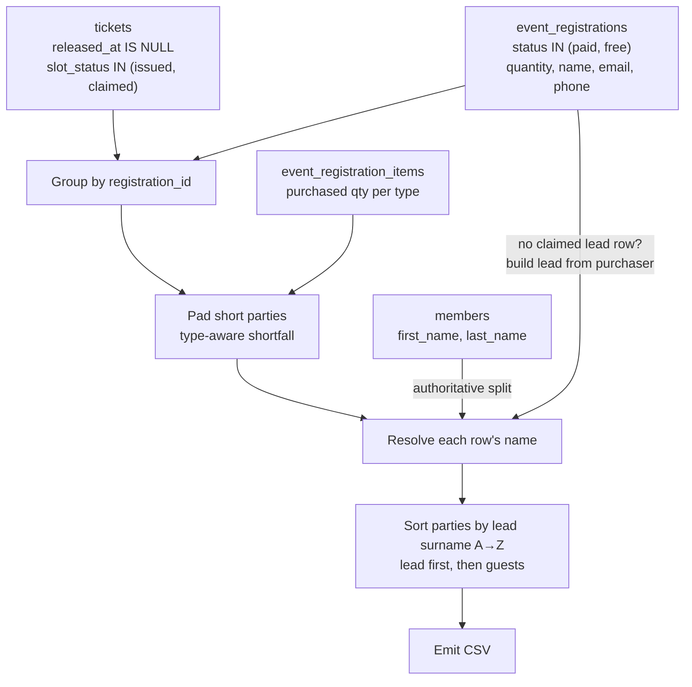

# feat: Attendee CSV export as a full hand-check ticket roster

## Goal Capsule

Turn the admin attendee CSV export from a *list of people who pre-registered* into a **complete backup roster of every ticket sold** — one line per ticket, parties ordered alphabetically by the lead's surname, with blank name fields where a guest was never named. The sheet is printed and used at the door to check people off by hand, so a ticket missing from the sheet is a person who cannot be admitted.

**Product Contract preservation:** No upstream brainstorm — requirements captured directly from the user in this session (`product_contract_source: ce-plan-bootstrap`).

---

## Problem Frame

The export at `app/api/admin/events/[id]/attendees/route.ts` only emits rows for **claimed** tickets — people who completed self-registration. Guests whose names were never submitted simply do not appear. Their existence is implied by two summary columns (`party_registered`, `party_remaining`), which is useless on paper: staff at the door cannot tick off a person who has no line.

The sheet also carries columns shaped for the *old* model (a party-level ticket breakdown on the lead's row) that become redundant once every ticket has its own line, and it is sorted by purchase time, which makes finding a party in a 245-line printout a linear scan.

### What the data actually supports

Verified against the production database (project `rmchkoktpzoojlglyfca`) on 2026-07-11, before planning:

Every purchased ticket **already exists as a row** in `tickets`. Tickets are pre-provisioned as `slot_status = 'issued'` (with their own `ticket_type_id` and QR credential) at purchase, and self-registration *flips* a row `issued → claimed`, filling in the name. On the current live event:

| slot_status | rows | have ticket_type | have name | are lead |
|---|---|---|---|---|
| `claimed` | 191 | 191 | 191 | 104 |
| `issued` | 54 | 54 | 0 | 0 |

191 + 54 = 245 = exactly the tickets sold across its 104 registrations. **The blank guest sublines are not something the export must invent — they are real rows the export is currently filtering out**, and they already carry the correct per-person ticket type for catering.

**The legacy gap, and why it is smaller than it looks.** Events predating this model have missing ticket rows — one past event has 577 tickets sold and *zero* ticket rows. But those registrations are not empty: all 259 of them carry a purchaser `name`, `email`, and `phone_e164` on `event_registrations`, and all 259 have their `event_registration_items` (the per-ticket-type purchase record). So a party with no ticket rows still has a real surname to file it under and a real per-type breakdown to label its padded lines with. The export never has to emit an anonymous, unfileable row (R7, R9, KTD2).

### `ticket_types` vs `ticket_type` — the naming confusion

These are two genuinely different things, and the answer explains why one is being deleted:

- **`ticket_type`** (singular) — *this one person's* ticket, e.g. `Asado Vegetarian`. Sourced from `tickets.ticket_type_id`. Per-row, and the column staff actually need next to a name.
- **`ticket_types`** (plural) — *the whole party's purchase breakdown*, e.g. `9 × Asado Standard, 1 × Asado Vegetarian`. Sourced from `event_registration_items`, printed **only on the lead's row** and blank on everyone else. It exists today purely as a workaround: because unregistered guests had no rows, the plural column was the only way to see what a party had bought.

Once every ticket gets its own line, the workaround has no reason to exist — each guest's type is visible on their own row. The plural **column** is dropped (KTD4). Note this is not the same as dropping the underlying `event_registration_items` query, which the padding logic still needs (KTD2).

---

## Requirements

| ID | Requirement |
|---|---|
| R1 | Every live ticket (`released_at IS NULL`, `slot_status` in `issued`/`claimed`) appears as exactly one row, whether or not it has been claimed. |
| R2 | Parties are ordered alphabetically by the **lead's last name** (A→Z). |
| R3 | Within a party, the lead's row comes first, followed by its guest rows. |
| R4 | A ticket with no name provided shows **empty** name and contact fields — never a placeholder, a `0`, or an `unknown`. |
| R5 | Column order is `booking_ref, last_name, first_name, ticket_type, email, phone, is_member, party_lead, tickets, waiver, arrived` — `ticket_type` sits immediately after `first_name`. |
| R6 | The columns `party_registered`, `party_remaining`, `arrived_at`, `ticket_types` and the leading `TOTALS` block are removed. |
| R7 | If a party has fewer live ticket rows than its purchased `quantity`, the shortfall is padded so the sheet always accounts for every ticket sold. Padded rows carry the party's `booking_ref`, lead attribution, and the ticket type implied by the purchase record. |
| R8 | The existing CSV-injection guard and fail-loud query error handling are preserved. No credential/QR token ever enters the sheet. |
| R9 | Every paid/free registration yields a lead row. When no claimed lead ticket row exists, the lead is built from the registration's own purchaser details, so no party is anonymous or unsortable. |

---

## Key Technical Decisions

**KTD1 — Filter to live tickets with an explicit allowlist, not a negation.**
Replace `.eq("slot_status", "claimed")` with `.in("slot_status", ["issued", "claimed"])`, keeping `.is("released_at", null)`. Do **not** simply drop the filter: the `tickets_slot_status_check` constraint (`supabase/migrations/20260622170000_rename_attendees_to_tickets.sql`) permits a third value, `unclaimed` — a legacy open-slot state deliberately retained. There are zero live `unclaimed` rows in production today, so this is latent rather than active, but on a document that governs door admission the filter must be allow-by-list: an unrecognized status should fall off the sheet, never onto it as an anonymous tickable line. This matches the existing repo pattern at `lib/events/door-access.ts` and `app/(checkin)/public/bookings/[token]/page.tsx`. Downstream, classify a row as unclaimed by `slot_status === "issued"`, not `!== "claimed"`.

`released_at IS NULL` remains mandatory: released tickets are re-minted as fresh `issued` rows, so including them would double-count.

**KTD2 — Pad short parties from the purchase record, with real ticket types.**
After grouping live rows by registration, emit `max(0, quantity − liveRowCount)` padded rows per party. Their `ticket_type` is **derived, not blank**: for each ticket type on the registration's `event_registration_items`, the padded count is `purchasedQtyOfType − liveRowsCarryingThatType`. This is arithmetic on the purchase record, not a guess, and it is what keeps KTD4 honest — if padded rows had a blank type, the per-column catering pivot that replaces the `TOTALS` block would silently undercount by exactly the number of padded tickets, and would report zero for every type on the 577-ticket legacy event. Consequently the `event_registration_items` query and its `ticketItemsByReg` map **stay**; only the party-level `ticket_types` column and `formatTicketBreakdown` go away.

A padded row is not a real ticket and must never be mistaken for one — model it as a distinct shape (a discriminated union, or a `synthetic: true` flag), not a fake `AttendeeRow` with an empty id.

**KTD3 — Sort by the lead's surname; every party has one.**
The party sort key is the lead's `last_name`. For a claimed lead ticket row: authoritative from `members` for member leads, heuristic `splitFullName` otherwise. For a party with no claimed lead row, R9's registration-sourced lead supplies it. Ties break on the lead's first name, then `booking_ref`, so the order is stable. Compare with `localeCompare` (case-insensitive) so accented surnames (`Ärnström`, `Öberg`) file sensibly for a Swiss club rather than by code point.

Because R9 gives every paid/free registration a lead, there is no "lead-less party" bucket. Keep one defensive tiebreak only: a party that somehow resolves to an empty surname sorts last by `booking_ref` rather than silently landing at the top under an empty string.

Live tickets with no `registration_id` (ops/bulk-imported via `RosterImport`; none in production today, but the import RPC can create them) belong to no party. Treat each as its own one-person party keyed on its own surname, so it files alphabetically among the leads rather than falling into the defensive sort-last bucket.

**KTD4 — Drop the `ticket_types` column and the `TOTALS` block.**
Both were compensating for the absence of per-ticket rows. With every ticket on its own line carrying its own `ticket_type` — padded rows included, per KTD2 — catering counts are a one-column pivot in Excel/Sheets, and the party breakdown is visible by reading the party's rows. Removing the `TOTALS` block also makes the header row line 1, so the file sorts and filters cleanly in a spreadsheet without skipping rows. *(User-confirmed; both were explicit choices.)*

**KTD5 — The shared libs stay; only the route changes.**
`lib/events/tickets.ts` (`rollupTicketItems`, `formatTicketBreakdown`) and `lib/events/roster-fill.ts` (`computePartyFills`) are still used by the admin roster UI (`components/admin/AttendeeList.tsx`). This work removes their *imports from the export route* only — do not delete the modules. (`rollupTicketItems` may still be useful inside the route for KTD2's per-type shortfall; keep the import if so.)

---

## High-Level Technical Design

Row assembly, after the change:



Resulting sheet — a party of 4 where only the lead and one guest pre-registered, plus a legacy party with no ticket rows at all:

```csv
booking_ref,last_name,first_name,ticket_type,email,phone,is_member,party_lead,tickets,waiver,arrived
EV-2201,Andersson,Lars,Asado Standard,lars@example.com,'+41791112233,yes,lead,4,signed,no
EV-2201,Bianchi,Giulia,Asado Vegetarian,giulia@example.com,'+41794445566,no,guest of Lars Andersson,,signed,no
EV-2201,,,Asado Standard,,,,guest of Lars Andersson,,,
EV-2201,,,Asado Standard,,,,guest of Lars Andersson,,,
EV-1104,Schmidt,Anna,Asado Standard,anna@example.com,'+41797778899,yes,lead,2,,
EV-1104,,,Asado Vegetarian,,,,guest of Anna Schmidt,,,
```

Rows 3–4 are real `issued` tickets — blank person, known ticket type. The `EV-1104` party is legacy with zero ticket rows: its lead row is reconstructed from the registration's purchaser details (R9), and both its lines get their ticket type from the purchase record (KTD2). Anna's `waiver` and `arrived` are blank because there is no ticket row to read a waiver or check-in from — the sheet does not claim she is unsigned, only that it does not know.

The leading `'` on the phone cells is the `csvEscape` formula-injection guard (R8), which quotes any cell starting with `+`.

---

## Implementation Units

### U1. Widen the roster query to every live ticket

**Goal:** Unregistered guests stop being filtered out of the export.
**Requirements:** R1, R4
**Dependencies:** none
**Files:** `app/api/admin/events/[id]/attendees/route.ts`

**Approach:** In the `tickets` query, replace `.eq("slot_status", "claimed")` with `.in("slot_status", ["issued", "claimed"])` (KTD1 — an allowlist, not a dropped filter), select `slot_status` alongside the existing columns, and keep `.is("released_at", null)`. Widen the `AttendeeRow` interface with `slot_status: string`.

Downstream, treat a row as unclaimed when `slot_status === "issued"` and emit blanks for its name, contact, and status cells (`last_name`, `first_name`, `email`, `phone`, `is_member`, `waiver`, `arrived`) rather than deriving `"no"` / `"unsigned"` from null columns — an unclaimed ticket has no person to make a claim about, and R4 asks for empty fields. `ticket_type`, `booking_ref`, and `party_lead` are still populated: all three are known for an `issued` row.

Keep `credential_token` out of the select (R8). It is a bearer token that mints `/api/qr/<token>` links; a printed sheet of credentials would admit anyone who photographs it.

The `leadNameByReg` map already gates on `is_lead && name`, so it is unaffected.

**Patterns to follow:** `.in("slot_status", [...])` as used in `lib/events/door-access.ts`. The existing `failLoad` fail-loud handler wraps every query; keep it on the widened query.

**Test scenarios:**
- A party with 1 claimed lead and 2 issued guests exports 3 rows, not 1.
- An issued row exports with blank `last_name`, `first_name`, `email`, `phone`, `is_member`, `waiver`, `arrived`, but a populated `ticket_type` and `booking_ref`.
- A ticket with `slot_status = 'unclaimed'` (legacy) is excluded from the sheet entirely.
- A released ticket (`released_at` set) is excluded even though its `slot_status` is `issued`.
- A claimed row still exports its name, email, phone, `is_member=yes`, and `waiver=signed` exactly as before.
- No column of the output contains a `credential_token` value.
- A query failure on the widened `tickets` select still returns 500 with `Could not load attendees for export`, not a partial sheet.

---

### U2. Reconstruct missing leads and pad short parties from the purchase record

**Goal:** Every purchased ticket has a line, and every party has a name to file it under — including legacy events with no ticket rows.
**Requirements:** R1, R7, R9
**Dependencies:** U1
**Files:** `app/api/admin/events/[id]/attendees/route.ts`

**Approach:** Extend the `event_registrations` select with `name, email, phone_e164, member_id` (the purchaser identity; verified non-null on all 259 registrations of the legacy event). Group live ticket rows by `registration_id`.

For each paid/free registration:
1. **Lead (R9).** If no claimed `is_lead` ticket row exists, synthesize the lead row from the registration's purchaser details — resolving first/last via `memberNameById` when `member_id` is set, else `splitFullName(name)`. This row carries `booking_ref`, `tickets` (the party's quantity), and `party_lead = "lead"`; its `waiver` and `arrived` are blank (no ticket row exists to source them from). It is what makes the party sortable (KTD3) and gives its guests something to be a `guest of`.
2. **Padding (R7).** Compute `shortfall = max(0, quantity − liveRowCount)`. Distribute the padded rows across ticket types by per-type shortfall from `event_registration_items`: `purchasedQtyOfType − liveRowsCarryingThatType`, largest types first, so the padded rows carry real ticket types (KTD2). If the per-type numbers do not account for the full shortfall (data drift), the remainder pads with a blank `ticket_type` rather than guessing.

Padded rows render blank name/contact/status cells with a populated `booking_ref`, `party_lead` (`guest of <lead>`, now always resolvable via step 1), and `ticket_type`. Model them as a distinct synthetic shape, not a fake `AttendeeRow` (KTD2).

Padding is per-registration. A registration whose live rows *exceed* quantity (over-claim drift) pads by zero and is never truncated.

**Execution note:** Consider a `console.warn` when padding fires on an event whose `start_date` is in the future — on a current-generation event, minting should have produced the rows, so padding there is a signal of a real data bug that the sheet would otherwise paper over.

**Test scenarios:**
- A party with `quantity = 4` and 2 live rows exports 4 rows; the 2 padded rows are blank apart from `booking_ref`, `party_lead`, and `ticket_type`.
- A padded row's `ticket_type` comes from the registration's per-type shortfall (a party that bought 3 × Standard + 1 × Vegetarian with only the Standard lead claimed pads 2 × Standard and 1 × Vegetarian, not 3 blanks).
- A registration with zero live ticket rows exports a lead row built from the registration's `name`/`email`/`phone_e164`, plus `quantity − 1` padded guest rows — no row is anonymous, and `party_lead` is never a dangling `guest of `.
- A registration whose `member_id` is set resolves its reconstructed lead's first/last from `members`, not from `splitFullName`.
- A reconstructed lead's `waiver` and `arrived` cells are blank, not `unsigned` / `no`.
- A party with `quantity = 3` and 3 live rows is padded by zero — no spurious blank line.
- A party whose live rows exceed quantity is not truncated and does not produce a negative pad.
- Row-count invariant: exported data rows == `Σ max(quantity, liveRowCount)` over paid/free registrations + the count of live tickets with a null `registration_id`.

---

### U3. Reshape columns and sort parties alphabetically by lead surname

**Goal:** The sheet is ordered and shaped for hand check-off at the door.
**Requirements:** R2, R3, R5, R6, R8
**Dependencies:** U1, U2
**Files:** `app/api/admin/events/[id]/attendees/route.ts`

**Approach:** Replace the `created_at`-anchored sort with a surname sort per KTD3: party sort key = the lead's resolved last name (claimed lead row, or U2's reconstructed lead), compared with `localeCompare` case-insensitively; tiebreak on lead first name, then `booking_ref`. A registration-less ticket forms its own one-person party keyed on its own surname and files among the leads. A party resolving to an empty surname sorts last by `booking_ref`.

Within a party: lead first, then **named guests sorted by their own surname**, then unclaimed and padded rows. Alphabetizing the named guests costs nothing and makes a lone guest easier to find inside a large party block (see Open Questions on the party-vs-person index).

Rewrite `headers` to the R5 order. Delete the `party_registered`, `party_remaining`, `arrived_at`, and `ticket_types` cells, the `totalsBlock` and its `totalTickets` derivation, and the now-unused `computePartyFills` and `formatTicketBreakdown` imports and the `partyFills` map. **Keep** the `event_registration_items` query, its `ItemRow` type, `registrationIds`, and the `ticketItemsByReg` map — U2's type-aware padding consumes them (KTD2), so this is not dead code.

**Patterns to follow:** keep `csvEscape` on every cell — the formula-injection guard (R8) is load-bearing because names come from unauthenticated public surfaces.

**Test scenarios:**
- Parties export in A→Z order of the lead's surname regardless of purchase order (assert `Andersson` before `Schmidt` when Schmidt registered first).
- A member lead sorts on the authoritative `members.last_name`, not the heuristic split of `name`.
- A party whose lead was reconstructed from the registration (U2) sorts alphabetically among the rest, not last.
- A registration-less ops ticket sorts by its own surname among the lead rows.
- Within a party, the lead row precedes its guests; named guests are alphabetical and precede blank rows.
- The header row is line 1 — no `TOTALS` block precedes it.
- The header is exactly `booking_ref,last_name,first_name,ticket_type,email,phone,is_member,party_lead,tickets,waiver,arrived`.
- A name beginning with `=` is still neutralized with a leading quote.
- An event with no registrations exports a well-formed header-only sheet.

---

### U4. Update the CSV route tests

**Goal:** The suite encodes the new contract and would fail if the old shape returned.
**Requirements:** R1–R9
**Dependencies:** U1, U2, U3
**Files:** `app/api/admin/events/[id]/attendees/route.test.ts`

**Approach:** The existing suite (369 lines, fake Supabase client) already covers auth, `format=csv`, formula injection, phone-only attendees, and the empty-event case — keep all of those. Beyond adjusting column-index assertions, three harness changes are required and are easy to miss:

1. The `sections()` helper locates the header by the blank line terminating the `TOTALS` block, which R6 deletes. Rewrite it to treat line 1 as the header and drop its `totals` return.
2. The fake client stubs `.is()` as a no-op (`c.is = () => c`), so U1's released-ticket scenario cannot pass or fail meaningfully. Make `.is(col, null)` record a filter that the `tickets` resolver applies.
3. The fake client must serve `issued` rows, registration-less tickets, and `event_registrations` rows carrying `name`/`email`/`phone_e164`/`member_id`, or U1/U2 are untestable.

Replace `groups parties by their lead's creation time regardless of input order` with a surname-ordering test. Add the row-count invariant from U2 as the strongest single regression guard for R1.

**Execution note:** Write the surname-ordering test and the issued-row test **before** the route changes — they are the two behaviours most likely to regress silently, and they should fail against the current implementation for the right reason.

**Test scenarios:** as enumerated in U1–U3.

---

## Scope Boundaries

**In scope:** the admin attendee CSV export route and its tests.

**Out of scope (not doing):**
- The admin roster UI (`components/admin/AttendeeList.tsx`) and the door console. They keep the `party_registered` / `remaining` fill bars — genuinely useful *on screen*, where a party expands on click. Only the printed sheet needs one-line-per-ticket.
- `lib/events/roster-fill.ts` and `lib/events/tickets.ts` — still used by the UI (KTD5).

### Deferred to Follow-Up Work
- **Backfilling ticket rows for legacy events.** U2 reconstructs the roster at export time; the underlying fix is the guest-QR backfill script (PR #66) run against the affected events. Worth doing, but not required for this sheet to be correct, and it touches production data — its own change.
- **The stale comment in `lib/events/roster-fill.ts`** ("Approach B pre-provisions no placeholder rows") now contradicts the `issued`-row model. A docs fix in a file this work does not otherwise touch.

---

## Resolved Decisions

These three were carried as open questions during planning and were settled by the owner on 2026-07-11. All three resolve to *no change* — the shipped shape is correct.

- **The sheet indexes parties, not people — and that is right.** The surname sort files each *party* under its lead, so a named guest is found under their lead's surname rather than their own. **Decision: keep it.** Guests know who invited them, so a lone arrival can name their lead and staff go straight to that block. A printed sheet cannot be ordered by party and by person at once, and R3's party blocks are what make the blank guest rows tickable. No second flat A–Z sheet is needed. (U3 still alphabetizes named guests within their party, which costs nothing.)
- **No audit log on the export.** The route knows the admin's identity and could log one line per export. **Decision: no.** Not warranted for the club's current posture; revisit if the roster is ever handled outside the committee.
- **Padded lines are not visually marked.** A padded row has no ticket row and therefore no QR credential, which sits against the "no QR, no bracelet" policy. **Decision: no marking.** The printed sheet is the backup precisely for the case where the scanner has no record — flagging those lines would undercut the reason the sheet exists.

---

## Risks

| Risk | Mitigation |
|---|---|
| A `slot_status` outside `issued`/`claimed` lands on the door sheet as an anonymous tickable line. The `tickets_slot_status_check` constraint permits a third value, `unclaimed` (a retained legacy open-slot state), so this is a live schema possibility, not a hypothetical. | KTD1's allowlist filter (`.in("slot_status", ["issued","claimed"])`) excludes unknown statuses by default. Zero live `unclaimed` rows exist in production today. |
| Padding masks a real data bug (missing ticket rows on a *current* event) by making the sheet look complete. | U2's `console.warn` when padding fires on a future-dated event; the `tickets` count on every lead row shows the expected party size; the follow-up backfill addresses the root cause. |
| `quantity` and the sum of `event_registration_items.quantity` drift apart, making padding fire on a correctly-minted party. | U2 pads from `quantity` and labels from the items, tolerating a mismatch by leaving the unaccounted remainder's `ticket_type` blank rather than guessing. Top-ups keep the two in sync today. |
| Sorting by a heuristically-split surname mis-files a non-member lead with a multi-word surname (`van der Berg` → `Berg`). | Pre-existing behaviour of `splitFullName`, unchanged here. Members — the majority of leads — use the authoritative split. |

---

## Verification Contract

- `npm run test:unit -- attendees` passes, including the new surname-ordering, issued-row, and reconstructed-lead tests. (Note: `npm test` runs Playwright, not vitest.)
- `npx tsc --noEmit` is clean — the removed imports leave no dangling references.
- Exporting the live event (245 tickets / 104 registrations) yields **245 data rows** plus one header row.
- The exported sheet opens in Excel with the header on row 1, sorts A→Z by `last_name` across the lead rows, and shows blank name cells with a populated `ticket_type` for the 54 unclaimed tickets.
- A pivot on `ticket_type` over the whole sheet reproduces the per-type totals the old `TOTALS` block printed.

## Definition of Done

Every ticket sold for an event appears exactly once on the exported sheet; parties are alphabetical by the lead's surname with their guests beneath them; un-named guests show empty name fields but a real ticket type; no party is anonymous; `ticket_type` sits after `first_name`; and `party_registered` / `party_remaining` / `arrived_at` / `ticket_types` / the `TOTALS` block are gone.

---

## Sources & Research

- `app/api/admin/events/[id]/attendees/route.ts` — the export being changed.
- `supabase/migrations/20260622190000_claim_ticket_flip_issued.sql` — establishes the `issued → claimed` flip; issued rows are pre-provisioned with `ticket_type_id` and a credential, and re-minted on release.
- `supabase/migrations/20260622170000_rename_attendees_to_tickets.sql` — `tickets_slot_status_check` permits `unclaimed`, `claimed`, `issued` (the basis for KTD1's allowlist).
- `lib/events/door-access.ts` — the existing `.in("slot_status", ["claimed","issued"])` pattern this plan follows.
- Production data checks (project `rmchkoktpzoojlglyfca`, 2026-07-11) — confirmed `claimed + issued = sum(quantity)` on the live event; confirmed zero live `unclaimed` rows; confirmed all 259 registrations of the 577-ticket legacy event carry a purchaser name and their `event_registration_items` (the basis for R9 and KTD2).
- `lib/events/roster-fill.ts`, `lib/events/tickets.ts` — shared helpers retained for the admin UI.
