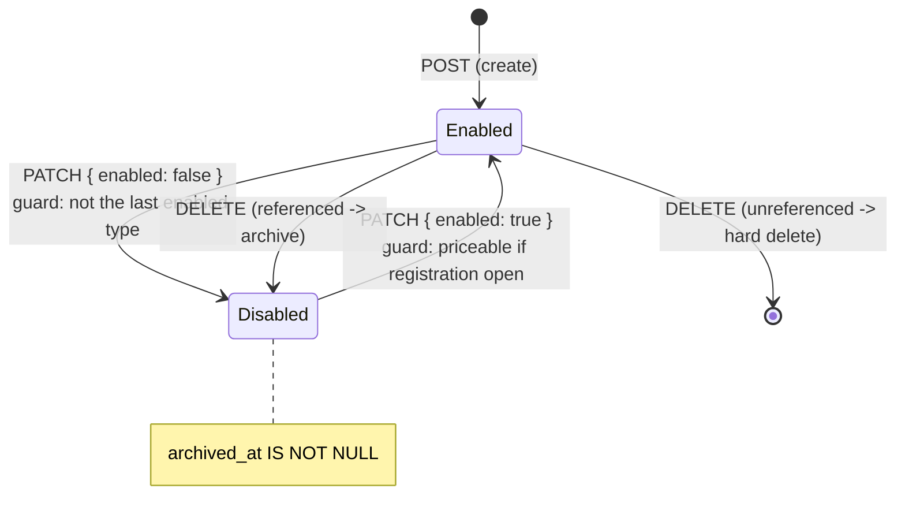
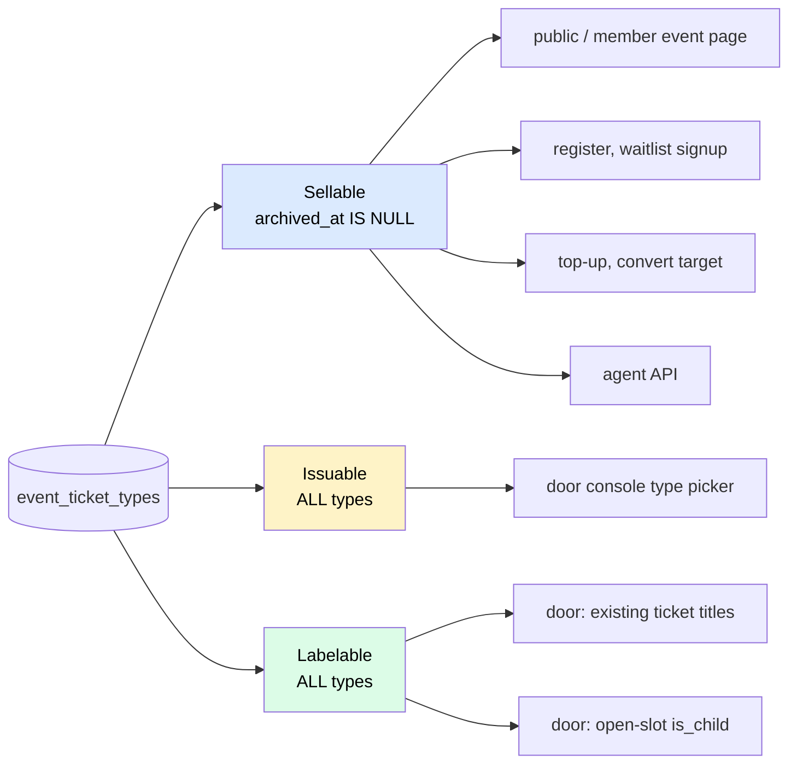

# feat: Enable/disable ticket types

## Summary

Give admins an explicit, reversible on/off switch per ticket type. A **disabled** type disappears from every self-serve sale surface (public and member event pages, registration, waitlist signup, buy-more, change-type targets) while remaining fully intact for everyone who already holds one — their tickets scan, check in, and display normally — and remaining issuable by staff at the door.

The switch reuses the `event_ticket_types.archived_at` column that already exists and already carries exactly these semantics. **No migration.**

Along the way this fixes a live bug that the feature would otherwise turn from rare into routine: the door console currently labels *existing* tickets from an *active-types-only* map, so archiving a type blanks the type name on every ticket already sold under it.

---

## Problem Frame

`event_ticket_types.archived_at` exists today and means "not sellable, kept for history". Thirteen read paths already filter on it. But it is only ever written as a **side-effect of DELETE** (`app/api/admin/events/[id]/ticket-types/[ticketTypeId]/route.ts:150-161`), when a type is referenced by a registration line item or a waitlist row — and **nothing can ever clear it**.

Two consequences:

1. **There is no way to stop selling a ticket type.** An admin who wants to close "Kids (U13)" for one event must delete it — which, if any have sold, silently archives it forever with no UI affordance to bring it back. `components/admin/EventManager.tsx:217` filters archived types out of the editor entirely, so a disabled type is invisible and unrecoverable through the product.
2. **Archiving corrupts the door console's display of already-sold tickets** (see Risks, R1). This is latent today because archiving is rare and accidental. Making disable a routine, deliberate action makes it a door-day failure.

## Requirements

| ID | Requirement |
|---|---|
| R1 | An admin can disable an active ticket type, and re-enable a disabled one, from the event editor. |
| R2 | A disabled type is offered on **no self-serve sale surface**: public/member event page, registration, waitlist signup, buy-more (top-up), change-type target. |
| R3 | Existing tickets of a disabled type are **completely unaffected** — they scan, check in, display their type name, and keep their child/waiver behavior. |
| R4 | Staff **can still issue** a disabled type at the door console (walk-ups, filling open slots). Disable closes self-serve sales, not the door. |
| R5 | An event must always retain at least one enabled type — disabling the last one is refused, matching the existing DELETE rule. |
| R6 | Re-enabling a type on an event with registration already open must not put an unpriced type on sale. |
| R7 | Editing any unrelated field of a ticket type (title, price, seat flag) must **never** flip its enabled state. |
| R8 | When disabling a type with waitlist entries, the admin is shown how many — informationally. The disable proceeds; those waitlisters still convert correctly. |

---

## Key Technical Decisions

### KTD-1 — Reuse `archived_at` as the disable flag; do not add a second column

`archived_at` already means precisely "not available for new self-serve sales, preserved for history," and every sale surface already filters on it. Disable = set it; enable = clear it. Zero new filter sites, zero migration.

The alternative — a separate `disabled_at` / `is_enabled` column — would introduce a **second availability axis that all ~13 read sites must check**. This codebase's own `docs/solutions/architecture-patterns/reusing-nullable-column-as-value-source-trap.md` records **three separate silent production bugs** (PRs #50, #58/#68) caused by exactly this: a new consumer ships a subset of the availability logic, and on a *display* path the failure is silent — HTTP 200, no log, the affordance simply vanishes. A second axis is a fourth invitation to that bug.

Accepted trade-off: "removed but still referenced" and "temporarily disabled" collapse into one state, so an admin can re-enable something they meant to remove for good. This is acceptable — both states are observably identical (hidden from sale, preserved for history) and differ only in intent.

**This is not the anti-pattern that learning doc warns about.** That doc warns against reusing a column that is *force-null for a category of rows* as a **value source**, where `Number(null) === 0` turns absence into a silent zero. `archived_at` is not a value source, is not force-null for any category, and its meaning is unchanged here. What widens is only *who writes it*. Note this distinction in review — a reviewer pattern-matching on "don't reuse a nullable column" will otherwise object.

### KTD-2 — Three distinct type lists, never one

The bug in R1 (Risks) and the requirement split between R2 and R4 both come from conflating three different questions. Name them and keep them apart:

| List | Question it answers | Filter |
|---|---|---|
| **Sellable** | What may a *customer* buy right now? | active only (`archived_at IS NULL`) |
| **Issuable** | What may *staff* create a ticket of? | **all types** (per R4) |
| **Labelable** | What does *this existing ticket* say it is? | **all types** — always |

Every existing sale-surface filter is already a correct **sellable** query and needs no change. The door console currently uses one active-only list for all three jobs; U4 splits it.

### KTD-3 — `enabled` is a presence-gated field on the existing PATCH route, held outside `normalizeTicketType`

`docs/solutions/architecture-patterns/single-writer-field-ownership-across-routes.md` documents a "Shape B" trap this feature walks straight into. `TicketTypesEditor` round-trips **every** ticket type through the same per-type PATCH endpoint, and `normalizeTicketType` **fills absent fields with defaults** (`lib/events/ticket-types.ts:60-74`). If `archived_at` were added to that normalized shape, an admin fixing a typo in a title would silently **re-enable every disabled type on the event** — the exact silent-data-loss signature that doc was written about (PR #35 wiped every guest price this way).

The structural fix, following that doc's own prescription:

- `enabled` is handled in the PATCH route with an explicit `"enabled" in body` presence gate, **outside** `normalizeTicketType`, which never sees `archived_at`.
- An omitted `enabled` is therefore a **no-op**, not a default — so `ticketTypeBody()` in `EventManager.tsx` simply does not send it, and cannot clobber it.
- The per-type route stays the single server writer of the column. The DELETE route's archive-on-remove branch is refactored to call the same helper.

This is safer than carry-through here: carry-through relies on the editor remembering to echo a value it doesn't own, whereas presence-gating makes forgetting it *the correct behavior*.

### KTD-4 — Enabling re-validates pricing; disabling re-validates the floor

`assertEventRegistrationPriceable` only runs when flipping `events.registration_enabled` on. Re-enabling an unpriced type on an event whose registration is *already* open would sneak a null-priced type onto a live sale surface, where the register route's null guard fires a loud `500 "Event pricing is misconfigured"` (`app/api/events/[id]/register/route.ts`). So **enable** must run the same per-type price check (U1 extracts it). **Disable** must refuse to remove the last enabled type, reusing the count check DELETE already performs.

---

## High-Level Technical Design

State model — one column, two transitions, and what each surface sees:

Surface behavior, by list (KTD-2):

The **Sellable** column is already correct at every site and is not touched. **Issuable** and **Labelable** are what U4 introduces — today the door console incorrectly answers all three questions with the Sellable list.

---

## Implementation Units

### U1. Extract the per-type price guard

**Goal:** Make the "does this type carry the prices its visibility requires" check callable for a single type, so enable (U2) and registration-open can share it.

**Requirements:** R6
**Dependencies:** none
**Files:**
- `lib/events/ticket-types.ts` (modify)
- `lib/events/ticket-types.test.ts` (modify)

**Approach:** Pull the per-type body of `assertEventRegistrationPriceable`'s loop (`lib/events/ticket-types.ts:113-126`) into an exported `assertTicketTypePriceable(type, visibility)` returning the same `{ ok } | { ok: false, error }` shape. Re-express `assertEventRegistrationPriceable` as: load active types → "at least one" check → map the new helper over them. Behavior and error strings must be **byte-identical** — this is a pure extraction.

**Patterns to follow:** the existing result-object convention in this file (`{ ok: true, value } | { ok: false, error }`), not thrown errors.

**Execution note:** Pure refactor. Land it green before U2 depends on it — no behavior change should be observable.

**Test scenarios:**
- A members-only type with `price_member` set and `price_non_member` null → `ok: true` (members-only events carry no non-member price).
- A public type with `price_member` set but `price_non_member` null → error naming the type: `"<title>" needs a non-member price before registration can open`.
- A type with `price_member` null (either visibility) → error: `"<title>" needs a member price before registration can open`.
- `price_member: 0` → `ok: true` (free is a valid price; must not be treated as absent).
- `assertEventRegistrationPriceable` on an event with zero active types → unchanged error `Add at least one ticket type before enabling registration`.
- `assertEventRegistrationPriceable` returns the **same error string** for a mispriced type as it did before the extraction (regression pin).

**Verification:** Existing `lib/events/ticket-types.test.ts` passes untouched; new per-type cases pass.

---

### U2. Presence-gated `enabled` on the per-type PATCH route

**Goal:** The single server writer that toggles `archived_at`, with both guards, and structurally incapable of being flipped by an unrelated edit.

**Requirements:** R1, R5, R6, R7
**Dependencies:** U1
**Files:**
- `app/api/admin/events/[id]/ticket-types/[ticketTypeId]/route.ts` (modify)
- `app/api/admin/events/[id]/ticket-types/[ticketTypeId]/route.test.ts` (modify)

**Approach:** In `PATCH`, handle `enabled` **before and separately from** `normalizeTicketType`, gated on `"enabled" in body` (the pattern prescribed in `single-writer-field-ownership-across-routes.md`). `normalizeTicketType` and its `NormalizedTicketType` shape are **not** touched — `archived_at` must never enter that object, or an omitted key becomes a default and R7 breaks.

- `enabled: false` → count the event's other types with `archived_at IS NULL`; if this is the last one, `400 "An event must keep at least one ticket type"` (reuse DELETE's message and count query at `route.ts:121-133`). Otherwise set `archived_at = now()`.
- `enabled: true` → load the event's `visibility` and `registration_enabled`. If registration is open, run `assertTicketTypePriceable` (U1) against the **merged** row; on failure return `400` with its error. Otherwise set `archived_at = null`.
- `enabled` absent → `archived_at` is not written at all.
- The two concerns compose: a body carrying both `enabled` and field edits applies both, in one update.

Extract the archive write into a small local helper and have DELETE's archive branch (`route.ts:150-161`) call it, so the column has one code path that sets it.

**Patterns to follow:** the existing event-scoped IDOR guard (`.eq("id", ticketTypeId).eq("event_id", eventId)`, 404 on mismatch) applies to every read and write here; the `assertAdmin` role list is unchanged.

**Execution note:** Write the R7 regression test **first** — it is the one this plan exists to prevent, and it fails silently rather than loudly.

**Test scenarios:**
- `PATCH { enabled: false }` on a type with an enabled sibling → 200, row's `archived_at` is non-null.
- `PATCH { enabled: true }` on a disabled type, event's registration closed, type unpriced → 200, `archived_at` is null (no price check when registration is closed).
- `PATCH { enabled: true }` on a disabled, unpriced type, event's `registration_enabled: true` → 400 naming the missing price; `archived_at` **stays non-null** (R6).
- `PATCH { enabled: true }` on a disabled, correctly-priced type, registration open → 200, `archived_at` null.
- `PATCH { enabled: false }` on the event's **only** enabled type → 400 `An event must keep at least one ticket type`; row unchanged (R5).
- **R7 regression pin:** `PATCH { title: "New name" }` (no `enabled` key) against a **disabled** type → 200, title updated, and `archived_at` **still non-null**. This is the Shape-B trap; it must be asserted on the stored row, not the response.
- Inverse pin: `PATCH { price_member: 50 }` against an **enabled** type → `archived_at` still null.
- `PATCH { enabled: false, title: "X" }` → both applied in one write.
- `PATCH { enabled: "yes" }` (non-boolean) → 400, row unchanged.
- IDOR: `PATCH { enabled: false }` with event A's path and event B's type id → 404, B's row unchanged.

**Verification:** All existing tests in this file still pass; disabling and re-enabling round-trips a type through the API with `archived_at` set and cleared.

---

### U3. `GET` ticket-types returns per-type usage counts

**Goal:** Give the admin editor the numbers it needs to show "3 people are waitlisted for this type" (R8) and to indicate a type is in use.

**Requirements:** R8
**Dependencies:** none
**Files:**
- `app/api/admin/events/[id]/ticket-types/route.ts` (modify)
- `app/api/admin/events/[id]/ticket-types/route.test.ts` (create)

**Approach:** Extend the existing `GET` (`route.ts:37-60`) to attach, per returned type, a `registration_count` (rows in `event_registration_items` for that `ticket_type_id`) and a `waitlist_count` (rows in `event_waitlist`). These are the same two reference counts DELETE already computes to decide archive-vs-hard-delete (`[ticketTypeId]/route.ts:139-148`) — one grouped query per table for the whole event, not a query per type.

`event_waitlist` has **no status lifecycle** — convert deletes the row outright (`app/api/admin/events/[id]/waitlist/convert/route.ts:183-190`) — so a row's existence *is* "pending". No status filter needed.

Response shape stays backward-compatible: existing consumers read `ticket_types[]` and ignore the new keys.

**Patterns to follow:** the route's existing admin gate and its `archived_at`-then-`sort_order` ordering (which already surfaces archived types last — keep it, U5 relies on it).

**Test scenarios:**
- A type with 2 registration line items and 3 waitlist rows → `registration_count: 2`, `waitlist_count: 3`.
- A type with no references → both counts `0`, not `null` or absent.
- A **disabled** type is still returned by GET (it already is) and carries its counts.
- Counts are scoped per type — two types on one event do not share a count.
- Counts do not leak across events: a type on event B does not contribute to event A's numbers.

**Verification:** GET returns every type (enabled and disabled) with accurate counts for both tables.

---

### U4. Door console: split labeling from availability (bug fix)

**Goal:** Fix the live bug, and implement R4. A disabled type must still label existing tickets correctly *and* still be issuable at the door.

**Requirements:** R3, R4
**Dependencies:** none (independent of U1–U3; can land first)
**Files:**
- `lib/events/door-access.ts` (modify)
- `components/door/DoorConsole.tsx` (modify — type picker source)
- `lib/events/door-access.test.ts` (create or extend)

**Approach:** `lib/events/door-access.ts:107-117` builds `ticketTitleById` / `ticketIsChildById` / `ticketSortById` from an **active-only** query, then uses those maps to label **already-sold tickets** (lines 136-137, 142, 172-173). Archive a type and every existing ticket of it renders with a blank type name, and open child slots lose `is_child`.

Per KTD-2, build the labeling maps from **all** of the event's types (drop `.is("archived_at", null)`), and derive the door's **issuable** picker list from the same full set (R4 — the door may issue disabled types). Keep any *sellable* read elsewhere in the file, if present, filtered.

Also harden the open-slot projection at line 173: it reads `is_child` **only** from the type map, with no row-level fallback — unlike `toSlot` at lines 141-142, which correctly ORs with the ticket row's own `is_child` column. Give the open-slot path the same `(a.is_child ?? false) || (type map)` fallback so a child slot cannot lose its child status through any map miss.

The door's `save-attendee` route already accepts any type id belonging to the event and never checks `archived_at` (`app/api/public/door/[id]/save-attendee/route.ts:102-141`) — so R4 needs **no server change**, only the picker's source list. Verify this rather than assuming it.

**Patterns to follow:** the existing "the row flag is a point-in-time copy that can go stale" comment at `door-access.ts:139-141` — that is exactly the reasoning being extended to open slots.

**Execution note:** This is a bug fix in weakly-covered code. Write a characterization test that pins **today's** door output for an event with an archived type first — it will show the blank title — then flip it to the expected title. That makes the fix visible as a diff in test expectations rather than a silent behavior change.

**Test scenarios:**
- **Regression pin (the bug):** an event with a type that has `archived_at` set and one already-sold, claimed ticket of that type → the door party's filled slot has `ticketTypeTitle` equal to the type's **title**, not `""`.
- Same, for an **open (issued)** slot of an archived type → `ticketTypeTitle` is the real title, not `""`.
- An **open child slot** of an archived child type (`is_child: true` on the type) → the slot's `isChild` is `true`. (Today the map miss makes this `false`, so the door would demand contact details and a waiver for a child.)
- An open slot of an archived type whose ticket **row** carries `is_child: true` but whose type row does not → `isChild` is still `true` via the row fallback.
- Sort order: an archived type's tickets sort by that type's real `sort_order`, not the `?? 0` fallback (so open slots don't all collapse to the front).
- R4: the door's issuable type list **includes** a disabled type.
- R3: a checked-in ticket of a disabled type still reports `checkedIn: true` and its arrival time — disable touches nothing on the ticket.
- An event with **no** archived types produces byte-identical door output to before the change (no regression on the common path).

**Verification:** Open the door console for an event with a disabled, previously-sold type: every ticket shows its type name, kids are still recognized as kids, and the type is offered in the picker.

---

### U5. Admin editor: show disabled types with an enable/disable toggle

**Goal:** The actual affordance. Disabled types become visible and reversible in the event editor.

**Requirements:** R1, R7, R8
**Dependencies:** U2, U3
**Files:**
- `components/admin/TicketTypesEditor.tsx` (modify)
- `components/admin/EventManager.tsx` (modify)
- `components/admin/TicketTypesEditor.test.tsx` (create)

**Approach:**

`EventManager.tsx:217` currently drops archived types on load (`const active = ticket_types.filter((t) => !t.archived_at)`). Stop filtering: load **all** types into editor state, carrying `enabled` (derived as `!t.archived_at`) plus the `waitlist_count` / `registration_count` from U3 onto `TicketTypeDraft`. The GET already orders archived types last, so disabled rows naturally sink to the bottom.

`TicketTypesEditor` renders a disabled row visually de-emphasized (muted background, price inputs still editable so a type can be re-priced *before* being re-enabled) with an Enabled/Disabled control. Below a disabled-pending row with waitlist entries, show the R8 note: *"N people are waitlisted for this type. They can still be converted normally."*

**The toggle does not go through the diff-sync.** It fires its own `PATCH { enabled }` to the per-type route immediately, and reflects the server's answer — because both guards (last-enabled-type, priceable-on-enable) are server-side and their errors must surface. Optimistically flipping a local flag and folding it into the bulk save would hide a rejected enable behind a generic save error.

**Critically (R7 / KTD-3):** `ticketTypeBody()` in `EventManager.tsx` **must not** gain an `enabled` or `archived_at` key. The presence gate in U2 means omitting it is the correct, safe behavior — an unrelated title edit leaves the flag untouched. Leave a comment there saying so, next to the existing `invite_price` carry-through comment which guards the same class of bug.

Two further consequences to handle:
- The editor's `validateTicketTypes()` (`EventManager.tsx:246-268`) requires a member price on **every** row when registration is enabled. It must now skip **disabled** rows — a disabled type is allowed to be unpriced (U2's enable guard is what stops an unpriced one going live). Without this, loading an event with an unpriced disabled type would block every save.
- `remove()` and the diff-sync's deletion loop still key off row identity; a disabled row must remain removable (DELETE hard-deletes it if unreferenced), and the "keep >= 1" UI guard should count **enabled** rows, not all rows.

**Patterns to follow:** the `invite_price` carry-through convention in `ticketTypeBody` (`EventManager.tsx`) — a field the editor loads and echoes but does not own. `enabled` is the stricter sibling: loaded, displayed, but **never** echoed.

**Test scenarios:**
- An event with one enabled and one disabled type loads **both** into the editor; the disabled one renders as disabled and sorts last.
- Toggling a disabled type on fires `PATCH { enabled: true }` with **no other fields** in the body.
- The server rejecting an enable (unpriced type, registration open) surfaces its error message in the editor and leaves the row disabled.
- The server rejecting a disable (last enabled type) surfaces `An event must keep at least one ticket type` and leaves the row enabled.
- A disabled type with `waitlist_count: 3` renders the waitlist note; one with `waitlist_count: 0` renders no note.
- **R7 pin:** editing only the title of an event that has a disabled type, then saving, sends a `ticketTypeBody` that contains **no** `enabled` / `archived_at` key — assert on the request body.
- `validateTicketTypes` passes when a **disabled** row has no member price and registration is enabled (it must not block the save).
- `validateTicketTypes` still fails when an **enabled** row has no member price and registration is enabled.
- The "keep at least one" UI guard counts enabled rows: an event with 1 enabled + 2 disabled types does not let the enabled one be removed.

**Verification:** In the admin event editor, disable a sold ticket type, save an unrelated title change, reload — the type is still disabled, still listed, and re-enabling it brings it back onto the public event page.

---

### U6. End-to-end regression pins for the two silent failure modes

**Goal:** Both bugs this plan guards against fail **silently** (HTTP 200, no log). The repo has shipped this exact class of bug three times. Pin them where they'd actually surface.

**Requirements:** R2, R3, R7
**Dependencies:** U2, U4, U5
**Files:**
- `e2e/event-ticket-type-disable.spec.ts` (create)

**Approach:** Two flows against a seeded event with two types, where one has already sold tickets:

1. **Sale surfaces honor the disable (R2).** Disable a type; assert it is gone from the public event page, the member event page, and the booking page's buy-more and change-type option lists.
2. **The disable survives an unrelated edit (R7).** Disable a type, then edit the event's title through the editor drawer, then reload the editor — the type is still disabled.

**Heed the false-negative trap.** `docs/solutions/architecture-patterns/reusing-nullable-column-as-value-source-trap.md` records that `BuyMorePanel` is **collapsed by default**, so its type list never appears in the initial server-rendered HTML even when working — grepping the DOM returns nothing in both the broken and the fixed state. Expand the panel in the browser (or assert on the RSC flight payload), never on raw initial markup.

**Patterns to follow:** existing specs in `e2e/`; the pricing-matrix e2e coverage added in PR #33 is the closest analogue.

**Test scenarios:**
- Disabled type is absent from the public event page's type list; the enabled one is present.
- Disabled type is absent from the buy-more panel **after expanding it**, and absent from the change-type target list.
- A lead holding a ticket of the disabled type still sees it, named and with its QR, on their booking page (R3).
- Disable → edit event title → reload editor: the type is still disabled (R7).
- Re-enable → the type reappears on the public event page.

**Verification:** Suite green against a locally seeded event with a sold, then disabled, ticket type.

---

## Scope Boundaries

**In scope:** a reversible per-type enabled/disabled flag; its admin affordance; its two server guards; the door-console labeling fix that this feature makes urgent.

**Not in scope:**
- Per-type inventory caps or a "sold out" state. A per-type claim cap already exists (`supabase/migrations/20260604170000_claim_per_type_cap.sql`); an automatic sold-out flip is a different feature.
- Time-windowed sales (early-bird open/close dates).
- Any change to pricing, rate-class resolution, or the register/top-up/convert charge paths.
- Any change to the 13 existing **sellable** filters — they are already correct under KTD-1 and are deliberately untouched.

### Deferred to Follow-Up Work

- **Extract a shared `sellableTicketTypes(eventId)` query helper.** `reusing-nullable-column-as-value-source-trap.md` prescribes exactly this ("stop writing the branch") after the same omission shipped three times. Thirteen sites currently hand-roll `.is("archived_at", null)`. They are all correct *today*, so touching them is not required for this feature and would balloon the review surface — but a fourteenth consumer can still ship without the filter. Worth a dedicated PR.
- **Extract the shared `unitPriceFor(ticketType, { isMember })` resolver.** Named as the durable fix in that same doc; six sites still re-derive it. Out of scope here, still outstanding.

---

## Risks & Dependencies

| ID | Risk | Mitigation |
|---|---|---|
| R1 | **The door-console labeling bug.** Disabling a type blanks the type name on every already-sold ticket at the door, and strips `is_child` from open child slots — so the door demands contact details and a waiver for a kid. Live today; this feature makes it routine. | U4 fixes it, with regression pins. Sequence U4 early — it is independent of U1–U3 and can land first. |
| R2 | **Shape-B silent re-enable (R7).** If `archived_at` reaches `normalizeTicketType`'s default-filling shape, an unrelated title edit silently re-enables every disabled type — the exact bug that wiped every guest price in PR #35. Fails with no error. | KTD-3's presence gate makes omission *correct* rather than *dangerous*. Pinned by tests in both U2 (server) and U5 (request body). |
| R3 | **Unpriced type re-enabled onto a live event (R6).** Puts a null-priced type on sale; register 500s with "Event pricing is misconfigured". | U2's enable guard, via U1's extracted per-type check. |
| R4 | **A reviewer objects to reusing `archived_at`** on a surface reading of the "don't reuse a nullable column" learning. | KTD-1 states the distinction explicitly (that doc is about a force-null column used as a *value source* under `Number()` coercion; this is neither). |
| R5 | **No schema change, so no type regen** — deliberately. Were one needed, `types/database.ts` carries hand-written `MemberStatus` / `PaymentCaptureStatus` aliases that the Supabase generator drops and that must be re-appended. | KTD-1 needs no migration. If the implementer reaches for one, stop and re-read KTD-1. |

**Dependencies:** none external. No migration, no Stripe/Postmark surface, no new env vars.

---

## Open Questions

*(Deferred to implementation — none block the plan.)*

- Does `DoorConsole.tsx` source its type picker from `door-access.ts`'s returned list, or fetch types itself? U4 assumes the former; confirm when opening the file and adjust the touch list if not.
- Whether the disabled-row visual treatment wants a distinct control (switch) or reuses the existing button idiom in `TicketTypesEditor`. A styling call, made at implementation time against the live UI.

---

## Sources & Research

- `docs/solutions/architecture-patterns/single-writer-field-ownership-across-routes.md` — the Shape-B trap behind KTD-3 and R2; prescribes the `"x" in body` presence gate used in U2.
- `docs/solutions/architecture-patterns/reusing-nullable-column-as-value-source-trap.md` — three recorded silent bugs from adding an availability/pricing axis and missing a read site; the argument for KTD-1, the source of U6's collapsed-panel false-negative warning, and the origin of both deferred follow-ups.
- `supabase/migrations/20260526130000_event_ticket_types.sql` — introduces `archived_at` and the archive-not-delete rule (`event_registration_items.ticket_type_id` is `ON DELETE RESTRICT`; `event_waitlist.ticket_type_id` is `SET NULL`).
- `supabase/migrations/20260519122050_event_seat_cap_and_waitlist.sql` — confirms `event_waitlist` has **no status lifecycle**, so row existence *is* "pending" (U3).
- `app/api/admin/events/[id]/waitlist/convert/route.ts:103-118` — convert already honors an archived stored type ("even if archived — honor the waitlister's intent"), which is why R8 informs rather than blocks.

## Definition of Done

- An admin can disable and re-enable a ticket type from the event editor, and both server guards surface their errors in the UI.
- A disabled type appears on no self-serve sale surface, and existing holders of it are entirely unaffected — including at the door, where its name still renders and its kids are still kids.
- Editing an unrelated field of a ticket type provably does not flip its enabled state, pinned by a test asserting on the stored row and one asserting on the request body.
- `npm run lint`, `npm run typecheck`, the unit suite, and `e2e/event-ticket-type-disable.spec.ts` are green.
