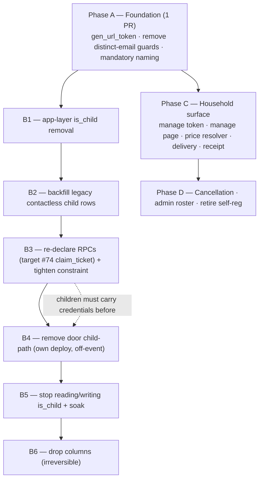
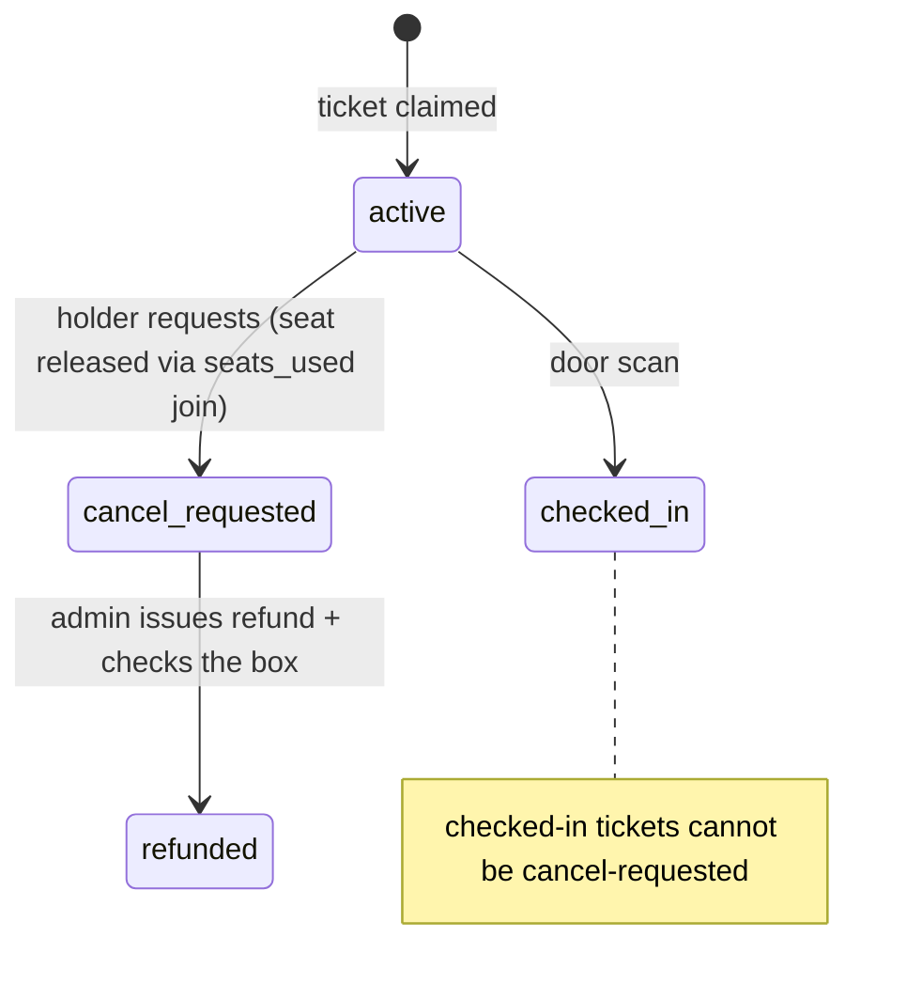

# Mandatory Ticket Naming and Guest Self-Service - Plan

## Goal Capsule

- **Objective:** Make every ticket arrive named and reachable at purchase, give the person holding a ticket a link that manages it (and its household siblings), and lean out the architecture by retiring three flows — forwarding, self-registration, and the child-exception path.
- **Product authority:** Project owner (Frank Sykes). Product Contract confirmed; planning decisions confirmed through dialogue on 2026-07-21.
- **Base commit:** Re-grounded against `origin/main @ 096f65a` on 2026-07-21. The original research was 6 commits stale; PRs #70–#74 landed inside this plan's scope and are reconciled below. Execute against a worktree branched from current `main`, not the stale `symbionis/allow-ticket-upgrade-after` worktree.
- **Product Contract preservation:** changed KD4, KD6, R18, R19 (control layer retired, token moved to per-ticket grain — per dialogue). All other requirements unchanged.
- **Already shipped since drafting:** the ticket-collapse bug is fixed (#74, identity-dedupe on name+contact) and `apply_pending_roster` is already atomic. The original KTD1 is obsolete; U2 shrinks accordingly.
- **Stop conditions:** Surface a blocker rather than guess if (a) minted tickets lack a `credential_token` for any category before U6 ships, or (b) the seat-release mechanism (U14) would change counts for non-cancelled bookings.
- **Execution profile:** Deep, ~16 units across four deploy-ordered phases. Dev and prod share one Supabase database, so phase ordering is a correctness property.
- **Tail ownership:** Each phase is its own PR; Phase B is sequenced across more than one deploy.

---

## Product Contract

### Summary

Naming becomes mandatory at checkout for every ticket — name and email, no child exception — so an event roster can never be shorter than the number of tickets sold. Each ticket carries its own rotatable manage token; the link delivers the guest their QR and lets whoever holds it upgrade, correct, or cancel that ticket and its same-email household siblings. Tickets sharing an address are delivered as one grouped email; the buyer gets a receipt. `is_child` is retired entirely, and the self-registration and forwarding flows are removed.

### Problem Frame

Before nominative checkout shipped, a buyer could purchase any number of tickets without naming anyone, and naming was expected to happen afterwards. It often did not. The nominative-checkout work made naming *possible* but left it **optional** — un-named tickets stay `issued` and fall back to the self-registration link — so the failure mode survives in reduced form.

What the org team saw was not a list of blanks. The on-screen admin roster (`AttendeeList`) reads `tickets` filtered to `slot_status = 'claimed'`, so unnamed tickets do not render — the roster came up shorter than tickets sold, with no indication of who was missing. (The printable/CSV door roster added in #71/#72 *does* show every ticket sold, but the interactive roster does not.) Reconciling meant chasing buyers with no reliable way to tell which still owed names.

Guests were confused because the work sat with the wrong person. A guest who received a ticket had no route to act: the guest QR email carries no link, and upgrading or editing is authorised only by the buyer's registration token. Every correction routed back through the buyer.

### Key Decisions

- **KD1. Mandatory naming, not better chasing.** Naming is currently optional; making it a precondition of purchase removes the reconciliation gap outright.

- **KD2. Shared addresses are allowed without limit, with the consequence disclosed.** Requiring distinct addresses blocks genuine households and pushes bookers to invent addresses — worse than a blank, since a fabricated address looks complete while breaking QR delivery. The trade is that reachability is not guaranteed per guest; the booker is told at the point of choosing.

- **KD3. `is_child` is retired entirely.** Its only function is the exception this work deletes — name-only, no contact, no waiver, a separate door path, and (since #73) a mononym exemption in `lib/names.ts`. Ticket types already carry name and member/non-member price. `tickets.is_child` is pure denormalization; every reader already prefers the ticket-type flag.

- **KD4. No control layer — whoever holds a ticket's link may change it.** Control existed only to protect forwarding; forwarding is retired, so control protects nothing. No permission model; the buyer keeps a page as payer, each guest gets one as holder.

- **KD5. Seat release is decoupled from refund.** A guest who requests cancellation is not attending regardless of the money, so the seat returns to capacity at request. Whether a refund issues stays a manual decision.

- **KD6. The manage token is per-ticket; the household view is a query, not a grain.** Each ticket carries its own manage token. The manage page, handed any one token, resolves the same-email siblings within that booking and lets the holder act on all of them.

- **KD7. Waivers apply to every ticket, with no type-level exemption.** A minor's waiver is accepted by the guardian completing checkout.

### Actors

- A1. Buyer — purchases the party, pays, holds the registration and its manage page, can add tickets.
- A2. Ticket holder — anyone whose address received tickets, including the buyer. Manages the tickets delivered to that address.
- A3. Org admin — reads the roster, decides refunds, marks them done.
- A4. Door staff — scans QRs at entry. Every ticket now arrives named and carries a credential.

### Requirements

**Checkout and naming**

- R1. Every ticket requires a name and an email before checkout can complete. No path may create an unnamed ticket. (Currently optional — this is the change.)
- R2. One email address may be used on any number of tickets within a booking. The distinct-email guard is removed.
- R3. Checkout offers an affordance to reuse an address already entered, so a booker never retypes it.
- R4. When one address is assigned to more than one ticket, checkout states before submission that those QRs arrive at that address and need forwarding.
- R5. Mandatory naming applies identically to free and paid events.

**Child tickets**

- R6. `is_child` is retired as a behavioural concept across the system; no code path branches on it.
- R7. The "Children's ticket" option is removed from the ticket-type editor, leaving name, prices, and capacity.
- R8. Tickets on former child types carry a full name, email, QR, and waiver on the same terms as every other ticket, including the `isFullName` first-and-last rule.
- R9. The rule forbidding conversion between child and adult ticket types is removed.

**Delivery**

- R10. Tickets sharing an email address within one booking are delivered as a single email listing every ticket at that address, each with its own name and its own QR.
- R11. That email carries one manage link that reaches all tickets at that address.
- R12. The buyer's confirmation email serves as a receipt: ticket types purchased, unit prices, total paid, and the booking reference.
- R13. All five email templates are reviewed in one pass.

**Ticket self-service**

- R14. The manage link lets its holder view every ticket at that address with its QR.
- R15. The holder may upgrade any single ticket to a higher-priced type, paying the difference through the existing Stripe conversion flow.
- R16. The holder may correct the name and email on any ticket at that address.
- R17. The page shows event details and offers an add-to-calendar action.
- R18. Grouping imposes no restriction on changing a ticket; buyer and holder may both act on the same ticket.
- R19. Each ticket carries its own manage token, rotatable; rotating revokes the old link for the whole same-email household.

**Cancellation**

- R20. A ticket holder may request cancellation of any ticket at their address from their page.
- R21. A cancellation request immediately returns that seat to event capacity.
- R22. A requested cancellation is final from the holder's side; the page states this before submission.
- R23. Each ticket carries a cancellation status moving from requested to refunded, marked manually by an admin.
- R24. The admin cancellation view links out to the corresponding Stripe transaction.

**Admin roster**

- R25. The on-screen roster shows every ticket sold for an event, so its length matches tickets sold. (The print/CSV door roster already does; the interactive roster does not.)
- R26. Tickets sharing an address are visually grouped or collapsible in the roster.

**Retired surfaces**

- R27. Self-registration is retired — its token, route, page, and confirmation-email link. `claim_ticket` survives for the door's walk-up naming path.
- R28. The ticket-forward email template is retired.

**Waivers**

- R29. Every ticket carries waiver acceptance, recorded against whoever completes checkout. No ticket type is exempt.

### Acceptance Examples

- AE1. Shared address across a household
  - **Covers R2, R10, R11.**
  - **Given** a booking of three differently-named tickets all entered with the same address,
  - **When** the registration completes,
  - **Then** one email arrives at that address listing three named tickets with three QRs and a single manage link, and all three tickets are `claimed`.

- AE2. Reused address across unrelated guests
  - **Covers R4.**
  - **Given** a buyer assigns their own address to six tickets,
  - **When** they reach submission,
  - **Then** checkout has stated all six QRs come to them and need forwarding, and the booking completes.

- AE3. Former child ticket
  - **Covers R6, R8.**
  - **Given** a ticket type previously flagged as a children's ticket,
  - **When** a buyer selects one at checkout,
  - **Then** it requires a full first-and-last name and a valid email like any other ticket, and its holder receives a QR.

- AE4. Upgrade on a grouped ticket
  - **Covers R9, R15.**
  - **Given** a ticket delivered as part of a household group,
  - **When** its holder chooses a higher-priced type,
  - **Then** the upgrade completes on payment of the resolver-priced difference.

- AE5. Cancellation before refund
  - **Covers R21, R23.**
  - **Given** a holder requests cancellation,
  - **When** submitted,
  - **Then** the seat is available to other bookers immediately and the ticket shows as requested with no refund yet.

- AE6. Free event
  - **Covers R5.**
  - **Given** an event with no ticket price, **when** a buyer registers a party, **then** every ticket still requires a name and email before completion.

- AE7. Booker double-registration still blocked
  - **Covers R2 boundary, KTD7.**
  - **Given** a buyer already holds a paid/free registration for an event, **when** they attempt a second with the same booker email, **then** it is still rejected — the registration-level guard is not the distinct-email guard being removed.

### Scope Boundaries

**In scope:** mandatory naming at checkout; removal of the distinct-email guard and resolution of the same-name-same-email edge; full retirement of `is_child`; per-ticket rotatable manage token; grouped household delivery and a receipt-grade buyer confirmation; self-serve upgrade, correction, event details, and cancellation request; immediate seat release; manual cancellation status with a Stripe link; a review pass over all email templates; the on-screen roster showing all tickets sold and grouped by address; retirement of the self-registration surface; extraction of a shared price resolver and a shared SQL URL-token generator.

**Deferred for later:**

- A guest page spanning multiple bookings or events.
- Phone number capture on tickets.
- Automated Stripe refunds from the admin view.
- Anti-sharing hardening of QR credentials.
- Refreshing `docs/solutions/database-issues/claim-ticket-contact-replay-guard-swallows-people-sharing-an-email.md` and `...pending-roster-non-atomic-fill-clear...md`, whose worked examples this change touches.

**Outside this work:** pricing/rate/invite/capacity rules beyond release-on-cancel; door check-in and credential rendering, except removal of the dead child path; making the door `released_at` action free event capacity (the same `seats_used` blind spot as cancellation, deliberately left unchanged so door behaviour doesn't shift silently — a candidate follow-up once cancellation ships).

### Outstanding Questions

Two forks the re-grounding surfaced are recorded under Open Questions in the Planning Contract (the same-name-same-email dedupe resolution, and the seat-release mechanism). Neither blocks planning; both have a recommended default.

### Sources / Research

- `supabase/migrations/20260711140000_claim_ticket_identity_dedupe.sql` (#74) — the collapse fix already shipped (name+contact keying); its solution doc `docs/solutions/database-issues/claim-ticket-contact-replay-guard-swallows-people-sharing-an-email.md`.
- `supabase/migrations/20260708130000_apply_pending_roster.sql:36-66` — the already-atomic fill+clear.
- `lib/names.ts` (#73) — `isFullName`/`joinName`/`splitName`, the shared name rule wired into register + both forms.
- `app/api/events/[id]/register/route.ts:207-237` — the distinct-email guard; `:225` the adult email/child exemption; `:290-299,333-335` the booker guard.
- `lib/events/door-roster.ts` (#71/#72) — the all-tickets-sold, email-carrying party assembly; the natural extension point for household email-grouping.
- `components/admin/AttendeeList.tsx` — the on-screen roster (still claimed-only, registration-grouped).
- `supabase/migrations/20260526132000_seats_used_line_items.sql:15-72` — seat math from line-items, ignoring the tickets table and `released_at`.
- `app/api/public/bookings/[token]/convert/route.ts:89-90`, `topup/route.ts:86`, `register/route.ts:267` — the duplicated member/non-member/invite-fallback pricing expression.
- `docs/solutions/architecture-patterns/live-table-rename-on-shared-prod-db.md` — the gated-deploy playbook for the `is_child` retirement.
- `docs/plans/2026-07-08-002-feat-nominative-checkout-tickets-plan.md` — the optional-naming step this work makes mandatory.

---

## Planning Contract

### Key Technical Decisions

- **KTD1. The collapse is already fixed; the only remaining checkout work is removing the two distinct-email guards.** #74 re-keyed `claim_ticket`'s replay guard on normalized **name + contact** (`20260711140000:95-108`), and `apply_pending_roster` is already atomic (`20260708130000:36-66`). So the plan's original "delete the guard, re-key on ticket id, make the roster atomic" is obsolete. What remains: remove the server guard (`register/route.ts:207-237`) and the client guard (`EventRegistrationForm.tsx:150,171-174`). Because #74 keys on name+contact and households have **individual names** (a family is Anna/Ben/Clara, not three identical names), a shared email with distinct names gives each person their own slot — guard removal alone is sufficient. The theoretical same-name-same-email collapse is an **accepted non-goal**: it is not expected in practice, and if it ever occurs it is #74's own bounded, cap-checked, recoverable trade. No slot-assignment machinery is added.

- **KTD2. Retire `is_child` in a deploy-ordered sequence on the shared DB.** The live surface is **45 files** (`git grep -l is_child origin/main` scoped to source/SQL/types; 51 total), up from the stale 42 — nothing retired, three added: `20260711120000_comp_guest_list.sql` (comp-list writes it), `20260711140000_claim_ticket_identity_dedupe.sql` (the current `claim_ticket`), and the #70 door rebuild `lib/events/door-access.ts:251-252,318-319`. The flag is on both `event_ticket_types` and `tickets` and in RPC signatures (so `DROP`/`CREATE`). Sequence: app-layer behaviour removal → backfill legacy contactless child rows → re-declare RPCs (**target `20260711140000`, not an older `claim_ticket`**) + tighten `tickets_contact_present` (`20260622170000:45-52`, `is_child` disjunct at `:51`) → remove the door child-path (its own off-event deploy) → stop reading/writing → drop columns. The tightened constraint is **not** additive; backfill first.

- **KTD3. A per-ticket manage token, generated at mint, household view resolved on the page.** Confirmed net-new: no per-ticket manage token exists (only per-registration `manage_token`, surfaced on lead rows). Add `manage_token` to `tickets`, mint alongside `credential_token`, and resolve same-email siblings in the manage route by `(registration_id, lower(email))`. The QR credential stays admission-only.

- **KTD4. Extract `gen_url_token()` and copy the `invite-code` rotation shape.** No SQL token helper exists; the base64url expression is hand-copied 13+ times across ≥9 migrations (the app-side `generateSelfRegToken()` in `lib/events/registration.ts:52-61` is the model). Rotation copies `app/api/admin/events/[id]/invite-code/route.ts` (regenerate = revoke, server-generated only, single-writer ownership) and rotates every same-email ticket's token together.

- **KTD5. One shared price resolver for register, top-up, and upgrade.** The expression `reg.is_member ? t.price_member : (t.price_non_member ?? t.invite_price)` is duplicated across `convert/route.ts:89-90`, `topup/route.ts:86`, `register/route.ts:267`, and the booking display page. No resolver exists. Extract one and route all three write paths through it; do not hand-roll the upgrade delta.

- **KTD6. Releasing a seat subtracts cancelled tickets from `seats_used` (decided).** Seat math computes `SUM(event_registration_items.quantity)` filtered to registration `status IN ('paid','free')` (`20260526132000:15-72`); it never reads `tickets` or `released_at`, so a per-ticket cancellation releases **nothing** today. Decrementing line-item quantity would corrupt the receipt (rejected). Resolution: give cancelled tickets a per-ticket status and subtract a `cancelled_seats` term from `seats_used`/`seats_used_by_events` — `purchased_seats − cancelled_seats`. The safety property that makes this low-risk: when an event has **no cancellations** the term is zero and the result is byte-for-byte identical to today, so the regression surface is empty for the normal case. The count stays in SQL (no supabase-js row cap). **Scoped to cancellations only** — the existing door `released_at` release has the same latent blind spot but is left out of scope so door behaviour doesn't change silently (see Scope Boundaries).

- **KTD7. Keep the booker-level uniqueness guard.** `event_registrations_event_email_paidfree_uniq` (one paid/free registration per `(event_id, lower(email))`) — enforced at `register/route.ts:290-299` (fast path) and `:333-335` (23505 backstop) — is not the guard being removed. Mandatory + shared email raises 23505 likelihood; a permanent violation must 200-ack and tag the PaymentIntent for refund, never 500 into an infinite Stripe retry.

- **KTD8. The household Postmark template loops tickets with parent-scope escaping.** Mustachio has no `{{#if}}` — use `{{#tickets}}…{{/tickets}}` with `{{../manage_url}}`; pass `null` (never `""`) for absent optionals; keep tags out of HTML comments.

- **KTD9. Migration hygiene.** `gen_url_token()` in new DDL; `DROP`/`CREATE` for signature changes; tighten the constraint `NOT VALID` then `VALIDATE CONSTRAINT`; regenerate `types/database.ts` and re-append `MemberStatus`/`PaymentCaptureStatus` aliases; reconcile `supabase_migrations.schema_migrations` after any MCP-applied migration.

### High-Level Technical Design

**Phase and deploy ordering** (the correctness property is the deploy graph):



**Delivery fan-out** — one booking → one receipt + one grouped email per address; grouping is a send-time query over the email-carrying `door-roster`-style assembly, not a stored entity.

```mermaid
flowchart TB
    R["Registration completes<br/>(inline: free · webhook: paid)"] --> Q{Group tickets by lower(email)}
    Q -->|addr A · 2 tickets| HA["Household email A<br/>2 QRs · 1 manage link"]
    Q -->|addr B · 1 ticket| HB["Household email B<br/>1 QR · 1 manage link"]
    R --> RC["Buyer receipt<br/>line items · total · reference"]
    HA --> M["Manage page (per-ticket token)<br/>resolves same-email siblings →<br/>view · upgrade · correct · cancel"]
    HB --> M
```

**Cancellation status lifecycle:**



### Assumptions

- Minted tickets carry a `credential_token` for every category including former child rows; U6 verifies before removing the door child-path.
- `claim_ticket` remains reachable from checkout roster-fill and the door `save-attendee` route once self-registration is retired.

### Open Questions (deferred to implementation)

Both re-grounding forks are resolved: same-name-same-email is an accepted non-goal (KD1/KTD1 — households have individual names, so guard removal alone suffices); seat release subtracts a `cancelled_seats` term from `seats_used`, scoped to cancellations (KTD6). Remaining minor items:

- Whether the on-screen roster shows cancelled tickets distinctly or hides them (R25).
- Final count of legacy `is_child AND ticket_type_id IS NULL` rows, sizing the U4 backfill.

---

## Implementation Units

### Unit Index

| U-ID | Title | Key files (origin/main) | Depends on |
|------|-------|-------------------------|------------|
| U1 | Extract `gen_url_token()` SQL helper | `supabase/migrations/` | — |
| U2 | Remove the distinct-email guards | `register/route.ts`, `EventRegistrationForm.tsx` | U1 |
| U3 | Make naming mandatory; remove child name/contact exemption | `register/route.ts`, forms, `lib/names.ts` usage | U2 |
| U4 | Backfill legacy contactless child rows | `supabase/migrations/` | U3 |
| U5 | Re-declare RPCs (target #74) + tighten constraint | `20260711140000` claim_ticket, `fill_ticket`, `tickets_contact_present` | U4 |
| U6 | Remove door child-path (own deploy) | `check-in/children/route.ts`, `checkin.ts`, `DoorConsole.tsx`, `door-access.ts` | U5 |
| U7 | Stop reading/writing `is_child` (45-file sweep) | RPC write-lists, `TicketTypesEditor.tsx`, event pages, `door-access.ts`, comp-list | U6 |
| U8 | Drop `is_child` columns | `supabase/migrations/`, `types/database.ts` | U7 |
| U9 | Per-ticket manage token + rotation | `tickets` migration, `bookings/[token]/manage-token/route.ts` | U1 |
| U10 | Guest manage page (household view) | `app/(checkin)/public/tickets/[token]/`, `lib/events/household.ts` | U9 |
| U11 | Price resolver + self-serve upgrade/correct | `lib/events/pricing.ts`, `convert/route.ts`, `topup/route.ts`, `register/route.ts` | U9, U3 |
| U12 | Grouped delivery + template pass | `lib/email/*`, `door-roster.ts` grouping, Postmark templates | U9, U3 |
| U13 | Buyer receipt | `lib/email/event-registration.ts`, template | U12 |
| U14 | Cancellation + seat release (seats_used joins tickets) | `seats_used` migration, cancel route, admin view | U9, U11 |
| U15 | On-screen roster: all tickets sold, grouped by email | `attendees/page.tsx`, `AttendeeList.tsx`, `door-roster.ts` | U3 |
| U16 | Retire self-registration | `registrations/[token]/`, register route, roster.ts, door | U3 |

---

### U1. Extract `gen_url_token()` SQL helper

**Goal:** A single Postgres function producing a 24-byte base64url token, replacing 13+ hand-copied expressions and backing the new manage token.

**Requirements:** R19 (enabler). **KTDs:** KTD4, KTD9. **Dependencies:** none.

**Files:** `supabase/migrations/<stamp>_gen_url_token.sql` (create).

**Approach:** Define `public.gen_url_token()` returning `replace(replace(encode(extensions.gen_random_bytes(24),'base64'),'+','-'),'/','_')`. Additive, safe anytime; use it in new DDL (U9) only. Mirror the app-side rationale in `lib/events/registration.ts:52-61`.

**Test scenarios:** `Test expectation: none — additive helper, exercised by U9.` Verify two calls return distinct 32-char tokens.

**Verification:** `SELECT public.gen_url_token()` returns a 32-char base64url string.

---

### U2. Remove the distinct-email guards

**Goal:** A household may share one email across its differently-named members, each still getting a slot.

**Requirements:** R2. **KTDs:** KTD1, KTD7. **Dependencies:** U1 (same PR).

**Files:**
- `app/api/events/[id]/register/route.ts` (modify — remove the `seenEmails` guard `:207-237`, keeping the booker guard `:290-299,333-335`)
- `components/public/EventRegistrationForm.tsx` (modify — remove the client distinct-email error `:150,171-174`)
- `app/api/events/[id]/register/route.test.ts`, `components/public/EventRegistrationForm.test.tsx` (modify)

**Approach:** Do **not** re-touch the collapse fix (#74), `claim_ticket`, or `apply_pending_roster` — all are done. Remove only the two distinct-email guards. #74's name+contact keying already gives each differently-named household member their own slot, so no slot-assignment change is needed. The same-name-same-email collapse is an accepted non-goal (KD1/KTD1) — do not engineer around it.

**Execution note:** Start with a failing test that books three differently-named guests on one email and asserts all three reach `claimed`.

**Test scenarios:**
- Covers AE1. Three differently-named tickets on one email → three `claimed`.
- Covers AE2. A buyer reusing one address across six differently-named guests → six `claimed`.
- Covers AE7. Second registration on the booker's existing email → still 400 (booker guard survives).
- Register route no longer returns "Each attendee needs a different email address".
- Webhook redelivery still no-ops (apply_pending_roster unchanged).

**Verification:** `npm run test:unit` green; a paid checkout with a shared address across several named guests produces the correct claimed count in a Stripe-test walkthrough.

---

### U3. Make naming mandatory; remove the child name/contact exemption

**Goal:** No checkout path — free or paid, adult or child type — can complete without a full name and valid email on every ticket.

**Requirements:** R1, R5, R6 (app-layer half), R8, R29. **KTDs:** KTD2 (step B1). **Dependencies:** U2.

**Files:**
- `app/api/events/[id]/register/route.ts` (modify — require the attendees array to cover every purchased ticket; drop the `!t.is_child` email/name exemptions `:221,:225`; apply `isFullName` to children too)
- `components/public/EventRegistrationForm.tsx` (modify — remove the child single-name/name-only branch `:158,467-477`; render first/last + email for every row; drop the `adultTypes` split `:54`)
- `app/api/public/bookings/[token]/fill/route.ts` (modify — drop `!tk.is_child` gate `:77`)
- `app/api/public/door/[id]/save-attendee/route.ts` (modify — drop `!isChild` gate `:81`)
- `lib/email/ticket-qr.ts` (modify — remove `skipped:"child"` `:68`), `lib/email/event-registration.ts` (modify — drop `g.is_child` from fan-out skip `:229`)
- corresponding tests (modify)

**Approach:** Reuse `lib/names.ts` `isFullName` (already the shared rule) rather than adding new validation — extend it to children. Make naming mandatory by requiring the attendees array length to equal the purchased quantity and rejecting otherwise. App-layer only, no DB change; the constraint still permits contactless child rows mid-deploy.

**Execution note:** Land the edits and their test updates in one commit so the exemption can't half-exist.

**Test scenarios:**
- Covers AE3, AE6. A former child-type ticket requires a full name + email; a free event → same.
- Adult and child rows render identical first/last + email fields.
- `sendTicketQrEmail` no longer returns `skipped:"child"`.
- Checkout with any ticket left unnamed → rejected.
- Client sends `is_child:true` on a type → ignored; full name + email still required.

**Verification:** `npm run test:unit` green; Playwright public checkout passes with a mixed adult/child-type basket.

---

### U4. Backfill legacy contactless child rows

**Goal:** Every existing `claimed` ticket satisfies the soon-tightened `tickets_contact_present`, so U5's `ALTER` cannot fail.

**Requirements:** R6 (enabler). **KTDs:** KTD2 (B2), KTD9. **Dependencies:** U3.

**Files:** `supabase/migrations/<stamp>_backfill_contactless_child_tickets.sql` (create, data-only).

**Approach:** Audit first — count `claimed` rows with no email/phone/`checked_in_at` relying on `is_child = true`, and `is_child AND ticket_type_id IS NULL`. Backfill so the tightened predicate holds. Data-only, safe against old and new code.

**Test scenarios:** `Test expectation: none — data migration.` Verify zero rows would violate the tightened predicate afterward.

**Verification:** The violation-count query returns 0 before U5.

---

### U5. Re-declare RPCs (target #74) + tighten the constraint

**Goal:** The contact/waiver exceptions leave the RPC bodies and the constraint; the columns stay.

**Requirements:** R6, R9, R29. **KTDs:** KTD2 (B3), KTD9. **Dependencies:** U4.

**Files:**
- `supabase/migrations/<stamp>_rpcs_drop_child_exception.sql` (create — `DROP`/`CREATE` `claim_ticket` **from the `20260711140000` definition**, `fill_ticket`, `fill_batch_ticket`; strip `NOT v_is_child AND` from `checkin_by_credential`'s waiver guard; drop `add_self_registration_children`). Preserve #74's name+contact keying while removing the contact-unless-child branch `:84-86`.
- `supabase/migrations/<stamp>_tighten_contact_present.sql` (create — drop the `or is_child = true` disjunct `20260622170000:51`, `NOT VALID` then `VALIDATE CONSTRAINT`)
- `lib/events/convert-eligibility.ts` (modify — drop the `isChild` class match `:29`), `app/api/public/bookings/[token]/convert/route.ts` (modify — drop the adult↔child block `:82`)
- tests (modify)

**Approach:** RPCs still write `is_child` (columns intact) so deployed code is unaffected. Introspect live function bodies before editing — migration files may lag MCP-applied changes.

**Test scenarios:**
- Covers AE4. Convert a former child ticket to a pricier adult type → allowed.
- `claim_ticket` with no contact on any type → rejected.
- `checkin_by_credential` requires waiver for every ticket.
- Existing rows all satisfy the tightened constraint (proven by U4).

**Verification:** `npm run test:unit` green; migration ledger reconciled.

---

### U6. Remove the door child check-in path (isolated deploy)

**Goal:** Delete the dead child-only door path; every ticket carries a credential.

**Requirements:** R6. **KTDs:** KTD2 (B4). **Dependencies:** U5.

**Files:**
- `app/api/events/[id]/check-in/children/route.ts` (delete) + its test
- `lib/events/checkin.ts` (modify — remove `checkInChildren` `:180`)
- `components/door/DoorConsole.tsx` (modify — remove `checkInChild()` `:584` and the `slot.isChild` branch `:700`)
- `components/door/ScanCheckIn.tsx` (modify — remove `isChild` branches `:141,218`)
- `lib/events/door-access.ts` (modify — stop deriving/surfacing `isChild` `:251-252,318-319`)

**Approach:** **Verify first** that `mint_registration_tickets` issues a `credential_token` for every category; if any could lack one, stop and surface it. Then delete the bypass so all entry goes through `checkin_by_credential`.

**Execution note:** Highest-risk step — can strand attendees at the door. Ship alone, off an event day, after confirming credential coverage.

**Test scenarios:**
- Covers R6. A former child ticket scans through `checkin_by_credential`.
- No caller references `checkInChildren`/`checkInChild` after removal (grep clean).

**Verification:** Playwright door project passes; manual scan of a former child ticket admits.

---

### U7. Stop reading and writing `is_child` (45-file sweep)

**Goal:** No code writes or reads either `is_child` column; the ticket-type checkbox is gone.

**Requirements:** R6, R7. **KTDs:** KTD2 (B5). **Dependencies:** U6.

**Files:** RPC write-lists (`claim_ticket`, `fill_ticket`, `fill_batch_ticket`, `checkin_by_credential`, `create_event_with_ticket_types`, and the comp-list writer `20260711120000`); `components/admin/TicketTypesEditor.tsx:151`; `EventManager.tsx`; event pages `app/(member)/events/[id]/page.tsx:121`, `app/(public)/public/events/[id]/page.tsx:159`; roster pages; `lib/events/{roster,roster-fill,ticket-types}.ts`; `app/api/admin/events/[id]/ticket-types/[ticketTypeId]/route.ts:58`; `lib/events/door-access.ts`; plus the remaining source sites from the 45-file map. Corresponding tests.

**Approach:** Remove every reader and writer while the columns still exist; deploy and soak before U8. Regenerate `types/database.ts` and re-append aliases when signatures settle.

**Test scenarios:** Ticket-type create/edit round-trips without `is_child`; `Covers R7.` the editor renders no children's checkbox; roster and event pages render without reading it.

**Verification:** `npm run test:unit` green; `git grep is_child` outside migrations/tests returns only drop-pending references.

---

### U8. Drop the `is_child` columns

**Goal:** Remove both columns. The only irreversible step.

**Requirements:** R6. **KTDs:** KTD2 (B6), KTD9. **Dependencies:** U7 (fully deployed).

**Files:** `supabase/migrations/<stamp>_drop_is_child.sql` (create — `tickets.is_child` then `event_ticket_types.is_child`); `types/database.ts` (regenerate, re-append aliases).

**Approach:** Only after U7 is fully deployed and soaked. Do not combine with any other migration.

**Test scenarios:** `Test expectation: none — irreversible drop, covered by the full suite post-regen.`

**Verification:** Full `npm run test:unit` green post-regen; aliases present; ledger reconciled.

---

### U9. Per-ticket manage token + rotation

**Goal:** Every ticket carries a rotatable `manage_token`; a route rotates a household's tokens together.

**Requirements:** R19. **KTDs:** KTD3, KTD4. **Dependencies:** U1.

**Files:** `supabase/migrations/<stamp>_ticket_manage_token.sql` (create — add `manage_token` to `tickets` via `gen_url_token()`, unique partial index, backfill claimed rows, mint in `mint_registration_tickets`); `app/api/public/bookings/[token]/manage-token/route.ts` (create — rotation) + test; `types/database.ts` (regenerate).

**Approach:** Column + unique partial index `where manage_token is not null`. Rotation reads the target ticket's email, rotates `manage_token` for all same-email tickets in the registration. Single-writer ownership in a header comment. Copy `app/api/admin/events/[id]/invite-code/route.ts`.

**Test scenarios:** every minted ticket has a distinct token; rotation changes it and 404s the old; rotating one rotates all same-email siblings; client-supplied token ignored.

**Verification:** `npm run test:unit` green; ledger reconciled; rotated link 404s the old URL.

---

### U10. Guest manage page with household view

**Goal:** A per-ticket manage link opens a page showing every same-email ticket in the booking, with each QR, event details, and add-to-calendar.

**Requirements:** R14, R17, R18. **KTDs:** KTD3. **Dependencies:** U9.

**Files:** `app/(checkin)/public/tickets/[token]/page.tsx` (create); `components/public/TicketManager.tsx` (create — view + affordances wired in U11/U14); `lib/events/household.ts` (create — resolve siblings by `(registration_id, lower(email))`) + test.

**Approach:** Resolve the ticket by `manage_token`, read its email, load same-email siblings in the registration, render each with its QR (`/api/qr/<credential_token>`). Read-only here. Add-to-calendar from event fields. Mirror `app/(checkin)/public/bookings/[token]/page.tsx` data assembly.

**Test scenarios:** `Covers R14.` token resolves its own ticket + siblings, non-siblings absent; single-ticket household shows one; invalid/rotated token 404s; event details + calendar render.

**Verification:** Playwright public project renders the manage page for a multi-ticket household.

---

### U11. Shared price resolver + self-serve upgrade and correction

**Goal:** One resolver behind register, top-up, and holder-initiated upgrade; the holder can also correct name/email.

**Requirements:** R15, R16, R18. **KTDs:** KTD5. **Dependencies:** U9, U3.

**Files:** `lib/events/pricing.ts` (create — `resolvePrice(ticketType, reg)` encapsulating `is_member ? price_member : (price_non_member ?? invite_price)`) + test; `register/route.ts:267`, `topup/route.ts:86`, `convert/route.ts:89-90` (modify — route through the resolver); `convert/route.ts` (modify — accept a per-ticket manage token for authorization; keep `released_at`/`checked_in_at` filters `:61-62`, drop the `batch_token` filter `:63` since forwarding is retired); `fill/route.ts` (modify — accept a manage token for correction); `components/public/TicketManager.tsx` (modify); tests.

**Approach:** Extract the resolver and route register + top-up through it with **no behaviour change** (characterize before/after). Then let a manage-token holder upgrade one ticket via the conversion flow (resolver-priced delta) and correct name/email via `fill` by ticket id.

**Execution note:** Add characterization tests for register and top-up pricing before extracting.

**Test scenarios:** resolver returns member/non-member/invite-fallback correctly; register + top-up totals identical before/after (characterization); Covers AE4 upgrade charges the resolver delta; `Covers R16.` correction persists; stale manage token rejected.

**Verification:** `npm run test:unit` green; a manual upgrade completes via Stripe test at the correct price.

---

### U12. Grouped household delivery + template pass

**Goal:** One grouped email per address carrying all its QRs and one manage link; all five templates reviewed; forward template retired.

**Requirements:** R10, R11, R13, R28. **KTDs:** KTD8. **Dependencies:** U9, U3.

**Files:** `lib/email/household-tickets.ts` (create — group a registration's tickets by lowercased email, send one templated email per group; reuse the email-carrying assembly pattern from `lib/events/door-roster.ts`) + test; `lib/email/event-registration.ts` (modify — replace the per-guest fan-out `:210-232` with the grouped send + manage link); `lib/email/ticket-qr.ts` (modify — keep per-ticket send for corrections/re-sends); `lib/email/ticket-forward.ts` (delete); Postmark templates (create household, retire `event-ticket-forward`).

**Approach:** Group by `lower(email)` at send time. Household template loops `{{#tickets}}` with `{{../manage_url}}`; `null` for absent optionals; tags out of HTML comments. Reuse the `qr_email_sent_at` idempotency. Best-effort — a send failure never fails the registration.

**Test scenarios:** Covers AE1 (one email, three ticket blocks, three QRs, one manage URL); two addresses → two emails; a send failure leaves `qr_email_sent_at` NULL and does not throw; no code references the retired forward template.

**Verification:** `npm run test:unit` green; a manual shared-address paid checkout delivers one grouped email.

---

### U13. Buyer receipt

**Goal:** The buyer's confirmation reads as a receipt.

**Requirements:** R12. **KTDs:** KTD8. **Dependencies:** U12.

**Files:** `lib/email/event-registration.ts` (modify — add line items, unit prices, total, reference to the model) + test; the `event-registration-confirmed` Postmark template.

**Approach:** Extend the model with a `{{#line_items}}` section, a total, and the reference. Distinct from the household ticket email.

**Test scenarios:** `Covers R12.` model carries line items, unit prices, total, reference; a free event renders a zero total.

**Verification:** `npm run test:unit` green; a manual confirmation shows a correct itemized total.

---

### U14. Cancellation + immediate seat release

**Goal:** A holder can request cancellation; the seat frees immediately; an admin marks the refund done with a Stripe link.

**Requirements:** R20, R21, R22, R23, R24. **KTDs:** KTD5, KTD6. **Dependencies:** U9, U11.

**Files:**
- `supabase/migrations/<stamp>_ticket_cancellation.sql` (create — per-ticket cancellation status; **rewrite `seats_used`/`seats_used_by_events` to subtract a `cancelled_seats` term** — `purchased_seats − cancelled_seats`, KTD6, zero-impact when there are no cancellations)
- `app/api/public/bookings/[token]/cancel/route.ts` (create — holder request, manage-token authorized) + test
- `components/public/TicketManager.tsx` (modify — request affordance + "final" warning)
- `app/(admin)/admin/events/[id]/attendees/page.tsx` + admin cancellation view (modify — status + checkbox + Stripe link)
- `lib/events/seat-usage.ts` (modify if the read shape changes)

**Approach:** Add a cancellation status (`requested` → `refunded`). On request, the status flips and `seats_used` stops counting that ticket via the subtracted `cancelled_seats` term (KTD6) — release lives in the SQL count. Inherit the checked-in guard. Admin marks refunded manually; the row links to Stripe. Handle the booker-index 23505 per KTD7. Door `released_at` release is out of scope — do not change its seat behaviour.

**Execution note:** Verify the rewritten `seats_used` returns identical counts for non-cancelled events before shipping — the zero-cancellation path must be byte-for-byte unchanged (it is a hot query that previously never joined `tickets`).

**Test scenarios:**
- Covers AE5. A request releases the seat immediately and shows `requested` with no refund.
- A checked-in ticket cannot be cancel-requested.
- `Covers R22.` the request is final; re-requesting is a no-op.
- Admin marks refunded → status advances; the Stripe link resolves.
- `seats_used` unchanged for a booking with no cancellations (regression — critical, given the JOIN is new).
- Cancellation authorized only by a valid manage token.

**Verification:** `npm run test:unit` green; a manual cancel frees a seat a second booker can take; a manual seat-count regression check on a non-cancelled event.

---

### U15. On-screen roster: all tickets sold, grouped by email

**Goal:** The interactive admin roster shows every ticket sold and groups by email address.

**Requirements:** R25, R26. **Dependencies:** U3.

**Files:**
- `app/(admin)/admin/events/[id]/attendees/page.tsx` (modify — widen the `slot_status='claimed'` filter `:89-97` to include `issued` so all sold tickets show; move per-registration attribution toward an email key)
- `components/admin/AttendeeList.tsx` (modify — re-key ordering/grouping from `registrationId`/`isLead` to lowercased email)
- `lib/events/door-roster.ts` (reference/reuse — it already ingests all tickets sold and carries email per row; extract or share its `liveByReg`-style assembly, re-keyed to `lower(email)`, rather than duplicating)
- `components/admin/AttendeeList.test.tsx` (create — first component test for this file)

**Approach:** The on-screen roster is still `AttendeeList` (not `GuestList`, which is comp-lists). The print/CSV door roster already shows all tickets sold via `door-roster.ts`; reuse its assembly and re-key grouping to email. One booking can span multiple email groups; a resend targets an address. Cancelled tickets render distinctly (see Open Questions).

**Patterns to follow:** the single existing component test `components/public/EventRegistrationForm.test.tsx` (jsdom docblock, manual `cleanup`, explicit `vitest` imports); the surname-sorted party assembly in `lib/events/door-roster.ts:223-396`.

**Test scenarios:** `Covers R26.` two tickets sharing an address render as one group; two addresses → two groups. `Covers R25.` roster row count equals tickets sold. A cancelled ticket renders distinctly. Resend targets an email group.

**Verification:** `npm run test:unit` green including the new component test; Playwright admin project renders the grouped roster.

---

### U16. Retire self-registration

**Goal:** Remove the self-registration surface end to end, keeping `claim_ticket` for the door.

**Requirements:** R27. **KTDs:** KTD1. **Dependencies:** U3.

**Files:** `app/(checkin)/public/registrations/[token]/page.tsx` (delete); `app/api/public/registrations/[token]/claim/route.ts` (delete); `app/api/events/[id]/register/route.ts` (modify — stop issuing `self_reg_token`); `app/api/admin/events/[id]/waitlist/convert/route.ts` (modify); `lib/events/roster.ts`, `lib/events/door-access.ts` (modify — remove self-reg paths); `lib/email/event-registration.ts` (modify — drop the self-reg link); `components/admin/AttendeeList.tsx`, `components/door/DoorConsole.tsx` (modify); tests.

**Approach:** Remove the token, route, page, and confirmation link. Keep `claim_ticket` — the door `save-attendee` route still calls it. Defer the `self_reg_token` column drop to a later follow-up after confirming no caller depends on it.

**Test scenarios:** `Covers R27.` no route/component references `self_reg_token` (grep clean, door excepted); confirmation email carries no self-reg link; the door walk-up still names a ticket via `claim_ticket`.

**Verification:** `npm run test:unit` green; Playwright door project still names a walk-up.

---

## Verification Contract

| Gate | Command / action | Applies to |
|------|------------------|-----------|
| Unit + component tests | `npm run test:unit` | every unit |
| Public checkout E2E | `npm run test:public` | U2, U3, U10, U12 |
| Admin roster E2E | `npm run test:admin` | U15 |
| Door E2E | door project | U6, U16 |
| Migration ledger | Reconcile `supabase_migrations.schema_migrations` after any MCP-applied migration | U1, U4–U9, U14 |
| Type regen | Regenerate `types/database.ts`, re-append `MemberStatus`/`PaymentCaptureStatus` aliases | U5, U7, U8, U9 |
| Seat-count regression | Confirm rewritten `seats_used` equals current for non-cancelled events | U14 |
| Manual paid walkthrough | Shared-address + repeated-name basket → Stripe test → one grouped email, correct claimed count, receipt | U2, U12, U13 |
| Manual door check | Former child ticket scans in via credential | U6 |
| Manual seat release | Cancel a ticket → a second booker takes the freed seat | U14 |

---

## Definition of Done

**Global**

- Every ticket created by any checkout path carries a full name, a valid email, and waiver acceptance; naming is mandatory, not optional; no path produces an unnamed ticket.
- One email works across multiple differently-named tickets without collapse (same-name-same-email is an accepted non-goal, KD1).
- `is_child` is absent from both tables and all 45 source/SQL sites; the ticket-type editor has no children's checkbox; the door child-path is gone and former child tickets scan via credential.
- Each ticket carries a rotatable per-ticket manage token; the manage page shows and acts on the same-email household; the QR credential grants entry only.
- Tickets sharing an address deliver as one grouped email with one manage link; the buyer receives an itemized receipt.
- A holder can upgrade (resolver-priced), correct, and request cancellation; cancellation frees the seat immediately (via the subtracted `cancelled_seats` term) and carries a manual refund status with a Stripe link.
- The on-screen roster length matches tickets sold and groups by address.
- Self-registration and the forward template are retired; `claim_ticket` survives for the door.
- The booker-level uniqueness guard still blocks a second registration on the same booker email.
- `types/database.ts` aliases re-appended; migration ledger reconciled; no abandoned-attempt code left in the diff.

**Per phase**

- Phase A ships as one PR; the guard removals and mandatory naming land together.
- Phase B respects the deploy ordering: backfill before constraint tighten, door-path removal on its own off-event deploy, column drop only after the stop-reading deploy has soaked.
- Phases C and D each leave production shippable.
