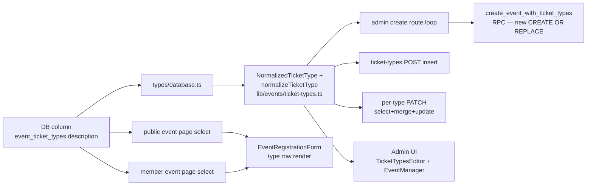

# feat: Add description to event ticket types

## Product Contract

### Summary

Add an optional, plain-text `description` to each event ticket type — a short blurb an admin writes per type (e.g. "Includes welcome drink + seated dinner") that renders to members and guests at registration/checkout so they can tell types apart before buying.

### Problem Frame

Events now carry multiple ticket types (`event_ticket_types`), distinguished only by a `title` and price. When several types differ in what's included ("Dinner + match" vs "Match only", "VIP terrace"), the title alone can't convey it, and admins have nowhere to explain the difference. Buyers pick blind or ask over email. A per-type description closes that gap: admins annotate each type, and the annotation shows on the registration form next to the title and price.

### Requirements

- **R1** — `event_ticket_types` gains an optional `description` (plain text, nullable).
- **R2** — Admins can set/edit the description in the ticket-type editor, alongside title and prices, for both new events and existing ones.
- **R3** — The description renders to buyers (members and guests) on the public and member event registration surfaces, beside each ticket type's title/price.
- **R4** — Description is optional everywhere; a type with no description behaves exactly as today (no empty label, no layout artifact).
- **R5** — Description is length-capped and stored trimmed; an empty/whitespace value is stored as `NULL`, not `""`.
- **R6** — Editing a description later changes what future buyers see but leaves all historical records (registration line items, confirmation emails) unchanged.

### Scope Boundaries

**In scope:** the description column; threading it through the single-writer validation, admin write routes, the `create_event_with_ticket_types` RPC, the admin editor UI, and the buyer-facing registration/checkout display (public + member event pages → `EventRegistrationForm`).

**Out of scope (by decision):**
- **Snapshotting** the description into `event_registration_items` or Stripe line items — it stays live metadata on the type (R6). `create_event_registration` and `title_snapshot` are untouched.
- **Rich text / markdown** — plain text only; rendered as plain text.
- Surfacing the description in ticket QR / confirmation emails or the door check-in views.

#### Deferred to Follow-Up Work
- Rendering the description in the **booking top-up basket** (`BookingManager` / `app/(checkin)/public/bookings/[token]`). This is a re-purchase surface where the buyer already saw the description at first purchase; add it later if desired. The two event pages + registration form cover the primary buyer decision point.

---

## Planning Contract

### Key Technical Decisions

- **KTD1 — Thread through the single writer, not around it.** `description` flows through `normalizeTicketType` (`lib/events/ticket-types.ts`) exactly like the existing fields, and lands in `NormalizedTicketType`. Because the per-type PATCH route re-normalizes `{...existing, ...patch}`, **`description` must be added to that route's `existing` select** (`app/api/admin/events/[id]/ticket-types/[ticketTypeId]/route.ts:57`). Omitting it reproduces the documented omitted-field-reset bug (the same class that once silently cleared `counts_as_seat` when the Settings tab saved only the guest price).
- **KTD2 — Validation in the normalizer, backstop in the DB.** `normalizeTicketType` trims the input, coerces empty/whitespace → `null`, and rejects over-cap values with a field error mirroring the `parsePrice` shape. A DB `CHECK (char_length(description) <= N)` is the belt-and-suspenders backstop. Proposed cap **500 characters** — tunable; confirm during implementation if product wants shorter.
- **KTD3 — Not snapshotted (R6).** No change to `create_event_registration` or `event_registration_items`. `title_snapshot` remains the immutable purchase record; description is deliberately live.
- **KTD4 — New RPC migration, never edit the shipped one.** `create_event_with_ticket_types` is updated via a fresh `CREATE OR REPLACE FUNCTION` migration that adds `description` to its `INSERT` column list and a `NULLIF(t->>'description', '')` to its `SELECT`. Keep the column list in sync with the admin create route (the shipped migration comments call this out).
- **KTD5 — Additive migration on a shared DB.** Dev and prod share one Supabase database; a nullable `ADD COLUMN` is safe to apply before the reading code ships (older deployments ignore it). Use a migration timestamp after the latest existing migration (currently `20260721150000_stop_writing_is_child.sql`), and keep U1's column-migration timestamp strictly earlier than U3's RPC-migration timestamp — the RPC's `INSERT` references the new column, and an out-of-order apply on a fresh DB would fail at first RPC call.
- **KTD6 — Regenerate types, re-append aliases.** After the column lands, regenerate `types/database.ts`; the Supabase regen drops the hand-written `MemberStatus` / `PaymentCaptureStatus` aliases — re-append them (project convention).

### Assumptions

- The description is single-line-capable but may wrap; a `<textarea>` in the editor and plain-text (whitespace-preserving or simple) rendering on the buyer side is sufficient. No WYSIWYG.
- `EventFullyBookedBlock`'s narrower `{id, title}` waitlist shape does **not** need the description.

---

## High-Level Technical Design

The description rides the existing create→display thread; no new data flow is introduced, only a new field on each hop.

The two write ends (D3 PATCH and E RPC) are the traps: the PATCH `existing` select and the RPC `INSERT`/`SELECT` each enumerate columns explicitly, so a new field silently drops unless added to both.

---

## Implementation Units

### U1. Add `description` column + regenerate types

**Goal:** Introduce the nullable, capped `description` column on `event_ticket_types` and reflect it in generated types.
**Requirements:** R1, R5 (DB backstop), KTD5, KTD6
**Dependencies:** none
**Files:**
- `supabase/migrations/<new-timestamp>_ticket_type_description.sql` (create)
- `types/database.ts` (regenerate; re-append hand-written aliases)

**Approach:** `ALTER TABLE public.event_ticket_types ADD COLUMN IF NOT EXISTS description text;` plus a `CHECK (description IS NULL OR char_length(description) <= 500)` constraint. Additive and idempotent (mirror the `IF NOT EXISTS` style of existing additive migrations). Apply against the shared Supabase DB, then regenerate `types/database.ts` and re-append `MemberStatus` / `PaymentCaptureStatus`.

**Execution note:** Mostly schema/config — prefer verifying via a migration apply + a `select` that the column exists and the CHECK rejects an over-cap value, rather than unit coverage.

**Patterns to follow:** `supabase/migrations/20260604160000_attendee_ticket_type.sql` and the additive header/guard style of `20260526130000_event_ticket_types.sql`.

**Test scenarios:** `Test expectation: none -- schema-only change; validated by migration apply + column/CHECK existence check.`

---

### U2. Thread `description` through the single-writer validation

**Goal:** `normalizeTicketType` accepts, trims, caps, and returns `description`; `NormalizedTicketType` carries it.
**Requirements:** R1, R5, KTD1, KTD2
**Dependencies:** U1
**Files:**
- `lib/events/ticket-types.ts` (modify)
- `lib/events/ticket-types.test.ts` (modify)

**Approach:** Add `description: string | null` to `NormalizedTicketType`. In `normalizeTicketType`, read `o.description`, trim it, coerce `""`/whitespace-only → `null`, and return an `{ ok: false, error }` when it exceeds the cap (mirror the `parsePrice` error shape and message tone). Include `description` in the returned `value` object so every writer that persists `result.value` (POST insert, PATCH update) writes it.

**Test scenarios:**
- Happy path: a valid description string is trimmed and returned on `value.description`.
- Empty string and whitespace-only input → `value.description === null`.
- Absent `description` key → `value.description === null` (no throw).
- Over-cap input (cap+1 chars) → `{ ok: false }` with a description-specific error message.
- Non-string `description` (number, object) → treated as absent/null, not coerced to `"[object Object]"`.
- Regression: adding `description` does not alter existing title/price/visibility normalization (existing cases still pass).

---

### U3. Accept `description` on all admin write paths + RPC

**Goal:** Every server path that creates or edits a ticket type persists `description`.
**Requirements:** R2, R6 (no snapshot), KTD1, KTD4
**Dependencies:** U1 (RPC references the new column), U2
**Files:**
- `app/api/admin/events/[id]/ticket-types/[ticketTypeId]/route.ts` (modify — add `description` to the `existing` select)
- `app/api/admin/events/[id]/ticket-types/[ticketTypeId]/route.test.ts` (modify)
- `app/api/admin/events/create/route.ts` (verify description flows via `normalizeTicketType`; add to RPC payload if the loop reshapes fields)
- `app/api/admin/events/create/route.test.ts` (modify)
- `supabase/migrations/<new-timestamp>_ticket_type_description_rpc.sql` (create — `CREATE OR REPLACE FUNCTION create_event_with_ticket_types`)

**Approach:**
- **Per-type PATCH:** add `description` to the `existing` column select (line ~57) so an omitted description is preserved through `{...existing, ...patch}` rather than reset to `null`. The `update(result.value)` already writes it once it's in `NormalizedTicketType`.
- **POST (create one) route:** rides through `normalizeTicketType` + `insert({ event_id, ...result.value, sort_order })` — no code change beyond U2, but assert coverage.
- **Admin create route:** normalizes each type and passes `p_types` to the RPC; `description` is carried in `r.value`. Ensure the mapped payload object includes `description`.
- **RPC:** new `CREATE OR REPLACE` adding `description` to the `INSERT` column list and `NULLIF(t->>'description', '')` to the `SELECT`. Do **not** touch `create_event_registration`.

**Execution note:** The PATCH omitted-field trap is the highest-risk spot — cover it with a test that PATCHes a single price and asserts a pre-existing description survives.

**Patterns to follow:** the existing `existing`-select + merge comment block in `[ticketTypeId]/route.ts`; the RPC column-sync comment in `20260526131000_event_write_rpcs.sql`.

**Test scenarios:**
- Create-one POST with a description persists it (fetch returns it).
- PATCH updating only `price_member` on a type that has a description leaves `description` unchanged (omitted-field-reset regression).
- PATCH setting `description` to `""` stores `null`.
- PATCH updating `description` to a new value persists it.
- Admin create route with multiple types, some with descriptions and some without, persists each correctly via the RPC (null where omitted).
- Covers R6: creating a registration against a described type leaves `event_registration_items.title_snapshot` as the title only (description not written to line items).

---

### U4. Admin editor UI: description input

**Goal:** Admins can enter/edit a description per ticket type in the events admin editor.
**Requirements:** R2, R4
**Dependencies:** U3
**Files:**
- `components/admin/TicketTypesEditor.tsx` (modify — add a `description` textarea + field on `TicketTypeDraft` + `makeStandardDraft()`)
- `components/admin/EventManager.tsx` (modify — add `description` to the load shape ~206-227, to `ticketTypeBody()` ~270-280, and to the create payload map)
- Test file for the editor if one exists; otherwise cover the body-builder logic where testable.

**Approach:** Add `description: string` to `TicketTypeDraft` (form model, default `""`) and render a `<textarea>` under the title input in each type row. Thread it through `EventManager`: the GET-load mapping, `ticketTypeBody(t)` (so POST/PATCH bodies include it), and the create-time `ticketTypes.map(ticketTypeBody)`. Extend `validateTicketTypes()` only if a client-side length hint is wanted (server is authoritative per KTD2).

**Patterns to follow:** how `counts_as_seat` / price inputs are threaded through `TicketTypeDraft` → `ticketTypeBody` → routes.

**Test scenarios:**
- `makeStandardDraft()` returns `description: ""`.
- `ticketTypeBody()` includes `description` in the emitted body.
- Editing a description in a row and saving sends it on the PATCH/POST body (component/integration test if the harness supports it).
- A type saved with an empty description round-trips as no description (no `""` sent that the server would already null, but confirm no client crash on null load).

---

### U5. Buyer-facing display at registration/checkout

**Goal:** The description renders to members and guests beside each ticket type on the registration surfaces.
**Requirements:** R3, R4
**Dependencies:** U1
**Files:**
- `app/(public)/public/events/[id]/page.tsx` (modify — add `description` to the `event_ticket_types` select ~144-160 and the `ticketTypeOptions` map)
- `app/(member)/events/[id]/page.tsx` (modify — add `description` to the select ~111-122 and map)
- `components/public/EventRegistrationForm.tsx` (modify — add `description` to `TicketTypeOption` and render it under the title in the type row ~322-360)
- `components/public/EventRegistrationDrawer.tsx` (verify `TicketTypeOption` forwarding compiles with the new field)

**Approach:** Add `description: string | null` to `TicketTypeOption` (the re-exported display model) and to both page-level select+map sites. In `EventRegistrationForm`, render the description as muted plain text beneath the title, conditionally — nothing renders when it's `null` (R4: no empty label, no layout gap). Guests and members share `EventRegistrationForm`, so one render change covers both viewer types.

**Execution note:** Verify visually that a type with no description shows no artifact and that a long (near-cap) description wraps cleanly in the type row.

**Patterns to follow:** how `title` and the price line are rendered per type in `EventRegistrationForm` rows.

**Test scenarios:**
- A type with a description renders it under the title in the registration form.
- A type with `null` description renders no description element (no empty node / no stray spacing).
- Both public and member pages pass `description` into `TicketTypeOption` (the mapped option carries it).
- Long description (near cap) wraps without breaking the row layout (visual/snapshot check).
- Covers R3: description text is present in the rendered guest and member registration view.

---

## Verification Contract

- Migration applies cleanly to the shared Supabase DB; the CHECK rejects an over-cap description.
- `types/database.ts` shows `description` on `event_ticket_types` Row/Insert/Update and the hand-written aliases are still present.
- Unit tests for `normalizeTicketType` (U2) and the admin routes (U3) pass, including the PATCH omitted-field-reset regression.
- An admin can add a description to a new and an existing type; it persists and re-loads in the editor.
- A member and a guest each see the description beside the ticket type on the registration form; a type without one shows no artifact.
- A completed registration's `event_registration_items` carry only `title_snapshot` (description not snapshotted).

## Definition of Done

All five units landed, the migration applied to prod (additive, shared DB), types regenerated with aliases re-appended, the described-type registration flow verified end-to-end in the browser for both a member and a guest viewer, and the deferred booking-top-up display consciously left for follow-up.
