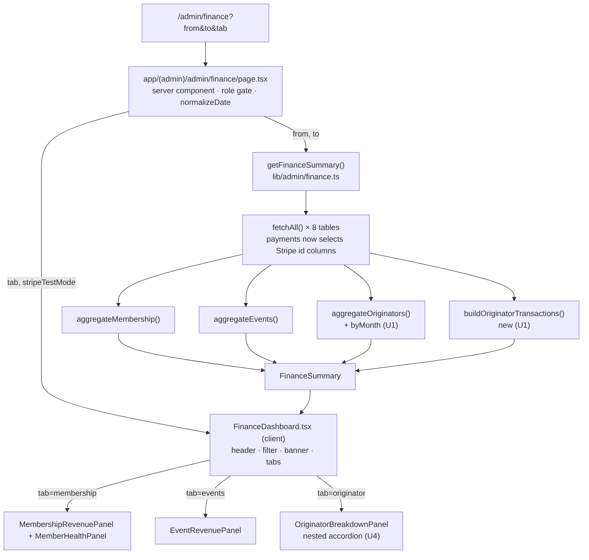
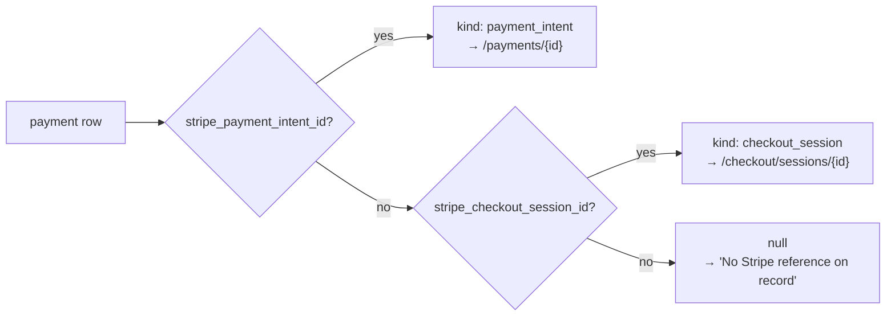

# Finance Originator Monthly Breakdown - Plan

## Goal Capsule

**Objective.** Turn the finance dashboard's flat originator table into a month-by-month view with drill-down to individual membership payments, each carrying its Stripe transaction reference. Restructure the page into three URL-driven tabs — Membership, Events, Originator.

**Authority hierarchy.** Requirements (R-IDs) win on behavior. Key Technical Decisions (KTD-IDs) win on mechanism. Units override neither.

**Stop conditions.** Stop and ask if the work requires a database migration, a new column, or a change to any write path. This plan is read-only over existing data by design (KTD2, KTD7).

**Execution profile.** Extend the existing pure aggregators in `lib/admin/finance.ts` and their fixture tests. UI work follows established repo patterns; no new UI dependency.

---

## Product Contract

### Summary

The finance dashboard attributes membership revenue to each member's originator, but only as a single lifetime-in-range total per originator. There is no month axis and no way to see which payments produced a number. This plan adds a monthly breakdown per originator, expandable down to the individual payment rows with their Stripe payment-intent reference, and moves the dashboard's three revenue views behind tabs so the page stays readable as each grows.

### Problem Frame

`OriginatorBreakdownPanel.tsx` is 30 lines and static: Originator / Converted referrals / Net revenue. An admin reconciling originator performance cannot answer "what did this originator bring in during March?" or "which payment is this CHF 1,400 made of?" without leaving the app and cross-referencing Stripe by hand. The finance page also stacks four panels vertically with no navigation; adding a monthly grid to that stack makes it worse.

### Requirements

**Originator reporting**

R1. The Originator view lists each originator with their net attributed membership revenue and converted-referral count for the selected date range, preserving today's totals.

R2. Each originator expands to show one row per calendar month in which they have attributed revenue, with the month's net and paid-payment count.

R3. Each month expands to show the individual membership payments behind it: member name, tier, payment date, payment status, and CHF amount.

R4. Month buckets use Europe/Zurich calendar months, and the sum of an originator's month nets equals that originator's total net.

R5. The Originator view states that revenue is credited to each member's sign-up originator, so the view is not read as renewal performance.

**Stripe transaction reference**

R6. Each payment row shows a Stripe transaction reference that links to the corresponding Stripe dashboard page, in test or live mode matching the running environment.

R7. When a payment has no Stripe reference, the row states so in words rather than rendering an empty cell, without asserting why the reference is absent.

R8. The reference prefers the PaymentIntent id and falls back to the Checkout Session id.

**Page structure**

R9. The finance page presents three tabs — Membership, Events, Originator — with Membership active by default.

R10. The active tab is held in the URL as `?tab=`, so a tab is bookmarkable and survives a page refresh.

R11. The KPI header, date-range filter, and incomplete-data banner stay above the tabs and the page-level caveats stay below them; all four sit outside the tab switch and are visible on every tab.

R12. Changing the date range preserves the active tab, and changing tab preserves the date range.

R13. Switching tabs gives visible feedback while the new tab's data loads.

### Acceptance Examples

AE1. A payment captured at `2026-02-28T23:30:00Z` (00:30 on 1 March in Geneva) appears under **March 2026**, not February. Covers R4.

AE2. An originator with a CHF 900 payment in March and a CHF 1,200 payment in April shows two month rows and an originator total of `CHF 2,100`. Covers R2, R4.

AE3. A membership payment with all Stripe columns null renders "No Stripe reference on record" in place of a link. Covers R7.

AE4. From `/admin/finance?tab=originator&from=2026-01-01&to=2026-06-30`, pressing **Apply** on a new date range lands on `?tab=originator` with the new range. Covers R12.

AE5. A member whose `originator_id` is null contributes to the "Direct (no originator)" group, which itself has a monthly breakdown. Covers R1, R2.

AE6. An originator with a converted referral in range but no attributed payments expands to "No attributed payments in this range.", not blank space. Covers R2.

### Scope Boundaries

**In scope.** Read-only aggregation over existing columns; the Originator tab; the tab shell.

**Deferred for later.**

- Commission rate model, commission ledger, and payout status. Reporting stays attribution-only (KTD2). This was already deferred by `docs/plans/2026-07-02-001-feat-admin-finance-dashboard-plan.md`.
- Attributing event ticket revenue to originators (KTD3).
- Snapshotting originator attribution at payment time, and attributing renewals through `renewal_tokens.originator_id` rather than `members.originator_id` (KTD7).
- Adding the originator and Stripe reference to the CSV export. The export is unchanged by this plan.
- Stripe fee / net-of-fees reconciliation, and event refund tracking — both carried forward from the 2026-07-02 plan's deferred list.

**Deferred to follow-up work.**

- A Playwright spec for `/admin/finance`. No `e2e/admin/finance.spec.ts` exists today; adding e2e coverage for this page is new ground and out of this plan's scope.

**Outside this work.** Any schema migration. Any change to Stripe webhooks or write paths. Scoping the CSV export to the active tab.

---

## Planning Contract

### Key Technical Decisions

KTD1. Extend `aggregateOriginators` with a `byMonth` field on each returned row rather than adding a parallel `aggregateOriginatorsByMonth`. One pass over `payments`, one source of truth for the totals, and the month sums stay reconcilable with the total by construction (R4). Governs R1, R2, R4.

KTD2. Report attribution only; add no commission rate, ledger, or payout concept, and no migration. *(session-settled: user-directed — chosen over a commission rate model: a rate column would break the finance dashboard's stated migration-free policy and expand the work well past a reporting change.)* Governs R1.

KTD3. Attribute membership dues only; event ticket revenue is not routed through `members.originator_id`. *(session-settled: user-directed — chosen over including event revenue: keeps the Originator numbers directly comparable to the Membership tab, which is net-of-refunds, whereas event revenue is gross.)* Governs R1, R2.

KTD4. Render the drill-down as an inline nested accordion inside the Originator tab, not through the existing `FinanceDetailModal`. *(session-settled: user-directed — chosen over the modal drill-down used by `MembershipRevenuePanel`: an accordion keeps several originators comparable on screen at once, which a modal cannot do.)* Governs R2, R3.

KTD5. Resolve the Stripe reference as `stripe_payment_intent_id` → `stripe_checkout_session_id` → explicit null label. The PaymentIntent is the handle that resolves to a charge and to refund metadata; a Checkout Session can exist with no successful charge. The null label states the absence without naming a cause: comps and honorary records carry a `free` status and never reach this view, so the rows that actually surface a null are legacy, imported, or hand-edited, and their origin is not knowable from the row. Governs R6, R7, R8.

KTD6. Hold tab state in `?tab=` and render tabs with `next/link`, copying the `TabLink` pattern in `app/(admin)/admin/messages/page.tsx:157`. The page is already a `searchParams`-driven server component; client-only tab state would decouple the tab from the range filter and the export link. There is no shadcn, radix, or `components/ui/` in this repo — no shared tab primitive exists to reuse. Governs R9, R10, R12.

KTD7. Attribution resolves through the member's **current** `originator_id`, which is the sign-up originator. Renewals are therefore credited to whoever signed the member up, not to the originator who drove the renewal — even though `renewal_tokens.originator_id` records the latter. *(session-settled: user-directed — chosen over attributing renewals through `renewal_tokens.originator_id`: sign-up credit is the intended reading, so the view carries copy saying so rather than a second attribution path.)* Governs R1, R2, R5.

KTD8. The Originator panel hand-rolls its table markup instead of using the shared `Table` from `components/admin/finance/MembershipRevenuePanel.tsx:148`. That primitive accepts `string[][]` only, so it cannot carry a Stripe anchor element or nested disclosure rows. Leave `Table` unchanged; the other panels keep using it. Governs R3, R6.

KTD9. Derive Stripe test mode by testing for the **live** key marker, not the test marker, so an absent or unrecognized `STRIPE_SECRET_KEY` falls back to test mode. The existing inline check at `app/(admin)/admin/events/[id]/attendees/page.tsx:302` tests for `_test_`, which resolves to "live" whenever the key is missing or renamed — pointing a staging admin at real production payments, where the obvious next action is a refund. Governs R6.

### High-Level Technical Design

Directional guidance for review, not implementation specification.

**Data flow.** One server read, one aggregation pass, one client tree. The tab shell selects which panel renders; it does not change what is fetched, though each tab click is a fresh server navigation that re-runs the read (R13 covers the feedback that implies).



**Stripe reference resolution.** A three-way gate applied per payment row, resolved in the pure data layer so the client never branches on raw columns.



**Accordion shape.** Two disclosure levels, both collapsed on first render. Level 3 carries its own header row.

```text
▸ Sophie Dubois            4 referrals        CHF 12,400
▾ Marc Berger              2 referrals        CHF  8,100
    ▸ March 2026                    3 paid    CHF  4,200
    ▾ April 2026                    2 paid    CHF  3,900
        Member          Tier     Date          Status   Amount      Stripe
        A. Lindqvist    Full     12 Apr 2026   paid     CHF 2,400   Stripe ↗
        R. Moreau       Social   28 Apr 2026   paid     CHF 1,500   No Stripe reference on record
▸ Direct (no originator)   0 referrals        CHF  3,300
```

### Assumptions

- "Registration details" in the request maps to per-payment membership detail — member name, tier, date, status, amount — because the revenue scope is membership dues only (KTD3). Membership payments have no event registration attached. If event-registration detail was intended, that reopens KTD3.
- **Membership refunds are not recorded today.** No write path in the app sets `payment_status = 'refunded'`, and `payments` has no refund timestamp column. The aggregators' existing negative-signing of refunded rows is kept as defensive handling, but no requirement, acceptance example, or test asserts refund behavior, because the plan cannot describe a shape the system does not produce.
- Reading the widened `payments` select across the whole table stays acceptable at club data volume, consistent with the existing `fetchAll` design.

### Implementation Constraints

- **Never call `toLocale*` or `Intl` formatters directly in these components.** Use `formatCurrency`, `formatDate`, and `formatMonth` from `lib/format.ts`. Node and Safari ICU disagree on separator bytes and produce invisible React #418 hydration mismatches — see `docs/solutions/runtime-errors/safari-hydration-mismatch-tolocale-formattoparts-2026-05-18.md`.
- **Bucket months with `zurichMonthKey` from `lib/members/payments.ts:32`.** Do not slice `YYYY-MM` off an ISO string; that misfiles payments captured just after UTC midnight on the 1st.
- **Every new read goes through `fetchAll`** and contributes its `.complete` flag to the chain at `lib/admin/finance.ts:736`. `@supabase/supabase-js` silently truncates `select()` at 1000 rows — see `docs/solutions/database-issues/supabase-row-fetch-undercount-when-aggregating-2026-05-19.md`. This plan adds columns to an existing read, so no new `fetchAll` call is required.
- **Every sort needs a total, deterministic tiebreak.** `Array.sort` is not stable for comparators returning 0, which previously caused cards to reshuffle on refresh — see `docs/solutions/ui-bugs/admin-lounge-cards-reordering-on-toggle.md`.
- **`payments.amount_eur` holds CHF** despite its name. No conversion. Documented at `lib/admin/finance.ts:13`.
- **The `makeClient` test fake ignores the column list.** `select(columns)` never inspects its argument and returns the fixture rows verbatim, so new *fields* must be added to the fixture rows themselves — widening a select string alone proves nothing. A *table* absent from the fixture map silently returns `[]`.
- **`STRIPE_SECRET_KEY` is server-only.** Test-mode detection must happen in `page.tsx` and be passed down as a prop, matching `app/(admin)/admin/events/[id]/attendees/page.tsx:302`.

### Sequencing

U1 and U2 are independent and can land in either order. U3 is independent of both. U4 needs U1 and U2. U3 and U4 both edit `components/admin/finance/FinanceDashboard.tsx`, so land them in either order and rebase the second.

---

## Implementation Units

### U1. Data layer — Stripe columns, originator month dimension, transaction rows

**Goal.** Widen the `payments` projection to carry Stripe identifiers, add a month dimension to originator attribution, and produce the payment-level rows the accordion renders.

**Requirements.** R1, R2, R3, R4, R8. Implements KTD1, KTD5.

**Dependencies.** None.

**Files.**
- `lib/admin/finance.ts` (modify)
- `lib/admin/finance.test.ts` (modify)

**Approach.**

1. Add `id`, `stripe_payment_intent_id`, and `stripe_checkout_session_id` to `MembershipPaymentRow`, all nullable except `id`.
2. Add those columns to the `payments` select string in `getFinanceSummary` (`lib/admin/finance.ts:666`). `id` is already used as the `orderKey` but is not currently selected. Leave the `getFinanceTransactions` select at `:591` unchanged — the CSV export is out of scope.
3. Add `byMonth: OriginatorMonth[]` to `OriginatorRevenue`, where `OriginatorMonth` is `{ monthKey: MonthKey; net: number; paidCount: number }`. Accumulate it inside the existing payment loop in `aggregateOriginators` using the `Map` + `bump` idiom already used by `aggregateMembership`; key from `zurichMonthKey(p.paid_at ?? p.created_at)`. Sort `byMonth` ascending by `monthKey`.
4. Give the top-level originator sort a deterministic tiebreak: net descending, then `name`, then `originatorId`.
5. Add `buildOriginatorTransactions(payments, members, memberNameById, tierNameById, range) → OriginatorTxn[]`, mirroring `buildMembershipTransactions` (`:268`). Include `paid` and `refunded` rows only. Each row carries `id` (the payment id, for the sort tiebreak in step 7), `originatorId`, `monthKey`, `memberName`, `tierName`, `date`, `status`, `amountChf` (signed), and `stripeRef`.
6. Resolve `stripeRef` per KTD5 as `{ kind: "payment_intent" | "checkout_session"; id: string } | null`. Export the resolver so U2 shares it.
7. Add `originatorTransactions` to `FinanceSummary` and populate it in `getFinanceSummary`. Sort by `date`, then `id`.

**Patterns to follow.** The `Map` accumulator + `bump` + `[...acc.entries()].map().sort()` shape in `aggregateMembership`. `buildMembershipTransactions` for the transaction-row shape and its `inRange` / status filtering.

**Test scenarios.**

- Two paid payments for the same originator in different Geneva months produce two `byMonth` entries, ordered ascending by `monthKey`.
- Invariant: for every originator, the sum of `byMonth[].net` equals `net`.
- **Cross-function invariant:** for every `(originatorId, monthKey)` pair, the summed `amountChf` of `buildOriginatorTransactions` rows equals that month's `byMonth[].net`. This is the check that catches the two functions' independently-written range, sign, and month-key logic drifting apart.
- A payment at `2026-02-28T23:30:00Z` buckets to `"2026-03"`. Covers AE1.
- CHF 900 in March and CHF 1,200 in April give two month rows and a total of `2100`. Covers AE2.
- A member with `originator_id: null` produces an `UNATTRIBUTED_ORIGINATOR` row named "Direct (no originator)" that has its own `byMonth`. Covers AE5.
- Two originators with identical `net` sort deterministically by name across repeated calls.
- `buildOriginatorTransactions` excludes `pending`, `overdue`, and `free` rows and includes `paid`.
- Stripe resolution: payment-intent present → `kind: "payment_intent"`; only session present → `kind: "checkout_session"`; neither → `null`. Covers R8.
- `getFinanceSummary` against the `makeClient` fake surfaces `stripeRef` end-to-end on `originatorTransactions`, with the new fields added to the fixture rows (not just the select string).
- Payments outside the range are excluded from `byMonth` and from `originatorTransactions`.

**Verification.** `npm run test:unit` passes with the new cases, including both reconciliation invariants.

---

### U2. Stripe dashboard link helper and test-mode flag

**Goal.** Turn a resolved Stripe reference into a dashboard URL, with live/test mode determined server-side and failing safe.

**Requirements.** R6, R8. Implements KTD5, KTD9.

**Dependencies.** None.

**Files.**
- `lib/stripe/dashboard.ts` (create)
- `lib/stripe/dashboard.test.ts` (create)
- `app/(admin)/admin/finance/page.tsx` (modify)
- `components/admin/finance/FinanceDashboard.tsx` (modify — accept and forward the `stripeTestMode` prop)
- `components/admin/AttendeeList.tsx` (modify — consume the helper in place of its inline URL construction)
- `app/(admin)/admin/events/[id]/attendees/page.tsx` (modify — use the shared test-mode derivation)

**Approach.**

1. Create `stripeDashboardUrl(ref, testMode)` returning `null` for a null ref, `https://dashboard.stripe.com/{test/}payments/{id}` for a PaymentIntent, and `https://dashboard.stripe.com/{test/}checkout/sessions/{id}` for a Checkout Session.
2. Export `stripeTestModeFromKey(key)` implementing KTD9 — true unless the key carries the live marker, so an absent or unrecognized key resolves to test mode.
3. Export a short display label per kind so the UI does not branch on `kind`.
4. In `page.tsx`, derive `stripeTestMode` via `stripeTestModeFromKey(process.env.STRIPE_SECRET_KEY)` and pass it through `FinanceDashboard`.
5. Swap `AttendeeList.tsx:499` and the attendees page's inline test-mode check over to the new helper, so the module has two consumers the day it lands.

**Patterns to follow.** `components/admin/AttendeeList.tsx:499` for the anchor shape (`target="_blank" rel="noopener noreferrer"`), which this unit generalizes rather than duplicates.

**Test scenarios.**

- PaymentIntent ref with `testMode: false` → `https://dashboard.stripe.com/payments/pi_123`.
- PaymentIntent ref with `testMode: true` → `https://dashboard.stripe.com/test/payments/pi_123`.
- Checkout Session ref → the `/checkout/sessions/` path, both modes.
- Null ref → `null`, in both modes.
- `stripeTestModeFromKey(undefined)` → `true`; `stripeTestModeFromKey("")` → `true`; a live key → `false`; a test key → `true`.
- `AttendeeList` still renders the same href it did before the swap.

**Verification.** `npm run test:unit` passes. The finance page and the attendees page both build with the shared helper.

---

### U3. URL-driven tab shell and date-filter param preservation

**Goal.** Split the finance page into Membership / Events / Originator tabs driven by `?tab=`, with visible loading feedback, and stop the date filter from wiping other query params.

**Requirements.** R9, R10, R11, R12, R13. Implements KTD6.

**Dependencies.** None.

**Files.**
- `app/(admin)/admin/finance/page.tsx` (modify)
- `components/admin/finance/FinanceDashboard.tsx` (modify)
- `components/admin/finance/FinanceTabs.tsx` (create)
- `components/admin/finance/FinanceTabs.test.tsx` (create)
- `components/admin/finance/DateRangeFilter.tsx` (modify)
- `components/admin/finance/DateRangeFilter.test.tsx` (create)

**Approach.**

1. Create `FinanceTabs.tsx` exporting the `FinanceTab` type and a `tabFrom(value): FinanceTab` normalizer defaulting to `"membership"` on anything unrecognized, including an array value. `page.tsx` imports them and widens `searchParams` to `{ from?, to?, tab? }`. Keeping the normalizer out of `page.tsx` matters: that module pulls in the Supabase server client and request headers at import time, so a test cannot reach it there.
2. Each tab is a `next/link` to `?from=…&to=…&tab=…`, carrying the current range forward. Style from `app/(admin)/admin/messages/page.tsx:157`: `px-4 py-2 -mb-px border-b-2`, active `border-marine text-marine`, inactive `border-transparent text-muted-foreground hover:text-marine`, inside a `flex items-center gap-1 border-b border-border` bar. Mark the active link `aria-current="page"` — the copied pattern has no programmatic current-page marker to inherit.
3. Give the tab bar a pending state (R13): mark the clicked tab pending and set the panel region busy while the navigation is in flight. Do not add a route-level `loading.tsx` — that would replace the header, filter, and banner that R11 requires to stay visible.
4. In `FinanceDashboard.tsx`, keep the h1 + export row, `DateRangeFilter`, the incomplete banner, and `FinanceHeader` above the tab bar, and the caveats paragraph below the tab content. Switch on the active tab: Membership → `MembershipRevenuePanel` + `MemberHealthPanel`; Events → `EventRevenuePanel`; Originator → `OriginatorBreakdownPanel`. Drop the `grid lg:grid-cols-2` wrapper.
5. Relabel the export control to "Export all transactions (CSV)". Its behavior and output are unchanged; once the user is standing on a tab, "Export CSV" reads as exporting that tab.
6. Fix `DateRangeFilter.apply` to merge rather than replace. Read `useSearchParams()`, build a `URLSearchParams` from it, set `from` and `to`, and push. Today's `router.push(\`${pathname}?from=…&to=…\`)` at `DateRangeFilter.tsx:38` drops every other param, which would silently reset the tab on Apply.

**Test scenarios.**

- `tabFrom(undefined)` → `"membership"`; `tabFrom("originator")` → `"originator"`; `tabFrom("bogus")` → `"membership"`; `tabFrom(["events","originator"])` → `"membership"`.
- Each tab link href carries the current `from` and `to`.
- Exactly one tab carries the active styling, and exactly one carries `aria-current="page"`.
- `DateRangeFilter` Apply from `?tab=originator&from=…&to=…` pushes a URL that still contains `tab=originator`. Covers AE4.
- `DateRangeFilter` presets ("This year", "Last 30 days", "Last 90 days") preserve `tab` the same way.
- The export href still carries only `from` and `to`.

**Verification.** Navigating to each `?tab=` value renders the matching panel; refreshing holds the tab; applying a range keeps the tab and updates the numbers; clicking a tab shows feedback before the new panel appears.

---

### U4. Originator monthly accordion panel

**Goal.** Replace the static originator table with a two-level accordion down to payment rows carrying Stripe links.

**Requirements.** R1, R2, R3, R5, R6, R7. Implements KTD2, KTD4, KTD7, KTD8.

**Dependencies.** U1, U2.

**Files.**
- `components/admin/finance/OriginatorBreakdownPanel.tsx` (modify)
- `components/admin/finance/OriginatorBreakdownPanel.test.tsx` (create)
- `components/admin/finance/FinanceDashboard.tsx` (modify — pass `originatorTransactions`)

**Approach.**

1. Add `"use client"` and take `originators`, `transactions: OriginatorTxn[]`, and `stripeTestMode` as props. Everything under `FinanceDashboard` is already in the client bundle; the directive is for clarity, matching `MembershipRevenuePanel`.
2. Hold two independent expansion sets in state — `expandedOriginators: Set<string>` and `expandedMonths: Set<string>` keyed `${originatorId}:${monthKey}` — both empty on first render. Add a "Collapse all" control in the panel header, shown whenever either set is non-empty, clearing both.
3. Level 1 rows: originator name, converted referrals, net. Level 2 rows: `formatMonth(monthKey)`, paid count, net. Level 3 renders a header row — Member / Tier / Date / Status / Amount / Stripe — above its payment rows, styled like the shared `Table` primitive's `<thead>` (first column left-aligned, the rest right-aligned).
4. The entire level-1 and level-2 row is the disclosure control — a full-width `<button>` laying out its cells — carrying the `cursor-pointer hover:bg-marine/5` treatment the existing `Table` already uses, so hit area and hover feedback match the Membership panel. Each carries `aria-expanded` and a rotating caret, and responds to Enter and Space.
5. Filter level-3 rows client-side from the already-shipped `transactions` array by `originatorId` and `monthKey`, mirroring how `MembershipRevenuePanel` filters `transactions` for its drill-down.
6. Wrap the accordion body in an `overflow-x-auto` container with a `min-w` floor on the inner table, matching `components/admin/ManageEventTabs.tsx:246`. Six columns indented two disclosure levels will otherwise wrap mid-word on a narrow window.
7. Stripe cell: when `stripeDashboardUrl` returns a URL, render an anchor labelled "Stripe ↗" carrying an `aria-label` naming its row's member and date (the glyph is `aria-hidden`), plus `className="ph-no-capture"` so the reference id is not forwarded to analytics on click. When it returns null, render "No Stripe reference on record". Never an empty cell.
8. An originator whose `byMonth` is empty still expands, rendering "No attributed payments in this range." — a converted referral in range whose first payment clears outside it produces exactly this row. Covers AE6.
9. Replace the panel's caveat line with copy covering all three live caveats: revenue is credited to each member's **sign-up** originator, so this is not renewal performance (R5, KTD7); reassigning a member's originator moves their history between months (KTD7); and commission rates and payouts are not modelled (KTD2).

**Test scenarios.**

- Renders one collapsed row per originator, ordered by net descending.
- Clicking an originator reveals its month rows; clicking again collapses them.
- Two originators can be expanded at the same time; "Collapse all" clears both levels.
- Clicking a month reveals only that originator-and-month's payment rows, under a Member / Tier / Date / Status / Amount / Stripe header row.
- A payment with a PaymentIntent renders an anchor whose href matches `stripeDashboardUrl`, with `target="_blank"`, `rel="noopener noreferrer"`, `ph-no-capture`, and an `aria-label` naming the member and date.
- A payment with no Stripe reference renders "No Stripe reference on record" and no anchor. Covers AE3.
- An originator with referrals but no attributed months expands to the no-payments line. Covers AE6.
- Empty `originators` renders the existing empty-state copy, not a bare table.
- Disclosure controls expose `aria-expanded`, span the full row, and toggle on Enter and Space.
- The caveat copy names sign-up attribution, reassignment, and the absence of commission modelling.
- Month labels render via `formatMonth` and dates via `formatDate` — no direct `toLocale*` call anywhere in the component.

**Verification.** With a seeded range, expanding an originator then a month shows payment rows whose amounts sum to the month net shown one level up.

---

## Verification Contract

- `npm run test:unit` — all vitest suites pass, including the new cases in `lib/admin/finance.test.ts`, `lib/stripe/dashboard.test.ts`, `components/admin/finance/FinanceTabs.test.tsx`, `components/admin/finance/DateRangeFilter.test.tsx`, and `components/admin/finance/OriginatorBreakdownPanel.test.tsx`. Component tests need the `@vitest-environment jsdom` docblock, matching `components/admin/AttendeeList.test.tsx`.
- `npm run lint` — clean.
- `npm run build` — succeeds. This catches the server-only/client-boundary mistakes that `stripeTestMode` threading can introduce.
- Manual browser check as a `super_admin` or `finance` user, at both desktop and a narrow (~768px) width:
  - each `?tab=` value renders its panel and survives a refresh;
  - the header, filter, and banner stay above the tabs on every tab, and the caveats stay below;
  - clicking a tab shows feedback before the panel changes;
  - Apply on a new range preserves the active tab;
  - an originator's month nets sum to its total, and a month's payment rows sum to the month net;
  - a Stripe link opens the correct dashboard mode;
  - a payment with no Stripe reference shows the labelled fallback;
  - level-3 rows scroll horizontally rather than compressing.
- Non-finance roles still redirect away from `/admin/finance`.

## Definition of Done

**Global.**

- R1–R13 are satisfied, and AE1–AE6 hold.
- No migration was added and no write path changed (KTD2, stop condition).
- No direct `toLocale*` or `Intl` formatter call was introduced in any component or aggregator.
- New fields were added to the `makeClient` fixture rows, not only to select strings.
- The CSV export route and its output are unchanged.
- Abandoned or experimental code from approaches that did not work out is removed from the diff.

**Per unit.**

- U1 — both invariants pass: `byMonth` sums to `net`, and the payment rows for each originator-and-month sum to that month's net.
- U2 — an absent `STRIPE_SECRET_KEY` resolves to test mode; `AttendeeList` renders unchanged hrefs through the shared helper.
- U3 — `DateRangeFilter` no longer drops query params; every tab link carries the range; exactly one tab carries `aria-current`; tab clicks show feedback.
- U4 — no empty Stripe cell in any state; level 3 has a header row; disclosure controls span the full row and are keyboard-operable; the caveat copy names sign-up attribution.

---

## Risks & Dependencies

**Renewals are credited to the sign-up originator.** This is the intended reading (KTD7), but it means the monthly table is not renewal performance — an originator who chases a renewal sees nothing, and the original sign-up originator sees revenue they did not drive this year. Members who predate the app have no originator at all, so their renewals land in "Direct (no originator)". Mitigation: panel copy (U4 step 9). The per-renewal originator the app already records on `renewal_tokens` is the basis for a future change, deferred here.

**Attribution rewrites history when an originator is reassigned.** `members.originator_id` is current-state, so a reassignment moves that member's whole history between months. A monthly table implies a stable ledger it is not. Mitigation: the same panel copy. A snapshot column is the real fix and is deferred.

**Range boundaries are UTC days; month buckets are Geneva months.** `rangeFromDates` parses `${from}T00:00:00Z`, a documented v1 simplification, while `zurichMonthKey` buckets in Europe/Zurich. The first and last month in any range can therefore be partial. The monthly view makes this seam visible for the first time. Mitigation: keep the caveat in page-level copy; do not change `rangeFromDates` in this plan.

**Financially sensitive detail ships to the client.** `FinanceDashboard` is a client component, so `originatorTransactions` is serialized into the page payload alongside the existing `membershipTransactions`. This is not a new class of exposure — the page is already role-gated to `super_admin` and `finance` — but it doubles the detail payload and adds Stripe reference ids to it. Acceptable at club scale; the `ph-no-capture` class in U4 step 7 keeps those ids out of analytics.

**Each tab click re-runs the full read.** A tab is a server navigation to the same route, so `getFinanceSummary` re-issues all eight paginated reads. R13's feedback requirement makes the cost visible rather than removing it.

## System-Wide Impact

- **Auth boundary.** Unchanged. The three existing gates stay as they are: the `(admin)` layout allowlist, the page-level `ALLOWED_ROLES`, and the export route's own check. All finance reads continue to use the service-role client, which bypasses row-level security — the application-level role checks are the only gate.
- **CSV export.** Unchanged in output. Only the button's label changes (U3 step 5).
- **Attendees page.** U2 swaps two inline Stripe helpers for the shared module; the rendered hrefs are unchanged, and the test-mode derivation becomes fail-safe there too (KTD9).
- **Shared primitives.** `Table` in `MembershipRevenuePanel.tsx` is left untouched, so `EventRevenuePanel` and the membership panels are unaffected by U4.

## Open Questions

- **Where does Member health belong?** (deferred) This plan puts `MemberHealthPanel` on the Membership tab, since the requested tab set is Events / Membership / Originator and member health is membership-shaped. A fourth "Members" tab is the alternative. Does not block implementation.
- **Should collapsing an originator clear its open months?** (deferred) The two-independent-set design preserves them for re-expansion. Either behavior is defensible; the implementer may pick.

## Sources & Research

- `docs/plans/2026-07-02-001-feat-admin-finance-dashboard-plan.md` — the authoritative spec for the current page. Its deferred list already scoped originator commissions, Stripe fee reconciliation, and event refund tracking; its migration-free policy is the constraint behind KTD2.
- `lib/admin/finance.ts:391` — `aggregateOriginators` as it stands today; `:268` `buildMembershipTransactions` is the shape U1 mirrors; `:666` is the `getFinanceSummary` payments select.
- `app/api/admin/members/request-renewal/route.ts:78` and `app/api/renew/checkout/route.ts:21` — `renewal_tokens.originator_id` is written per renewal and read only for token validation, which is why KTD7 is a decision rather than an oversight.
- `app/(admin)/admin/messages/page.tsx:157` — the `TabLink` pattern KTD6 adopts.
- `components/admin/AttendeeList.tsx:499` and `app/(admin)/admin/events/[id]/attendees/page.tsx:302` — the existing Stripe-link and test-mode-detection patterns U2 generalizes and hardens.
- `components/admin/ManageEventTabs.tsx:246` — the `overflow-x-auto` wrapper idiom for wide admin tables.
- `docs/solutions/runtime-errors/safari-hydration-mismatch-tolocale-formattoparts-2026-05-18.md` — why `lib/format.ts` exists and must be used.
- `docs/solutions/database-issues/supabase-row-fetch-undercount-when-aggregating-2026-05-19.md` — the 1000-row truncation behind `fetchAll` and the `complete` flag.
- `docs/solutions/architecture-patterns/reusing-nullable-column-as-value-source-trap.md` — why the null Stripe reference is labelled loudly rather than rendered blank.
- `docs/solutions/ui-bugs/admin-lounge-cards-reordering-on-toggle.md` — why every sort in U1 needs a total tiebreak.
