# Waitlist Paid Offer Flow - Plan

## Goal Capsule

**Objective.** Replace the admin waitlist-to-comp conversion with a paid offer flow. An admin offers a seat to a waitlisted person; that person opens an emailed link, confirms a ticket type, and pays through the normal event checkout. Only a completed payment produces a ticket.

**Authority hierarchy.** Requirements (R-IDs) win on product behaviour. Key Technical Decisions (KTD-IDs) win on mechanism within their cited requirements. Implementation Units override neither.

**Stop conditions.** Stop and ask if implementation reveals that (a) the seat cap cannot be enforced by the existing register-route check for offer holders, (b) the member sign-in redirect cannot return to the offer landing, or (c) removing the comp conversion breaks a live consumer not listed in U8.

**Execution profile.** Server-side behaviour first: the migration, the register-route lock, and the token resolution carry the risk. UI follows the routes it calls.

**Tail ownership.** Standalone `ce-work` owns branch, commit, and PR.

---

## Product Contract

### Summary

Waitlisted people become paying customers rather than comped guests. An admin explicitly offers a seat to one or more waitlist entries; each offer is a per-entry tokenised email link into the normal public checkout, with the quantity pinned to what they asked for and the ticket type re-selectable. The offer confers no seat hold and no price change — the existing capacity check decides who gets in, so seats go to whoever completes payment first. The comp conversion path is removed outright.

### Problem Frame

`app/api/admin/events/[id]/waitlist/convert/route.ts` promotes a waitlist entry into a free registration that overrides the seat cap. Every waitlisted person the club lets in therefore attends for nothing, and the seat cap silently stops meaning anything once an admin starts converting. The route also papers over broken data: an entry whose ticket type is missing or archived falls back to the event's first active type, so the person is registered for something they did not ask for.

The club needs the waitlist to behave like a queue for paid tickets. Free admission already has its own surface — the comp guest list (`supabase/migrations/20260711120000_comp_guest_list.sql`) — so the waitlist does not need to double as one.

### Requirements

**Offering**

- R1. An admin offers a seat to a waitlist entry by an explicit action; nothing offers automatically when capacity frees up.
- R2. An offer sends an email to the entry's address containing a link unique to that entry.
- R3. An admin can resend an offer to an entry already offered. The link stays the same.
- R4. An admin can offer to more entries than there are free seats, without warning or confirmation.
- R5a. An admin can withdraw an issued offer. A withdrawn link stops resolving to a form; the entry returns to queued and can be offered again.

**Redemption and payment**

- R5. The offer link opens a checkout for that event, pre-filled from the waitlist entry.
- R6. The total number of tickets bought through an offer is at most the quantity on the waitlist entry. Never more. When fewer seats are free than the entry's quantity, the offer is redeemable for the available number instead of being blocked outright.
- R7. The buyer may choose any live ticket type that consumes a seat, regardless of the type recorded on their entry.
- R8. The registration is created with the entry's email address; the buyer may edit their name but not their email.
- R9. An offer confers no seat hold, no expiry, and no price change. The buyer pays the member or non-member rate their session entitles them to.
- R10. An offer holder who reaches checkout after the free seats are gone is told the seats have gone. They are not invited to join a waitlist they are already on.
- R11. On a members-only event, an offer holder must be signed in as an active member before reaching checkout.
- R12. A waitlist entry stops being offerable once its linked registration is paid or free, or an admin withdraws the offer. A pre-link legacy entry (no `waitlist_entry_id` anywhere) whose email already matches a live registration for the event is also treated as redeemed.

**Data integrity**

- R13. Every offerable waitlist entry resolves to a live, non-archived, seat-counting ticket type and a quantity between 1 and 10.
- R14. An entry that fails R13 is visibly flagged in the admin surface and cannot be offered until an admin repairs it. No silent fallback to another ticket type.

**Removal**

- R15. The waitlist-to-comp conversion is removed: its route, its email, its template, and its admin action.
- R16. Registrations already created by the retired comp conversion keep their data and stay visible wherever free registrations are reported.

### Key Flows

- F1. **Offer.** Admin opens the event's Waitlist tab, sees each entry's requested ticket type and quantity, and offers a seat to one or more entries. Each offered entry gets a token and an email.
- F2. **Redemption.** The invitee opens the link, is signed in if the event is members-only, sees the checkout with quantity pinned and email pinned, picks a ticket type, and pays. The Stripe webhook confirms the registration as it does for any public booking.
- F3. **Late arrival.** A second invitee opens the link after the seats have gone. The landing shows a seats-gone panel. Their waitlist entry is untouched and can be offered again later.
- F4. **Repair.** An admin sees an entry flagged as missing a ticket type or quantity, sets both inline, and can then offer it.

### Acceptance Examples

- AE1. Covers R6, R7. Entry requests 2 × "Dinner". The invitee buys 2 × "Lunch". Accepted, priced as Lunch.
- AE2. Covers R6. Entry requests 2. The invitee submits a basket totalling 3. Rejected with 400; no registration created.
- AE3. Covers R8. The invitee edits the email field via a crafted request. The registration is still created with the waitlist entry's email.
- AE4. Covers R10. Two seats free, three offers sent. The first two invitees pay. The third sees the seats-gone panel and no waitlist form.
- AE5. Covers R9. Two invitees are mid-checkout for the last seat. Both complete payment. Both are registered and the event sits one seat over cap. No cap re-check fires.
- AE6. Covers R12. An invitee abandons Stripe checkout. Their entry is still offerable and their pending registration does not hide it.
- AE7. Covers R14. An entry's ticket type was archived after signup. The row shows the archived title and a "needs a ticket type" flag, and the Offer action is disabled.
- AE8. Covers R11. A signed-out member opens an offer for a members-only event. They are sent to sign in and returned to the offer landing.
- AE9. Covers R6. Entry requests 2, one seat is free. The invitee buys 1. Accepted.
- AE10. Covers R5a. An admin withdraws an offer. The link now resolves to the invalid-link panel. The entry can be offered again.

### Scope Boundaries

In scope: the admin offer surface, the offer email, the offer landing, the register route's offer handling, and the removal of the comp conversion.

Out of scope: waitlist signup UX and its eligibility rules; queue position or ordering; refunds and cancellation behaviour; the comp guest list.

#### Deferred to Follow-Up Work

- A reaper for waitlist entries on past events. Offers never expire, so offered-but-unpaid entries accumulate (see R9).
- An in-app surface for Stripe payments tagged `needs_refund: "duplicate_registration"`. Removing comps makes this flow the main producer of that tag, and it is resolved manually in Stripe today.
- Extracting a shared `unitPriceFor(ticketType, { isMember })` resolver. Six sites hand-roll rate-to-price today and this plan adds no seventh, but the duplication is a standing hazard (`docs/solutions/architecture-patterns/reusing-nullable-column-as-value-source-trap.md`).
- Surfacing which offers dead-ended at the seats-gone gate. The Waitlist tab distinguishes offered from redeemed, but not "opened the link and found no seats left" from "never opened it" — useful for an admin follow-up, not required to ship.

---

## Planning Contract

### Key Technical Decisions

- KTD1. The offer link does not bypass the seat cap. The register route's existing check (`seatsUsed + seatQuantity > seat_cap` → 409) is the only gate, which is what makes redemption first-to-pay-wins. Governs R9, R10. (session-settled: user-directed — chosen over a hard cap re-check at webhook confirmation and over a per-person seat hold: the club prefers a small overshoot to charging someone and refunding them.)

- KTD2. Accept the overshoot from concurrent in-flight checkouts. `seats_used` deliberately excludes `pending` registrations, and the Stripe webhook does not re-check capacity. Offering to more people than there are seats can therefore push the event over cap by the number of simultaneous checkouts. Governs R4, R9. (session-settled: user-directed — chosen over a locked capacity claim at payment confirmation: no invitee is ever charged for a seat they cannot have.)

- KTD3. Redemption is derived from the linked registration, not from deleting the waitlist row. Add `event_registrations.waitlist_entry_id`, written when the registration is created. An entry is redeemed — hidden from the offerable list — once its linked registration reaches `paid` or `free`. Governs R12. Rationale: the webhook promotes with a plain PostgREST update, so a delete alongside it cannot be atomic; a crash between the two would strand a paid registration next to a still-offerable entry. Deriving the state needs no new money-path RPC and keeps the entry as history.

- KTD4. The offer token follows the `manage_token` shape and the `invite_code` placement. Generate with `generateSelfRegToken()` (24 CSPRNG bytes, base64url), store on `event_waitlist` behind a partial unique index, and resolve it server-side through `createAdminClient()` — `event_waitlist` has RLS on with no policies. Governs R2, R5. Rationale: the token is per-entry, so it cannot live on `events` like `invite_code`; the token shape and the no-referrer landing precedent both already exist in `app/(checkin)/public/bookings/[token]/page.tsx`.

- KTD5. The offer landing is its own route at `app/(public)/public/offers/[token]/page.tsx`, not a query parameter on the event page. Governs R5, R10, R11. Rationale: the event pages swap the registration form for `EventFullyBookedBlock` whenever the event is full, which is the normal state when an offer is sent — an offer holder on the existing page would be invited to rejoin the waitlist they are already on. A dedicated landing also keeps the token out of the Referer header on a page that renders arbitrary description links.

- KTD6. Offer checkout is restricted to ticket types where `counts_as_seat` is true. Governs R7. Rationale: a non-seat type passes no capacity check at all, so an invitee could redeem an offer without consuming the seat that was freed for them.

- KTD7. Pricing and membership stay session-derived; the offer token confers neither. A members-only offer landing sends a signed-out visitor to sign in and returns them to the landing. Governs R9, R11. (session-settled: user-directed — chosen over letting the token stand in for membership: a token-authenticated member would be charged the invite or non-member rate.)

- KTD8. The email is pinned to the waitlist entry server-side; the name is not. The register route reads the email from the entry, not the request body. Governs R8. (session-settled: user-directed — chosen over letting the buyer edit both: forwarding an offer would otherwise register someone the club never offered, and the duplicate-registration guard keys on email while the entry keys on identity.)

- KTD9. The sold-out response keeps its current message text. `components/public/EventRegistrationForm.tsx` detects sold-out by matching the 409 body against `/tickets? remaining/i`; changing the wording would silently degrade the panel to a generic error. The offer-specific copy lives in the landing and in the form's offer mode, not in the route's message.

### High-Level Technical Design

Directional guidance for review, not implementation specification.

**Waitlist entry lifecycle.** Offer state is new; the entry has none today.

```mermaid
stateDiagram-v2
    [*] --> queued: visitor joins the waitlist
    queued --> needs_repair: ticket type NULL/archived, or quantity NULL (R13)
    needs_repair --> queued: admin sets a live type and quantity (F4)
    queued --> offered: admin offers a seat, token minted, email sent (R1, R2)
    offered --> offered: admin resends, same token (R3)
    offered --> redeemed: linked registration reaches paid or free (R12, KTD3)
    offered --> offered: invitee abandons checkout; pending does not redeem (AE6)
    redeemed --> [*]
```



**Redemption path.** The offer adds a token to the front of the existing checkout; everything from the register route onward is unchanged.

```mermaid
sequenceDiagram
    participant A as Admin
    participant E as Offer email
    participant L as Offer landing
    participant R as Register route
    participant S as Stripe
    participant W as Webhook

    A->>E: offer seat (token minted on the entry)
    E->>L: invitee opens /public/offers/<token>
    L->>L: resolve entry, gate on event + membership + seats
    L->>R: POST with offer_token, locked quantity, chosen type
    R->>R: pin email, verify quantity equals entry, seat-cap check
    R->>S: create checkout session
    S->>W: checkout.session.completed
    W->>W: pending to paid; entry becomes redeemed by derivation
```

**Offer landing gate.** The landing resolves one of six outcomes before it renders a form.

```mermaid
flowchart TD
    T[token] --> V{resolves to an entry?}
    V -- no --> P1[not a valid link]
    V -- yes --> Q{event published and registration open?}
    Q -- no --> P2[this offer is closed]
    Q -- yes --> M{members-only event?}
    M -- yes, not signed in --> P3[sign in, return here]
    M -- yes, signed in but not an active member --> P6[this offer is for members only]
    M -- no, or active member --> D{entry already redeemed?}
    D -- yes --> P4[you are already registered]
    D -- no --> C{any seats free, up to the entry's quantity?}
    C -- zero free --> P5[these seats have gone]
    C -- 1+ free --> F[checkout form, capped at min(entry quantity, seats free), email pinned]
```

### Risks & Dependencies

- The Postmark template `event-waitlist-offer` must exist before deploy. Templates are created by a one-shot script, not at runtime.
- Migrations apply to the shared dev/prod database on apply. Write them idempotent and additive, per the house header convention.
- Any new SECURITY DEFINER function must revoke EXECUTE from `PUBLIC, anon, authenticated` and grant to `service_role`, or the guard added in `supabase/migrations/20260809220000_revoke_anon_execute_secdef.sql` fails the migration.
- `types/database.ts` carries hand-written `MemberStatus` and `PaymentCaptureStatus` aliases that Supabase regeneration drops. Re-append them.
- Duplicate offers become the main producer of the `23505` collision the webhook handles, because `event_waitlist` has no uniqueness on `(event_id, email)`. Keep the handler, the 200 acknowledgement, and the `needs_refund` PaymentIntent tagging intact; only the comment changes.

### Sources / Research

- `docs/solutions/database-issues/partial-unique-index-stripe-webhook-23505-deadlock-2026-05-21.md` — why the webhook acknowledges duplicates with 200 and tags the PaymentIntent. Read before touching U8's comment cleanup.
- `docs/solutions/best-practices/retire-a-live-flow-drop-the-write-path-keep-the-history.md` — the four-lifetimes rule behind R15 and R16.
- `docs/solutions/design-patterns/race-safe-claim-rpc-capacity-cap.md` — the house pattern for contested capacity. KTD1 and KTD2 deliberately depart from it; the departure is the user's call, recorded so a reviewer does not read it as an oversight.
- `docs/solutions/security/supabase-anon-exposure-rls-off-and-anon-executable-rpcs.md` — `event_waitlist` shipped world-readable until 2026-08-09. Motivates KTD4's server-side resolution.
- `app/api/events/[id]/register/route.ts` — the capacity check, rate-class derivation, zero-total free branch, and Stripe session construction this plan extends.
- `app/(checkin)/public/bookings/[token]/page.tsx` and `app/(public)/pay/retry/[token]/page.tsx` — token landing precedents, including `metadata.referrer` and distinct terminal panels.

---

## Implementation Units

### U1. Offer columns and the registration link

**Goal.** Give a waitlist entry offer state and give a registration a link back to the entry it redeemed.

**Requirements.** R2, R3, R12, R13.

**Dependencies.** None.

**Files.**
- `supabase/migrations/<timestamp>_waitlist_offer.sql` (new)
- `types/database.ts` (regenerate, then re-append the hand-written aliases)

**Approach.**
1. Add to `event_waitlist`: `offer_token text`, `offered_at timestamptz`, `offered_by uuid` referencing `admin_users(id)`, `offer_sent_count integer not null default 0`.
2. Add a partial unique index on `offer_token` where it is not null, mirroring `events_invite_code_unique`.
3. Add `waitlist_entry_id uuid` to `event_registrations`, referencing `event_waitlist(id) on delete set null`, with an index for the redeemed-state lookup.
4. Keep every statement idempotent (`add column if not exists`, `create index if not exists`) and open with the house header explaining that this applies to production on apply. Additive only; no backfill and no data repair — R14 makes repair an admin action.

**Patterns to follow.** `supabase/migrations/20260526112430_events_invite_link.sql` for the partial unique index; `supabase/migrations/20260521120000_event_registrations_dedupe_index_and_converted_by.sql` for adding a nullable audit column to `event_registrations`.

**Execution note.** No new RPC, so no SECURITY DEFINER grants are needed here. If one becomes necessary, apply the revoke-and-grant pattern or the migration guard will fail.

**Test scenarios.**
- Applying the migration twice succeeds without error.
- Inserting two entries with the same non-null `offer_token` violates the unique index.
- Two entries with `offer_token` null coexist.
- Deleting a waitlist entry leaves a linked registration in place with `waitlist_entry_id` null.

**Verification.** `npx supabase migration list` shows the migration applied; `types/database.ts` contains the new columns and still ends with the `MemberStatus` and `PaymentCaptureStatus` aliases.

---

### U2. Admin waitlist data and inline repair

**Goal.** Let the admin see what each waitlist entry actually asked for, repair entries that cannot be offered, and correct a mistyped email on an unredeemed entry.

**Requirements.** R13, R14, R12.

**Dependencies.** U1.

**Files.**
- `app/(admin)/admin/events/[id]/attendees/page.tsx` (widen the waitlist query)
- `app/api/admin/events/[id]/waitlist/[waitlistId]/route.ts` (new: PATCH)
- `app/api/admin/events/[id]/waitlist/[waitlistId]/route.test.ts` (new)

**Approach.**
1. Widen the waitlist select to include `ticket_type_id`, `quantity`, `offered_at`, `offer_sent_count`, and the joined ticket type's `title`, `archived_at`, and `counts_as_seat` — including archived types, so the admin can see what was requested. Do not send `offer_token` to the browser; expose a derived boolean `offered` instead, so a live offer secret never reaches the admin page payload or browser history.
2. Derive per entry: `offerable`, and a reason when not. An entry is not offerable when its ticket type is null, dangling, archived, or not seat-counting (KTD6), or its quantity is null or outside 1–10.
3. Derive `redeemed` per KTD3: the entry has a `waitlist_entry_id`-linked registration with status `paid` or `free`. As a fallback for legacy entries that predate U1 (no such link exists for them), also treat an entry as redeemed when its email matches a live `paid`/`free` registration for the event.
4. Add a PATCH route accepting `ticket_type_id`, `quantity`, and optionally `email` (on an unredeemed entry only), validating the type belongs to the event and is not archived, the quantity is 1–10, and the email is well-formed. Reuse `lib/events/guest-list-auth.ts` for admin auth rather than copying `assertAdmin` again.

**Patterns to follow.** `app/api/admin/events/[id]/ticket-types/[ticketTypeId]/route.ts` for a scoped admin mutation on an event child row.

**Test scenarios.**
- PATCH with a live type and quantity 3 updates the entry and returns success.
- PATCH with a ticket type belonging to another event is rejected.
- PATCH with an archived ticket type is rejected.
- PATCH with quantity 0 and with quantity 11 are both rejected.
- PATCH from a non-admin session returns 403; unauthenticated returns 401.
- An entry with a null ticket type is returned as not offerable with the reason naming the ticket type.
- An entry whose type is archived is returned as not offerable, and the archived title is present so the UI can show it.
- An entry whose type has `counts_as_seat` false is returned as not offerable, with the reason naming the type.
- The returned payload contains no `offer_token` value.
- An entry linked to a paid registration is returned as redeemed; one linked to a pending registration is not.
- A post-migration entry sharing an email with an unrelated paid registration (no `waitlist_entry_id` link between them) stays offerable.
  - **Superseded 2026-08-11 (post-merge review).** Such an entry is now *visible but not offerable*, with the reason "This email already has a registration for this event". As shipped it was neither: the email match counted as redemption, which hid the entry from the admin waitlist entirely and read as data loss. Making it offerable again was rejected too — the register route's duplicate-email guard would 409 the redemption, so an offer would walk the person into a dead end. Redemption is now the entry's own `waitlist_entry_id` link only (`isWaitlistEntryRedeemed`); the email match is a separate signal (`emailAlreadyRegistered`) feeding offerability.
- PATCH with a corrected email on an unredeemed entry updates it; PATCH with an email on a redeemed entry is rejected.

**Verification.** The Waitlist tab data includes requested type, quantity, offer state, and an offerable flag for every entry, including legacy rows.

---

### U3. The offer email

**Goal.** Send a waitlisted person a link to buy the seat they queued for.

**Requirements.** R2, R9, R11.

**Dependencies.** U1.

**Files.**
- `lib/email/event-waitlist-offer.ts` (new)
- `lib/email/event-waitlist-offer.test.ts` (new)
- `docs/email-templates/event-waitlist-offer.html` (new)
- `docs/email-templates/event-waitlist-offer.txt` (new)
- `scripts/postmark/create-event-waitlist-offer.mjs` (new)

**Approach.**
1. Export `sendWaitlistOffer(waitlistEntryId)` taking the entry id, reading the entry and event through the admin client, and building the offer URL from `NEXT_PUBLIC_APP_URL`.
2. Template model carries the event name, date, the requested ticket type title, the quantity, and the offer URL. Pass `null`, never an empty string, for absent optional values.
3. Body copy must set two expectations: the seat is not held and goes to whoever pays first, and on a members-only event they should sign in first.
4. Write the create-or-edit script so the template exists in Postmark before deploy.

**Patterns to follow.** `lib/email/event-reminder.ts` for module shape and the strict `NEXT_PUBLIC_APP_URL` handling; the retired `lib/email/event-waitlist.ts` for the event-URL branch on visibility. Mustachio has no `{{#if}}`; use `{{#key}}…{{/key}}`, and inside a scalar section print the value with `{{.}}`.

**Test scenarios.**
- A valid entry produces a send call with the offer URL, event name, quantity, and ticket type title in the template model.
- An entry with no offer token returns a failure rather than sending a link to nowhere.
- A missing entry returns a failure and does not call Postmark.
- Postmark returning an error surfaces as `{ success: false }` and does not throw.

**Verification.** Running the create script against Postmark leaves an `event-waitlist-offer` template whose rendered preview shows no unresolved placeholders.

---

### U4. Offer action and the Waitlist tab

**Goal.** Add Offer, Resend, and Withdraw actions to the admin Waitlist tab. U8 removes the Convert action.

**Requirements.** R1, R3, R4, R5a, R14.

**Dependencies.** U1, U2, U3.

**Files.**
- `app/api/admin/events/[id]/waitlist/[waitlistId]/offer/route.ts` (new: POST for offer/resend, DELETE for withdraw)
- `app/api/admin/events/[id]/waitlist/[waitlistId]/offer/route.test.ts` (new)
- `components/admin/ManageEventTabs.tsx`
- `components/admin/ManageEventTabs.test.tsx` (new or extended)

**Approach.**
1. The POST route mints an offer token when the entry has none, keeps the existing token on a resend, stamps `offered_at` and `offered_by`, increments `offer_sent_count`, then sends the email and reports whether it sent.
2. Reject the offer when the entry is not offerable per R13, when registration is disabled on the event, or when the entry is already redeemed. Use `lib/events/guest-list-auth.ts` for the admin gate.
3. The DELETE route (Withdraw) clears `offer_token`, `offered_at`, and `offer_sent_count` on an unredeemed entry, returning it to queued. Rejected on an already-redeemed entry.
4. In the tab, show requested type, quantity, and offer state, with a Withdraw action next to Resend for any offered entry. Offer is disabled with a stated reason while a row is flagged. Render the reason as visible text whose id the Offer control references with `aria-describedby`, and use `aria-disabled` so the control stays focusable and the reason is announced.
5. Give a flagged row an inline repair affordance (F4): it expands to a ticket-type select listing only live seat-counting types and a quantity input. Save disables while the PATCH is in flight, shows an inline error on failure, and on success re-renders the row as offerable with Offer enabled — no full-page reload.
6. Remove the per-row quantity input and the over-cap `window.confirm`. Quantity now comes from the entry, and R4 makes over-offering intentional.

**Patterns to follow.** The existing Waitlist tab structure in `components/admin/ManageEventTabs.tsx`; `lib/events/guest-list-auth.ts` for auth.

**Test scenarios.**
- Offering an offerable entry mints a token, stamps the offer fields, and reports the email result.
- Resending returns the same token and increments the send count.
- Offering from a non-admin session returns 403; unauthenticated returns 401.
- Offering an entry with a null ticket type is rejected with a reason.
- Offering an entry whose type is archived is rejected.
- Offering an entry whose type does not count as a seat is rejected.
- Offering when `registration_enabled` is false is rejected.
- Offering an already-redeemed entry is rejected.
- Offering an entry belonging to another event returns 404.
- Email failure still persists the offer state and reports the failure to the admin.
- Three entries can be offered against two free seats with no warning and no error.
- The tab renders a flagged row with its reason and a disabled Offer control.
- Repairing a flagged row re-renders it as offerable with Offer enabled, without a page reload.
- A failed repair leaves the row flagged and shows the error inline.
- The tab no longer renders a quantity input or an over-cap confirmation.
- Covers AE10. Withdrawing an offered entry clears its token; the entry becomes offerable again and its old link no longer resolves.
- Withdrawing an already-redeemed entry is rejected.

**Verification.** An admin can offer, see the offer timestamp, resend, withdraw, and repair a flagged legacy entry, all from the Waitlist tab.

---

### U5. The public offer landing

**Goal.** Resolve an offer token to one of six outcomes and, when valid, render checkout.

**Requirements.** R5, R10, R11, R12.

**Dependencies.** U1, U7.

**Files.**
- `app/(public)/public/offers/[token]/page.tsx` (new)
- `components/public/OfferTerminalPanel.tsx` (new)
- `components/PostHogProvider.tsx`
- `app/(public)/login/LoginForm.tsx`
- `app/actions/auth.ts`
- `app/auth/callback/route.ts`

**Approach.**
1. Resolve the token server-side through `createAdminClient()`; `event_waitlist` has RLS with no policies. Export `metadata` with `referrer: "no-referrer"`.
2. Gate in the order shown in the landing flowchart: token resolves, event is published and registration is open, membership on members-only events, entry not already redeemed, entry's email not already registered for the event, seats free.
3. On a members-only event, gate on active membership, not merely on being signed in. A signed-out visitor is redirected to `/login?next=<encoded offer path>` and returned to this landing. A signed-in visitor who is not an active member gets a members-only panel.
4. Thread the return path through sign-in: `LoginForm` reads a `next` param; `verifyOtpCode` in `app/actions/auth.ts` and the OAuth path in `app/auth/callback/route.ts` both currently hard-code `/dashboard` for members and must instead return `next` when it is present and matches a same-origin relative path under `/public/offers/`. An absolute or off-site `next` value falls back to `/dashboard`.
5. Treat an entry as redeemed (already-registered panel) whenever its email already holds a `paid` or `free` registration for the event, not only when `waitlist_entry_id` links to one — this is the same email + event lookup the register route runs before its capacity check, so a second waitlist entry for an already-registered person cannot reach checkout only to fail at submit.
6. The seats-gone panel must not render `WaitlistForm` and must not tell the reader to join a waitlist.
7. The already-redeemed panel names the event and the registration's reference code and points the reader at the manage link in their confirmation email. It must not render or link the registration's `manage_token` — that token authorises cancellation, conversion, and top-up, and the offer token is a long-lived emailed secret that may have been forwarded.
8. Redact the token from analytics: `PageviewTracker` must capture offer paths as `/public/offers/[token]`, since `$current_url` is built from the real pathname and would otherwise ship a live secret to PostHog.
9. Pass the offer token, the redeemable quantity (`min(entry.quantity, seats free)`), pinned email, pre-filled editable name, and pre-selected ticket type into the checkout form's offer mode (built in U7).

**Patterns to follow.** `app/(checkin)/public/bookings/[token]/page.tsx` for token resolution and the no-referrer metadata; `app/(public)/pay/retry/[token]/page.tsx` for distinct terminal panels.

**Test scenarios.**
- A valid token on an event with free seats renders the checkout form, not the fully-booked block.
- A valid token on a full event renders the seats-gone panel and no waitlist form.
- A token for a redeemed entry renders the already-registered panel, and that panel's HTML contains no `manage_token` value.
- A token on an unpublished event renders the offer-closed panel, not a 404.
- A token on an event with registration disabled renders the offer-closed panel.
- An unknown token renders the invalid-link panel and reveals nothing about whether the token ever existed.
- A signed-out visitor on a members-only offer is redirected to `/login?next=...` and, after verifying, lands back on the offer landing rather than `/dashboard`.
- An absolute or off-site `next` value falls back to `/dashboard`.
- A signed-in non-member on a members-only offer gets the members-only panel.
- An entry whose email already holds a paid registration for the event (independent of `waitlist_entry_id`) renders the already-registered panel.
- The rendered page sets `referrer: no-referrer`.
- The captured `$current_url` for an offer path contains no token value.

**Verification.** Each of the six outcomes resolves distinctly — five terminal panels plus the sign-in redirect — and no path renders a waitlist signup form.

---

### U6. Offer handling in the register route

**Goal.** Enforce the quantity lock, the email pin, and the seat-type restriction on the server.

**Requirements.** R6, R7, R8, R9, R10, R12.

**Dependencies.** U1.

**Files.**
- `app/api/events/[id]/register/route.ts`
- `app/api/events/[id]/register/route.test.ts` (new or extended)

**Approach.**
1. Accept an optional `offer_token`. Resolve it to an entry scoped to the path event; an unresolvable or redeemed token is rejected.
2. Reject the request unless the total quantity across all items is between 1 and the entry's quantity, inclusive (R6, an upper bound, not exact equality). The client cannot be trusted; this route is unauthenticated.
3. Once the token resolves, the entry's email replaces the request-body email for the rest of the handler (KTD8) — the duplicate-registration fast-path guard, the `create_event_registration` call, and Stripe's `customer_email` all use it. Take the buyer's name from the body. Guest rows keep their own names and emails.
4. Reject any requested ticket type where `counts_as_seat` is false (KTD6).
5. Write `waitlist_entry_id` on the registration in a fail-loud step immediately after `create_event_registration` returns, before the free-branch confirmation or the Stripe session is created — mirroring `pending_roster`'s error handling in the same route. On failure, return 500 and do not proceed to Stripe or to confirming a free registration; a lost write would strand a paid registration next to a still-offerable entry, which is exactly what KTD3 depends on not happening.
6. Leave the capacity check, rate-class derivation, pricing, and Stripe session construction untouched (KTD1, KTD9). Carry the offer token through `success_url` and `cancel_url` the way `code` is carried, so a cancelled checkout returns to the offer landing rather than the full-event page.

**Patterns to follow.** The existing `codeParam` round-trip and the `hasValidInvite` gate in the same route.

**Execution note.** Add the quantity-lock and email-pin tests before the implementation. Both are security-relevant and both are trivially satisfiable by a wrong implementation that only checks the client.

**Test scenarios.**
- Covers AE1. An offer for 2 × Dinner redeemed as 2 × Lunch is accepted and priced as Lunch.
- Covers AE2. An offer for 2 submitted as a basket of 3 returns 400 and creates nothing.
- Covers AE9. An offer for 2 submitted as a basket of 1 is accepted.
- A basket of 0 against an offer for 2 returns 400.
- Covers AE3. A request whose body email differs from the entry's creates the registration with the entry's email.
- The Stripe session is created with the entry's email as `customer_email`.
- A requested type with `counts_as_seat` false is rejected.
- A requested type belonging to another event is rejected.
- An unresolvable offer token is rejected.
- A token whose entry is already redeemed is rejected.
- With one seat free and an offer for two, a basket of 1 succeeds and a basket of 2 returns 409 with the existing sold-out message.
- A successful paid registration carries `waitlist_entry_id`.
- A zero-total offer redemption creates a `free` registration carrying `waitlist_entry_id` and skips Stripe.
- A failure writing `waitlist_entry_id` returns 500 and neither redirects to Stripe nor confirms a free registration.
- The Stripe success and cancel URLs carry the offer token.
- A request with no `offer_token` behaves exactly as today.

**Verification.** `npm run test:unit` passes, including the pre-existing register-route cases.

---

### U7. Offer mode in the checkout form

**Goal.** Present a checkout the invitee can actually complete under the quantity lock.

**Requirements.** R5, R6, R7, R8, R10.

**Dependencies.** U1, U6.

**Files.**
- `components/public/EventRegistrationForm.tsx`
- `components/public/EventRegistrationDrawer.tsx`
- `components/public/EventRegistrationForm.test.tsx` (new or extended)

**Approach.**
1. Add an offer mode taking the offer token, a redeemable quantity (U5 already computes `min(entry.quantity, seats free)`, so this is the ceiling this unit enforces — never the raw entry quantity), the pinned email, the pre-filled name, and the pre-selected ticket type.
2. In offer mode the quantity controls express an upper bound, not an exact total (R6): Continue enables once the basket totals between 1 and the redeemable quantity, with the redeemable quantity stated in the UI ("up to N tickets"). The step-2 submit re-checks as a backstop.
3. Render only the buyer's own email input read-only and pre-filled. The buyer's name is pre-filled and editable. Guest rows keep both name and email editable — R8 pins the registration's email, not the guests' ticket emails.
4. Offer the pre-selected type when it is still live and seat-counting; otherwise say the requested ticket is no longer offered and let them pick another.
5. Branch the sold-out panel in offer mode: replace both its "refresh to join the waitlist" copy and its reload CTA with a link back to the offer landing for re-checking availability. The route's 409 message is unchanged (KTD9). This panel now only fires on the race between page load and submit — U5's gate already keeps a zero-seats visitor off this form entirely.

**Patterns to follow.** The existing `maxQuantity` clamp and derived `leadTicketTypeId` in the same component.

**Test scenarios.**
- Offer mode for a redeemable quantity of 2 keeps Continue disabled at a basket of 0, and enables it at 1 and at 2.
- Offer mode for a redeemable quantity of 2 rejects a basket of 3.
- Offer mode splits a redeemable quantity of 2 across two ticket types and allows submission when the total is within bound.
- The buyer's email input is read-only and carries the entry's address.
- The buyer's name is pre-filled from the entry and remains editable.
- Guest name and email rows remain editable and required, in offer mode as outside it.
- The pre-selected ticket type is selected on mount when live.
- An archived pre-selected type shows the replacement message and no selection.
- A 409 sold-out response in offer mode shows the offer-specific copy and neither waitlist copy nor a waitlist CTA.
- Non-offer mode renders unchanged.

**Verification.** The offer landing produces a completable checkout for a two-ticket offer, and for a one-seat-free redemption of a two-ticket offer.

---

### U8. Retire the comp conversion

**Goal.** Remove the ability to comp a waitlisted person while keeping the registrations that path already created.

**Requirements.** R15, R16.

**Dependencies.** U4.

**Files.**
- `app/api/admin/events/[id]/waitlist/convert/route.ts` (delete)
- `app/api/admin/events/[id]/waitlist/convert/route.test.ts` (delete)
- `lib/email/event-waitlist.ts` (delete)
- `lib/email/event-waitlist.test.ts` (delete)
- `docs/email-templates/event-waitlist-confirmed.html` (delete)
- `docs/email-templates/event-waitlist-confirmed.txt` (delete)
- `components/admin/ManageEventTabs.tsx` (remove the convert action)
- `components/admin/GuestList.test.tsx` (fix the props it passes)
- `app/api/webhooks/stripe/route.ts` (comment only)
- `app/api/admin/events/[id]/guest-list/route.ts` (comment only)
- `components/admin/AttendeeList.tsx` (comment only)
- `CONCEPTS.md`

**Approach.**
1. Delete the route, its test, the email module, its test, and the template bodies. Retire the Postmark template separately; the app cannot reach Postmark admin.
2. Keep `event_registrations.converted_by`, the `p_converted_by` RPC parameter, the partial unique index, and every `status = 'free'` reader. The comp guest list and historical waitlist comps depend on them (R16).
3. Update the comments that attribute behaviour to waitlist comping: the webhook's duplicate-registration branch, the guest-list route's cap note, and the `paymentState` pill's description of `free`.
4. Sweep the repo — including email templates and runtime string endpoints, which the type checker cannot see — for references to the deleted route and template alias.
5. Add an `Offer` entry to `CONCEPTS.md` alongside the existing Registration, Ticket, and Manage Link definitions.

**Patterns to follow.** `docs/solutions/best-practices/retire-a-live-flow-drop-the-write-path-keep-the-history.md` — drop the write path, keep the data.

**Test scenarios.**
- No source file references `waitlist/convert` or the `event-waitlist-confirmed` alias.
- `GuestList.test.tsx` type-checks against the revised tab props.
- The webhook's `23505` branch still returns 200 and still tags the PaymentIntent with `needs_refund`.
- Comp guest list creation still produces a `free`, cap-overriding registration.
- The finance panel's free-and-comp figure still includes a historical waitlist-comped registration.
- The door roster still lists a historical waitlist-comped attendee.

**Verification.** `npm run build` and `npm run test:unit` pass with no reference to the removed route, and the comp guest list still admits a guest free of charge.

---

## Verification Contract

- `npm run test:unit` — Vitest across `lib/`, `app/`, and `components/`. Must pass with no skipped offer tests.
- `npm run lint`
- `npm run build` — catches the orphaned props and imports left by U8.
- `npm run test:public` — Playwright for the public surfaces touched by U5 and U7.
- `npm run test:admin` — Playwright for the Waitlist tab in U4. Use `E2E_ADMIN_EMAIL=frank@syks.co`; the default `test@syks.co` is not seeded.

Manual gates before this is considered shippable:
- The `event-waitlist-offer` Postmark template exists and renders with no unresolved placeholders.
- An end-to-end redemption on a real event: offer, email, landing, Stripe test payment, webhook confirmation, entry shown as redeemed.
- A second offer holder on the same event reaches the seats-gone panel.

Local caution: `npm run dev` starts an unguarded in-process cron against the shared production database and sends real member email. Stop the server as soon as you are done with it.

## Definition of Done

Global:
- Every requirement R1–R16 is implemented or explicitly traced to a unit that implements it.
- The comp conversion is unreachable, and registrations it created remain intact and visible in finance, the door roster, and the attendee list.
- No waitlist entry can be offered without a live ticket type and a valid quantity, and no code path falls back to another ticket type on the entry's behalf.
- The quantity lock and the email pin are enforced server-side, with tests that fail if only the client enforces them.
- The migration is applied and `types/database.ts` still carries its hand-written aliases.
- The Postmark offer template exists in Postmark, not only in the repo.
- Abandoned or experimental code from approaches that did not pan out is removed from the diff.

Per unit: the unit's test scenarios are implemented and passing, and its verification statement holds.
