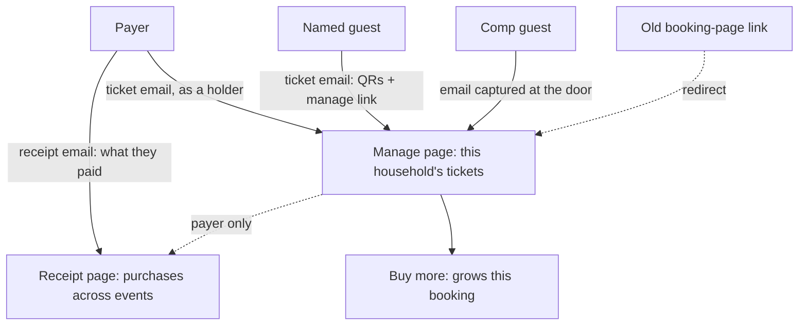
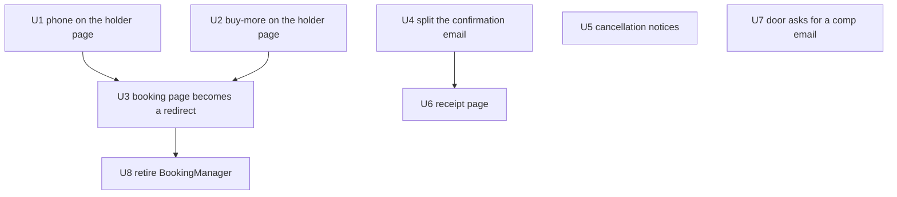
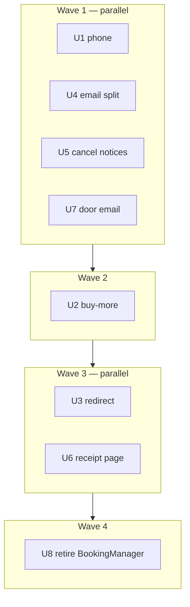

# Consolidate Ticket Surfaces - Plan

## Goal Capsule

- **Objective:** Give every ticket holder one page that manages their own tickets and lets them buy more, retire the payer's separate booking page, split ticket delivery from the receipt, and give the payer a receipt page.
- **Product authority:** This plan owns the guest-facing ticket surfaces, the ticket and receipt emails, the buy-more presentation, the receipt page, and the door's contact capture for comp guests. Admin surfaces are context, not scope.
- **Execution profile:** Additive work first, the redirect second, deletion last. No migration — a booking still has exactly one payer, so nothing new needs recording.
- **Stop conditions:** Stop and ask if the comp guest-list carve-out (KTD2) turns out to strand contactless comp guests, or if retiring `BookingManager` reveals a consumer outside the surfaces named in U8.
- **Tail ownership:** Standard — branch, tests, PR. Nothing here needs a staged rollout.
- **Open blockers:** None.

---

## Product Contract

### Summary

One page for anyone holding a ticket — their QR, name, email, phone, upgrade, cancel, and buy more — replacing the payer's separate booking page. Email splits so tickets follow the person and a receipt follows the money, and the payer gains a receipt page listing their purchases across events. Every ticket carries a name and an email, with comp guests the single exception, closed by the door asking at check-in.

### Problem Frame

Two guest-facing surfaces manage the same object. The payer opens a booking page listing the whole party; each holder opens a ticket page listing only the tickets on their own email. They overlap on QR display, name and email correction, and upgrades, and they diverge on everything else — the booking page alone can buy more tickets and capture a phone number, the ticket page alone can cancel and offer a calendar link. Neither is a superset.

The split exists because the model assumed a Lead who bought seats and then distributed them. That job has since been automated away: naming a guest at checkout mails them their own ticket, forwarding was retired, and every purchase path already demands a name and an email per seat. What remains on the payer's page is a role with almost nothing left to do, and a second presentation of a page that already exists, drifting from it.

The cost lands in three places. Guests who are not the payer cannot buy more tickets at all, so the club's own upsell reaches roughly the person least likely to want a second seat. Comp guests can attend and leave no contact behind — their email is optional when an admin adds them, and nothing captures it at the door — which puts them outside the follow-up the club runs on. And the drift between two surfaces and three templates is a standing tax: the same fix has to be made twice, or it silently is not.

### Product Contract preservation

Changed: KD3, KD4, KD11, R9, R10, R11, R19, R20 — and R21 retired. Research showed that routing buy-more through ordinary checkout would sell the buyer an extra seat for themselves (`app/api/events/[id]/register/route.ts` seeds a ticket for the purchaser unconditionally, where `app/api/public/bookings/[token]/topup/route.ts` states the opposite invariant), and that the unique index those decisions dropped is the race guard the webhook translates into a `needs_refund` tag at promotion. Buying more now grows the existing booking, the index stays, and the repeat-buyer warning is moot. Added: R22-R25 for the receipt page. All other requirements and IDs are unchanged.

### Key Decisions

- KD1. Retire the Lead as a management role. The payer bought seats; the system already delivers them. (session-settled: user-directed — chosen over keeping a read-only party overview for the payer: nothing is left for that surface to manage.) Governs R1, R2.
- KD2. Build the single surface on the existing ticket page. (session-settled: user-directed — chosen over merging into the booking page or keeping both: the ticket page is the newer design and already carries cancellation and calendar.) Governs R1, R3.
- KD3. Buying more lands on the buyer's own booking: the payer's purchase grows the booking they already hold, and a guest's purchase creates a booking of their own. (session-settled: user-directed — chosen over every purchase growing the booking it was bought from: money from a second person on one booking would let a refund draw against the wrong card, break the cancellation notice's recipient, and hide the buyer's own purchase behind the payer's receipt.) Governs R9, R10, R11.
- KD12. A guest's own booking carries no seat for them. They already hold the ticket they were given, so every seat their purchase buys is for someone else. (session-settled: user-directed — chosen over seeding them a seat as an ordinary first booking would: that leaves them holding two seats for themselves.) Governs R9.
- KD4. Keep one booking per person per event. (session-settled: user-directed — chosen over dropping the rule: it is the race guard behind concurrent double-capture, and buying more no longer needs it gone.) Governs R10.
- KD5. Changing a ticket's type keeps its own path. (session-settled: user-directed — chosen over folding it into checkout: it prices a difference against an existing booking rather than selling a new seat.) Governs R12.
- KD6. Every ticket is named and contactable; the Guest List is the only exception, and the door closes it. (session-settled: user-directed — chosen over allowing unnamed seats to persist: a ticket nobody can reach is a guest the club cannot follow up.) Governs R5, R6, R7.
- KD7. Capture phone after payment, never during it. (session-settled: user-directed — chosen over requiring phone at checkout: a required field at the payment form costs sales, and revenue is the primary aim.) Governs R4, R8.
- KD8. Cancellation notifies both the holder and the payer. (session-settled: user-directed — chosen over today's silence: retiring the payer's page removes the only place they could have noticed.) Governs R16, R17.
- KD9. Booking-page links already in inboxes keep working. (session-settled: user-directed — chosen over letting them break: live bookings hold those links now.) Governs R18.
- KD10. Two email templates, split by audience. (session-settled: user-directed — chosen over keeping three: tickets follow the person, the receipt follows the money.) Governs R13, R14, R15.
- KD11. The payer gets a receipt page, reached by their manage link and carrying money only. (session-settled: user-directed — chosen over a page showing who each ticket went to: that is the party overview KD1 retired, and the financial record is what the payer actually returns for.) Governs R22, R23, R25.

The surfaces and their audiences, after this change:

### Actors

- A1. Ticket holder — anyone whose address received a ticket, the payer included. Manages the tickets on their own address and may buy more.
- A2. Payer — whoever paid for a booking. Receives its receipts, reaches the receipt page, and is told when a seat they bought is cancelled. Holds no authority over anyone else's ticket.
- A3. Door staff — check guests in, and collect an email from a comp guest who has none.
- A4. Admin — builds guest lists, issues refunds, and reports on money.

### Requirements

**One holder surface**

- R1. Every ticket holder manages their tickets from one page, reached by their own manage link, showing each ticket's QR and offering name, email and phone correction, ticket-type change, cancellation, and buying more.
- R2. No surface grants write access to a ticket on another person's email address.
- R3. Buying more is present on that page as a floating action, secondary to the tickets themselves.
- R4. A holder may add or change a phone number on any ticket they control.

**Named and contactable tickets**

- R5. No path may create a ticket, or leave one standing, without a name and an email — except a Guest List.
- R6. An admin may add a Guest List guest with a name alone.
- R7. When a guest whose ticket carries no email is checked in, the door asks for one and records it against that ticket.
- R8. Phone is never required to complete a purchase.

**Buying more**

- R9. Buying more takes its own payment and adds seats to the buyer's own booking, creating one in their name when they hold none; no seat it buys is for the buyer.
- R10. A person holds at most one booking per event, and a booking has exactly one payer; that booking may carry several payments.
- R11. Added seats are priced at the booking's original rate class and checked against the event's remaining capacity before payment.
- R12. Changing a ticket's type remains a separate path that prices the difference against the booking that holds it.

**Email delivery**

- R13. Two templates carry event purchases: one delivering tickets, one delivering the receipt.
- R14. The ticket email reaches each holder at their own address, carrying their QR codes and their manage link.
- R15. The receipt reaches the payer, itemises what they paid, and carries no management link.

**Purchase history**

- R22. A payer reaches a receipt page from their own manage page. The page itself refuses a token that is not a payer's, rather than relying on the link being hidden.
- R23. The receipt page lists the payer's purchases in reverse chronological order across all events, each entry showing its date, charge reference, and the ticket types, quantities and prices it bought.
- R24. The receipt page renders from the booking's own recorded item lines, not from the payment provider's hosted receipt.
- R25. The receipt page is reached by the manage link alone and requires no login.

**Cancellation notice**

- R16. Cancelling a ticket emails the holder a confirmation, and emails the payer that a seat they bought was released with a refund to follow.
- R17. When the payer and the holder are the same address, one email is sent rather than two.

**Migration and compatibility**

- R18. A booking-page link already sent resolves to the holder's own manage page.
- R19. Each payment against a booking stays individually recorded, so a refund draws across the booking's whole charge pool.
- R20. Buying more is presented as an ordinary purchase; no guest-facing wording calls it a top-up.

### Key Flows

- F1. A holder buys more seats
  - **Trigger:** A ticket holder taps buy-more on their manage page.
  - **Actors:** A1, A2
  - **Steps:** They choose types and quantities; each new seat takes a name and an email; capacity is checked; they pay; the seats join their existing booking; each named person receives a ticket email and the buyer receives a receipt.
  - **Outcome:** The booking grows, every new seat is a named contactable holder with their own manage page, and the buyer's receipt page gains an entry.
  - **Covered by:** R9, R10, R11, R5, R13, R14, R15, R23

- F2. A guest cancels a seat someone else paid for
  - **Trigger:** A holder cancels a ticket from their manage page.
  - **Actors:** A1, A2, A4
  - **Steps:** The seat is released immediately; the holder is emailed a confirmation; the payer is emailed that a seat on their booking was released and a refund will follow; an admin later issues the refund.
  - **Outcome:** The seat is resellable at once, and the person owed the money knows without asking.
  - **Covered by:** R16, R17

- F3. A comp guest arrives with no email on file
  - **Trigger:** Door staff check in a Guest List guest whose ticket carries no email.
  - **Actors:** A3, A1
  - **Steps:** The door asks for an email as part of check-in and records it against the ticket.
  - **Outcome:** The guest becomes contactable for follow-up and holds a manage page like any other holder.
  - **Covered by:** R6, R7

- F4. Someone opens an old booking link
  - **Trigger:** A payer clicks the manage link in a confirmation email sent before this change.
  - **Actors:** A2
  - **Steps:** The link resolves the payer's own live ticket and forwards to its manage page.
  - **Outcome:** Previously sent email keeps working and lands on the surface that replaced the booking page.
  - **Covered by:** R18

- F5. The payer reviews what they have spent
  - **Trigger:** The payer opens their manage page and follows the receipt link.
  - **Actors:** A2
  - **Steps:** The page resolves every booking made from their address, newest first, and renders each payment's date, charge reference and purchased lines.
  - **Outcome:** The payer sees their whole purchase history without logging in.
  - **Covered by:** R22, R23, R24, R25

### Acceptance Examples

- AE1. **Covers R9, R10.** Given a person already holds a paid booking for an event, when they buy two more seats, then those seats join the existing booking and no second booking is created.
- AE2. **Covers R5, R9.** Given a buyer adds a seat without supplying that seat's email, when they try to pay, then the purchase is refused until a name and an email are present for every seat.
- AE3. **Covers R2.** Given a holder opens their manage page, when the booking contains tickets on other email addresses, then those tickets are neither shown nor editable.
- AE4. **Covers R7.** Given a Guest List guest whose ticket carries no email presents at the door, when staff check them in, then an email is requested and stored against that ticket.
- AE5. **Covers R6.** Given an admin builds a Guest List, when they add a guest with a name and no email, then the guest is added.
- AE6. **Covers R17.** Given the payer is also the holder of the cancelled ticket, when they cancel, then they receive one email rather than a holder confirmation and a payer notice.
- AE7. **Covers R8.** Given a buyer leaves phone blank, when they complete checkout, then the purchase succeeds.
- AE8. **Covers R11.** Given an event has fewer remaining seats than a buy-more requests, when the buyer tries to pay, then it is refused on the same capacity terms as a first booking.
- AE9. **Covers R15.** Given a payer receives their receipt, when they read it, then it itemises what they paid and offers no link that manages tickets.
- AE10. **Covers R22.** Given a household member who did not pay opens their manage page, when they look for a receipt link, then none is shown.
- AE11. **Covers R23.** Given a payer has paid for three events, when they open the receipt page, then all three appear newest first, each with its own charge reference and purchased lines.
- AE12. **Covers R18.** Given a payer whose own ticket was cancelled opens an old booking link, when the redirect resolves, then they land on a page that explains the booking rather than a not-found error.

### Success Criteria

Revenue is the primary aim; the maintenance win is secondary.

- Seats bought after a booking's initial purchase rise, measured as follow-on payments per event. Today only the payer can make one.
- The share of live tickets carrying a phone number rises. It sits near half today, and phone is capturable on only one of the two surfaces.
- The share of comp guests holding an email after their event rises from none.
- One holder surface and two event-purchase templates replace two surfaces and three templates, with no capability lost from either surface.

### Scope Boundaries

- The "bring someone" host framing — reframing buy-more as inviting a named guest who can then invite others. The compounding it aims at already emerges once every holder has their own page with its own buy-more.
- Redesigning admin surfaces. They keep reading what they read today.
- A login-backed purchase history. The manage link carries the receipt page without auth (R25); a member-portal route is a later question.
- The waiver text and the waiver acceptance flow, settled separately.

#### Deferred to Follow-Up Work

- Comp guest-list QR delivery. The sponsor's booking page is today the only surface rendering contactless comp guests' QRs, so it survives for comp registrations under KTD2 rather than being deleted with the rest. Moving comp delivery to an admin surface, and finishing the deletion, is its own piece of work.
- Reminder and receipt de-duplication when one inbox holds several bookings across events.

### Dependencies / Assumptions

- This work lands after the guest waiver flow merges, since both change the holder's manage page.
- `CONCEPTS.md` needs revising with this change: Lead stops being a management role, Booking Page narrows to the comp carve-out, and Ticket can no longer be "an open slot the Lead has yet to assign". The Top-up entry stays accurate; only its guest-facing name changes (R20).
- The payer's address stays meaningful as the party who paid and remains the receipt recipient, even though it confers no management authority.
- A manage link is shareable within a household by design. The receipt page is therefore gated on the lead flag rather than on the address alone (KTD4), so sharing a link does not share what was paid.

### Outstanding Questions

**Deferred to Implementation**

- Whether the redirect should resolve a payer who holds several live tickets on their address to any one of them, or to the earliest-minted. Either satisfies R18; the implementer picks when the household resolver is in front of them.
- Whether the cancellation notices need their own idempotency stamp or can rely on the cancel guard already being single-shot.

### Sources / Research

- `components/public/BookingManager.tsx` and `components/public/TicketManager.tsx` — the two surfaces. Buying more and phone capture exist only on the first; naming, correction, upgrade and cancellation already exist on the second.
- `lib/events/household.ts` — resolves a holder's tickets by shared email within one booking; the model the single surface inherits. `HouseholdTicket` carries no phone today.
- `supabase/migrations/20260521120000_event_registrations_dedupe_index_and_converted_by.sql` — the unique index KD4 keeps, and `docs/solutions/database-issues/partial-unique-index-stripe-webhook-23505-deadlock-2026-05-21.md` for the four code paths that translate its violation.
- `app/api/public/bookings/[token]/topup/route.ts` — the buy-more path, including its stated invariant that a top-up seeds no lead slot, and its capacity gate.
- `app/api/public/bookings/[token]/cancel/route.ts` and `convert/route.ts` — the dual-token auth shape to mirror, and `convert`'s post-checkout redirect to the booking page.
- `lib/email/event-registration.ts`, `lib/email/household-tickets.ts`, `lib/email/ticket-qr.ts` — the three templates, their recipients, and which link each carries. `scripts/postmark/delete-ticket-forward-template.mjs` is the precedent for retiring one.
- `lib/admin/finance.ts` and `lib/events/refund-pool.ts` — money reads item lines, which is what R24 renders from; the refund pool documents why each payment stays individually recorded.
- `components/door/DoorConsole.tsx` — `SlotRow` already opens contact fields when a guest has neither email nor phone, and the Guest lists tab renders the same row deliberately so capture cannot diverge.
- `docs/solutions/best-practices/retire-a-live-flow-drop-the-write-path-keep-the-history.md` — the retirement sequence U3 and U8 follow.
- `docs/solutions/database-issues/contact-only-replay-guard-swallows-people-sharing-an-email.md` — why identity is name plus contact, and where the guard lives.
- `docs/solutions/tooling-decisions/adopt-libphonenumber-js-for-e164-phone-normalization.md` — mandatory at every phone entry point.

---

## Planning Contract

### Key Technical Decisions

- KTD1. Buy-more reuses the existing top-up route rather than ordinary checkout. (session-settled: user-directed — chosen over routing it through `app/api/events/[id]/register/route.ts`: that route seeds a ticket for the purchaser and would sell the buyer a seat for themselves.) Governs R9, R11, R20. Only the guest-facing presentation changes; the route, its capacity gate and its naming guard stay.
- KTD2. The booking page becomes redirect-only for ordinary registrations and survives for comp guest lists. It is the only surface rendering contactless comp guests' QRs, and sponsors also buy paid seats onto their comp list. Governs R18. The full deletion is deferred (see Scope Boundaries).
- KTD3. The receipt page renders each payment from its own source, with that payment's `stripe_payment_intent_id` as its charge reference. (session-settled: user-directed — chosen over the payment provider's hosted receipt: the item lines are already the ledger finance reads, and no live call is needed per view.) Governs R23, R24. The grouping matters: applied buy-more rows write their lines into the same item table as the original checkout, so rendering the whole table per booking would merge every payment into one list or double-count. The original payment renders from the item lines less what each applied buy-more contributed; each later payment renders from its own row.
- KTD4. The receipt page is reached by a manage link, scoped by the payer address recorded on the registration, and gated on the token's ticket carrying the lead flag. (session-settled: user-directed — chosen over a login-backed history: the manage link already proves control of the address, and no new auth is warranted.) Governs R22, R25. The lead-flag gate is what makes the scope safe: R1 lets a holder rewrite their own ticket's email, so scoping on that field alone would let anyone read another person's spend by editing their address to match. The lead flag and the registration's own email are writable by neither the holder route nor the door route.
- KTD5. Contact capture tightens `SlotRow` rather than adding a comp-only branch. The Guest lists tab renders the same row on purpose so waiver, contact and arrival state cannot diverge. Governs R7.
- KTD6. Cancellation notices are best-effort and logged, matching every other send in the repo. A failure never blocks the cancellation, whose seat release is the load-bearing effect. Governs R16.
- KTD7. Phone entering the holder page normalises through `libphonenumber-js`, as every other phone entry point does. Governs R4.

### High-Level Technical Design

The work is additive until the redirect. Each unit below leaves both surfaces working; only U3 changes which one a link reaches, and only U8 removes code.

U4 and U6 share the line-rendering shape: the receipt email and the receipt page itemise the same data, so the helper that turns a booking's item lines into displayable lines is written once in U4 and reused in U6.

**File contention, for parallel execution.** The per-unit `Dependencies` fields declare logical order only. Three units — U1, U2 and U6 — each edit `components/public/TicketManager.tsx` and its test while declaring no dependency on one another, so running them concurrently conflicts on the plan's busiest file. U3 and U8 both edit the booking page, but U8 already depends on U3, so that pair is ordered. Concurrent execution should therefore run in waves:

The critical path is U1 → U2 → U3 → U8. U6 joins wave 3 because it needs U4's renderer and the same file U2 just edited.

### Assumptions

- The top-up route's existing capacity gate is the right one for buy-more; no new capacity logic is needed (R11).
- `event_registration_items` carries enough to render a receipt line — type title, quantity, and line total. If a price-per-unit is missing, the implementer derives it rather than adding a column.
- The comp carve-out in KTD2 is temporary. If it proves that no comp sponsor link is live on an upcoming event, the carve-out can be dropped during implementation and the page deleted outright in U8.

### Risks

- **U2 widens auth on a route that spends money.** The buy-more route is public, unauthenticated beyond its path token, and creates Stripe sessions. Accepting a second token type widens what can reach it. The resolved ticket must belong to the same registration the purchase lands on, and a token from another booking must be refused — U2's test scenarios pin both.
- **The receipt page widens what a manage link grants.** A link that today manages tickets will also reveal what was paid. Manage links are shareable within a household by design, so this is exposure to the same mailbox rather than a leak — but it is a widening, and it is why R22 shows the link only on the payer's own page.
- **The comp carve-out defers a deletion rather than avoiding it.** The booking page survives for guest lists, so the duplication this plan removes is not fully gone. Finishing it needs the same proof U3 required: that no live comp sponsor link points at an upcoming event.

---

## Implementation Units

### U1. Phone on the holder page

**Goal:** A holder can add or change a phone number on any ticket they control.

**Requirements:** R4, R8. Instantiates KTD7.

**Dependencies:** None.

**Files:**
- `lib/events/household.ts`
- `lib/events/household.test.ts`
- `components/public/TicketManager.tsx`
- `components/public/TicketManager.test.tsx`

**Approach:**
1. Add `phone` to `HouseholdTicket` and to the shared column projection, so the ticket page receives it the way it already receives email.
2. Add a phone field to the edit control, alongside name and email.
3. Send `phone` in the fill request. The route already accepts and normalises it — only the client omits it today.

**Patterns to follow:** `components/public/BookingManager.tsx` has the existing phone field and its `PhoneInput` usage; mirror that shape rather than inventing one.

**Test scenarios:**
- A holder saves a phone number and it is sent in the fill request body.
- A holder clears a phone number and the ticket saves without one, since phone is never required.
- `resolveHousehold` returns the stored phone on each ticket.
- A ticket with no phone stored resolves to an empty value rather than undefined.

**Verification:** The ticket page shows and saves a phone number, and `resolveHousehold` carries it.

### U2. Buy-more on the holder page

**Goal:** Any holder can buy more seats onto their booking from their own manage page.

**Requirements:** R3, R5, R9, R10, R11, R20. Instantiates KTD1.

**Dependencies:** None.

**Files:**
- `app/(checkin)/public/tickets/[token]/page.tsx`
- `components/public/TicketManager.tsx`
- `components/public/TicketManager.test.tsx`
- `app/api/public/bookings/[token]/topup/route.ts`
- `app/api/public/bookings/[token]/topup/route.test.ts`

**Approach:**
1. Widen the top-up route's auth to accept a per-ticket manage token as well as the registration token, mirroring the dual-token resolution in `cancel/route.ts`. A ticket token resolves to its registration; the purchase still lands on that one booking.
2. Pass the buy-more endpoint and the buyable ticket types into the ticket page, the way the booking page already resolves them.
3. Render buy-more as a floating action, with the per-seat name and email fields the route already requires.
4. Send the post-checkout return to the ticket page rather than the booking page.

**Patterns to follow:** `BuyMorePanel` in `components/public/BookingManager.tsx` for the panel's shape and the per-seat inputs; `cancel/route.ts` for the dual-token resolution.

**Test scenarios:**
- A per-ticket manage token is accepted and the purchase lands on that ticket's booking.
- A registration manage token still works, so old links do not regress.
- A ticket token for a different booking is refused.
- A seat submitted without an email is refused before any payment is created.
- A request exceeding remaining capacity is refused with the existing message.
- The success and cancel return URLs point at the ticket page.

**Verification:** A household member who did not pay can buy a seat onto the booking, and it appears on their manage page.

### U3. The booking page becomes a redirect

**Goal:** An old booking-page link lands on the holder's own manage page, and comp sponsors keep their page.

**Requirements:** R18. Instantiates KTD2.

**Dependencies:** U1, U2 — the ticket page must carry everything the booking page did before any link is pointed at it.

**Files:**
- `app/(checkin)/public/bookings/[token]/page.tsx`
- `app/api/public/bookings/[token]/convert/route.ts`

**Approach:**
1. Resolve the registration by its manage token. If it is a comp guest list, keep rendering the existing page.
2. Otherwise resolve the payer's own live ticket and redirect to its manage page.
3. When the payer holds no live ticket — cancelled, released, or never minted — render a short notice explaining the booking rather than a not-found error.
4. Repoint `convert`'s post-checkout redirect at the ticket page so an upgrade bought through Stripe does not land on a redirect.

**Execution note:** Prove the redirect before deleting anything. U8 depends on this unit being correct, and a wrong redirect is invisible until someone clicks an old email.

**Test scenarios:**
- A registration token for an ordinary booking redirects to the payer's ticket manage page.
- A registration token for a comp guest list still renders the sponsor page.
- A payer whose own ticket was cancelled gets an explanatory notice, not a 404.
- A payer holding several live tickets on their address redirects to one of them deterministically.
- An unknown or rotated token still renders the existing not-found notice.

**Verification:** Every previously sent booking link resolves to something useful, and upgrades return to the ticket page.

### U4. Split the confirmation email into tickets and receipt

**Goal:** Tickets and the receipt arrive as separate emails with separate audiences.

**Requirements:** R13, R14, R15. Advances R23 by producing the shared line renderer.

**Dependencies:** None.

**Files:**
- `app/api/webhooks/stripe/route.ts`
- `lib/email/event-registration.ts`
- `lib/email/event-registration.test.ts`
- `lib/email/household-tickets.ts`
- `lib/events/receipt-lines.ts`
- `lib/events/receipt-lines.test.ts`
- `docs/email-templates/event-receipt.html`
- `docs/email-templates/event-receipt.txt`
- `scripts/postmark/create-event-receipt-template.mjs`

**Approach:**
1. Extract a helper that turns a booking's item lines into displayable receipt lines — type title, quantity, unit and line totals. U6 reuses it.
2. Add a receipt template carrying those lines, the paid date, the reference code and the charge reference; no QR, no manage link.
3. Reduce the confirmation sender to the receipt, and let the grouped ticket email carry the payer's own QR the way it already carries every other holder's.
4. Give the receipt sender an optional paying-row identifier and pass it from each of the webhook's three send sites — initial payment, buy-more, priced conversion. The sender has no other way to know which payment it is receipting, and the webhook is the only call-site.
5. Retire the single-ticket correction template once nothing sends it, following the existing delete-script precedent, and add its delete script alongside the receipt template's create script.

**Patterns to follow:** `lib/email/household-tickets.ts` for the sender shape and its test; `scripts/postmark/create-*-template.mjs` for the idempotent push; `scripts/postmark/delete-ticket-forward-template.mjs` for the retirement.

**Test scenarios:**
- The receipt template model carries the itemised lines, total, reference and charge reference.
- The receipt template model carries no manage link and no QR URL.
- The payer receives a ticket email carrying their own QR.
- A booking with several payments renders one receipt per payment, not one merged total.
- A send failure is logged and leaves the idempotency stamp unset.
- Covers AE9. A receipt offers no link that manages tickets.

**Verification:** A purchase produces one ticket email per address and one receipt to the payer.

### U5. Cancellation notices

**Goal:** Cancelling a ticket tells both the holder and the payer.

**Requirements:** R16, R17. Instantiates KTD6.

**Dependencies:** None.

**Files:**
- `app/api/public/bookings/[token]/cancel/route.ts`
- `app/api/public/bookings/[token]/cancel/route.test.ts`
- `lib/email/cancellation-notice.ts`
- `lib/email/cancellation-notice.test.ts`
- `docs/email-templates/event-cancellation-holder.html`
- `docs/email-templates/event-cancellation-holder.txt`
- `docs/email-templates/event-cancellation-payer.html`
- `docs/email-templates/event-cancellation-payer.txt`

**Approach:**
1. After the seat is released, send the holder a confirmation and the payer a notice that a seat was released with a refund to follow.
2. Compare the two addresses case-folded and trimmed; when they match, send once.
3. Skip the payer notice when the booking carries no payment, since there is no refund to promise.
4. Keep both sends best-effort and logged, so a mail failure never blocks the release.

**Test scenarios:**
- A holder cancelling a seat on someone else's booking produces two emails.
- Covers AE6. When payer and holder share an address, one email is sent.
- Addresses differing only in case or surrounding whitespace count as the same address.
- A free or comp booking produces the holder confirmation and no payer notice.
- A failing send is logged and the cancellation still succeeds.
- The seat is released before either send is attempted.

**Verification:** Cancelling a seat frees it and notifies the right people exactly once each.

### U6. The receipt page

**Goal:** The payer reviews every purchase they have made, across events, from their manage page.

**Requirements:** R22, R23, R24, R25. Instantiates KTD3, KTD4.

**Dependencies:** U4 — the line renderer it reuses.

**Files:**
- `app/(checkin)/public/tickets/[token]/receipt/page.tsx`
- `lib/events/purchase-history.ts`
- `lib/events/purchase-history.test.ts`
- `components/public/TicketManager.tsx`
- `components/public/TicketManager.test.tsx`

**Approach:**
1. Resolve the manage token to its ticket. Refuse unless that ticket carries the lead flag — this is the access control, per KTD4.
2. Take the payer address from that ticket's registration, then find every registration recording the same payer address, newest first.
3. For each, render its payments — the original and each buy-more — with date, charge reference, and the lines the U4 helper produces. A payment carrying a recorded refund renders annotated as refunded with the amount returned.
4. Show the receipt link on the manage page under the same lead-flag condition, so link and page agree.
5. Carry the same `referrer: no-referrer` metadata every token page uses, since the URL holds a manage token.

**Test scenarios:**
- Covers AE11. A payer with purchases across three events sees all three, newest first.
- Covers AE10. A household member who is not the payer sees no receipt link on their manage page.
- A non-payer who edits their own ticket's email to the payer's address is still refused by the route, not merely denied the link.
- A non-payer requesting the receipt URL directly gets the not-found notice.
- Each payment on one booking appears as its own entry with its own charge reference.
- A refunded payment renders annotated as refunded rather than as an outstanding charge.
- A booking with no payment — comp or free — renders without a charge reference rather than breaking.
- An unknown or rotated manage token renders the not-found notice.
- The page carries no-referrer metadata.

**Verification:** The payer opens the receipt page from their manage page and sees their full purchase history without logging in.

### U7. The door asks a comp guest for an email

**Goal:** A guest whose ticket carries no email is asked for one at check-in.

**Requirements:** R6, R7. Instantiates KTD5.

**Dependencies:** None.

**Files:**
- `components/door/DoorConsole.tsx`
- `components/door/DoorConsole.test.tsx`
- `app/api/public/door/[id]/save-attendee/route.ts`
- `app/api/public/door/[id]/save-attendee/route.test.ts`

**Approach:**
1. Tighten only the condition that *opens* `SlotRow`'s contact prompt: open it when a ticket has no email, rather than when it has neither email nor phone.
2. Leave the save validation alone. Client and route keep accepting email or phone, so a phone-only guest still saves — tightening the save would refuse ordinary walk-ups, since the same row serves every tab.
3. Give the prompt a visible dismiss control, so a guest who declines can be closed out and checked in. Today the Cancel button is withheld while contact is missing, which would strand a declining guest in an unsavable row at the front of a queue.

**Execution note:** Change `SlotRow` itself. The Guest lists tab renders the same row on purpose so contact capture cannot diverge between tabs; a comp-only branch would reintroduce exactly that split.

**Test scenarios:**
- Covers AE4. A guest with no email is prompted for one at check-in.
- A guest who declines can be dismissed and checked in without an email.
- A phone-only guest still saves through both the client and the route.
- A guest who already has an email is not prompted.
- A guest with a phone but no email is still prompted, since email is what the follow-up needs.
- The saved email is normalised and stored against that ticket.
- The Guest lists tab and the Attendees tab prompt identically.

**Verification:** A comp guest checked in without an email is asked for one, and admission never depends on the answer.

### U8. Retire BookingManager

**Goal:** The duplicated ordinary-registration surface is gone, and no guest-facing copy points a paying holder at a booking page.

**Requirements:** Advances the consolidation behind R1 and R2.

**Dependencies:** U3.

**Files:**
- `components/public/BookingManager.tsx`
- `app/(checkin)/public/bookings/[token]/page.tsx`
- `app/(public)/public/offers/[token]/page.tsx`

**Approach:**
1. Extract the comp guest-list view — the sponsor's guests, their QRs, and the sponsor's own paid seats — out of `BookingManager` into a comp-only component. The booking page renders that for a guest-list token and the U3 redirect for everything else.
2. Delete `BookingManager` and any component only it used, once the comp view no longer depends on it.
3. Grep for the retired nouns as well as the retired paths — "booking page", "lead booking", "my booking" survive in comments and copy long after the type-checker is satisfied.
4. Fix the offers page comment that cites the booking page as precedent.

**Execution note:** Deletion last, in its own commit, once the redirect is proven. This mirrors how the repo retired self-registration and the forward RPCs.

**Test scenarios:**
- A comp guest-list token still renders its guests and their QRs after `BookingManager` is deleted.
- A sponsor's own paid seats still render on the comp view.
- An ordinary registration token still redirects, unaffected by the extraction.

**Verification:** The suite passes with `BookingManager` deleted, the comp sponsor view still renders, and no comment or copy still points a paying holder at a booking page.

---

## Verification Contract

| Gate | Command | Applies to |
|---|---|---|
| Unit and component tests | `npm run test:unit` | All units |
| Type check | `npx tsc --noEmit` | All units |
| Lint | `npm run lint` | All units |
| Postmark templates pushed | `node scripts/postmark/create-event-receipt-template.mjs` | U4 |

`npm test` runs Playwright against the shared production database and is not part of this contract. Use `npm run test:unit`.

Component tests need the `// @vitest-environment jsdom` docblock on the first line. Route tests mock `@/lib/supabase/admin` and never reach a database.

Beyond the gates: U3's redirect and U7's door prompt both need a browser pass, because neither is provable in jsdom — the redirect resolves a real token chain, and the door prompt is a queue-side interaction.

---

## Definition of Done

**Global**

- Every requirement R1-R25 is either implemented or explicitly carried in Scope Boundaries.
- `npm run test:unit`, `npx tsc --noEmit` and `npm run lint` all pass.
- The receipt template exists in Postmark and the retired template is removed.
- No abandoned or experimental code remains in the diff. A surface that was tried and dropped is deleted, not commented out.
- `CONCEPTS.md` is updated for the Lead, Booking Page and Ticket entries.

**Per unit**

| Unit | Done when |
|---|---|
| U1 | A phone number saves from the ticket page and resolves back onto the household |
| U2 | A non-paying household member buys a seat onto the booking from their own page |
| U3 | Every old booking link resolves to a manage page, a comp page, or an explanatory notice |
| U4 | One purchase sends one ticket email per address and one receipt to the payer |
| U5 | A cancellation notifies holder and payer once each, and never blocks the seat release |
| U6 | The payer sees every purchase across events from their manage page, without logging in |
| U7 | A contactless comp guest is asked for an email at check-in and is admitted either way |
| U8 | `BookingManager` is deleted and no reference to a booking page survives in code or copy |
