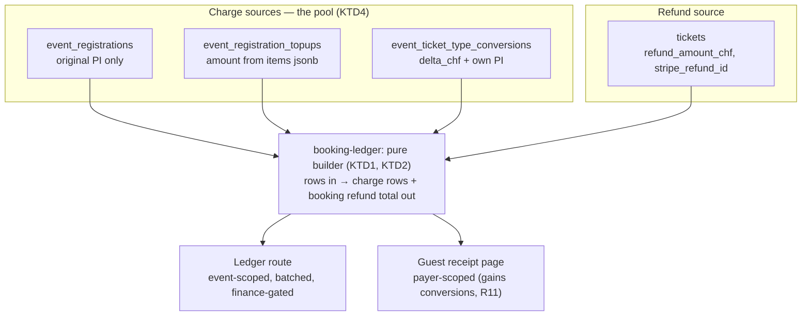
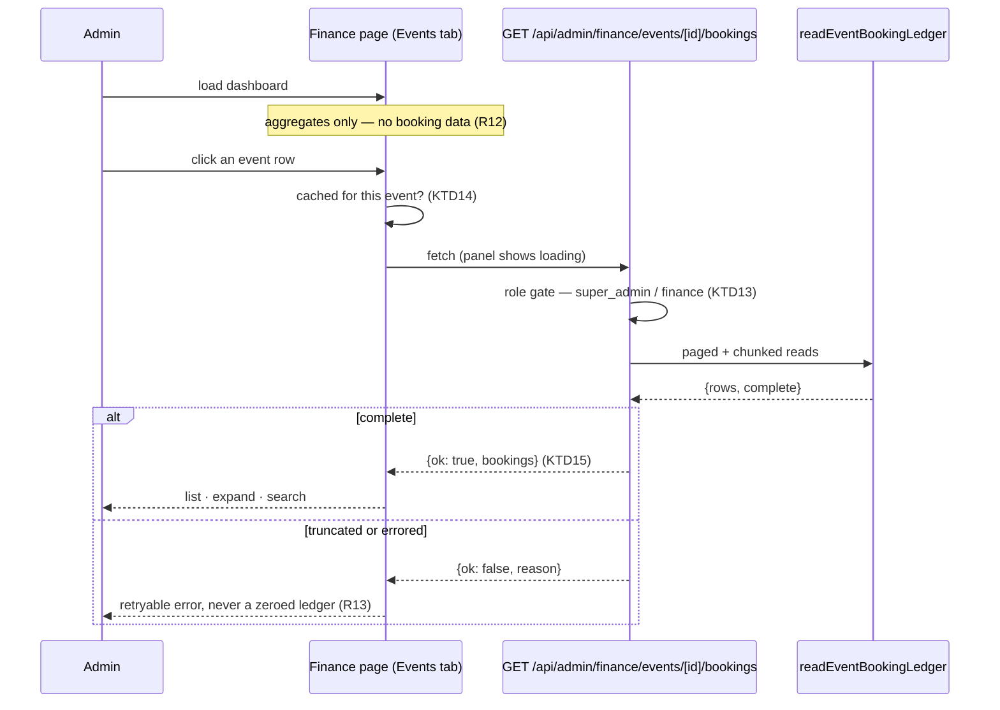

# Admin Bookings Ledger - Plan

## Goal Capsule

- **Objective:** Give an admin one place to answer "what did this booking actually pay?" — every charge and every refund on a booking, for one event, searchable by reference code.
- **Product authority:** This plan owns the finance dashboard's Events-tab booking drill-down, the API route behind it, and the shared payment-row builder. The Refunds tab, the finance dashboard's existing aggregate panels, and the guest receipt page's presentation are context, not scope — except for the one change R11 names.
- **Execution profile:** Shared builder first, then the event-scoped reader, then the route, then the surface. No migration; every column this needs already exists.
- **Stop conditions:** Stop and ask if extracting the shared builder changes what the guest receipt renders beyond the three deltas R11 names, or if id-chunking turns out to need a database-side aggregate instead.
- **Tail ownership:** Standard — branch, tests, PR.
- **Open blockers:** None.

---

## Product Contract

### Summary

A **booking drill-down on the finance dashboard's Events tab**. Each event row on `EventRevenuePanel` opens a side panel listing that event's bookings; a booking expands to its full financial history — the original checkout, each applied buy-more top-up, each applied priced conversion, and refunds. Read-only, searchable by booking reference, and **loaded on demand**: the finance page's initial payload is unchanged.

### Problem Frame

The finance dashboard's Events tab is the only one of its three tabs with no transaction-level view. Membership drills a tier or month down to its underlying payments through `FinanceDetailModal`; Originator drills a commission down to its transactions through `OriginatorBreakdownPanel`. Events has three aggregate panels — by event, by month, by ticket type — and nothing underneath any of them. The one revenue stream whose natural unit is a booking is the one that cannot be opened.

The data is already computed and then discarded. `getFinanceTransactions` reads registrations, item lines and tickets and clamps refunds per booking, then hands the rows to `/admin/finance/export` as CSV and nowhere else. The dashboard's own button reads "Export all transactions", so an admin can download detail the app refuses to display.

Underneath, a booking's money story is scattered across four tables and no surface assembles it. `event_registrations` records only the *first* payment intent — the top-up and conversion webhook branches return before that column is written. Top-ups live in `event_registration_topups` with no amount column at all; their value has to be summed out of a jsonb `items` array. Priced conversions live in a third table. Refunds are recorded on `tickets`. `getFinanceTransactions` reads none of the top-up or conversion tables, so it has correct booking *totals* and no per-charge story at all.

Nothing in the repo aggregates this per booking. `lib/admin/finance.ts` is range-scoped and cross-event. `lib/events/purchase-history.ts` is payer-scoped, cross-event, token-gated, and blind to conversions. An admin asking what one booking paid reads three tables by hand.

### Requirements

**The ledger**

- R1. Every settled booking on the event — status `paid` or `free` — appears, showing its reference code, payer, and status. An abandoned checkout never took money and is not a ledger row.
- R2. A booking expands to its charges in chronological order: original checkout, each applied top-up, each applied priced conversion.
- R3. Each charge shows its date, amount, what it bought, and its Stripe payment reference.
- R4. A charge with no Stripe payment reference renders as a legitimate state, not a broken link.
- R5. Refunds are reported against the booking as a whole, never attributed to an individual charge.
- R6. A booking's total is derived from its item lines, not from the registration's stored total.

**Search**

- R7. The panel filters by booking reference; the same input also matches payer name and email.

**On demand**

- R12. The finance page's initial load is unchanged. No booking data is fetched, and no payer name, email or Stripe identifier enters the page payload, until an admin opens an event's panel.
- R13. The panel shows a loading state while its fetch is in flight, and a retryable error state if the fetch fails. A failed fetch never renders as an empty or zeroed ledger.
- R14. Only `super_admin` and `finance` can read the ledger. The gate is enforced on the server route, not only by the page the panel sits on.

**Honesty**

- R8. The ledger refuses to render rather than show a money figure built on a truncated or failed read.
- R9. Amounts and dates render through the repo's shared formatters.

**One builder, two surfaces**

- R10. A single payment-row builder serves both the admin ledger and the guest receipt page, so the two cannot disagree about a booking's charges.
- R11. The guest receipt page changes in exactly four ways as a consequence of R10, and in no others: it gains conversion rows; the original charge's line composition is relabelled per KTD5; amounts may shift by up to one centime where KTD9's single rounding helper replaces `Number(x.toFixed(2))`; and a cancelled-then-released seat stops being double-counted in the refund total, which it is today. These four are the expected delta against U1's characterization baseline; a fifth is a stop condition.

### Key Decisions

- KD1. The panel is a read-only ledger; the event page's Refunds tab keeps the action queue and its due badge. (session-settled: user-directed — chosen over one merged money surface: an action queue and a reading surface have different jobs, and merging would bury the refunds-due signal.) Under KD4 the two now live on different pages, which reinforces rather than weakens this split. Governs R1, R2, R5.
- KD2. Refunds are reported against the booking, never against a charge. (session-settled: user-approved — chosen over per-payment attribution: tickets carry no reference to the charge that minted them, so any per-charge split would be invented rather than recorded.) Governs R5.
- KD3. Scope is financial activity, not a general audit trail of ticket edits. (session-settled: user-directed — chosen over a booking-level roster view: who-booked-for-whom is the Attendees tab's question.) Governs R2.
- KD4. The ledger lives on the finance dashboard's Events tab, not on the event page. (session-settled: user-directed — chosen over a Bookings tab beside Refunds on `/admin/events/[id]/attendees`.) Two reasons. It completes an existing asymmetry: Membership and Originator both drill down to transactions and Events does not, so a booking drill-down is the missing third rather than a new idea. And it puts a club-wide financial reading surface behind the gate that already governs club-wide financial reading. Note the role argument is narrower than it first appears — `events_admin` is in the refund route's allowlist and already sees refund amounts on the Refunds tab, so this is not closing a hole; it is a judgment that a full charge ledger reads as finance rather than as event operations. The cost is recorded under Risks. Governs R1, R14.
- KD5. The ledger loads on demand, not with the page. (session-settled: user-directed — chosen over passing it as a server prop.) The finance page already performs whole-table reads for its summary; adding an unconditional booking ledger would compound that on every visit, for a panel most visits never open. Fetching on open also means R12 holds for free: no payer PII sits in the page payload of a dashboard that is mostly read for aggregates. Governs R12, R13.

### Acceptance Examples

- AE1. **Covers R2, R6.** Given a booking that paid at checkout and later bought two more seats, when an admin expands it, then two charge rows appear and the booking total equals their sum — not the registration's stored total.
- AE2. **Covers R5.** Given a booking with one refunded seat across a two-charge pool, when an admin expands it, then the refund appears once against the booking, not split across the two charges.
- AE3. **Covers R4.** Given a zero-delta conversion applied without checkout, when its row renders, then it shows as applied with no Stripe link and no error state.
- AE4. **Covers R8.** Given the top-ups read is truncated at the row cap, when the panel loads, then it fails loudly instead of rendering a total missing those charges.
- AE5. **Covers R11.** Given a guest whose ticket type was upgraded for a fee, when they open their receipt page, then the upgrade appears as its own charge.
- AE6. **Covers R12.** Given an admin loads the finance dashboard and opens no panel, when the page payload is inspected, then it contains no booking rows and no payer email.
- AE7. **Covers R13.** Given the ledger route returns a 503, when the panel is open, then it shows a retryable error rather than an empty booking list.
- AE8. **Covers R14.** Given an `events_admin` calls the ledger route directly, when the request is handled, then it is refused with 403 regardless of the page they came from.

### Scope Boundaries

- Issuing or closing refunds. That stays in the Refunds tab (KD1).
- Non-financial history — name corrections, waiver acceptance, check-in.
- Cross-event booking search. The panel is opened from one event's row and is scoped to that event. A reference-code lookup that does not already know the event is a larger surface with a different read shape, and would break the hundreds-scale assumption below.
- A Bookings tab on the event page (KD4). If event staff turn out to need booking-level payment lookup, the answer is a payment *status* on the existing Attendees roster, not a second copy of this ledger.
- Pending and abandoned checkouts (R1). A registration that never reached `paid` or `free` has no money to account for; the page's existing status filter already excludes them.

#### Deferred to Follow-Up Work

- A `charge.refunded` webhook. See KTD7 — the gap it would close is currently held by process.
- Fixing `resolvePurchaseHistory`'s unpaged, unfiltered registrations read (`lib/events/purchase-history.ts`). It is a latent correctness bug at scale, found during this research, but it is on the payer path and not on this plan's critical path. Note this is a narrow deferral inside a function the plan otherwise substantially rewrites: U1 moves its charge-building out, changes its rounding, and adds two reads to it. Only the registrations read's paging is deferred — and the KTD4 `is_lead` access gate, which sits one call above the moved code, must not move with it.
- Capturing the per-booking ledger read model as a `docs/solutions/` entry. The Receipt Page's design reasoning currently survives only in source comments.

### Sources / Research

- `lib/events/purchase-history.ts` — `buildPayments` and `refundedForBooking` are the reusable core; `resolvePurchaseHistory` is payer-scoped and not reusable. Its own header names the conversion gap.
- `lib/events/refund-pool.ts` — the header states why per-charge refund attribution has no true answer, and that a booking's charge pool spans three tables.
- `lib/admin/finance.ts` — `amountOf` (item lines over stored total), refund clamping, and the `fetchAll` → pure-aggregator split this plan mirrors.
- `lib/events/refunds.ts` — `refundedAmountChf`, `resolveTicketLine`. Shared by three surfaces so they cannot disagree about a seat's value.
- `lib/events/receipt-lines.ts` — `subtractReceiptItems` scopes the original checkout's lines against later top-ups.
- `components/admin/CancellationsPanel.tsx` — what the Refunds tab already shows, so this panel complements rather than repeats it.
- `lib/admin/finance.ts` — `getFinanceTransactions` builds settled per-booking rows with per-booking refund clamping and sends them only to CSV. Read it before U2: it is the closest existing thing to this reader, and it reads no top-ups and no conversions.
- `components/admin/finance/FinanceDashboard.tsx` and `tabs.ts` — the Events tab's three aggregate panels, and the reason the tab vocabulary lives in a directive-free module (a `"use client"` export may be rendered by the server but never called by it).
- `components/admin/finance/FinanceDetailModal.tsx` — the drill-down surface the Membership tab already has, and the model for this one.
- `components/admin/finance/EventRevenuePanel.tsx` — `EventRevenue` already carries `eventId`; the rows are simply not interactive.
- `app/(admin)/admin/finance/page.tsx` — the `["super_admin", "finance"]` page gate KTD13 mirrors.
- `lib/events/guest-list-auth.ts` — `assertAdmin`'s shape, its wider allowlist, and the build-error reason it is a separate module from the route.
- `app/api/admin/events/[id]/tickets/[ticketId]/refund/route.ts` — `events_admin` is in its allowlist, which is why KD4 is a judgment about what the surface is rather than a security fix.
- `docs/solutions/best-practices/a-comment-that-justifies-an-omission-is-load-bearing.md` — the CHF 960 / CHF 400 incident. Read before starting.
- `docs/solutions/database-issues/supabase-row-fetch-undercount-when-aggregating-2026-05-19.md` — the silent 1000-row cap.
- `docs/solutions/runtime-errors/use-client-export-invoked-from-server-component.md` — why a green build proves nothing about an admin page rendering.

---

## Planning Contract

### Key Technical Decisions

- KTD1. One conversion-aware payment-row builder, extracted from `lib/events/purchase-history.ts` into a shared module, serving both surfaces. (session-settled: user-approved — chosen over an admin-only sibling module: two builders drift, which is the failure the shared `lib/events/refunds.ts` exists to prevent.) Governs R10, R11.
- KTD2. The builder is pure over already-fetched rows. `buildPayments` today issues three queries per registration inside a sequential loop — items, applied top-ups, and the tickets lookup inside `refundedForBooking` — correct for one payer's handful of bookings, 900 round trips for an event with 300. Fetching moves to the caller so both surfaces batch.
- KTD3. A booking's take is the sum of its item lines, falling back to `total_amount_chf` only when a registration has no item rows. A top-up appends lines without touching the stored total; a conversion bumps it. Mirrors `amountOf` in `lib/admin/finance.ts` so the two surfaces cannot contradict each other. **The charge rows must sum to exactly this figure** — see KTD10, without which they do not. Governs R6.
- KTD4. The charge pool is the union of three sources: the registration's own payment intent, applied top-ups, and applied conversions. `event_registrations.stripe_payment_intent_id` holds only the original — reading it alone yields a ledger missing every later charge. Governs R2, R3.
- KTD5. Conversions render as their own delta rows, and the original charge's line composition is labelled as the booking's current composition rather than as what that charge bought. `apply_ticket_type_conversion` mutates item lines in place, so on a converted booking the original row's lines have drifted from the original purchase and no column records the change. This decision covers the *labelling*; KTD10 covers the arithmetic that keeps the rows summing correctly. Governs R2.
- KTD6. A truncated or failed read refuses to render. Reads return `{rows, complete}` and the page throws via its existing `failLoad`, per the rule already stated in `getFinanceTransactions`. Governs R8.
- KTD7. The app is authoritative for refunds by process, not by mechanism. (session-settled: user-directed — chosen over adding a `charge.refunded` webhook and over surfacing a reconciliation state in the UI: refunds are now issued through the admin Refunds tab only, so the app records them; the CHF discrepancy visible on the previous event predates that practice and is a known historical artifact.) The residual is named under Risks.
- KTD8. Refund valuation imports `lib/events/refunds.ts`. This tab becomes that module's fourth consumer, not a fifth implementation of seat value. The booking's refund total is then **clamped to the booking's derived take**, mirroring `aggregateEvents`' `Math.min(settledByReg, amt)` in `lib/admin/finance.ts`. Without the clamp a booking whose recorded refunds exceed its derived line total renders a negative net here while the Finance dashboard shows it clamped to zero — the two surfaces disagreeing about one booking is exactly what KTD3 claims the mirroring prevents. Governs R5.

- KTD10. A priced conversion's delta is **netted out of the original charge row**, not added on top of it. `apply_ticket_type_conversion` deletes or decrements the from-type line and inserts the to-type line at the new price, so the item lines already carry the full post-conversion value. Rendering a separate `delta_chf` row without subtracting it makes the charge rows sum to line-total plus delta: a CHF 100 seat upgraded for CHF 50 would read CHF 200 against CHF 150 actually captured. The original row's amount is therefore `sum(item lines) − sum(applied top-up items) − sum(applied conversion deltas)`, extending the scoping `subtractReceiptItems` already performs for top-ups. Governs R2, R6.

- KTD11. The builder receives ticket-type titles as an argument; it does not fetch them. `event_ticket_type_conversions` stores `from_type_id` / `to_type_id` only — no titles — so a conversion row cannot describe itself from its own row. The admin page already reads `event_ticket_types`; `purchase-history.ts` does not and gains that read. When a type id no longer resolves (archived or deleted), the row falls back to a price-delta-only description rather than rendering a raw uuid on a guest-facing surface. Governs R3.

- KTD12. The ledger's booking row is an **explicitly projected type**, constructed field by field — never a spread of a fetched registration row. `event_registrations` carries `manage_token`, a bearer credential: the public cancel and waiver routes and the guest receipt page authorize on it alone, with no login. Spreading fetched rows into the JSON response would ship every live booking token to the browser, into its cache, and into any client-side error capture. Governs R1.

- KTD13. The route enforces its own role gate with a **finance-scoped allowlist** — `super_admin` and `finance` only. It does not reuse `assertAdmin` from `lib/events/guest-list-auth.ts`, whose allowlist includes `team_admin` and `events_admin` because it guards event operations. Reusing it would grant the ledger to exactly the roles KD4 places it away from, and would do so invisibly, since the call site reads identically. The gate matches the page-level check in `app/(admin)/admin/finance/page.tsx`. Governs R14.

- KTD14. The panel fetches on open and caches per event for the life of the page. Re-opening an event already read does not re-fetch; a Retry after a failure does. This is a client-state cache, not a router cache — no revalidation contract, and a page reload starts clean. Governs R12, R13.

- KTD15. The route returns a discriminated result, not a bare array. `{ ok: true, bookings }` or `{ ok: false, reason }`, so an incomplete read (KTD6) crosses the network as an explicit refusal rather than as a short list the panel would render as fact. R8's guarantee has to survive serialization, and a 200 carrying `[]` is indistinguishable from an event with no bookings. Governs R8, R13.
- KTD9. Amount arithmetic picks one rounding helper. `lib/admin/finance.ts` and `lib/events/refunds.ts` each carry a private `round2`, one with `Number.EPSILON` and one without, and `purchase-history.ts` uses `Number(x.toFixed(2))`. Sub-centime drift is visible on a booking with many lines. Governs R9.

### High-Level Technical Design

A booking's charges have to be assembled from three tables, then refunds attached at booking level from a fourth. The shape worth seeing is where the union happens and where the module boundary sits.

The read/aggregate split follows the house pattern: one impure entry point that pages and chunks, handing plain row arrays to a pure builder that is unit-tested against fixtures. What changes for this placement is *when* that entry point runs — on panel open, not on page load.

### Assumptions

- **U2's reader is the sole fetcher for the ledger**, and it runs only from the route. No page widens its own selects for this feature. Every ledger read is paged at the row cap, id-chunked, and reports `{rows, complete}`. This matters because neither existing surface's reads can carry R8: on the event page the `tickets` read has no `.range()` at all despite being the refund source, and the top-up and conversion reads are single unpaged, unchunked `.in("registration_id", …)` calls whose only failure signal is `error` — which Supabase leaves null when it silently caps at 1000 rows. `getFinanceTransactions` pages correctly but reads no top-ups and no conversions at all.
- Booking counts per event stay in the hundreds, so id-chunked batch reads are sufficient and no database-side aggregate is needed. This assumption is why the panel is event-scoped; a cross-event ledger over a finance date range would break it.
- **Nothing shipped changes shape.** The finance page's summary reads, its three aggregate panels, the CSV export, and every tab on the event page are untouched. This feature is additive: a new lib module, a new route, a new panel, and one row-click handler on `EventRevenuePanel`.

---

## Implementation Units

### U1. Extract a shared, conversion-aware payment-row builder

**Goal:** One builder produces a booking's charge rows, and it knows about conversions.

**Requirements:** R2, R3, R4, R5, R6, R10, R11. Instantiates KTD1, KTD2, KTD3, KTD5, KTD8, KTD9.

**Dependencies:** None.

**Files:**
- `lib/events/booking-ledger.ts` (new)
- `lib/events/booking-ledger.test.ts` (new)
- `lib/events/purchase-history.ts`
- `lib/events/purchase-history.test.ts`

**Approach:**
1. Lift `buildPayments` and `refundedForBooking` out of `purchase-history.ts` into `booking-ledger.ts`, changing them to take already-fetched rows instead of a Supabase client (KTD2).
2. Add applied conversions as first-class charge rows: date from `applied_at`, amount from `delta_chf`, reference from the conversion's own `stripe_payment_intent_id`, description from the from/to type titles resolved through the `ticketTypeTitleById` argument (KTD11), falling back to a price-delta-only description when an id no longer resolves.
3. Order all charges chronologically. Scope the original checkout's amount by subtracting both later top-up items and applied conversion deltas (KTD10), extending what `subtractReceiptItems` already does for top-ups, and label that row per KTD5.
4. Repoint `purchase-history.ts` at the shared builder. It gains two reads it does not have today: the conversion rows, and the `event_ticket_types` titles those rows need (KTD11).
5. Pick one `round2` and use it throughout the new module (KTD9).
6. Clamp the booking's refund total to the booking's derived take (KTD8).

**Execution note:** Characterization-first. Pin the guest receipt's current output in `purchase-history.test.ts` before moving any code. Expect the baseline to move in exactly the four ways R11 names and update it deliberately for those. A fifth difference is the stop condition, not a test to fix. This unit edits a shipped guest-facing surface.

Note that the current guest receipt double-counts a cancelled-then-released seat: `refundedForBooking` filters on `cancellation_status = 'refunded'` with no `released_at` filter, and `release_ticket` leaves the old row's status intact. The tombstone exclusion below corrects that. Pin the buggy figure first so the correction is visible as an intended delta rather than discovered as a regression.

**Patterns to follow:** `lib/events/receipt-lines.ts` for the pure-formatter shape and its test; `lib/events/refunds.ts` for importing seat valuation rather than recomputing it.

**Test scenarios:**
- A booking with only an original checkout produces one charge row.
- A booking with two applied top-ups produces three rows, chronologically ordered.
- An applied priced conversion appears as its own row carrying its own payment reference.
- A zero-delta conversion appears with no payment reference and is not treated as an error.
- A pending (unapplied) top-up or conversion produces no row.
- The original row excludes quantities contributed by later top-ups.
- **A booking with one applied priced conversion shows two rows whose amounts sum to the item-line total — not to line-total plus delta (KTD10).** The CHF 100 seat upgraded for CHF 50 reads CHF 150, not CHF 200.
- A conversion whose `from_type_id` no longer resolves renders its price-delta description, never a raw uuid (KTD11).
- A registration with no item rows falls back to its stored total.
- Refunds total at booking level across a multi-charge pool, counting each refunded ticket once.
- A booking whose recorded refunds exceed its item-line total reports the clamped figure, matching what the Finance dashboard shows for the same booking (KTD8).
- A released-ticket tombstone is excluded, so its refund is not double-counted.
- Covers AE5. The guest receipt's rows differ from the pinned baseline only in the four ways R11 names.

**Verification:** Both `purchase-history.test.ts` and `booking-ledger.test.ts` pass, and the receipt characterization tests show only the intended delta.

### U2. Event-scoped, batched ledger reader

**Goal:** Read one event's bookings and their money in bounded, batched queries.

**Requirements:** R1, R6, R8. Instantiates KTD2, KTD3, KTD4, KTD6, KTD12. Covers AE4.

**Dependencies:** U1.

**Files:**
- `lib/events/booking-ledger.ts`
- `lib/events/booking-ledger.test.ts`

**Approach:**
1. Export `readEventBookingLedger(supabase, eventId)` as the **sole fetcher** for this feature. It reads registrations (status `paid` or `free`), item lines, applied top-ups, applied conversions, ticket-type titles, and live tickets for one event. Only the U3 route calls it; no page does.
2. Page **every** read at the 1000-row limit — including tickets, which is the refund source and is unpaged today — and chunk `.in("registration_id", ids)` calls, since a long id list overruns PostgREST URL limits well before the row cap bites.
3. Group rows by registration in memory, then hand each booking's rows and the title map to the U1 builder.
4. Construct each returned booking as an explicit projected type (KTD12), field by field — `registrationId`, `referenceCode`, `payerName`, `payerEmail`, `status`, `total`, charge rows, booking refund total. Never spread a fetched registration row.
5. Return `{ bookings, complete }`; `complete` is false if any read errored or truncated (KTD6). Truncation is detected by comparing a page's returned length against the requested page size, not by checking `error` — Supabase returns `error: null` when it caps.

**Patterns to follow:** `fetchAll` in `lib/admin/finance.ts` for the paged `{rows, complete}` contract; its `getFinanceSummary` for the impure-entry-point/pure-aggregator split.

**Test scenarios:**
- Bookings for the requested event only; another event's booking is absent.
- A registration whose status is neither `paid` nor `free` is absent (R1).
- An id list beyond the chunk size issues multiple chunked reads and returns every booking.
- Covers AE4. A truncated top-up read yields `complete: false` rather than a short but plausible list.
- A truncated **tickets** read yields `complete: false`, so a refund total is never built on a capped read.
- An errored read yields `complete: false` rather than throwing past the caller.
- A returned booking carries no `manage_token` and no other credential column, given a fixture registration that has one (KTD12).
- Tickets with `released_at` set are excluded before refunds are totalled.
- A `stripe_refund_id` holding a comma-joined list is split into separate references.
- Numeric columns arriving as strings are coerced before arithmetic.

**Verification:** A fixture event with a top-up, a conversion, and a refund returns one booking whose charges and refund total reconcile to the fixture.

### U3. Finance-gated ledger route

**Goal:** One event's ledger, fetched on demand, behind the finance role gate.

**Requirements:** R8, R14. Instantiates KTD13, KTD15. Covers AE7, AE8.

**Dependencies:** U2.

**Files:**
- `app/api/admin/finance/events/[id]/bookings/route.ts` (new)
- `lib/admin/finance-auth.ts` (new)
- `lib/admin/finance-auth.test.ts` (new)

**Approach:**
1. Add `assertFinanceAdmin()` in `lib/admin/finance-auth.ts` — same shape as `assertAdmin` in `lib/events/guest-list-auth.ts`, but allowing `super_admin` and `finance` only (KTD13). It goes in its own module, not in the route file: a Next.js App Router route may export only its HTTP handlers, and a stray helper export passes `tsc --noEmit` while failing the production build.
2. Add a `GET` handler that validates the event id as a UUID, runs the gate, calls `readEventBookingLedger`, and returns `{ ok: true, bookings }` (KTD15).
3. On `complete: false`, return `{ ok: false, reason: "incomplete" }` with a 503 — never a 200 carrying a short list.
4. Return 403 for any other admin role and 401 for an unauthenticated caller, without disclosing which check failed.

**Execution note:** The gate is the security boundary, not the page it is reached from. `events_admin` cannot navigate to `/admin/finance`, but nothing stops that role calling this URL directly, and every admin route here fetches with the service-role client.

**Patterns to follow:** `lib/events/guest-list-auth.ts` for the `assertAdmin` shape and the reason its module exists separately; the refund route for UUID validation of a path param.

**Test scenarios:**
- Covers AE8. An `events_admin` receives 403; so does `team_admin`.
- A `finance` admin and a `super_admin` each receive their bookings.
- An unauthenticated caller receives 401.
- A malformed event id is rejected before any read is issued.
- Covers AE7. An incomplete read returns `ok: false` with 503, and no `bookings` key.
- The response body contains no `manage_token`, asserted against a fixture registration that has one.

**Verification:** `curl` against a running instance returns 403 for an events_admin session and the ledger for a finance session.

### U4. Bookings panel, opened on demand

**Goal:** The surface: open, load, list, expand, search.

**Requirements:** R1, R2, R3, R4, R5, R7, R9, R12, R13. Instantiates KTD14. Covers AE1, AE2, AE3, AE6.

**Dependencies:** U3.

**Files:**
- `components/admin/finance/EventBookingsPanel.tsx` (new)
- `components/admin/finance/EventBookingsPanel.test.tsx` (new)
- `components/admin/finance/EventRevenuePanel.tsx`
- `components/admin/finance/EventRevenuePanel.test.tsx`

**Approach:**
1. Make each `EventRevenuePanel` row an expand control. `EventRevenue` already carries `eventId`; the rows are simply not interactive today.
2. Build `EventBookingsPanel`: it owns the fetch. On open it calls the U3 route for its `eventId`, shows a loading state while in flight, renders `{ ok: false }` and network failure alike as a retryable error (R13), and caches a successful result per event for the life of the page (KTD14).
3. Render the loaded ledger: one row per booking showing reference, payer, status and total; expanding a booking reveals its charge rows and any booking-level refund.
4. Render a charge's Stripe reference as a dashboard deep link when present, and as a plain "no payment on record" state when absent (R4). Carry the `ph-no-capture` class on Stripe ids, as `CancellationsPanel` does — **and on the booking row's expand control**, which `CancellationsPanel` does not need because its payer rows are not click targets. PostHog initialises with `autocapture: true` and no element-text masking, and `redact-event.ts` redacts URLs only, not `$el_text`; without the class, every expand click ships a payer's name, email and spend to a third-party processor as autocapture text.
5. Add a search input filtering on reference, payer name and email, scoped to the loaded event.

**Design note:** presentation is inherited wholesale from `CancellationsPanel` (booking-grouped money, Stripe deep links) and the existing finance panels. Nothing new is being designed here; the drill-down affordance should read like `FinanceDetailModal`'s, which admins already use on the Membership tab.

**Patterns to follow:** `components/admin/CancellationsPanel.tsx` for booking-grouped money presentation and Stripe deep links; `FinanceDetailModal.tsx` for the drill-down surface and its Escape-to-close behaviour; `formatCurrency(amount, { decimals: 2 })` and `formatDateTime` from `lib/format.ts` (R9).

**Test scenarios:**
- Covers AE1. A booking with an original charge and two top-ups shows three charge rows and a total equal to their sum.
- Covers AE2. A refund shows once against the booking, not against a charge row.
- Covers AE3. A charge with no payment reference renders its no-payment state and no link.
- A charge with a payment reference renders a Stripe deep link.
- Searching a reference code narrows to that booking.
- Searching a payer's name or email narrows to their bookings.
- A search matching nothing shows an empty state, not a blank panel.
- Money renders with two decimals through the shared formatter.
- The expand control carries `ph-no-capture`, asserted as `OriginatorBreakdownPanel.test.tsx` already does.
- Covers AE6. No fetch is issued until an event row is opened.
- Opening an event shows a loading state, then its bookings.
- Re-opening the same event issues no second fetch (KTD14); opening a different event does.
- Covers AE7. An `{ ok: false }` response renders a retryable error, not an empty list — asserted distinctly from the genuine no-bookings case.
- A network rejection renders the same retryable error rather than throwing out of the panel.
- Retry after a failure issues a fresh fetch.
- The existing event revenue figures still render, and are unchanged by the row becoming interactive.

**Verification:** An admin opens an event from the Events tab, finds a booking by reference, expands it, and reads its charges and refunds; the aggregate panels and the CSV export are unchanged.

---

## Verification Contract

| Gate | Command | Applies to |
|---|---|---|
| Unit and component tests | `npm run test:unit` | All units |
| Type check | `npx tsc --noEmit` | All units |
| Lint | `npm run lint` | All units |
| Authenticated admin page load | Playwright admin project, or a manual authenticated load of `/admin/finance?tab=events`, opening at least one event | U4 |
| Guest receipt page render | Manual load of a real receipt page by its `manage_token`, including one booking with an applied priced conversion | U1 |
| Forced incomplete read | Temporarily lower the reader's page size below the fixture row count (or point one read at a bad column), open a panel, and confirm it shows the retryable error rather than a total | U3, U4 |
| Role gate, exercised live | Call the route with an `events_admin` session and confirm 403; repeat with `finance` and confirm the ledger | U3 |

`npm test` runs Playwright against the shared production database and is not part of this contract. Use `npm run test:unit`.

Component tests need the `// @vitest-environment jsdom` docblock on the first line and an explicit `afterEach(cleanup)` — this repo does not set `globals: true`.

**The authenticated load is not optional.** A green `tsc`, `lint`, `next build` and full unit suite have previously all passed while an admin page returned 500 on every request, because middleware redirects anonymous requests and no local gate exercises an authenticated render. U1 also edits a shipped guest-facing surface, so confirm a real receipt page still renders.

---

## Definition of Done

**Global**

- Every requirement R1-R14 is implemented or explicitly carried in Scope Boundaries.
- `npm run test:unit`, `npx tsc --noEmit` and `npm run lint` all pass.
- An authenticated admin load of `/admin/finance?tab=events` renders the aggregate panels unchanged, and opening an event row loads its bookings.
- The finance page's initial payload carries no booking rows and no payer email (R12), confirmed by inspecting the response of a load where no panel was opened.
- The role gate has been exercised with a real non-finance admin session, not only unit-tested.
- A guest receipt page still renders, and its output is unchanged apart from the deltas R11 names — verified against the characterization tests pinned in U1, not by eyeballing that the page loads.
- One payment-row builder exists; no second implementation of charge-row building remains.
- No abandoned or experimental code remains in the diff. A surface that was tried and dropped is deleted, not commented out.

**Per unit**

| Unit | Done when |
|---|---|
| U1 | Both surfaces build charges from one module, and a priced conversion appears as its own row on each |
| U2 | One event's bookings load in bounded batched reads, and a truncated read reports incomplete rather than short |
| U3 | The route serves one event's ledger to finance roles only, refuses every other role, and has been **observed** returning its refusal on a forced incomplete read — not merely coded to |
| U4 | An admin opens an event from the Events tab, finds a booking by reference, expands it, and reads its charges and refunds; a failed load offers Retry |

---

## Risks

- **The refund record is held by process, not mechanism (KTD7).** There is no `charge.refunded` webhook, so the ledger is authoritative only while refunds continue to be issued through the admin Refunds tab. A refund issued directly in Stripe would be invisible here, exactly as it is on the Finance dashboard today. The decision to accept this is deliberate and recorded; the residual is that the control is a practice, and practices lapse silently.
- **The original charge's composition is reconstructed, not recorded.** On a booking with a conversion, the original row's lines reflect the booking's current composition (KTD5). No column records what that charge originally bought. The labelling is the mitigation; there is no data fix short of a schema change.
- **Id-chunked reads are a bound, not a guarantee.** Chunking keeps URLs under limits at the hundreds scale assumed here. An event with thousands of bookings would need a database-side aggregate instead.
- **A future `?tab=` deep link would move the tab vocabulary.** This page selects tabs in client state, so the server never reads a tab id and the `"use client"` export hazard does not apply today. Adding URL-driven tabs later means moving the tab vocabulary into a directive-free module first.
- **Pending refunds read as fully paid.** The booking's refund figure inherits `refundedForBooking`'s settled-only filter, so a booking with a requested-but-unsettled refund shows no refund here. KD1 puts that queue on the Refunds tab, which is where the signal belongs — but a tab whose stated job is "what did this booking actually pay?" will answer without mentioning money already promised back.
- **Seat valuation is approximate for repriced types.** `resolveTicketLine` returns null when a booking's ticket type appears on lines at differing prices — common after a top-up at a repriced type — and refund valuation falls back to the booking average. The ledger inherits that approximation, so a booking-level refund total can be plausibly wrong rather than obviously wrong.
- **An opened panel still concentrates PII.** Correctly projected, the response assembles every payer's name, email and Stripe identifiers for one event into a single payload so search can run client-side. On-demand loading (KD5) means this is only true for events an admin deliberately opened, which is a large reduction — but within an open panel it remains the cost of R7's instant filtering. A server-side search would trade it for a round trip per keystroke.
- **Event staff lose booking-level payment lookup (KD4).** `events_admin` cannot reach `/admin/finance`, so a door or ops admin can no longer answer "what did this booking pay?" from any surface. That role can still cancel and refund individual seats and see refund amounts on the Refunds tab, so this is a narrowing rather than a removal — but if the ops need turns out to be real, Scope Boundaries names the intended answer, and it is not a second copy of this ledger.
- **The Events tab now has two read paths with different scopes.** The aggregate panels come from `getFinanceSummary` over a date range; the drill-down comes from `readEventBookingLedger` over one whole event, ignoring that range. An event straddling the range boundary will show a panel total that does not match its row. Whether the drill-down should inherit the date filter is genuinely unclear — a booking ledger filtered to part of an event is arguably less useful than the whole — and it is listed under Open Questions rather than decided here.

---

## Open Questions

These do not block U1. Answer before U4 ships.

- **Does the drill-down inherit the dashboard's date range?** The aggregate row is range-scoped; the panel is whole-event. For an event straddling the range boundary the two will not reconcile, which is the kind of quiet disagreement KTD3 exists to prevent elsewhere. Options are to filter the ledger by the same range (rows reconcile, but a partial booking history is a strange artifact), to show the whole event and label the panel as such, or to show the whole event and surface the range-attributable subtotal alongside. Leaning toward the second as the least misleading.
- **Should `readEventBookingLedger` live in `booking-ledger.ts` at all?** U1's module is pure and unit-tested against fixtures; U2 adds an impure Supabase reader beside it. `lib/admin/finance.ts` mixes both, so there is precedent — but `lib/events/receipt-lines.ts`, the closer model, stays pure. Splitting the reader into its own module would keep the builder trivially testable.
- **Should the guest receipt expose a conversion's Stripe PaymentIntent id?** The existing `Ref {chargeReference}` line already does this for checkout and top-up charges, so adding conversions is consistent — but it makes a third source of Stripe identifiers visible to guests, and nobody has decided whether guest-facing charge references are wanted at all.
