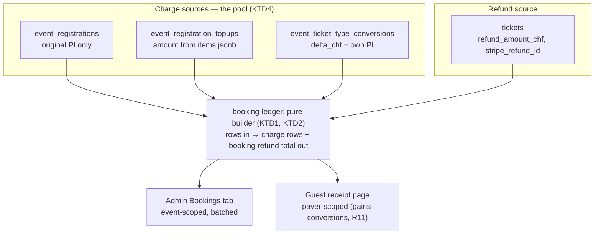
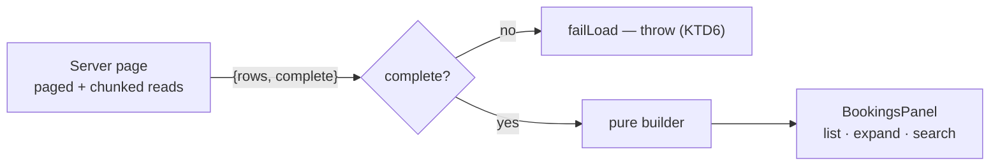

# Admin Bookings Ledger - Plan

## Goal Capsule

- **Objective:** Give an admin one place to answer "what did this booking actually pay?" — every charge and every refund on a booking, for one event, searchable by reference code.
- **Product authority:** This plan owns the admin Bookings tab and the shared payment-row builder. The Refunds tab, the finance dashboard, and the guest receipt page's presentation are context, not scope — except for the one change R11 names.
- **Execution profile:** Shared builder first, then the event-scoped reader, then the surface. No migration; every column this needs already exists.
- **Stop conditions:** Stop and ask if extracting the shared builder changes what the guest receipt renders beyond the three deltas R11 names, or if id-chunking turns out to need a database-side aggregate instead.
- **Tail ownership:** Standard — branch, tests, PR.
- **Open blockers:** None.

---

## Product Contract

### Summary

An admin **Bookings** tab on the event page. One row per booking, expandable to its full financial history: the original checkout, each applied buy-more top-up, each applied priced conversion, and refunds. Read-only and searchable by booking reference.

### Problem Frame

The attendee roster was just flattened into a person-first alphabetical list, which removed booking-level detail from the surface that used to carry it. That detail has nowhere to live.

Underneath, a booking's money story is scattered across four tables and no surface assembles it. `event_registrations` records only the *first* payment intent — the top-up and conversion webhook branches return before that column is written. Top-ups live in `event_registration_topups` with no amount column at all; their value has to be summed out of a jsonb `items` array. Priced conversions live in a third table. Refunds are recorded on `tickets`.

Nothing in the repo aggregates this per booking. `lib/admin/finance.ts` is range-scoped and cross-event. `lib/events/purchase-history.ts` is payer-scoped, cross-event, token-gated, and blind to conversions. An admin asking what one booking paid reads three tables by hand.

### Requirements

**The ledger**

- R1. Every settled booking on the event — status `paid` or `free` — appears, showing its reference code, payer, and status. An abandoned checkout never took money and is not a ledger row.
- R2. A booking expands to its charges in chronological order: original checkout, each applied top-up, each applied priced conversion.
- R3. Each charge shows its date, amount, what it bought, and its Stripe payment reference.
- R4. A charge with no Stripe payment reference renders as a legitimate state, not a broken link.
- R5. Refunds are reported against the booking as a whole, never attributed to an individual charge.
- R6. A booking's total is derived from its item lines, not from the registration's stored total.

**Search**

- R7. The tab filters by booking reference; the same input also matches payer name and email.

**Honesty**

- R8. The ledger refuses to render rather than show a money figure built on a truncated or failed read.
- R9. Amounts and dates render through the repo's shared formatters.

**One builder, two surfaces**

- R10. A single payment-row builder serves both the admin ledger and the guest receipt page, so the two cannot disagree about a booking's charges.
- R11. The guest receipt page changes in exactly four ways as a consequence of R10, and in no others: it gains conversion rows; the original charge's line composition is relabelled per KTD5; amounts may shift by up to one centime where KTD9's single rounding helper replaces `Number(x.toFixed(2))`; and a cancelled-then-released seat stops being double-counted in the refund total, which it is today. These four are the expected delta against U1's characterization baseline; a fifth is a stop condition.

### Key Decisions

- KD1. The tab is a read-only ledger; the Refunds tab keeps the action queue and its due badge. (session-settled: user-directed — chosen over one merged money tab: an action queue and a reading surface have different jobs, and merging would bury the refunds-due signal.) Governs R1, R2, R5.
- KD2. Refunds are reported against the booking, never against a charge. (session-settled: user-approved — chosen over per-payment attribution: tickets carry no reference to the charge that minted them, so any per-charge split would be invented rather than recorded.) Governs R5.
- KD3. Scope is financial activity, not a general audit trail of ticket edits. (session-settled: user-directed — chosen over a booking-level roster view: who-booked-for-whom is the Attendees tab's question.) Governs R2.

### Acceptance Examples

- AE1. **Covers R2, R6.** Given a booking that paid at checkout and later bought two more seats, when an admin expands it, then two charge rows appear and the booking total equals their sum — not the registration's stored total.
- AE2. **Covers R5.** Given a booking with one refunded seat across a two-charge pool, when an admin expands it, then the refund appears once against the booking, not split across the two charges.
- AE3. **Covers R4.** Given a zero-delta conversion applied without checkout, when its row renders, then it shows as applied with no Stripe link and no error state.
- AE4. **Covers R8.** Given the top-ups read is truncated at the row cap, when the tab loads, then it fails loudly instead of rendering a total missing those charges.
- AE5. **Covers R11.** Given a guest whose ticket type was upgraded for a fee, when they open their receipt page, then the upgrade appears as its own charge.

### Scope Boundaries

- Issuing or closing refunds. That stays in the Refunds tab (KD1).
- Non-financial history — name corrections, waiver acceptance, check-in.
- Cross-event views. The tab is event-scoped like every other tab on that page.
- Pending and abandoned checkouts (R1). A registration that never reached `paid` or `free` has no money to account for; the page's existing status filter already excludes them.

#### Deferred to Follow-Up Work

- A `charge.refunded` webhook. See KTD7 — the gap it would close is currently held by process.
- Fixing `resolvePurchaseHistory`'s unpaged, unfiltered registrations read (`lib/events/purchase-history.ts`). It is a latent correctness bug at scale, found during this research, but it is on the payer path and not on this plan's critical path. Note this is a narrow deferral inside a function the plan otherwise substantially rewrites: U1 moves its charge-building out, changes its rounding, and adds two reads to it. Only the registrations read's paging is deferred — and the KTD4 `is_lead` access gate, which sits one call above the moved code, must not move with it.
- Capturing the per-booking ledger read model as a `docs/solutions/` entry. The Receipt Page's design reasoning currently survives only in source comments.

### Sources / Research

- `lib/events/purchase-history.ts` — `buildPayments` and `refundedForBooking` are the reusable core; `resolvePurchaseHistory` is payer-scoped and not reusable. Its own header names the conversion gap.
- `lib/events/refund-pool.ts` — the header states why per-charge refund attribution has no true answer, and that a booking's charge pool spans three tables.
- `lib/admin/finance.ts` — `amountOf` (item lines over stored total), refund clamping, and the `fetchAll` → pure-aggregator split this plan mirrors.
- `lib/events/refunds.ts` — `refundedAmountChf`, `resolveTicketLine`. Shared by three surfaces so they cannot disagree about a seat's value.
- `lib/events/receipt-lines.ts` — `subtractReceiptItems` scopes the original checkout's lines against later top-ups.
- `components/admin/CancellationsPanel.tsx` — what the Refunds tab already shows, so this tab complements rather than repeats it.
- `docs/solutions/best-practices/a-comment-that-justifies-an-omission-is-load-bearing.md` — the CHF 960 / CHF 400 incident. Read before starting.
- `docs/solutions/database-issues/supabase-row-fetch-undercount-when-aggregating-2026-05-19.md` — the silent 1000-row cap.
- `docs/solutions/runtime-errors/use-client-export-invoked-from-server-component.md` — why a green build proves nothing about an admin page rendering.

---

## Planning Contract

### Key Technical Decisions

- KTD1. One conversion-aware payment-row builder, extracted from `lib/events/purchase-history.ts` into a shared module, serving both surfaces. (session-settled: user-approved — chosen over an admin-only sibling module: two builders drift, which is the failure the shared `lib/events/refunds.ts` exists to prevent.) Governs R10, R11.
- KTD2. The builder is pure over already-fetched rows. `buildPayments` today issues three queries per registration inside a sequential loop — items, applied top-ups, and the tickets lookup inside `refundedForBooking` — correct for one payer's handful of bookings, 900 round trips for an event with 300. Fetching moves to the caller so both surfaces batch.
- KTD3. A booking's take is the sum of its item lines, falling back to `total_amount_chf` only when a registration has no item rows. A top-up appends lines without touching the stored total; a conversion bumps it. Mirrors `amountOf` in `lib/admin/finance.ts` so the two surfaces cannot contradict each other. **The charge rows must sum to exactly this figure** — see KTD10, without which they do not. Governs R6.
- KTD4. The charge pool is the union of three sources: the registration's own payment intent, applied top-ups, and applied conversions. `event_registrations.stripe_payment_intent_id` holds only the original — reading it alone yields a ledger missing every later charge. Governs R2, R3.
- KTD5. Conversions render as their own delta rows, and the original charge's line composition is labelled as the booking's current composition rather than as what that charge bought. `apply_ticket_type_conversion` mutates item lines in place, so on a converted booking the original row's lines have drifted from the original purchase and no column records the change. This decision covers the *labelling*; KTD10 covers the arithmetic that keeps the rows summing correctly. Governs R2.
- KTD6. A truncated or failed read refuses to render. Reads return `{rows, complete}` and the page throws via its existing `failLoad`, per the rule already stated in `getFinanceTransactions`. Governs R8.
- KTD7. The app is authoritative for refunds by process, not by mechanism. (session-settled: user-directed — chosen over adding a `charge.refunded` webhook and over surfacing a reconciliation state in the UI: refunds are now issued through the admin Refunds tab only, so the app records them; the CHF discrepancy visible on the previous event predates that practice and is a known historical artifact.) The residual is named under Risks.
- KTD8. Refund valuation imports `lib/events/refunds.ts`. This tab becomes that module's fourth consumer, not a fifth implementation of seat value. The booking's refund total is then **clamped to the booking's derived take**, mirroring `aggregateEvents`' `Math.min(settledByReg, amt)` in `lib/admin/finance.ts`. Without the clamp a booking whose recorded refunds exceed its derived line total renders a negative net here while the Finance dashboard shows it clamped to zero — the two surfaces disagreeing about one booking is exactly what KTD3 claims the mirroring prevents. Governs R5.

- KTD10. A priced conversion's delta is **netted out of the original charge row**, not added on top of it. `apply_ticket_type_conversion` deletes or decrements the from-type line and inserts the to-type line at the new price, so the item lines already carry the full post-conversion value. Rendering a separate `delta_chf` row without subtracting it makes the charge rows sum to line-total plus delta: a CHF 100 seat upgraded for CHF 50 would read CHF 200 against CHF 150 actually captured. The original row's amount is therefore `sum(item lines) − sum(applied top-up items) − sum(applied conversion deltas)`, extending the scoping `subtractReceiptItems` already performs for top-ups. Governs R2, R6.

- KTD11. The builder receives ticket-type titles as an argument; it does not fetch them. `event_ticket_type_conversions` stores `from_type_id` / `to_type_id` only — no titles — so a conversion row cannot describe itself from its own row. The admin page already reads `event_ticket_types`; `purchase-history.ts` does not and gains that read. When a type id no longer resolves (archived or deleted), the row falls back to a price-delta-only description rather than rendering a raw uuid on a guest-facing surface. Governs R3.

- KTD12. The ledger's booking row is an **explicitly projected type**, constructed field by field — never a spread of a fetched registration row. The event page's registrations read already selects `manage_token`, which is a bearer credential: the public cancel and waiver routes and the guest receipt page authorize on it alone, with no login. Spreading fetched rows into a client prop would ship every live booking token into the RSC payload, the page HTML, the browser cache, and any client-side error capture. Governs R1.
- KTD9. Amount arithmetic picks one rounding helper. `lib/admin/finance.ts` and `lib/events/refunds.ts` each carry a private `round2`, one with `Number.EPSILON` and one without, and `purchase-history.ts` uses `Number(x.toFixed(2))`. Sub-centime drift is visible on a booking with many lines. Governs R9.

### High-Level Technical Design

A booking's charges have to be assembled from three tables, then refunds attached at booking level from a fourth. The shape worth seeing is where the union happens and where the module boundary sits.

The read/aggregate split follows the house pattern: one impure entry point that pages and chunks, handing plain row arrays to a pure builder that is unit-tested against fixtures.

### Assumptions

- **U2's reader is the sole fetcher for the ledger.** The page does not widen its own selects and does not hand the builder rows it fetched for other tabs. This is a decision, not an observation, and it exists because the page's current reads cannot carry R8: the `tickets` read has no `.range()` at all — and it is the refund source — while the top-up and conversion reads are single unpaged, unchunked `.in("registration_id", …)` calls whose only failure signal is `error`, which Supabase leaves null when it silently caps at 1000 rows. Widening those in place would deliver AE4's exact failure by way of the step meant to prevent it. Every ledger read is paged at the row cap, id-chunked, and reports `{rows, complete}`.
- Booking counts per event stay in the hundreds, so id-chunked batch reads are sufficient and no database-side aggregate is needed.
- The event page's other tabs keep their existing reads untouched. Nothing shipped changes shape, so the Refunds tab cannot regress as a side effect of this work.

---

## Implementation Units

### U1. Extract a shared, conversion-aware payment-row builder

**Goal:** One builder produces a booking's charge rows, and it knows about conversions.

**Requirements:** R2, R3, R4, R5, R6, R10, R11. Instantiates KTD1, KTD2, KTD3, KTD5, KTD8, KTD9.

**Dependencies:** None.

**Files:**
- `lib/events/booking-ledger.ts` (new)
- `lib/events/booking-ledger.test.ts` (new)
- `lib/events/purchase-history.ts`
- `lib/events/purchase-history.test.ts`

**Approach:**
1. Lift `buildPayments` and `refundedForBooking` out of `purchase-history.ts` into `booking-ledger.ts`, changing them to take already-fetched rows instead of a Supabase client (KTD2).
2. Add applied conversions as first-class charge rows: date from `applied_at`, amount from `delta_chf`, reference from the conversion's own `stripe_payment_intent_id`, description from the from/to type titles resolved through the `ticketTypeTitleById` argument (KTD11), falling back to a price-delta-only description when an id no longer resolves.
3. Order all charges chronologically. Scope the original checkout's amount by subtracting both later top-up items and applied conversion deltas (KTD10), extending what `subtractReceiptItems` already does for top-ups, and label that row per KTD5.
4. Repoint `purchase-history.ts` at the shared builder. It gains two reads it does not have today: the conversion rows, and the `event_ticket_types` titles those rows need (KTD11).
5. Pick one `round2` and use it throughout the new module (KTD9).
6. Clamp the booking's refund total to the booking's derived take (KTD8).

**Execution note:** Characterization-first. Pin the guest receipt's current output in `purchase-history.test.ts` before moving any code. Expect the baseline to move in exactly the four ways R11 names and update it deliberately for those. A fifth difference is the stop condition, not a test to fix. This unit edits a shipped guest-facing surface.

Note that the current guest receipt double-counts a cancelled-then-released seat: `refundedForBooking` filters on `cancellation_status = 'refunded'` with no `released_at` filter, and `release_ticket` leaves the old row's status intact. The tombstone exclusion below corrects that. Pin the buggy figure first so the correction is visible as an intended delta rather than discovered as a regression.

**Patterns to follow:** `lib/events/receipt-lines.ts` for the pure-formatter shape and its test; `lib/events/refunds.ts` for importing seat valuation rather than recomputing it.

**Test scenarios:**
- A booking with only an original checkout produces one charge row.
- A booking with two applied top-ups produces three rows, chronologically ordered.
- An applied priced conversion appears as its own row carrying its own payment reference.
- A zero-delta conversion appears with no payment reference and is not treated as an error.
- A pending (unapplied) top-up or conversion produces no row.
- The original row excludes quantities contributed by later top-ups.
- **A booking with one applied priced conversion shows two rows whose amounts sum to the item-line total — not to line-total plus delta (KTD10).** The CHF 100 seat upgraded for CHF 50 reads CHF 150, not CHF 200.
- A conversion whose `from_type_id` no longer resolves renders its price-delta description, never a raw uuid (KTD11).
- A registration with no item rows falls back to its stored total.
- Refunds total at booking level across a multi-charge pool, counting each refunded ticket once.
- A booking whose recorded refunds exceed its item-line total reports the clamped figure, matching what the Finance dashboard shows for the same booking (KTD8).
- A released-ticket tombstone is excluded, so its refund is not double-counted.
- Covers AE5. The guest receipt's rows differ from the pinned baseline only in the four ways R11 names.

**Verification:** Both `purchase-history.test.ts` and `booking-ledger.test.ts` pass, and the receipt characterization tests show only the intended delta.

### U2. Event-scoped, batched ledger reader

**Goal:** Read one event's bookings and their money in bounded, batched queries.

**Requirements:** R1, R6, R8. Instantiates KTD2, KTD3, KTD4, KTD6, KTD12. Covers AE4.

**Dependencies:** U1.

**Files:**
- `lib/events/booking-ledger.ts`
- `lib/events/booking-ledger.test.ts`

**Approach:**
1. Export `readEventBookingLedger(supabase, eventId)` as the **sole fetcher** for this feature. It reads registrations (status `paid` or `free`), item lines, applied top-ups, applied conversions, ticket-type titles, and live tickets for one event. The page fetches nothing for the ledger itself.
2. Page **every** read at the 1000-row limit — including tickets, which is the refund source and is unpaged today — and chunk `.in("registration_id", ids)` calls, since a long id list overruns PostgREST URL limits well before the row cap bites.
3. Group rows by registration in memory, then hand each booking's rows and the title map to the U1 builder.
4. Construct each returned booking as an explicit projected type (KTD12), field by field — `registrationId`, `referenceCode`, `payerName`, `payerEmail`, `status`, `total`, charge rows, booking refund total. Never spread a fetched registration row.
5. Return `{ bookings, complete }`; `complete` is false if any read errored or truncated (KTD6). Truncation is detected by comparing a page's returned length against the requested page size, not by checking `error` — Supabase returns `error: null` when it caps.

**Patterns to follow:** `fetchAll` in `lib/admin/finance.ts` for the paged `{rows, complete}` contract; its `getFinanceSummary` for the impure-entry-point/pure-aggregator split.

**Test scenarios:**
- Bookings for the requested event only; another event's booking is absent.
- A registration whose status is neither `paid` nor `free` is absent (R1).
- An id list beyond the chunk size issues multiple chunked reads and returns every booking.
- Covers AE4. A truncated top-up read yields `complete: false` rather than a short but plausible list.
- A truncated **tickets** read yields `complete: false`, so a refund total is never built on a capped read.
- An errored read yields `complete: false` rather than throwing past the caller.
- A returned booking carries no `manage_token` and no other credential column, given a fixture registration that has one (KTD12).
- Tickets with `released_at` set are excluded before refunds are totalled.
- A `stripe_refund_id` holding a comma-joined list is split into separate references.
- Numeric columns arriving as strings are coerced before arithmetic.

**Verification:** A fixture event with a top-up, a conversion, and a refund returns one booking whose charges and refund total reconcile to the fixture.

### U3. Widen the admin event page's money reads

**Goal:** The server page fetches what the ledger needs and passes it to the tab.

**Requirements:** R1, R8.

**Dependencies:** U2.

**Files:**
- `app/(admin)/admin/events/[id]/attendees/page.tsx`

**Approach:**
1. Call `readEventBookingLedger(supabase, eventId)` from U2. Do **not** widen the page's existing selects — U2 owns every ledger read (see Assumptions).
2. Pass `bookings` as one new prop, typed by importing the projected row type from `lib/events/booking-ledger.ts`.
3. Route `complete: false` through the page's existing `failLoad`. This is the reader's flag, not an `error` check.

**Execution note:** This page is a server component with no unit test. Its proof is the tab's tests plus an authenticated page load, plus the forced-incomplete-read gate — see the Verification Contract.

**Patterns to follow:** the `cancellations` prop for how a built prop is threaded through the page. Unlike `cancellations`, the row type is imported from the `lib/` module rather than from the component, so U3 does not depend on U4 having been written.

**Scope note:** the page's other reads — the ones feeding Attendees, Guest list, and Refunds — are not touched. Nothing shipped changes shape.

**Test scenarios:** `Test expectation: none — server component with no unit-test seam in this repo. Covered by U4's component tests and the authenticated load in the Verification Contract.`

**Verification:** The tab renders real bookings against a seeded event, and a deliberately failed read produces the page's error path rather than a zeroed total.

### U4. Bookings panel and tab

**Goal:** The surface: list, expand, search.

**Requirements:** R1, R2, R3, R4, R5, R7, R9.

**Dependencies:** U3.

**Files:**
- `components/admin/BookingsPanel.tsx` (new)
- `components/admin/BookingsPanel.test.tsx` (new)
- `components/admin/ManageEventTabs.tsx`
- `components/admin/ManageEventTabs.test.tsx`

**Approach:**
1. Build `BookingsPanel`: one row per booking showing reference, payer, status and total; expanding reveals its charge rows and any booking-level refund.
2. Render a charge's Stripe reference as a dashboard deep link when present, and as a plain "no payment on record" state when absent (R4). Carry the `ph-no-capture` class on Stripe ids, as `CancellationsPanel` does — **and on the booking row's expand control**, which `CancellationsPanel` does not need because its payer rows are not click targets. PostHog initialises with `autocapture: true` and no element-text masking, and `redact-event.ts` redacts URLs only, not `$el_text`; without the class, every expand click ships a payer's name, email and spend to a third-party processor as autocapture text.
3. Add a search input filtering on reference, payer name and email.
4. Wire the tab: extend the `Tab` union, add the button between Guest list and Refunds, add the panel block, add the prop.
5. Add a `vi.mock` stub for `BookingsPanel` in `ManageEventTabs.test.tsx`, matching how sibling tab components are stubbed there.

**Patterns to follow:** `components/admin/CancellationsPanel.tsx` for booking-grouped money presentation and Stripe deep links; the Overview tab's wiring for the four-edit tab pattern; `formatCurrency(amount, { decimals: 2 })` and `formatDateTime` from `lib/format.ts` (R9).

**Test scenarios:**
- Covers AE1. A booking with an original charge and two top-ups shows three charge rows and a total equal to their sum.
- Covers AE2. A refund shows once against the booking, not against a charge row.
- Covers AE3. A charge with no payment reference renders its no-payment state and no link.
- A charge with a payment reference renders a Stripe deep link.
- Searching a reference code narrows to that booking.
- Searching a payer's name or email narrows to their bookings.
- A search matching nothing shows an empty state, not a blank panel.
- Money renders with two decimals through the shared formatter.
- The expand control carries `ph-no-capture`, asserted as `OriginatorBreakdownPanel.test.tsx` already does.
- The tab appears between Guest list and Refunds, and the Refunds due badge is unaffected.

**Verification:** An admin can find a booking by reference, expand it, and read its charges and refunds; the Refunds tab is unchanged.

---

## Verification Contract

| Gate | Command | Applies to |
|---|---|---|
| Unit and component tests | `npm run test:unit` | All units |
| Type check | `npx tsc --noEmit` | All units |
| Lint | `npm run lint` | All units |
| Authenticated admin page load | Playwright admin project, or a manual authenticated load of the event page | U3, U4 |
| Guest receipt page render | Manual load of a real receipt page by its `manage_token`, including one booking with an applied priced conversion | U1 |
| Forced incomplete read | Temporarily lower the reader's page size below the fixture row count (or point one read at a bad column), load the page, and confirm it takes the error path rather than rendering a total | U3 |

`npm test` runs Playwright against the shared production database and is not part of this contract. Use `npm run test:unit`.

Component tests need the `// @vitest-environment jsdom` docblock on the first line and an explicit `afterEach(cleanup)` — this repo does not set `globals: true`.

**The authenticated load is not optional.** A green `tsc`, `lint`, `next build` and full unit suite have previously all passed while an admin page returned 500 on every request, because middleware redirects anonymous requests and no local gate exercises an authenticated render. U1 also edits a shipped guest-facing surface, so confirm a real receipt page still renders.

---

## Definition of Done

**Global**

- Every requirement R1-R11 is implemented or explicitly carried in Scope Boundaries.
- `npm run test:unit`, `npx tsc --noEmit` and `npm run lint` all pass.
- An authenticated admin load of the event page renders the Bookings tab.
- A guest receipt page still renders, and its output is unchanged apart from the deltas R11 names — verified against the characterization tests pinned in U1, not by eyeballing that the page loads.
- One payment-row builder exists; no second implementation of charge-row building remains.
- No abandoned or experimental code remains in the diff. A surface that was tried and dropped is deleted, not commented out.

**Per unit**

| Unit | Done when |
|---|---|
| U1 | Both surfaces build charges from one module, and a priced conversion appears as its own row on each |
| U2 | One event's bookings load in bounded batched reads, and a truncated read reports incomplete rather than short |
| U3 | The page supplies the tab's data from U2's reader alone, and has been **observed** failing loudly on a forced incomplete read — not merely coded to |
| U4 | An admin finds a booking by reference, expands it, and reads its charges and refunds |

---

## Risks

- **The refund record is held by process, not mechanism (KTD7).** There is no `charge.refunded` webhook, so the ledger is authoritative only while refunds continue to be issued through the admin Refunds tab. A refund issued directly in Stripe would be invisible here, exactly as it is on the Finance dashboard today. The decision to accept this is deliberate and recorded; the residual is that the control is a practice, and practices lapse silently.
- **The original charge's composition is reconstructed, not recorded.** On a booking with a conversion, the original row's lines reflect the booking's current composition (KTD5). No column records what that charge originally bought. The labelling is the mitigation; there is no data fix short of a schema change.
- **Id-chunked reads are a bound, not a guarantee.** Chunking keeps URLs under limits at the hundreds scale assumed here. An event with thousands of bookings would need a database-side aggregate instead.
- **A future `?tab=` deep link would move the tab vocabulary.** This page selects tabs in client state, so the server never reads a tab id and the `"use client"` export hazard does not apply today. Adding URL-driven tabs later means moving the tab vocabulary into a directive-free module first.
- **Pending refunds read as fully paid.** The booking's refund figure inherits `refundedForBooking`'s settled-only filter, so a booking with a requested-but-unsettled refund shows no refund here. KD1 puts that queue on the Refunds tab, which is where the signal belongs — but a tab whose stated job is "what did this booking actually pay?" will answer without mentioning money already promised back.
- **Seat valuation is approximate for repriced types.** `resolveTicketLine` returns null when a booking's ticket type appears on lines at differing prices — common after a top-up at a repriced type — and refund valuation falls back to the booking average. The ledger inherits that approximation, so a booking-level refund total can be plausibly wrong rather than obviously wrong.
- **This page concentrates more PII than any other tab on it.** Correctly projected, the prop still assembles every payer's name, email and Stripe identifiers for the whole event into one client payload so search can run client-side. That is the cost of R7's instant filtering; a server-side search would trade it for a round trip per keystroke.

---

## Open Questions

These do not block U1. Answer before U4 ships.

- **Which admin roles see this tab?** `app/(admin)/layout.tsx` grants `events_admin` access to `/admin/events/*` while deliberately withholding `/admin/finance` — the two roles exist to separate event operations from money. This plan puts a complete per-booking charge-and-refund ledger on a page `events_admin` already reaches. The Refunds tab already shows some money there, so this widens an existing exposure rather than creating a new one, but no decision has been recorded. If the answer is "restrict", U4 gates the tab button and panel on the admin role passed from the server page.
- **Should `readEventBookingLedger` live in `booking-ledger.ts` at all?** U1's module is pure and unit-tested against fixtures; U2 adds an impure Supabase reader beside it. `lib/admin/finance.ts` mixes both, so there is precedent — but `lib/events/receipt-lines.ts`, the closer model, stays pure. Splitting the reader into its own module would keep the builder trivially testable.
- **Should the guest receipt expose a conversion's Stripe PaymentIntent id?** The existing `Ref {chargeReference}` line already does this for checkout and top-up charges, so adding conversions is consistent — but it makes a third source of Stripe identifiers visible to guests, and nobody has decided whether guest-facing charge references are wanted at all.
