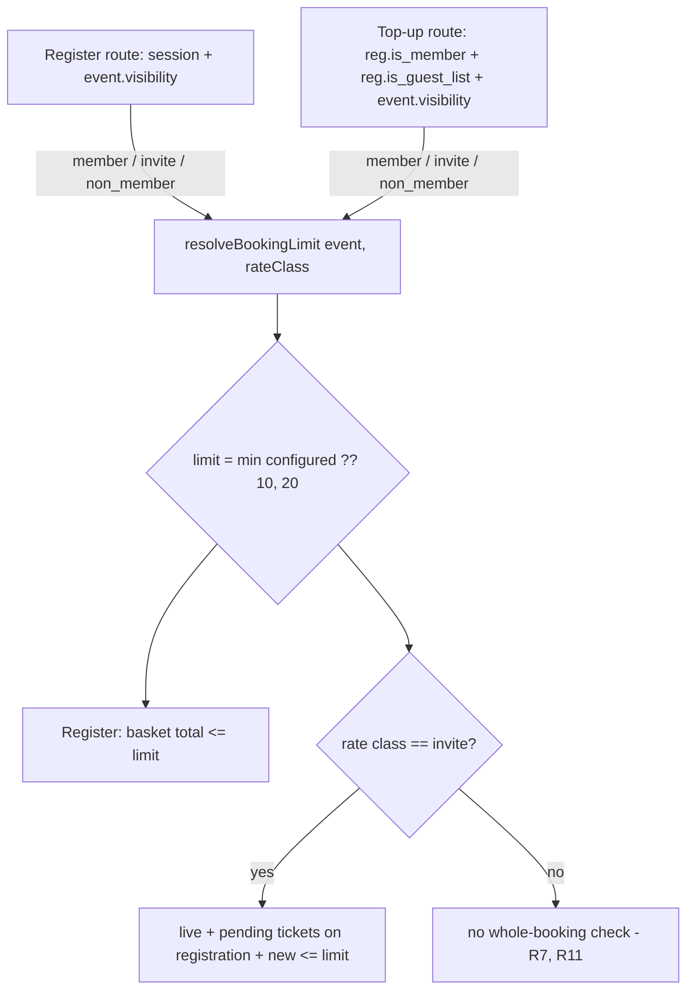

# Per-Booking Ticket Limits by Rate Class - Plan

## Goal Capsule

- **Objective:** Stop one person buying an unbounded block of tickets on a single booking — most acutely an invited guest holding the private invite link — by giving each event a per-booking ticket limit, set separately for each rate class.
- **Product authority:** This plan owns the three new per-event limit columns, their Settings-tab editor, and enforcement in the register route, the top-up route, and the buyer-facing pickers. Pricing, `seat_cap` capacity math, and the waitlist-offer quantity ceiling are context, not scope.
- **Execution profile:** Migration and a shared resolver first, then server enforcement (which is the load-bearing half), then the admin field and the client pickers. Server-side checks must be able to stand alone — every buyer surface here is reachable unauthenticated.
- **Stop conditions:** Stop and ask if enforcing the whole-booking rule at top-up turns out to need a database aggregate rather than a per-registration read, or if the live-ticket definition in KTD4 contradicts how the door or finance surfaces already count a cancelled ticket.
- **Tail ownership:** Standard — worktree branch, tests, PR.
- **Open blockers:** None. Two decisions are recorded as assumptions in Open Questions.

---

## Product Contract

### Summary

Each event gains three optional per-booking ticket limits — one for **members**, one for **invited guests** (the private invite link), one for the **public** non-member rate — edited on the event's Settings tab beside the ticket cap. Blank means the app default of **10**. The register route enforces the limit for the rate class it already resolves; for invited guests the limit additionally binds the **whole booking**, so a guest cannot clear it by topping up later from their "My Booking" link. Members and public buyers keep today's per-checkout-only behaviour.

### Problem Frame

The private invite link (`/public/events/<id>?code=<invite_code>`) is shared with a select group and is unauthenticated. Today the only ceilings on a single booking are `MAX_QUANTITY_HARD_CAP = 20` in `components/public/EventRegistrationForm.tsx`, `MAX_TICKETS = 20` in `app/api/events/[id]/register/route.ts`, and the event-wide `seat_cap`. One invite holder can therefore take 20 seats out of a capped event in one transaction, and then take more: `app/api/public/bookings/[token]/topup/route.ts` lets any holder on a confirmed booking add up to 50 further tickets, bounded only by `seat_cap`. Nothing in either path is aware of who the buyer is or what the club wants a single party to be able to hold.

### Actors

- **A1 — Events admin.** Sets the three limits on the event's Settings tab. Already the actor for `seat_cap` in the same panel.
- **A2 — Invited guest.** Unauthenticated holder of the invite code on a members-only event; resolves to the `invite` rate class. The party this feature primarily binds.
- **A3 — Member.** Authenticated active member booking from the member events page.
- **A4 — Public buyer.** Non-member booking a public event.

### Key Flows

- **F1 — Configure.** A1 opens Manage event → Settings, sets one, two, or three limits, saves. Blank fields fall back to the default.
- **F2 — Invite checkout.** A2 opens the invite link, picks quantities (picker capped), submits; the register route re-checks the invite limit and rejects an over-limit basket.
- **F3 — Invite top-up.** A2 opens their booking link and buys more; the top-up route counts the booking's live tickets and rejects anything that would push the total past the invite limit.
- **F4 — Cancel then re-book.** A2 cancels a ticket, freeing both a seat and their own allowance, then tops up again within the limit.
- **F5 — Member / public checkout.** A3 or A4 books; their own rate class's limit binds that checkout only. A later top-up on their booking is unaffected.

### Requirements

- **R1** — Each event carries three optional per-booking ticket limits, one per rate class: member, invite, non-member.
- **R2** — An unset limit resolves to the application default of **10**.
- **R3** — A limit is a whole number from 1 to 20 inclusive. 20 is the existing absolute per-request ceiling; the settings editor rejects a larger value rather than accepting one that could never take effect.
- **R4** — The register route rejects a basket whose total quantity exceeds the limit for the rate class it resolved, with a message naming the limit.
- **R5** — For an `invite`-class booking the limit binds the **whole booking**: live tickets already on the registration plus the tickets being added must not exceed it. This is enforced in the top-up route.
- **R6** — A cancelled ticket is not live and frees the holder's allowance, mirroring how a cancellation frees a seat.
- **R7** — Member and public bookings are enforced at checkout only. Their top-ups keep today's bounds (`MAX_QTY`, `seat_cap`) and gain no new restriction.
- **R8** — Every buyer-facing quantity picker is capped at the applicable limit so an over-limit basket cannot be assembled; the server checks remain authoritative and independently sufficient.
- **R9** — All ticket types count toward a limit, whether or not `counts_as_seat` is true. The limit is on booking size, not on capacity.
- **R10** — The waitlist-offer path is unchanged: `offer.redeemableQuantity` already bounds it, and an offer redemption is not an invite-code booking. The register route skips the rate-class limit entirely when an offer token resolves.
- **R11** — An admin-created comp guest list (`event_registrations.is_guest_list`) is exempt from the whole-booking rule. It is not an invite-link booking, it is created by an authenticated admin, and sponsor lists routinely run larger than any per-guest limit.
- **R12** — A pending (paid-for but not yet applied) top-up counts against the booking's allowance for the duration of its checkout window, so parallel checkouts cannot each pass the check independently.

### Acceptance Examples

- **AE1** — Event with invite limit 4. Invited guest selects 5 tickets → the picker will not go past 4; a crafted request for 5 is rejected with "A maximum of 4 tickets can be booked".
- **AE2** — Same event, guest books 4, then opens their booking link and tries to add 1 → rejected; the buy-more picker shows no remaining allowance.
- **AE3** — Same event, guest books 4, cancels 2, then adds 2 → accepted; the booking holds 4 live tickets.
- **AE4** — Event with no limits configured. A member booking 10 succeeds; 11 is rejected.
- **AE5** — Public event, non-member limit 6. Buyer books 6, then tops up 3 more from their booking link → accepted (R7).
- **AE6** — Admin enters 25 in a limit field → rejected with a message naming the 20 ceiling; nothing persists.
- **AE7** — Members-only event, invite limit 4, comp guest list of 20 created by an admin. The sponsor buys 2 more seats from their guest-list page → accepted (R11).
- **AE8** — Invite limit 4, guest at 0 live tickets opens two top-up checkouts of 4 in separate tabs. The first is accepted; the second is refused while the first is still pending (R12).

### Key Decisions

- **KTD1 — Three columns, not one.** Mirrors the existing per-rate-class price columns (`price_member` / `invite_price` / `price_non_member`) and the `RateClass` union in `lib/events/pricing.ts`. Governs R1.
- **KTD2 — Default lives in code, not as a DB default.** The columns are nullable with no DB default, so "blank" stays a distinct state meaning *use the app default*; changing 10 to something else later is a one-line change, not a backfill. Governs R2.
- **KTD3 — Whole-booking enforcement is invite-only.** *(session-settled: user-directed — chosen over binding every rate class: the club wants an invited guest's total holding bounded, including after a cancel-and-re-book, while public buyers stay free to come back for more.)* Governs R5, R7.
- **KTD4 — Cancelled tickets free allowance.** A cancellation already frees the seat immediately (`seats_used` subtracts cancelled seat-counting tickets); allowance follows the same rule so the two never disagree. Governs R6.

### Scope Boundaries

**In scope:** the three columns and their migration; the Settings-tab editor and its route; enforcement in `app/api/events/[id]/register/route.ts` and `app/api/public/bookings/[token]/topup/route.ts`; the quantity caps in `EventRegistrationForm` and `BuyMorePanel` and the pages that feed them.

**Not in scope (true non-goals):**
- `seat_cap` semantics and the capacity RPCs — untouched.
- Pricing, including the `resolvePrice` invite fallback used at top-up.
- The waitlist-offer ceiling (R10).
- The ticket-conversion (upgrade) path, which changes a ticket's type without changing the count.

### Deferred to Follow-Up Work

- A per-ticket-type maximum (considered and set aside in scoping — this plan's limit is basket-wide).
- Any admin-side override for a party that legitimately needs more than the limit; today the admin raises the limit, saves, and lowers it again.
- Surfacing the remaining allowance on the admin guest list or door roster.

---

## High-Level Technical Design

Rate class is never stored — it is derived, and both enforcement points must derive it the same way. The register route already does so from session + event visibility. The top-up route reaches the same answer from the registration's stored `is_member` plus the event's `visibility`, **with one correction**: a non-member registration on a members-only event has two possible origins, not one. It may be an invite-link booking, or it may be an admin-created comp guest list — `create_comp_guest_list` deliberately writes `p_is_member: false` ("a comp list's lead is a sponsor contact, not a member") and sets `is_guest_list = true`. `CompGuestListManager` buys extra seats through this same top-up route, so without the `is_guest_list` branch a 20-guest sponsor list would be refused on its first top-up against a default limit of 10 (R11).



Live-ticket accounting for one registration mirrors the shape of `seats_used` but scoped to a single booking, counting every type (R9), and — unlike `seats_used` — counting purchases that are paid for but not yet applied (R12):

```
live(registration) = SUM(event_registration_items.quantity for this registration)
                   + SUM(items[].quantity of event_registration_topups WHERE status = 'pending')
                   - COUNT(tickets on this registration WHERE cancellation_status IS NOT NULL)
```

The pending term is load-bearing, not defensive. A top-up writes an `event_registration_topups` row with `status = 'pending'` and hands the buyer a Stripe URL; its items reach `event_registration_items` only when `apply_registration_topup` runs in the webhook after payment. Counting applied items alone would let an invite holder open several checkouts in separate tabs — each passing the check independently — and pay them all. Stripe sessions live for hours, so this is not a millisecond race that a "last writer wins" argument covers; it is the ordinary way a determined holder would defeat the limit on an unauthenticated route.

Directional only — the implementer may read `tickets` directly instead if that proves both cheaper and consistent with the itemless-registration fallback that `seats_used` still carries.

---

## Implementation Units

### U1. Add the three per-event limit columns

**Goal:** Persist a nullable per-rate-class booking limit on `events`.

**Requirements:** R1, R3.

**Dependencies:** none.

**Files:**
- `supabase/migrations/<timestamp>_event_booking_limits.sql` (new)
- `types/database.ts` (regenerate)

**Approach:**
1. `ALTER TABLE public.events ADD COLUMN IF NOT EXISTS max_tickets_member integer`, `max_tickets_invite integer`, `max_tickets_non_member integer` — all nullable, **no DB default** (Key Decision: default lives in code).
2. Add a `CHECK` per column allowing `NULL` or `1..20`, so a hand-written UPDATE cannot install a value the app would silently ignore.
3. Regenerate `types/database.ts` via the Supabase MCP.

**Patterns to follow:** `supabase/migrations/20260721160000_ticket_type_description.sql` for the additive-column-plus-CHECK shape; the migration header comment style used throughout `supabase/migrations/`.

**Execution note:** Additive and reversible — safe to apply to the shared database before the app code lands. After regenerating `types/database.ts`, re-append the hand-written `MemberStatus` / `PaymentCaptureStatus` aliases the generator drops. Timestamp the migration **after `20260814150000`** — PR #132 (open) adds `20260814150000_claim_ticket_replay_guard_scoped_to_type.sql` on the same date, and an earlier stamp would sort this migration ahead of a change already applied to production.

**Test scenarios:**
- `Test expectation: none -- schema-only unit; the CHECK bounds are exercised through U3's route tests.`

**Verification:** The three columns exist on `events`, accept `NULL` and `4`, and reject `0`, `-1`, and `25`. `npx tsc --noEmit` passes against the regenerated types.

---

### U2. Shared booking-limit resolver

**Goal:** One module owns the default, the ceiling, rate-class resolution, and the live-ticket count, so the two enforcement points cannot drift.

**Requirements:** R2, R3, R6, R9.

**Dependencies:** U1.

**Files:**
- `lib/events/booking-limits.ts` (new)
- `lib/events/booking-limits.test.ts` (new)

**Approach:**
1. Export `DEFAULT_BOOKING_LIMIT = 10` and `ABSOLUTE_MAX_TICKETS = 20` (the value `MAX_TICKETS` currently hardcodes in the register route).
2. Export `resolveBookingLimit(event, rateClass)` taking the three columns plus the `RateClass` union already exported by `lib/events/pricing.ts`, returning `min(configured ?? DEFAULT_BOOKING_LIMIT, ABSOLUTE_MAX_TICKETS)`. Treat a non-integer, zero, or negative stored value as unset rather than trusting it — the column CHECK is the guard, not the contract.
3. Export `rateClassForRegistration({ is_member, is_guest_list }, { visibility })` returning `member` for a member's registration **and for any `is_guest_list` registration** (R11 — a comp list is admin-created, not an invite-link booking, so it takes the class that carries no whole-booking rule), `invite` for a non-member, non-guest-list registration on a members-only event, and `non_member` on a public event. Document that this is the top-up-side mirror of the register route's session-based resolution, and that the guest-list branch is the one place the two legitimately differ.
4. Export `countLiveTickets(supabase, registrationId)` returning applied purchased quantity **plus pending top-up quantity** minus cancelled tickets for that registration, counting every ticket type (R9, R12). Include `event_registration_topups` rows with `status = 'pending'` created within the last 60 minutes; an older pending row is an abandoned checkout and releases its allowance.
5. `countLiveTickets` **throws** on any query error rather than returning a count. A count that silently degrades to zero would fail open on an unauthenticated route, handing the guest their full allowance back on every failed read — the opposite of what R5 exists to do.

**Patterns to follow:** `lib/events/pricing.ts` — a small module with the two rules kept deliberately distinct and a header comment explaining why; `lib/events/seat-usage.ts` for how cancellation is netted out.

**Test scenarios:**
- Unset columns resolve to 10 for each of the three rate classes.
- A configured 4 resolves to 4; a configured 25 (should be impossible past the CHECK) clamps to 20.
- A stored `0` or a negative value is treated as unset and resolves to 10.
- `rateClassForRegistration` returns `member` for a member registration on a members-only event, `invite` for a non-member on a members-only event, `non_member` for a non-member on a public event.
- Covers AE7. `rateClassForRegistration` returns `member` — not `invite` — for an `is_guest_list` registration on a members-only event (R11).
- `countLiveTickets` returns the purchased total when nothing is cancelled.
- Covers AE8. `countLiveTickets` adds the quantity of a `status: 'pending'` top-up row, and ignores an `applied` one (already counted in the items) and a pending row older than the window (R12).
- `countLiveTickets` throws when the items query errors and when the pending-top-up query errors — it never returns a partial count.
- `countLiveTickets` subtracts a `cancellation_status: 'requested'` ticket and a `'refunded'` ticket alike (R6).
- `countLiveTickets` counts a `counts_as_seat: false` ticket (R9) — the divergence from `seats_used`.
- `countLiveTickets` falls back to `event_registrations.quantity` for a registration carrying no line items, mirroring the `NOT EXISTS` branch in `seats_used`.

**Verification:** `npx vitest run lib/events/booking-limits.test.ts` passes; no other module hardcodes 10 or 20 after U5/U6 land.

---

### U3. Accept the limits on the event settings route

**Goal:** Let an admin persist the three limits through the route that already owns per-event settings.

**Requirements:** R1, R3.

**Dependencies:** U1, U2.

**Files:**
- `app/api/admin/events/[id]/settings/route.ts`
- `app/api/admin/events/[id]/settings/route.test.ts`

**Approach:**
1. Add the three keys to the PATCH whitelist alongside `seat_cap`, each optional and independently patchable.
2. Parse each the way `seat_cap` is parsed: `null` or `""` clears to `NULL`; otherwise require a whole number. Additionally reject anything above `ABSOLUTE_MAX_TICKETS` with a message naming the ceiling (R3, AE6).
3. Leave the existing `invite_code` / `invite_price` single-writer note intact — these columns are settings, not prices, so this route is their owner.

**Patterns to follow:** the `seat_cap` block in the same file, including its `"key" in body` presence test so an absent field is untouched rather than nulled.

**Test scenarios:**
- Covers AE6. `{ max_tickets_invite: 25 }` → 400 naming the 20 ceiling; nothing written.
- `{ max_tickets_invite: 4 }` → 200 and only that column in the update payload.
- `{ max_tickets_invite: null }` → 200, clears to `NULL`.
- `{ max_tickets_invite: 0 }` and `{ max_tickets_member: 2.5 }` → 400.
- All three sent together → 200, all three in the update payload.
- A body with only the retired `strict_checkin` still returns success (existing no-op behaviour unbroken).
- Non-admin session → 403 (existing guard still covers the new fields).

**Verification:** `npx vitest run "app/api/admin/events/[id]/settings/route.test.ts"` passes, including the pre-existing `seat_cap` cases.

---

### U4. Settings-tab editor for the three limits

**Goal:** A1 can set the limits where they already set the ticket cap.

**Requirements:** R1, R2, R3.

**Dependencies:** U3.

**Files:**
- `components/admin/EventCheckInSettings.tsx`
- `components/admin/ManageEventTabs.tsx`
- `app/(admin)/admin/events/[id]/attendees/page.tsx`

**Approach:**
1. Add a "Tickets per booking" section below the existing Ticket cap section in `EventCheckInSettings`, with three labelled number inputs (Members / Invited guests / Public) and one Save button PATCHing all three.
2. Placeholder text on each input reads `10` so the default is visible without being a value; helper copy states that blank means 10 and that the invited-guest limit also applies to later top-ups on the same booking.
3. Thread the three current values from the attendees page's event query through `ManageEventTabs` into the component, the way `seatCap` is threaded today.

**Patterns to follow:** the ticket-cap block in the same component — local string state, `changed`/`invalid` derivation, `router.refresh()` after save, inline error and "Saved" affordances. Brand tokens (`marine`, `cream`, `sky`, `font-body`/`font-heading`) as used throughout.

**Test scenarios:**
- `Test expectation: none -- presentational wiring over an already-tested route; covered end-to-end by the manual verification below.`

**Verification:** On Manage event → Settings, setting Invited guests to 4 and reloading shows 4; clearing it and reloading shows the empty field with the `10` placeholder. Entering 25 shows the route's error and leaves the stored value unchanged.

---

### U5. Enforce the limit at checkout

**Goal:** The register route rejects an over-limit basket for the rate class it resolved.

**Requirements:** R4, R9, R10.

**Dependencies:** U1, U2.

**Files:**
- `app/api/events/[id]/register/route.ts`
- `app/api/events/[id]/register/route.test.ts`

**Approach:**
1. Keep a cheap absolute guard early (basket total ≤ `ABSOLUTE_MAX_TICKETS`) so a crafted 10,000-ticket body is still rejected before any database work — the route is unauthenticated.
2. Add the three limit columns to the existing `events` select.
3. After `rateClass` is resolved (it already is, just below the invite-code gate), call `resolveBookingLimit` and reject a basket total above it, with a message naming the limit.
4. Pass the resolved limit rather than `MAX_TICKETS` to `parseAttendeeInput` so the attendee-array bound tracks the same number.
5. Skip the rate-class limit check entirely when `offerEntry` is set. An offer's quantity is set by an admin when the offer is minted, and `entry.quantity` remains its only bound (R10). Guard the step-3 check with `if (!offerEntry)` and comment why, so the decision is visible rather than implied by ordering.

**Execution note:** The existing `MAX_TICKETS` check sits *above* the event load; the rate-class-aware check must sit *below* the `rateClass` assignment. Move deliberately and keep both — the early one is the abuse guard, the later one is the product rule.

**Test scenarios:**
- Covers AE1. Members-only event, invite limit 4, valid code, basket of 5 → 400 naming 4; no registration row created.
- Same event, basket of 4 → proceeds (free basket confirms, paid basket reaches Stripe).
- Covers AE4. Event with no limits configured, member session, basket of 10 → proceeds; 11 → 400.
- Public event with `max_tickets_non_member = 6`, basket of 7 → 400; a member session on the same event is bound by `max_tickets_member`, not 6.
- A basket mixing a seat-counting and a non-seat type totalling one over the limit → 400 (R9).
- A crafted basket totalling 500 → 400 before any ticket-type lookup.
- An offer redemption is bound by the offer's own quantity and behaves exactly as before this change (R10).

**Verification:** `npx vitest run "app/api/events/[id]/register/route.test.ts"` passes, existing cases included.

---

### U6. Whole-booking enforcement on invite top-ups

**Goal:** An invited guest cannot exceed the invite limit by adding tickets after checkout, and a cancellation gives their allowance back.

**Requirements:** R5, R6, R7, R9, R11, R12.

**Dependencies:** U1, U2.

**Files:**
- `app/api/public/bookings/[token]/topup/route.ts`
- `app/api/public/bookings/[token]/topup/route.test.ts`

**Approach:**
1. Add `is_guest_list` to the route's registration select (both token-resolution branches populate the same `RegRow`, so both must carry it), and extend the existing event read — which already fetches `seat_cap` — to also fetch `visibility` and the three limit columns.
2. Derive the booking's rate class with `rateClassForRegistration(reg, event)`. A comp guest list resolves to `member` and skips the rule entirely (R11).
3. When and only when the class is `invite`, count the booking's live-plus-pending tickets and reject when `live + requested > limit`, with a message naming the limit and the remaining allowance. Every other class falls through untouched (R7).
4. Wrap `countLiveTickets` in the same try/catch shape the route already uses for `getSeatsUsed`, returning 500 "Could not verify your booking" on failure. Fail closed — a failed read must refuse the top-up, never wave it through.
5. Place the check alongside the existing `seat_cap` check, before naming validation and before any Stripe work: the buyer must be refused while they can still fix the order, and before a pending top-up row is written.
6. `MAX_QTY = 50` stays as the route's own abuse guard.

**Execution note:** This route is reachable by a per-ticket manage token as well as the lead's registration token; the limit is a property of the **booking**, not of the token holder, so both entry paths must land on the same check.

**Test scenarios:**
- Covers AE2. Invite booking on a members-only event, invite limit 4, 4 live tickets, top-up of 1 → 400 naming the limit; no Stripe session created.
- Covers AE3. Same booking with 2 of the 4 cancelled, top-up of 2 → proceeds (R6).
- A `cancellation_status: 'refunded'` ticket frees allowance the same as `'requested'`.
- Covers AE5. Public-event booking with `max_tickets_non_member = 6`, 6 live tickets, top-up of 3 → proceeds (R7).
- Member booking on a members-only event, at its member limit, top-up of 1 → proceeds (R7 — member class is checkout-only).
- Invite booking one under the limit topping up a `counts_as_seat: false` type → bound by the limit (R9).
- A per-ticket manage token on an at-limit invite booking is refused identically to the lead's token.
- Covers AE7. Comp guest list (`is_guest_list: true`) of 20 on a members-only event with invite limit 4, top-up of 2 → proceeds (R11).
- Covers AE8. Invite booking at 0 live tickets with a pending top-up of 4 already recorded, second top-up of 4 → 400 (R12).
- A pending top-up row older than the release window no longer holds allowance.
- A failing live-ticket read returns 500 and creates no top-up row, rather than allowing the purchase.
- The existing `seat_cap`, naming, and claimed-name-collision behaviours are unchanged.

**Verification:** `npx vitest run "app/api/public/bookings/[token]/topup/route.test.ts"` passes, existing cases included.

---

### U7. Cap the buyer-facing pickers

**Goal:** A buyer cannot assemble an over-limit basket in the UI, and an at-limit invite booking is told why it cannot buy more rather than losing the affordance without explanation.

**Requirements:** R8, R2.

**Dependencies:** U1, U2, U5, U6.

**Files:**
- `components/public/EventRegistrationForm.tsx`
- `components/public/EventRegistrationDrawer.tsx`
- `components/public/BuyMorePanel.tsx`
- `components/public/TicketManager.tsx`
- `app/(public)/public/events/[id]/page.tsx`
- `app/(member)/events/[id]/page.tsx`
- `app/(checkin)/public/tickets/[token]/page.tsx`

**Approach:**
1. In `EventRegistrationForm`, replace the local `MAX_QUANTITY_HARD_CAP` with an explicit `bookingLimit` prop. Keep the existing **override** shape rather than turning it into a three-way `min`: when `offer` is set, `offer.redeemableQuantity` remains the sole ceiling (R10); when it is not, the ceiling is `min(bookingLimit, maxQuantity ?? bookingLimit)`. An absent prop falls back to the shared default so nothing regresses if a call site is missed.
2. Each page resolves the viewer's rate class the same way it already resolves prices — the public event page distinguishes member / valid-invite / public in the same block that picks the price column — and passes the resolved limit down; the member page passes it through `EventRegistrationDrawer`. The offers page passes nothing new (R10).
3. Add an optional `maxTotal` prop to `BuyMorePanel` that disables the increment at the ceiling and renders an inline remaining-allowance note below the ticket list (e.g. "2 tickets remaining on this booking"), styled like the amber at-cap banner `EventRegistrationForm` already uses. At zero allowance keep the panel mounted in a disabled state reading "You've reached the maximum of {limit} tickets for this booking" — do not unmount it, or the guest sees a feature vanish with no reason and contacts the club instead.
4. The surface that feeds this is **the holder's ticket page**, not the booking page: since PR #130 `app/(checkin)/public/bookings/[token]/page.tsx` redirects every non-comp registration to `/public/tickets/<ticket manage token>`, and `BuyMorePanel` is rendered from `TicketManager`. Compute `maxTotal` server-side on the ticket page for invite-class bookings only and thread it through `TicketManager`. It must be computed over the **whole registration**, not over the tickets that page holds — `TicketManager` shows only the same-email household subset, which is smaller than the booking.
5. `CompGuestListManager` also renders `BuyMorePanel`; leave it alone. A comp list is exempt (R11), so it passes no `maxTotal`.

**Patterns to follow:** the existing `cap` / `atCap` derivation in `EventRegistrationForm` and the rate-class branch in `app/(public)/public/events/[id]/page.tsx` that selects `price_member` / `invite_price` / `price_non_member`.

**Test scenarios:**
- Invite limit 4: the form's increment control is disabled at a total of 4 and the at-cap hint names 4.
- With an invite limit of 4 and 2 seats remaining on a capped event, the form caps at 2 — the tighter of the two still wins.
- Offer mode with `redeemableQuantity` 2 and an invite limit of 4 caps at 2, unchanged from today (R10).
- No limits configured: the form caps at 10, not 20 (R2 — a visible behaviour change from today).
- An invite booking with 4 of 4 live tickets renders the buy-more panel disabled with the at-limit message; one with 2 of 4 caps the picker at 2 and shows "2 tickets remaining on this booking".
- The remaining-allowance figure reflects the whole registration, not the same-email household subset the page renders.
- A public booking's buy-more panel is uncapped beyond today's bounds (R7).
- A comp guest list's buy-more panel is uncapped (R11).

**Verification:** On a members-only event with invite limit 4, the invite link's picker stops at 4; after booking 4, the holder's ticket page (`/public/tickets/<token>`, where the booking link now redirects) shows the buy-more panel disabled with the at-limit message; after cancelling 2, it re-enables capped at 2.

---

## Verification Contract

- `npx vitest run` — full suite green, with new coverage in `lib/events/booking-limits.test.ts`, the settings route, the register route, and the top-up route.
- `npx tsc --noEmit` and `npm run lint` clean.
- Manual pass on a members-only event with `max_tickets_invite = 4`: invite-link checkout capped at 4 in UI and server; top-up at limit refused; cancel-then-top-up accepted (AE1–AE3).
- Manual pass on a public event: `max_tickets_non_member` binds checkout, and a later top-up is *not* refused (AE5, the R7 boundary).
- Regression check: an event with no limits set behaves exactly as before except for two deliberate changes — the checkout ceiling drops from 20 to 10, and an invited guest's top-ups become newly bound by the same default whole-booking limit of 10, where previously only `MAX_QTY` and `seat_cap` bounded them.

## Definition of Done

Every requirement R1–R12 is implemented and covered; the migration is applied; the three limits are editable on the Settings tab; both server routes enforce the rule they own, fail closed on a failed read, and cannot be bypassed by parallel pending checkouts; comp guest lists are demonstrably exempt; all pickers respect the resolved limit; the full suite, types, and lint are green.

The limit binds one booking, not one person — see Risks. A Definition-of-Done claim of "cannot be bypassed" is scoped to a single booking and does not cover a second registration under a second email address.

---

## Open Questions

- **Default of 10 is a live behaviour change.** Today an unconfigured event allows 20 per checkout; after this lands it allows 10. Assumed intended (the whole point is a tighter default). Flag if any current event relies on baskets of 11–20.
- **Cancelled tickets free allowance (R6).** Assumed, by symmetry with seat release. The alternative — counting lifetime purchases so a cancel-and-re-book cannot reset the allowance — is more punitive and would diverge from `seats_used`. Say so if the intent was the stricter reading.
- **How long a pending top-up holds allowance (R12).** Set to 60 minutes so an abandoned Stripe checkout does not strand a guest's allowance indefinitely. Too short reopens the parallel-checkout window; too long punishes a guest who closed the tab. Say if a different window fits how long your checkouts actually take.
- **Admin ceiling of 20 (R3).** The editor refuses a limit above 20 because 20 is the absolute per-request bound. If an event ever needs to allow more than 20 on one booking, that ceiling has to move first, in both routes and the form.

## Risks & Dependencies

- **Two derivations of one rate class.** The register route resolves it from the session; the top-up route from the stored registration. U2 owns the top-up-side derivation (`rateClassForRegistration`) and the shared limit resolver, but the register route keeps its existing inline session-based derivation — the two are kept in lockstep by convention and tests, not by a shared code path. A future third surface must call `rateClassForRegistration` (or an equivalent shared helper) rather than re-deriving inline.
- **Registrations without line items.** `seats_used` still carries a fallback to `event_registrations.quantity` for itemless registrations. `countLiveTickets` must decide the same way or an old booking will count as zero and be allowed past its limit. Covered by U2's tests.
- **Unauthenticated surfaces.** Both enforcement points are reachable without a session; each server check must hold on its own, with the client cap treated purely as an affordance.
- **The limit binds a mailbox, not a person.** The invite link is unauthenticated and the only per-person constraint in the schema is the partial unique index on (event, email) for paid/free registrations. The same guest can re-open the same invite link with a second address and receive a second full allowance, bounded only by `seat_cap`. Binding a party across bookings would need an identity key the invite path does not have. This is a deliberate boundary, not a gap to close here — but the club should not read "max tickets per booking" as "max tickets per person". Same lesson as the earlier guest-dedupe learning: an email is a mailbox, not a human.
- **Rate class is recomputed, not stored.** The top-up route derives class from the event's *current* `visibility`. Switching a members-only event to public retroactively reclassifies existing invite bookings as `non_member` and releases the whole-booking rule on them, with no warning. Storing the class at checkout would make it stable at the cost of a fourth column and a backfill decision.
- **A member who books logged-out is invite class for good.** The register route trusts only the session, so an active member registering through the invite link is stored `is_member: false` and stays invite-class for every later top-up. Pricing already treats them this way; the limit now does too.
- **PR #132 is open and touches three of the same files.** It changes `app/api/events/[id]/register/route.ts` (a lead-collision check after `parseAttendeeInput`), `app/api/public/bookings/[token]/topup/route.ts` (the claimed-rows select gains `ticket_type_id`), and `components/public/EventRegistrationForm.tsx` (per-type identity validation), and adds migration `20260814150000`. The edit sites do not overlap this plan's, but land #132 first and rebase — starting this work on top of an unmerged branch invites a conflict in exactly the two routes that carry the enforcement.

## Sources & Research

- Repo only. No external research — the change is entirely local pattern application over `lib/events/pricing.ts`, `lib/events/seat-usage.ts`, and the two existing purchase routes.
- Prior art in `docs/plans/2026-08-11-001-feat-waitlist-paid-offer-flow-plan.md` for how a per-request quantity ceiling is enforced server-side against an unauthenticated token holder.
