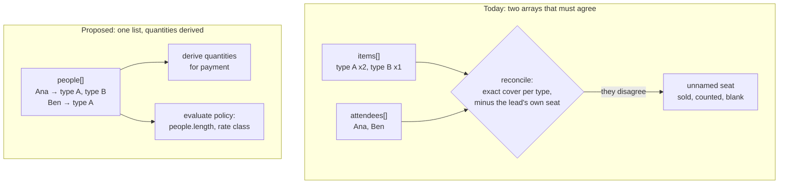
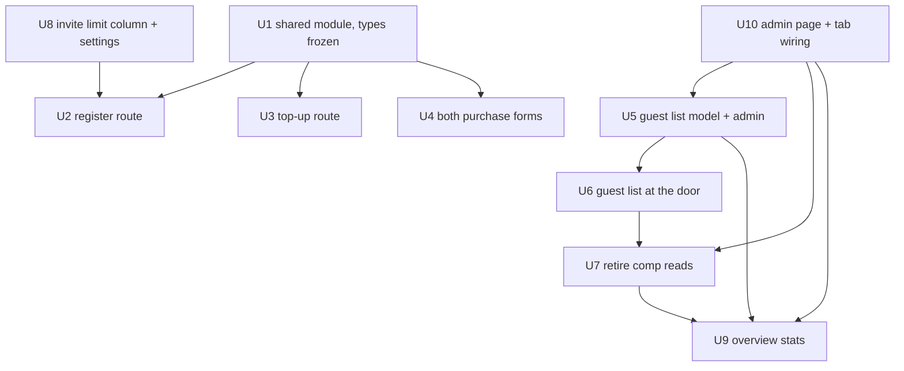

# Unified Purchase Module - Plan

## Goal Capsule

- **Objective.** Model a ticket order as a list of people carrying ticket types, so mandatory naming and multi-day purchases stop being rules to enforce and become the shape of the data. Consolidate the three purchase surfaces onto one module, retire comp tickets in favour of plain guest lists, and surface per-event purchase policy on the event settings page.
- **Product authority.** This plan owns the purchase contract, the limit policy, and the guest-list replacement. The private-link redemption gate is a separate piece of work and is not active scope here.
- **Open blockers.** None. The six questions the 2026-08-15 review raised were settled on 2026-08-15; see Outstanding Questions for each answer and what it changed.
- **Execution profile.** Parallel agent teams in a worktree. Unit boundaries are drawn for file ownership, not just logical cohesion — see the ownership rules in the Planning Contract before dispatching more than one agent.
- **Product Contract preservation.** Two changes, both settled with the owner on 2026-08-15.
  - R16 — the mechanism moves from dropping `is_comp` to retiring its reads and keeping the column. Research found two live consumers (a refund rule and the contactless-guest constraint) plus 21 historical rows that would strand. KD7's intent is unchanged: no contactless mode in the shared module.
  - R11 — **reversed.** A guest-list guest *is* a ticket, one with no registration behind it. The original "an entry is not a ticket" bought capacity exclusion at the price of a parallel door path, a parallel arrival record and a follow-up union. A registration-less ticket buys the same exclusion for free and reuses every downstream surface. See KD10.

---

## Product Contract

### Summary

An order becomes a list of people, each carrying the ticket types they are taking; quantities are derived rather than submitted. A single per-event limit on the invite rate counts distinct people instead of ticket rows. Comp tickets are retired and replaced by guest lists — a named list, a contact, and guests who each hold an ordinary ticket that no registration paid for.

### Problem Frame

Four bookings between 10 and 14 August 2026 sold a seat that was never named. The immediate cause was fixed in PR #132, but the shape that allowed it is untouched: an order arrives as two parallel arrays — quantities in one, named attendees in another — which then have to be reconciled. Every reconciliation rule that exists (exact cover per ticket type, the identity-collision check, the `requiredPerType` arithmetic, the lead's own seat needing one fewer name) exists only because those two arrays can disagree.

The same split explains the multi-day collision. One person buying Friday and Saturday of a two-day event is two ticket rows and one human, so a rule counting rows treats them as two people and a rule counting identity treats them as a duplicate. Both readings are wrong, and each produced a bug.

Enforcement has also drifted because the shared validator answers the wrong question. `lib/events/attendee-input.ts` is importable by client code — its only runtime import is a pure helper — yet `components/public/EventRegistrationForm.tsx` reimplemented the identity logic anyway, because the validator bails on the first failure and returns one string while a form needs every bad row marked at once. Three purchase surfaces now exist at three levels of rigour: checkout validates fully, `components/public/BuyMorePanel.tsx` checks only that name and email are non-empty.

Comp guest lists carry a disproportionate share of this complexity. They have produced 27 tickets across 3 bookings in the platform's lifetime, 21 of them with no email and only 3 ever checked in, with none live on any upcoming event — while costing four dedicated RPCs, a batches table, the `is_comp` carve-out in the `tickets_contact_present` constraint, comp branches across roughly fifteen files, and a legacy booking page retained solely to render contactless comp QRs.

### Key Decisions

- KD1. **An order is a list of people, not a basket of quantities.** (session-settled: user-directed — chosen over extracting a shared evaluator against the current model: it removes the bug class rather than validating against it.) Governs R1, R2, R3.
- KD2. **The purchase limit counts distinct people, not ticket rows.** (session-settled: user-approved — the limit exists to cap how many people ride one privileged rate, which is a headcount; counting rows breaks when one person holds two ticket types.) Governs R6, R8.
- KD3. **One limit, on the invite rate only.** (session-settled: user-directed — chosen over a limit per rate class: the stated threat is cheap-rate abuse, members are vetted, and capping full-price buyers caps revenue for no reason. Capacity already handles scarcity.) Governs R6, R7.
- KD4. **A day is a ticket type; the platform has no multi-day concept.** This matches how multi-day events are modelled generally — the type carries the day, and a combined pass is simply another type. Nothing in this work special-cases multi-day; it only stops assuming one person holds one ticket. Governs R3.
- KD5. **Order validation returns every violation at once, attributed to a person and a field.** The previous shared validator was correct and still got reimplemented because it answered a different question than the client asked. Governs R5.
- KD6. **The database keeps the replay guard and nothing else.** Concurrency is the one condition no application check can observe; policy rules carry no such hazard and live in the application layer. Governs R4.
- KD7. **Comp tickets are retired rather than given a contactless mode.** (session-settled: user-directed — chosen over a mode flag on the shared module: 27 tickets ever, 78% without an email, none upcoming, and the exemption is what forces every surface to carry a special case.) Governs R16, R17.
- KD8. **Guest lists stay inside the platform rather than moving to a spreadsheet.** (session-settled: user-directed — chosen over off-platform handling: capture at the door is the point of the product, and an off-platform list captures nobody.) Governs R15.
- KD9. **Invite-rate leakage is accepted.** A per-booking cap cannot stop a shared code being forwarded, since each recipient books separately. Bounding abuse is deferred to the separate redemption-gate work. Governs R6, KTD7.
- KD10. **A guest-list guest is a ticket with no registration behind it.** (session-settled: user-directed — chosen over a separate non-ticket entry model: the guest should go through the same door flow as everybody else, and a registration-less ticket delivers that with no new door code, no parallel arrival record and no follow-up union. Capacity exclusion is preserved, because the seat count reads registrations and their line items and there are none.) Governs R11, R12, R13, R14, R15, R19.
- KD11. **A guest list is built by hand, one guest at a time.** (session-settled: user-directed — chosen over pasting a block of names: the admin surface is small and internal, and a parser with blank-line, duplicate and email-splitting rules is more machinery than the job needs.) Governs R10.

### Actors

- A1. **Buyer** — the person paying, who may also be an attendee.
- A2. **Guest** — a named attendee the buyer purchases for.
- A3. **Admin** — sets per-event purchase policy and builds guest lists.
- A4. **List contact** — the sponsor or partner a guest list belongs to, named once on the list with an email and phone; not necessarily an attendee. Distinct from A2: the contact owns the list, the guests are on it.
- A5. **Door staff** — admits every attendee through one flow, whether they bought a ticket or were named on a guest list.

### Requirements

**The order contract**

The reconciliation step is where the four lost guests were created, and it exists only because quantity and identity arrive separately. Removing the second array removes the **request-side** reconciliation. It does not remove the mint-side one: quantities still mint a ticket per purchased slot and a claim then fills each, so the plan replaces that second reconciliation with an invariant — every minted ticket ends its transaction named — which U2 asserts rather than assumes.

- R1. An order is a list of people. Each person carries a name, an email, and one or more ticket types. Quantities are derived by grouping and are never submitted as a separate array.
- R2. A ticket cannot exist in an order without a person attached to it.
- R3. One person may hold several ticket types in a single order. Two entries for the same person on the same ticket type are refused.
- R4. Every surface that compares two claims uses one identity key: case-folded name, lowercased email, and ticket type.
- R5. Order validation reports every violation in one pass, each naming the rule, the person, and the offending field.

**Purchase limits and policy**

- R6. An event carries one purchase limit, applying only to orders at the invite rate, counting the distinct people in the order.
- R7. That limit is editable per event from the event settings page as a single value.
- R8. Orders at the member and public rates are not limited; seat capacity remains the only ceiling on them.

**Guest lists**

- R9. A guest list belongs to an event and carries a list name and a list contact with name, phone, and email.
- R10. A guest is added to a list one at a time, with a name, an optional email, and exactly one ticket type. A guest attending several days is added once per day, so the list stays flat and each row is one admission.
- R11. A guest on a list holds an ordinary ticket that no registration paid for. It carries a ticket type and a name; it has no registration, no payment, no refund path and no manage link.
- R12. Adding a guest never charges anything and never touches a registration.
- R13. Guest-list guests do not count against an event's seat capacity, because the seat count reads registrations and their line items and a guest-list ticket has neither.
- R14. Guest-list guests appear in the event's ticket-type totals, which are labelled to show they include guest lists.
- R15. Door staff admit a guest-list guest through the same check-in flow as everyone else, which offers the same email, marketing-consent and waiver capture.

**Retiring comp tickets**

- R16. Comp ticket creation is retired and every read of `is_comp` is removed. The column and its historical rows are kept as provenance, following the repo's flow-retirement pattern. The comp RPCs are retired in place rather than dropped, since none carries an anon or token-addressable grant.
- R17. Every newly-created ticket carries a named person with an email. The shared module has no contactless mode.

**Surfaces**

- R18. Checkout, top-up, and guest-add use the same module and the same rule set.
- R19. The event overview reports purchased counts separately from guest-list guests, and the check-in rate stays purely ticketed — a guest-list guest has no registration, so counting their arrival would push the rate past 100%. Guest-list attendance is reported as its own pair: guests on lists, guests admitted.
- R20. Checkout presents the order in two steps: the buyer's own tickets, then repeatable guest rows each carrying a name, an email and ticket types. Buy-more presents the same guest rows.
- R21. An order carries a buyer identity that owns the receipt and the manage link, whether or not the buyer is one of the people in the order.

### Key Flows

- F1. Buying for yourself and a guest
  - **Trigger:** A1 opens a public or invited event and chooses to book.
  - **Steps:** A1 selects the ticket types they are taking for themselves; A1 is then asked whether they are bringing guests; each guest is added with a name, an email, and their ticket types; the order is validated as a whole and any violations are shown against the rows that caused them.
  - **Outcome:** One order containing two people, with quantities derived for payment.
  - **Covers R1, R2, R5, R6, R18.**

- F2. Buying several days of one event for yourself
  - **Trigger:** A1 books a multi-day event that sells each day as its own ticket type.
  - **Steps:** A1 selects both days for themselves in one step; no guest row is required, and A1 is never asked to re-enter their own details as a guest.
  - **Outcome:** One person holding two ticket types, counting as one person against the limit.
  - **Covers R1, R3, R6.**

- F3. Building a guest list
  - **Trigger:** A3 receives a sponsor's list, typically as a phone call or forwarded messages.
  - **Steps:** A3 creates a list with a name and the A4 contact details; A3 adds each guest in turn with a name, a ticket type, and an email where known.
  - **Outcome:** A list attached to the event whose guests hold tickets that are excluded from capacity and included in ticket-type totals.
  - **Covers R9, R10, R12, R13, R14.**

- F4. Admitting a guest-list guest
  - **Trigger:** A2 arrives at the door having been named on a guest list rather than having bought.
  - **Steps:** A5 finds them on the roster — where they appear grouped under their list name — and checks them in through the ordinary flow, which offers email, marketing consent and the waiver exactly as it does for a buyer.
  - **Outcome:** The guest is recorded as attended and, having consented, is reachable for follow-up through the machinery that already exists.
  - **Covers R11, R15.**

### Acceptance Examples

- AE1. Multi-day for one person
  - **Covers R3, R6.**
  - **Given** an event selling Friday and Saturday as separate ticket types and a limit of two people
  - **When** one person orders both days for themselves
  - **Then** the order is accepted as one person holding two ticket types, and the limit is not consumed twice.

- AE2. The same person twice on one ticket type
  - **Covers R3.**
  - **Given** an order already naming a person for Friday
  - **When** the same name and email is added again for Friday
  - **Then** the order is refused with the violation attributed to that row, because the seat cannot be stored as a second ticket.

- AE3. A limit counts people, not tickets
  - **Covers R6, R8.**
  - **Given** an invite-rate limit of two people on a two-day event
  - **When** a buyer orders both days for themselves and both days for one guest, totalling four tickets
  - **Then** the order is accepted, because it names two people.

- AE4. A household shares one address
  - **Covers R4.**
  - **Given** two differently-named people on one email address
  - **When** the order is validated
  - **Then** both are accepted as distinct people.

- AE5. Guest-list guests and the two counts
  - **Covers R13, R14.**
  - **Given** an event at its seat capacity with a guest list of five guests on a dinner ticket type
  - **When** an admin views the event overview
  - **Then** the seat capacity is unaffected by those five, and the dinner ticket-type total includes them under a label showing guest lists are counted.

- AE6. A guest on a list who also bought
  - **Covers R4, R14.**
  - **Given** a sponsor list naming someone who already holds a purchased ticket for the same event
  - **When** the list is created and the admin views the event
  - **Then** the list is accepted, the admin list flags them as also holding a ticket, and the overview counts them once — as a purchased ticket, not as a guest-list guest. Matching uses the R4 identity key, so two differently-named people on one household address stay two people.

- AE7. A guest-list guest reaches follow-up
  - **Covers R15.**
  - **Given** a guest-list guest checked in at the door who gave an email and marketing consent
  - **When** the post-event message is sent
  - **Then** they are in the audience, through the same path a purchased attendee takes, with no guest-list-specific code involved.

### Scope Boundaries

- The private-link redemption gate — presenting the invite link as an invitation to redeem with a name and email — is separate work and not in this plan.
- Hard-gating invite links with per-recipient tokens or a total budget on the code was considered and rejected; leakage is accepted in exchange for visibility.
- Waitlist offers keep their current relationship to purchase limits.
- PR #135 is closed unmerged, **but its migration was applied and is still live.** All three `max_tickets_*` columns exist on `events` in production and its ledger entry `20260814160000_event_booking_limits` is recorded, while the migration file exists only on branch `feat/per-booking-ticket-limits`. U8 adopts `max_tickets_invite` rather than creating a column, and restores the file to `main` to close the drift. The member and public columns stay, unread. Branch `feat/per-booking-ticket-limits` must be retained until that file is back on `main` — it is the only copy.

### Outstanding Questions

**Resolved in planning**

- Q3. Where derived quantities are produced — answered by KTD2 and U1 step 4: app-side, at the line-item construction, with no RPC change.
- Q4. Unit boundaries and sequencing — answered by the Sequencing section and the file-ownership table.

**Settled with the owner, 2026-08-15**

The document review raised six. All are answered; three were dissolved rather than decided, by the model change in KD10.

- Q2. *Do guest-list guests count in the check-in rate STRATEGY.md tracks?* **No.** The rate stays checked-in ÷ registered over purchased tickets only, so the existing series stays comparable. Guest-list attendance is reported as its own pair. A guest-list ticket has no registration, so counting its arrival in the numerator alone would push the rate past 100% — U9 must exclude them explicitly, not incidentally. Landed in R19.
- Q5. *Does the invite-rate limit apply to top-ups?* **No — per-checkout only.** (session-settled: user-directed.) This is consistent with KD9, which already accepts that the invite path leaks and defers bounding it to the redemption gate; a booking-level cap would be a stronger claim than the surrounding design makes. Note the review's stated reason for the gap was **wrong** and is corrected in KTD7: the rate class *is* derivable after booking. The choice is a product one, not a technical limit.
- Q6. *Should the door require an email for a guest-list guest?* **Dissolved.** The question conflated the list contact with the guests on the list. The contact's name and email are required, captured once when the list is created. Guests are checked in through the ordinary door flow, which already offers email, marketing consent and the waiver — so there is no separate guest-list capture rule to write, and no 78%-no-email surface to design around. Landed in R9, R15.
- Q7. *What connects a captured guest-list email to follow-up?* **Dissolved by KD10.** Post-event follow-up resolves its audience from `tickets` where `checked_in_at` is set, filtered on `marketing_consent` (`lib/broadcast/event-audience.ts`). A guest-list guest holds a ticket and is checked in through the ordinary flow, so they are already in that audience. The union this plan previously proposed is not needed.
- Q8. *What happens when a guest-list guest already holds a ticket?* **Allowed, resolved at read time.** No block at creation — a sponsor naming someone who bought is normal and the admin may not know. The admin list flags it, the overview counts them once as purchased, and the door shows one person. Matching uses the R4 identity key, **never email alone**: deduping a person on contact is the failure recorded in `docs/solutions/database-issues/contact-only-replay-guard-swallows-people-sharing-an-email.md`. Landed in AE6 and U9.
- Q9. *Should the overview show one combined room headcount?* **Dissolved by KD10, and no combined figure is built.** (session-settled: user-directed — keep it simple.) Guest-list guests are tickets, so the ticket count already is the room; capacity remains registration-derived and therefore still excludes them. Purchased and guest-list figures stay separate per R19.

### Sources / Research

- `lib/events/attendee-input.ts` — the current shared identity and naming validator; client-safe, first-failure return shape.
- `components/public/EventRegistrationForm.tsx` — the checkout form, holding a reimplemented copy of the identity logic.
- `components/public/BuyMorePanel.tsx` — the top-up and guest-add surface, validating only non-empty name and email.
- `app/api/events/[id]/register/route.ts` — the full current rule set in application order.
- `supabase/migrations/20260814150000_claim_ticket_replay_guard_scoped_to_type.sql` — the type-scoped replay guard, the one rule that stays in the database.
- `docs/solutions/database-issues/contact-only-replay-guard-swallows-people-sharing-an-email.md` — the identity key's failure history in both directions.
- `docs/solutions/design-patterns/race-safe-claim-rpc-capacity-cap.md` — why a subtype in the cap must also be in the replay key.
- `STRATEGY.md` — every captured guest is a conversion prospect, which is what makes naming load-bearing rather than hygiene.

---

## Planning Contract

### Key Technical Decisions

- KTD1. **The shared module's exported types are frozen before any call site moves.** Three surfaces share no file today — consolidation is a new module plus three independent rewrites, so the module's public surface is the only thing they collide on. Freeze it in one unit, then the call sites parallelise cleanly. Covers R18.
- KTD2. **Quantity derivation is app-side only.** `create_event_registration` already sums quantity and total from the items array it receives, so it keeps working unchanged — the routes stop copying quantities off the request and start computing them from the people list. No schema change, no RPC change for the order contract. Governs R1.
- KTD3. **The lead's seat stops being special, and everything built around it goes at once.** `lead_ticket_type_id`, the seed-the-buyer step, the one-fewer-name arithmetic, and the buyer-vs-guest collision guard all exist only because the buyer is absent from the attendee array. Under a people list the buyer is person one. These are one edit, not four. Governs R1, R2.
- KTD4. **Guest-list guests are excluded from capacity structurally, not by a filter.** The seat count reads registrations and their line items; a guest-list ticket has neither, so it is never seen. A `WHERE NOT is_guest_list` predicate would have to be added to two functions and stay correct forever — not being in the table cannot drift. This is what makes KD10 safe: the exclusion survives the guest becoming a ticket, because capacity was never counted from tickets. Governs R13.
- KTD5. **The new guest list starts empty.** The three historical comp lists stay as registrations. Migrating them would mean deleting their line items to stop them counting, rewriting past capacity and past finance for no benefit. (session-settled: user-approved — chosen over migrating existing lists.) Governs R13.
- KTD6. **`is_comp` reads are retired; the column and its rows stay.** Two live consumers sit on it — a refund rule returning zero for comp tickets, and the `tickets_contact_present` disjunct that permits a contactless claimed row. The refund rule gets a replacement condition. The constraint disjunct **must stay**: verified against the shared database on 2026-08-15, exactly **18** of the 21 contactless comp rows are neither checked in nor `unclaimed`/`issued`, so they satisfy no other disjunct and would strand if it went. New guest-list tickets do not need it — see KTD10. Governs R16, R17.
- KTD7. **The invite limit is enforced at checkout only, by choice.** (session-settled: user-directed.) Note the premise the review offered for this — that a registration cannot yield its rate class — is **false**, and an implementer must not repeat it: `lib/events/ticket-types.ts:84-85` forces `price_non_member` null on members-only events and `invite_price` null on public ones, so `invite` resolves exactly when the event is members-only and `registration.is_member` is false. The rate class is derivable from data already stored. Enforcement stays at checkout because KD9 already accepts invite-rate leakage and defers bounding it to the redemption gate, not because the data is missing. Consequence to hold: a buyer can book one seat and add more through top-up, which prices at the invite rate and does not consult the limit. Governs R6, R8.
- KTD8. **SQL changes are proven in a rolled-back transaction before applying, and the applied function is proven to be the one tested.** Dev and prod share one database and the test suite mocks Supabase entirely, so no RPC body is ever executed by a test.
- KTD9. **The paid path is in scope, and the post-mint invariant is what replaces the removed reconciliation.** A paid order does not finish in the register route — it is staged and applied later by the Stripe webhook, which also seeds the buyer's ticket. Exactly one step may create that ticket once the buyer is person one. The invariant every path must end on: no registration holds an unnamed ticket, and a claim reporting it did nothing is a failure. Governs R1, R2, R17.
- KTD10. **A guest-list ticket satisfies `tickets_contact_present` at every point in its life without `is_comp`.** The constraint (`supabase/migrations/20260721140100_tighten_contact_present.sql`) passes a row that is `unclaimed`/`issued`, **or** has an email, **or** has a phone, **or** has `checked_in_at` set, **or** is comp. A guest-list ticket is created `issued` with a name and no email — first disjunct — and the door sets `checked_in_at` — fourth. `tickets.registration_id` is nullable, so no registration row is needed and none is created; that is what keeps it out of capacity and out of the `event_registrations` paid/free dedupe index. Note the column is nullable but **has never been null in production** — see Risks; this plan mints the first such rows, so no existing read has been exercised against them. This is the whole technical basis for KD10, and it is why retiring comp does not require a contactless mode. Governs R11, R13, R15.
- KTD11. **The check-in rate must exclude guest-list tickets explicitly.** It is checked-in ÷ registered; a guest-list ticket is checked in but never registered, so it inflates the numerator against a denominator it never joins. The exclusion is a filter someone has to write and keep — unlike capacity, this one does not come free from the model. Governs R19.

### File ownership for parallel execution

Four files are where independent units collide. Each has a single owning unit; every other unit defers its change there. **The owner runs before the units that depend on it** — an ownership rule whose owner runs last blocks everything it was meant to protect.

| File | Owner | Rule |
|---|---|---|
| `app/(admin)/admin/events/[id]/attendees/page.tsx` | U10 | The only admin event page — select strings, stats, guest-list assembly and settings reads all live here. U10 runs first so U5 has a mount point and U7 can finish. |
| `components/admin/ManageEventTabs.tsx` | U10 | The prop bus for every admin surface. Prop additions from other units are requested through U10. |
| `components/admin/GuestList.tsx` | U5 | Rewritten onto the new list model, dropping the import of the module U7 deletes. U7 does not touch it. |
| `types/database.ts` | U8 | Regeneration drops the hand-written aliases at end of file, so concurrent regens fight. U8 regenerates once, **after U5's migration has applied**, so one regeneration covers both the guest-list table and the invite-limit column. U5 and U6 declare local row types until then. Re-append `MemberStatus` and `PaymentCaptureStatus` after regenerating — the generator drops them every time. |

### Sequencing

Edges are unit-to-unit, not phase-to-phase, so nothing idles behind work it does not need. Two chains run independently: the guest-list chain (U10 → U5 → U6 → U7 → U9) and the order-contract chain (U1 and U8 → U2, U3, U4). U10 and U8 are both cheap and both block others, so they go first. Within the order chain, U1 blocks and U2–U4 then run in parallel — but they land as **one change**, because two order shapes in flight is worse than either end state.

One cross-chain ordering constraint that the edges do not show: U8 regenerates `types/database.ts` and owns it, so it must run **after U5's migration applies**, or the guest-list table is missing from the generated types and U5/U6 keep their local declarations for nothing. U8 does not otherwise depend on U5.

For a first slice: U10 → U5 → U6 → U7 completes the guest-list replacement without touching the purchase contract at all. Under KD10 that slice is now considerably smaller than when this plan was written — U5 adds one table and one column, and U6 is presentational.

---

## Implementation Units

### U1. Shared order module with frozen types

- **Goal.** One module owning the order shape and its rules, exporting a validator that reports every violation at once against the person and field that caused it.
- **Requirements.** R1, R2, R3, R4, R5, R18. Covers KD1, KD5, KTD1.
- **Dependencies.** None. Blocks U2, U3, U4.
- **Files.** `lib/events/order.ts` (new), `lib/events/order.test.ts` (new), `lib/events/attendee-input.ts` (identity key folded in; kept as the SQL mirror it documents itself to be).
- **Approach.**
  1. Define the order shape: a list of people, each with name, email, and ticket types.
  2. Port the identity key from `lib/events/attendee-input.ts` unchanged — it already mirrors the database guard and must stay in step with it.
  3. Write the evaluator to accumulate violations rather than returning on the first. A violation carries an optional person and field: a naming or identity fault points at the row that caused it, while an order-scoped fault — the invite limit, seat capacity — carries neither and renders above the rows. Pinning a limit breach to an arbitrary guest is worse than not pinning it.
  4. Carry forward the bounds that live in the parsing code being replaced: a maximum people count and a maximum derived ticket count per order, supplied by the caller, plus the existing name and email length caps and the first-and-last-name rule. Both purchase routes are unauthenticated and these are what stop an arbitrary payload reaching a service-role write.
  5. Export a derivation that groups people into per-type counts for the line-item array.
- **Patterns to follow.** `lib/events/pricing.ts` — two entry points on one module because two paths know different things, rather than one entry point with a mode flag. `lib/events/roster-sort.ts` — pure and dependency-free on purpose so client components can import it.
- **Test scenarios.**
  - One person holding two ticket types is accepted as one person and two tickets. Covers AE1.
  - The same person twice on one ticket type is refused, with the violation attributed to the second entry. Covers AE2.
  - Two differently-named people on one email address are both accepted. Covers AE4.
  - An order violating three rules returns three violations in one pass, not the first.
  - Derivation of a two-person, three-ticket order produces the same per-type counts the current line-item builder would.
  - A person with no ticket types is refused.
  - An order past the people bound, an over-length name, and an over-length email are each refused.
  - An order-scoped violation carries no person and no field.
- **Verification.** The module is importable from a client component without pulling server-only code. Mutation check: revert each rule in turn and confirm a test goes red.

### U2. Register route on the people contract

- **Goal.** The public checkout accepts a people list, derives quantities, and applies the policy evaluator.
- **Requirements.** R1, R2, R5, R17, R18. Covers KTD2, KTD3, KTD9.
- **Dependencies.** U1, U8 (the limit column and its settings route land first).
- **Files.** `app/api/events/[id]/register/route.ts`, `app/api/events/[id]/register/route.test.ts`, `lib/events/roster.ts`, `app/api/webhooks/stripe/route.ts`, `app/api/webhooks/stripe/route.test.ts`.
- **Approach.**
  1. Replace the items and attendees parsing with the people list.
  2. Remove the lead asymmetry as one edit: the buyer becomes person one, so the lead ticket type, the seed step, the one-fewer-name arithmetic and the buyer-collision guard all go together.
  3. Derive the line-item array from the people list and pass it to the existing registration RPC unchanged.
  4. Apply the invite-rate limit against distinct people at the resolved rate class, reading the column U8 created.
  5. Carry the change through the paid path, which does not finish in this route. State what the staged roster payload becomes under the people contract, whether the buyer is in it, and which single step creates the buyer's ticket — the staged payload or a retained seed. Only one may.
  6. Assert the post-mint invariant: after minting and claiming, every ticket on the registration carries a name. A claim that reports it did nothing is a failure, not a success.
- **Execution note.** The existing route test is the characterization suite for this rewrite — extend it before changing the handler, so the rules that survive are provably unchanged.
- **Test scenarios.**
  - A buyer plus one guest produces the same line items and registration totals as the equivalent order does today.
  - A buyer taking two ticket types is one person against the limit. Covers AE3.
  - An order exceeding the invite-rate limit is refused; the same order at the member rate is accepted. Covers AE3.
  - Seat capacity still refuses an over-capacity order.
  - An offer redemption still pins the entry's email and refuses a non-seat type.
  - Every violation in a multi-error order is reported at once.
  - A paid checkout whose webhook fires produces exactly one ticket per person-and-type pair, with the buyer's own ticket present and not duplicated.
  - A replayed webhook delivery leaves the ticket set unchanged.
  - A claim reporting it did nothing fails the unit rather than passing silently.
- **Verification.** A free order and a paid order both produce identical persisted rows to the pre-change route for the same party, and no registration ends either path with an unnamed ticket.

### U3. Top-up route on the people contract

- **Goal.** Buying more seats onto an existing booking uses the same module and the same rules as checkout.
- **Requirements.** R1, R5, R18.
- **Dependencies.** U1.
- **Files.** `app/api/public/bookings/[token]/topup/route.ts`, `app/api/public/bookings/[token]/topup/route.test.ts`.
- **Approach.** Replace the items and attendees parsing with the people list; derive quantities for the top-up row and the payment lines; keep the existing collision check against already-named seats, now sourced from the shared module; pass this route's own order bound to the evaluator. **The invite limit is deliberately not enforced here** (Q5, KTD7): the cap is per-checkout, so a buyer can add seats at the invite rate through this route without consulting it. Leave a comment saying so and naming KTD7, so the omission reads as a decision rather than an oversight — a later reader finding an unenforced limit on a route that prices at the invite rate will otherwise "fix" it.
- **Test scenarios.**
  - Adding one guest produces the same top-up row as today.
  - Adding a person who already holds a seat of that type on the booking is refused.
  - Adding the same person on a different ticket type is accepted.
  - A free top-up applies and names its seats; the loud unnamed-seat log fires when a claim reports it did nothing.
  - A top-up at the invite rate that would exceed the event's limit is **accepted** — pinning the per-checkout decision so a later change to per-booking is a deliberate, test-visible one.
- **Verification.** Free and paid top-ups produce identical persisted rows to the pre-change route for the same addition.

### U4. Both purchase forms on the shared module

- **Goal.** Checkout and buy-more render from one module, with the two-step shape: your own tickets, then repeatable guest rows.
- **Requirements.** R5, R18, R20, R21. Covers KD5.
- **Dependencies.** U1.
- **Files.** `components/public/EventRegistrationForm.tsx`, `components/public/EventRegistrationForm.test.tsx`, `components/public/BuyMorePanel.tsx`, `components/public/BuyMorePanel.test.tsx` (new — buy-more has no characterization suite today), `components/public/TicketManager.tsx`.
- **Approach.**
  1. Delete the hand-rolled identity logic in the checkout form and import the module instead.
  2. Render violations against the row that caused them, from the evaluator's output.
  3. Give buy-more the same guest rows and the same validation the checkout form has — this is where its non-empty-only checking ends.
  4. A person taking several ticket types is one row with several types selected, not several rows.
  5. Render an order-scoped violation as a summary above the rows rather than against any one of them, and have both routes return the evaluator's violation array keyed so the form can match each to its row — a server rejection must not collapse back into one banner.
- **Test scenarios.**
  - A buyer adding themselves for two days sees one row, not a guest row demanding their own details again.
  - Three invalid guest rows all show errors simultaneously.
  - Buy-more refuses a guest with no email, where today it accepts one.
  - A shared email across two guests is accepted in both surfaces.
  - A server-rejected order marks the offending rows, not a single banner.
  - An invite-limit breach renders above the rows with no row highlighted.
  - In buy-more, types the holder already holds show as held rather than erroring when selected.
- **Verification.** Neither component contains a local copy of the identity or naming rules; both import them.

### U5. Guest list model and admin surface

- **Goal.** A guest list is a list attached to an event — a list name, a list contact, and guests who each hold a registration-less ticket.
- **Requirements.** R9, R10, R11, R12, R13. Covers KD8, KD10, KD11, KTD4, KTD5, KTD10.
- **Dependencies.** None. Blocks U6, U7, U9.
- **Files.** `supabase/migrations/<ts>_guest_lists.sql` (new), `lib/events/guest-lists.ts` (new), `lib/events/guest-lists.test.ts` (new), `app/api/admin/events/[id]/guest-lists/route.ts` (new), `components/admin/GuestList.tsx`.
- **Approach.**
  1. **One** new table — `event_guest_lists`: event id, list name, contact name, contact email, contact phone — plus **one** nullable `guest_list_id` column on `tickets` referencing it. There is no entries table: a guest on a list *is* a ticket. This is the whole schema change.
  2. **The new table enables row-level security with no anon or authenticated policy**, so it is reachable only through the service-role client behind the admin route. Every other public table in this schema is protected this way; a new table is exposed through the API until it is.
  3. Every handler on the new route calls the admin gate first, and every write resolves the list against the path event before touching it, 404ing without distinguishing not-found from wrong-event. This replaces the gate `lib/events/guest-list-auth.ts` supplies today.
  4. Adding a guest inserts one ticket: `guest_list_id` set, `registration_id` **null**, `ticket_type_id` chosen by the admin, name required, email optional, `slot_status` `'issued'`. Assert against `tickets_contact_present` (KTD10) — `'issued'` is what makes a nameless-email row legal before the door, so the status is load-bearing, not incidental. Write no `event_registrations` row and no `event_registration_items` row; that absence is the capacity exclusion (KTD4), so a future refactor that "tidies up" by adding a registration would silently start consuming seats.
  5. A guest attending several days is added once per day, keeping the list flat and each row one admission.
  6. The admin form adds one guest at a time — name, ticket type, optional email. No paste import and no parser (KD11).
  7. Deleting a list must decide what happens to its tickets. Deleting a checked-in guest's ticket destroys attendance history that follow-up and the check-in figures read. Delete only tickets that were never checked in; refuse the delete otherwise, or detach and keep them.
- **Execution note.** Additive migration first, verified in a rolled-back transaction, then the calling code. The reverse order 500s on a shared database. `lib/events/guest-lists.ts` (plural, new) sits alongside `lib/events/guest-list.ts` (singular) until U7 deletes the latter — do not confuse them; import paths differ by one character.
- **Test scenarios.**
  - Adding a guest creates a ticket with a null `registration_id`, the chosen type, and the list id set.
  - A guest added without an email is accepted and satisfies the contact-present constraint.
  - Adding a guest creates no registration and no registration item.
  - An unauthenticated request and a non-admin request are both refused; a list id from another event 404s.
  - A guest attending two days is two tickets.
  - Deleting a list removes its never-checked-in tickets and leaves checked-in ones per the rule chosen in step 7.
  - Guest-list guests do not appear in the seat count for their event. Covers AE5.
- **Verification.** Creating a guest list on an event at capacity does not change `seats_used`, verified by reading it before and after. The new table reports row-level security enabled and no select privilege for the public role.

### U6. Guest lists on the door roster

- **Goal.** A guest-list guest is findable at the door, grouped under their list name. Admission itself needs no new code.
- **Requirements.** R15. Covers KD8, KD10.
- **Dependencies.** U5.
- **Files.** `lib/events/door-roster.ts`, `lib/events/door-roster.test.ts`, `components/door/DoorConsole.tsx`, `components/events/DoorRosterSheet.tsx`.
- **Approach.** This unit is presentational. A guest-list guest already holds a ticket, so the roster query already returns them and the existing check-in flow already admits them, captures email, marketing consent and the waiver, and writes `checked_in_at` — do not add a check-in branch, and do not touch `app/api/public/door/[id]/check-in/route.ts`. The work is to carry `guest_list_id` and the list name onto the roster row and group those rows under their list on the console and the printed sheet, so staff can find a name a sponsor gave them. Confirm first, by reading the roster query, that a `registration_id`-null ticket is actually returned — if the projection joins registrations rather than left-joining, that join is this unit's real change and the grouping is secondary.
- **Test scenarios.**
  - A guest-list guest appears on the roster grouped under their list name.
  - A ticket with a null `registration_id` is returned by the roster query and not dropped by a join.
  - Checking one in through the ordinary flow records arrival, email, consent and waiver, with no guest-list-specific branch involved. Covers AE7.
  - A ticketed scan is unaffected by the presence of guest lists.
  - The printed sheet renders the guest-list grouping with the list contact named.
  - An event with no guest lists renders exactly as it does today.
- **Verification.** A door session admits one purchased attendee and one guest-list guest through the same control, and both appear in arrivals.

### U7. Retire comp reads

- **Goal.** No code reads `is_comp`; the column and its rows remain as history.
- **Requirements.** R16. Covers KD7, KTD6. (R17 is delivered by the shared module in U1–U3, not here.)
- **Dependencies.** U5, U6.
- **Files.** `lib/events/refunds.ts`, `lib/admin/finance.ts`, `lib/events/purchase-history.ts`, `lib/email/cancellation-notice.ts`, `app/api/admin/events/[id]/tickets/[ticketId]/refund/route.ts`, `components/admin/AttendeeList.tsx`, `components/public/CompGuestListManager.tsx` (delete), `app/(checkin)/public/bookings/[token]/page.tsx` (comp branch only — the file stays), `app/api/public/bookings/[token]/convert/route.ts`, `app/api/admin/events/[id]/guest-list/route.ts` (delete), `app/api/admin/events/[id]/guest-list/[regId]/guests/route.ts` (delete), `lib/events/guest-list.ts` (delete outright — nothing is ported from it now that KD11 drops paste import), `components/public/CompGuestListManager.test.tsx` (delete), `app/api/admin/events/[id]/guest-list/route.test.ts` (delete), `app/api/admin/events/[id]/guest-list/[regId]/guests/route.test.ts` (delete), `lib/events/guest-list.test.ts` (delete), plus the six test files that pin `is_comp` fixtures: `lib/events/refunds.test.ts`, `lib/admin/finance.test.ts`, `lib/events/purchase-history.test.ts`, `lib/email/cancellation-notice.test.ts`, `app/api/admin/events/[id]/tickets/[ticketId]/refund/route.test.ts`, `components/admin/AttendeeList.test.tsx`.
- **Approach.**
  1. Retire the write paths first: the comp guest-list routes and the admin surface that calls them.
  2. Then the reads. The refund rule needs its replacement in place *before* the flag read goes, and position matters: the current guard is an early return sitting before line resolution and before the booking-average fallback. Move the zero test to after line resolution, returning zero both when the resolved line price is zero and when no line resolves at all — otherwise a comp seat with no priced line falls through to the average and refunds real money.
  3. Strip only the comp branch from `app/(checkin)/public/bookings/[token]/page.tsx`. Do not delete the file: it also redirects ordinary registration manage-links to the payer's ticket page, so deleting it 404s every manage-link ever emailed. Drop the now-dead guest-list redirect in the convert route at the same time.
  4. Leave the four comp RPCs and `comp_guest_batches` in place — none carries an anon or token-addressable grant, so retiring their callers is sufficient.
  5. Leave the `is_comp = true` disjunct in `tickets_contact_present` alone (KTD6). It still protects 18 historical contactless `claimed` rows that satisfy no other disjunct, and new guest-list tickets never need it (KTD10). Removing it is a separate, evidenced change.
  6. Grep the repo for the retired noun, not just the retired paths — comments outlive routes and the type checker cannot see them.
- **Execution note.** `lib/events/guest-list-auth.ts` is NOT deleted — it supplies the admin gate to two waitlist routes that have nothing to do with comp tickets, and removing it breaks the typecheck and the waitlist offer flow. Before touching the refund rule, enumerate all 27 historical comp tickets and assert each returns zero under the replacement condition; only then remove the flag read.
- **Test scenarios.**
  - A zero-price ticket still refunds zero with no reference to the comp flag.
  - A comp ticket that resolves to no priced line refunds zero rather than falling through to the booking average.
  - An ordinary registration manage-link still redirects to the payer's ticket page after the comp branch is stripped.
  - Finance totals for a past event containing comp tickets are unchanged before and after.
  - The admin attendee list renders a historical comp ticket without special-casing it.
  - No source file outside migrations references `is_comp`.
- **Verification.** A repo-wide search for `is_comp` returns only migration files, the generated `types/database.ts`, and this plan. Finance figures for the three historical guest-list events are identical before and after.

### U8. Invite-rate limit and its setting

- **Goal.** An event carries one invite-rate limit, editable from event settings, counting distinct people in an order.
- **Requirements.** R6, R7, R8. Covers KD2, KD3, KTD7.
- **Dependencies.** None. Blocks U2, which enforces against the column this unit creates.
- **Files.** `supabase/migrations/<ts>_event_booking_limits_reconcile.sql` (new — see below; this is a reconciliation, not a fresh column), `types/database.ts`, `app/api/admin/events/[id]/settings/route.ts`, `app/api/admin/events/[id]/settings/route.test.ts`, `components/admin/EventCheckInSettings.tsx`, `lib/events/order.ts`.
- **Approach.**
  1. **Do not create a column. It already exists.** Verified against the shared database on 2026-08-15: `events` already carries `max_tickets_invite`, `max_tickets_member` and `max_tickets_non_member`, all nullable integers, all applied by PR #135's migration `20260814160000_event_booking_limits` — which is recorded in `supabase_migrations.schema_migrations` even though the PR was closed unmerged. Closing a PR does not unapply its migration on a shared database. No event has a value in any of the three (24 events, zero set), and nothing on `main` reads them.
  2. **Resolve the ledger drift before anything else.** The migration file exists only on branch `feat/per-booking-ticket-limits`, so `main`'s history does not explain the live schema and a fresh clone cannot reproduce it. Restore the file to `main` under its original `20260814160000` version so the ledger entry and the repo agree — do not re-apply it, and do not stamp a new version. Confirm afterwards that the ledger and the file list match both ways, per the repo's reconciliation rule.
  3. Adopt `max_tickets_invite` as the single limit this plan needs. Leave `max_tickets_member` and `max_tickets_non_member` in place and unread — KD3 says only the invite rate is capped, and dropping columns nothing reads is a separate, evidenced change.
  4. Add `max_tickets_invite` to the settings route's typed allow-list and the settings form as a second section, with a sensible upper bound. Do not add it to the general event-update route — single-writer ownership forbids it, and that route's own comment says so.
  5. This unit lands **before** U2 so the register route has a column to read, and **after** U5's migration so one `types/database.ts` regeneration covers both.
- **Execution note.** This unit's risk is not the column; it is believing the column is absent. Start by querying `information_schema.columns` for the live shape rather than trusting either the plan or the migration directory.
- **Test scenarios.**
  - Setting the limit persists on `max_tickets_invite` and renders on reload.
  - An out-of-range value is refused by the settings route.
  - A null limit means unlimited. (Enforcement itself is U2's; this unit proves the column round-trips.)
  - The general event-update route cannot write the limit.
- **Verification.** `max_tickets_invite` is settable from the settings page before U2 begins, and no other write path touches it. The migration ledger and `supabase/migrations/` agree in both directions: every recorded version has a file on `main`, and every file on `main` has a recorded version.

### U10. Admin page and tab wiring

- **Goal.** One unit owns the admin event page and the tab prop bus for the whole plan, and it runs first so the units that follow have somewhere to mount.
- **Requirements.** R16. Covers KTD6.
- **Dependencies.** None. Blocks U5, U7, U9.
- **Files.** `app/(admin)/admin/events/[id]/attendees/page.tsx`, `components/admin/ManageEventTabs.tsx`, `components/admin/AttendeeList.tsx`.
- **Approach.** Strip the four `is_comp` reads that live on this page — the ticket select string, the flag driving the Special Guest pill, the comp payment-state derivation, and the filter that assembles the guest-list tab — and state what a historical comp ticket shows instead (a plain zero-price ticket, no special pill). Repoint the guest-list tab at the new list model, dropping the comp-shaped props. This is why U7 can meet its own definition of done and why U5's surface is reachable when it lands.
- **Test scenarios.**
  - A historical comp ticket renders with no comp branch and no Special Guest pill.
  - The guest-list tab renders from the new list model.
  - An event with no guest lists renders exactly as it does today.
- **Verification.** No `is_comp` read remains on the admin event page, and the guest-list tab mounts the new surface.

### U9. Overview stats

- **Goal.** The event overview separates purchased counts from guest-list guests, labels ticket-type totals as including guest lists, and keeps the check-in rate purely ticketed.
- **Requirements.** R14, R19. Covers KD10, KTD11.
- **Dependencies.** U5, U7, U10.
- **Files.** `components/admin/EventRosterSummary.tsx`, `lib/events/booked-tickets.ts`, `lib/events/booked-tickets.test.ts`.
- **Approach.**
  1. `splitBookedTickets` derives its split from registrations and their items, so a guest-list ticket — having neither — is invisible to it and its existing `guestList` bucket goes permanently to zero. Re-source that bucket by counting tickets with a non-null `guest_list_id`, and keep the documented identity that paid + free + guest list = booked, and booked − active = cancelled. That file's header explains why a disagreement here surfaces to an admin as a phantom refund; the same reasoning applies to the new source.
  2. Ticket-type totals union purchased counts with guest-list guests and say so in the label.
  3. **Exclude guest-list tickets from the check-in rate** (KTD11). It is checked-in ÷ registered, and these are checked in but never registered, so without an explicit filter the rate can exceed 100%. Report guests-on-lists and guests-admitted as their own pair instead.
  4. Count a person once when they hold both a purchased ticket and a guest-list ticket: they count as purchased, and the admin list flags the overlap. Match on the R4 identity key — case-folded name plus lowercased email — never email alone. Covers AE6.
  5. Page-level edits are requested through U10, which owns that file.
- **Test scenarios.**
  - A ticket type with nine purchased and two guest-list guests reports eleven, labelled. Covers AE5.
  - Active tickets and the check-in rate both exclude guest-list guests; the rate never exceeds 100% with guests present.
  - The guest-list count comes from tickets, not registrations, and is non-zero for a list created under the new model.
  - A person holding both a purchased and a guest-list ticket is counted once and flagged. Covers AE6.
  - Two differently-named people sharing an email are counted as two, not merged.
  - An event with no guest lists renders exactly as it does today.
  - The booked-minus-cancelled reconciliation holds with guest lists present.
- **Verification.** Overview figures for an event with a guest list reconcile against the door sheet and the seat count, and the check-in rate is computed over purchased tickets only.

---

## Verification Contract

| Gate | Command | Applies to |
|---|---|---|
| Types | `npx tsc --noEmit` | every unit |
| Unit tests | `npm run test:unit` | every unit |
| Lint | `npm run lint` | every unit |
| SQL applies cleanly | migration applied in a rolled-back transaction against the shared database, then re-applied for real | U5, U8 |
| SQL identity | md5 of comment-stripped, whitespace-normalised `prosrc` equals the same normalisation of the migration body | any changed function — none currently planned |
| Table protection | the new table reports row-level security enabled and no `SELECT` privilege for `anon` | U5 |
| Refund safety | all 27 historical comp tickets return a zero refund under the replacement condition, asserted before the flag read is removed | U7 |
| Capacity untouched | `seats_used` read before and after creating a guest list on an event at capacity returns the same number | U5 |
| Constraint safety | a guest-list ticket satisfies `tickets_contact_present` when `issued` with no email, and again once checked in — proven in the rolled-back transaction, not assumed from KTD10 | U5 |

The four standing replay-guard assertions are re-run against whatever the new contract produces, not only against the database function: same person on a different ticket type claims a second seat; same person on the same type still collapses; a different person on a shared email still claims; an untyped legacy seat still matches and adopts its type. The third of these is the property a previous fix bought and must never regress.

---

## Definition of Done

- An order is submitted as a list of people; no surface sends a separate quantity array.
- The reconciliation step is gone from both purchase routes, along with the lead-seat asymmetry.
- Both purchase forms import the shared module; neither holds a local copy of the identity or naming rules.
- Buy-more validates a guest to the same standard as checkout.
- A guest list can be created, added to one guest at a time, found at the door under its list name, and checked in from — through the ordinary check-in flow, with no guest-list-specific admission code.
- A guest-list guest holds a ticket with a null `registration_id` and no registration item, and does not change `seats_used` for their event.
- A guest-list guest who consents at the door reaches the post-event audience with no change to `lib/broadcast/event-audience.ts`.
- No hand-written source file reads `is_comp` (migrations and the generated `types/database.ts` still carry it), the `tickets_contact_present` disjunct is left in place, and finance figures for historical comp events are unchanged.
- An event carries an editable invite-rate limit that counts distinct people and refuses an over-limit order at the invite rate at checkout only, with the top-up omission commented as a decision.
- The event overview reports purchased counts and guest-list guests separately, with ticket-type totals labelled as including guest lists, and the check-in rate computed over purchased tickets only.
- Every SQL change — the guest-list tables and the invite-limit column — was proven in a rolled-back transaction before applying. No RPC bodies change in this plan.
- An order carrying several violations reports all of them in one pass, each attributed to a person and field where one applies, and both purchase forms render them against the rows that caused them.
- No path — free or paid — ends with a registration holding an unnamed ticket.

---

## Risks & Dependencies

- **Two order shapes in flight.** A partially-migrated contract is worse than either end state: one surface sending people while another sends quantities means the reconciliation bug returns in a new form. Mitigation: U2, U3 and U4 land together as one change, gated on U1's exported types being frozen first.
- **The refund zero-rule is real money.** A comp ticket currently refunds zero because of its flag. Removing the read without a replacement condition makes historical comp tickets refundable at face value. Mitigation: U7 replaces the condition with the ticket's own price before removing the flag read, and verifies finance totals for the three historical guest-list events are byte-identical before and after.
- **Migrations hit production immediately.** Dev and prod share one database, and no test executes an SQL body. Mitigation: every SQL change is proven in a rolled-back transaction against real fixtures, applied, then proven identical to what was tested.
- **The live schema is already ahead of `main`.** PR #135 was closed unmerged, but its migration had already run: three `max_tickets_*` columns exist in production and the ledger records `20260814160000_event_booking_limits`, while the file lives only on a closed branch. A fresh clone of `main` therefore cannot reproduce production. This is the standing hazard of a shared database — closing a PR unapplies nothing — and it is why U8 begins by reading `information_schema` rather than the migrations directory. Mitigation: U8 restores the file and reconciles the ledger both ways; until then, branch `feat/per-booking-ticket-limits` must not be deleted, because it holds the only copy of an applied migration.
- **The admin event page is a single point of contention.** Five units would naturally touch it. Mitigation: U10 owns it outright and runs first; other units request changes there rather than making them.
- **The invite limit is not enforced on top-up.** A buyer can book one seat at the invite rate and add more through a route that prices at the same rate without consulting the cap. This is a decision (KTD7, KD9), not an oversight, and the rate class *is* derivable if it is ever revisited — so the fix stays cheap. Mitigation: U3 comments the omission and pins it with a test that asserts acceptance.
- **A guest-list ticket is a ticket no code has ever seen.** Verified against the shared database on 2026-08-15: `select count(*) from tickets where registration_id is null` returns **0**. The column is nullable but has never been null in production, so every query, join and count touching `tickets` has only ever run against rows that have a registration — none of them is tested or exercised against this shape, and an inner join through registrations will silently drop these rows rather than fail. That silent drop is exactly what buys capacity exclusion (KTD4) and exactly what breaks a total. `splitBookedTickets` is the known case and U9 owns it; the door roster projection is the suspected case and U6 checks it first. Mitigation: treat "does this read reach tickets through registrations?" as the standing question for every surface this plan touches, and grep `registration_id` before assuming a query returns them. This is the single highest-risk consequence of KD10.
- **Deleting a guest list can destroy attendance history.** Once a guest is a ticket, deleting them after check-in removes a check-in the follow-up audience and the door figures already counted. Mitigation: U5 step 7 decides the rule explicitly rather than letting a cascade decide it.
