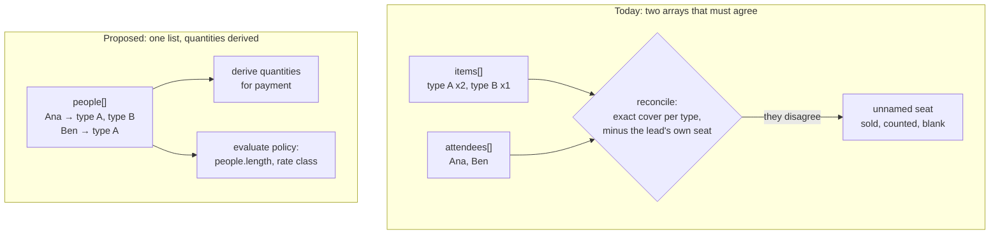
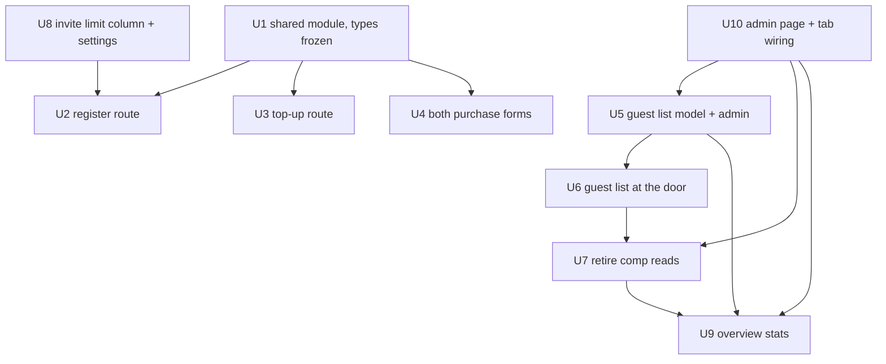

# Unified Purchase Module - Plan

## Goal Capsule

- **Objective.** Model a ticket order as a list of people carrying ticket types, so mandatory naming and multi-day purchases stop being rules to enforce and become the shape of the data. Consolidate the three purchase surfaces onto one module, retire comp tickets in favour of plain guest lists, and surface per-event purchase policy on the event settings page.
- **Product authority.** This plan owns the purchase contract, the limit policy, and the guest-list replacement. The private-link redemption gate is a separate piece of work and is not active scope here.
- **Open blockers.** Six product questions from the 2026-08-15 document review (Q2, Q5–Q9 in Outstanding Questions) each block a named unit — the invite limit's reach across top-ups, whether the door requires a guest email, what connects captured emails to follow-up, and three reporting questions. The order-contract chain (U1–U4, U8) is unblocked; the guest-list chain stalls at U6 and U9 until Q6–Q9 are answered.
- **Execution profile.** Parallel agent teams in a worktree. Unit boundaries are drawn for file ownership, not just logical cohesion — see the ownership rules in the Planning Contract before dispatching more than one agent.
- **Product Contract preservation.** Changed: R16 — the mechanism moves from dropping `is_comp` to retiring its reads and keeping the column. Research found two live consumers (a refund rule and the contactless-guest constraint) plus 21 historical rows that would strand. KD7's intent is unchanged: no contactless mode in the shared module.

---

## Product Contract

### Summary

An order becomes a list of people, each carrying the ticket types they are taking; quantities are derived rather than submitted. A single per-event limit on the invite rate counts distinct people instead of ticket rows. Comp tickets are retired and replaced by guest lists that are plainly lists, not purchases.

### Problem Frame

Four bookings between 10 and 14 August 2026 sold a seat that was never named. The immediate cause was fixed in PR #132, but the shape that allowed it is untouched: an order arrives as two parallel arrays — quantities in one, named attendees in another — which then have to be reconciled. Every reconciliation rule that exists (exact cover per ticket type, the identity-collision check, the `requiredPerType` arithmetic, the lead's own seat needing one fewer name) exists only because those two arrays can disagree.

The same split explains the multi-day collision. One person buying Friday and Saturday of a two-day event is two ticket rows and one human, so a rule counting rows treats them as two people and a rule counting identity treats them as a duplicate. Both readings are wrong, and each produced a bug.

Enforcement has also drifted because the shared validator answers the wrong question. `lib/events/attendee-input.ts` is importable by client code — its only runtime import is a pure helper — yet `components/public/EventRegistrationForm.tsx` reimplemented the identity logic anyway, because the validator bails on the first failure and returns one string while a form needs every bad row marked at once. Three purchase surfaces now exist at three levels of rigour: checkout validates fully, `components/public/BuyMorePanel.tsx` checks only that name and email are non-empty.

Comp guest lists carry a disproportionate share of this complexity. They have produced 27 tickets across 3 bookings in the platform's lifetime, 21 of them with no email and only 3 ever checked in, with none live on any upcoming event — while costing four dedicated RPCs, a batches table, the `is_comp` carve-out in the `tickets_contact_present` constraint, comp branches across roughly fifteen files, and a legacy booking page retained solely to render contactless comp QRs.

### Key Decisions

- KD1. **An order is a list of people, not a basket of quantities.** (session-settled: user-directed — chosen over extracting a shared evaluator against the current model: it removes the bug class rather than validating against it.) Governs R1, R2, R3.
- KD2. **The purchase limit counts distinct people, not ticket rows.** (session-settled: user-approved — the limit exists to cap how many people ride one privileged rate, which is a headcount; counting rows breaks when one person holds two ticket types.) Governs R6, R8.
- KD3. **One limit, on the invite rate only.** (session-settled: user-directed — chosen over a limit per rate class: the stated threat is cheap-rate abuse, members are vetted, and capping full-price buyers caps revenue for no reason. Capacity already handles scarcity.) Governs R6, R7.
- KD4. **A day is a ticket type; the platform has no multi-day concept.** This matches how multi-day events are modelled generally — the type carries the day, and a combined pass is simply another type. Nothing in this work special-cases multi-day; it only stops assuming one person holds one ticket. Governs R3.
- KD5. **Order validation returns every violation at once, attributed to a person and a field.** The previous shared validator was correct and still got reimplemented because it answered a different question than the client asked. Governs R5.
- KD6. **The database keeps the replay guard and nothing else.** Concurrency is the one condition no application check can observe; policy rules carry no such hazard and live in the application layer. Governs R4.
- KD7. **Comp tickets are retired rather than given a contactless mode.** (session-settled: user-directed — chosen over a mode flag on the shared module: 27 tickets ever, 78% without an email, none upcoming, and the exemption is what forces every surface to carry a special case.) Governs R11, R16, R17.
- KD8. **Guest lists stay inside the platform rather than moving to a spreadsheet.** (session-settled: user-directed — chosen over off-platform handling: capture at the door is the point of the product, and an off-platform list captures nobody.) Governs R15.
- KD9. **Invite-rate leakage is accepted.** A per-booking cap cannot stop a shared code being forwarded, since each recipient books separately. Bounding abuse is deferred to the separate redemption-gate work.

### Actors

- A1. **Buyer** — the person paying, who may also be an attendee.
- A2. **Guest** — a named attendee the buyer purchases for.
- A3. **Admin** — sets per-event purchase policy and builds guest lists.
- A4. **List contact** — the sponsor or partner a guest list belongs to; not necessarily an attendee.
- A5. **Door staff** — admits ticketed attendees by scan and guest-list heads by name.

### Requirements

**The order contract**

The reconciliation step is where the four lost guests were created, and it exists only because quantity and identity arrive separately. Removing the second array removes the **request-side** reconciliation. It does not remove the mint-side one: quantities still mint a ticket per purchased slot and a claim then fills each, so the plan replaces that second reconciliation with an invariant — every minted ticket ends its transaction named — which U2 asserts rather than assumes.

- R1. An order is a list of people. Each person carries a name, an email, and one or more ticket types. Quantities are derived by grouping and are never submitted as a separate array.
- R2. A ticket cannot exist in an order without a person attached to it.
- R3. One person may hold several ticket types in a single order. Two entries for the same person on the same ticket type are refused.
- R4. Every surface that compares two claims uses one identity key: case-folded name, lowercased email, and ticket type.
- R5. Order validation reports every violation in one pass, each naming the rule, the person, and the offending field.

**Purchase limits and policy**

- R6. An event carries one purchase limit, applying only to orders at the invite rate, counting the distinct people in the order.
- R7. That limit is editable per event from the event settings page as a single value.
- R8. Orders at the member and public rates are not limited; seat capacity remains the only ceiling on them.

**Guest lists**

- R9. A guest list belongs to an event and carries a list name and a list contact with name, phone, and email.
- R10. A guest-list entry carries a guest name, an optional email, and exactly one ticket type. A guest attending several days appears as one entry per day, so the list stays flat and each entry is one admission.
- R11. A guest-list entry is not a ticket: it has no credential, no manage link, no refund path, and no household membership.
- R12. Guests can be added by pasting a block of names, one per line, with emails filled in later or at the door.
- R13. Guest-list heads do not count against an event's seat capacity.
- R14. Guest-list heads appear in the event's ticket-type totals, which are labelled to show they include guest lists.
- R15. Door staff can admit a guest-list entry by name and capture that guest's email at that moment.

**Retiring comp tickets**

- R16. Comp ticket creation is retired and every read of `is_comp` is removed. The column and its historical rows are kept as provenance, following the repo's flow-retirement pattern. The comp RPCs are retired in place rather than dropped, since none carries an anon or token-addressable grant.
- R17. Every newly-created ticket carries a named person with an email. The shared module has no contactless mode.

**Surfaces**

- R18. Checkout, top-up, and guest-add use the same module and the same rule set.
- R19. The event overview reports ticketed counts separately from guest-list heads.
- R20. Checkout presents the order in two steps: the buyer's own tickets, then repeatable guest rows each carrying a name, an email and ticket types. Buy-more presents the same guest rows.
- R21. An order carries a buyer identity that owns the receipt and the manage link, whether or not the buyer is one of the people in the order.

### Key Flows

- F1. Buying for yourself and a guest
  - **Trigger:** A1 opens a public or invited event and chooses to book.
  - **Steps:** A1 selects the ticket types they are taking for themselves; A1 is then asked whether they are bringing guests; each guest is added with a name, an email, and their ticket types; the order is validated as a whole and any violations are shown against the rows that caused them.
  - **Outcome:** One order containing two people, with quantities derived for payment.
  - **Covers R1, R2, R5, R6, R18.**

- F2. Buying several days of one event for yourself
  - **Trigger:** A1 books a multi-day event that sells each day as its own ticket type.
  - **Steps:** A1 selects both days for themselves in one step; no guest row is required, and A1 is never asked to re-enter their own details as a guest.
  - **Outcome:** One person holding two ticket types, counting as one person against the limit.
  - **Covers R1, R3, R6.**

- F3. Building a guest list
  - **Trigger:** A3 receives a sponsor's list, typically as a phone call or forwarded messages.
  - **Steps:** A3 creates a list with a name and the A4 contact details; A3 pastes the guest names; A3 assigns a ticket type per guest and fills in emails where known.
  - **Outcome:** A list attached to the event whose heads are excluded from capacity and included in ticket-type totals.
  - **Covers R9, R10, R12, R13, R14.**

- F4. Admitting a guest-list head
  - **Trigger:** A2 arrives at the door having been named on a guest list rather than holding a ticket.
  - **Steps:** A5 finds the name in the guest-list block of the door roster; A5 marks them arrived and captures an email if the guest offers one.
  - **Outcome:** The guest is recorded as attended and becomes reachable for follow-up.
  - **Covers R11, R15.**

### Acceptance Examples

- AE1. Multi-day for one person
  - **Covers R3, R6.**
  - **Given** an event selling Friday and Saturday as separate ticket types and a limit of two people
  - **When** one person orders both days for themselves
  - **Then** the order is accepted as one person holding two ticket types, and the limit is not consumed twice.

- AE2. The same person twice on one ticket type
  - **Covers R3.**
  - **Given** an order already naming a person for Friday
  - **When** the same name and email is added again for Friday
  - **Then** the order is refused with the violation attributed to that row, because the seat cannot be stored as a second ticket.

- AE3. A limit counts people, not tickets
  - **Covers R6, R8.**
  - **Given** an invite-rate limit of two people on a two-day event
  - **When** a buyer orders both days for themselves and both days for one guest, totalling four tickets
  - **Then** the order is accepted, because it names two people.

- AE4. A household shares one address
  - **Covers R4.**
  - **Given** two differently-named people on one email address
  - **When** the order is validated
  - **Then** both are accepted as distinct people.

- AE5. Guest-list heads and the two counts
  - **Covers R13, R14.**
  - **Given** an event at its seat capacity with a guest list of five heads on a dinner ticket type
  - **When** an admin views the event overview
  - **Then** the seat capacity is unaffected by those five, and the dinner ticket-type total includes them under a label showing guest lists are counted.

### Scope Boundaries

- The private-link redemption gate — presenting the invite link as an invitation to redeem with a name and email — is separate work and not in this plan.
- Hard-gating invite links with per-recipient tokens or a total budget on the code was considered and rejected; leakage is accepted in exchange for visibility.
- Waitlist offers keep their current relationship to purchase limits.
- PR #135 is closed unmerged. One invite-rate limit column and its rate-class resolution carry forward into the people-counting shape; the member and public limit columns do not. Branch `feat/per-booking-ticket-limits` is retained for reference.

### Outstanding Questions

**Resolved in planning**

- Q3. Where derived quantities are produced — answered by KTD2 and U1 step 4: app-side, at the line-item construction, with no RPC change.
- Q4. Unit boundaries and sequencing — answered by the Sequencing section and the file-ownership table.

**Still open — raised by the 2026-08-15 document review**

These change what the product does, not how it is built, so planning did not decide them. Each blocks the unit named.

- Q2. Do guest-list heads count in the check-in rate that STRATEGY.md tracks? Comp heads were registrations and counted; guest-list entries are neither, so the metric's population silently changes the first time a list is used. Blocks U9.
- Q5. Does the invite-rate limit apply to top-ups, and is it a per-checkout cap or a per-booking one? As planned it lands on checkout only, so a buyer can book one seat and add the rest through a route that prices at the invite rate and never consults the limit. A per-booking cap also needs the resolved rate class, which a registration does not store. Blocks U3.
- Q6. Should the door require an email for a guest-list head, or only offer to take one? Optional at creation, at paste and at the door reproduces the 78%-no-email outcome that condemned comp lists, on the surface admins will use most. Blocks U6.
- Q7. What connects a captured guest-list email to post-event follow-up? A guest-list entry is deliberately not a ticket, so it sits outside the structures follow-up reads today — the door can work perfectly and conversion see nothing. Blocks U6.
- Q8. What happens when a guest-list head already holds a ticket? A sponsor list routinely names someone who bought. Today they would count twice in ticket-type totals, appear in both blocks of the door roster, and be admissible twice. Blocks U9.
- Q9. Should the overview show one combined room headcount? Capacity excludes guest heads by design, so an event at capacity plus five heads is an over-full room the system reports as exactly full. Blocks U9.

### Sources / Research

- `lib/events/attendee-input.ts` — the current shared identity and naming validator; client-safe, first-failure return shape.
- `components/public/EventRegistrationForm.tsx` — the checkout form, holding a reimplemented copy of the identity logic.
- `components/public/BuyMorePanel.tsx` — the top-up and guest-add surface, validating only non-empty name and email.
- `app/api/events/[id]/register/route.ts` — the full current rule set in application order.
- `supabase/migrations/20260814150000_claim_ticket_replay_guard_scoped_to_type.sql` — the type-scoped replay guard, the one rule that stays in the database.
- `docs/solutions/database-issues/contact-only-replay-guard-swallows-people-sharing-an-email.md` — the identity key's failure history in both directions.
- `docs/solutions/design-patterns/race-safe-claim-rpc-capacity-cap.md` — why a subtype in the cap must also be in the replay key.
- `STRATEGY.md` — every captured guest is a conversion prospect, which is what makes naming load-bearing rather than hygiene.

---

## Planning Contract

### Key Technical Decisions

- KTD1. **The shared module's exported types are frozen before any call site moves.** Three surfaces share no file today — consolidation is a new module plus three independent rewrites, so the module's public surface is the only thing they collide on. Freeze it in one unit, then the call sites parallelise cleanly. Covers R18.
- KTD2. **Quantity derivation is app-side only.** `create_event_registration` already sums quantity and total from the items array it receives, so it keeps working unchanged — the routes stop copying quantities off the request and start computing them from the people list. No schema change, no RPC change for the order contract. Governs R1.
- KTD3. **The lead's seat stops being special, and everything built around it goes at once.** `lead_ticket_type_id`, the seed-the-buyer step, the one-fewer-name arithmetic, and the buyer-vs-guest collision guard all exist only because the buyer is absent from the attendee array. Under a people list the buyer is person one. These are one edit, not four. Governs R1, R2.
- KTD4. **Guest-list entries are excluded from capacity structurally, not by a filter.** The seat count reads registrations and their line items; a guest list is neither, so it is never seen. A `WHERE NOT is_guest_list` predicate would have to be added to two functions and stay correct forever — not being in the table cannot drift. Governs R13.
- KTD5. **The new guest list starts empty.** The three historical comp lists stay as registrations. Migrating them would mean deleting their line items to stop them counting, rewriting past capacity and past finance for no benefit. (session-settled: user-approved — chosen over migrating existing lists.) Governs R13.
- KTD6. **`is_comp` reads are retired; the column and its rows stay.** Two live consumers sit on it — a refund rule returning zero for comp tickets, and the constraint that permits a contactless claimed row. Both dissolve once guest-list entries stop being tickets, but the 21 historical contactless rows would strand against that constraint if the column went. This follows the repo's own retirement pattern. Governs R16, R17.
- KTD7. **The invite limit is enforced at purchase time only.** A registration records whether the buyer was a member, not which rate class resolved, so the limit cannot be re-derived after booking. Persisting the rate class is the durable alternative and is out of scope here. Governs R6, R8.
- KTD8. **SQL changes are proven in a rolled-back transaction before applying, and the applied function is proven to be the one tested.** Dev and prod share one database and the test suite mocks Supabase entirely, so no RPC body is ever executed by a test.
- KTD9. **The paid path is in scope, and the post-mint invariant is what replaces the removed reconciliation.** A paid order does not finish in the register route — it is staged and applied later by the Stripe webhook, which also seeds the buyer's ticket. Exactly one step may create that ticket once the buyer is person one. The invariant every path must end on: no registration holds an unnamed ticket, and a claim reporting it did nothing is a failure. Governs R1, R2, R17.

### File ownership for parallel execution

Four files are where independent units collide. Each has a single owning unit; every other unit defers its change there. **The owner runs before the units that depend on it** — an ownership rule whose owner runs last blocks everything it was meant to protect.

| File | Owner | Rule |
|---|---|---|
| `app/(admin)/admin/events/[id]/attendees/page.tsx` | U10 | The only admin event page — select strings, stats, guest-list assembly and settings reads all live here. U10 runs first so U5 has a mount point and U7 can finish. |
| `components/admin/ManageEventTabs.tsx` | U10 | The prop bus for every admin surface. Prop additions from other units are requested through U10. |
| `components/admin/GuestList.tsx` | U5 | Rewritten onto the new list model, dropping the parser import U7 deletes. U7 does not touch it. |
| `types/database.ts` | U8 | Regeneration drops the hand-written aliases at end of file, so concurrent regens fight. U8 regenerates once. U5 and U6 declare local row types for the guest-list tables until then; U8's regeneration step replaces them. |

### Sequencing

Edges are unit-to-unit, not phase-to-phase, so nothing idles behind work it does not need. Two chains run independently: the guest-list chain (U10 → U5 → U6 → U7 → U9) and the order-contract chain (U1 and U8 → U2, U3, U4). U10 and U8 are both cheap and both block others, so they go first. Within the order chain, U1 blocks and U2–U4 then run in parallel — but they land as **one change**, because two order shapes in flight is worse than either end state.

For a first slice: U10 → U5 → U6 → U7 completes the guest-list replacement without touching the purchase contract at all.

---

## Implementation Units

### U1. Shared order module with frozen types

- **Goal.** One module owning the order shape and its rules, exporting a validator that reports every violation at once against the person and field that caused it.
- **Requirements.** R1, R2, R3, R4, R5, R18. Covers KD1, KD5, KTD1.
- **Dependencies.** None. Blocks U2, U3, U4.
- **Files.** `lib/events/order.ts` (new), `lib/events/order.test.ts` (new), `lib/events/attendee-input.ts` (identity key folded in; kept as the SQL mirror it documents itself to be).
- **Approach.**
  1. Define the order shape: a list of people, each with name, email, and ticket types.
  2. Port the identity key from `attendee-input.ts` unchanged — it already mirrors the database guard and must stay in step with it.
  3. Write the evaluator to accumulate violations rather than returning on the first. A violation carries an optional person and field: a naming or identity fault points at the row that caused it, while an order-scoped fault — the invite limit, seat capacity — carries neither and renders above the rows. Pinning a limit breach to an arbitrary guest is worse than not pinning it.
  4. Carry forward the bounds that live in the parsing code being replaced: a maximum people count and a maximum derived ticket count per order, supplied by the caller, plus the existing name and email length caps and the first-and-last-name rule. Both purchase routes are unauthenticated and these are what stop an arbitrary payload reaching a service-role write.
  5. Export a derivation that groups people into per-type counts for the line-item array.
- **Patterns to follow.** `lib/events/pricing.ts` — two entry points on one module because two paths know different things, rather than one entry point with a mode flag. `lib/events/roster-sort.ts` — pure and dependency-free on purpose so client components can import it.
- **Test scenarios.**
  - One person holding two ticket types is accepted as one person and two tickets. Covers AE1.
  - The same person twice on one ticket type is refused, with the violation attributed to the second entry. Covers AE2.
  - Two differently-named people on one email address are both accepted. Covers AE4.
  - An order violating three rules returns three violations in one pass, not the first.
  - Derivation of a two-person, three-ticket order produces the same per-type counts the current line-item builder would.
  - A person with no ticket types is refused.
  - An order past the people bound, an over-length name, and an over-length email are each refused.
  - An order-scoped violation carries no person and no field.
- **Verification.** The module is importable from a client component without pulling server-only code. Mutation check: revert each rule in turn and confirm a test goes red.

### U2. Register route on the people contract

- **Goal.** The public checkout accepts a people list, derives quantities, and applies the policy evaluator.
- **Requirements.** R1, R2, R5, R17, R18. Covers KTD2, KTD3, KTD9.
- **Dependencies.** U1, U8 (the limit column and its settings route land first).
- **Files.** `app/api/events/[id]/register/route.ts`, `app/api/events/[id]/register/route.test.ts`, `lib/events/roster.ts`, `app/api/webhooks/stripe/route.ts`, `app/api/webhooks/stripe/route.test.ts`.
- **Approach.**
  1. Replace the items and attendees parsing with the people list.
  2. Remove the lead asymmetry as one edit: the buyer becomes person one, so the lead ticket type, the seed step, the one-fewer-name arithmetic and the buyer-collision guard all go together.
  3. Derive the line-item array from the people list and pass it to the existing registration RPC unchanged.
  4. Apply the invite-rate limit against distinct people at the resolved rate class, reading the column U8 created.
  5. Carry the change through the paid path, which does not finish in this route. State what the staged roster payload becomes under the people contract, whether the buyer is in it, and which single step creates the buyer's ticket — the staged payload or a retained seed. Only one may.
  6. Assert the post-mint invariant: after minting and claiming, every ticket on the registration carries a name. A claim that reports it did nothing is a failure, not a success.
- **Execution note.** The existing route test is the characterization suite for this rewrite — extend it before changing the handler, so the rules that survive are provably unchanged.
- **Test scenarios.**
  - A buyer plus one guest produces the same line items and registration totals as the equivalent order does today.
  - A buyer taking two ticket types is one person against the limit. Covers AE3.
  - An order exceeding the invite-rate limit is refused; the same order at the member rate is accepted. Covers AE3.
  - Seat capacity still refuses an over-capacity order.
  - An offer redemption still pins the entry's email and refuses a non-seat type.
  - Every violation in a multi-error order is reported at once.
  - A paid checkout whose webhook fires produces exactly one ticket per person-and-type pair, with the buyer's own ticket present and not duplicated.
  - A replayed webhook delivery leaves the ticket set unchanged.
  - A claim reporting it did nothing fails the unit rather than passing silently.
- **Verification.** A free order and a paid order both produce identical persisted rows to the pre-change route for the same party, and no registration ends either path with an unnamed ticket.

### U3. Top-up route on the people contract

- **Goal.** Buying more seats onto an existing booking uses the same module and the same rules as checkout.
- **Requirements.** R1, R5, R18.
- **Dependencies.** U1.
- **Files.** `app/api/public/bookings/[token]/topup/route.ts`, `app/api/public/bookings/[token]/topup/route.test.ts`.
- **Approach.** Replace the items and attendees parsing with the people list; derive quantities for the top-up row and the payment lines; keep the existing collision check against already-named seats, now sourced from the shared module; pass this route's own order bound to the evaluator. Whether the invite limit applies here is an open question below — until it is answered, this route does not enforce it, and that gap is recorded rather than silent.
- **Test scenarios.**
  - Adding one guest produces the same top-up row as today.
  - Adding a person who already holds a seat of that type on the booking is refused.
  - Adding the same person on a different ticket type is accepted.
  - A free top-up applies and names its seats; the loud unnamed-seat log fires when a claim reports it did nothing.
- **Verification.** Free and paid top-ups produce identical persisted rows to the pre-change route for the same addition.

### U4. Both purchase forms on the shared module

- **Goal.** Checkout and buy-more render from one module, with the two-step shape: your own tickets, then repeatable guest rows.
- **Requirements.** R5, R18, R20, R21. Covers KD5.
- **Dependencies.** U1.
- **Files.** `components/public/EventRegistrationForm.tsx`, `components/public/EventRegistrationForm.test.tsx`, `components/public/BuyMorePanel.tsx`, `components/public/BuyMorePanel.test.tsx` (new — buy-more has no characterization suite today), `components/public/TicketManager.tsx`.
- **Approach.**
  1. Delete the hand-rolled identity logic in the checkout form and import the module instead.
  2. Render violations against the row that caused them, from the evaluator's output.
  3. Give buy-more the same guest rows and the same validation the checkout form has — this is where its non-empty-only checking ends.
  4. A person taking several ticket types is one row with several types selected, not several rows.
  5. Render an order-scoped violation as a summary above the rows rather than against any one of them, and have both routes return the evaluator's violation array keyed so the form can match each to its row — a server rejection must not collapse back into one banner.
- **Test scenarios.**
  - A buyer adding themselves for two days sees one row, not a guest row demanding their own details again.
  - Three invalid guest rows all show errors simultaneously.
  - Buy-more refuses a guest with no email, where today it accepts one.
  - A shared email across two guests is accepted in both surfaces.
  - A server-rejected order marks the offending rows, not a single banner.
  - An invite-limit breach renders above the rows with no row highlighted.
  - In buy-more, types the holder already holds show as held rather than erroring when selected.
- **Verification.** Neither component contains a local copy of the identity or naming rules; both import them.

### U5. Guest list model and admin surface

- **Goal.** A guest list is a list attached to an event — a list name, a list contact, and guests carrying a name, an optional email and one ticket type.
- **Requirements.** R9, R10, R11, R12, R13. Covers KD8, KTD4, KTD5.
- **Dependencies.** None. Blocks U6, U7.
- **Files.** `supabase/migrations/<ts>_guest_lists.sql` (new), `lib/events/guest-lists.ts` (new), `lib/events/guest-lists.test.ts` (new), `app/api/admin/events/[id]/guest-lists/route.ts` (new), `components/admin/GuestList.tsx`.
- **Approach.**
  1. Two tables: the list with its contact details, and its entries with name, optional email, one ticket type, plus the columns the door needs — an arrival timestamp and the email captured on the night. U6 writes those; there is only one guest-list migration and it belongs here.
  2. **Both tables enable row-level security with no anon or authenticated policy**, so they are reachable only through the service-role client behind the admin route. Every other public table in this schema is protected this way; a new table is exposed through the API until it is.
  3. Every handler on the new route calls the admin gate first, and every write resolves the list against the path event before touching it, 404ing without distinguishing not-found from wrong-event. This replaces the gate `lib/events/guest-list-auth.ts` supplies today.
  4. A guest attending several days is one entry per day, keeping the list flat and each entry one admission.
  5. The add-guests input takes a pasted block plus **one ticket type applied to the whole block**, overridable per row afterwards — so an entry is never momentarily typeless, and a forty-name sponsor list is not forty pickers. Blank and whitespace-only lines are dropped; a line carrying an email is split into name and email; a duplicate of a name already on the list is kept and flagged rather than merged. The admin sees a parsed preview with the dropped and flagged counts before anything is created.
  6. Port the paste parser from `lib/events/guest-list.ts` before U7 deletes it. Leave the rest of the comp guest-list code alone; U7 retires it.
- **Execution note.** Additive migration first, verified in a rolled-back transaction, then the calling code. The reverse order 500s on a shared database.
- **Test scenarios.**
  - A pasted block of five names creates five entries carrying the block's ticket type and no email.
  - A block containing a blank line, a duplicate name and a `Name <email>` line yields the right entries, with the duplicate flagged and the blank dropped.
  - An entry can be given an email later without becoming a ticket.
  - An unauthenticated request and a non-admin request are both refused; a list id from another event 404s.
  - A guest attending two days is two entries.
  - Deleting a list deletes its entries and touches no tickets.
  - Guest-list heads do not appear in the seat count for their event. Covers AE5.
- **Verification.** Creating a guest list on an event at capacity does not change `seats_used`. Both new tables report row-level security enabled and no select privilege for the public role.

### U6. Guest lists at the door

- **Goal.** Door staff see a second block for guest lists, admit by name, and capture an email at that moment.
- **Requirements.** R15. Covers KD8.
- **Dependencies.** U5.
- **Files.** `lib/events/door-roster.ts`, `lib/events/door-roster.test.ts`, `lib/events/door-access.ts`, `lib/events/door-access.test.ts`, `components/door/DoorConsole.tsx`, `components/events/DoorRosterSheet.tsx`, `app/api/public/door/[id]/check-in/route.ts`.
- **Approach.** Widen the roster row so a person can come from a guest-list entry rather than a ticket; add a third check-in branch keyed on a guest-list entry, resolved against the path event before any write and 404ing otherwise, with the captured email held to the same format and length bounds the route already applies; render guest lists as their own section on the console and the printed sheet, grouped under the list name. **Admitting is a single action that never waits on an email** — the field stays editable on the arrived row afterwards, because the door works with a queue in front of it.
- **Test scenarios.**
  - A guest-list entry appears on the roster under its list name and is not counted as a ticket.
  - Admitting a guest-list entry records arrival and stores a captured email.
  - An entry admitted with no email can have one added afterwards without re-admitting.
  - An entry id belonging to another event is refused.
  - Admitting the same entry twice is idempotent.
  - A ticketed scan is unaffected by the presence of guest lists.
  - The printed sheet renders both sections with the list contact named.
- **Verification.** A door session admits one ticketed guest and one guest-list head, and both appear in arrivals.

### U7. Retire comp reads

- **Goal.** No code reads `is_comp`; the column and its rows remain as history.
- **Requirements.** R16. Covers KD7, KTD6. (R17 is delivered by the shared module in U1–U3, not here.)
- **Dependencies.** U5, U6.
- **Files.** `lib/events/refunds.ts`, `lib/admin/finance.ts`, `lib/events/purchase-history.ts`, `lib/email/cancellation-notice.ts`, `app/api/admin/events/[id]/tickets/[ticketId]/refund/route.ts`, `components/admin/AttendeeList.tsx`, `components/public/CompGuestListManager.tsx` (delete), `app/(checkin)/public/bookings/[token]/page.tsx` (comp branch only — the file stays), `app/api/public/bookings/[token]/convert/route.ts`, `app/api/admin/events/[id]/guest-list/route.ts` (delete), `app/api/admin/events/[id]/guest-list/[regId]/guests/route.ts` (delete), `lib/events/guest-list.ts` (delete — port its paste parser to U5 first), `components/public/CompGuestListManager.test.tsx` (delete), `app/api/admin/events/[id]/guest-list/route.test.ts` (delete), `app/api/admin/events/[id]/guest-list/[regId]/guests/route.test.ts` (delete), `lib/events/guest-list.test.ts` (delete), plus the seven test files that pin `is_comp` fixtures: `lib/events/refunds.test.ts`, `lib/admin/finance.test.ts`, `lib/events/purchase-history.test.ts`, `lib/email/cancellation-notice.test.ts`, `app/api/admin/events/[id]/tickets/[ticketId]/refund/route.test.ts`, `components/admin/AttendeeList.test.tsx`.
- **Approach.**
  1. Retire the write paths first: the comp guest-list routes and the admin surface that calls them.
  2. Then the reads. The refund rule needs its replacement in place *before* the flag read goes, and position matters: the current guard is an early return sitting before line resolution and before the booking-average fallback. Move the zero test to after line resolution, returning zero both when the resolved line price is zero and when no line resolves at all — otherwise a comp seat with no priced line falls through to the average and refunds real money.
  3. Strip only the comp branch from `app/(checkin)/public/bookings/[token]/page.tsx`. Do not delete the file: it also redirects ordinary registration manage-links to the payer's ticket page, so deleting it 404s every manage-link ever emailed. Drop the now-dead guest-list redirect in the convert route at the same time.
  4. Leave the four comp RPCs and `comp_guest_batches` in place — none carries an anon or token-addressable grant, so retiring their callers is sufficient.
  5. Grep the repo for the retired noun, not just the retired paths — comments outlive routes and the type checker cannot see them.
- **Execution note.** `lib/events/guest-list-auth.ts` is NOT deleted — it supplies the admin gate to two waitlist routes that have nothing to do with comp tickets, and removing it breaks the typecheck and the waitlist offer flow. Before touching the refund rule, enumerate all 27 historical comp tickets and assert each returns zero under the replacement condition; only then remove the flag read.
- **Test scenarios.**
  - A zero-price ticket still refunds zero with no reference to the comp flag.
  - A comp ticket that resolves to no priced line refunds zero rather than falling through to the booking average.
  - An ordinary registration manage-link still redirects to the payer's ticket page after the comp branch is stripped.
  - Finance totals for a past event containing comp tickets are unchanged before and after.
  - The admin attendee list renders a historical comp ticket without special-casing it.
  - No source file outside migrations references `is_comp`.
- **Verification.** A repo-wide search for `is_comp` returns only migration files, the generated `types/database.ts`, and this plan. Finance figures for the three historical guest-list events are identical before and after.

### U8. Invite-rate limit and its setting

- **Goal.** An event carries one invite-rate limit, editable from event settings, counting distinct people in an order.
- **Requirements.** R6, R7, R8. Covers KD2, KD3, KTD7.
- **Dependencies.** None. Blocks U2, which enforces against the column this unit creates.
- **Files.** `supabase/migrations/<ts>_event_invite_limit.sql` (new), `types/database.ts`, `app/api/admin/events/[id]/settings/route.ts`, `app/api/admin/events/[id]/settings/route.test.ts`, `components/admin/EventCheckInSettings.tsx`, `lib/events/order.ts`.
- **Approach.** One nullable integer column on events with a sensible bound; add it to the settings route's typed allow-list and the settings form as a second section. Do not add it to the general event-update route — single-writer ownership forbids it, and that route's own comment says so. This unit lands **before** U2 so the register route has a column to read; U2 owns the enforcement, this unit owns the column, the write path and the setting.
- **Test scenarios.**
  - Setting the limit persists and renders on reload.
  - An out-of-range value is refused by the settings route.
  - A null limit means unlimited.
  - A null limit means unlimited. (Enforcement itself is U2's; this unit proves the column round-trips.)
- **Verification.** The column is settable from the settings page before U2 begins; no other write path touches it.

### U10. Admin page and tab wiring

- **Goal.** One unit owns the admin event page and the tab prop bus for the whole plan, and it runs first so the units that follow have somewhere to mount.
- **Requirements.** R16. Covers KTD6.
- **Dependencies.** None. Blocks U5, U7, U9.
- **Files.** `app/(admin)/admin/events/[id]/attendees/page.tsx`, `components/admin/ManageEventTabs.tsx`, `components/admin/AttendeeList.tsx`.
- **Approach.** Strip the four `is_comp` reads that live on this page — the ticket select string, the flag driving the Special Guest pill, the comp payment-state derivation, and the filter that assembles the guest-list tab — and state what a historical comp ticket shows instead (a plain zero-price ticket, no special pill). Repoint the guest-list tab at the new list model, dropping the comp-shaped props. This is why U7 can meet its own definition of done and why U5's surface is reachable when it lands.
- **Test scenarios.**
  - A historical comp ticket renders with no comp branch and no Special Guest pill.
  - The guest-list tab renders from the new list model.
  - An event with no guest lists renders exactly as it does today.
- **Verification.** No `is_comp` read remains on the admin event page, and the guest-list tab mounts the new surface.

### U9. Overview stats

- **Goal.** The event overview separates ticketed counts from guest-list heads and labels ticket-type totals as including guest lists.
- **Requirements.** R14, R19.
- **Dependencies.** U5, U7, U10.
- **Files.** `components/admin/EventRosterSummary.tsx`, `lib/events/booked-tickets.ts`, `lib/events/booked-tickets.test.ts`.
- **Approach.** Ticket-type totals union ticketed counts with guest-list heads and say so; the headline row keeps active tickets ticketed-only and gives guest-list heads their own stat. Keep the reconciliation identity that booked minus cancelled equals active, so no phantom refund appears. Page-level edits are requested through U10, which owns that file.
- **Test scenarios.**
  - A ticket type with nine ticketed and two guest-list heads reports eleven, labelled. Covers AE5.
  - Active tickets excludes guest-list heads.
  - An event with no guest lists renders exactly as it does today.
  - The booked-minus-cancelled reconciliation holds with guest lists present.
- **Verification.** Overview figures for an event with a guest list reconcile against the door sheet and the seat count.

---

## Verification Contract

| Gate | Command | Applies to |
|---|---|---|
| Types | `npx tsc --noEmit` | every unit |
| Unit tests | `npm run test:unit` | every unit |
| Lint | `npm run lint` | every unit |
| SQL applies cleanly | migration applied in a rolled-back transaction against the shared database, then re-applied for real | U5, U8 |
| SQL identity | md5 of comment-stripped, whitespace-normalised `prosrc` equals the same normalisation of the migration body | any changed function — none currently planned |
| Table protection | every new table reports row-level security enabled and no `SELECT` privilege for `anon` | U5 |
| Refund safety | all 27 historical comp tickets return a zero refund under the replacement condition, asserted before the flag read is removed | U7 |

The four standing replay-guard assertions are re-run against whatever the new contract produces, not only against the database function: same person on a different ticket type claims a second seat; same person on the same type still collapses; a different person on a shared email still claims; an untyped legacy seat still matches and adopts its type. The third of these is the property a previous fix bought and must never regress.

---

## Definition of Done

- An order is submitted as a list of people; no surface sends a separate quantity array.
- The reconciliation step is gone from both purchase routes, along with the lead-seat asymmetry.
- Both purchase forms import the shared module; neither holds a local copy of the identity or naming rules.
- Buy-more validates a guest to the same standard as checkout.
- A guest list can be created, pasted into, rendered at the door, and admitted from, without creating a ticket.
- Guest-list heads do not change `seats_used` for their event.
- No hand-written source file reads `is_comp` (migrations and the generated `types/database.ts` still carry it), and finance figures for historical comp events are unchanged.
- An event carries an editable invite-rate limit that counts distinct people and refuses an over-limit order at the invite rate only.
- The event overview reports ticketed counts and guest-list heads separately, with ticket-type totals labelled as including guest lists.
- Every SQL change — the guest-list tables and the invite-limit column — was proven in a rolled-back transaction before applying. No RPC bodies change in this plan.
- An order carrying several violations reports all of them in one pass, each attributed to a person and field where one applies, and both purchase forms render them against the rows that caused them.
- No path — free or paid — ends with a registration holding an unnamed ticket.

---

## Risks & Dependencies

- **Two order shapes in flight.** A partially-migrated contract is worse than either end state: one surface sending people while another sends quantities means the reconciliation bug returns in a new form. Mitigation: U2, U3 and U4 land together as one change, gated on U1's exported types being frozen first.
- **The refund zero-rule is real money.** A comp ticket currently refunds zero because of its flag. Removing the read without a replacement condition makes historical comp tickets refundable at face value. Mitigation: U7 replaces the condition with the ticket's own price before removing the flag read, and verifies finance totals for the three historical guest-list events are byte-identical before and after.
- **Migrations hit production immediately.** Dev and prod share one database, and no test executes an SQL body. Mitigation: every SQL change is proven in a rolled-back transaction against real fixtures, applied, then proven identical to what was tested.
- **The admin event page is a single point of contention.** Five units would naturally touch it. Mitigation: U9 owns it outright; other units request changes there rather than making them.
- **The invite limit cannot be enforced retroactively.** Rate class is not persisted, so an order's class is knowable only at purchase time. Accepted for this plan; persisting the rate class is the durable fix and is out of scope.
- **Guest-list heads become invisible to any count that reads only tickets.** Excluding them from capacity is deliberate, but the same structural absence means they vanish from every ticket-derived total unless explicitly unioned back. Mitigation: U9 owns that union and the label that makes it visible.
